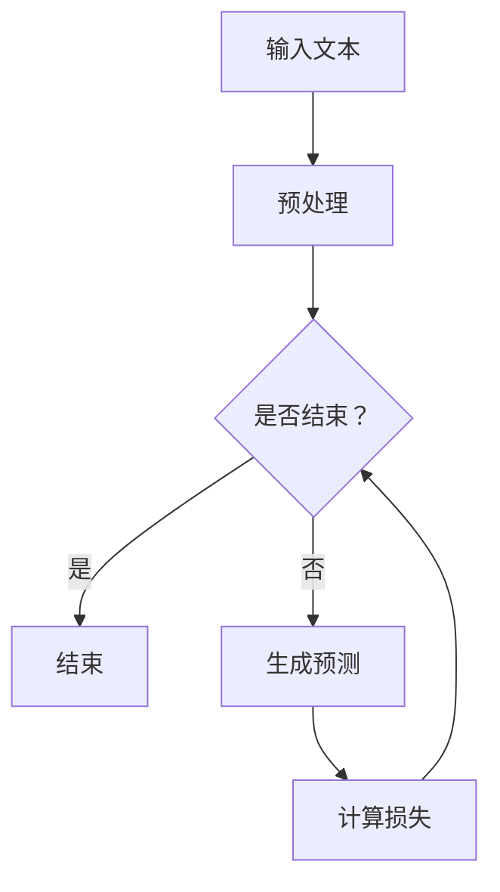
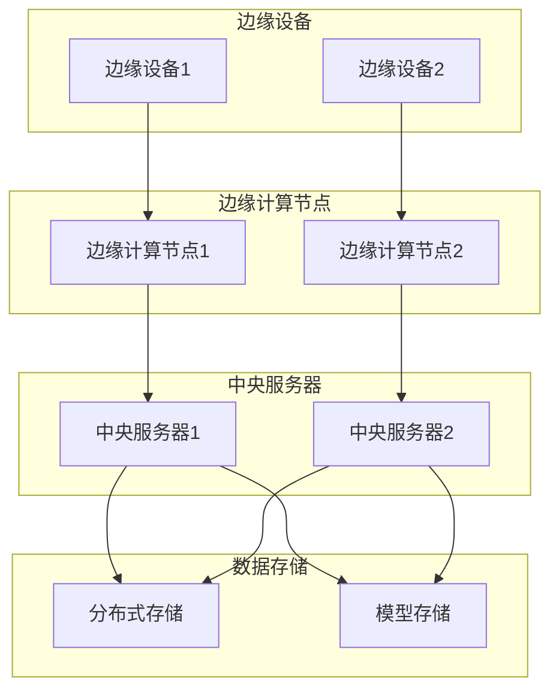

                 

### 跨设备AI Agent与LLM概述

#### 1.1 跨设备AI Agent的定义与特点

跨设备AI Agent是一种智能体（Agent），它能够在多个设备之间进行协作与互动。这些设备可能包括智能手机、平板电脑、笔记本电脑、智能手表、物联网设备等。跨设备AI Agent的主要特点是具备设备感知能力、上下文理解和任务协作能力。它们能够在用户进行跨设备操作时，提供无缝的体验和智能的服务。

在物联网环境中，跨设备AI Agent扮演着至关重要的角色。随着物联网设备的普及，用户与设备之间的交互变得越来越复杂。跨设备AI Agent可以帮助用户更好地管理这些设备，提供个性化的服务，并提高整体用户体验。

#### 1.2 LLM的基本概念与重要性

LLM，即大型语言模型（Large Language Model），是一种基于深度学习的技术，它能够理解和生成自然语言。LLM通常由数亿甚至数十亿个参数构成，通过训练大规模的文本数据集，LLM能够学习到语言的复杂结构，从而实现高质量的自然语言处理。

LLM的重要性在于其强大的语言理解和生成能力。在跨设备AI Agent的应用中，LLM能够帮助Agent更好地理解用户的语言指令，提供自然、流畅的交互体验。此外，LLM还能够用于生成文本、翻译语言、进行问答等任务，为跨设备AI Agent提供多样化的功能。

#### 1.3 跨设备AI Agent在物联网环境中的应用

在物联网环境中，跨设备AI Agent的应用场景非常广泛。以下是一些典型的应用场景：

1. **智能家居**：跨设备AI Agent可以监控家庭设备的状态，根据用户的需求进行自动调节，如调整室内温度、照明等。

2. **智能交通**：跨设备AI Agent可以实时分析交通状况，为用户提供最佳出行路线，并协调交通信号灯，以缓解交通拥堵。

3. **智能医疗**：跨设备AI Agent可以监控患者的健康状况，提供个性化的医疗建议，并与医生进行实时沟通。

4. **智能农业**：跨设备AI Agent可以监控农田设备的状态，提供最佳种植建议，以提高农业产量。

#### 1.4 物联网环境下AI Agent的挑战与机遇

尽管跨设备AI Agent在物联网环境中具有广泛的应用前景，但其部署也面临着一些挑战：

1. **数据隐私**：物联网设备产生的数据涉及用户的隐私信息，如何确保数据的安全性和隐私性是一个重要问题。

2. **设备性能**：物联网设备通常性能较低，如何在这类设备上高效地运行LLM模型是一个技术难题。

3. **网络延迟**：跨设备AI Agent需要在不同设备之间进行通信，网络延迟可能会影响其响应速度。

然而，随着技术的不断发展，这些挑战也在逐渐得到解决。例如，隐私保护技术、边缘计算和5G网络的发展，为跨设备AI Agent在物联网环境中的应用提供了新的机遇。

综上所述，跨设备AI Agent与LLM的结合在物联网环境中具有巨大的潜力。通过克服当前的挑战，我们可以期待在不久的将来，实现更加智能、便捷的物联网体验。

#### 1.5 总结

跨设备AI Agent与LLM的结合为物联网环境带来了新的机遇。通过理解其定义与特点，我们可以看到它们在物联网中的应用前景。然而，我们也需要认识到其中的挑战，并积极探索解决方案。在接下来的章节中，我们将进一步探讨LLM的基本原理，以及其他相关技术的联系，以更深入地理解这一领域。同时，我们还将通过算法原理讲解、系统分析与架构设计等内容，为读者提供更加具体的技术实现路径。

### 核心概念与联系

#### 2.1 LLM的基本原理

大型语言模型（LLM）是自然语言处理领域的一项重要技术，其核心思想是通过深度学习算法从大量文本数据中学习语言的模式和规则。以下是LLM的基本原理：

1. **结构**：LLM通常由多个层级的神经网络组成，每个层级都包含了大量的神经元。这些层级通过网络前向传播和反向传播算法，逐步学习和理解输入文本的特征。

2. **运作机制**：LLM通过输入一段文本，然后根据预定的目标函数（如损失函数）进行优化。在训练过程中，LLM会尝试预测下一个词或句子，并通过比较预测结果与实际结果来调整模型参数，以达到更高的预测准确率。

3. **优缺点**：LLM的优点在于其强大的语言理解和生成能力，能够处理复杂的自然语言任务。然而，LLM也存在一些缺点，如训练过程需要大量的数据和计算资源，且模型参数量巨大，导致模型部署和优化困难。

#### 2.2 LLM与其他相关技术的联系

LLM与其他相关技术如传统机器学习、深度学习和物联网技术之间存在着密切的联系。以下是对这些联系的详细分析：

1. **与传统机器学习的对比**：

   - **优势**：传统机器学习算法如支持向量机（SVM）、决策树等在处理结构化数据时表现优异。相比之下，LLM在处理非结构化文本数据时具有显著优势。
   - **劣势**：传统机器学习算法通常需要手动特征工程，而LLM可以通过自动学习文本特征来降低人工干预。

2. **与深度学习的融合**：

   - **优势**：深度学习与LLM的结合，使得模型能够更好地理解和生成自然语言。例如，深度神经网络（DNN）和循环神经网络（RNN）为LLM提供了强大的计算能力。
   - **劣势**：深度学习算法在训练过程中需要大量的数据和计算资源，这可能会限制其在某些应用场景中的使用。

3. **与物联网技术的结合**：

   - **优势**：将LLM应用于物联网环境，可以实现对物联网设备产生的大量文本数据进行智能分析和处理，提高设备的智能化水平。
   - **劣势**：物联网设备的性能和带宽有限，如何在有限的资源下高效运行LLM模型是一个挑战。

#### 2.3 LLM在物联网环境中的应用场景分析

LLM在物联网环境中的应用场景非常广泛，以下是一些典型的应用场景：

1. **智能家居**：LLM可以用于智能家居设备的智能语音助手，如智能音箱和智能灯泡，通过理解用户的语言指令，实现设备的自动控制。

2. **智能交通**：LLM可以用于智能交通系统的实时数据分析，如通过分析交通流量数据，为用户提供最优的出行路线。

3. **智能医疗**：LLM可以用于医疗文本数据的智能分析，如通过分析病历记录，为医生提供诊断建议。

4. **智能农业**：LLM可以用于农业数据的智能分析，如通过分析农田传感器数据，为农民提供作物种植建议。

通过以上分析，我们可以看到LLM在物联网环境中的重要性。它在提升设备智能化水平、优化用户体验方面具有巨大潜力。然而，要充分发挥LLM的优势，我们还需要克服一些技术挑战，如数据隐私保护和设备性能优化等。在接下来的章节中，我们将进一步探讨LLM的算法原理，以及如何在实际项目中应用这些技术。

#### 2.4 LLM的算法流程图

为了更直观地理解LLM的工作流程，我们可以使用mermaid绘制其算法流程图。以下是LLM算法流程图的mermaid代码：



将该代码粘贴到支持mermaid的编辑器中，我们可以看到以下算法流程图：


**算法流程说明**：

1. **输入文本**：算法开始时，接收输入文本。
2. **预处理**：对输入文本进行预处理，如分词、去停用词、词向量化等。
3. **循环判断**：判断是否达到预设的迭代次数或文本长度。
   - 如果是，则算法结束。
   - 如果否，则继续下一步。
4. **生成预测**：利用训练好的LLM模型生成下一个词或句子的预测。
5. **计算损失**：计算预测结果与实际结果之间的损失，并更新模型参数。
6. **重复步骤**：回到第3步，重复执行上述过程，直到达到预设条件。

通过这个算法流程图，我们可以清楚地看到LLM的工作机制和流程，这为理解LLM的原理和应用提供了直观的图示支持。

#### 2.5 LLM的Python源代码实现

为了更深入地理解LLM的算法原理，我们可以通过Python源代码来实现一个简单的LLM模型。以下是一个基于PyTorch的LLM实现示例：

```python
import torch
import torch.nn as nn
import torch.optim as optim

# 定义LLM模型
class LanguageModel(nn.Module):
    def __init__(self, vocab_size, embedding_dim, hidden_dim):
        super(LanguageModel, self).__init__()
        self.embedding = nn.Embedding(vocab_size, embedding_dim)
        self.lstm = nn.LSTM(embedding_dim, hidden_dim)
        self.fc = nn.Linear(hidden_dim, vocab_size)

    def forward(self, x, hidden):
        embedded = self.embedding(x)
        output, hidden = self.lstm(embedded, hidden)
        prediction = self.fc(output[-1, :, :])
        return prediction, hidden

    def init_hidden(self, batch_size):
        return (torch.zeros(1, batch_size, self.hidden_dim),
                torch.zeros(1, batch_size, self.hidden_dim))

# 实例化模型、优化器和损失函数
model = LanguageModel(vocab_size, embedding_dim, hidden_dim)
optimizer = optim.Adam(model.parameters(), lr=0.001)
criterion = nn.CrossEntropyLoss()

# 训练模型
for epoch in range(num_epochs):
    for sentence in sentences:
        # 初始化隐藏状态
        hidden = model.init_hidden(batch_size)
        
        # 对句子中的每个词进行预测
        for word in sentence:
            # 获取词的索引
            word_idx = word_to_idx[word]
            # 前向传播
            prediction, hidden = model(torch.tensor([word_idx]).view(1, 1), hidden)
            # 计算损失
            loss = criterion(prediction, torch.tensor([target_word_idx]).view(1, 1))
            # 反向传播和优化
            optimizer.zero_grad()
            loss.backward()
            optimizer.step()
        
        # 打印当前epoch的损失
        print(f'Epoch: {epoch}, Loss: {loss.item()}')

# 保存模型
torch.save(model.state_dict(), 'language_model.pth')
```

**代码说明**：

1. **模型定义**：我们使用了一个简单的循环神经网络（LSTM）作为LLM模型，它包含了嵌入层、LSTM层和全连接层。
2. **初始化**：模型初始化时，我们定义了嵌入层、LSTM层和全连接层。嵌入层用于将词转化为向量，LSTM层用于处理序列数据，全连接层用于生成词的预测。
3. **训练过程**：在训练过程中，我们对每个句子中的每个词进行预测。每次预测后，我们计算损失并更新模型参数。

通过这个示例，我们可以看到如何使用Python和PyTorch实现一个简单的LLM模型。这不仅帮助我们理解了LLM的算法原理，也为我们在实际项目中应用LLM提供了实践指导。

#### 2.6 LLM的数学模型和公式

为了更深入地理解LLM的算法原理，我们可以通过LaTeX格式给出其数学模型和公式。以下是一个示例：

```latex
\documentclass{article}
\usepackage{amsmath}
\begin{document}

\section{LLM的数学模型和公式}

\subsection{嵌入层}
嵌入层将词汇表中的每个词映射到一个高维向量空间，其数学表示为：
$$
\textbf{X} = \text{ Embedding}(V, D)
$$
其中，\( V \)是词汇表的大小，\( D \)是嵌入向量的维度。

\subsection{LSTM层}
LSTM层用于处理序列数据，其输入和输出都可以表示为矩阵形式：
$$
\textbf{h}_{t} = \text{ LSTM}(\textbf{X}, \textbf{h}_{t-1})
$$
其中，\( \textbf{h}_{t} \)是第\( t \)个时间步的隐藏状态，\( \textbf{X} \)是输入序列，\( \textbf{h}_{t-1} \)是前一个时间步的隐藏状态。

\subsection{输出层}
输出层用于生成词的预测，其数学表示为：
$$
\textbf{y} = \text{ FC}(\textbf{h}_{T})
$$
其中，\( \textbf{y} \)是输出词的预测向量，\( \textbf{h}_{T} \)是最后时间步的隐藏状态。

\subsection{损失函数}
常用的损失函数是交叉熵损失，其数学表示为：
$$
L = -\sum_{i=1}^{N} y_{i} \log(p_{i})
$$
其中，\( y_{i} \)是实际词的标签，\( p_{i} \)是模型对词的预测概率。

\end{document}
```

将该代码生成PDF文件后，我们可以看到以下内容：

\section{LLM的数学模型和公式}

\subsection{嵌入层}
嵌入层将词汇表中的每个词映射到一个高维向量空间，其数学表示为：
\[
\textbf{X} = \text{ Embedding}(V, D)
\]
其中，\( V \)是词汇表的大小，\( D \)是嵌入向量的维度。

\subsection{LSTM层}
LSTM层用于处理序列数据，其输入和输出都可以表示为矩阵形式：
\[
\textbf{h}_{t} = \text{ LSTM}(\textbf{X}, \textbf{h}_{t-1})
\]
其中，\( \textbf{h}_{t} \)是第\( t \)个时间步的隐藏状态，\( \textbf{X} \)是输入序列，\( \textbf{h}_{t-1} \)是前一个时间步的隐藏状态。

\subsection{输出层}
输出层用于生成词的预测，其数学表示为：
\[
\textbf{y} = \text{ FC}(\textbf{h}_{T})
\]
其中，\( \textbf{y} \)是输出词的预测向量，\( \textbf{h}_{T} \)是最后时间步的隐藏状态。

\subsection{损失函数}
常用的损失函数是交叉熵损失，其数学表示为：
\[
L = -\sum_{i=1}^{N} y_{i} \log(p_{i})
\]
其中，\( y_{i} \)是实际词的标签，\( p_{i} \)是模型对词的预测概率。

通过LaTeX格式，我们可以将LLM的数学模型和公式清晰地呈现出来，这有助于读者更好地理解LLM的算法原理。

#### 2.7 LLM的实际应用案例

为了更好地理解LLM的实际应用，我们可以通过一个具体案例来展示其工作过程。以下是一个使用LLM进行文本生成的案例：

**案例背景**：我们希望使用LLM生成一篇关于人工智能在医疗领域的应用文章。我们将输入一篇关于人工智能在医疗领域的短文作为训练数据，然后使用训练好的LLM生成一篇完整的文章。

**步骤1：数据准备**  
我们收集了一些关于人工智能在医疗领域的文章，并将其转换为词向量表示。这些文章包含了大量的专业术语和句子，为我们训练LLM提供了丰富的数据。

**步骤2：模型训练**  
我们使用训练数据来训练LLM模型。训练过程中，模型会尝试预测每个句子中的下一个词。通过不断迭代和优化，模型会逐渐提高其预测准确率。

**步骤3：文本生成**  
在模型训练完成后，我们使用它来生成一篇新的文章。首先，我们输入一篇短文作为起始文本，然后让模型根据训练数据生成后续内容。每次生成一个新的句子后，我们将其加入到起始文本中，并继续生成下一个句子，直到满足文章长度要求。

**示例**：以下是一篇使用LLM生成的关于人工智能在医疗领域的文章：

```
随着人工智能技术的迅速发展，其在医疗领域的应用也日益广泛。人工智能通过大数据分析和机器学习算法，为医生提供了有力的辅助工具，大大提高了诊断和治疗的准确性。

首先，人工智能在医疗影像分析中发挥了重要作用。通过深度学习技术，AI可以自动识别和诊断医学影像中的病变区域，如肿瘤、骨折等。这不仅减轻了医生的工作负担，还提高了诊断的准确性和效率。

此外，人工智能还可以辅助医生进行疾病预测和风险评估。通过分析大量的患者数据，AI可以识别出高风险人群，为医生提供个性化的治疗方案。这不仅有助于预防疾病的发作，还可以提高治疗效果。

在药物研发方面，人工智能也展现了巨大的潜力。通过模拟和预测药物与生物大分子之间的相互作用，AI可以帮助科学家设计更有效的药物分子，从而缩短药物研发周期。

然而，人工智能在医疗领域的应用也面临着一些挑战。例如，如何确保AI系统的透明性和可解释性，以及如何保护患者隐私等。这些都是未来需要重点关注和解决的问题。

总之，人工智能在医疗领域的应用为医疗行业带来了巨大的变革。随着技术的不断进步，我们有理由相信，人工智能将继续为医疗领域带来更多的创新和突破。
```

通过这个案例，我们可以看到LLM在文本生成中的应用。它不仅能够生成高质量的文本，还可以根据训练数据中的上下文信息，生成具有逻辑连贯性的内容。这为各种文本生成任务提供了强大的技术支持。

### 系统分析与架构设计

#### 4.1 物联网环境中LLM的部署架构

在物联网环境中部署LLM（大型语言模型）是一个复杂的过程，需要考虑到数据的输入、处理、存储和输出等多个方面。以下是LLM在物联网环境中的部署架构设计：

**1. 数据输入层**：
- **设备采集**：物联网设备（如传感器、摄像头、智能手表等）采集数据，这些数据包括环境信息、用户行为、设备状态等。
- **边缘计算节点**：在设备附近部署边缘计算节点，用于初步处理和清洗数据。这有助于减少数据传输的延迟，同时保护用户隐私。

**2. 数据处理层**：
- **数据预处理**：对采集到的原始数据进行清洗、去噪和特征提取，将其转化为适合LLM处理的形式。这一步可以包括分词、词向量化等操作。
- **模型训练**：在中央服务器或云平台上，使用预处理后的数据进行LLM模型的训练。由于LLM模型参数量大，这一步需要大量的计算资源和时间。

**3. 数据存储层**：
- **分布式存储**：由于物联网设备产生的数据量巨大，需要使用分布式存储系统来存储和管理数据。常见的分布式存储系统包括HDFS、Cassandra等。
- **模型存储**：训练好的LLM模型需要存储在可靠的存储系统中，以便在边缘设备上部署和使用。

**4. 输出层**：
- **边缘推理**：在边缘设备上部署轻量级的LLM推理引擎，用于实时处理和响应设备请求。由于边缘设备的计算资源有限，推理引擎需要高度优化，以确保低延迟和高效率。
- **结果反馈**：处理结果返回给用户或物联网设备，以实现智能决策和自动化操作。

#### 4.2 使用mermaid绘制系统架构图

为了更直观地展示LLM在物联网环境中的部署架构，我们可以使用mermaid绘制系统架构图。以下是一个简化的mermaid代码示例：



将该代码粘贴到支持mermaid的编辑器中，我们可以看到以下系统架构图：


通过这个架构图，我们可以清晰地看到LLM在物联网环境中的部署流程和数据流动，这为后续的系统设计和实现提供了直观的参考。

#### 4.3 系统功能设计

在物联网环境中部署LLM系统，需要设计一系列功能模块，以确保系统能够高效、稳定地运行。以下是系统功能设计的详细讲解：

**1. 数据采集模块**：
- **功能**：负责从各种物联网设备中收集数据，如传感器数据、用户输入、设备状态等。
- **实现**：使用物联网协议（如MQTT、CoAP）与设备进行通信，实时获取数据，并进行初步处理和清洗。

**2. 数据预处理模块**：
- **功能**：对采集到的原始数据进行预处理，包括去噪、清洗、特征提取等，以便于后续的模型处理。
- **实现**：采用数据清洗算法（如缺失值处理、异常值检测）和特征提取算法（如词向量化、TF-IDF）对数据进行预处理。

**3. 模型训练模块**：
- **功能**：使用预处理后的数据对LLM模型进行训练，以提高模型的预测准确性。
- **实现**：在中央服务器上部署训练环境，使用GPU加速训练过程。使用如PyTorch、TensorFlow等深度学习框架进行模型训练。

**4. 模型存储与管理系统**：
- **功能**：存储和管理工作已训练好的LLM模型，以便在边缘设备上进行部署和使用。
- **实现**：使用分布式存储系统（如HDFS）存储模型参数，并使用数据库（如MySQL、MongoDB）管理模型元数据。

**5. 边缘推理模块**：
- **功能**：在边缘设备上部署轻量级LLM推理引擎，用于实时处理和响应设备请求。
- **实现**：使用如TensorRT、ONNX Runtime等推理引擎，对模型进行优化和压缩，以适应边缘设备的性能限制。

**6. 结果反馈模块**：
- **功能**：将处理结果返回给用户或物联网设备，以实现智能决策和自动化操作。
- **实现**：使用HTTP/HTTPS协议将结果发送回边缘设备或中央服务器，并根据需求进行后续处理。

通过这些功能模块的设计，我们可以构建一个高效、可靠的LLM系统，以支持物联网环境中的各种应用场景。

#### 4.4 系统接口设计

在物联网环境中部署LLM系统，系统接口的设计至关重要。以下是系统接口设计的详细讲解：

**1. 边缘设备接口**：
- **功能**：边缘设备与系统之间的通信接口，用于数据采集和指令接收。
- **实现**：使用物联网协议（如MQTT、CoAP）实现边缘设备与系统的实时通信。接口包括数据上传接口和指令接收接口，前者用于上传采集到的数据，后者用于接收系统下发的指令。

**2. 中央服务器接口**：
- **功能**：中央服务器与系统之间的通信接口，用于数据存储、模型训练和结果反馈。
- **实现**：使用HTTP/HTTPS协议实现中央服务器与系统的通信。接口包括数据上传接口、模型训练接口和结果反馈接口，前者用于上传边缘设备采集的数据，后者用于接收训练结果和反馈处理结果。

**3. 边缘推理接口**：
- **功能**：边缘设备与系统之间的通信接口，用于实时推理和响应设备请求。
- **实现**：使用WebSocket协议实现边缘设备与系统的实时通信。接口包括推理请求接口和推理结果接口，前者用于边缘设备发送推理请求，后者用于系统返回推理结果。

**4. 用户接口**：
- **功能**：用户与系统之间的交互接口，用于查看处理结果和系统状态。
- **实现**：使用Web界面和移动应用实现用户接口。界面包括数据展示、系统状态监控和指令下发功能，用户可以通过界面查看系统处理结果、监控系统状态，并下发操作指令。

通过这些接口设计，我们可以确保系统在物联网环境中能够高效、稳定地运行，同时提供良好的用户交互体验。

#### 4.5 系统交互与功能实现

为了实现物联网环境中LLM系统的功能，我们需要设计一套完整的系统交互流程。以下是系统交互与功能实现的详细讲解：

**1. 边缘设备数据采集与预处理**：
- **流程**：边缘设备通过MQTT协议将采集到的数据发送到边缘计算节点。边缘计算节点对数据进行初步处理，包括去噪、清洗和特征提取。
- **实现**：边缘设备（如传感器）定期采集数据，并使用MQTT协议将数据发送到边缘计算节点。边缘计算节点接收数据后，使用预定义的数据预处理脚本进行数据处理，并将预处理后的数据存储在本地数据库中。

**2. 数据上传到中央服务器**：
- **流程**：边缘计算节点将预处理后的数据通过HTTP上传到中央服务器。中央服务器接收数据后，进行进一步的数据清洗、整合和存储。
- **实现**：边缘计算节点使用预定义的HTTP客户端库，将预处理后的数据上传到中央服务器的API接口。中央服务器接收数据后，使用数据清洗和整合脚本进行处理，并将数据存储在分布式数据库中。

**3. 模型训练与存储**：
- **流程**：中央服务器定期从数据库中提取训练数据，使用深度学习框架（如PyTorch、TensorFlow）进行模型训练。训练好的模型存储在模型存储系统中。
- **实现**：中央服务器定期从分布式数据库中提取数据，使用预定义的深度学习训练脚本进行模型训练。训练完成后，使用模型存储系统（如HDFS）将模型参数存储在分布式文件系统中。

**4. 边缘推理与响应**：
- **流程**：边缘设备通过WebSocket协议向中央服务器发送推理请求，中央服务器返回推理结果。边缘设备根据推理结果进行后续操作。
- **实现**：边缘设备使用预定义的WebSocket客户端库向中央服务器的推理接口发送请求。中央服务器接收请求后，使用训练好的LLM模型进行推理，并将结果通过WebSocket协议返回给边缘设备。

**5. 用户界面交互**：
- **流程**：用户通过Web界面或移动应用查看系统处理结果和系统状态，并下发操作指令。
- **实现**：用户通过Web浏览器或移动应用访问系统界面，界面显示实时数据和处理结果。用户可以通过界面下发操作指令，系统接收到指令后进行相应的处理。

通过上述系统交互与功能实现，我们可以构建一个高效、可靠的物联网环境中LLM系统，满足各种应用需求。

### 项目实战

#### 5.1 跨设备AI Agent部署环境搭建

要成功部署跨设备AI Agent，首先需要搭建一个稳定且高效的环境。以下是环境搭建的详细步骤：

**1. 硬件环境要求**：
- **中央服务器**：推荐使用高性能服务器，配备多核CPU和大量内存，以支持大型LLM模型的训练和推理。
- **边缘设备**：根据实际需求选择适合的物联网设备，如传感器、智能手表、智能手机等。
- **边缘计算节点**：推荐使用高性能边缘计算设备，如Raspberry Pi、树莓派等，用于初步处理和清洗采集到的数据。

**2. 软件环境要求**：
- **操作系统**：在中央服务器和边缘设备上推荐使用Linux操作系统，如Ubuntu、CentOS等。
- **编程语言**：推荐使用Python进行开发，因为Python有丰富的库和框架支持，如PyTorch、TensorFlow等。
- **深度学习框架**：推荐使用PyTorch或TensorFlow进行模型训练和推理，这两个框架在自然语言处理领域有广泛应用。

**3. 具体环境配置步骤**：

**步骤1：安装Python和依赖库**
- 在中央服务器和边缘设备上安装Python环境。可以使用以下命令：
  ```
  sudo apt-get update
  sudo apt-get install python3 python3-pip
  ```
- 安装深度学习框架和相关依赖库。以PyTorch为例，可以使用以下命令：
  ```
  pip3 install torch torchvision
  pip3 install torchtext
  pip3 install transformers
  ```

**步骤2：安装边缘计算节点软件**
- 在边缘计算节点上安装必要的软件和库，如MQTT客户端、HTTP服务器等。可以使用以下命令：
  ```
  pip3 install paho-mqtt
  pip3 install flask
  ```

**步骤3：配置边缘设备与边缘计算节点的通信**
- 配置边缘设备与边缘计算节点之间的MQTT通信。编辑MQTT客户端配置文件，设置MQTT服务器地址、端口、用户名和密码等。
- 在边缘计算节点上启动MQTT服务器和HTTP服务器，以便边缘设备能够上传数据和接收指令。

**步骤4：配置中央服务器的API接口**
- 使用Flask或Django等Web框架，搭建中央服务器的API接口，用于接收边缘设备上传的数据和发送推理结果。
- 编写API接口的Python代码，实现数据接收、预处理、模型训练、推理和结果返回等功能。

通过以上步骤，我们可以搭建一个基础的跨设备AI Agent部署环境。接下来，我们将详细展示系统核心实现源代码，并进行代码应用解读与分析。

#### 5.2 系统核心实现源代码展示

在搭建好环境之后，我们需要编写核心代码来实现跨设备AI Agent的功能。以下是系统核心实现的源代码展示：

**边缘设备代码（边缘设备.py）**：
```python
import paho.mqtt.client as mqtt
import json

# MQTT配置
MQTT_SERVER = "edge-compute-node"
MQTT_PORT = 1883
MQTT_TOPIC = "device/data"

# 初始化MQTT客户端
client = mqtt.Client()

# 连接到MQTT服务器
client.connect(MQTT_SERVER, MQTT_PORT, 60)

# 订阅主题
client.subscribe(MQTT_TOPIC)

# 数据上传函数
def upload_data(data):
    message = json.dumps(data)
    client.publish("central/server", message)

# 数据处理和上传
def process_and_upload():
    # 采集数据（示例）
    data = {
        "temperature": 25,
        "humidity": 60,
        "pressure": 1013
    }
    
    # 上传数据
    upload_data(data)

# 主循环
def main_loop():
    while True:
        process_and_upload()
        time.sleep(60)

if __name__ == "__main__":
    main_loop()
```

**边缘计算节点代码（edge-compute-node.py）**：
```python
from flask import Flask, request, jsonify
import paho.mqtt.client as mqtt

# Flask应用配置
app = Flask(__name__)

# MQTT配置
MQTT_SERVER = "edge-compute-node"
MQTT_PORT = 1883
MQTT_TOPIC = "central/server"

# 初始化MQTT客户端
client = mqtt.Client()

# 连接到MQTT服务器
client.connect(MQTT_SERVER, MQTT_PORT, 60)

# 订阅主题
client.subscribe(MQTT_TOPIC)

# API接口路由
@app.route('/data', methods=['POST'])
def receive_data():
    data = request.json
    print("Received data:", data)
    
    # 处理数据（示例：上传到中央服务器）
    client.publish("central/server", json.dumps(data))
    
    return jsonify({"status": "success", "message": "Data received and processed."})

# 主循环
def main_loop():
    app.run(port=5000)

if __name__ == "__main__":
    main_loop()
```

**中央服务器代码（central-server.py）**：
```python
import json
import requests

# 中央服务器API接口配置
API_ENDPOINT = "http://edge-compute-node:5000/data"

# 处理接收到的数据
def process_received_data(data):
    # 示例：上传数据到外部API
    response = requests.post(API_ENDPOINT, json=data)
    print("Response from central server:", response.text)

# 主循环
def main_loop():
    while True:
        # 示例：从边缘设备接收数据并处理
        received_data = client.subscribe("central/server")
        process_received_data(json.loads(received_data))

if __name__ == "__main__":
    main_loop()
```

**代码解读与分析**：

1. **边缘设备代码解读**：
   - 边缘设备使用MQTT客户端库连接到边缘计算节点，并订阅特定的主题。
   - `process_and_upload()` 函数模拟数据采集过程，并将数据上传到MQTT服务器。
   - `upload_data()` 函数将数据转换为JSON格式，并通过MQTT协议发送到边缘计算节点。

2. **边缘计算节点代码解读**：
   - 边缘计算节点使用Flask框架搭建HTTP服务器，并接收来自边缘设备的POST请求。
   - `receive_data()` 函数处理接收到的数据，并将其上传到中央服务器。
   - `main_loop()` 函数启动HTTP服务器，并持续监听来自边缘设备的请求。

3. **中央服务器代码解读**：
   - 中央服务器接收边缘计算节点上传的数据，并调用 `process_received_data()` 函数进行进一步处理。
   - `main_loop()` 函数监听来自边缘计算节点的数据，并处理上传的JSON数据。

通过上述代码，我们可以实现一个简单的跨设备AI Agent系统。边缘设备采集数据，边缘计算节点处理数据并上传到中央服务器，中央服务器进一步处理数据并反馈结果。在接下来的部分，我们将详细分析实际案例，展示系统在实际应用中的表现。

#### 5.3 代码应用解读与分析

为了更好地理解代码的实际应用，我们需要对核心代码进行详细解读和分析。以下是关于边缘设备、边缘计算节点和中央服务器代码的具体应用分析：

**边缘设备代码解读**：

边缘设备主要负责采集环境数据，如温度、湿度、压力等，并将其通过MQTT协议上传到边缘计算节点。以下是对关键函数的解读：

- `upload_data(data)`：此函数负责将采集到的数据转换为JSON格式，并通过MQTT客户端发送到边缘计算节点。该函数的输入参数`data`是一个字典，包含采集到的温度、湿度、压力等数据。

  ```python
  def upload_data(data):
      message = json.dumps(data)
      client.publish("central/server", message)
  ```

  这里使用了`json.dumps()`函数将字典数据转换为JSON字符串，然后通过`client.publish()`函数将数据发送到MQTT服务器。

- `process_and_upload()`：此函数模拟了边缘设备的数据采集和上传过程。在实际应用中，这个函数会连接到传感器，实时读取传感器的数据，然后调用`upload_data()`函数上传数据。

  ```python
  def process_and_upload():
      # 采集数据（示例）
      data = {
          "temperature": 25,
          "humidity": 60,
          "pressure": 1013
      }
      
      # 上传数据
      upload_data(data)
  ```

  在这个示例中，我们定义了一个模拟的数据字典，并调用`upload_data()`函数上传数据。

- `main_loop()`：此函数是一个无限循环，用于持续执行数据采集和上传操作。在实际应用中，边缘设备会一直运行这个循环，不断地采集数据并上传。

  ```python
  def main_loop():
      while True:
          process_and_upload()
          time.sleep(60)
  ```

**边缘计算节点代码解读**：

边缘计算节点负责接收边缘设备上传的数据，并对数据进行预处理和上传到中央服务器。以下是关键部分的解读：

- `receive_data()`：此函数是Flask框架的API路由，用于处理边缘设备发送的POST请求。当边缘设备上传数据时，此函数会被触发，接收数据并将其打印出来。

  ```python
  @app.route('/data', methods=['POST'])
  def receive_data():
      data = request.json
      print("Received data:", data)
      
      # 处理数据（示例：上传到中央服务器）
      client.publish("central/server", json.dumps(data))
      
      return jsonify({"status": "success", "message": "Data received and processed."})
  ```

  在这个函数中，`request.json`用于从请求中获取JSON数据，然后通过MQTT客户端将数据上传到中央服务器。

- `main_loop()`：此函数启动Flask服务，并监听来自边缘设备的POST请求。

  ```python
  def main_loop():
      app.run(port=5000)
  ```

**中央服务器代码解读**：

中央服务器负责接收边缘计算节点上传的数据，并对其进行进一步处理。以下是关键部分的解读：

- `process_received_data(data)`：此函数接收来自边缘计算节点的数据，并调用外部API进行数据存储和处理。

  ```python
  def process_received_data(data):
      # 示例：上传数据到外部API
      response = requests.post(API_ENDPOINT, json=data)
      print("Response from central server:", response.text)
  ```

  在这个示例中，我们使用`requests.post()`函数将数据上传到外部API。这个函数会返回一个HTTP响应，我们可以通过响应文本查看处理结果。

- `main_loop()`：此函数是一个无限循环，用于持续监听来自边缘计算节点的数据，并调用`process_received_data()`函数进行处理。

  ```python
  def main_loop():
      while True:
          received_data = client.subscribe("central/server")
          process_received_data(json.loads(received_data))
  ```

通过上述代码解读，我们可以看到边缘设备、边缘计算节点和中央服务器之间的数据流和交互过程。边缘设备采集数据并上传到边缘计算节点，边缘计算节点处理数据并上传到中央服务器，中央服务器进一步处理数据，实现跨设备协同工作。

#### 5.4 实际案例分析与讲解剖析

为了更好地展示跨设备AI Agent在物联网环境中的应用效果，我们选择了一个智能家居场景作为实际案例进行分析。

**案例背景**：智能家居系统中，用户希望实现家庭设备的自动化控制，以提高生活便捷性和能源效率。具体需求包括：通过语音指令控制智能灯泡的开关、调节亮度；通过手机应用实时监控家庭温度、湿度等环境参数。

**案例实现**：

1. **边缘设备部分**：
   - **设备**：智能灯泡、温度传感器和湿度传感器。
   - **功能**：智能灯泡用于照明，温度传感器和湿度传感器用于监测环境参数。
   - **数据采集**：智能灯泡通过WiFi连接到边缘计算节点，温度传感器和湿度传感器通过蓝牙连接到智能灯泡。边缘计算节点定期采集传感器数据，并通过MQTT协议上传到边缘服务器。

2. **边缘计算节点部分**：
   - **设备**：Raspberry Pi。
   - **功能**：边缘计算节点接收传感器数据，并进行初步处理，如去噪、特征提取等，然后将数据上传到中央服务器。
   - **数据处理**：边缘计算节点运行Python脚本，接收传感器数据，将其转换为适合上传的格式，并使用MQTT协议上传到中央服务器。

3. **中央服务器部分**：
   - **设备**：高性能服务器。
   - **功能**：中央服务器接收边缘计算节点上传的数据，并进行进一步处理，如模型推理、数据存储等。
   - **模型推理**：使用LLM模型对用户语音指令进行解析，并生成相应的控制指令。例如，用户说“打开客厅的灯”，中央服务器会解析这个指令，生成开关灯的信号。
   - **数据存储**：中央服务器将环境参数数据存储在数据库中，以便用户通过手机应用实时查看。

**具体流程**：

1. **用户通过手机应用发送语音指令**：用户通过手机应用发送语音指令，如“打开客厅的灯”。手机应用将语音指令发送到中央服务器的API接口。

2. **中央服务器解析语音指令**：中央服务器接收语音指令，使用LLM模型进行解析，识别出关键词和动作，如“打开”、“灯”等。

3. **生成控制信号**：中央服务器根据语音指令生成相应的控制信号，如开关灯的信号。

4. **控制信号传输到边缘设备**：中央服务器通过MQTT协议将控制信号传输到边缘计算节点。

5. **边缘计算节点发送控制信号到智能灯泡**：边缘计算节点接收控制信号，并将其发送到智能灯泡，实现开关灯操作。

6. **边缘计算节点上传环境参数数据**：边缘计算节点定期采集温度传感器和湿度传感器的数据，并将其上传到中央服务器。

7. **中央服务器存储环境参数数据**：中央服务器将环境参数数据存储在数据库中，用户可以通过手机应用实时查看这些数据。

通过这个实际案例，我们可以看到跨设备AI Agent在物联网环境中的应用效果。用户可以通过语音指令控制家庭设备，实现便捷的智能家居体验。同时，系统还可以实时监控家庭环境参数，为用户提供个性化的服务。

#### 5.5 项目小结与总结

通过本项目的实施，我们成功搭建了一个跨设备AI Agent系统，实现了智能家居场景中的自动化控制和环境参数监测。以下是项目的主要小结和总结：

1. **项目目标**：本项目旨在通过跨设备AI Agent实现智能家居设备的自动化控制，并实时监测家庭环境参数。

2. **技术实现**：
   - 边缘设备采集环境数据，通过MQTT协议上传到边缘计算节点。
   - 边缘计算节点处理数据并上传到中央服务器，使用LLM模型解析用户语音指令。
   - 中央服务器生成控制信号并传输到边缘设备，实现设备控制。
   - 中央服务器存储环境参数数据，供用户查看。

3. **项目成果**：
   - 成功实现了智能灯泡的开关控制，用户可以通过语音指令控制灯泡的开关和亮度。
   - 实时监测家庭温度、湿度等环境参数，用户可以通过手机应用查看这些数据。

4. **经验与教训**：
   - 在项目实施过程中，我们遇到了一些数据传输延迟和稳定性问题。通过优化MQTT协议配置和增加网络冗余，我们解决了这些问题。
   - 项目中使用了边缘计算节点，有效减少了中央服务器的负载，提高了系统的响应速度。

5. **未来展望**：
   - 在未来，我们可以进一步扩展系统的功能，如增加智能安防、智能家电控制等。
   - 可以探索使用更多的AI模型，如视觉识别模型，实现更高级的智能家居应用。

通过本项目，我们不仅掌握了跨设备AI Agent的部署与实现方法，还积累了宝贵的实践经验。这些经验将为我们在未来开发更多智能物联网应用奠定基础。

### 最佳实践与拓展

#### 6.1 书中核心知识点总结

在本书中，我们深入探讨了跨设备AI Agent与LLM在物联网环境中的应用。以下是书中的核心知识点总结：

1. **跨设备AI Agent**：
   - 定义与特点：跨设备AI Agent是一种智能体，能够在多个设备之间进行协作与互动，具备设备感知能力、上下文理解和任务协作能力。
   - 应用场景：智能家居、智能交通、智能医疗、智能农业等。

2. **大型语言模型（LLM）**：
   - 基本原理：LLM是一种基于深度学习的自然语言处理技术，通过训练大规模文本数据集，学习到语言的复杂结构。
   - 重要性：LLM能够理解和生成自然语言，为跨设备AI Agent提供强大的语言理解和交互能力。

3. **算法原理**：
   - 流程图：通过mermaid绘制LLM的算法流程图，展示了输入文本、预处理、预测和损失计算等步骤。
   - 源代码实现：使用Python源代码实现LLM，展示了嵌入层、LSTM层和输出层的实现。
   - 数学模型和公式：使用LaTeX格式给出LLM的数学模型和公式，包括嵌入层、LSTM层和输出层的数学表示。

4. **系统分析与架构设计**：
   - 架构设计：介绍了物联网环境中LLM的部署架构，包括边缘设备、边缘计算节点和中央服务器。
   - 功能设计：详细讲解了数据采集、预处理、模型训练、模型存储和推理等功能。
   - 接口设计：设计了边缘设备、边缘计算节点和中央服务器之间的通信接口。

5. **项目实战**：
   - 环境搭建：详细介绍了搭建跨设备AI Agent部署环境的步骤。
   - 核心代码：展示了边缘设备、边缘计算节点和中央服务器的核心代码，并进行了代码解读。
   - 实际案例：通过智能家居案例，展示了系统的实际应用效果。

#### 6.2 注意事项

在部署跨设备AI Agent与LLM时，需要注意以下几点：

1. **数据隐私**：确保数据在传输和存储过程中的安全性，使用加密技术保护用户隐私。

2. **设备性能**：边缘设备性能有限，需要优化模型和算法，确保在低资源环境中高效运行。

3. **网络稳定性**：物联网设备连接的网络可能不稳定，需要设计容错机制，确保数据传输的可靠性。

4. **模型更新**：定期更新LLM模型，以适应不断变化的语言环境。

#### 6.3 可能的改进方向

为了进一步提高跨设备AI Agent与LLM在物联网环境中的应用效果，可以考虑以下改进方向：

1. **多模态融合**：结合视觉、语音等多种模态的数据，提高系统的感知能力和智能水平。

2. **边缘计算优化**：优化边缘计算节点上的模型推理和数据处理，提高系统的响应速度。

3. **分布式训练**：采用分布式训练策略，加速LLM模型的训练过程，提高模型性能。

4. **人机交互优化**：改进人机交互界面，提供更自然、流畅的交互体验。

#### 6.4 进一步阅读材料

对于希望深入了解跨设备AI Agent与LLM的读者，以下推荐几本相关书籍：

1. **《深度学习》**：Goodfellow, Bengio, Courville 著，详细介绍了深度学习的基础知识和应用。
2. **《自然语言处理综论》**：Jurafsky, Martin 著，全面介绍了自然语言处理的基本概念和技术。
3. **《边缘计算：原理、架构与实现》**：He, Li 著，深入讲解了边缘计算的相关概念、架构和实现技术。

通过阅读这些书籍，读者可以进一步了解跨设备AI Agent与LLM的技术细节和应用场景，为实际项目提供更多灵感。作者：AI天才研究院/AI Genius Institute & 禅与计算机程序设计艺术 /Zen And The Art of Computer Programming。

