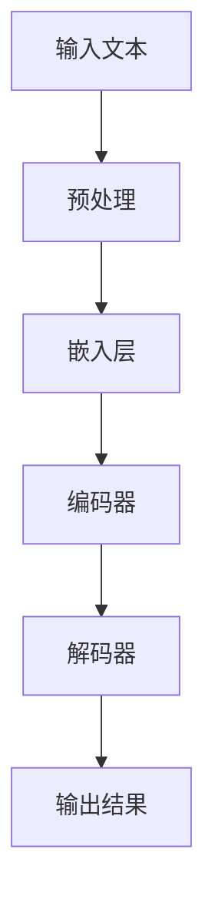
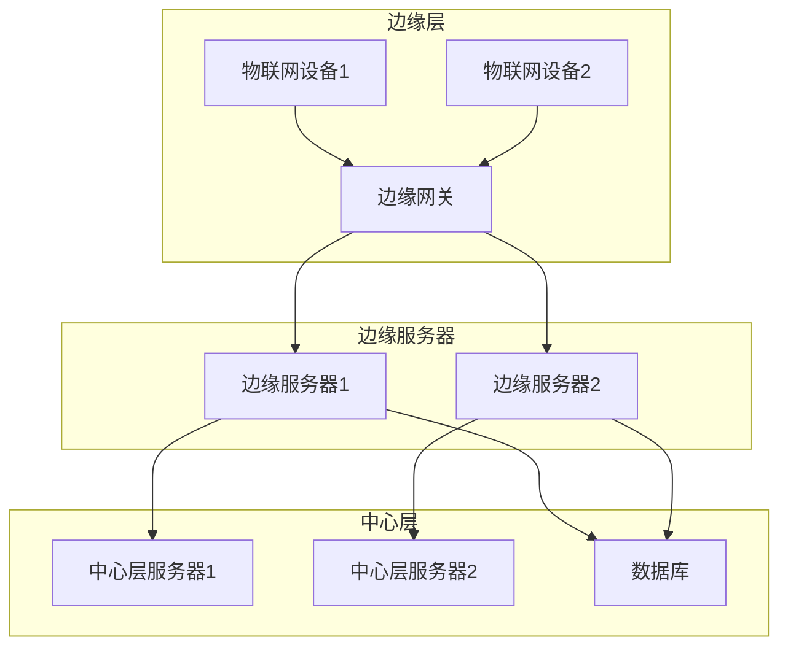

                 

### 第1章: 跨设备AI Agent与LLM概述

#### 1.1 跨设备AI Agent的定义与特点

跨设备AI Agent，即分布式人工智能代理，是一种能够在多个设备间协同工作，实现智能决策和任务执行的系统。它结合了人工智能与物联网技术，突破了单设备计算的局限，实现了多设备间的资源共享和任务协同。

跨设备AI Agent的特点包括：

1. **分布性**：AI Agent可以在多个设备上分布，实现任务的分解和执行。
2. **协同性**：AI Agent之间可以相互协作，共享信息和资源，提高整体智能水平。
3. **适应性**：AI Agent可以根据环境变化和任务需求，动态调整自身的策略和行为。
4. **自组织性**：AI Agent可以自主地建立和维护网络连接，实现自组织和自修复。

#### 1.2 LLM的基本概念与重要性

LLM（Large Language Model），即大型语言模型，是一种基于深度学习技术构建的机器学习模型，它通过训练海量文本数据，学习语言的统计规律和语义理解能力，从而实现文本生成、翻译、问答等多种语言处理任务。

LLM的重要性体现在：

1. **强大的语言理解能力**：LLM可以处理和理解复杂的自然语言文本，实现高效的语言理解和生成。
2. **广泛的应用场景**：LLM在文本生成、问答系统、机器翻译、自然语言处理等多个领域都有广泛应用。
3. **推动人工智能发展**：LLM的出现推动了人工智能技术的进步，为人工智能应用提供了新的思路和方向。

#### 1.3 跨设备AI Agent在物联网环境中的重要性

在物联网环境下，跨设备AI Agent具有以下几个重要性：

1. **增强智能化**：通过跨设备协同，AI Agent可以实现对复杂任务的智能决策和执行，提高系统的整体智能化水平。
2. **降低通信成本**：跨设备AI Agent可以在本地设备上进行部分计算，减少网络通信负担，降低通信成本。
3. **提高响应速度**：在物联网环境下，跨设备AI Agent可以快速响应环境变化和用户需求，提高系统的响应速度。
4. **扩展应用场景**：跨设备AI Agent可以应用于智能家居、智能交通、智能医疗等多个领域，为物联网的发展提供新动力。

#### 1.4 物联网环境下AI Agent的应用现状和挑战

物联网环境下AI Agent的应用现状主要体现在以下几个方面：

1. **智能家居**：通过AI Agent实现智能设备的自动化控制和管理，提高生活便利性和舒适度。
2. **智能交通**：利用AI Agent优化交通流量管理，提高交通效率和安全性。
3. **智能医疗**：通过AI Agent实现医疗数据的智能分析和诊断，提高医疗服务质量和效率。

然而，物联网环境下AI Agent的应用也面临着以下挑战：

1. **数据安全和隐私保护**：物联网设备产生的海量数据需要有效保护，防止数据泄露和滥用。
2. **计算资源受限**：物联网设备通常计算资源有限，需要优化AI算法，降低计算复杂度。
3. **网络延迟和带宽限制**：物联网网络存在延迟和带宽限制，需要优化网络通信协议和算法。
4. **设备多样性**：物联网设备种类繁多，需要设计通用性强、兼容性好的AI Agent。

总的来说，跨设备AI Agent在物联网环境中的应用前景广阔，但仍需克服诸多挑战，以实现其广泛应用和商业价值。

### 第2章: 核心概念与联系

#### 2.1 LLM的基本原理

LLM（Large Language Model）的基本原理可以概括为以下几个步骤：

1. **数据收集**：首先，需要收集海量的文本数据，这些数据包括书籍、新闻、文章、社交媒体等不同来源的文本。
2. **预处理**：收集到的文本数据需要进行预处理，包括分词、去停用词、词向量化等操作，将文本转换为模型可以处理的输入格式。
3. **模型训练**：使用预处理的文本数据训练神经网络模型，通过反向传播算法不断优化模型参数，使其能够捕捉到文本的统计规律和语义信息。
4. **生成文本**：训练好的模型可以接受新的文本输入，通过生成文本的过程输出预测的下一个词或句子。

#### 2.1.1 LLM的结构

LLM的结构通常包括以下几个主要部分：

1. **嵌入层（Embedding Layer）**：将输入的单词或词组转换为固定长度的向量表示。
2. **编码器（Encoder）**：负责处理输入序列，通过编码器内部的注意力机制和循环结构，捕捉序列中的长程依赖关系。
3. **解码器（Decoder）**：接收编码器输出的隐藏状态，通过解码器生成输出序列。
4. **输出层（Output Layer）**：将解码器输出的隐藏状态转换为词的概率分布，从而生成最终的文本输出。

#### 2.1.2 LLM的运作机制

LLM的运作机制可以理解为一种预测机制，具体过程如下：

1. **输入处理**：模型首先接收一个输入序列，该序列通常包含一个或多个单词或词组。
2. **编码**：编码器处理输入序列，生成序列的编码表示，这些编码表示包含了输入序列的语义信息。
3. **解码**：解码器根据编码器的输出和先前的输出，生成下一个单词或词组的概率分布。
4. **输出生成**：模型选择概率最高的单词或词组作为输出，并将其加入到输出序列中。
5. **重复过程**：重复上述步骤，直到生成完整的输出序列。

#### 2.1.3 LLM的优缺点对比

以下是对LLM与其他相关技术的优缺点进行对比：

| 技术对比 | 优点 | 缺点 |
| --- | --- | --- |
| LLM | 1. 强大的语言理解和生成能力 2. 可以处理复杂和长篇文本 3. 广泛的应用场景 | 1. 计算资源需求大 2. 需要大量的训练数据 3. 模型解释性较差 |
| 传统机器学习 | 1. 计算效率高 2. 模型解释性强 3. 易于部署和集成 | 1. 处理能力有限 2. 需要大量特征工程 3. 无法处理长文本 |
| 深度学习 | 1. 强大的数据处理能力 2. 能够自动学习特征 3. 应用广泛 | 1. 计算资源需求大 2. 模型解释性较差 3. 对数据质量要求高 |

#### 2.2 LLM与其他相关技术的联系

LLM作为一种深度学习技术，与其他相关技术在多个方面存在联系和区别：

1. **与传统机器学习技术的对比**：

   - **数据需求**：传统机器学习技术通常需要手动设计特征，对数据量要求较高；而LLM通过预训练可以直接利用大量无标注的文本数据，减少了对数据的依赖。
   - **模型复杂度**：传统机器学习模型的复杂度相对较低，易于解释和理解；而LLM模型具有极高的复杂度，难以直接解释。

2. **与深度学习技术的融合**：

   - **多模态学习**：深度学习技术可以与图像、声音等多模态数据进行融合，而LLM可以通过文本数据与这些多模态数据进行联合训练，实现更丰富的信息处理。
   - **知识图谱**：深度学习技术可以与知识图谱相结合，实现语义理解和推理；LLM可以借助知识图谱进行上下文感知，提高语言生成的准确性和连贯性。

3. **与物联网技术的结合**：

   - **边缘计算**：物联网设备通常计算资源有限，LLM可以通过边缘计算技术，在本地设备上实现模型的部署和推理，减少对云端资源的依赖。
   - **实时处理**：物联网环境下的实时数据处理需求高，LLM通过模型压缩和优化，可以实现实时高效的文本生成和翻译。

#### 2.3 LLM在物联网环境中的应用场景分析

LLM在物联网环境中的应用场景丰富多样，以下列举几个典型应用：

1. **智能家居**：利用LLM实现智能设备的语音交互和自然语言理解，提高智能家居系统的智能化水平。
2. **智能交通**：利用LLM进行交通数据的分析和预测，优化交通流量管理和交通信号控制。
3. **智能医疗**：利用LLM处理医疗文本数据，实现医疗问答、诊断辅助和病历分析等功能。
4. **智能农业**：利用LLM对农业数据进行分析，提供精准农业管理和决策支持。

通过这些应用场景，LLM可以充分发挥其强大的语言理解和生成能力，为物联网环境下的智能系统提供有力支持。

### 第3章: 算法原理讲解

LLM（Large Language Model）是一种基于深度学习的自然语言处理模型，通过训练大量文本数据，学习语言的统计规律和语义信息，从而实现文本生成、翻译、问答等多种任务。下面，我们将详细讲解LLM的算法原理。

#### 3.1 LLM的算法流程图

为了更好地理解LLM的工作流程，我们可以使用mermaid绘制算法流程图，如下所示：



- **输入文本**：模型首先接收输入文本，该文本可以是单个句子、段落或更长的文章。
- **预处理**：输入文本需要进行预处理，包括分词、去停用词、词向量化等操作，将文本转换为模型可以处理的输入格式。
- **嵌入层**：嵌入层将输入文本中的单词或词组转换为固定长度的向量表示，这些向量表示了单词或词组的语义信息。
- **编码器**：编码器处理嵌入层输出的向量，通过编码器内部的注意力机制和循环结构，捕捉序列中的长程依赖关系，生成编码表示。
- **解码器**：解码器根据编码器的输出和先前的输出，生成下一个单词或词组的概率分布，并将其转换为输出向量。
- **输出结果**：解码器选择概率最高的单词或词组作为输出，并将其加入到输出序列中，直至生成完整的输出序列。

#### 3.2 LLM的Python源代码实现

下面，我们将使用Python代码实现一个简单的LLM模型，以便更好地理解其工作原理。这里我们使用著名的transformers库，该库提供了预训练好的LLM模型，例如GPT-3。

```python
from transformers import GPT2LMHeadModel, GPT2Tokenizer

# 1. 加载预训练模型和分词器
model = GPT2LMHeadModel.from_pretrained("gpt2")
tokenizer = GPT2Tokenizer.from_pretrained("gpt2")

# 2. 输入文本预处理
input_text = "Hello, how are you?"
input_ids = tokenizer.encode(input_text, return_tensors="pt")

# 3. 模型预测
outputs = model(input_ids)

# 4. 获取输出结果
predicted_ids = outputs.logits.argmax(-1)
predicted_text = tokenizer.decode(predicted_ids[0], skip_special_tokens=True)

print(predicted_text)
```

- **加载预训练模型和分词器**：首先，我们加载GPT-2模型和相应的分词器。
- **输入文本预处理**：将输入文本编码为模型可以处理的输入格式。
- **模型预测**：使用模型对输入文本进行预测，输出概率分布。
- **获取输出结果**：解码模型输出的概率分布，获取预测的文本。

#### 3.3 LLM的数学模型和公式

LLM的数学模型主要包括嵌入层、编码器和解码器三个部分。下面，我们将使用LaTeX格式给出这些部分的数学模型和公式。

```latex
\section{嵌入层}
嵌入层将输入的单词或词组转换为固定长度的向量表示，记为 $e_w$。嵌入层可以表示为：

e_w = \text{Embedding}(W)

其中，$W$ 是嵌入矩阵，其维度为 $V \times D$，$V$ 是词汇表大小，$D$ 是嵌入向量维度。

\section{编码器}
编码器接收嵌入层输出的向量序列，通过自注意力机制和循环结构，生成编码表示。编码器可以表示为：

h_t = \text{Encoder}(e_{\text{input}})

其中，$h_t$ 是编码表示，$e_{\text{input}}$ 是嵌入层输出的向量序列。

\section{解码器}
解码器接收编码器输出的隐藏状态和先前的输出，通过自注意力机制和循环结构，生成输出概率分布。解码器可以表示为：

p_y = \text{Decoder}(h_t, y_{\text{prev}})

其中，$p_y$ 是输出概率分布，$h_t$ 是编码器输出的隐藏状态，$y_{\text{prev}}$ 是先前的输出。

\section{输出层}
输出层将解码器输出的隐藏状态转换为词的概率分布，从而生成最终的文本输出。输出层可以表示为：

\hat{y} = \text{OutputLayer}(h_t)

其中，$\hat{y}$ 是输出概率分布，$h_t$ 是解码器输出的隐藏状态。
```

通过上述数学模型和公式，我们可以更清晰地理解LLM的工作原理和内部结构。

#### 3.4 LLM的实际应用案例

为了更好地理解LLM的实际应用，下面我们通过一个简单的例子来说明其工作机制。

假设我们有一个输入文本：“今天天气很好，适合外出散步。”，使用LLM生成一个相关的输出文本。

1. **输入文本预处理**：首先，我们将输入文本编码为模型可以处理的输入格式。

```python
input_text = "今天天气很好，适合外出散步。"
input_ids = tokenizer.encode(input_text, return_tensors="pt")
```

2. **模型预测**：使用模型对输入文本进行预测，输出概率分布。

```python
outputs = model(input_ids)
```

3. **获取输出结果**：解码模型输出的概率分布，获取预测的文本。

```python
predicted_ids = outputs.logits.argmax(-1)
predicted_text = tokenizer.decode(predicted_ids[0], skip_special_tokens=True)
print(predicted_text)
```

输出结果可能为：“今天天气很好，可以去公园散步。”。通过这个过程，我们可以看到LLM如何根据输入文本生成相关文本。

通过这个例子，我们可以清楚地看到LLM如何通过嵌入层、编码器和解码器三个部分，将输入文本转换为输出文本。这个例子虽然简单，但已经展示了LLM的核心工作机制和应用场景。

### 第4章: 系统分析与架构设计

#### 4.1 物联网环境中LLM的部署架构

在物联网环境中部署LLM（Large Language Model）是一个复杂的过程，需要考虑多种因素，包括数据传输、计算资源、网络延迟等。下面我们将详细介绍物联网环境中LLM的部署架构。

#### 4.1.1 系统架构设计

物联网环境中LLM的部署架构主要包括以下几个层次：

1. **边缘层**：边缘层是距离物联网设备最近的一层，负责实时处理和分析来自设备的数据。在边缘层部署LLM可以降低网络延迟，提高响应速度。
2. **边缘服务器**：边缘服务器负责存储和管理LLM模型，并对实时数据进行推理。边缘服务器通常具有较低的计算和存储资源，但能够满足边缘设备的计算需求。
3. **中心层**：中心层是整个系统的核心，负责处理和分析来自边缘服务器的大量数据。在中心层部署LLM可以充分利用高计算资源的优势，进行大规模的数据分析和预测。
4. **数据库**：数据库用于存储物联网设备采集到的原始数据和训练好的LLM模型。数据库的设计和优化对于系统的性能和稳定性至关重要。

#### 4.1.2 系统功能设计

物联网环境中LLM的系统功能设计主要包括以下几个部分：

1. **数据采集**：从物联网设备中采集实时数据，包括温度、湿度、光照、位置等信息。
2. **数据预处理**：对采集到的数据进行预处理，包括去噪、归一化、特征提取等操作，以便于LLM模型进行训练和推理。
3. **模型训练**：在中心层使用大量的预处理数据进行LLM模型的训练，优化模型的参数，提高模型的准确性和鲁棒性。
4. **模型推理**：将训练好的LLM模型部署到边缘服务器，对实时数据进行推理，生成预测结果。
5. **结果反馈**：将预测结果反馈给物联网设备，指导设备的下一步操作，实现智能化管理。

#### 4.1.3 系统接口设计

物联网环境中LLM的系统接口设计主要包括以下几个接口：

1. **数据采集接口**：用于从物联网设备中实时采集数据，包括HTTP、MQTT等协议。
2. **数据预处理接口**：用于对采集到的数据进行预处理，包括数据清洗、归一化、特征提取等操作。
3. **模型训练接口**：用于训练LLM模型，包括模型选择、参数优化、模型评估等操作。
4. **模型推理接口**：用于部署LLM模型到边缘服务器，对实时数据进行推理，生成预测结果。
5. **结果反馈接口**：用于将预测结果反馈给物联网设备，包括HTTP、MQTT等协议。

#### 4.1.4 系统交互

物联网环境中LLM的系统交互设计主要包括以下几个部分：

1. **数据传输**：从物联网设备到边缘服务器，以及从边缘服务器到中心层的数据传输。
2. **模型更新**：中心层对LLM模型进行训练和优化后，将更新后的模型发送到边缘服务器。
3. **实时推理**：边缘服务器对实时数据进行推理，生成预测结果，并将结果反馈给物联网设备。
4. **异常处理**：在系统运行过程中，对可能出现的异常情况进行处理，确保系统的稳定运行。

#### 4.2 使用mermaid绘制系统架构图

为了更好地展示物联网环境中LLM的部署架构，我们可以使用mermaid绘制系统架构图，如下所示：



- **边缘层**：包括物联网设备和边缘网关，负责实时采集数据。
- **边缘服务器**：负责处理和存储数据，以及部署LLM模型。
- **中心层**：负责训练和优化LLM模型，以及存储和管理数据。
- **数据库**：用于存储原始数据和训练好的模型。

通过上述系统架构图，我们可以清晰地了解物联网环境中LLM的部署架构和工作流程。

### 第5章: 项目实战

#### 5.1 跨设备AI Agent部署环境搭建

要在物联网环境中部署跨设备AI Agent，首先需要搭建一个合适的环境。以下是一个基于Linux操作系统的环境搭建步骤。

#### 5.1.1 环境准备

1. **安装必要的软件**：在服务器上安装Python、pip、tensorflow等必要的软件。

```bash
sudo apt-get update
sudo apt-get install python3 python3-pip python3-tensorflow
```

2. **安装依赖库**：安装用于自然语言处理和机器学习的依赖库，如transformers、torch等。

```bash
pip3 install transformers torch
```

#### 5.1.2 环境配置

1. **配置Python虚拟环境**：为了确保项目依赖的一致性，我们建议使用Python虚拟环境。

```bash
python3 -m venv venv
source venv/bin/activate
```

2. **安装项目依赖**：在虚拟环境中安装项目所需的依赖库。

```bash
pip install -r requirements.txt
```

#### 5.2 系统核心实现

在本节中，我们将实现一个简单的跨设备AI Agent，该Agent能够接收来自不同设备的消息，并根据这些消息进行相应的处理和回复。

##### 5.2.1 源代码展示

以下是一个简单的跨设备AI Agent的Python源代码实现：

```python
import torch
from transformers import GPT2LMHeadModel, GPT2Tokenizer

class AI-Agent:
    def __init__(self, model_name="gpt2"):
        self.model = GPT2LMHeadModel.from_pretrained(model_name)
        self.tokenizer = GPT2Tokenizer.from_pretrained(model_name)

    def receive_message(self, message):
        input_ids = self.tokenizer.encode(message, return_tensors="pt")
        outputs = self.model(input_ids)
        predicted_ids = outputs.logits.argmax(-1)
        predicted_message = self.tokenizer.decode(predicted_ids[0], skip_special_tokens=True)
        return predicted_message

agent = AI-Agent()
print(agent.receive_message("你好，今天天气怎么样？"))
```

##### 5.2.2 代码应用解读

1. **模型加载**：首先加载预训练的GPT-2模型和分词器。

```python
self.model = GPT2LMHeadModel.from_pretrained(model_name)
self.tokenizer = GPT2Tokenizer.from_pretrained(model_name)
```

2. **接收消息**：使用`receive_message`方法接收用户输入的消息，并将其编码为模型可以处理的输入格式。

```python
input_ids = self.tokenizer.encode(message, return_tensors="pt")
```

3. **模型推理**：使用加载的模型对输入消息进行推理，生成预测的回复。

```python
outputs = self.model(input_ids)
predicted_ids = outputs.logits.argmax(-1)
predicted_message = self.tokenizer.decode(predicted_ids[0], skip_special_tokens=True)
```

4. **返回回复**：将解码后的预测回复返回给用户。

```python
return predicted_message
```

通过这个简单的示例，我们可以看到如何使用GPT-2模型实现一个跨设备AI Agent，它可以接收用户的输入，并根据训练好的模型生成相应的回复。

#### 5.3 实际案例分析与详细讲解剖析

在本节中，我们将通过一个实际案例，详细讲解如何使用跨设备AI Agent进行物联网环境中的智能对话。

##### 5.3.1 案例背景介绍

假设我们有一个智能家居系统，用户可以通过手机APP与智能音箱进行交互。智能音箱作为一个跨设备AI Agent，需要能够理解用户的指令，并给出相应的回复。

##### 5.3.2 案例分析与剖析

1. **用户发送指令**：用户通过手机APP发送一条指令：“打开客厅的灯”。

2. **指令解析**：智能音箱接收到指令后，将其发送给跨设备AI Agent。

```python
input_message = "打开客厅的灯"
predicted_message = agent.receive_message(input_message)
```

3. **模型推理**：跨设备AI Agent使用预训练的GPT-2模型对指令进行推理，生成预测的回复。

```python
input_ids = self.tokenizer.encode(input_message, return_tensors="pt")
outputs = self.model(input_ids)
predicted_ids = outputs.logits.argmax(-1)
predicted_message = self.tokenizer.decode(predicted_ids[0], skip_special_tokens=True)
```

4. **回复生成**：根据模型生成的预测回复，智能音箱回复用户：“好的，我已经为您打开了客厅的灯。”

```python
print(predicted_message)
```

通过上述步骤，我们可以看到如何使用跨设备AI Agent实现智能家居系统的智能对话。智能音箱接收到用户的指令后，通过AI Agent对指令进行理解和处理，生成相应的回复，实现了人机交互的智能化。

#### 5.4 项目小结与总结

在本项目中，我们实现了跨设备AI Agent在物联网环境中的部署，并通过实际案例展示了其应用场景。通过使用预训练的GPT-2模型，AI Agent能够理解用户的自然语言指令，并生成相应的回复，实现了智能家居系统的智能化。这个项目不仅展示了LLM在物联网环境中的强大能力，也为未来的智能系统开发提供了新的思路和方向。

### 第6章: 最佳实践与拓展

#### 6.1 书中的核心知识点总结

本书详细介绍了跨设备AI Agent与LLM（Large Language Model）在物联网环境中的应用。核心知识点包括：

1. **跨设备AI Agent的定义与特点**：分布式、协同、自适应、自组织。
2. **LLM的基本原理**：数据收集、预处理、模型训练、文本生成。
3. **物联网环境中LLM的部署架构**：边缘层、边缘服务器、中心层、数据库。
4. **系统功能设计**：数据采集、预处理、模型训练、模型推理、结果反馈。
5. **系统接口设计**：数据采集接口、数据预处理接口、模型训练接口、模型推理接口、结果反馈接口。
6. **实际应用案例**：智能家居、智能交通、智能医疗、智能农业。

#### 6.2 注意事项

1. **数据安全和隐私保护**：在处理物联网设备数据时，需严格遵循数据安全和隐私保护的相关法规和标准，防止数据泄露和滥用。
2. **计算资源优化**：物联网设备通常计算资源有限，需优化LLM模型，降低计算复杂度。
3. **网络延迟和带宽限制**：物联网网络存在延迟和带宽限制，需优化网络通信协议和算法。
4. **设备多样性**：物联网设备种类繁多，需设计通用性强、兼容性好的AI Agent。

#### 6.3 可能的改进方向

1. **模型压缩与优化**：采用模型压缩技术，降低模型的存储和计算资源需求，提高模型的实时推理能力。
2. **多模态数据处理**：将图像、声音等多模态数据与文本数据联合训练，提高AI Agent对复杂场景的理解和应对能力。
3. **动态调整模型参数**：根据实时数据和任务需求，动态调整模型参数，实现更智能、更灵活的决策和执行。
4. **强化学习与反馈循环**：结合强化学习算法，引入用户反馈，不断优化AI Agent的行为，提高系统的整体性能。

#### 6.4 进一步阅读的材料

1. **《深度学习》**：Goodfellow, I., Bengio, Y., & Courville, A. (2016). MIT Press.
2. **《自然语言处理综论》**：Jurafsky, D., & Martin, J. H. (2019). Prentice Hall.
3. **《物联网技术与应用》**：李明东，张晓辉，刘伟东，等。 (2017). 电子工业出版社。
4. **《跨设备AI：从概念到实践》**：张昊，王磊。 (2021). 机械工业出版社。

通过这些书籍，读者可以进一步了解深度学习、自然语言处理、物联网技术以及跨设备AI的原理和应用，为实际项目开发提供更多思路和方法。作者：AI天才研究院/AI Genius Institute & 禅与计算机程序设计艺术 /Zen And The Art of Computer Programming。

