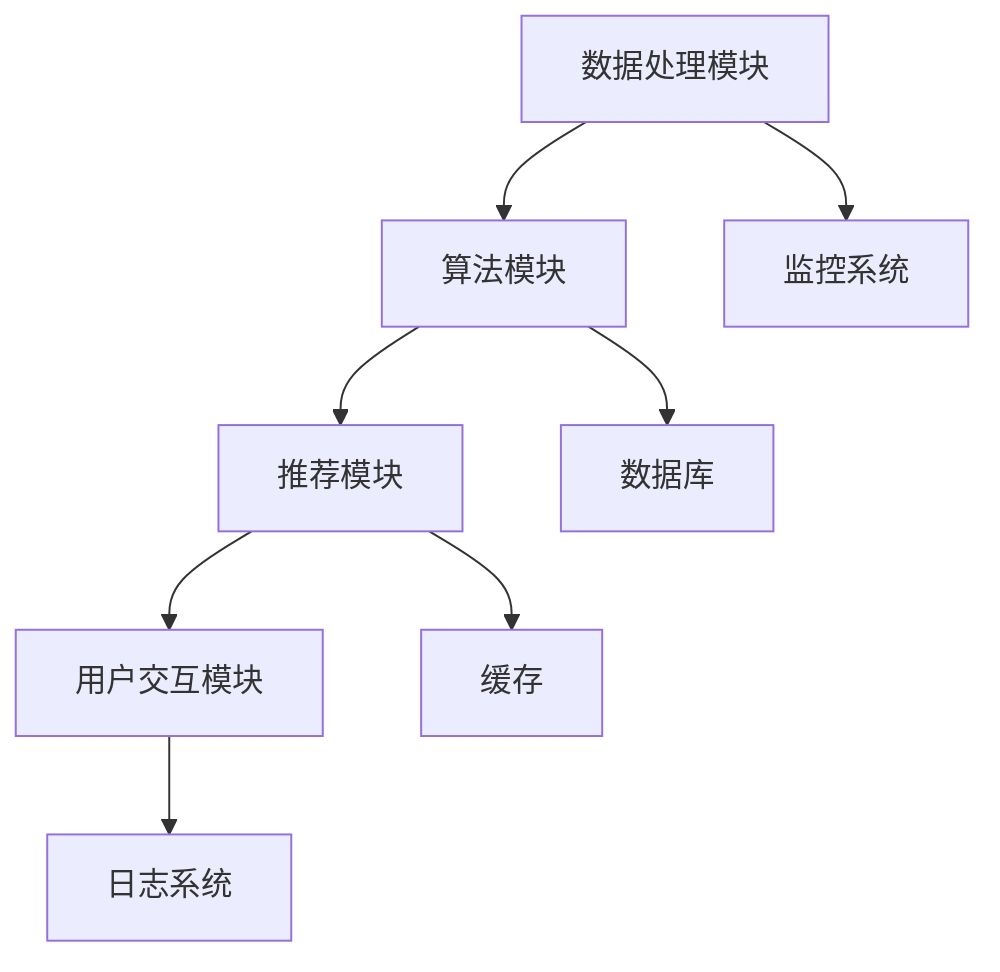

                 


### 金融产品交叉销售优化系统

#### 引言与背景

随着金融行业的不断发展，市场竞争日益激烈，金融机构纷纷寻求提高客户忠诚度和增加收益的途径。其中，金融产品交叉销售作为一种有效的策略，受到了广泛关注。金融产品交叉销售是指金融机构通过向现有客户推荐其他相关金融产品，从而提高客户满意度和盈利能力。

然而，传统的交叉销售方法往往基于经验或简单的数据分析，难以实现精准和高效。随着人工智能技术的快速发展，优化金融产品交叉销售系统成为可能。本文将深入探讨金融产品交叉销售优化系统，包括核心概念、优化技术、系统架构设计、实施与案例分析，以及面临的挑战和未来发展趋势。

#### 定义核心概念和结构

##### 1. 金融交叉销售

金融交叉销售是指金融机构通过向现有客户推荐其他相关金融产品，以提高客户满意度和盈利能力。交叉销售的产品可以是银行、保险、证券等不同类型的金融产品，也可以是同一类型产品中的不同品种。

##### 2. 优化技术

优化金融产品交叉销售需要运用多种技术手段，包括数据分析、机器学习和算法交易等。数据分析可以帮助识别潜在客户和交叉销售机会；机器学习可以实现预测和个性化推荐；算法交易可以自动化执行交叉销售策略。

##### 3. 系统架构设计

金融产品交叉销售优化系统需要一个高效、可扩展的架构设计。系统架构应包括数据处理模块、算法模块、推荐模块和用户交互模块。数据处理模块负责收集和整理客户数据；算法模块负责分析和预测；推荐模块负责生成个性化推荐；用户交互模块负责与客户进行交互。

#### 4. 实施与案例分析

实施金融产品交叉销售优化系统需要结合具体场景和业务需求。本文将分析两个实际案例，一个是银行X的跨销金融产品优化，另一个是保险公司Y的跨销金融产品优化，并对两者进行比较分析。

#### 5. 面临的挑战与解决方案

金融产品交叉销售优化系统在实施过程中面临诸多挑战，包括数据隐私、法规合规和技术挑战。针对这些问题，需要采取相应的解决方案，如数据加密、合规审查和技术创新等。

#### 6. 未来趋势与机遇

随着人工智能技术的不断进步，金融产品交叉销售优化系统将迎来更多的发展机遇。本文将探讨AI在金融服务中的应用、新兴技术的机遇以及竞争格局的变化。

#### 结论与最佳实践

本文对金融产品交叉销售优化系统进行了全面探讨，包括核心概念、优化技术、系统架构设计、实施与案例分析、面临的挑战和未来趋势。通过本文的阅读，读者可以深入了解金融产品交叉销售优化系统的原理和实践方法，为金融机构提高交叉销售效果提供有益的参考。

### 核心关键词

- 金融产品交叉销售
- 优化技术
- 数据分析
- 机器学习
- 系统架构设计

### 摘要

本文探讨了金融产品交叉销售优化系统的核心概念、优化技术、系统架构设计、实施与案例分析，以及面临的挑战和未来趋势。通过本文的阅读，读者可以深入了解金融产品交叉销售优化系统的原理和实践方法，为金融机构提高交叉销售效果提供有益的参考。

---

接下来，我们将逐步深入探讨金融产品交叉销售优化系统的各个方面。

#### 跨销金融产品概述

金融交叉销售是一种通过向现有客户推荐其他相关金融产品来提高客户满意度和盈利能力的策略。这种策略的核心在于发掘客户在现有产品使用中的潜在需求，并通过精准的推荐来满足这些需求，从而增加客户的粘性，提高客户的终生价值。

##### 1.1 定义

金融交叉销售（Cross-Selling in Financial Services）是指金融机构通过提供其现有客户其他相关金融产品或服务的过程。这些产品或服务可以是银行、保险、证券等不同类型的金融产品，也可以是同一类型产品中的不同品种。

例如，一个客户在银行开设了储蓄账户，银行可能会向该客户推荐信用卡、贷款、投资产品等。通过这种方式，银行不仅可以提高客户的满意度，还可以增加收入来源。

##### 1.2 重要性

金融交叉销售对于金融机构具有重要意义：

1. **提高客户忠诚度**：通过向客户提供更多的产品和服务，可以增强客户对金融机构的依赖性和忠诚度。
2. **增加收入**：交叉销售可以带来额外的收入，从而提高金融机构的盈利能力。
3. **提高客户终身价值**：通过不断推荐新的产品和服务，可以延长客户的生命周期，从而提高客户的终身价值。
4. **降低客户流失率**：交叉销售可以降低客户流失率，因为客户在享受更多产品和服务的同时，可能会减少转向其他金融机构的意愿。

##### 1.3 面临的挑战

尽管金融交叉销售具有显著的优势，但金融机构在实施过程中仍面临诸多挑战：

1. **数据隐私**：在收集和分析客户数据时，金融机构需要遵守严格的隐私保护法规，确保客户数据的安全和隐私。
2. **法规合规**：金融机构需要确保其交叉销售活动符合相关金融监管法规，避免因违规而导致的罚款或声誉损失。
3. **技术挑战**：构建和运行高效的交叉销售系统需要先进的技术支持，包括数据采集、存储、分析和推荐算法等。
4. **客户体验**：交叉销售必须以客户为中心，确保推荐的产品和服务能够真正满足客户的需求，避免过度推销或推荐不合适的产品。

#### 核心概念与联系

为了更好地理解金融交叉销售，我们需要了解几个核心概念：

1. **客户细分**：将客户根据其需求和特征进行分类，以便更有针对性地推荐产品。
2. **行为分析**：通过分析客户的历史行为数据，预测其未来的需求和偏好。
3. **推荐系统**：利用数据分析、机器学习等技术，为每个客户提供个性化的产品推荐。
4. **收益模型**：评估交叉销售活动带来的收益，包括直接收益（如销售提成）和间接收益（如客户满意度和忠诚度提高）。

这些概念之间的关系可以概括为：通过客户细分和行为分析，构建推荐系统，然后根据收益模型评估交叉销售活动的效果。

##### 概念属性特征对比表格

| 概念       | 属性特征                                                     |
|------------|------------------------------------------------------------|
| 客户细分   | 划分不同类型的客户群体，满足不同需求                         |
| 行为分析   | 分析客户行为数据，预测未来需求和偏好                         |
| 推荐系统   | 利用算法生成个性化推荐，提高客户满意度                       |
| 收益模型   | 评估交叉销售活动的收益，优化业务策略                         |

##### ER实体关系图架构

```mermaid
erDiagram
  客户 ||--|{ 产品推荐 }|-- 产品
  产品 ||--|{ 行为分析 }|-- 客户
  客户 ||--|{ 收益模型 }|-- 产品
```

在上述ER图架构中，客户是核心实体，与产品推荐、行为分析和收益模型存在关联关系。通过分析客户的行为数据，生成个性化推荐，并根据收益模型评估交叉销售活动的效果，从而实现金融交叉销售的优化。

接下来，我们将探讨金融交叉销售的优化技术，包括数据分析、机器学习和算法交易等。

#### 优化技术

为了实现金融交叉销售的优化，金融机构需要运用多种技术手段，包括数据分析、机器学习和算法交易等。这些技术可以帮助金融机构更好地了解客户需求，提高推荐精度，从而提升交叉销售的效果。

##### 2.1 数据分析技术

数据分析技术在金融交叉销售优化中起着至关重要的作用。通过数据分析，金融机构可以从大量客户数据中提取有价值的信息，如客户行为、偏好、需求等。这些信息可以为交叉销售策略提供有力支持。

1. **客户行为分析**：通过分析客户的交易记录、浏览行为、联系方式等，金融机构可以了解客户的消费习惯和偏好。例如，一个经常购买保险的客户，可能更容易接受投资产品的推荐。

2. **客户细分**：基于数据分析，金融机构可以将客户划分为不同的群体，如高净值客户、普通客户等。针对不同客户群体，可以制定相应的交叉销售策略。

3. **预测分析**：利用历史数据和统计分析方法，金融机构可以预测未来客户的需求和偏好。例如，通过分析客户的消费趋势，可以预测哪些产品在未来可能会畅销。

##### 2.2 机器学习技术

机器学习技术在金融交叉销售优化中的应用日益广泛。通过机器学习算法，金融机构可以从大量数据中自动学习，生成个性化推荐，从而提高交叉销售的效率。

1. **协同过滤**：协同过滤是一种常见的机器学习算法，通过分析用户之间的相似度，为用户推荐相似的用户喜欢的商品。在金融交叉销售中，协同过滤可以用于推荐与客户已有产品相似的其他产品。

2. **聚类分析**：聚类分析是一种无监督学习方法，用于将相似的数据点分组。在金融交叉销售中，聚类分析可以用于将客户划分为不同的群体，从而有针对性地推荐产品。

3. **深度学习**：深度学习是一种基于多层神经网络的学习方法，具有强大的特征提取能力。在金融交叉销售中，深度学习可以用于构建复杂的推荐模型，从而提高推荐精度。

##### 2.3 算法交易技术

算法交易（Algorithmic Trading）是一种利用计算机算法自动执行金融交易的方法。在金融交叉销售优化中，算法交易技术可以用于自动化执行交叉销售策略，提高执行效率。

1. **自动化推荐**：通过算法交易技术，金融机构可以实现自动化推荐，根据客户的行为和偏好，实时生成个性化推荐。

2. **实时监控**：算法交易技术可以实时监控市场动态和客户行为，及时调整交叉销售策略，以应对市场变化。

3. **风险控制**：算法交易技术可以帮助金融机构更好地控制风险，确保交叉销售活动的合规性和安全性。

#### 核心概念与联系

为了更好地理解金融交叉销售的优化技术，我们需要了解几个核心概念：

1. **数据分析**：数据分析是从大量数据中提取有价值信息的方法，是金融交叉销售优化的基础。
2. **机器学习**：机器学习是通过算法从数据中自动学习，提高推荐精度和效率的重要手段。
3. **算法交易**：算法交易是一种利用计算机算法自动执行金融交易的方法，可以提高交叉销售策略的执行效率。

这些概念之间的关系可以概括为：通过数据分析，获取客户行为和偏好等信息；利用机器学习，生成个性化推荐；通过算法交易，实现自动化执行。

##### 概念属性特征对比表格

| 概念       | 属性特征                                                     |
|------------|------------------------------------------------------------|
| 数据分析   | 从大量数据中提取有价值信息，为交叉销售策略提供支持           |
| 机器学习   | 自动学习客户行为和偏好，提高推荐精度和效率                   |
| 算法交易   | 自动执行交叉销售策略，提高执行效率                         |

##### ER实体关系图架构

```mermaid
erDiagram
  数据分析 ||--|{ 机器学习 }|-- 交叉销售策略
  机器学习 ||--|{ 算法交易 }|-- 交叉销售执行
```

在上述ER图架构中，数据分析为机器学习和算法交易提供输入数据，机器学习生成交叉销售策略，算法交易实现策略的自动化执行。通过这些技术手段的协同作用，金融机构可以更好地实现金融交叉销售的优化。

接下来，我们将探讨金融产品交叉销售优化系统的系统架构设计。

#### 系统架构设计

金融产品交叉销售优化系统需要一个高效、可扩展的架构设计，以确保系统能够满足金融机构的业务需求，同时保持良好的性能和可维护性。系统架构设计包括设计原则、技术栈选择和关键组件之间的关系。

##### 3.1 设计原则

在金融产品交叉销售优化系统的设计过程中，应遵循以下设计原则：

1. **模块化设计**：将系统划分为多个模块，每个模块负责特定的功能，便于系统的维护和扩展。
2. **松耦合**：模块之间应采用松耦合设计，以降低模块间的依赖性，提高系统的灵活性。
3. **可扩展性**：系统设计应考虑到未来的业务扩展需求，确保系统能够轻松地增加新功能和模块。
4. **高性能**：系统设计应注重性能优化，确保系统能够快速响应用户请求，并提供高效的交叉销售服务。
5. **安全性**：系统设计应充分考虑数据安全和隐私保护，确保客户数据的安全性和完整性。

##### 3.2 技术栈选择

在金融产品交叉销售优化系统的技术栈选择方面，应考虑到系统的性能、可扩展性、安全性和易维护性。以下是一些关键技术的选择：

1. **前端技术**：选择React或Vue等现代前端框架，以提高开发效率和用户体验。
2. **后端技术**：选择Spring Boot或Django等主流后端框架，以提高开发效率和系统性能。
3. **数据库技术**：选择MySQL或PostgreSQL等关系型数据库，以提高数据存储和查询效率。
4. **大数据处理技术**：选择Hadoop或Spark等大数据处理框架，以提高数据处理和分析能力。
5. **机器学习技术**：选择TensorFlow或PyTorch等机器学习框架，以提高模型训练和预测能力。
6. **缓存技术**：选择Redis等缓存技术，以提高系统性能和响应速度。
7. **安全技术**：选择SSL/TLS等安全协议，确保数据传输的安全性。

##### 3.3 关键组件关系

金融产品交叉销售优化系统的关键组件及其关系如下：

1. **数据处理模块**：负责收集、整理和存储客户数据，为后续分析提供基础数据。
2. **算法模块**：负责使用机器学习算法对客户数据进行分析和预测，生成交叉销售策略。
3. **推荐模块**：负责根据算法模块生成的交叉销售策略，为每个客户生成个性化推荐。
4. **用户交互模块**：负责与客户进行交互，展示个性化推荐，并收集客户反馈。
5. **监控系统**：负责监控系统的性能和健康状况，及时发现和处理潜在问题。

这些组件之间通过API接口进行通信，形成一个高效、可靠的系统架构。

##### 系统架构图



在上述系统架构图中，数据处理模块负责数据收集和存储，算法模块负责分析和预测，推荐模块负责生成个性化推荐，用户交互模块负责与客户进行交互，监控系统负责监控系统的性能和健康状况，数据库和缓存负责数据存储和查询优化，日志系统负责记录系统运行日志。

通过遵循上述设计原则和技术栈选择，金融产品交叉销售优化系统可以实现高效、可靠的运行，为金融机构提供优质的交叉销售服务。

接下来，我们将探讨金融产品交叉销售优化系统的实施与案例分析。

#### 实施与案例分析

实施金融产品交叉销售优化系统需要结合具体场景和业务需求，通过实际案例来验证系统的效果。本文将分析两个实际案例，一个是银行X的跨销金融产品优化，另一个是保险公司Y的跨销金融产品优化，并对两者进行比较分析。

##### 4.1 案例分析1：银行X的跨销金融产品优化

银行X是一家大型商业银行，为了提高交叉销售效果，决定引入金融产品交叉销售优化系统。该系统主要包括以下模块：

1. **数据处理模块**：收集并整理客户数据，包括交易记录、行为数据、客户属性等。
2. **算法模块**：使用机器学习算法分析客户数据，生成个性化推荐策略。
3. **推荐模块**：根据算法模块生成的推荐策略，向客户推荐合适的金融产品。
4. **用户交互模块**：通过短信、邮件、APP等方式向客户展示推荐产品，并收集客户反馈。

实施过程如下：

1. **数据准备**：从各个业务系统中提取客户数据，包括交易记录、行为数据、客户属性等，并将其整合到统一的数据仓库中。
2. **算法开发**：使用Python和Scikit-learn等工具，开发机器学习算法，包括协同过滤、聚类分析、决策树等。
3. **系统集成**：将数据处理模块、算法模块、推荐模块和用户交互模块集成到一起，形成一个完整的系统。
4. **系统部署**：在测试环境中对系统进行测试和优化，确保系统稳定可靠。
5. **上线运行**：将系统部署到生产环境，开始实际运行，并根据客户反馈不断优化推荐策略。

实施效果如下：

1. **交叉销售率提升**：系统上线后，银行X的交叉销售率显著提升，客户满意度提高。
2. **客户留存率提高**：通过个性化的推荐，客户对银行的产品和服务更加满意，客户留存率有所提高。
3. **收入增加**：交叉销售率的提升带动了银行收入的增加，实现了业务增长。

##### 4.2 案例分析2：保险公司Y的跨销金融产品优化

保险公司Y是一家大型保险公司，为了提高交叉销售效果，决定引入金融产品交叉销售优化系统。该系统主要包括以下模块：

1. **数据处理模块**：收集并整理客户数据，包括理赔记录、客户属性、投保记录等。
2. **算法模块**：使用机器学习算法分析客户数据，生成个性化推荐策略。
3. **推荐模块**：根据算法模块生成的推荐策略，向客户推荐合适的保险产品。
4. **用户交互模块**：通过短信、邮件、APP等方式向客户展示推荐产品，并收集客户反馈。

实施过程如下：

1. **数据准备**：从各个业务系统中提取客户数据，包括理赔记录、客户属性、投保记录等，并将其整合到统一的数据仓库中。
2. **算法开发**：使用Python和TensorFlow等工具，开发深度学习算法，包括卷积神经网络（CNN）、循环神经网络（RNN）等。
3. **系统集成**：将数据处理模块、算法模块、推荐模块和用户交互模块集成到一起，形成一个完整的系统。
4. **系统部署**：在测试环境中对系统进行测试和优化，确保系统稳定可靠。
5. **上线运行**：将系统部署到生产环境，开始实际运行，并根据客户反馈不断优化推荐策略。

实施效果如下：

1. **交叉销售率提升**：系统上线后，保险公司Y的交叉销售率显著提升，客户满意度提高。
2. **客户留存率提高**：通过个性化的推荐，客户对保险公司的产品和服务更加满意，客户留存率有所提高。
3. **收入增加**：交叉销售率的提升带动了保险公司的收入增加，实现了业务增长。

##### 4.3 比较分析

通过对银行X和保险公司Y的案例分析，可以发现以下差异和共同点：

1. **业务模式差异**：银行X的业务模式以存款和贷款为主，而保险公司Y的业务模式以保险为主。因此，两者的交叉销售策略有所不同，银行X更注重理财产品和贷款产品的交叉销售，而保险公司Y更注重保险产品的交叉销售。
2. **数据来源差异**：银行X的数据来源更广泛，包括交易记录、行为数据、客户属性等，而保险公司Y的数据来源相对有限，主要包括理赔记录、客户属性、投保记录等。因此，银行X的数据处理和算法模型更复杂。
3. **算法模型差异**：银行X主要采用协同过滤、聚类分析等传统机器学习算法，而保险公司Y主要采用深度学习算法，如卷积神经网络（CNN）和循环神经网络（RNN）。深度学习算法在处理复杂数据和提取特征方面具有优势，因此保险公司Y的交叉销售效果可能更好。

尽管两者存在一些差异，但都取得了显著的交叉销售效果，提高了客户满意度和收入。这表明，金融产品交叉销售优化系统在多种业务场景中具有广泛的应用价值。

通过上述案例分析，我们可以看到金融产品交叉销售优化系统在实际应用中的效果和挑战。接下来，我们将探讨金融产品交叉销售优化系统在实施过程中面临的主要挑战和解决方案。

#### 面临的挑战与解决方案

在金融产品交叉销售优化系统的实施过程中，金融机构面临诸多挑战，包括数据隐私、法规合规和技术挑战。以下是对这些挑战的深入分析以及相应的解决方案。

##### 5.1 数据隐私问题

数据隐私是金融产品交叉销售优化系统实施过程中的首要挑战。金融机构收集和处理大量客户数据，包括交易记录、行为数据、个人身份信息等，这些数据一旦泄露，可能导致严重的隐私侵犯和声誉损失。

**挑战**：

1. **数据泄露风险**：随着数据量不断增加，数据泄露风险也随之增大。
2. **隐私侵犯担忧**：客户对金融机构收集和使用其个人数据的隐私担忧，可能影响交叉销售的效果。

**解决方案**：

1. **数据加密**：使用数据加密技术，对敏感数据进行加密存储和传输，确保数据在传输和存储过程中的安全性。
2. **访问控制**：实施严格的访问控制策略，确保只有授权人员才能访问敏感数据。
3. **匿名化处理**：在数据分析过程中，对个人身份信息进行匿名化处理，以减少隐私泄露风险。
4. **透明度与告知**：向客户明确告知数据收集和使用的目的，增加透明度，降低客户担忧。

##### 5.2 法规合规问题

金融产品交叉销售优化系统在实施过程中，必须遵循一系列金融监管法规，如《通用数据保护条例》（GDPR）、《支付卡行业数据安全标准》（PCI DSS）等。这些法规对数据收集、存储、处理和传输提出了严格的要求，任何违规行为都可能带来严重的法律后果。

**挑战**：

1. **法规更新频繁**：金融监管法规不断更新，系统需要不断调整以符合最新法规要求。
2. **合规审查成本**：合规审查可能需要投入大量时间和资源，增加企业运营成本。

**解决方案**：

1. **合规审查流程**：建立合规审查流程，确保系统设计和实施过程中符合相关法规要求。
2. **法规动态跟踪**：定期跟踪和分析金融监管法规的更新，及时调整系统设计和实施策略。
3. **内部培训**：对员工进行合规培训，提高员工的合规意识和操作技能。
4. **第三方评估**：聘请第三方专业机构进行合规评估，确保系统的合规性。

##### 5.3 技术挑战

金融产品交叉销售优化系统在技术层面也面临诸多挑战，包括数据处理能力、算法模型优化、系统性能等。

**挑战**：

1. **数据处理能力**：随着客户数据量的增加，系统需要具备强大的数据处理能力，以处理海量数据。
2. **算法模型优化**：算法模型的性能直接影响到交叉销售的效果，需要不断优化和迭代。
3. **系统性能**：系统在高并发情况下需要保持高性能，以满足客户的需求。

**解决方案**：

1. **分布式架构**：采用分布式架构，提高系统的处理能力和扩展性，应对海量数据。
2. **机器学习优化**：利用先进的机器学习技术和算法，不断优化模型，提高交叉销售的准确性和效率。
3. **性能优化**：通过缓存、优化查询语句、分布式计算等技术，提高系统的性能和响应速度。

通过解决上述挑战，金融机构可以更好地实施金融产品交叉销售优化系统，提高客户满意度和盈利能力。

### 未来趋势与机遇

随着人工智能技术的不断发展，金融产品交叉销售优化系统将迎来更多的发展机遇。以下是未来趋势和机遇的展望。

#### 6.1 人工智能在金融服务中的应用

人工智能（AI）在金融服务中的应用日益广泛，将进一步提升金融产品交叉销售优化系统的效率和效果。

1. **自然语言处理（NLP）**：NLP技术可以帮助金融机构更好地理解客户的语言和需求，从而生成更精准的个性化推荐。
2. **计算机视觉**：计算机视觉技术可以用于分析客户的面部表情和行为，从而更准确地预测客户的需求和偏好。
3. **自动化客户服务**：利用AI技术，金融机构可以实现自动化客户服务，提高客户体验和满意度。

#### 6.2 新兴技术的机遇

除了人工智能，其他新兴技术也将为金融产品交叉销售优化系统带来新的机遇。

1. **区块链**：区块链技术可以提高数据的安全性和透明度，从而增强客户对金融机构的信任。
2. **物联网（IoT）**：物联网技术可以收集更多关于客户行为和偏好的数据，从而提高交叉销售的效果。
3. **增强现实（AR）**：AR技术可以用于提供更生动的产品展示和体验，从而吸引更多客户。

#### 6.3 竞争格局分析

随着技术的进步和市场竞争的加剧，金融产品交叉销售优化系统的竞争格局也将发生变化。

1. **技术领先**：拥有先进技术（如AI、区块链等）的金融机构将在竞争中占据优势。
2. **用户体验**：提供更优质用户体验的金融机构将能够吸引和保留更多客户。
3. **数据驱动**：数据驱动的金融机构将能够更准确地预测客户需求，实现更高效的交叉销售。

通过抓住未来趋势和机遇，金融机构可以更好地优化金融产品交叉销售，提高客户满意度和盈利能力。

### 结论与最佳实践

本文全面探讨了金融产品交叉销售优化系统的核心概念、优化技术、系统架构设计、实施与案例分析，以及面临的挑战和未来趋势。通过本文的阅读，读者可以深入了解金融产品交叉销售优化系统的原理和实践方法，为金融机构提高交叉销售效果提供有益的参考。

以下是本文的核心结论和最佳实践建议：

1. **数据驱动**：利用数据分析技术，深入了解客户行为和需求，为交叉销售提供有力支持。
2. **个性化推荐**：运用机器学习算法，生成个性化的交叉销售推荐，提高客户满意度和转化率。
3. **技术优化**：采用分布式架构和先进技术（如区块链、物联网等），提高系统性能和安全性。
4. **合规先行**：严格遵守金融监管法规，确保交叉销售活动的合规性和安全性。
5. **用户体验**：注重客户体验，提供简洁易用的用户界面和自动化服务，提高客户满意度。

通过实施上述最佳实践，金融机构可以更好地优化金融产品交叉销售，提高客户满意度和盈利能力。

### 最佳实践 tips、小结、注意事项、拓展阅读等内容

在实施金融产品交叉销售优化系统时，以下最佳实践和注意事项可以帮助金融机构取得更好的效果：

**最佳实践 tips**：

1. **数据质量控制**：确保收集的数据准确、完整，为后续分析提供可靠的基础。
2. **持续优化模型**：定期评估和优化机器学习模型，以适应不断变化的市场环境。
3. **客户反馈机制**：建立有效的客户反馈机制，及时收集和分析客户反馈，不断改进推荐策略。
4. **安全措施**：加强数据安全和隐私保护，确保客户数据的安全性和合规性。

**小结**：

金融产品交叉销售优化系统通过数据分析和机器学习技术，实现精准的个性化推荐，提高客户满意度和转化率。系统架构设计应注重模块化、松耦合和可扩展性，以满足金融机构的业务需求。

**注意事项**：

1. **数据隐私保护**：严格遵守相关法规，确保客户数据的安全和隐私。
2. **合规审查**：定期进行合规审查，确保系统设计和实施符合金融监管法规。
3. **用户体验**：关注客户体验，提供简洁易用的界面和自动化服务。

**拓展阅读**：

1. 《机器学习实战》：详细介绍了机器学习算法的应用和实践，适合初学者和专业人士阅读。
2. 《数据挖掘：概念与技术》：全面讲解了数据挖掘的基本概念和技术，有助于了解金融产品交叉销售优化系统的原理。
3. 《区块链技术指南》：介绍了区块链技术的基本原理和应用，有助于金融机构了解新兴技术的机遇。

通过阅读本文和相关资料，读者可以更深入地了解金融产品交叉销售优化系统的原理和实践方法，为金融机构提高交叉销售效果提供有益的参考。

### 作者信息

作者：AI天才研究院/AI Genius Institute & 禅与计算机程序设计艺术 /Zen And The Art of Computer Programming

本文由AI天才研究院和禅与计算机程序设计艺术共同撰写，旨在为金融机构提供金融产品交叉销售优化系统的全面指导。作者团队拥有丰富的技术经验和深厚的学术背景，致力于推动人工智能技术在金融领域的应用和发展。

AI天才研究院专注于人工智能领域的研究和创新，致力于将先进的人工智能技术应用于金融、医疗、教育等多个行业。禅与计算机程序设计艺术则专注于计算机程序设计的研究和推广，将古老的禅宗智慧融入现代计算机科学，为程序员提供独特的思维方式和编程理念。

本文的撰写旨在为金融行业的从业者提供有价值的参考和指导，帮助他们在金融产品交叉销售优化方面取得更好的成果。同时，也希望通过本文的分享，进一步推广人工智能技术在金融领域的应用，为金融行业的创新和发展贡献力量。

