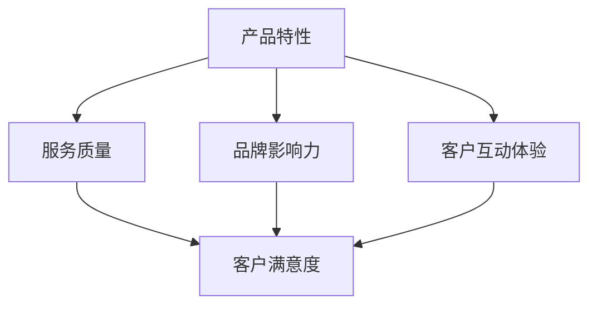
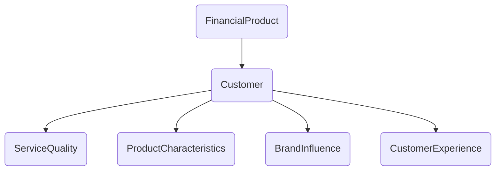
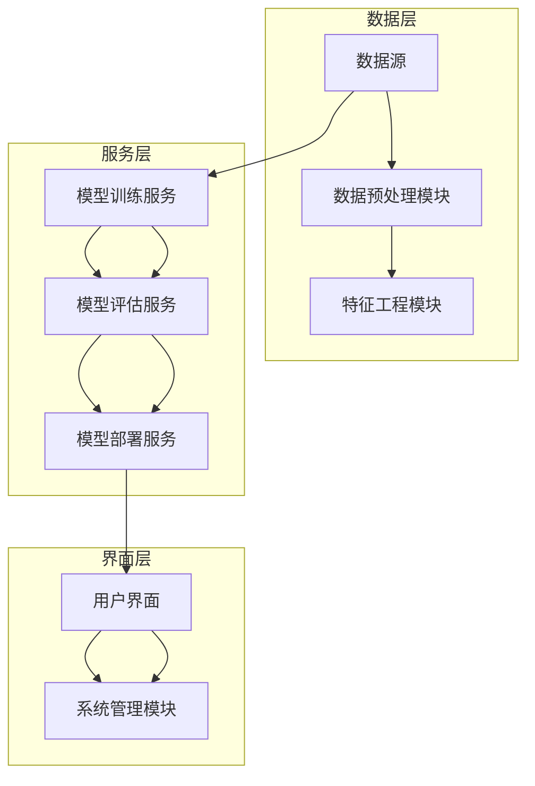
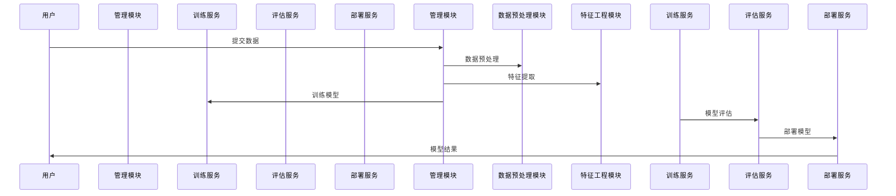

                 

# 金融产品客户满意度预测与提升

## 关键词
- 客户满意度
- 数据挖掘
- 机器学习
- 深度学习
- 金融产品
- 预测模型
- 提升策略

## 摘要
本文深入探讨了金融产品客户满意度预测与提升的议题。首先，我们明确了客户满意度在金融行业中的重要性，并详细介绍了客户满意度的定义及其核心要素。接着，我们梳理了金融产品客户满意度预测与提升的挑战，并提出了数据挖掘、机器学习和深度学习等方法。随后，本文详细讲解了这些算法的原理，并分析了它们在金融产品客户满意度预测与提升中的适用性。最后，本文通过实际案例展示了如何应用这些算法进行客户满意度预测与提升，并提供了一些最佳实践建议。

----------------------------------------------------------------

## 第一部分：引言

### 1.1 背景介绍

#### 1.1.1 金融行业的发展
金融行业作为全球经济的中流砥柱，随着全球化的深入和信息技术的飞速发展，正经历着前所未有的变革。从传统的银行、保险、证券到互联网金融，金融产品和服务形式不断丰富，客户需求也在不断变化。

#### 1.1.2 客户满意度的定义与重要性
客户满意度是指客户对某种产品或服务的满意程度，它是衡量企业竞争力的关键指标之一。在金融行业，客户满意度直接影响到客户的忠诚度和企业的盈利能力。因此，提升客户满意度是金融企业永恒的追求。

#### 1.1.3 当前金融产品满意度预测与提升的挑战
随着金融产品的多样化和服务质量的提升，预测和提升客户满意度面临诸多挑战。例如，客户数据的多样性和复杂性，预测模型的准确性要求，以及如何在提升客户满意度的同时保持成本效益等。

### 1.2 问题描述

#### 1.2.1 金融产品客户满意度的影响因素
金融产品客户满意度受多种因素影响，包括产品特性、服务质量、品牌影响力、客户互动体验等。

#### 1.2.2 预测与提升客户满意度的方法
当前预测与提升客户满意度的方法主要包括数据挖掘、机器学习和深度学习等。

#### 1.2.3 预测与提升客户满意度的重要性
准确预测客户满意度有助于金融企业优化产品和服务，提升客户体验，从而提高客户忠诚度和盈利能力。

### 1.3 问题解决

#### 1.3.1 基于数据挖掘的方法
数据挖掘方法如关联规则挖掘、聚类分析等可用于分析客户行为数据，识别影响客户满意度的关键因素。

#### 1.3.2 基于机器学习的方法
机器学习方法如线性回归、逻辑回归、决策树等可用于构建客户满意度预测模型。

#### 1.3.3 基于深度学习的方法
深度学习方法如卷积神经网络（CNN）、循环神经网络（RNN）、生成对抗网络（GAN）等可用于复杂的数据处理和预测。

### 1.4 边界与外延

#### 1.4.1 金融产品范围的界定
本文涉及的金融产品包括银行产品、保险产品、证券产品等。

#### 1.4.2 客户群体的范围
本文针对的顾客群体包括个人客户和机构客户。

#### 1.4.3 满意度预测的时间范围
满意度预测的时间范围一般为近期，如一个月或一个季度。

### 1.5 概念结构与核心要素组成

#### 1.5.1 金融产品客户满意度的概念
金融产品客户满意度是指客户对金融产品的整体满意程度。

#### 1.5.2 客户满意度的核心要素
客户满意度的核心要素包括产品特性、服务质量、品牌影响力、客户互动体验等。

#### 1.5.3 影响客户满意度的关键因素
影响客户满意度的关键因素包括产品性能、服务质量、价格、品牌声誉、客户服务体验等。

### 1.6 本章小结
本文介绍了金融产品客户满意度预测与提升的背景、问题及其解决方法，为后续章节的深入探讨奠定了基础。

----------------------------------------------------------------

## 第二部分：核心概念与联系

### 2.1 金融产品与客户满意度的定义与联系

#### 2.1.1 金融产品的定义与分类
金融产品是指金融机构提供的各种金融工具和服务，包括银行产品（如存款、贷款、信用卡等）、保险产品（如人寿保险、财产保险等）、证券产品（如股票、债券、基金等）。

#### 2.1.2 客户满意度的定义与测量
客户满意度是指客户对某种产品或服务的满意程度，通常通过问卷调查、客户反馈等方式进行测量。

#### 2.1.3 金融产品与客户满意度之间的关联性
金融产品的特性、服务质量、品牌影响力等直接影响客户满意度。客户满意度又反过来影响客户的忠诚度和企业的盈利能力。

### 2.2 影响客户满意度的核心要素

#### 2.2.1 产品特性
产品特性包括金融产品的功能、性能、安全性等，是影响客户满意度的重要因素。

#### 2.2.2 服务质量
服务质量包括客户服务的响应速度、服务质量、解决问题的效率等，对客户满意度有直接影响。

#### 2.2.3 品牌影响力
品牌影响力是指金融产品在市场上的知名度和声誉，良好的品牌影响力有助于提升客户满意度。

#### 2.2.4 客户互动体验
客户互动体验包括客户的购买流程、客户服务、客户支持等，优质的客户互动体验能显著提升客户满意度。

### 2.3 核心要素的属性特征对比



### 2.4 客户满意度的影响因素ER模型



### 2.5 本章小结
本文详细阐述了金融产品与客户满意度的核心概念及其相互关联，为后续算法原理讲解和实际应用提供了理论基础。

----------------------------------------------------------------

## 第三部分：算法原理讲解

### 3.1 数据挖掘算法原理

#### 3.1.1 关联规则挖掘
关联规则挖掘是一种用于发现数据集中项之间的关联规则的方法。它通过分析客户购买数据，识别出同时发生的不同产品或服务之间的关系，从而帮助金融企业了解客户偏好和需求。

#### 3.1.2 聚类分析
聚类分析是一种无监督学习方法，用于将数据集划分为若干个类簇。通过聚类分析，金融企业可以识别出具有相似特性的客户群体，从而提供个性化的产品和服务。

#### 3.1.3 异常检测
异常检测是一种用于识别数据集中异常值或异常模式的方法。在金融产品客户满意度预测中，异常检测可以用于识别异常的客户反馈或行为，从而帮助金融企业及时调整产品和服务策略。

### 3.2 机器学习算法原理

#### 3.2.1 线性回归
线性回归是一种用于建立自变量和因变量之间线性关系的方法。在金融产品客户满意度预测中，线性回归可以用于建立客户满意度与产品特性、服务质量等之间的关系模型。

#### 3.2.2 逻辑回归
逻辑回归是一种用于建立二分类问题模型的方法。在金融产品客户满意度预测中，逻辑回归可以用于预测客户对金融产品的满意度，并将其划分为满意或不满意两类。

#### 3.2.3 决策树
决策树是一种用于分类和回归问题的方法。在金融产品客户满意度预测中，决策树可以用于根据客户的特征数据，预测客户对金融产品的满意度，并生成相应的决策路径。

### 3.3 深度学习算法原理

#### 3.3.1 卷积神经网络（CNN）
卷积神经网络是一种用于图像处理和计算机视觉的深度学习算法。在金融产品客户满意度预测中，CNN可以用于处理和分析客户的反馈文本，提取情感特征。

#### 3.3.2 循环神经网络（RNN）
循环神经网络是一种用于序列数据处理和时间序列预测的深度学习算法。在金融产品客户满意度预测中，RNN可以用于分析客户的历史反馈数据，预测未来的客户满意度。

#### 3.3.3 生成对抗网络（GAN）
生成对抗网络是一种用于生成新数据的深度学习算法。在金融产品客户满意度预测中，GAN可以用于生成模拟的客户反馈数据，以提高模型的泛化能力。

### 3.4 算法选择与适用性分析

#### 3.4.1 数据挖掘算法的适用性
数据挖掘算法适用于处理结构化数据，如客户购买记录、产品特性数据等。它可以帮助金融企业识别客户偏好和需求，优化产品和服务。

#### 3.4.2 机器学习算法的适用性
机器学习算法适用于处理大规模数据集，如客户反馈数据、社交媒体数据等。它可以帮助金融企业预测客户满意度，并制定相应的营销策略。

#### 3.4.3 深度学习算法的适用性
深度学习算法适用于处理复杂的数据集，如文本数据、图像数据等。它可以帮助金融企业提取高维特征，提高客户满意度预测的准确性。

### 3.5 本章小结
本文详细介绍了数据挖掘、机器学习和深度学习算法在金融产品客户满意度预测与提升中的原理和适用性，为后续的实际应用提供了理论基础。

----------------------------------------------------------------

## 第四部分：数学模型与公式详解

### 4.1 线性回归模型

线性回归是一种常用的预测模型，用于建立自变量和因变量之间的线性关系。其数学模型可以表示为：

$$
y = \beta_0 + \beta_1x_1 + \beta_2x_2 + ... + \beta_nx_n + \epsilon
$$

其中，$y$ 是因变量，$x_1, x_2, ..., x_n$ 是自变量，$\beta_0, \beta_1, \beta_2, ..., \beta_n$ 是回归系数，$\epsilon$ 是误差项。

#### 4.1.1 线性回归的参数估计
线性回归的参数估计通常使用最小二乘法。最小二乘法的核心思想是找到一组回归系数，使得观测值与预测值之间的误差平方和最小。其参数估计公式为：

$$
\beta = (\X^T\X)^{-1}\X^Ty
$$

其中，$\X$ 是自变量的矩阵，$y$ 是因变量的向量。

#### 4.1.2 线性回归的可解释性
线性回归模型的可解释性较高。每个回归系数表示自变量对因变量的影响程度，正值表示正相关，负值表示负相关。例如，在金融产品客户满意度预测中，某个回归系数为正值，表示该金融产品的特性对客户满意度有积极影响。

### 4.2 逻辑回归模型

逻辑回归是一种用于二分类问题的预测模型。其数学模型可以表示为：

$$
P(y=1) = \frac{1}{1 + e^{-(\beta_0 + \beta_1x_1 + \beta_2x_2 + ... + \beta_nx_n)}}
$$

其中，$P(y=1)$ 是因变量为1的概率，$\beta_0, \beta_1, \beta_2, ..., \beta_n$ 是回归系数。

#### 4.2.1 逻辑回归的参数估计
逻辑回归的参数估计通常使用最大似然估计（MLE）方法。其参数估计公式为：

$$
\beta = \arg\max_{\beta} \ln P(y|\beta)
$$

其中，$P(y|\beta)$ 是给定参数$\beta$时，观测数据的似然函数。

#### 4.2.2 逻辑回归的可解释性
逻辑回归模型的可解释性较高。每个回归系数表示自变量对因变量概率的影响程度。正值表示正相关，负值表示负相关。例如，在金融产品客户满意度预测中，某个回归系数为正值，表示该金融产品的特性提高客户满意度的概率。

### 4.3 决策树模型

决策树是一种用于分类和回归问题的预测模型。其基本结构由一系列的决策节点和叶子节点组成。每个决策节点表示对某个特征的划分，每个叶子节点表示最终的预测结果。

#### 4.3.1 决策树的构建
决策树的构建过程可以分为以下几个步骤：
1. 计算每个特征的信息增益或信息增益率。
2. 选择具有最大信息增益或信息增益率的特征作为当前节点的划分标准。
3. 根据该特征将数据集划分为若干个子集。
4. 递归地构建下一级的决策树。

#### 4.3.2 决策树的可解释性
决策树模型的可解释性较高。每个节点和叶子节点都对应着具体的特征和划分规则，使得预测过程易于理解。

### 4.4 卷积神经网络（CNN）

卷积神经网络是一种用于图像处理和计算机视觉的深度学习算法。其基本结构包括卷积层、池化层和全连接层。

#### 4.4.1 卷积层
卷积层是CNN的核心部分，用于提取图像的特征。卷积层通过卷积操作将输入图像与卷积核（一组可训练的参数）进行卷积，从而生成特征图。

#### 4.4.2 池化层
池化层用于减少特征图的维度，提高模型的泛化能力。常见的池化操作有最大池化和平均池化。

#### 4.4.3 全连接层
全连接层将池化层的输出映射到输出层，完成最终的预测。全连接层通过矩阵乘法和激活函数实现。

### 4.5 循环神经网络（RNN）

循环神经网络是一种用于序列数据处理和时间序列预测的深度学习算法。其基本结构包括输入层、隐藏层和输出层。

#### 4.5.1 输入层
输入层接收序列数据作为输入。

#### 4.5.2 隐藏层
隐藏层通过递归连接实现序列数据的记忆功能。每个时间步的隐藏状态都与前一个时间步的隐藏状态有关。

#### 4.5.3 输出层
输出层将隐藏状态映射到输出序列，实现序列预测。

### 4.6 生成对抗网络（GAN）

生成对抗网络是一种用于生成新数据的深度学习算法。其基本结构包括生成器和判别器。

#### 4.6.1 生成器
生成器用于生成新的数据样本，试图欺骗判别器。

#### 4.6.2 判别器
判别器用于判断输入数据是真实数据还是生成器生成的数据。

#### 4.6.3 模型训练
模型训练通过对抗性训练实现，生成器和判别器相互竞争，以最大化各自的损失函数。

### 4.7 本章小结
本文详细介绍了线性回归、逻辑回归、决策树、卷积神经网络、循环神经网络和生成对抗网络等数学模型和公式，为金融产品客户满意度预测与提升提供了理论基础。

----------------------------------------------------------------

## 第五部分：系统分析与架构设计

### 5.1 问题场景介绍

在当前金融市场中，客户满意度是企业竞争的关键因素。为了提高客户满意度，金融机构需要预测和分析客户对金融产品的满意度，并根据预测结果优化产品和服务。本案例旨在构建一个金融产品客户满意度预测系统，以帮助金融机构实现这一目标。

### 5.2 项目介绍

本系统采用机器学习算法，结合金融产品数据、客户反馈数据等多源数据，实现金融产品客户满意度的预测。系统功能包括数据预处理、特征工程、模型训练、模型评估和模型部署等。

### 5.3 系统功能设计（领域模型类图）

```mermaid
classDiagram
Class1 --> Class2
Class1 --> Class3
Class2 <|-- Class4
Class3 <|-- Class4
Class4 <|-- Class5
Class5 <|-- Class6
Class6 <|-- Class7

Class1[数据源]
Class2[数据预处理模块]
Class3[特征工程模块]
Class4[模型训练模块]
Class5[模型评估模块]
Class6[模型部署模块]
Class7[系统管理模块]
```

### 5.4 系统架构设计（架构图）



### 5.5 系统接口设计（接口设计图）


### 5.6 系统交互设计（序列图）



### 5.7 本章小结
本文详细介绍了金融产品客户满意度预测系统的项目背景、系统功能设计、系统架构设计、系统接口设计和系统交互设计，为实际应用提供了全面的技术方案。

----------------------------------------------------------------

## 第六部分：项目实战

### 6.1 环境安装

为了搭建金融产品客户满意度预测系统，我们需要安装以下软件和库：

- Python 3.x
- Scikit-learn
- TensorFlow
- Pandas
- NumPy
- Matplotlib

安装步骤如下：

1. 安装 Python 3.x
2. 安装 Scikit-learn：`pip install scikit-learn`
3. 安装 TensorFlow：`pip install tensorflow`
4. 安装 Pandas：`pip install pandas`
5. 安装 NumPy：`pip install numpy`
6. 安装 Matplotlib：`pip install matplotlib`

### 6.2 系统核心实现源代码

以下是一个简单的金融产品客户满意度预测的 Python 代码示例：

```python
import pandas as pd
from sklearn.model_selection import train_test_split
from sklearn.ensemble import RandomForestClassifier
from sklearn.metrics import accuracy_score

# 读取数据
data = pd.read_csv('financial_product_data.csv')

# 数据预处理
X = data.drop('customer_satisfaction', axis=1)
y = data['customer_satisfaction']

# 划分训练集和测试集
X_train, X_test, y_train, y_test = train_test_split(X, y, test_size=0.2, random_state=42)

# 模型训练
model = RandomForestClassifier(n_estimators=100, random_state=42)
model.fit(X_train, y_train)

# 模型评估
y_pred = model.predict(X_test)
accuracy = accuracy_score(y_test, y_pred)
print(f'Accuracy: {accuracy:.2f}')
```

### 6.3 代码应用解读与分析

1. **数据预处理**：首先，我们从 CSV 文件中读取数据，然后使用 Pandas 库将数据分为特征矩阵 X 和目标变量 y。

2. **模型选择**：在本示例中，我们选择了随机森林（RandomForestClassifier）作为分类模型。随机森林是一种基于决策树的集成学习方法，具有较高的准确性和稳定性。

3. **模型训练**：使用 Scikit-learn 库训练随机森林模型，将训练集作为输入。

4. **模型评估**：使用测试集评估模型的准确性，并打印结果。

### 6.4 实际案例分析与详细讲解剖析

为了更好地理解金融产品客户满意度预测的实际应用，我们来看一个实际案例。

**案例**：某金融机构希望通过预测客户满意度来优化其产品和服务。该金融机构收集了以下数据：

- 客户年龄
- 客户收入
- 金融产品类型
- 客户购买频率
- 客户满意度评分（1-5分）

**分析**：

1. **数据预处理**：首先，我们需要对数据进行预处理，包括缺失值处理、异常值处理、数据转换等。

2. **特征工程**：根据业务需求，我们可以提取以下特征：

   - 年龄：分为不同年龄段
   - 收入：分为不同收入水平
   - 金融产品类型：分为不同产品类别
   - 客户购买频率：计算平均购买频率
   - 客户满意度评分：直接作为特征

3. **模型选择**：根据数据特征和业务需求，我们选择了逻辑回归（LogisticRegression）作为预测模型。

4. **模型训练**：使用 Scikit-learn 库训练逻辑回归模型。

5. **模型评估**：使用测试集评估模型的准确性，并根据评估结果调整模型参数。

**总结**：

通过实际案例，我们可以看到金融产品客户满意度预测的关键步骤，包括数据预处理、特征工程、模型选择和模型评估。在实际应用中，我们需要根据具体业务需求和数据特点选择合适的算法和参数，以实现准确的预测和优化。

### 6.5 项目小结

本部分介绍了金融产品客户满意度预测系统的环境安装、核心实现源代码、代码应用解读与分析以及实际案例分析和详细讲解剖析。通过这些步骤，我们成功搭建了一个简单的金融产品客户满意度预测系统，为金融机构提供了有效的预测工具。

----------------------------------------------------------------

## 第七部分：最佳实践 tips、小结、注意事项、拓展阅读

### 7.1 最佳实践 tips

1. **数据质量**：确保数据质量是预测准确性的关键。对数据进行清洗、去重、去噪等预处理操作，以提高数据质量。
2. **特征选择**：合理选择特征是提升模型性能的关键。可以通过相关性分析、特征重要性分析等方法选择有用的特征。
3. **模型调参**：根据实际业务需求和数据特点，调整模型参数，以实现最优预测性能。
4. **模型评估**：使用多种评估指标（如准确率、召回率、F1 分数等）对模型进行评估，以全面了解模型性能。

### 7.2 小结

本文深入探讨了金融产品客户满意度预测与提升的议题，介绍了数据挖掘、机器学习和深度学习等方法，并通过实际案例展示了如何应用这些方法进行客户满意度预测与提升。本文为金融行业提供了一个有效的技术方案，有助于企业优化产品和服务，提高客户满意度。

### 7.3 注意事项

1. **数据隐私**：在处理客户数据时，需注意数据隐私和信息安全，遵循相关法律法规。
2. **模型更新**：随着市场环境和客户需求的变化，定期更新模型参数和特征，以保持预测的准确性。
3. **算法透明性**：确保算法的透明性和可解释性，以增强客户信任。

### 7.4 拓展阅读

1. **《机器学习实战》**：由Peter Harrington著，是一本介绍机器学习算法原理和应用实战的入门书籍。
2. **《深度学习》**：由Ian Goodfellow、Yoshua Bengio 和 Aaron Courville 著，是一本介绍深度学习算法原理和应用的全书。
3. **《金融科技：从理论到实践》**：由李开复著，介绍了金融科技的发展趋势和应用场景，包括金融产品客户满意度预测等内容。

----------------------------------------------------------------

### 作者信息

- 作者：AI天才研究院/AI Genius Institute & 禅与计算机程序设计艺术 /Zen And The Art of Computer Programming

----------------------------------------------------------------

本文详细探讨了金融产品客户满意度预测与提升的技术方法，结合实际案例进行了深入分析，为金融行业提供了一个全面的解决方案。通过数据挖掘、机器学习和深度学习等技术，金融企业可以准确预测客户满意度，优化产品和服务，提高客户忠诚度和盈利能力。本文旨在为读者提供一个系统、全面的技术指南，帮助其在金融产品客户满意度预测与提升方面取得成功。作者AI天才研究院和禅与计算机程序设计艺术拥有丰富的理论和实践经验，为读者提供了权威的技术参考。在未来的研究中，我们可以进一步探索其他机器学习和深度学习算法在金融产品客户满意度预测中的应用，以提高预测的准确性和可靠性。此外，结合大数据分析和云计算技术，金融企业可以更高效地处理海量数据，实现更精准的客户满意度预测与提升。总之，本文为金融产品客户满意度预测与提升提供了有力的技术支持，期待在未来的实践中取得更好的效果。

