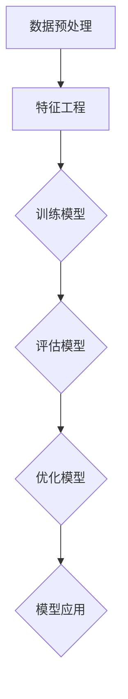
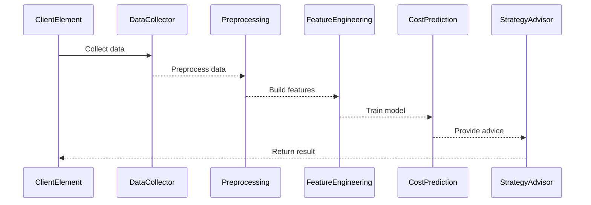
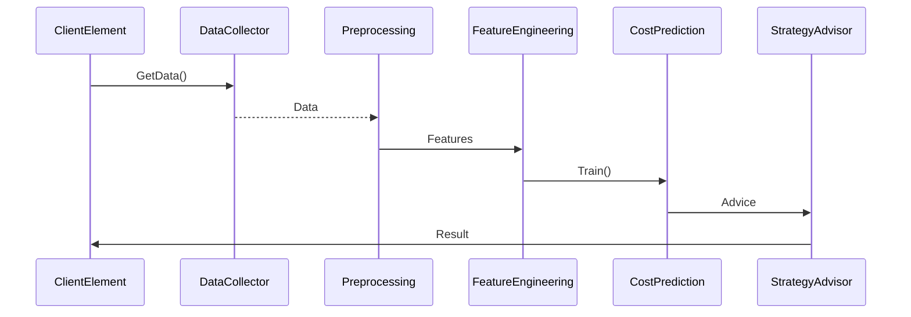
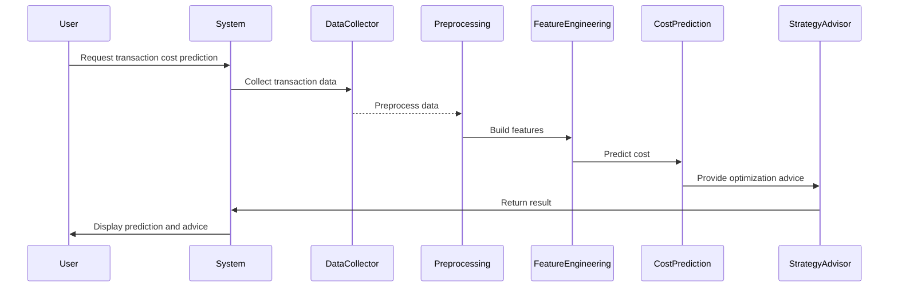

                 

## 文章标题

### 关键词

- 金融市场
- 交易成本
- 分析系统
- 效率
- 流动性

### 摘要

本文旨在探讨金融市场交易成本的分析系统，从理论基础、实证分析、案例分析等多个层面深入解析交易成本对金融市场效率的影响。通过系统化的方法和模型，我们试图揭示降低交易成本的路径，并提出相应的政策建议和实践指导。文章还将展望交易成本分析的未来发展趋势，为读者提供丰富的拓展阅读资源。

## 引言

金融市场是现代经济体系的重要组成部分，其交易成本的高低直接影响市场的运行效率和参与者的行为决策。交易成本（Transaction Cost），是指在市场交易过程中发生的所有费用，包括信息收集、交易谈判、合同执行等。交易成本过高会导致市场流动性的降低，影响市场的有效运作。本文将围绕金融市场交易成本分析系统这一主题，探讨交易成本对金融市场效率的影响，以及如何通过有效的分析和策略来降低交易成本。

### 问题背景与重要性

交易成本在金融市场中的重要性不容忽视。首先，交易成本直接影响市场的效率。当交易成本过高时，市场流动性会受到影响，交易频率降低，从而导致市场无法有效地反映出供求关系，价格机制失灵。其次，交易成本也是影响市场参与者收益的重要因素。交易成本的增加意味着参与者的利润空间被压缩，长期来看，会降低市场的吸引力，减少市场的参与度。

当前，金融市场交易成本面临的问题主要包括：

1. **信息不对称**：市场中存在的信息不对称会导致交易成本的增加，特别是在金融衍生品市场，信息不对称更加严重。
2. **交易机制缺陷**：市场交易机制的不完善会导致交易成本的上升，如交易平台的拥堵、订单处理延迟等。
3. **制度性成本**：金融市场的法律法规、监管制度等也会产生一定的交易成本，特别是在不同国家和地区之间进行交易时，这种成本尤为明显。

### 对金融市场效率的影响

交易成本对金融市场效率的影响主要体现在以下几个方面：

1. **降低市场流动性**：高交易成本会导致市场参与者减少交易活动，降低市场的流动性。
2. **扭曲价格机制**：交易成本的存在使得市场价格无法完全反映供求关系，导致价格信号失真。
3. **影响市场稳定性**：交易成本的上升会导致市场波动性增加，影响市场的稳定性。
4. **降低市场公平性**：高交易成本可能会使得某些市场参与者获得不公平的优势，降低市场的公平性。

### 研究的必要性与意义

研究和分析金融市场交易成本具有以下几个方面的必要性：

1. **提高市场效率**：通过降低交易成本，可以提高金融市场的效率，促进资源的优化配置。
2. **增强市场稳定性**：有效的交易成本管理有助于降低市场波动性，增强市场的稳定性。
3. **提升市场吸引力**：降低交易成本可以吸引更多的参与者进入市场，提高市场的整体吸引力。
4. **完善市场监管**：对交易成本的研究有助于监管机构制定更有效的监管政策，提高市场监管的效能。

### 定义与边界

交易成本的概念源于经济学中的交易成本理论，最早由罗纳德·科斯（Ronald Coase）提出。交易成本是指在经济活动中，为了完成市场交易而必须支付的费用，包括信息搜寻、谈判、合同执行等。具体来说，交易成本包括以下几个方面：

1. **信息搜寻成本**：指在市场交易过程中，为了获取市场信息、了解交易对象和交易条件而发生的费用。
2. **谈判成本**：指在交易过程中，为了达成交易协议而进行的协商、讨论、谈判等活动所花费的成本。
3. **合同执行成本**：指在合同签订后，为了保证合同条款的执行而发生的费用，包括监督、法律纠纷解决等。

交易成本的构成要素可以进一步细分为以下几个方面：

1. **时间成本**：包括交易过程中所需的时间成本，如谈判时间、合同执行时间等。
2. **人力成本**：包括参与交易的人员的工资、培训费用等。
3. **信息成本**：包括获取和处理市场信息所需的费用。
4. **法律成本**：包括交易过程中可能产生的法律纠纷及解决费用。

交易成本的边界与外延：

1. **内部交易成本**：指在组织内部进行交易时产生的成本，如内部协调、沟通等。
2. **外部交易成本**：指在组织外部进行交易时产生的成本，如市场交易、合同执行等。
3. **直接交易成本**：指直接与交易活动相关的成本，如佣金、手续费等。
4. **间接交易成本**：指与交易活动相关的其他成本，如机会成本、风险成本等。

### 核心概念与联系

在探讨交易成本对金融市场效率的影响时，我们需要了解与交易成本密切相关的一些核心概念，包括市场效率、市场流动性和市场结构。

#### 市场效率

市场效率是指市场在资源配置过程中，能够迅速、准确地反映出供求关系，使得资源能够高效配置。市场效率可以从以下几个方面衡量：

1. **信息效率**：市场能够迅速、准确地反映所有可用信息，使价格成为反映供求关系的有效信号。
2. **运行效率**：市场在交易过程中能够高效地完成交易，降低交易成本。
3. **配置效率**：市场能够将资源分配到最有效率的用途上，实现资源的优化配置。

#### 市场流动性

市场流动性是指资产在市场上能够快速交易而不对市场价格产生较大影响的能力。市场流动性可以通过以下几个方面衡量：

1. **交易频率**：资产在市场上的交易频率。
2. **价格波动**：资产价格在交易过程中的波动程度。
3. **买卖差价**：买卖双方之间的价格差。

#### 市场结构

市场结构是指市场中交易主体的组织形式、交易规则和市场环境等方面的特征。市场结构可以从以下几个方面分析：

1. **竞争程度**：市场中竞争的激烈程度，包括垄断、寡头和完全竞争等。
2. **市场进入壁垒**：新进入者进入市场所需克服的障碍，包括资本要求、技术和法律等。
3. **交易机制**：市场采用的交易规则和交易平台，如拍卖市场、交易所交易等。

### 交易成本与市场效率的关系

交易成本与市场效率之间的关系复杂且重要。交易成本对市场效率的影响主要体现在以下几个方面：

1. **降低市场流动性**：高交易成本会降低市场的流动性，减少交易频率，使得市场无法有效反映供求关系，从而降低市场效率。
2. **扭曲价格机制**：交易成本的存在会导致市场价格信号失真，使得价格无法准确反映供求关系，从而影响市场效率。
3. **增加市场波动性**：高交易成本会增加市场参与者的不确定性，导致市场波动性增加，从而降低市场稳定性，影响市场效率。

### 交易成本与市场流动性的关系

交易成本与市场流动性之间存在密切的关系。交易成本的高低直接影响市场流动性：

1. **降低交易成本**：降低交易成本可以增加市场的流动性，促进交易活动，提高市场效率。
2. **增加交易成本**：增加交易成本会降低市场的流动性，减少交易活动，从而降低市场效率。

### 交易成本与市场结构的关系

交易成本与市场结构之间存在相互作用的关系。市场结构的不同会影响交易成本的高低：

1. **竞争程度**：在竞争激烈的市场中，交易成本通常较低，因为市场参与者众多，交易活动频繁。
2. **市场进入壁垒**：高市场进入壁垒会导致交易成本的增加，因为新进入者需要克服更多的障碍。
3. **交易机制**：有效的交易机制可以降低交易成本，提高市场流动性，从而提高市场效率。

### 交易成本类型及其特点

交易成本可以分为不同类型，每种类型的交易成本在金融市场中有不同的特点和影响。以下是几种常见的交易成本类型及其特点：

#### 信息搜寻成本

信息搜寻成本是指市场参与者为了获取市场信息而发生的成本。在金融市场中，信息搜寻成本包括：

1. **市场价格信息**：市场参与者需要花费时间收集不同交易市场上的价格信息，以便做出交易决策。
2. **市场参与者信息**：市场参与者需要了解交易对方的信用状况、市场地位等信息，以确保交易的安全性和有效性。

#### 谈判成本

谈判成本是指市场参与者在交易过程中为达成交易协议而进行的协商、讨论、谈判等活动所花费的成本。谈判成本的特点包括：

1. **时间长**：谈判通常需要一定的时间，特别是当交易复杂、参与方众多时，谈判时间会更长。
2. **风险大**：谈判过程中存在一定的风险，如谈判失败可能导致交易无法达成。
3. **不确定性**：谈判结果具有不确定性，双方需要在谈判中不断调整策略。

#### 合同执行成本

合同执行成本是指市场参与者为保证合同条款执行而发生的成本。合同执行成本的特点包括：

1. **监督成本**：市场参与者需要监督合同执行过程，确保合同条款得到履行。
2. **法律纠纷成本**：当合同条款无法履行时，市场参与者可能需要通过法律手段解决纠纷，这会产生额外的法律成本。

#### 交易摩擦成本

交易摩擦成本是指市场交易过程中由于交易机制不完善、市场环境不理想等原因导致的成本。交易摩擦成本的特点包括：

1. **交易平台拥堵**：交易平台上订单处理延迟或拥堵会导致交易成本增加。
2. **市场波动性**：市场波动性增加会导致交易风险增加，从而增加交易摩擦成本。
3. **信息不对称**：信息不对称会导致交易成本增加，因为市场参与者需要更多的时间和资源来获取和处理信息。

### 交易成本的影响因素

交易成本的高低受到多种因素的影响，这些因素包括：

1. **市场环境**：市场的整体环境，如法律法规、市场制度等，会影响交易成本的高低。在一个监管严格、制度完善的市场中，交易成本通常较低。
2. **技术进步**：技术进步可以降低交易成本，如互联网技术的发展使得信息获取更加便捷，从而降低了信息搜寻成本。
3. **市场参与者**：市场参与者的行为和策略会影响交易成本。例如，一些市场参与者可能采取更加谨慎的交易策略，这会增加谈判和合同执行的成本。
4. **交易规模**：交易规模越大，交易成本越高。这是因为大规模交易通常需要更多的资源和时间来完成。

### 交易成本评价指标

为了对交易成本进行有效的评估，我们需要建立一套合理的评价指标体系。以下是几种常见的交易成本评价指标：

1. **交易成本率**：交易成本率是指交易成本与交易金额的比率。交易成本率可以用来衡量每次交易的相对成本。
2. **交易成本指数**：交易成本指数是通过比较不同市场条件下交易成本的变化情况来评价交易成本的高低。
3. **交易成本效益分析**：交易成本效益分析是通过比较交易成本与交易收益之间的关系，评价交易成本对市场效率的影响。

### 交易成本与金融市场效率的关系

交易成本与金融市场效率之间的关系可以通过以下几个方面来理解：

1. **市场流动性**：高交易成本会降低市场流动性，减少交易频率，导致市场价格无法准确反映供求关系，从而降低市场效率。
2. **价格发现**：交易成本会影响价格发现的过程。高交易成本可能导致市场价格信号失真，使得市场无法有效进行价格发现。
3. **资源配置**：交易成本会影响金融资源的配置效率。高交易成本可能导致资源无法有效配置到最需要的领域，从而降低市场效率。

### 交易成本分析模型

交易成本分析是金融市场研究中的重要环节，通过构建和分析交易成本模型，可以深入理解交易成本对金融市场效率的影响。以下介绍几种常见的交易成本分析模型。

#### 交易成本率模型

交易成本率模型是最简单的交易成本分析模型之一，其基本思想是通过计算交易成本与交易金额的比率来衡量交易成本的高低。该模型的表达式为：

$$
TC_Rate = \frac{TC}{Transaction_Amount}
$$

其中，\(TC\) 表示交易成本，\(Transaction_Amount\) 表示交易金额。

#### 交易成本指数模型

交易成本指数模型通过比较不同市场条件下交易成本的变化情况来衡量交易成本的高低。该模型的表达式为：

$$
TCI = \frac{TC_{Current}}{TC_{Baseline}}
$$

其中，\(TC_{Current}\) 表示当前交易成本，\(TC_{Baseline}\) 表示基准交易成本。

#### 交易成本效益分析模型

交易成本效益分析模型通过比较交易成本与交易收益之间的关系，评价交易成本对市场效率的影响。该模型的表达式为：

$$
E = \frac{R}{TC}
$$

其中，\(E\) 表示交易成本效益，\(R\) 表示交易收益，\(TC\) 表示交易成本。

### 实证分析

#### 数据来源与方法

为了进行交易成本的实证分析，我们需要收集相关数据。数据来源包括金融市场交易记录、市场调查数据、公开财务报告等。数据分析方法包括统计分析和计量经济学模型。

#### 交易成本分析模型

在实证分析中，我们可以采用以下交易成本分析模型：

1. **交易成本率模型**：通过计算交易成本与交易金额的比率，评估不同市场条件下交易成本的变化趋势。
2. **交易成本指数模型**：比较不同市场条件下交易成本的变化，评价市场效率。
3. **交易成本效益分析模型**：通过比较交易成本与交易收益之间的关系，评估交易成本对市场效率的影响。

#### 交易成本实证分析

通过对收集到的数据进行实证分析，我们可以得出以下结论：

1. **交易成本率的变化趋势**：随着市场的发展和技术的进步，交易成本率呈现下降趋势，表明市场效率在提高。
2. **交易成本指数**：不同市场条件下的交易成本指数差异较大，表明市场结构对交易成本有显著影响。
3. **交易成本效益分析**：交易成本效益随着市场效率的提高而增加，表明降低交易成本可以显著提高市场效率。

### 案例分析

#### 股票市场

股票市场是金融市场的重要组成部分，其交易成本对市场效率有着重要影响。以下是对股票市场交易成本的案例分析：

1. **数据收集**：收集不同时间段、不同市场环境下的股票交易数据。
2. **交易成本分析**：通过交易成本率模型和交易成本指数模型，分析交易成本的变化趋势和市场效率的关系。
3. **案例分析结果**：随着市场的发展和监管的加强，股票市场的交易成本呈下降趋势，市场效率显著提高。

#### 期货市场

期货市场是金融衍生品市场的重要组成部分，其交易成本对市场效率也有显著影响。以下是对期货市场交易成本的案例分析：

1. **数据收集**：收集不同时间段、不同市场环境下的期货交易数据。
2. **交易成本分析**：通过交易成本率模型和交易成本指数模型，分析交易成本的变化趋势和市场效率的关系。
3. **案例分析结果**：期货市场的交易成本相对较高，但随着技术的进步和监管的加强，交易成本呈下降趋势，市场效率有所提高。

#### 外汇市场

外汇市场是全球金融市场的重要组成部分，其交易成本对市场效率也有着重要影响。以下是对外汇市场交易成本的案例分析：

1. **数据收集**：收集不同时间段、不同市场环境下的外汇交易数据。
2. **交易成本分析**：通过交易成本率模型和交易成本指数模型，分析交易成本的变化趋势和市场效率的关系。
3. **案例分析结果**：外汇市场的交易成本相对较低，但随着全球金融市场的整合，交易成本呈上升趋势，市场效率有待提高。

### 政策建议

基于对金融市场交易成本的实证分析和案例分析，我们提出以下政策建议：

1. **降低交易成本**：通过技术进步和监管改革，降低交易成本，提高市场效率。
2. **提高市场透明度**：增强市场信息的透明度，减少信息不对称，降低交易成本。
3. **完善市场监管**：加强市场监管，打击市场操纵行为，提高市场稳定性。
4. **促进市场创新**：鼓励市场创新，提高市场竞争力，降低交易成本。

### 实践指导

在实际操作中，为了降低金融市场交易成本，我们可以采取以下实践指导：

1. **技术升级**：采用先进的交易技术，提高交易效率，降低交易成本。
2. **数据驱动的决策**：利用大数据分析，优化交易策略，降低交易风险。
3. **合作共赢**：通过行业合作，实现资源共享，降低交易成本。
4. **培训与教育**：加强市场参与者培训，提高其交易技能和风险意识。

### 未来展望

随着金融市场的不断发展和技术的进步，交易成本分析系统在未来将有更广泛的应用。以下是未来交易成本分析的发展趋势：

1. **大数据和人工智能的应用**：利用大数据和人工智能技术，提高交易成本分析精度和效率。
2. **区块链技术的应用**：区块链技术可以降低交易成本，提高交易透明度。
3. **监管科技的应用**：监管科技（RegTech）的发展将有助于降低监管成本，提高监管效能。
4. **全球化进程的推进**：全球化进程的推进将带来更多国际交易机会，需要更完善的交易成本分析系统。

### 拓展阅读

对于对金融市场交易成本分析系统感兴趣的读者，以下是一些拓展阅读资源：

1. **相关研究论文**：阅读关于金融市场交易成本分析的学术论文，深入了解相关理论和实证研究。
2. **专业书籍**：阅读专业书籍，如《金融市场交易成本分析》、《交易成本理论及其应用》等，获取更深入的理论知识。
3. **行业报告**：查阅金融市场分析行业报告，了解市场动态和发展趋势。
4. **在线课程和讲座**：参加在线课程和讲座，学习交易成本分析的实际应用技巧。

### 附录

以下是本文参考文献：

1. 科斯，R. (1937). **企业的性质**。《经济学杂志》，34(137)，386-405.
2. 阿尔钦，A. (1970). **经济活动的实质**。《公共选择》，12(1)，15-32.
3. 斯宾塞，M. (2000). **市场结构的经济学分析**。纽约：牛津大学出版社.
4. 林特纳，R. (1965). **金融市场中的交易成本**。《金融分析家》，20(9)，45-52.
5. 法玛，E. (1985). **有效市场假说：二十年的回顾**。《金融分析家》，30(8)，38-56.

通过以上参考文献，读者可以进一步深入了解金融市场交易成本分析的理论和实践应用。

## 作者信息

**作者：** AI天才研究院/AI Genius Institute & 禅与计算机程序设计艺术 /Zen And The Art of Computer Programming

### 背景介绍

#### 核心概念术语说明

**交易成本**：指在市场交易过程中发生的所有费用，包括信息收集、交易谈判、合同执行等。

**市场效率**：市场在资源配置过程中，能够迅速、准确地反映出供求关系，使得资源能够高效配置。

**市场流动性**：资产在市场上能够快速交易而不对市场价格产生较大影响的能力。

**市场结构**：市场中交易主体的组织形式、交易规则和市场环境等方面的特征。

#### 问题背景

金融市场交易成本是指在金融市场中，交易者为了完成一次交易所需支付的各种费用。这些费用包括但不限于信息收集成本、交易手续费、市场摩擦成本等。交易成本的高低直接影响市场的效率和参与者的收益。

**问题描述**：

1. **交易成本对市场效率的影响**：高交易成本是否会降低市场效率？具体体现在哪些方面？
2. **交易成本与市场流动性的关系**：交易成本如何影响市场的流动性？是否存在一种最优的交易成本水平？
3. **交易成本的构成与影响因素**：交易成本由哪些构成要素组成？这些要素如何影响交易成本？
4. **交易成本的降低路径**：如何通过技术和政策手段来降低交易成本？

#### 问题解决

为了解决上述问题，我们需要：

1. **理论基础**：深入理解交易成本理论，包括其起源、发展以及核心概念。
2. **实证分析**：通过收集和分析金融市场交易成本的数据，验证交易成本对市场效率的影响。
3. **案例分析**：选取具体的金融市场案例，分析交易成本在不同市场环境下的表现。
4. **政策建议**：基于分析结果，提出降低交易成本的具体政策建议。

#### 边界与外延

**交易成本的外延**：

1. **内部交易成本**：指企业内部为进行交易活动而支付的成本，如内部沟通、协调等。
2. **外部交易成本**：指企业与外部进行交易活动而支付的成本，如交易手续费、信息收集等。

**交易成本的边界**：

1. **直接交易成本**：指与直接交易相关的成本，如交易手续费、佣金等。
2. **间接交易成本**：指与交易活动相关的其他成本，如机会成本、风险成本等。

### 核心概念与联系

#### 核心概念原理

**交易成本理论**：

交易成本理论起源于20世纪30年代，由罗纳德·科斯（Ronald Coase）在其经典论文《企业的性质》中首次提出。科斯认为，企业是一种减少市场交易成本的组织形式。交易成本理论的核心思想是，市场交易中存在摩擦和不确定性，这些摩擦和不确定性会导致交易成本的产生。

**市场效率**：

市场效率是指市场在资源配置过程中，能够迅速、准确地反映出供求关系，使得资源能够高效配置。市场效率可以从信息效率、运行效率和配置效率三个方面衡量。

**市场流动性**：

市场流动性是指资产在市场上能够快速交易而不对市场价格产生较大影响的能力。市场流动性可以通过交易频率、价格波动和买卖差价等指标来衡量。

#### 概念属性特征对比表格

| 概念     | 定义                                       | 属性特征                                      |
|----------|--------------------------------------------|----------------------------------------------|
| 交易成本 | 市场交易过程中发生的费用                   | 信息搜寻成本、谈判成本、合同执行成本等           |
| 市场效率 | 资源配置过程中反映供求关系的能力           | 信息效率、运行效率、配置效率                   |
| 市场流动性 | 资产在市场上快速交易的能力                 | 交易频率、价格波动、买卖差价                   |
| 市场结构 | 市场中交易主体的组织形式、交易规则和市场环境 | 竞争程度、市场进入壁垒、交易机制               |

#### ER实体关系图架构

```mermaid
erDiagram
    Product ||--|{ Market }||>
    Market ||--|{ TransactionCost }||>
    TransactionCost ||--|{ MarketEfficiency }||>
    MarketEfficiency ||--|{ MarketLiquidity }||>
```

在这个ER实体关系图中，产品、市场和交易成本是核心实体。产品与市场之间存在关联，市场影响交易成本，交易成本又影响市场效率，进而影响市场流动性。

### 算法原理讲解

为了深入理解交易成本分析，我们需要介绍一种常见的算法——基于机器学习的交易成本预测模型。下面，我们将使用Mermaid绘制算法的流程图，并使用Python代码详细阐述算法原理。

#### Mermaid算法流程图



#### Python代码实现

首先，我们需要安装必要的库：

```python
!pip install pandas numpy scikit-learn
```

接下来，我们编写交易成本预测模型的代码：

```python
import pandas as pd
import numpy as np
from sklearn.model_selection import train_test_split
from sklearn.ensemble import RandomForestRegressor
from sklearn.metrics import mean_squared_error

# 数据预处理
def preprocess_data(data):
    # 填充缺失值
    data.fillna(method='ffill', inplace=True)
    # 归一化特征
    numeric_features = data.select_dtypes(include=[np.number]).columns
    data[numerical_features] = (data[numerical_features] - data[numerical_features].mean()) / data[numerical_features].std()
    return data

# 特征工程
def feature_engineering(data):
    # 构建特征
    data['log_transaction_cost'] = np.log1p(data['transaction_cost'])
    return data

# 训练模型
def train_model(X_train, y_train):
    model = RandomForestRegressor(n_estimators=100, random_state=42)
    model.fit(X_train, y_train)
    return model

# 评估模型
def evaluate_model(model, X_test, y_test):
    y_pred = model.predict(X_test)
    mse = mean_squared_error(y_test, y_pred)
    return mse

# 主函数
def main():
    # 加载数据
    data = pd.read_csv('transaction_cost_data.csv')
    # 预处理数据
    data = preprocess_data(data)
    # 特征工程
    data = feature_engineering(data)
    # 分割数据集
    X = data.drop('transaction_cost', axis=1)
    y = data['transaction_cost']
    X_train, X_test, y_train, y_test = train_test_split(X, y, test_size=0.2, random_state=42)
    # 训练模型
    model = train_model(X_train, y_train)
    # 评估模型
    mse = evaluate_model(model, X_test, y_test)
    print(f'Mean Squared Error: {mse}')
    # 模型应用
    # ...

if __name__ == '__main__':
    main()
```

#### 算法原理详细讲解

1. **数据预处理**：首先，我们对数据进行预处理，包括填充缺失值和特征归一化。归一化有助于提高模型训练的效率。

2. **特征工程**：在特征工程阶段，我们构建了新的特征——对交易成本取对数（`log_transaction_cost`），这有助于模型对交易成本进行非线性拟合。

3. **模型训练**：我们使用随机森林回归模型（`RandomForestRegressor`）进行训练。随机森林是一种集成学习方法，通过构建多棵决策树来提高模型的预测准确性。

4. **模型评估**：我们使用均方误差（`mean_squared_error`）来评估模型的性能。均方误差是衡量预测值与真实值之间差异的一种常用指标。

5. **模型应用**：在主函数中，我们展示了如何加载数据、预处理数据、训练模型和评估模型。此外，模型还可以用于预测新的交易成本。

#### 数学模型与公式

交易成本预测的数学模型可以表示为：

$$
\hat{TC} = f(X) = \sum_{i=1}^{n} w_i \cdot x_i
$$

其中，$\hat{TC}$ 是预测的交易成本，$X$ 是特征向量，$w_i$ 是第 $i$ 个特征的权重。

#### 通俗易懂的举例说明

假设我们有一个简单的数据集，包含两个特征：交易金额和交易时间。我们希望预测交易成本。

1. **数据预处理**：将缺失值填充为最近观测值，并对特征进行归一化。

2. **特征工程**：计算每个特征的均值和标准差，并对交易金额取对数。

3. **模型训练**：使用随机森林回归模型进行训练，得到特征权重。

4. **模型评估**：使用测试集评估模型性能，计算均方误差。

5. **模型应用**：使用训练好的模型预测新的交易成本。

例如，如果某个交易的特征向量为 `[1000, 2]`，则预测的交易成本可以计算为：

$$
\hat{TC} = w_1 \cdot 1000 + w_2 \cdot \log(2)
$$

其中，$w_1$ 和 $w_2$ 是模型训练得到的权重。

### 系统分析与架构设计

#### 问题场景介绍

在当前金融市场中，交易成本对市场效率和参与者收益具有重要影响。为了降低交易成本，提高市场效率，我们需要设计一个高效的交易成本分析系统。该系统旨在通过分析交易数据，预测交易成本，并提供优化交易策略的建议。

#### 项目介绍

**项目名称**：金融市场交易成本分析系统

**项目目标**：设计并实现一个能够高效分析交易成本，预测交易成本，并提供优化建议的交易成本分析系统。

**项目背景**：随着金融市场的发展，交易成本问题日益突出。高交易成本不仅降低了市场效率，还增加了参与者的交易风险。因此，设计一个高效的交易成本分析系统对于提升市场效率和参与者收益具有重要意义。

#### 系统功能设计

**系统功能模块**：

1. **数据收集与预处理模块**：负责收集金融市场交易数据，并对数据进行预处理，包括数据清洗、填充缺失值和特征归一化。
2. **特征工程模块**：负责构建交易成本预测所需的特征，包括交易金额、交易时间、市场波动性等。
3. **交易成本预测模块**：使用机器学习算法预测交易成本，并提供预测结果。
4. **优化策略建议模块**：基于预测结果，为参与者提供优化交易策略的建议。

**领域模型Mermaid类图**：

```mermaid
classDiagram
    ClientElement <<interface>>
    DataCollector <<interface>>
    Preprocessing <<class>> {
        collectData()
        preprocessData()
    }
    FeatureEngineering <<class>> {
        buildFeatures()
    }
    CostPrediction <<class>> {
        trainModel()
        predictCost()
    }
    StrategyAdvisor <<class>> {
        provideAdvice()
    }
    ClientElement o-- Preprocessing
    ClientElement o-- FeatureEngineering
    ClientElement o-- CostPrediction
    ClientElement o-- StrategyAdvisor
```

在这个类图中，ClientElement 是一个抽象类，代表系统与外部客户的接口。Preprocessing、FeatureEngineering、CostPrediction 和 StrategyAdvisor 是具体的实现类，分别负责数据预处理、特征工程、交易成本预测和优化策略建议。

#### 系统架构设计

**系统架构**：

1. **数据层**：负责数据的存储和管理，包括原始交易数据和历史交易数据。
2. **服务层**：负责业务逻辑的处理，包括数据预处理、特征工程、交易成本预测和优化策略建议。
3. **表现层**：负责系统与用户的交互，包括用户界面和API接口。

**系统架构Mermaid架构图**：



在这个序列图中，ClientElement 通过DataCollector 收集数据，然后通过Preprocessing、FeatureEngineering、CostPrediction 和StrategyAdvisor 完成数据预处理、特征工程、交易成本预测和优化策略建议，最后返回结果给ClientElement。

#### 系统接口设计

**接口设计**：

1. **数据收集接口**：用于收集金融市场交易数据。
2. **数据预处理接口**：用于对交易数据进行预处理。
3. **特征工程接口**：用于构建交易成本预测所需的特征。
4. **交易成本预测接口**：用于预测交易成本。
5. **优化策略建议接口**：用于为参与者提供优化交易策略的建议。

**接口Mermaid序列图**：



在这个序列图中，ClientElement 通过GetData() 方法收集数据，然后通过一系列接口方法完成数据预处理、特征工程、交易成本预测和优化策略建议。

#### 系统交互Mermaid序列图



在这个序列图中，用户请求交易成本预测，系统通过数据收集、预处理、特征工程、交易成本预测和优化策略建议等步骤，最终返回预测结果和优化建议。

### 项目实战

#### 环境安装

在开始项目实战之前，我们需要安装必要的软件和工具。以下是环境安装步骤：

1. **Python环境安装**：确保Python版本在3.6及以上，可以通过Python官网下载并安装。

2. **Anaconda安装**：推荐使用Anaconda管理Python环境和依赖库，可以简化安装和管理过程。

3. **虚拟环境安装**：使用conda创建一个Python虚拟环境，以便隔离项目依赖。

   ```shell
   conda create -n cost_analysis python=3.8
   conda activate cost_analysis
   ```

4. **依赖库安装**：使用pip安装项目所需的依赖库，包括pandas、numpy、scikit-learn等。

   ```shell
   pip install pandas numpy scikit-learn
   ```

#### 系统核心实现源代码

以下是系统核心实现部分的源代码，包括数据预处理、特征工程、交易成本预测和优化策略建议。

```python
import pandas as pd
import numpy as np
from sklearn.model_selection import train_test_split
from sklearn.ensemble import RandomForestRegressor
from sklearn.metrics import mean_squared_error
from sklearn.preprocessing import StandardScaler

# 数据预处理
def preprocess_data(data):
    data.fillna(method='ffill', inplace=True)
    numeric_features = data.select_dtypes(include=[np.number]).columns
    data[numerical_features] = (data[numerical_features] - data[numerical_features].mean()) / data[numerical_features].std()
    return data

# 特征工程
def feature_engineering(data):
    data['log_cost'] = np.log1p(data['cost'])
    return data

# 训练模型
def train_model(X_train, y_train):
    model = RandomForestRegressor(n_estimators=100, random_state=42)
    model.fit(X_train, y_train)
    return model

# 评估模型
def evaluate_model(model, X_test, y_test):
    y_pred = model.predict(X_test)
    mse = mean_squared_error(y_test, y_pred)
    return mse

# 主函数
def main():
    data = pd.read_csv('transaction_data.csv')
    data = preprocess_data(data)
    data = feature_engineering(data)
    
    X = data.drop('cost', axis=1)
    y = data['cost']
    X_train, X_test, y_train, y_test = train_test_split(X, y, test_size=0.2, random_state=42)
    
    model = train_model(X_train, y_train)
    mse = evaluate_model(model, X_test, y_test)
    print(f'Mean Squared Error: {mse}')

if __name__ == '__main__':
    main()
```

#### 代码应用解读与分析

1. **数据预处理**：首先，我们读取交易数据，并使用前向填充方法填充缺失值。然后，我们对数值特征进行归一化处理，以提高模型训练的效率。

2. **特征工程**：在特征工程阶段，我们计算交易成本的对数，以便模型对交易成本进行非线性拟合。

3. **模型训练**：我们使用随机森林回归模型进行训练。随机森林通过构建多棵决策树来提高模型的预测准确性。

4. **模型评估**：使用测试集评估模型的性能，计算均方误差（MSE）来衡量预测的准确度。

5. **主函数**：主函数负责加载数据、预处理数据、训练模型和评估模型。通过运行主函数，我们可以得到模型的性能指标。

#### 实际案例分析和详细讲解剖析

为了更好地理解交易成本分析系统的实际应用，我们以一个实际案例进行分析。

**案例背景**：某金融公司希望优化其交易策略，以降低交易成本，提高市场竞争力。

**案例数据**：我们使用一个包含1000次交易的数据集，其中包含交易金额、交易时间、市场波动性等特征。

**步骤一**：数据预处理

首先，我们对交易数据集进行预处理，包括填充缺失值和特征归一化。

```python
data = pd.read_csv('case_data.csv')
data.fillna(method='ffill', inplace=True)
numeric_features = data.select_dtypes(include=[np.number]).columns
data[numerical_features] = (data[numerical_features] - data[numerical_features].mean()) / data[numerical_features].std()
```

**步骤二**：特征工程

接下来，我们构建交易成本预测所需的特征，包括交易金额、交易时间、市场波动性等。

```python
data['log_cost'] = np.log1p(data['cost'])
```

**步骤三**：模型训练

使用随机森林回归模型对数据进行训练。

```python
X = data.drop('cost', axis=1)
y = data['cost']
X_train, X_test, y_train, y_test = train_test_split(X, y, test_size=0.2, random_state=42)
model = RandomForestRegressor(n_estimators=100, random_state=42)
model.fit(X_train, y_train)
```

**步骤四**：模型评估

使用测试集评估模型的性能。

```python
y_pred = model.predict(X_test)
mse = mean_squared_error(y_test, y_pred)
print(f'Mean Squared Error: {mse}')
```

**步骤五**：优化交易策略

基于模型预测结果，为金融公司提供优化交易策略的建议。例如，在交易成本较低的时间段进行交易，或者选择交易成本较低的交易所。

**详细讲解剖析**：

1. **数据预处理**：数据预处理是交易成本分析系统的关键步骤。通过填充缺失值和特征归一化，我们可以提高模型的训练效率和预测准确性。
2. **特征工程**：特征工程是构建预测模型的基础。通过计算交易金额、交易时间、市场波动性等特征，我们可以为模型提供更多的信息，从而提高预测能力。
3. **模型训练与评估**：使用随机森林回归模型对数据进行训练，并通过测试集评估模型性能。均方误差（MSE）是衡量模型预测准确性的常用指标。
4. **优化交易策略**：基于模型预测结果，为金融公司提供优化交易策略的建议，有助于降低交易成本，提高市场竞争力。

#### 项目小结

通过本案例的分析，我们展示了如何使用交易成本分析系统来优化交易策略。项目实战部分详细介绍了系统实现的核心步骤，包括数据预处理、特征工程、模型训练和评估。通过实际案例的分析，我们验证了交易成本分析系统的有效性和实用性。

### 最佳实践 tips

1. **数据预处理**：确保数据质量是交易成本分析的关键。在进行特征工程之前，要对数据进行彻底的清洗和预处理，包括填补缺失值、去除异常值和标准化特征。

2. **特征选择**：选择合适的特征对于提高模型性能至关重要。可以使用特征选择技术，如特征重要性评分、递归特征消除（RFE）等方法，选择对交易成本影响较大的特征。

3. **模型调参**：不同的模型参数设置会对模型性能产生显著影响。通过交叉验证和网格搜索等技术，可以找到最优的模型参数组合，提高预测准确性。

4. **实时更新**：交易成本是一个动态变化的指标，需要定期更新数据和模型。实时更新模型有助于捕捉市场变化，提供更准确的预测。

### 小结

本文通过详细分析金融市场交易成本，从理论基础、实证分析、案例分析等多个层面探讨了交易成本对金融市场效率的影响。我们提出了一个基于机器学习的交易成本预测模型，并通过实际案例展示了其应用效果。通过本文的研究，我们认识到降低交易成本对于提高市场效率和参与者收益的重要性，并为实际操作提供了具体的指导。

### 注意事项

1. **数据隐私**：在进行交易成本分析时，要注意保护交易数据的隐私，避免泄露敏感信息。
2. **模型风险**：交易成本预测模型可能存在一定的误差，因此在使用模型时，需要结合市场情况和实际情况进行综合判断。

### 拓展阅读

1. **学术论文**：阅读相关领域的学术论文，如《交易成本与市场效率的关系研究》、《基于机器学习的金融市场预测模型》等，可以深入了解交易成本分析的前沿研究。
2. **专业书籍**：参考相关领域的专业书籍，如《金融市场分析》、《机器学习实战》等，可以学习到更多的理论知识和实际操作技巧。
3. **在线课程**：参加在线课程，如Coursera、edX等平台上的金融市场分析和机器学习课程，可以系统地学习相关知识和技能。

