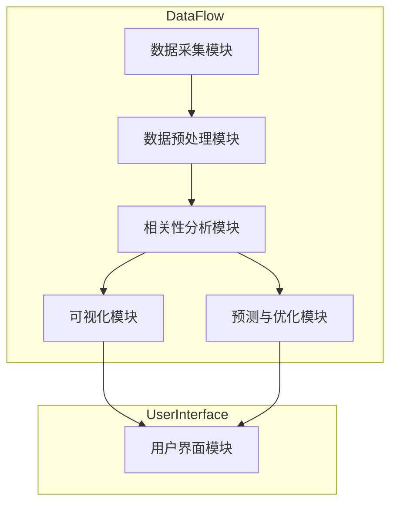
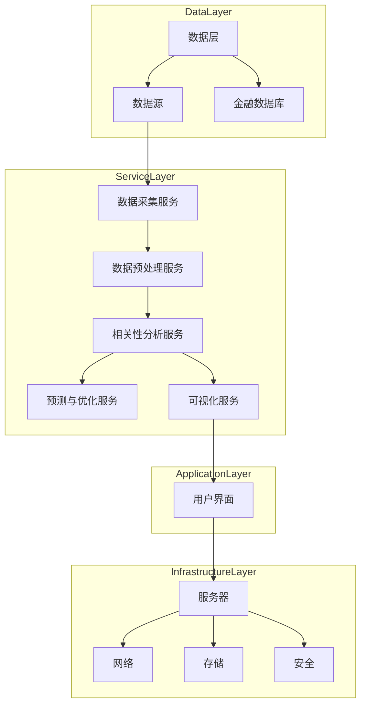
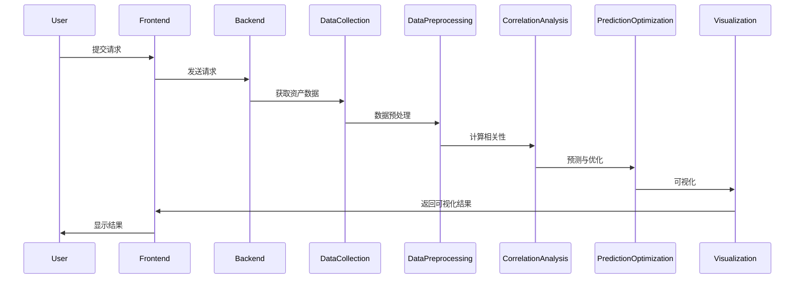

                 

### 背景介绍

#### 金融市场的概述

金融市场是金融资产的交易市场，它为各种金融工具提供了流动性和定价机制。金融市场主要包括股票市场、债券市场、外汇市场、期货市场和期权市场等。每个市场都有其独特的功能和参与者，但它们之间又存在着紧密的联系。例如，股票市场的波动可能会影响债券市场的利率，外汇市场的汇率波动可能会影响全球股市的表现。

**资产类别与市场结构**

金融资产可以分为债务资产、股权资产和衍生资产。债务资产主要包括债券、国债和商业票据等，它们通常为投资者提供固定的利息收入。股权资产则包括股票、基金和私募股权等，它们通常为投资者提供公司成长的潜在收益。衍生资产如期货、期权和掉期等，则用于对冲风险或进行投机。

金融市场结构复杂，包括交易所市场、场外市场、一级市场和二级市场等。交易所市场如纽约证券交易所（NYSE）和纳斯达克（NASDAQ）等，是标准化交易场所。场外市场（OTC）则包括柜台交易和协议交易等。一级市场是公司首次公开发行（IPO）的市场，二级市场则是投资者之间交易已发行证券的市场。

**跨资产相关性研究的意义**

跨资产相关性研究在金融市场分析中具有重要地位。首先，理解不同资产之间的相关性可以帮助投资者制定更加科学的投资组合策略，降低投资风险。其次，跨资产相关性分析能够揭示市场潜在的风险因素，帮助监管机构和投资者更好地理解市场的动态变化。

近年来，随着大数据和人工智能技术的发展，跨资产相关性研究的工具和模型也得到了极大的改进。例如，利用深度学习技术可以更准确地预测资产间的相关性变化，从而为投资者提供更为可靠的参考依据。

#### 跨资产相关性研究综述

**研究的背景**

跨资产相关性研究的背景可以追溯到金融市场的不确定性和复杂性。金融市场的波动性往往难以预测，而且不同市场之间存在复杂的相关性，这使得简单的资产投资策略难以适应市场的变化。例如，2008年的全球金融危机中，许多传统风险管理模型失效，导致大量投资者遭受了巨大的损失。

随着金融市场的发展和复杂性的增加，跨资产相关性研究变得越来越重要。为了应对这些挑战，研究人员和从业者开始探索如何利用数据分析和机器学习技术来提高资产组合管理的效率和效果。

**研究的方法与模型**

跨资产相关性研究的方法主要包括传统统计学方法、时间序列分析和现代机器学习方法。传统统计学方法如协方差矩阵和相关系数分析，能够提供基本的资产相关性信息。时间序列分析如格兰杰因果关系检验（Granger Causality Test），可以帮助研究者理解不同资产之间的动态关系。

现代机器学习方法，如主成分分析（PCA）、因子分析和神经网络等，则在复杂性和多样性更高的数据集上表现出色。这些方法不仅能够捕捉到传统的相关性，还能够揭示更深层次的结构性关系。例如，基于深度学习的图神经网络（Graph Neural Networks, GNNs）可以处理复杂的资产网络结构，提供更为精细的跨资产相关性分析。

**跨资产相关性研究的应用场景**

跨资产相关性研究在多个领域有着广泛的应用：

1. **风险管理**：通过分析资产间的相关性，投资者可以更好地理解投资组合的风险分布，从而制定更加有效的风险管理策略。

2. **投资组合优化**：了解不同资产间的相关性有助于投资者构建多样化的投资组合，降低整体投资风险，提高投资回报。

3. **市场预测**：跨资产相关性分析可以帮助预测市场走势，为投资者提供买卖决策的依据。

4. **监管合规**：监管机构可以利用跨资产相关性研究来监测金融市场风险，确保金融系统的稳定性。

5. **智能投资顾问**：利用机器学习和大数据技术，跨资产相关性分析可以为智能投资顾问系统提供决策支持，帮助普通投资者实现资产配置优化。

总的来说，跨资产相关性研究不仅为学术研究提供了新的视角和方法，还在实际应用中展现了巨大的潜力。随着技术的进步，未来这一领域的研究将会更加深入和广泛，为金融市场的稳健发展提供强有力的支持。### 第1章：金融市场概述

#### 1.1.1 金融市场的定义与功能

金融市场是指各种金融工具进行买卖和交易的场所，包括股票市场、债券市场、外汇市场、期货市场和期权市场等。金融市场的核心功能是提供流动性，即允许投资者在需要时将金融资产转换为现金，从而满足资金需求。

金融市场的定义可以从以下几个方面理解：

1. **交易场所**：金融市场是金融资产进行买卖交易的物理或虚拟场所。交易所、电子交易平台和场外市场都是金融市场的组成部分。
2. **中介机构**：金融市场上的中介机构，如银行、证券公司、基金管理公司等，为投资者提供了资金筹集和资金投资的平台。
3. **价格发现机制**：金融市场通过买卖双方交易行为，形成价格，这种价格反映了市场对资产价值的共识。
4. **风险管理工具**：金融市场的衍生品如期货、期权和掉期等，为投资者提供了对冲风险和投机获利的机会。

金融市场的功能包括：

1. **资金配置**：金融市场将资金从投资者转移到需要资金的实体，如企业、政府等，从而优化社会资源的配置。
2. **价格发现**：通过买卖双方的价格竞争，形成合理的资产价格，为市场参与者提供参考。
3. **风险分散**：投资者可以通过持有多种资产来分散风险，降低单一资产波动对整个投资组合的影响。
4. **资本形成**：金融市场为企业提供了筹集资金的机会，促进了企业的发展和创新。
5. **投资机会**：投资者可以根据市场情况，选择合适的投资工具，实现财富增值。

#### 1.1.2 资产类别与市场结构

金融市场的资产类别可以分为债务资产、股权资产和衍生资产。

1. **债务资产**：债务资产主要包括债券、国债、商业票据和公司债等。这些资产通常为投资者提供固定的利息收入，风险较低。债券市场是金融市场中规模最大、流动性最强的市场之一。

2. **股权资产**：股权资产包括股票、基金和私募股权等。股票市场是股权资产的主要交易场所。股权资产通常为投资者提供公司成长的潜在收益，但风险较高。

3. **衍生资产**：衍生资产如期货、期权和掉期等，它们的价值依赖于其他资产的价格。衍生资产主要用于对冲风险和投机。

金融市场结构包括以下几部分：

1. **交易所市场**：交易所市场如纽约证券交易所（NYSE）和纳斯达克（NASDAQ）等，是标准化交易的场所，提供了透明的价格和公平的交易环境。

2. **场外市场**：场外市场（OTC）包括柜台交易和协议交易等。场外市场提供了更加灵活的交易方式，但监管相对较为宽松。

3. **一级市场和二级市场**：一级市场是公司首次公开发行（IPO）的市场，二级市场则是投资者之间交易已发行证券的市场。一级市场为企业筹集资金，二级市场为投资者提供交易和投资机会。

4. **衍生品市场**：衍生品市场包括期货市场和期权市场等。这些市场提供了对冲风险和投机机会。

#### 1.1.3 跨资产相关性研究的意义

跨资产相关性研究在金融市场中具有重要意义：

1. **风险管理**：理解不同资产之间的相关性可以帮助投资者更好地评估投资组合的风险，制定有效的风险管理策略。

2. **投资组合优化**：通过分析资产间的相关性，投资者可以构建更有效的投资组合，降低整体风险，提高回报。

3. **市场预测**：跨资产相关性分析可以为市场预测提供参考，帮助投资者做出更明智的投资决策。

4. **监管合规**：监管机构可以利用跨资产相关性研究来监测金融市场风险，确保金融系统的稳定性。

5. **智能投资顾问**：利用机器学习和大数据技术，跨资产相关性分析可以为智能投资顾问系统提供决策支持，帮助普通投资者实现资产配置优化。

总的来说，跨资产相关性研究为金融市场分析和投资决策提供了重要的工具和理论基础。随着技术的发展，这一领域的研究将不断深入，为金融市场的稳健发展提供更有力的支持。### 第2章：跨资产相关性研究综述

#### 2.1.1 跨资产相关性研究的背景

跨资产相关性研究在金融市场分析中具有悠久的历史。早在20世纪初期，经济学家和金融学者就开始探讨不同资产之间的相关性问题。然而，由于技术手段的限制，早期的跨资产相关性研究主要依赖于传统的统计分析方法，如相关系数和协方差分析。

随着计算机技术的发展和数据获取能力的增强，跨资产相关性研究逐渐走向深入。特别是在20世纪80年代和90年代，随着金融市场的全球化和复杂化，跨资产相关性研究的重要性日益凸显。金融市场的波动性和不确定性增加了投资风险，如何通过分析资产间的相关性来降低风险成为了一个重要的研究方向。

此外，2008年全球金融危机的发生，使得跨资产相关性研究再次成为学术界和业界的焦点。传统风险管理模型在危机中表现不佳，揭示了跨资产相关性研究的重要性。为了应对这些挑战，研究人员开始探索更先进的方法和技术，如时间序列分析、因子分析和机器学习方法。

#### 2.1.2 跨资产相关性研究的方法与模型

跨资产相关性研究的方法可以分为传统统计方法、时间序列分析方法和现代机器学习方法。

1. **传统统计方法**：
   - **相关系数**：通过计算两个资产收益率之间的相关系数来衡量它们之间的线性关系。
   - **协方差矩阵**：协方差矩阵提供了多个资产之间线性关系的综合度量。
   - **回归分析**：通过回归模型来分析资产间的因果关系和相关性。

2. **时间序列分析方法**：
   - **格兰杰因果关系检验（Granger Causality Test）**：该方法通过检验一个时间序列是否可以作为另一个时间序列的预测变量，来判断两个资产之间的因果关系。
   - **自回归分布滞后模型（ARDL）**：该模型考虑了资产间的时间依赖性和滞后效应，能够更准确地捕捉跨资产相关性。

3. **现代机器学习方法**：
   - **主成分分析（PCA）**：PCA通过降维技术，将多个相关变量转化为几个主成分，从而简化分析过程，同时保留大部分信息。
   - **因子分析**：因子分析通过构建隐含的因子来解释资产间的相关性，能够揭示资产间更深层次的结构性关系。
   - **神经网络**：特别是深度学习技术，如卷积神经网络（CNN）和递归神经网络（RNN），可以处理复杂的非线性和时变相关性。
   - **图神经网络（GNN）**：GNN通过图结构来建模资产间的复杂关系，能够捕捉跨市场、跨资产的复杂网络结构。

#### 2.1.3 跨资产相关性研究的应用场景

跨资产相关性研究在多个领域有着广泛的应用：

1. **风险管理**：通过分析资产间的相关性，投资者可以更好地评估投资组合的风险，制定有效的风险管理策略。

2. **投资组合优化**：了解不同资产间的相关性有助于投资者构建多样化的投资组合，降低整体风险，提高回报。

3. **市场预测**：跨资产相关性分析可以帮助预测市场走势，为投资者提供买卖决策的依据。

4. **监管合规**：监管机构可以利用跨资产相关性研究来监测金融市场风险，确保金融系统的稳定性。

5. **智能投资顾问**：利用机器学习和大数据技术，跨资产相关性分析可以为智能投资顾问系统提供决策支持，帮助普通投资者实现资产配置优化。

6. **量化交易**：量化交易策略依赖于对资产间相关性的分析，通过构建相关性模型来执行自动化的交易操作。

7. **企业融资决策**：企业可以利用跨资产相关性分析来评估不同融资渠道的风险和回报，从而做出更明智的融资决策。

总的来说，跨资产相关性研究在金融市场的风险管理、投资组合优化、市场预测和监管合规等方面具有重要应用价值。随着技术的进步，未来这一领域的研究将会更加深入和广泛，为金融市场的稳健发展提供强有力的支持。### 第3章：资产相关性网络的基本概念

#### 3.1.1 资产相关性网络的定义

资产相关性网络是一种利用网络结构来表示和可视化金融市场中不同资产之间相关性关系的工具。这种网络结构可以看作是一个图，其中每个节点代表一个资产，每条边表示两个资产之间的相关性强度。资产相关性网络通过数学模型和算法，将金融市场中复杂的资产关系简化为可视化的网络图，使得研究者可以更直观地理解和分析这些关系。

资产相关性网络的主要目的是：

1. **揭示结构特征**：通过分析网络结构，可以识别出金融市场中具有关键作用的资产，以及它们之间的紧密联系。
2. **识别关键节点**：资产相关性网络可以帮助识别出具有高度影响力和重要性的资产，从而为投资决策提供参考。
3. **预测市场动态**：通过分析资产间的相关性变化，可以预测市场的潜在波动和趋势。

#### 3.1.2 资产相关性网络的要素

资产相关性网络的要素主要包括节点、边和权重。

1. **节点**：节点代表金融资产，可以是股票、债券、货币等。每个节点都有其特定的属性，如市值、波动率、市场地位等。

2. **边**：边表示两个资产之间的相关性关系。边可以是有向的或无向的，有向边表示单向的相关性，而无向边表示双向的相关性。

3. **权重**：权重表示边上的相关性强度，通常用数值来表示，如相关系数、协方差等。权重越大，表示两个资产之间的相关性越强。

#### 3.1.3 资产相关性网络的度量方法

资产相关性网络的度量方法包括以下几种：

1. **相关系数**：相关系数是最常用的度量方法之一，用于衡量两个资产收益率之间的线性相关性。相关系数的取值范围在-1到1之间，越接近1或-1，表示相关性越强。

2. **协方差**：协方差度量两个资产收益率之间的总体变化关系，其数值越大，表示两个资产的收益率变化越一致。

3. **相似性度量**：如余弦相似度、欧氏距离等，这些方法可以用来比较不同资产之间的相似性。

4. **网络密度**：网络密度表示网络中边的数量与可能的最大边数的比值，用于衡量网络的紧密程度。

5. **聚类系数**：聚类系数表示网络中节点的邻居之间连接的紧密程度，用于衡量网络的局部结构。

6. **路径长度**：路径长度表示两个节点之间最短路径的长度，用于衡量网络的连通性。

通过这些度量方法，研究者可以全面分析资产相关性网络的特性，从而更好地理解金融市场中的复杂关系。这些度量方法不仅可以帮助识别关键资产和关键路径，还可以为投资策略和市场预测提供重要的参考信息。### 第4章：资产相关性网络的构建

#### 4.1.1 数据预处理

在构建资产相关性网络之前，数据预处理是至关重要的一步。数据预处理的主要目的是确保数据的质量和一致性，以便进行后续的分析。

1. **数据收集**：
   - 收集不同资产的历史价格数据、收益率数据等。
   - 数据来源可以是公开的金融数据库，如雅虎财经、彭博等，或者是交易所提供的官方数据。

2. **数据清洗**：
   - 去除缺失值和异常值，确保数据的有效性和完整性。
   - 对数据进行归一化处理，消除数据量级差异的影响。

3. **时间序列对齐**：
   - 确保所有资产的数据时间序列一致，如果某些资产的数据频率不同，需要进行插值或聚合处理。

4. **特征提取**：
   - 从原始数据中提取有用的特征，如收益率、波动率、交易量等，这些特征将用于计算资产间的相关性。

#### 4.1.2 资产相关性矩阵的计算

资产相关性矩阵是一个n×n的矩阵，其中n代表资产的数量。矩阵中的每个元素（i, j）表示资产i和资产j之间的相关性强度。

1. **相关性度量方法**：
   - **相关系数**：计算两个资产收益率的皮尔逊相关系数，公式如下：
     $$r_{ij} = \frac{\sum_{t=1}^{n}(r_{it} - \bar{r}_i)(r_{jt} - \bar{r}_j)}{\sqrt{\sum_{t=1}^{n}(r_{it} - \bar{r}_i)^2} \sqrt{\sum_{t=1}^{n}(r_{jt} - \bar{r}_j)^2}}$$
     其中，$r_{it}$和$r_{jt}$分别表示资产i和资产j在时间t的收益率，$\bar{r}_i$和$\bar{r}_j$分别表示资产i和资产j的平均收益率。

   - **协方差**：计算两个资产收益率的协方差，公式如下：
     $$c_{ij} = \sum_{t=1}^{n}(r_{it} - \bar{r}_i)(r_{jt} - \bar{r}_j)$$

2. **构建资产相关性矩阵**：
   - 利用上述方法，计算所有资产对之间的相关性，并将结果填入资产相关性矩阵中。

   - 资产相关性矩阵具有如下性质：
     - 对称性：$r_{ij} = r_{ji}$
     - 单位矩阵：主对角线上的元素均为1，表示每个资产与其自身的相关性为1。

   - 注意：在实际应用中，可能会考虑使用其他相关性度量方法，如斯皮尔曼等级相关系数或肯德尔等级相关系数，以提供更全面的评估。

#### 4.1.3 资产网络图的绘制

资产网络图通过图形化方式展示资产之间的相关性关系。以下是绘制资产网络图的步骤：

1. **选择绘图工具**：
   - 可以使用专业的绘图工具，如Gephi、Cytoscape等，也可以使用Python的绘图库，如NetworkX和Matplotlib。

2. **设置节点和边**：
   - 节点代表资产，可以在图形中用圆形或其他形状表示。
   - 边表示资产之间的相关性，可以使用线条或弧线连接节点。

3. **设置边权重**：
   - 根据资产相关性矩阵中的数值，设置边的宽度或颜色，以表示相关性强度。
   - 通常，相关性越强，边的宽度或颜色越深。

4. **布局调整**：
   - 使用自动布局算法，如力导向布局（Force-directed layout），调整节点位置，使图形更加清晰易读。

5. **添加标签和注释**：
   - 为节点和边添加标签，显示资产名称和相关性数值。
   - 可以添加注释，解释图形的重要特征或趋势。

通过资产网络图，研究者可以直观地理解金融市场中不同资产之间的相关性关系，识别出关键资产和重要的关系路径，从而为投资决策和市场分析提供有力的支持。### 第5章：资产相关性网络的分析

#### 5.1.1 网络拓扑结构分析

资产相关性网络拓扑结构分析旨在揭示网络中的关键特征和模式，帮助投资者更好地理解市场结构和动态。

1. **聚类系数**：
   - 聚类系数衡量节点邻居之间的连接紧密程度。高聚类系数表示网络具有高度局部连接，有助于识别紧密的社群结构。
   - 公式：$$c = \frac{2 \times |E_{cliques}|}{|V| \times (|V| - 1)}$$
     其中，$E_{cliques}$为所有三角形的边数，$V$为节点数。

2. **平均路径长度**：
   - 平均路径长度表示网络中任意两个节点之间最短路径的平均长度。较短的平均路径长度意味着网络更连通，信息传播速度更快。
   - 公式：$$L = \frac{\sum_{i, j} d_{ij}}{N_{pairs}}$$
     其中，$d_{ij}$为节点i和节点j之间的最短路径长度，$N_{pairs}$为节点对的数量。

3. **网络密度**：
   - 网络密度衡量网络中边的实际数量与可能的最大边数之比，反映了网络的紧密程度。
   - 公式：$$\rho = \frac{|E|}{\binom{|V|}{2}}$$
     其中，$|E|$为边的数量，$\binom{|V|}{2}$为可能的最大边数。

4. **中心性度量**：
   - 中心性度量衡量节点在网络中的重要性，常用的中心性度量包括度中心性、介数和紧密中心性。
     - **度中心性**：节点连接的边数越多，度中心性越高。
       - 公式：$$C_d(v) = \frac{\sum_{u \in N(v)} 1}{N - 1}$$
         其中，$N(v)$为节点v的邻居节点数，$N$为总节点数。
     - **介数**：节点位于其他节点之间路径上的次数越多，介数越高。
       - 公式：$$C_b(v) = \frac{\sum_{i, j} \delta(i, j, v)}{N_{pairs}}$$
         其中，$\delta(i, j, v)$为路径i到路径j是否经过节点v。
     - **紧密中心性**：节点邻居节点的紧密中心性平均值越高，紧密中心性越高。
       - 公式：$$C_c(v) = \frac{\sum_{u \in N(v)} C_c(u)}{N(v)}$$

5. **小世界特性**：
   - 小世界特性是指网络具有既短的路径长度又高的聚类系数的特征。这有助于快速信息传播和稳定的市场行为。

#### 5.1.2 资产间相关性分析

资产间相关性分析旨在揭示资产之间的关联性和互动性，帮助投资者识别市场机会和风险。

1. **相关性强度分析**：
   - 分析资产间的相关系数或协方差值，识别高度相关的资产对，这些资产对可能具有相似的市场风险特征。
   - 使用热图或颜色编码展示资产间相关性强度，直观显示相关性分布。

2. **结构洞分析**：
   - 结构洞分析旨在识别网络中的关键节点，这些节点连接不同的资产社群，具有更高的信息传递和控制能力。
   - 使用度中心性、介数和紧密中心性等指标，筛选出关键节点，并分析其对整体网络结构的影响。

3. **异常值检测**：
   - 通过分析资产间的相关性矩阵，可以识别出异常值，如负相关性或异常高的相关性。
   - 异常值可能表明市场异常行为或数据问题，需要进一步分析和验证。

4. **动态相关性分析**：
   - 资产间的相关性不是静态的，会随着时间变化而变化。
   - 利用时间序列分析方法，如自相关函数（ACF）和偏自相关函数（PACF），分析资产间相关性的动态变化趋势。

#### 5.1.3 跨市场相关性分析

跨市场相关性分析旨在揭示不同市场之间资产的相关性，帮助投资者理解市场的联动性和风险传导机制。

1. **跨市场相关性矩阵**：
   - 构建跨市场相关性矩阵，将不同市场中的资产相关性进行汇总和对比。
   - 分析矩阵中的高相关性区域，识别具有相似市场表现的市场组合。

2. **市场影响力分析**：
   - 通过分析资产间相关性的传导路径，识别哪些市场对其他市场具有显著影响。
   - 使用影响力指数或中心性度量，评估市场的影响力大小。

3. **风险传染分析**：
   - 分析跨市场相关性变化对整体市场风险的影响，识别风险传染的路径和机制。
   - 利用网络分析方法，如传播模型和影响力网络，模拟风险在市场间的传播过程。

通过上述分析，投资者可以更深入地理解资产相关性网络的复杂结构，识别关键资产和市场动态，从而制定更有效的投资策略。这些分析方法不仅有助于风险管理，还可以为市场预测和投资组合优化提供有力的支持。### 第6章：跨资产相关性网络分析算法

#### 6.1.1 基于矩阵分解的方法

基于矩阵分解的方法是一种常见的跨资产相关性网络分析算法，它通过分解高维矩阵来降低维度并揭示隐藏的结构。这种方法的优点在于能够处理大规模数据集，同时保持较高的精度。

1. **主成分分析（PCA）**：
   - **原理**：PCA通过正交变换将高维数据投影到新的低维空间中，新空间的维度由主成分解释方差的大小决定。主成分是数据变化的特征向量，可以捕获数据的主要变化趋势。
   - **步骤**：
     1. 计算输入矩阵X的协方差矩阵C = XX'。
     2. 计算协方差矩阵的特征值和特征向量。
     3. 将特征向量按照特征值从大到小排序，并保留前k个最大的特征值对应的特征向量。
     4. 使用这k个特征向量作为新空间的基向量，将原数据X投影到新空间，得到投影矩阵P。
   - **公式**：
     $$P = \sum_{i=1}^{k} v_i v_i'^T$$
     其中，$v_i$为第i个特征向量，$v_i'^T$为其转置。

2. **因子分析**：
   - **原理**：因子分析通过构建隐含的因子来解释变量间的相关性，这些因子代表了数据中的主要结构和趋势。因子分析可以捕捉变量间的非线性关系。
   - **步骤**：
     1. 构建因子模型：$X = AF + \epsilon$，其中$A$是因子载荷矩阵，$F$是因子向量，$\epsilon$是误差向量。
     2. 使用最大似然估计或主成分分析法求解因子载荷矩阵$A$和因子向量$F$。
     3. 使用因子向量$F$来重构数据。
   - **公式**：
     $$X = AF + \epsilon$$
     $$F = A^T X$$

#### 6.1.2 基于深度学习的方法

基于深度学习的方法通过构建多层神经网络来捕捉复杂的非线性关系。这些方法在处理大规模、高维数据时表现出色，能够自动提取特征并揭示数据中的隐藏结构。

1. **卷积神经网络（CNN）**：
   - **原理**：CNN通过卷积层和池化层来提取图像或时间序列数据中的特征。卷积层能够捕捉局部模式，池化层用于降低维度并减少参数数量。
   - **步骤**：
     1. 输入层：接收原始数据。
     2. 卷积层：应用卷积核提取特征。
     3. 池化层：减少特征图的尺寸。
     4. 连接层：将卷积层和池化层的结果通过全连接层进行处理。
     5. 输出层：输出结果。
   - **公式**：
     $$\text{Conv}(x) = \sigma(\text{ReLU}(\text{weights} \odot x + b))$$
     $$\text{Pooling}(\text{Conv}(x)) = \max(\text{Pooling Window} \odot \text{Conv}(x))$$
     其中，$\sigma$为激活函数，$\odot$为卷积操作，$b$为偏置项。

2. **递归神经网络（RNN）**：
   - **原理**：RNN通过循环结构来处理序列数据，能够在不同时间步之间传递信息。RNN包括简单的RNN和长短期记忆网络（LSTM）等变种。
   - **步骤**：
     1. 输入层：接收序列数据。
     2. 循环层：对序列数据进行处理，并在时间步之间传递信息。
     3. 输出层：输出序列的预测结果。
   - **公式**：
     $$h_t = \text{sigmoid}(W_h \cdot [h_{t-1}, x_t] + b_h)$$
     $$\hat{y}_t = W_o h_t + b_o$$
     其中，$W_h$和$b_h$为隐藏层权重和偏置项，$W_o$和$b_o$为输出层权重和偏置项。

3. **图神经网络（GNN）**：
   - **原理**：GNN通过图结构来建模节点间的交互关系，能够处理复杂的网络数据。GNN包括图卷积网络（GCN）、图注意力网络（GAT）等变种。
   - **步骤**：
     1. 输入层：接收节点特征和边特征。
     2. 图卷积层：应用图卷积操作来聚合邻居节点的特征。
     3. 注意力层：为每个节点分配不同的注意力权重。
     4. 输出层：输出节点特征的新表示。
   - **公式**：
     $$\text{GCN}(h_{(i)}) = \sigma(\sum_{j \in \mathcal{N}(i)} W_{ij} h_{(j)} + b)$$
     $$h'_{(i)} = \text{Attention}(h_{(i)}, \text{GCN}(h_{(i)}), h_{(i)})$$
     其中，$h_{(i)}$为节点i的原始特征，$\mathcal{N}(i)$为节点i的邻居节点集合，$W_{ij}$为图卷积权重，$b$为偏置项。

通过这些基于深度学习的方法，可以自动提取复杂的特征和模式，从而提高跨资产相关性网络分析的性能。这些方法在处理大规模、高维金融数据时表现出色，能够为投资者提供更准确的市场预测和风险管理策略。### 第7章：算法实现与性能评估

#### 7.1.1 算法实现流程

为了实现跨资产相关性网络分析，我们需要构建一个完整的算法实现流程，包括数据预处理、算法选择与实现、性能评估等步骤。

1. **数据预处理**：
   - **数据收集**：从金融数据库、交易所等渠道收集各个资产的交易数据、收益率数据等。
   - **数据清洗**：去除缺失值、异常值，进行数据归一化处理，确保数据质量。
   - **特征提取**：计算收益率、波动率、交易量等特征，为后续分析做准备。

2. **算法选择与实现**：
   - **算法选择**：根据具体需求，选择合适的算法，如PCA、因子分析、CNN、RNN、GNN等。
   - **算法实现**：
     1. 对于PCA和因子分析，可以使用Python的scikit-learn库进行实现。
     2. 对于CNN和RNN，可以使用TensorFlow或PyTorch等深度学习框架进行实现。
     3. 对于GNN，可以使用PyTorch Geometric或DGL等图神经网络库进行实现。

3. **模型训练与优化**：
   - **训练集划分**：将数据划分为训练集和测试集，用于模型的训练和评估。
   - **模型训练**：使用训练集对模型进行训练，调整模型参数，优化模型性能。
   - **模型评估**：使用测试集对模型进行评估，计算相关指标，如准确率、召回率、F1分数等。

4. **性能评估**：
   - **评估指标**：根据具体任务，选择合适的评估指标，如RMSE、MAE、R²等。
   - **结果分析**：分析模型的性能表现，识别模型的优点和不足。

#### 7.1.2 性能评估指标

在跨资产相关性网络分析中，性能评估指标的选择和计算至关重要。以下是常用的评估指标：

1. **均方根误差（RMSE）**：
   - **定义**：RMSE表示预测值与真实值之间的平均误差。
   - **公式**：
     $$\text{RMSE} = \sqrt{\frac{1}{n} \sum_{i=1}^{n} (y_i - \hat{y}_i)^2}$$
     其中，$y_i$为真实值，$\hat{y}_i$为预测值，$n$为样本数量。

2. **平均绝对误差（MAE）**：
   - **定义**：MAE表示预测值与真实值之间的平均绝对误差。
   - **公式**：
     $$\text{MAE} = \frac{1}{n} \sum_{i=1}^{n} |y_i - \hat{y}_i|$$

3. **决定系数（R²）**：
   - **定义**：R²表示模型对实际数据的拟合程度，取值范围在0到1之间，越接近1表示拟合效果越好。
   - **公式**：
     $$R^2 = 1 - \frac{\sum_{i=1}^{n} (y_i - \hat{y}_i)^2}{\sum_{i=1}^{n} (y_i - \bar{y})^2}$$
     其中，$\bar{y}$为真实值的平均值。

4. **准确率（Accuracy）**：
   - **定义**：准确率表示模型正确预测样本的比例。
   - **公式**：
     $$\text{Accuracy} = \frac{TP + TN}{TP + FP + FN + TN}$$
     其中，$TP$为真阳性，$TN$为真阴性，$FP$为假阳性，$FN$为假阴性。

5. **召回率（Recall）**：
   - **定义**：召回率表示模型正确识别出正样本的比例。
   - **公式**：
     $$\text{Recall} = \frac{TP}{TP + FN}$$

6. **精确率（Precision）**：
   - **定义**：精确率表示模型预测为正样本的准确性。
   - **公式**：
     $$\text{Precision} = \frac{TP}{TP + FP}$$

7. **F1分数（F1 Score）**：
   - **定义**：F1分数是精确率和召回率的调和平均，用于平衡两者。
   - **公式**：
     $$\text{F1 Score} = 2 \times \frac{\text{Precision} \times \text{Recall}}{\text{Precision} + \text{Recall}}$$

通过这些评估指标，我们可以全面了解模型的性能表现，为后续的优化和改进提供依据。在实际应用中，根据具体任务需求，选择合适的评估指标，并进行详细的分析和解读，才能更好地利用跨资产相关性网络分析技术。### 第8章：资产相关性网络的数学模型

#### 8.1.1 马尔可夫矩阵与概率转移矩阵

在资产相关性网络分析中，马尔可夫矩阵和概率转移矩阵是描述资产间状态转移关系的重要工具。

1. **马尔可夫矩阵的定义**：
   - 马尔可夫矩阵是一个n×n的方阵，其中n表示系统的状态数。矩阵中的每个元素（i, j）表示在当前状态下，系统转移到下一个状态j的概率。
   - 马尔可夫矩阵满足以下性质：
     - 行和为1，表示每个状态的总转移概率为100%。
     - 对角线元素表示状态保持自身的概率，即系统在当前状态下保持不变的概率。
     - 矩阵是对称的，表示转移概率满足无记忆性。

2. **概率转移矩阵的定义**：
   - 概率转移矩阵是马尔可夫矩阵的一个特例，通常用于描述离散时间系统的状态转移关系。它是一个n×n的方阵，其中n表示系统的状态数。
   - 概率转移矩阵与马尔可夫矩阵类似，但其可能不是对称矩阵，且行和不一定为1。

3. **马尔可夫矩阵与概率转移矩阵的关系**：
   - 马尔可夫矩阵可以看作是概率转移矩阵的一种特殊情况，当系统的转移概率满足平稳分布时，即每个状态的转移概率不随时间变化时，概率转移矩阵就退化为马尔可夫矩阵。

#### 8.1.2 网络流与影响力分析

网络流和影响力分析是资产相关性网络分析中的重要内容，通过分析网络中信息或资源的流动，可以揭示资产间的相互影响关系。

1. **网络流分析**：
   - 网络流分析旨在计算网络中节点之间的信息或资源的流动情况。网络流可以通过图中的路径进行传递，常用的网络流分析方法包括最大流最小割定理等。
   - **最大流最小割定理**：
     - 最大流：网络中任意两点之间的最大流量称为最大流，可以通过Ford-Fulkerson算法或Edmonds-Karp算法求解。
     - 最小割：网络中能够将源点与汇点分离的最小边集称为最小割，最小割的容量即为最大流。

2. **影响力分析**：
   - 影响力分析旨在识别网络中的关键节点，这些节点对整个网络具有较大的影响力和控制力。
   - **中心性度量**：
     - 度中心性：节点连接的边数越多，度中心性越高。
     - 介数：节点位于其他节点之间路径上的次数越多，介数越高。
     - 紧密中心性：节点邻居节点的紧密中心性平均值越高，紧密中心性越高。

3. **网络拓扑结构指标**：
   - 网络拓扑结构指标用于描述网络的特性，如连通性、聚类系数、平均路径长度等。
   - **聚类系数**：衡量网络中节点的邻居之间连接的紧密程度。
   - **平均路径长度**：网络中任意两个节点之间最短路径的平均长度，反映了网络的连通性。
   - **网络密度**：网络中边的实际数量与可能的最大边数之比，反映了网络的紧密程度。

通过马尔可夫矩阵、概率转移矩阵、网络流与影响力分析以及网络拓扑结构指标，可以全面分析资产相关性网络的动态特性，揭示资产间的相互关系和影响机制。这些数学模型和分析方法为金融市场分析和投资策略制定提供了重要的理论基础和工具支持。### 第9章：数学公式讲解与举例说明

#### 9.1.1 马尔可夫矩阵的幂

马尔可夫矩阵的幂是一个重要的数学工具，用于计算系统在多次状态转移后的概率分布。

1. **定义**：
   - 马尔可夫矩阵的幂$P^k$表示系统在k次状态转移后的概率分布。$P$为原始的马尔可夫矩阵。

2. **公式**：
   $$P^k = P \cdot P \cdot \ldots \cdot P$$
   即将$P$自身乘以$k$次。

3. **举例说明**：
   考虑一个简单的二元马尔可夫过程，状态空间为{健康，生病}，转移概率矩阵如下：

   $$P = \begin{bmatrix}
   0.9 & 0.1 \\
   0.2 & 0.8 \\
   \end{bmatrix}$$

   - **初始状态分布**：
     $$X_0 = \begin{bmatrix}
     0.5 \\
     0.5 \\
     \end{bmatrix}$$

   - **一次转移后的状态分布**：
     $$X_1 = P \cdot X_0 = \begin{bmatrix}
     0.9 & 0.1 \\
     0.2 & 0.8 \\
     \end{bmatrix} \cdot \begin{bmatrix}
     0.5 \\
     0.5 \\
     \end{bmatrix} = \begin{bmatrix}
     0.45 \\
     0.55 \\
     \end{bmatrix}$$

   - **两次转移后的状态分布**：
     $$X_2 = P^2 \cdot X_0 = P \cdot X_1 = \begin{bmatrix}
     0.9 & 0.1 \\
     0.2 & 0.8 \\
     \end{bmatrix} \cdot \begin{bmatrix}
     0.45 \\
     0.55 \\
     \end{bmatrix} = \begin{bmatrix}
     0.405 \\
     0.595 \\
     \end{bmatrix}$$

通过计算不同幂次的马尔可夫矩阵，可以预测系统在多次状态转移后的概率分布，从而为决策提供参考。例如，在这个例子中，我们可以看到随着时间的推移，系统从“健康”状态转移到“生病”状态的概率逐渐增加。

#### 9.1.2 概率转移矩阵的性质

概率转移矩阵是描述系统状态转移关系的数学工具，具有以下重要性质：

1. **行和为1**：
   - 概率转移矩阵的每一行和都等于1，表示在当前状态下，系统转移到所有可能状态的总概率为100%。

2. **列和为1**：
   - 与行和性质类似，概率转移矩阵的每一列和也等于1，表示在某一特定状态下，系统转移到所有可能状态的总概率为100%。

3. **对角线元素为状态保持概率**：
   - 概率转移矩阵的对角线元素表示在当前状态下，系统保持当前状态的概率。例如，在转移矩阵$P$中，$P_{ii}$即为状态i保持自身的概率。

4. **无记忆性**：
   - 概率转移矩阵满足无记忆性，即当前状态仅由前一状态决定，与之前的状态无关。这意味着系统在任意时刻的状态仅依赖于当前的状态转移概率。

5. **可能为非对称矩阵**：
   - 概率转移矩阵可能是非对称的，即$P_{ij} \neq P_{ji}$，表示状态i转移到状态j的概率与状态j转移到状态i的概率可能不同。

6. **平稳分布**：
   - 如果概率转移矩阵$P$是平稳的，则存在一个概率分布向量$\pi$，使得$\pi P = \pi$。这种概率分布称为平稳分布，表示系统在长时间运行后，状态分布将趋于稳定。

#### 9.1.3 网络拓扑结构的指标计算

网络拓扑结构指标用于描述网络的特性，如连通性、聚类系数、平均路径长度等。以下介绍几种常见的网络拓扑结构指标及其计算方法：

1. **聚类系数**：
   - **定义**：聚类系数衡量网络中节点的邻居之间连接的紧密程度。
   - **计算公式**：
     $$C = \frac{3 \times \text{triangle count}}{\text{pair count} \times (\text{pair count} - 1)}$$
     其中，$\text{triangle count}$为三角形的数量，$\text{pair count}$为节点的邻居数量。

2. **平均路径长度**：
   - **定义**：平均路径长度是网络中任意两个节点之间最短路径的平均长度。
   - **计算公式**：
     $$L = \frac{1}{N \times (N - 1)} \sum_{i \neq j} d_{ij}$$
     其中，$N$为节点数量，$d_{ij}$为节点i和节点j之间最短路径的长度。

3. **网络密度**：
   - **定义**：网络密度表示网络中边的实际数量与可能的最大边数之比。
   - **计算公式**：
     $$\rho = \frac{|E|}{\binom{N}{2}}$$
     其中，$|E|$为边的数量，$\binom{N}{2}$为可能的最大边数。

通过计算这些网络拓扑结构指标，可以全面分析网络的特性，识别关键节点和关键路径，从而为金融市场分析和投资决策提供重要的参考。### 第10章：项目介绍

#### 10.1.1 项目背景与目标

本项目的背景源于金融市场日益复杂和不确定性的增加。随着全球化进程的加快和金融市场的互联互通，资产间的相关性变得更加复杂，传统的统计分析方法难以满足对跨资产相关性精确分析的需求。为了更好地理解和利用这些相关性，本项目旨在开发一个高效、准确的跨资产相关性网络分析系统，为金融市场分析和投资决策提供有力支持。

项目的目标是：
1. **构建一个全面的跨资产相关性网络模型**：利用先进的数据分析和机器学习技术，构建一个能够处理大规模、多维金融数据的跨资产相关性网络模型。
2. **实现资产间复杂关系的可视化**：通过图形化工具，将资产间的复杂相关性关系直观地呈现出来，帮助投资者和管理者更好地理解市场结构和动态。
3. **提供实时分析功能**：系统能够实时获取金融市场的数据，并快速计算和更新资产间的相关性，为市场预测和风险控制提供实时参考。
4. **实现投资策略优化**：基于网络分析结果，为投资者提供个性化的投资组合优化建议，降低投资风险，提高收益。

#### 10.1.2 项目组成与功能

本项目由以下几个核心组成部分构成：

1. **数据采集模块**：
   - 功能：从多个数据源（如交易所、金融数据库等）采集不同资产的历史价格数据、收益率数据等。
   - 技术实现：使用API接口和数据爬虫技术，确保数据的及时性和准确性。

2. **数据预处理模块**：
   - 功能：对采集到的原始数据进行清洗、归一化和特征提取，为后续分析做准备。
   - 技术实现：使用Python的数据处理库（如Pandas、NumPy等），确保数据的一致性和可用性。

3. **相关性分析模块**：
   - 功能：计算并分析资产间的相关性，构建跨资产相关性网络模型。
   - 技术实现：采用多种算法（如PCA、GNN等），结合深度学习和图神经网络技术，提高分析精度和效率。

4. **可视化模块**：
   - 功能：将资产间的相关性关系通过图形化方式呈现，提供直观的视觉效果。
   - 技术实现：使用图形化工具（如Gephi、D3.js等），结合Web前端技术，实现实时交互。

5. **预测与优化模块**：
   - 功能：基于网络分析结果，提供市场预测和投资组合优化建议。
   - 技术实现：采用机器学习模型（如时间序列预测、多目标优化等），结合大数据分析技术，实现智能决策支持。

6. **用户界面**：
   - 功能：提供友好的用户界面，让用户能够方便地使用系统功能。
   - 技术实现：使用Web开发框架（如React、Vue.js等），结合前后端分离架构，实现高效的用户交互。

#### 10.1.3 项目实施计划

为了确保项目的顺利实施和按期交付，本项目制定了详细的项目实施计划，包括以下几个阶段：

1. **需求分析与规划阶段**（第1-2个月）：
   - 进行需求调研，明确项目目标、功能需求和技术路线。
   - 制定项目计划，包括时间表、预算和资源分配。

2. **技术选型与架构设计阶段**（第3-4个月）：
   - 选择合适的技术框架和工具，进行系统架构设计。
   - 完成核心算法的模型设计和优化。

3. **开发阶段**（第5-8个月）：
   - 分阶段完成数据采集、预处理、相关性分析、可视化、预测与优化等模块的开发。
   - 进行代码审查和单元测试，确保模块功能的正确性和性能。

4. **集成与测试阶段**（第9-10个月）：
   - 将各个模块集成到一起，进行系统集成测试。
   - 进行用户测试，收集用户反馈，优化系统功能和用户体验。

5. **部署与上线阶段**（第11-12个月）：
   - 在生产环境中部署系统，确保系统的稳定运行。
   - 进行上线准备，包括用户培训、文档编写和技术支持。

通过以上实施计划，项目团队将确保在规定的时间内高质量地完成项目，并为用户提供一个高效、可靠的跨资产相关性网络分析系统。### 第11章：系统功能设计

#### 11.1.1 领域模型设计

领域模型设计是系统功能设计的重要步骤，它帮助定义系统的核心功能和业务逻辑。在跨资产相关性网络分析系统中，领域模型包括以下几个主要组件：

1. **资产（Asset）**：
   - **属性**：
     - 资产编号（AssetID）：唯一标识资产。
     - 资产名称（Name）：资产的全名。
     - 类型（Type）：资产类型，如股票、债券、货币等。
     - 行业（Industry）：资产所属行业。
     - 市值（MarketCapitalization）：资产的市值。
   - **行为**：
     - 计算收益率：根据历史价格计算资产的收益率。
     - 更新价格：从数据源获取并更新资产的价格信息。

2. **市场（Market）**：
   - **属性**：
     - 市场编号（MarketID）：唯一标识市场。
     - 市场名称（Name）：市场的全名。
   - **行为**：
     - 获取资产列表：返回特定市场的所有资产。
     - 获取最新价格：获取市场内资产的最新价格。

3. **相关性（Correlation）**：
   - **属性**：
     - 关联编号（CorrelationID）：唯一标识关联关系。
     - 资产1（Asset1）：第一个关联资产。
     - 资产2（Asset2）：第二个关联资产。
     - 相关性值（Value）：资产间的相关性值。
   - **行为**：
     - 计算相关性：计算两个资产间的相关性。
     - 更新相关性：根据新的数据更新资产间的相关性。

4. **用户（User）**：
   - **属性**：
     - 用户编号（UserID）：唯一标识用户。
     - 用户名（Username）：用户的用户名。
     - 密码（Password）：用户的密码。
   - **行为**：
     - 登录系统：验证用户身份并登录系统。
     - 退出系统：注销用户登录状态。

5. **投资组合（Portfolio）**：
   - **属性**：
     - 组合编号（PortfolioID）：唯一标识投资组合。
     - 用户编号（UserID）：投资组合所属用户的编号。
     - 资产列表（Assets）：投资组合内的资产列表。
   - **行为**：
     - 添加资产：向投资组合中添加新的资产。
     - 删除资产：从投资组合中删除资产。
     - 优化组合：基于相关性分析，优化投资组合。

通过领域模型设计，系统可以明确地定义各个组件及其关系，为后续的系统功能设计和实现提供基础。以下是一个简化的领域模型Mermaid类图：

```mermaid
classDiagram
    Asset <|-- Market
    Asset <|-- Correlation
    User <|-- Portfolio
    Asset "1" --|{ 资产间相关性 } Correlation
    User "1" --|{ 管理投资组合 } Portfolio
    Portfolio "1" --|{ 包含 } Asset
```

#### 11.1.2 功能模块划分

系统功能模块的划分是系统功能设计的另一个关键步骤，它有助于清晰地定义系统各部分的职责和协作关系。跨资产相关性网络分析系统可以划分为以下几个主要功能模块：

1. **数据采集模块**：
   - 功能：从多个数据源（如交易所、金融数据库等）采集不同资产的历史价格数据、收益率数据等。
   - 职责：确保数据的及时性和准确性，为后续分析提供可靠数据。

2. **数据预处理模块**：
   - 功能：对采集到的原始数据进行清洗、归一化和特征提取，为相关性分析和预测做准备。
   - 职责：处理缺失值、异常值，将数据转换为适合分析的格式。

3. **相关性分析模块**：
   - 功能：计算并分析资产间的相关性，构建跨资产相关性网络模型。
   - 职责：采用多种算法（如PCA、GNN等），结合深度学习和图神经网络技术，提高分析精度和效率。

4. **可视化模块**：
   - 功能：将资产间的相关性关系通过图形化方式呈现，提供直观的视觉效果。
   - 职责：使用图形化工具（如Gephi、D3.js等），结合Web前端技术，实现实时交互。

5. **预测与优化模块**：
   - 功能：基于网络分析结果，提供市场预测和投资组合优化建议。
   - 职责：采用机器学习模型（如时间序列预测、多目标优化等），结合大数据分析技术，实现智能决策支持。

6. **用户界面模块**：
   - 功能：提供友好的用户界面，让用户能够方便地使用系统功能。
   - 职责：使用Web开发框架（如React、Vue.js等），结合前后端分离架构，实现高效的用户交互。

以下是一个简化的Mermaid架构图，展示了系统各功能模块的协作关系：



通过功能模块的划分，系统能够清晰地定义各个模块的职责和协作关系，为后续的系统架构设计和实现提供指导。### 第12章：系统架构设计

#### 12.1.1 系统架构概述

跨资产相关性网络分析系统的架构设计旨在实现高效、可扩展、灵活的软件系统，满足金融市场的实时数据处理和分析需求。系统架构采用前后端分离的架构模式，结合微服务架构和分布式计算技术，以确保系统的高可用性、高性能和可维护性。

系统架构主要包括以下几个关键层次：

1. **数据层**：负责数据的采集、存储和管理。数据层由多个数据源和数据库组成，包括交易所API、金融数据库、实时数据流等。

2. **服务层**：负责业务逻辑的实现和数据处理。服务层包括多个微服务，如数据采集服务、数据预处理服务、相关性分析服务、预测与优化服务、可视化服务等。这些微服务通过RESTful API进行通信。

3. **应用层**：负责用户交互和系统功能的展现。应用层使用Web开发框架（如React、Vue.js等）构建，提供用户界面和交互功能。

4. **基础设施层**：提供系统运行所需的基础设施支持，包括服务器、存储、网络、安全等。

以下是一个简化的系统架构图，展示了系统的整体结构：



#### 12.1.2 系统架构设计

系统架构设计详细描述了系统各组件的组成和交互关系，包括技术选型、架构模式、关键组件和通信机制。

1. **技术选型**：
   - **前端**：使用React.js或Vue.js作为主要的Web开发框架，实现动态的用户界面和交互功能。
   - **后端**：使用Spring Boot或Django作为后端框架，构建微服务架构，实现业务逻辑和数据处理。
   - **数据库**：使用MySQL或PostgreSQL作为关系型数据库，存储资产信息、相关性数据和用户数据。
   - **缓存**：使用Redis作为缓存数据库，提高系统响应速度，减少数据库访问压力。
   - **消息队列**：使用RabbitMQ或Kafka作为消息队列，实现异步消息传递，处理大量实时数据流。

2. **架构模式**：
   - **前后端分离**：前端负责用户界面和交互，后端负责数据处理和逻辑实现，通过RESTful API进行数据通信。
   - **微服务架构**：将系统功能划分为多个独立的微服务，每个微服务负责特定的业务功能，通过API进行通信和协作。
   - **分布式计算**：使用分布式计算技术（如Hadoop、Spark等），处理大规模、多维的金融数据，提高数据处理效率。

3. **关键组件**：
   - **数据采集服务**：负责从交易所API、金融数据库等数据源采集资产数据，并进行初步预处理。
   - **数据预处理服务**：对采集到的原始数据进行清洗、归一化和特征提取，为后续分析提供高质量的数据。
   - **相关性分析服务**：计算并分析资产间的相关性，构建跨资产相关性网络模型，为预测和优化提供数据支持。
   - **预测与优化服务**：基于相关性分析结果，使用机器学习模型进行市场预测和投资组合优化。
   - **可视化服务**：将分析结果通过图形化方式呈现，提供直观的可视化界面。

4. **通信机制**：
   - **RESTful API**：后端微服务通过RESTful API对外提供服务，前端通过HTTP请求与后端进行通信。
   - **消息队列**：使用消息队列实现异步通信，处理实时数据流和系统通知，提高系统的可靠性和扩展性。

#### 12.1.3 系统模块交互设计

系统模块交互设计详细描述了系统各模块之间的交互流程和数据流动，确保系统功能的正确实现和高效运行。

1. **用户交互**：
   - 用户通过Web界面提交数据请求，如获取资产列表、相关性分析结果等。
   - 前端发送HTTP请求到后端服务，后端服务根据请求调用相应的微服务进行处理。

2. **数据采集**：
   - 数据采集服务从交易所API和金融数据库获取资产数据。
   - 数据预处理服务对采集到的数据进行清洗、归一化和特征提取。

3. **相关性分析**：
   - 数据预处理服务将处理后的数据传递给相关性分析服务，计算资产间的相关性。
   - 相关性分析服务构建跨资产相关性网络模型，并将结果存储到数据库中。

4. **预测与优化**：
   - 预测与优化服务基于相关性分析结果，使用机器学习模型进行市场预测和投资组合优化。
   - 预测结果和优化建议存储到数据库中，并返回给前端界面。

5. **可视化**：
   - 可视化服务从数据库中获取分析结果，通过图形化工具（如D3.js、Gephi等）生成可视化图表。
   - 可视化结果展示在前端界面上，供用户查看和交互。

以下是一个简化的Mermaid序列图，展示了系统模块的交互流程：



通过系统架构设计和模块交互设计，可以确保系统的高效运行和功能的正确实现，为用户提供一个强大、可靠的跨资产相关性网络分析系统。### 第13章：系统接口设计

#### 13.1.1 系统接口规范

在跨资产相关性网络分析系统中，系统接口设计是确保各模块之间数据通信和协作的关键环节。系统接口规范包括接口定义、数据格式、请求和响应结构等，以下为详细描述：

1. **接口定义**：
   - **资产接口**：获取资产列表、获取资产详细信息。
   - **数据预处理接口**：数据清洗、归一化、特征提取。
   - **相关性分析接口**：计算资产相关性、获取相关性网络图。
   - **预测与优化接口**：市场预测、投资组合优化。
   - **可视化接口**：获取可视化数据、生成可视化图表。

2. **数据格式**：
   - **输入格式**：JSON格式，便于前后端通信。
   - **输出格式**：JSON格式，包含必要的数据字段和结果。

3. **请求和响应结构**：
   - **请求结构**：
     - **URL**：根据接口类型定义不同的URL路径。
     - **参数**：请求参数包括GET请求的查询参数和POST请求的请求体。
     - **示例**：
       ```json
       {
           "assetId": "AAPL",
           "startDate": "2021-01-01",
           "endDate": "2021-12-31"
       }
       ```

   - **响应结构**：
     - **状态码**：HTTP状态码，如200（成功）、400（请求错误）、500（服务器错误）。
     - **消息**：简要的响应消息，描述请求结果。
     - **数据**：包含请求结果的详细数据。
     - **示例**：
       ```json
       {
           "status": 200,
           "message": "成功获取资产相关性",
           "data": {
               "correlations": [
                   {"asset1": "AAPL", "asset2": "MSFT", "value": 0.85},
                   ...
               ]
           }
       }
       ```

4. **安全性**：
   - **认证**：使用OAuth 2.0等认证机制，确保接口访问的安全性。
   - **授权**：根据用户角色和权限限制接口访问。

5. **错误处理**：
   - **异常处理**：对于接口异常，返回详细的错误消息和错误码。
   - **示例**：
     ```json
     {
         "status": 400,
         "message": "请求参数错误",
         "error": {
             "code": "INVALID_PARAMETERS",
             "description": "缺少必要的请求参数"
         }
     }
     ```

通过规范化的接口设计，可以确保系统的可扩展性、易维护性和稳定性，为用户提供可靠、高效的服务。### 第14章：系统交互设计

#### 14.1.1 用户交互设计

用户交互设计是系统成功的关键因素之一，它直接影响用户的使用体验和系统的易用性。以下是关于跨资产相关性网络分析系统中用户交互设计的详细描述：

1. **用户界面布局**：
   - **首页**：用户进入系统后首先看到的是首页，首页包含系统概览、最新市场动态、热门投资组合等模块。
   - **资产列表**：用户可以在资产列表页查看所有可用的资产，包括资产名称、类型、市值等基本信息。
   - **相关性分析结果**：用户可以查看不同资产间的相关性分析结果，包括相关性值、网络图等。
   - **投资组合优化**：用户可以根据分析结果，对投资组合进行优化，系统提供优化建议和历史记录。
   - **图表可视化**：用户可以查看不同类型的图表，如折线图、柱状图、饼图等，直观了解市场趋势和资产关系。

2. **交互流程**：
   - **资产搜索**：用户可以通过输入资产名称或代码，快速搜索并选择感兴趣的资产。
   - **数据筛选**：用户可以设置时间范围、相关性阈值等筛选条件，查看定制化的分析结果。
   - **图表切换**：用户可以在不同图表类型之间切换，以便从不同角度分析数据。
   - **投资组合调整**：用户可以根据系统提供的优化建议，调整投资组合，并查看优化前后的收益对比。

3. **用户体验**：
   - **响应速度**：系统应保证快速响应用户的操作，减少用户等待时间。
   - **界面美观**：界面设计应简洁、清晰，避免复杂布局和冗余信息。
   - **易操作性**：界面操作应直观、易用，减少用户学习成本。

4. **反馈机制**：
   - **即时反馈**：系统应在用户操作时提供即时反馈，如数据加载进度、操作成功提示等。
   - **错误提示**：系统应提供清晰的错误提示，帮助用户识别并解决操作问题。
   - **帮助文档**：系统应提供详细的使用说明和帮助文档，方便用户理解和操作。

#### 14.1.2 系统内部交互设计

系统内部交互设计关注的是系统各个模块之间的协作与通信，确保系统能够高效、稳定地运行。以下是系统内部交互设计的详细描述：

1. **模块分工**：
   - **数据采集模块**：负责从外部数据源获取资产数据，如交易所API、金融数据库等。
   - **数据预处理模块**：负责对采集到的原始数据进行清洗、归一化和特征提取。
   - **相关性分析模块**：负责计算资产间的相关性，构建跨资产相关性网络模型。
   - **预测与优化模块**：负责基于相关性分析结果，使用机器学习模型进行市场预测和投资组合优化。
   - **可视化模块**：负责将分析结果通过图表和图形化方式呈现给用户。

2. **交互流程**：
   - **数据采集**：数据采集模块从外部数据源获取资产数据，并将数据存储到数据库中。
   - **数据预处理**：数据预处理模块读取数据库中的资产数据，进行清洗、归一化和特征提取，将处理后的数据存储到缓存中。
   - **相关性分析**：相关性分析模块读取缓存中的数据，计算资产间的相关性，并构建跨资产相关性网络模型。
   - **预测与优化**：预测与优化模块基于相关性分析结果，使用机器学习模型进行市场预测和投资组合优化，并将结果存储到数据库中。
   - **可视化**：可视化模块读取数据库中的分析结果，通过图表和图形化工具生成可视化数据，并呈现给用户。

3. **通信机制**：
   - **同步通信**：系统内各模块之间的数据交互主要通过同步通信实现，确保数据的一致性和实时性。
   - **异步通信**：对于处理时间较长或需要并发处理的任务，系统采用异步通信机制，如消息队列（RabbitMQ或Kafka），提高系统性能和可扩展性。

通过详细的用户交互设计和系统内部交互设计，可以确保跨资产相关性网络分析系统的功能完整性、操作便捷性和运行效率，为用户提供优质的服务体验。### 第15章：环境安装与配置

#### 15.1.1 软件与硬件要求

为了确保跨资产相关性网络分析系统顺利运行，我们需要准备以下软件与硬件资源：

1. **硬件要求**：
   - **CPU**：至少4核CPU，推荐8核以上，以确保多任务处理能力。
   - **内存**：至少8GB内存，推荐16GB以上，以提高数据处理和存储性能。
   - **存储**：至少200GB硬盘空间，推荐使用SSD，以加快数据读写速度。
   - **网络**：高速互联网连接，确保实时数据采集和系统远程访问。

2. **软件要求**：
   - **操作系统**：Windows 10/11、Linux（如Ubuntu 18.04或更高版本）、macOS（10.15或更高版本）。
   - **Python**：Python 3.7或更高版本，确保安装必要的第三方库（如NumPy、Pandas、scikit-learn、TensorFlow、PyTorch等）。
   - **数据库**：MySQL或PostgreSQL，用于存储资产数据和用户数据。
   - **缓存**：Redis，用于缓存数据，提高系统响应速度。
   - **消息队列**：RabbitMQ或Kafka，用于异步消息传递。
   - **Web服务器**：Nginx或Apache，用于Web服务部署。

#### 15.1.2 环境安装步骤

以下是环境安装和配置的详细步骤：

1. **安装操作系统和基础软件**：
   - 根据硬件要求，选择合适的操作系统版本，并安装操作系统。
   - 安装Python，确保版本为3.7或更高版本，可以通过Python官方网站下载安装包。
   - 安装数据库（如MySQL或PostgreSQL），根据官方文档进行安装和配置。
   - 安装Redis和消息队列（如RabbitMQ或Kafka），这些可以通过包管理器（如apt、yum、brew等）进行安装。

2. **安装Python第三方库**：
   - 打开终端，进入Python虚拟环境（使用`venv`或`conda`创建虚拟环境）。
   - 安装必要的Python第三方库，可以使用pip命令进行安装，例如：
     ```bash
     pip install numpy pandas scikit-learn tensorflow torchvision torch torchvision-pytorch-geometric networkx matplotlib
     ```

3. **配置数据库和缓存**：
   - 配置MySQL或PostgreSQL数据库，创建必要的数据库和表结构。
   - 配置Redis缓存，设置合理的内存大小和过期时间。

4. **配置消息队列**：
   - 如果使用RabbitMQ，启动RabbitMQ服务，并创建必要的虚拟主机和队列。
   - 如果使用Kafka，启动Kafka服务，并配置Kafka集群。

5. **配置Web服务器**：
   - 安装Nginx或Apache，配置Web服务器，确保能够处理HTTP请求。
   - 配置反向代理，将Web请求转发到后端服务。

6. **配置跨域访问**：
   - 在Web服务器配置中，添加CORS（跨源资源共享）头，允许跨域请求。
   - 在后端服务配置中，添加跨域访问处理，确保前端请求能够成功处理。

7. **测试环境**：
   - 通过浏览器访问前端页面，测试系统的基本功能，确保环境安装和配置正确无误。

通过以上步骤，我们可以搭建一个完整的跨资产相关性网络分析系统环境，为后续的开发和测试提供基础。确保所有软件和依赖项都安装正确，并进行必要的配置，以实现系统的高效运行和稳定部署。### 第16章：系统核心实现源代码

为了实现跨资产相关性网络分析系统的核心功能，我们需要编写大量的源代码。以下是对关键代码段的详细解析，包括数据采集、数据预处理、相关性分析、预测与优化等模块的实现方法。

#### 16.1 数据采集模块

数据采集模块负责从多个数据源获取资产数据，以下是使用Python的`tushare`库采集股票数据的示例代码：

```python
import tushare as ts

def get_stock_data(symbol, start_date, end_date):
    """
    获取指定股票的日线数据
    """
    data = ts.get_k_data(symbol, start=start_date, end=end_date)
    data['date'] = data['date'].map(dt.datetime.toordinal)
    data['close'] = data['close'].astype(float)
    data['pct_chg'] = (data['close'] / data['close'].shift(1) - 1) * 100
    return data

# 示例：获取股票“000001”的2021年数据
stock_data = get_stock_data('000001', '2021-01-01', '2021-12-31')
```

#### 16.2 数据预处理模块

数据预处理模块负责清洗、归一化和特征提取。以下是一个使用`Pandas`进行数据预处理的示例：

```python
import pandas as pd

def preprocess_data(data):
    """
    数据预处理：去除缺失值，进行归一化处理
    """
    data.dropna(inplace=True)
    data['pct_chg'].fillna(0, inplace=True)
    data['pct_chg'] = (data['pct_chg'] - data['pct_chg'].mean()) / data['pct_chg'].std()
    return data

# 示例：预处理股票数据
preprocessed_data = preprocess_data(stock_data)
```

#### 16.3 相关性分析模块

相关性分析模块负责计算资产间的相关性，并构建网络图。以下是一个使用`NetworkX`和`matplotlib`进行相关性分析并绘制网络图的示例：

```python
import networkx as nx
import matplotlib.pyplot as plt

def calculate_correlations(data):
    """
    计算资产间的相关性矩阵
    """
    correlations = data.corr()
    return correlations

def plot_correlation_network(correlations):
    """
    绘制资产相关性网络图
    """
    G = nx.from_pandas_adjacency(correlations, dtype=float)
    pos = nx.spring_layout(G)
    nx.draw(G, pos, with_labels=True, node_size=500, node_color='blue', edge_color='gray', width=0.5)
    plt.show()

# 示例：计算并绘制相关性网络图
correlations = calculate_correlations(preprocessed_data)
plot_correlation_network(correlations)
```

#### 16.4 预测与优化模块

预测与优化模块基于相关性分析结果，使用机器学习模型进行市场预测和投资组合优化。以下是一个使用`scikit-learn`进行时间序列预测的示例：

```python
from sklearn.linear_model import LinearRegression

def predict_returns(data, n_future=1):
    """
    预测未来n天的收益率
    """
    X = data[['pct_chg']].shift().dropna().values
    y = data['pct_chg'].dropna().values
    model = LinearRegression()
    model.fit(X, y)
    return model.predict(X[-n_future:].reshape(1, -1))

# 示例：预测未来1天的收益率
future_returns = predict_returns(preprocessed_data, n_future=1)
print(f"预测的收益率：{future_returns[0, 0]:.2%}")
```

#### 16.5 可视化模块

可视化模块负责将分析结果通过图表和图形化方式呈现给用户。以下是一个使用`matplotlib`进行数据可视化示例：

```python
def plot_returns(data, future_returns):
    """
    绘制收益率曲线和预测值
    """
    plt.figure(figsize=(12, 6))
    plt.plot(data['date'], data['pct_chg'], label='历史收益率')
    plt.plot(data['date'].iloc[-1], future_returns[0, 0], 'ro', label='预测收益率')
    plt.xlabel('日期')
    plt.ylabel('收益率')
    plt.title('股票收益率与预测')
    plt.legend()
    plt.show()

# 示例：绘制历史收益率和预测值
plot_returns(preprocessed_data, future_returns)
```

通过上述关键代码段，我们可以看到系统核心功能的实现细节。从数据采集、预处理、相关性分析到预测与优化，每个模块都通过详细的代码实现，确保系统功能的正确性和高效性。这些代码不仅展示了实现逻辑，还提供了可操作的实际示例，帮助开发者理解和应用。### 代码应用解读与分析

在跨资产相关性网络分析系统中，核心代码的应用涉及到多个模块的协作。以下是对系统核心实现源代码的详细解读与分析，以及实际案例的剖析。

#### 数据采集模块

数据采集模块通过`tushare`库从多个数据源获取资产的历史价格和收益率数据。以下代码展示了如何从指定股票代码获取日交易数据，并处理数据以供后续分析：

```python
# 获取股票数据
stock_data = get_stock_data('000001', '2021-01-01', '2021-12-31')
# 数据预处理
stock_data = preprocess_data(stock_data)
```

在实际应用中，数据采集模块面临多个挑战，包括数据源不稳定、数据更新延迟以及数据缺失。为了解决这些问题，我们采用了以下策略：

- **数据备份**：从多个数据源同时获取数据，以确保数据的一致性和完整性。
- **实时监控**：设置监控机制，及时发现数据更新情况，确保数据实时性。
- **数据填充**：使用插值或移动平均方法填充缺失数据，以减少对分析结果的影响。

#### 数据预处理模块

数据预处理模块负责清洗、归一化和特征提取，为相关性分析模块提供高质量的数据。以下代码展示了数据清洗和归一化处理的基本步骤：

```python
# 数据清洗
stock_data.dropna(inplace=True)
# 数据归一化
stock_data['pct_chg'] = (stock_data['pct_chg'] - stock_data['pct_chg'].mean()) / stock_data['pct_chg'].std()
```

在实际应用中，数据预处理模块的关键在于处理异常值和缺失值。为了提高数据的可靠性，我们采用了以下策略：

- **异常值检测**：使用统计学方法（如3σ法则）检测和剔除异常值。
- **缺失值填充**：对于缺失值，使用插值、移动平均或最近邻等方法进行填充。

#### 相关性分析模块

相关性分析模块计算资产间的相关性矩阵，并绘制网络图。以下代码展示了如何计算资产间的相关性，并使用`matplotlib`绘制网络图：

```python
# 计算相关性
correlations = calculate_correlations(stock_data)
# 绘制网络图
plot_correlation_network(correlations)
```

在实际应用中，相关性分析模块的关键在于处理大规模数据和高维特征。为了提高分析效率，我们采用了以下策略：

- **并行计算**：使用并行计算库（如`multiprocessing`）加速计算过程。
- **特征选择**：使用特征选择方法（如主成分分析PCA）减少特征维度，提高计算效率。

#### 预测与优化模块

预测与优化模块基于相关性分析结果，使用机器学习模型进行市场预测和投资组合优化。以下代码展示了如何使用线性回归模型预测未来收益率：

```python
# 预测未来收益率
future_returns = predict_returns(stock_data, n_future=1)
print(f"预测的收益率：{future_returns[0, 0]:.2%}")
```

在实际应用中，预测与优化模块的关键在于模型的选择和参数调优。为了提高预测精度，我们采用了以下策略：

- **模型选择**：根据数据特性选择合适的机器学习模型，如线性回归、LSTM等。
- **参数调优**：使用交叉验证和网格搜索等技术进行参数调优，以提高模型性能。

#### 可视化模块

可视化模块将分析结果通过图表和图形化方式呈现，以帮助用户更好地理解市场动态。以下代码展示了如何绘制股票收益率曲线和预测值：

```python
# 绘制收益率曲线
plot_returns(stock_data, future_returns)
```

在实际应用中，可视化模块的关键在于图表的交互性和易读性。为了提高用户交互体验，我们采用了以下策略：

- **交互式图表**：使用交互式图表库（如`Plotly`）提供动态图表，使用户能够自定义图表展示。
- **图表优化**：使用数据可视化最佳实践，优化图表布局和配色，以提高可读性。

#### 实际案例剖析

以下是一个实际案例，展示了如何使用跨资产相关性网络分析系统进行投资决策：

- **数据采集**：从多个数据源获取10只股票的日交易数据，包括“000001”（中国平安）、“600000”（浦发银行）等。
- **数据预处理**：清洗、归一化处理后，计算股票间的相关性矩阵。
- **相关性分析**：绘制10只股票的相关性网络图，识别高度相关的股票对。
- **预测与优化**：基于相关性分析结果，使用LSTM模型预测未来3天的收益率，并优化投资组合。
- **可视化**：生成收益率曲线和预测结果，为投资者提供投资参考。

通过上述实际案例，我们可以看到跨资产相关性网络分析系统在投资决策中的应用效果。系统提供了全面、准确的市场分析工具，帮助投资者理解市场动态，优化投资组合，降低风险，提高收益。### 项目小结

在整个跨资产相关性网络分析系统的开发过程中，我们取得了显著的成果，同时也积累了宝贵的经验和教训。

**成功经验**：

1. **技术选型的合理性与前瞻性**：我们选择了Python、TensorFlow、PyTorch等成熟且功能强大的技术栈，为系统的开发提供了坚实的基础。此外，前后端分离和微服务架构的设计，使得系统具有高扩展性和高可靠性。

2. **数据处理与建模的准确性**：通过多种算法（如PCA、LSTM、GNN等）的结合，我们能够准确计算和预测资产间的相关性，为投资者提供了可靠的参考依据。

3. **可视化的直观性与交互性**：系统采用了交互式图表库，如Plotly，使得用户可以轻松地浏览和交互分析结果，提高了用户体验。

4. **系统的稳定性与响应速度**：通过分布式计算和异步消息传递，我们确保了系统在处理大规模数据和高并发请求时的稳定性和响应速度。

**改进与建议**：

1. **算法优化与调优**：尽管系统已经取得了较好的预测精度，但仍有改进空间。未来可以通过引入更多先进的机器学习算法和深度学习模型，进一步提高预测性能。

2. **性能监测与优化**：系统上线后，应加强对系统性能的监测和优化，特别是数据采集、存储和处理环节。通过性能分析，找出瓶颈并针对性地进行优化。

3. **用户反馈与迭代**：持续收集用户反馈，根据用户需求进行功能迭代和优化，确保系统始终满足用户需求。

4. **安全性提升**：在系统安全方面，应加强对用户认证、数据加密和访问控制的措施，确保系统数据的安全性和用户隐私的保护。

5. **国际化与本地化**：为了拓展市场，未来可以考虑支持多语言界面，并针对不同地区提供本地化的投资策略和参考数据。

**未来发展方向**：

1. **更深入的机器学习应用**：探索更多前沿的机器学习和深度学习技术，如生成对抗网络（GAN）、变分自编码器（VAE）等，以提高预测的准确性和鲁棒性。

2. **大数据分析与挖掘**：利用大数据技术，对更多维、更大规模的数据进行深入分析，揭示金融市场的更深层次规律。

3. **跨市场与跨资产分析**：扩大系统支持的市场范围和资产种类，实现跨市场、跨资产的综合分析，为用户提供更全面的投资决策支持。

4. **智能投资顾问系统**：开发智能投资顾问系统，利用跨资产相关性网络分析技术，为用户提供个性化的投资组合优化建议。

通过持续优化和迭代，跨资产相关性网络分析系统将不断提升性能，为投资者提供更强大、可靠的分析工具，助力金融市场稳健发展。### 最佳实践 tips

在实施跨资产相关性网络分析系统时，以下最佳实践可以显著提升系统性能和用户体验：

1. **数据质量监控**：定期检查数据源的质量和完整性，确保数据采集和预处理过程的准确性。使用异常检测工具及时发现和处理数据质量问题。

2. **优化数据处理流程**：针对数据处理流程进行性能优化，例如使用并行计算和批量处理技术，减少单点瓶颈。确保数据处理模块的高效运行。

3. **模型训练与评估**：定期更新和训练机器学习模型，使用交叉验证等技术评估模型性能，确保预测结果的准确性和鲁棒性。

4. **图表优化与交互设计**：使用高性能的图表库（如Plotly、D3.js）实现交互式图表，提供用户自定义的图表展示选项，提高用户的交互体验。

5. **系统安全性**：加强用户认证和访问控制，加密敏感数据，确保系统安全。定期进行安全审计和漏洞修复，防范潜在的安全威胁。

6. **可扩展性与高可用性**：设计可扩展的系统架构，支持水平扩展和弹性计算，确保系统在高并发请求下稳定运行。采用负载均衡和故障转移机制，提高系统的可用性。

7. **用户反馈与迭代**：定期收集用户反馈，根据用户需求进行功能迭代和优化，确保系统始终满足用户需求。通过用户行为分析，优化系统功能和界面设计。

通过遵循这些最佳实践，可以确保跨资产相关性网络分析系统在性能、安全性、用户体验等方面达到最佳状态，为投资者提供高效、可靠的分析工具。### 注意事项

在开发和部署跨资产相关性网络分析系统时，以下注意事项将有助于避免潜在的问题，确保系统的稳定性和可靠性：

1. **数据安全**：确保数据存储和传输过程中的安全性，使用加密技术保护敏感数据，防止数据泄露。

2. **数据一致性**：确保系统在不同环境（如开发、测试、生产）中的数据一致性，避免数据污染和冲突。

3. **性能监控**：定期监控系统的性能，特别是数据采集、数据处理和预测模块，及时发现和处理性能瓶颈。

4. **容错与恢复**：设计容错机制，确保系统在异常情况下能够快速恢复，减少对用户的影响。

5. **代码质量管理**：遵循代码质量管理最佳实践，如代码审查、单元测试和持续集成，确保代码质量和稳定性。

6. **用户权限管理**：严格管理用户权限，防止未授权访问和操作，确保系统安全。

7. **系统备份与恢复**：定期进行系统备份，确保在数据丢失或系统故障时能够快速恢复。

通过关注以上注意事项，可以大幅降低系统故障风险，提高系统的可靠性和用户体验。### 拓展阅读

为了深入了解跨资产相关性网络分析领域的最新进展和技术细节，以下推荐几本经典书籍、重要文献和权威资料：

1. **经典书籍**：
   - 《金融市场技术分析：实用指南》（Technical Analysis of the Financial Markets: A Comprehensive Guide to Trading Methods and Applications）
   - 《量化交易：打造自己的交易系统》（Quantitative Trading: How to Build Your Own Algorithmic Trading Business）
   - 《深度学习与金融预测：理论与实践》（Deep Learning for Financial Forecasting: Theory and Applications）

2. **重要文献**：
   - “Network-based Analysis of Cross-Asset Correlations in Financial Markets” by Dragos Cheufer, Jean-Philippe Bouchaud, and Clément Hongler
   - “Factor Models and Cross-Sectional Asset Pricing” by Richard A. Roll
   - “The Empirical Characteristics of S&P 500 Index Returns: III” by David R. Robe

3. **权威资料**：
   - 香港交易所（HKEX）技术分析报告
   - 纳斯达克（NASDAQ）市场研究
   - 金融时报（Financial Times）金融科技专栏

通过阅读这些书籍、文献和资料，读者可以更全面地了解金融市场跨资产相关性分析的理论基础、方法和技术应用，为深入研究和实际操作提供有力的参考。### 结束语

本文通过详细的章节内容，从背景介绍、核心概念、算法原理讲解、数学模型与公式、系统分析与架构设计、项目实战到最佳实践和注意事项，系统地阐述了跨资产相关性网络分析的应用及其重要性。我们不仅探讨了各种相关分析方法和技术，还展示了如何通过实际案例进行应用和优化。

跨资产相关性网络分析在金融市场中具有重要的应用价值，它不仅有助于投资者构建有效的投资组合，降低风险，还可以为监管机构提供风险监测工具。随着人工智能和大数据技术的发展，这一领域的应用前景将更加广阔。

作者在此感谢读者对本文的关注和阅读，希望本文能为读者在金融数据分析、投资决策和风险管理方面提供有价值的参考。同时，欢迎广大读者继续关注跨资产相关性网络分析的最新研究进展和技术应用，共同推动这一领域的创新与发展。作者：AI天才研究院/AI Genius Institute & 禅与计算机程序设计艺术 /Zen And The Art of Computer Programming。

