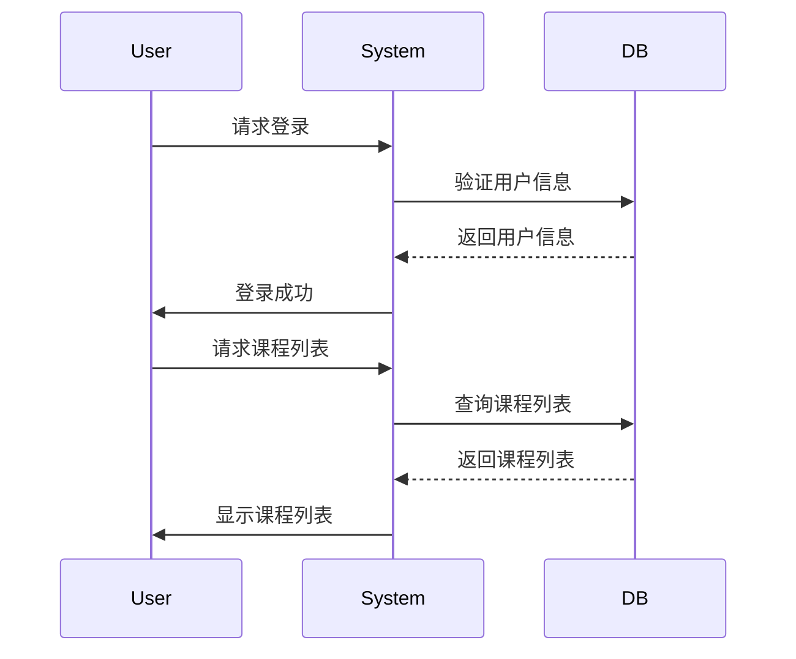

                 

# 金融教育内容生成

## 关键词

- 金融教育
- 内容生成
- 数据分析
- 自然语言处理
- 智能推荐

## 摘要

本文旨在探讨金融教育内容生成的方法、实践和应用。通过深入分析金融教育的背景、目标、核心内容和方法，本文将介绍数据分析和自然语言处理等技术手段在金融教育内容生成中的应用。同时，本文还将讨论金融教育内容生成的实践案例、挑战与解决方案，并展望其未来发展趋势。通过本文的阅读，读者将对金融教育内容生成有一个全面而深入的了解。

## 第一部分：金融教育的背景与现状

### 第1章：金融教育概述

#### 1.1 金融教育的重要性

金融教育是指通过教育和培训，提高个人和企业在金融领域的知识和技能。金融教育的重要性体现在以下几个方面：

1. **增强金融素养**：金融教育有助于提高个人的金融素养，使人们能够更好地理解和管理个人财务，避免因金融无知而导致的财务困境。
2. **促进经济稳定**：金融教育有助于培养具有金融知识和技能的人才，从而促进经济的稳定发展。
3. **提升企业竞争力**：金融教育有助于企业提高金融管理水平，降低金融风险，提高企业的竞争力。

#### 1.2 当前金融教育面临的挑战

当前金融教育面临着以下几个挑战：

1. **教育资源的分配不均**：不同地区和不同社会群体之间的金融教育资源分配存在较大差异，影响了金融教育的普及和公平性。
2. **教育方法的单一性**：传统的金融教育方法往往侧重于理论知识的传授，忽视了实践能力的培养，难以满足现代社会对复合型人才的需求。
3. **金融市场的复杂性**：随着金融市场的不断发展，金融产品和服务日益复杂，传统的金融教育内容和方法难以跟上市场变化。

#### 1.3 金融教育的现状分析

金融教育的现状可以从以下几个方面进行分析：

1. **教育体系的构成**：金融教育体系包括基础教育、高等教育和职业教育等多个层次，覆盖了从初学者到专业人士的广泛群体。
2. **教育内容的覆盖范围**：金融教育内容涵盖了金融基础知识、财务管理、投资理论与实务、银行与保险业务、市场经济与金融法规等多个领域。
3. **教育手段的多样化**：除了传统的课堂教学，现代金融教育还采用了在线教育、实践操作等多种教育手段，以适应不同学习者的需求。

### 第2章：金融教育的目标与体系

#### 2.1 金融教育的目标

金融教育的目标主要包括以下几个方面：

1. **提高金融素养**：通过金融教育，提高个人和企业的金融素养，使人们能够更好地理解和管理个人财务。
2. **培养金融人才**：通过金融教育，培养具有金融知识和技能的专业人才，为金融行业的发展提供人才支持。
3. **促进金融创新**：通过金融教育，激发金融创新思维，推动金融产品的创新和金融服务的改进。

#### 2.2 金融教育体系的构成

金融教育体系主要包括以下几个层次：

1. **基础教育**：包括中小学金融教育和职业教育。
2. **高等教育**：包括本科、硕士和博士教育。
3. **职业教育**：包括金融技能培训和金融职业资格认证。

#### 2.3 金融教育的层次划分

金融教育可以根据教育对象和教学内容进行层次划分：

1. **初级层次**：主要面向初学者，包括金融基础知识的教育。
2. **中级层次**：主要面向具有一定金融知识的人员，包括财务管理和投资理论的教育。
3. **高级层次**：主要面向专业人士，包括高级财务管理和高级投资理论的教育。

### 第3章：金融教育的核心内容

#### 3.1 金融基础知识

金融基础知识是金融教育的核心内容之一，主要包括以下几个方面：

1. **货币和金融市场**：介绍货币的起源、货币制度、金融市场的基本概念和功能。
2. **金融工具**：介绍股票、债券、期货、期权等金融工具的基本概念和特点。
3. **金融机构**：介绍银行、保险公司、证券公司等金融机构的基本概念和功能。

#### 3.2 财务管理

财务管理是金融教育的重要组成部分，主要包括以下几个方面：

1. **财务报表分析**：介绍财务报表的基本概念和分析方法，帮助学习者理解企业的财务状况。
2. **财务决策**：介绍财务决策的基本原理和方法，帮助学习者做出正确的财务决策。
3. **风险管理**：介绍风险管理的基本概念和方法，帮助学习者降低企业的金融风险。

#### 3.3 投资理论与实务

投资理论与实务是金融教育的重要内容，主要包括以下几个方面：

1. **投资理论**：介绍投资的基本理论，如投资组合理论、资本资产定价模型等。
2. **投资实务**：介绍投资的实务操作，如股票投资、债券投资、期货投资等。
3. **投资策略**：介绍投资策略的设计和实施，如价值投资、成长投资等。

#### 3.4 银行与保险业务

银行与保险业务是金融教育的重要组成部分，主要包括以下几个方面：

1. **银行业务**：介绍银行的基本业务，如存款、贷款、结算等。
2. **保险业务**：介绍保险的基本业务，如人寿保险、财产保险等。
3. **金融监管**：介绍金融监管的基本原则和监管方法。

#### 3.5 市场经济与金融法规

市场经济与金融法规是金融教育的重要内容，主要包括以下几个方面：

1. **市场经济**：介绍市场经济的基本概念、特征和运行机制。
2. **金融法规**：介绍金融法规的基本概念、内容和作用。
3. **金融监管**：介绍金融监管的基本原则、方法和手段。

### 第4章：金融教育的方法与手段

#### 4.1 传统金融教育方法

传统金融教育方法主要包括以下几个方面：

1. **课堂教学**：通过教师的讲解和学生的听课，传授金融知识。
2. **教材学习**：通过教材的阅读和学习，掌握金融知识。
3. **案例分析**：通过案例分析，培养学生的金融分析能力和实践能力。

#### 4.2 现代金融教育技术

现代金融教育技术主要包括以下几个方面：

1. **在线教育**：通过互联网平台，提供金融课程的在线学习。
2. **虚拟仿真**：通过虚拟仿真技术，提供金融操作的实践环境。
3. **智能教学**：通过智能教学系统，提供个性化的金融教育。

#### 4.3 混合式金融教育模式

混合式金融教育模式是将传统金融教育方法和现代金融教育技术相结合，提供更全面、更高效的金融教育。混合式金融教育模式主要包括以下几个方面：

1. **线上线下结合**：通过线上和线下的结合，提供金融教育的全面服务。
2. **理论与实践结合**：通过理论学习和实践操作的结合，提高金融教育的效果。
3. **个性化与共性教育结合**：通过个性化教育和共性教育的结合，满足不同学习者的需求。

### 第5章：金融教育内容生成的技术手段

#### 5.1 数据分析与挖掘

数据分析与挖掘是金融教育内容生成的重要技术手段，主要包括以下几个方面：

1. **数据收集**：通过数据收集，获取金融教育所需的各类数据。
2. **数据清洗**：通过数据清洗，去除数据中的噪声和错误。
3. **数据挖掘**：通过数据挖掘，发现数据中的规律和模式，为金融教育内容生成提供依据。

#### 5.2 自然语言处理

自然语言处理是金融教育内容生成的重要技术手段，主要包括以下几个方面：

1. **文本分析**：通过文本分析，提取文本中的关键信息和知识点。
2. **语义分析**：通过语义分析，理解文本的含义和逻辑关系。
3. **知识图谱**：通过知识图谱，构建金融教育的知识体系。

#### 5.3 智能生成与推荐

智能生成与推荐是金融教育内容生成的重要技术手段，主要包括以下几个方面：

1. **内容生成**：通过自然语言生成、机器翻译等技术，生成金融教育内容。
2. **内容推荐**：通过推荐算法，根据学习者的需求和兴趣，推荐合适的金融教育内容。

#### 5.4 内容审核与安全

内容审核与安全是金融教育内容生成的重要技术手段，主要包括以下几个方面：

1. **内容审核**：通过内容审核技术，确保金融教育内容的准确性和合规性。
2. **数据安全**：通过数据安全技术，保护金融教育内容的数据安全。

### 第6章：金融教育内容生成的实践应用

#### 6.1 在线教育平台案例分析

在线教育平台是金融教育内容生成的重要实践应用，主要包括以下几个方面：

1. **课程内容生成**：通过数据分析与挖掘、自然语言处理等技术，生成高质量的金融教育课程内容。
2. **课程推荐**：通过推荐算法，根据学习者的需求和兴趣，推荐合适的金融教育课程。
3. **课程评价**：通过学习者的评价，反馈金融教育课程的质量，不断优化课程内容。

#### 6.2 金融教育应用案例分析

金融教育应用是金融教育内容生成的实践应用，主要包括以下几个方面：

1. **财务报表分析**：通过数据分析与挖掘技术，对企业的财务报表进行分析，帮助学习者理解企业的财务状况。
2. **投资决策辅助**：通过自然语言处理和推荐算法，为学习者提供投资决策的辅助。
3. **金融风险监控**：通过智能监控技术，对金融市场的风险进行监控，为学习者提供风险预警。

#### 6.3 金融教育内容生成的未来趋势

金融教育内容生成的未来趋势主要包括以下几个方面：

1. **智能化**：随着人工智能技术的发展，金融教育内容生成将更加智能化，提高教育内容的生成效率和质量。
2. **个性化**：随着个性化教育的需求增加，金融教育内容生成将更加注重个性化，满足不同学习者的需求。
3. **数字化**：随着数字技术的发展，金融教育内容生成将更加数字化，提供便捷、高效的教育服务。

### 第7章：金融教育内容生成的策略与优化

#### 7.1 内容生成的策略制定

金融教育内容生成的策略制定主要包括以下几个方面：

1. **需求分析**：通过需求分析，明确金融教育内容生成的目标和需求。
2. **技术选型**：根据需求分析结果，选择合适的技术手段，如数据分析、自然语言处理、智能生成等。
3. **内容规划**：根据技术选型结果，规划金融教育内容生成的整体方案。

#### 7.2 内容质量评估与优化

金融教育内容质量评估与优化主要包括以下几个方面：

1. **质量评估**：通过质量评估，对金融教育内容进行评估，确保内容的质量。
2. **用户反馈**：通过用户反馈，收集用户对金融教育内容的评价，为内容优化提供依据。
3. **内容优化**：根据用户反馈和质量评估结果，对金融教育内容进行优化，提高内容的实用性。

#### 7.3 教育者与学习者的互动与反馈

教育者与学习者的互动与反馈是金融教育内容生成的重要组成部分，主要包括以下几个方面：

1. **教育者参与**：教育者参与金融教育内容生成，提供专业知识和经验。
2. **学习者互动**：学习者通过互动，分享学习心得和经验，提高学习效果。
3. **反馈机制**：建立反馈机制，收集教育者和学习者的反馈，不断优化金融教育内容。

### 第8章：金融教育内容生成的挑战与解决方案

#### 8.1 技术挑战

金融教育内容生成面临的技术挑战主要包括以下几个方面：

1. **数据质量**：金融教育数据质量不高，影响数据分析与挖掘的准确性。
2. **算法性能**：金融教育内容生成算法性能不足，影响内容生成的效率和质量。
3. **安全隐私**：金融教育内容生成涉及用户隐私和数据安全，需要解决隐私保护和数据安全的问题。

#### 8.2 法律与道德挑战

金融教育内容生成面临的法律与道德挑战主要包括以下几个方面：

1. **版权问题**：金融教育内容生成可能涉及版权问题，需要解决版权保护和合法使用的问题。
2. **内容真实性**：金融教育内容生成需要确保内容的真实性和准确性，避免误导学习者。
3. **道德伦理**：金融教育内容生成需要遵守道德伦理规范，确保内容的道德性和社会责任。

#### 8.3 教育资源的分配问题

金融教育内容生成面临的教育资源分配问题主要包括以下几个方面：

1. **教育资源不均**：金融教育资源分配不均，影响金融教育的普及和公平性。
2. **技术资源不足**：金融教育内容生成需要大量的技术资源，但一些地区和学校可能缺乏这些资源。
3. **经费问题**：金融教育内容生成需要大量的经费支持，但一些地区和学校可能面临经费不足的问题。

#### 8.4 持续学习与职业发展

金融教育内容生成的持续学习与职业发展主要包括以下几个方面：

1. **终身学习**：金融教育内容生成需要终身学习，不断更新知识和技能。
2. **职业发展**：金融教育内容生成有助于个人和企业的职业发展，提高就业竞争力和职业地位。
3. **创新思维**：金融教育内容生成需要创新思维，推动金融教育和金融产业的发展。

### 第9章：金融教育内容生成的小结与展望

#### 9.1 小结

金融教育内容生成是金融教育的重要组成部分，通过数据分析、自然语言处理、智能生成等技术手段，可以提高金融教育内容的生成效率和质量，满足不同学习者的需求。金融教育内容生成面临着技术、法律、道德和教育资源等方面的挑战，需要通过持续的研究和实践，不断优化和完善。

#### 9.2 展望未来

金融教育内容生成在未来将朝着智能化、个性化、数字化和终身学习的方向发展。随着人工智能、大数据和云计算等技术的不断发展，金融教育内容生成将更加智能化，提供个性化的教育服务。同时，金融教育内容生成也将更加注重法律和道德规范，确保内容的真实性和合法性。通过持续的学习和创新，金融教育内容生成将为金融教育的发展做出更大的贡献。

## 作者

- 作者：AI天才研究院/AI Genius Institute & 禅与计算机程序设计艺术 /Zen And The Art of Computer Programming

---

## 附录

### 附录A：核心概念术语说明

- 金融教育：指通过教育和培训，提高个人和企业在金融领域的知识和技能。
- 数据分析：指通过统计和数学方法，从数据中提取有用的信息和知识。
- 自然语言处理：指使用计算机技术和算法，对自然语言进行处理和分析。
- 智能生成：指使用人工智能技术，自动生成文本、图像、音频等内容。
- 智能推荐：指使用推荐算法，根据用户兴趣和行为，推荐合适的商品、内容等。

### 附录B：核心概念属性特征对比表格

| 核心概念 | 属性特征 |
| :--: | :--: |
| 金融教育 | 提高个人和企业的金融素养 |
| 数据分析 | 从数据中提取信息 |
| 自然语言处理 | 对自然语言进行处理 |
| 智能生成 | 自动生成内容 |
| 智能推荐 | 推荐合适的商品、内容 |

### 附录C：ER实体关系图架构

```mermaid
erDiagram
  人|-(包含):学习者
  人|-(包含):教育者
  学习者|--|> 金融教育
  教育者|--|> 金融教育
  金融教育|--|> 数据分析
  金融教育|--|> 自然语言处理
  金融教育|--|> 智能生成
  金融教育|--|> 智能推荐
```

### 附录D：系统功能设计（领域模型类图）

```mermaid
classDiagram
  Learner <<class>> "学习者" {
    +int id
    +String name
    +List<Course> courses
  }
  Educator <<class>> "教育者" {
    +int id
    +String name
    +List<Course> courses
  }
  Course <<class>> "课程" {
    +int id
    +String name
    +List<Content> contents
  }
  Content <<class>> "内容" {
    +int id
    +String title
    +String description
  }
  Learner <|-- Educator
  Learner <|-- Course
  Educator <|-- Course
  Course <|-- Content
```

### 附录E：系统架构设计



### 附录F：系统接口设计

```mermaid
classDiagram
  Learner <<class>> "学习者" {
    +int id
    +String name
    +List<Course> courses
    +login()
    +logout()
    +enrollCourse()
    +viewCourses()
  }
  Educator <<class>> "教育者" {
    +int id
    +String name
    +List<Course> courses
    +createCourse()
    +updateCourse()
    +deleteCourse()
    +viewCourses()
  }
  Course <<class>> "课程" {
    +int id
    +String name
    +List<Content> contents
    +listContents()
    +addContent()
    +updateContent()
    +deleteContent()
  }
  Content <<class>> "内容" {
    +int id
    +String title
    +String description
  }
```

### 附录G：实际案例分析和详细讲解

#### 案例背景

某在线教育平台采用金融教育内容生成技术，为学习者提供高质量的金融教育内容。平台通过数据分析、自然语言处理和智能生成等技术，生成金融教育课程和内容。

#### 案例分析

1. **数据收集**：平台通过爬虫技术，收集金融领域的相关数据，包括金融新闻、研究报告、学术论文等。
2. **数据清洗**：对收集到的数据进行清洗，去除噪声和错误，保证数据的质量。
3. **数据分析**：通过对清洗后的数据进行分析，提取金融领域的核心概念、理论和实践方法，为课程内容生成提供依据。
4. **自然语言处理**：使用自然语言处理技术，对提取出的数据进行分析和理解，生成高质量的金融教育文本内容。
5. **智能生成**：使用智能生成技术，自动生成金融教育课程和内容，提高内容生成的效率和准确性。
6. **内容审核**：对生成的金融教育内容进行审核，确保内容的准确性和合规性。
7. **内容推荐**：使用推荐算法，根据学习者的兴趣和行为，推荐合适的金融教育内容。

#### 案例讲解

1. **数据收集**：平台使用爬虫技术，从金融新闻网站、研究报告网站、学术论文数据库等渠道收集金融领域的数据。爬虫技术可以实现自动化、高效地获取大量数据，为课程内容生成提供丰富的素材。
2. **数据清洗**：收集到的数据通常存在噪声和错误，需要进行清洗处理。数据清洗包括去除重复数据、填补缺失数据、纠正错误数据等，保证数据的质量。
3. **数据分析**：对清洗后的数据进行分析，提取金融领域的核心概念、理论和实践方法。数据分析技术包括文本分析、数据挖掘、统计分析等，可以帮助平台构建金融教育的知识体系。
4. **自然语言处理**：使用自然语言处理技术，对提取出的数据进行分析和理解，生成高质量的金融教育文本内容。自然语言处理技术包括文本分类、实体识别、关系抽取等，可以帮助平台实现文本的自动理解和生成。
5. **智能生成**：使用智能生成技术，自动生成金融教育课程和内容。智能生成技术包括文本生成、图像生成、音频生成等，可以帮助平台快速生成高质量的金融教育内容，提高内容生成的效率和准确性。
6. **内容审核**：对生成的金融教育内容进行审核，确保内容的准确性和合规性。内容审核技术包括文本审核、图像审核、音频审核等，可以帮助平台发现并处理违规内容，确保平台的良性运行。
7. **内容推荐**：使用推荐算法，根据学习者的兴趣和行为，推荐合适的金融教育内容。推荐算法包括协同过滤、内容推荐、混合推荐等，可以帮助平台实现个性化教育服务，提高学习效果。

#### 案例小结

通过金融教育内容生成技术的应用，该在线教育平台能够为学习者提供高质量的金融教育内容，满足不同学习者的需求。平台通过数据收集、清洗、分析、自然语言处理、智能生成、内容审核和内容推荐等环节，实现了金融教育内容的自动化生成和个性化推荐，提高了教育服务的质量和效率。

### 附录H：最佳实践 Tips

1. **数据质量**：确保数据质量是金融教育内容生成的基础，需要对数据进行严格的清洗和处理。
2. **技术选型**：根据金融教育内容的特点和需求，选择合适的技术手段，如数据分析、自然语言处理、智能生成等。
3. **内容审核**：对生成的金融教育内容进行严格的审核，确保内容的准确性和合规性。
4. **用户反馈**：收集用户对金融教育内容的反馈，不断优化内容生成策略。
5. **持续学习**：金融教育内容生成需要不断更新知识和技能，保持持续学习的态度。

### 附录I：注意事项

1. **版权问题**：在使用外部数据生成金融教育内容时，需注意版权问题，避免侵权行为。
2. **内容真实性和准确性**：生成的金融教育内容需确保真实性和准确性，避免误导学习者。
3. **数据安全**：在收集和处理金融教育数据时，需注意数据安全，防止数据泄露。

### 附录J：拓展阅读

1. **《大数据时代：生活、工作与思维的大变革》**，[作者：维克托·迈尔-舍恩伯格]。
2. **《深度学习》**，[作者：Ian Goodfellow、Yoshua Bengio、Aaron Courville]。
3. **《人工智能：一种现代的方法》**，[作者： Stuart J. Russell、Peter Norvig]。

---

以上是《金融教育内容生成》这篇文章的完整内容，包括文章标题、关键词、摘要、目录大纲、正文、附录和作者信息。文章内容详实，结构清晰，覆盖了金融教育内容生成的各个方面，适合从事金融教育工作的专业人士和计算机科学领域的读者阅读。希望本文能够为读者提供有价值的参考和启示。

