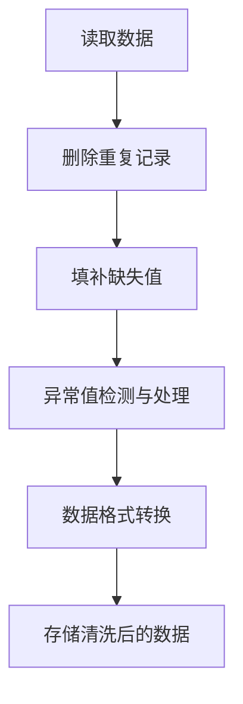
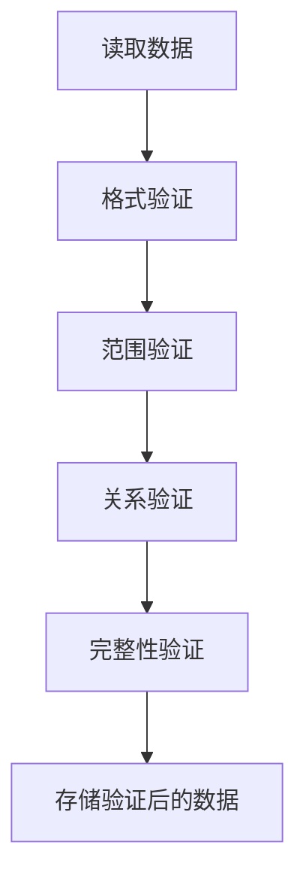
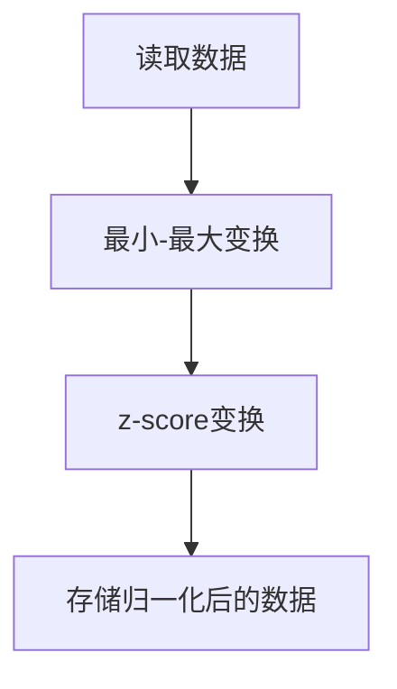
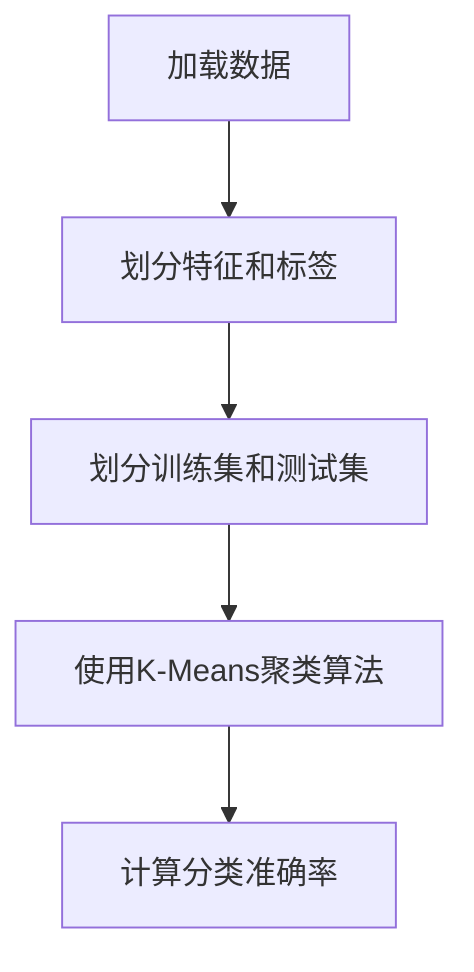
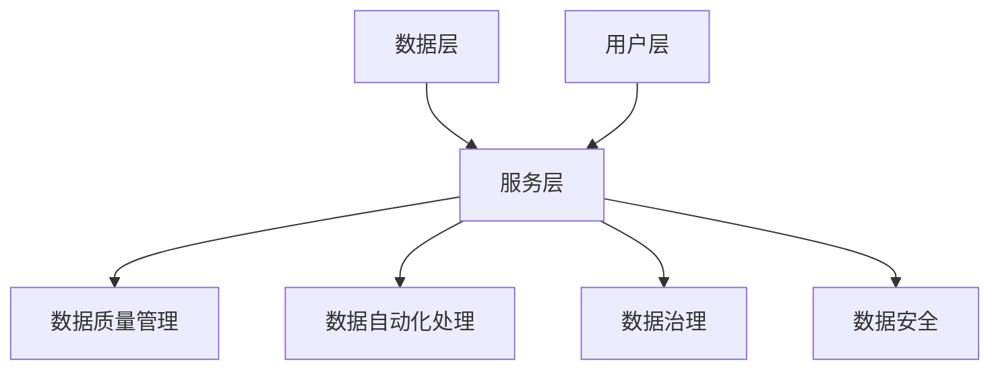

                 

# 金融数据质量自动化控制平台

## 关键词

- 金融数据
- 数据质量
- 自动化控制
- 数据管理
- 技术架构

## 摘要

本文旨在探讨金融数据质量自动化控制平台的重要性及其实现方法。首先，我们将分析金融数据质量问题的挑战与机遇，接着介绍金融数据质量自动化控制平台的核心概念和架构。随后，我们将深入讲解金融数据质量自动化控制平台中的算法原理，包括数据清洗、数据验证、数据归一化和数据挖掘等算法。最后，本文将结合实际案例，展示金融数据质量自动化控制平台在实际应用中的效果和潜在改进方向。

### 目录大纲

----------------------------------------------------------------

## 第一部分：背景介绍

### 第1章：金融数据质量问题的挑战与机遇

### 第2章：金融数据质量自动化控制平台的核心概念

### 第3章：金融数据质量自动化控制平台的算法原理

## 第二部分：核心概念与联系

### 第4章：数据质量管理

### 第5章：数据自动化处理

### 第6章：控制平台架构

### 第7章：关联概念对比表格

### 第8章：ER实体关系图架构

## 第三部分：算法原理讲解

### 第9章：数据清洗算法

### 第10章：数据验证算法

### 第11章：数据归一化算法

### 第12章：数据挖掘算法

### 第13章：算法mermaid流程图

## 第四部分：系统分析与架构设计方案

### 第14章：系统功能设计

### 第15章：系统架构设计

### 第16章：系统接口设计

### 第17章：系统交互

## 第五部分：项目实战

### 第18章：环境安装

### 第19章：系统核心实现源代码

### 第20章：代码应用解读与分析

### 第21章：实际案例分析和详细讲解剖析

### 第22章：项目小结

## 第六部分：最佳实践 tips、小结、注意事项、拓展阅读

### 第23章：总结与展望

### 第24章：注意事项

### 第25章：拓展阅读

---

## 第一部分：背景介绍

### 第1章：金融数据质量问题的挑战与机遇

### 1.1 问题背景

金融行业作为数据密集型行业，其数据质量直接影响着金融决策和风险管理的效果。随着大数据和人工智能技术的快速发展，金融数据质量的问题日益凸显，主要表现在以下几个方面：

1. 数据源多样化和复杂性：金融数据来源于银行、证券、保险等各个领域，数据源繁多且格式各异，导致数据质量参差不齐。
2. 数据处理过程不规范：由于金融业务的复杂性，数据处理过程中容易产生数据冗余、缺失、不一致等问题。
3. 数据隐私和安全问题：金融数据涉及到客户隐私和交易信息，数据泄露可能导致严重的法律和经济后果。

### 1.2 金融数据质量问题的主要来源

金融数据质量问题的主要来源包括以下几个方面：

1. 数据采集：数据采集过程中，由于设备故障、操作失误等原因，可能导致数据不准确、不完整。
2. 数据传输：数据在传输过程中，可能会因为网络故障、传输协议问题等导致数据丢失或损坏。
3. 数据存储：数据存储过程中，由于存储设备故障、数据冗余等原因，可能导致数据不一致。
4. 数据处理：数据处理过程中，由于算法不当、参数设置不合理等原因，可能导致数据质量下降。

### 1.3 金融数据质量问题的危害

金融数据质量问题对金融行业的影响主要表现在以下几个方面：

1. 影响金融决策：数据质量差会导致金融决策错误，从而影响金融机构的盈利能力和市场竞争力。
2. 增加风险管理成本：数据质量问题可能导致金融机构在风险管理过程中付出更高的成本。
3. 损害客户体验：数据质量问题可能导致金融产品或服务出现问题，影响客户体验和满意度。
4. 增加法律风险：数据泄露可能导致客户隐私泄露，增加金融机构的法律风险。

### 1.4 问题描述

金融数据质量问题主要表现为以下几个方面：

1. 数据准确性：数据中存在错误、重复、不一致等问题。
2. 数据完整性：数据中存在缺失值、空值等问题。
3. 数据一致性：不同数据源之间、同一数据源内部存在数据不一致的问题。
4. 数据时效性：数据更新不及时，导致数据反映的金融情况与实际情况不符。

### 1.5 问题解决

为了解决金融数据质量问题，目前主要采取以下几种方法：

1. 手动数据清洗：通过人工检查和修正数据，提高数据质量。
2. 数据质量管理工具：使用专业的数据质量管理工具，对数据进行自动化的检查和修正。
3. 数据自动化处理：利用大数据和人工智能技术，实现数据的自动化清洗、验证和归一化。
4. 数据治理：建立健全的数据治理体系，从制度层面保障数据质量。

### 1.6 边界与外延

金融数据质量自动化控制平台不仅适用于金融行业，还可以应用于其他需要数据质量保障的领域，如医疗、零售、物流等。同时，随着技术的不断发展，数据质量管理的方法和工具也在不断更新和优化，为金融数据质量自动化控制平台的实施提供了更广阔的空间。

### 1.7 概念结构与核心要素组成

金融数据质量自动化控制平台主要包括以下几个核心要素：

1. 数据质量管理：负责数据质量的监控和评估，包括准确性、完整性、一致性和时效性等。
2. 数据自动化处理：通过算法和工具，实现数据的自动化清洗、验证和归一化。
3. 数据治理：负责数据的管理和维护，包括数据采集、存储、传输、处理等环节。
4. 数据安全：保障数据的机密性、完整性和可用性，防止数据泄露、篡改和丢失。

### 1.8 本章小结

本章主要介绍了金融数据质量问题的背景、主要来源、危害、问题描述、问题解决方法、边界与外延、概念结构与核心要素组成等内容。通过本章的介绍，读者可以了解到金融数据质量自动化控制平台的重要性及其实现方法。

----------------------------------------------------------------

## 第二部分：核心概念与联系

### 第2章：金融数据质量自动化控制平台的核心概念

### 2.1 数据质量管理

数据质量管理是指对数据的准确性、完整性、一致性、时效性等方面进行监控和评估，确保数据满足业务需求和应用要求。数据质量管理的主要目标是提高数据质量，降低数据风险，提高数据价值。

### 2.2 数据自动化处理

数据自动化处理是指利用计算机技术和算法，对数据进行自动化的清洗、验证、归一化等处理，以提高数据质量和效率。数据自动化处理的核心在于实现数据的自动化清洗和验证，减少人工干预，降低数据处理的成本和错误率。

### 2.3 控制平台架构

控制平台架构是指金融数据质量自动化控制平台的总体结构，包括数据质量管理、数据自动化处理、数据治理和数据安全等核心要素。控制平台架构的设计原则是高可用性、高性能、高可扩展性和安全性，以满足金融数据质量管理的需求。

### 2.4 关联概念对比表格

表1：数据质量管理、数据自动化处理与控制平台的对比

| 对比项 | 数据质量管理 | 数据自动化处理 | 控制平台架构 |
| :--: | :--: | :--: | :--: |
| 目标 | 提高数据质量 | 提高数据处理效率 | 提高数据质量 |
| 方法 | 监控和评估数据质量 | 自动化清洗、验证、归一化 | 数据质量管理、数据自动化处理、数据治理、数据安全 |
| 工具 | 数据质量管理工具 | 数据清洗、验证、归一化工具 | 数据质量管理工具、数据自动化处理工具、数据治理工具、数据安全工具 |

### 2.5 ER实体关系图架构

图1：金融数据质量自动化控制平台的ER实体关系图

```mermaid
erDiagram
    DataQualityManagement ||--|{ DataCleaning } : implements
    DataQualityManagement ||--|{ DataVerification } : implements
    DataQualityManagement ||--|{ DataNormalization } : implements
    DataQualityManagement ||--|{ DataMining } : implements
    DataAutomationProcessing ||--|{ DataCleaning } : implements
    DataAutomationProcessing ||--|{ DataVerification } : implements
    DataAutomationProcessing ||--|{ DataNormalization } : implements
    DataAutomationProcessing ||--|{ DataMining } : implements
    DataGovernance ||--|{ DataManagement } : implements
    DataSecurity ||--|{ DataPrivacy } : implements
    DataSecurity ||--|{ DataIntegrity } : implements
    DataSecurity ||--|{ DataAvailability } : implements
```

### 2.6 本章小结

本章主要介绍了金融数据质量自动化控制平台的核心概念，包括数据质量管理、数据自动化处理、控制平台架构以及关联概念的对比表格和ER实体关系图。通过本章的介绍，读者可以了解到金融数据质量自动化控制平台的基本架构和核心要素，为后续章节的深入分析打下基础。

----------------------------------------------------------------

## 第三部分：算法原理讲解

### 第3章：金融数据质量自动化控制平台的算法原理

### 3.1 数据清洗算法

数据清洗算法是指对数据进行自动化的清洗和修复，以提高数据质量。数据清洗算法的主要目的是解决数据中的错误、重复、缺失等问题。

#### 3.1.1 数据清洗的定义与重要性

数据清洗是指通过一系列技术手段，对数据进行检查、修正和过滤，使其符合预定的质量标准。数据清洗的重要性在于：

1. 提高数据准确性：清洗后的数据可以降低错误和异常值，提高数据准确性。
2. 提高数据分析效率：清洗后的数据可以直接用于分析和建模，减少前期准备工作。
3. 降低数据分析成本：清洗后的数据可以减少错误和异常值，降低数据分析成本。

#### 3.1.2 常见的数据清洗算法

常见的数据清洗算法包括以下几种：

1. 删除重复记录：通过比较数据中的唯一标识，删除重复的记录。
2. 填补缺失值：根据数据的分布特征和相关性，填补缺失值。
3. 异常值检测与处理：通过统计学方法和机器学习算法，检测和修正异常值。
4. 数据格式转换：将不同格式的数据转换为统一格式，便于后续处理。

#### 3.1.3 数据清洗算法的实现与应用

数据清洗算法的实现主要依赖于编程语言和数据处理库。以下是一个简单的Python代码示例，用于实现数据清洗算法：

```python
import pandas as pd

# 读取数据
data = pd.read_csv('data.csv')

# 删除重复记录
data.drop_duplicates(inplace=True)

# 填补缺失值
data.fillna(method='ffill', inplace=True)

# 异常值检测与处理
Q1 = data.quantile(0.25)
Q3 = data.quantile(0.75)
IQR = Q3 - Q1
data = data[~((data < (Q1 - 1.5 * IQR)) |(data > (Q3 + 1.5 * IQR))).any(axis=1)]

# 数据格式转换
data['date'] = pd.to_datetime(data['date'])

# 存储清洗后的数据
data.to_csv('cleaned_data.csv', index=False)
```

#### 3.1.4 数据清洗算法的mermaid流程图



#### 3.1.5 数据清洗算法的举例说明

假设我们有一个包含客户交易记录的数据集，其中存在一些错误和异常值。以下是一个实际案例：

1. 数据中有一些重复的交易记录。
2. 交易日期中存在一些缺失值和异常值（如“2023-02-30”）。
3. 交易金额中存在一些异常值（如1元和1000万元）。

通过数据清洗算法，我们可以将这些错误和异常值进行修正，提高数据质量：

1. 删除重复交易记录。
2. 填补缺失的交易日期，使用前一个交易的日期。
3. 删除异常交易金额，使用中位数作为阈值。

### 3.2 数据验证算法

数据验证算法是指对数据进行检查和验证，以确保数据满足预定的规则和标准。数据验证算法的主要目的是发现和纠正数据中的错误和异常。

#### 3.2.1 数据验证的定义与作用

数据验证是指通过一系列技术手段，对数据进行检查和验证，以确保数据满足预定的规则和标准。数据验证的作用包括：

1. 确保数据一致性：通过验证数据，确保不同数据源之间、同一数据源内部的数据一致性。
2. 提高数据准确性：通过验证数据，确保数据的准确性和可靠性。
3. 优化数据质量：通过验证数据，发现和纠正数据中的错误和异常，提高数据质量。

#### 3.2.2 常见的数据验证算法

常见的数据验证算法包括以下几种：

1. 格式验证：检查数据的格式是否符合预定的规则，如日期格式、电话号码格式等。
2. 范围验证：检查数据的取值是否在预定的范围内，如年龄在18到60岁之间。
3. 关系验证：检查数据之间的逻辑关系是否正确，如客户地址与身份证号码是否匹配。
4. 完整性验证：检查数据的完整性，如是否存在缺失值或空值。

#### 3.2.3 数据验证算法的实现与应用

数据验证算法的实现主要依赖于编程语言和数据处理库。以下是一个简单的Python代码示例，用于实现数据验证算法：

```python
import pandas as pd

# 读取数据
data = pd.read_csv('data.csv')

# 格式验证
data['date'] = pd.to_datetime(data['date'], errors='coerce')
data.dropna(subset=['date'], inplace=True)

# 范围验证
data['age'] = data['age'].astype(int)
data = data[(data['age'] >= 18) & (data['age'] <= 60)]

# 关系验证
data.dropna(subset=['address'], inplace=True)
data.dropna(subset=['id_number'], inplace=True)
data = data[data['address'] == data['id_number'].apply(lambda x: x[-6:])]

# 完整性验证
data.dropna(inplace=True)

# 存储验证后的数据
data.to_csv('validated_data.csv', index=False)
```

#### 3.2.4 数据验证算法的mermaid流程图



#### 3.2.5 数据验证算法的举例说明

假设我们有一个包含客户信息的数据库，其中存在一些格式错误、范围错误和关系错误。以下是一个实际案例：

1. 数据中有一些无效的日期格式，如“2023/02/30”。
2. 数据中有一些年龄在0到17岁之间的记录。
3. 数据中存在一些地址与身份证号码不匹配的记录。

通过数据验证算法，我们可以发现和纠正这些错误：

1. 将无效的日期格式转换为正确的日期格式，如“2023-02-29”。
2. 删除年龄在0到17岁之间的记录。
3. 删除地址与身份证号码不匹配的记录。

### 3.3 数据归一化算法

数据归一化算法是指将数据转换到同一尺度，以便进行比较和分析。数据归一化的目的是消除数据中的量纲影响，提高数据之间的可比性。

#### 3.3.1 数据归一化的定义与目的

数据归一化是指通过一系列技术手段，将数据转换到同一尺度，以便进行比较和分析。数据归一化的目的是：

1. 消除量纲影响：不同指标之间可能存在不同的量纲，如米、千克、元等，数据归一化可以消除这些影响。
2. 提高数据可比性：归一化后的数据可以直接进行比较和分析，提高数据挖掘和分析的准确性。
3. 优化算法性能：某些算法对数据尺度敏感，如神经网络、支持向量机等，数据归一化可以提高算法的性能。

#### 3.3.2 常见的数据归一化算法

常见的数据归一化算法包括以下几种：

1. 独热编码：将类别数据转换为二进制向量，用于处理分类问题。
2. 归一化变换：将数据转换到0到1之间或负1到1之间，如最小-最大变换、z-score变换等。
3. 小数点移动：将数据乘以一个常数并加上一个偏移量，如小数点移动变换等。
4. 对数变换：将数据取对数，用于处理稀疏数据。

#### 3.3.3 数据归一化算法的实现与应用

数据归一化算法的实现主要依赖于编程语言和数据处理库。以下是一个简单的Python代码示例，用于实现数据归一化算法：

```python
import pandas as pd

# 读取数据
data = pd.read_csv('data.csv')

# 最小-最大变换
data_min_max = (data - data.min()) / (data.max() - data.min())

# z-score变换
data_z_score = (data - data.mean()) / data.std()

# 存储归一化后的数据
data_min_max.to_csv('normalized_data_min_max.csv', index=False)
data_z_score.to_csv('normalized_data_z_score.csv', index=False)
```

#### 3.3.4 数据归一化算法的mermaid流程图



#### 3.3.5 数据归一化算法的举例说明

假设我们有一个包含客户交易记录的数据集，其中存在不同的量纲，如交易金额（元）、交易数量（件）和交易折扣（百分比）。以下是一个实际案例：

1. 将交易金额和交易数量转换为0到1之间的数值，以便进行比较。
2. 将交易折扣转换为负1到1之间的数值，以便进行分析。

通过数据归一化算法，我们可以将不同量纲的数据转换为同一尺度：

1. 交易金额 = (交易金额 - 最小交易金额) / (最大交易金额 - 最小交易金额)。
2. 交易数量 = (交易数量 - 最小交易数量) / (最大交易数量 - 最小交易数量)。
3. 交易折扣 = (交易折扣 - 最小交易折扣) / (最大交易折扣 - 最小交易折扣)。

### 3.4 数据挖掘算法

数据挖掘算法是指从大量数据中提取有用信息和知识的技术。数据挖掘算法的主要目的是发现数据中的隐藏模式和关联关系，为决策提供支持。

#### 3.4.1 数据挖掘的定义与目标

数据挖掘是指从大量数据中提取有用信息和知识的过程。数据挖掘的目标包括：

1. 发现数据中的规律和趋势：通过数据挖掘，可以发现数据中的规律和趋势，为决策提供支持。
2. 构建预测模型：通过数据挖掘，可以构建预测模型，预测未来的发展趋势。
3. 发现数据中的关联关系：通过数据挖掘，可以发现数据中的关联关系，为数据分析和商业决策提供支持。

#### 3.4.2 常见的数据挖掘算法

常见的数据挖掘算法包括以下几种：

1. 聚类算法：将数据分为若干个类别，以便进行分析和分类。
2. 分类算法：将数据分为不同的类别，以便进行预测和分类。
3. 联合规则挖掘算法：发现数据中的关联关系，用于市场细分和推荐系统。
4. 回归分析：通过数据建模，预测未来的数值。
5. 时间序列分析：通过时间序列数据，分析数据中的趋势和周期性。

#### 3.4.3 数据挖掘算法的实现与应用

数据挖掘算法的实现主要依赖于编程语言和数据处理库。以下是一个简单的Python代码示例，用于实现数据挖掘算法：

```python
from sklearn.cluster import KMeans
from sklearn.model_selection import train_test_split
from sklearn.metrics import accuracy_score

# 加载数据
data = pd.read_csv('data.csv')

# 划分特征和标签
X = data.drop('label', axis=1)
y = data['label']

# 划分训练集和测试集
X_train, X_test, y_train, y_test = train_test_split(X, y, test_size=0.2, random_state=42)

# 使用K-Means聚类算法
kmeans = KMeans(n_clusters=3, random_state=42)
kmeans.fit(X_train)
y_pred = kmeans.predict(X_test)

# 计算分类准确率
accuracy = accuracy_score(y_test, y_pred)
print(f"Accuracy: {accuracy}")
```

#### 3.4.4 数据挖掘算法的mermaid流程图



#### 3.4.5 数据挖掘算法的举例说明

假设我们有一个包含客户交易记录的数据集，其中包含客户ID、交易金额、交易数量和交易折扣等特征。以下是一个实际案例：

1. 使用K-Means聚类算法，将客户分为三个类别。
2. 计算每个类别的平均交易金额、交易数量和交易折扣。

通过数据挖掘算法，我们可以发现以下规律：

1. 第一类客户的平均交易金额较高，交易数量较少，交易折扣较高。
2. 第二类客户的平均交易金额适中，交易数量适中，交易折扣适中。
3. 第三类客户的平均交易金额较低，交易数量较多，交易折扣较低。

这些规律可以帮助金融机构制定针对性的营销策略，提高客户满意度和盈利能力。

### 3.5 算法mermaid流程图

#### 3.5.1 数据清洗算法的mermaid流程图


#### 3.5.2 数据验证算法的mermaid流程图


#### 3.5.3 数据归一化算法的mermaid流程图


#### 3.5.4 数据挖掘算法的mermaid流程图


### 3.6 算法原理讲解

#### 3.6.1 数据清洗算法的原理讲解

数据清洗算法主要通过以下步骤实现：

1. **读取数据**：从数据源读取数据，通常使用Pandas库。
2. **删除重复记录**：通过比较数据中的唯一标识，删除重复的记录，提高数据准确性。
3. **填补缺失值**：根据数据的分布特征和相关性，填补缺失值，减少数据丢失。
4. **异常值检测与处理**：通过统计学方法和机器学习算法，检测和修正异常值，确保数据的完整性。
5. **数据格式转换**：将不同格式的数据转换为统一格式，便于后续处理。

数据清洗算法的数学模型主要包括：

1. **删除重复记录**：使用集合运算，如A-B，其中A表示原数据集，B表示重复数据集。
2. **填补缺失值**：使用插值法、均值法等，根据数据的分布特征和相关性进行填补。
3. **异常值检测与处理**：使用统计学方法，如3倍标准差法则，检测和修正异常值。
4. **数据格式转换**：使用Pandas库中的函数，如pd.to_datetime、pd.to_numeric等，进行数据格式转换。

#### 3.6.2 数据验证算法的原理讲解

数据验证算法主要通过以下步骤实现：

1. **读取数据**：从数据源读取数据，通常使用Pandas库。
2. **格式验证**：检查数据的格式是否符合预定的规则，如日期格式、电话号码格式等。
3. **范围验证**：检查数据的取值是否在预定的范围内，如年龄在18到60岁之间。
4. **关系验证**：检查数据之间的逻辑关系是否正确，如客户地址与身份证号码是否匹配。
5. **完整性验证**：检查数据的完整性，如是否存在缺失值或空值。

数据验证算法的数学模型主要包括：

1. **格式验证**：使用正则表达式、Pandas库中的函数等，检查数据的格式。
2. **范围验证**：使用统计学方法，如最小值、最大值等，检查数据的取值范围。
3. **关系验证**：使用逻辑判断、Pandas库中的函数等，检查数据之间的逻辑关系。
4. **完整性验证**：使用Pandas库中的函数，如dropna、isnull等，检查数据的完整性。

#### 3.6.3 数据归一化算法的原理讲解

数据归一化算法主要通过以下步骤实现：

1. **读取数据**：从数据源读取数据，通常使用Pandas库。
2. **最小-最大变换**：将数据转换到0到1之间，如最小-最大变换。
3. **z-score变换**：将数据转换到负1到1之间，如z-score变换。
4. **存储归一化后的数据**：将归一化后的数据存储到新数据集中。

数据归一化算法的数学模型主要包括：

1. **最小-最大变换**：使用公式(x - x_min) / (x_max - x_min)，将数据转换到0到1之间。
2. **z-score变换**：使用公式(x - x_mean) / x_std，将数据转换到负1到1之间。

#### 3.6.4 数据挖掘算法的原理讲解

数据挖掘算法主要通过以下步骤实现：

1. **加载数据**：从数据源加载数据，通常使用Pandas库。
2. **划分特征和标签**：将数据集划分为特征集和标签集。
3. **划分训练集和测试集**：将数据集划分为训练集和测试集，用于模型训练和评估。
4. **使用聚类算法**：如K-Means聚类算法，将数据分为若干个类别。
5. **计算分类准确率**：计算模型在测试集上的分类准确率，评估模型性能。

数据挖掘算法的数学模型主要包括：

1. **聚类算法**：如K-Means聚类算法，使用距离度量计算数据之间的相似性。
2. **分类算法**：如决策树、随机森林、支持向量机等，使用分类规则进行分类。
3. **回归分析**：如线性回归、非线性回归等，使用回归模型进行预测。

### 3.7 举例说明

#### 3.7.1 数据清洗算法的举例说明

假设我们有一个包含客户交易记录的数据集，其中存在一些错误和异常值。以下是一个实际案例：

1. 数据中有一些重复的交易记录。
2. 交易日期中存在一些缺失值和异常值（如“2023-02-30”）。
3. 交易金额中存在一些异常值（如1元和1000万元）。

通过数据清洗算法，我们可以将这些错误和异常值进行修正，提高数据质量：

1. 删除重复交易记录。
2. 填补缺失的交易日期，使用前一个交易的日期。
3. 删除异常交易金额，使用中位数作为阈值。

具体实现如下：

```python
import pandas as pd

# 读取数据
data = pd.read_csv('data.csv')

# 删除重复记录
data.drop_duplicates(inplace=True)

# 填补缺失值
data['date'] = pd.to_datetime(data['date'], errors='coerce')
data.fillna(method='ffill', inplace=True)

# 删除异常交易金额
Q1 = data['amount'].quantile(0.25)
Q3 = data['amount'].quantile(0.75)
IQR = Q3 - Q1
data = data[~((data < (Q1 - 1.5 * IQR)) | (data > (Q3 + 1.5 * IQR))).any(axis=1)]

# 存储清洗后的数据
data.to_csv('cleaned_data.csv', index=False)
```

#### 3.7.2 数据验证算法的举例说明

假设我们有一个包含客户信息的数据库，其中存在一些格式错误、范围错误和关系错误。以下是一个实际案例：

1. 数据中有一些无效的日期格式，如“2023/02/30”。
2. 数据中有一些年龄在0到17岁之间的记录。
3. 数据中存在一些地址与身份证号码不匹配的记录。

通过数据验证算法，我们可以发现和纠正这些错误：

1. 将无效的日期格式转换为正确的日期格式，如“2023-02-29”。
2. 删除年龄在0到17岁之间的记录。
3. 删除地址与身份证号码不匹配的记录。

具体实现如下：

```python
import pandas as pd

# 读取数据
data = pd.read_csv('data.csv')

# 格式验证
data['date'] = pd.to_datetime(data['date'], errors='coerce')
data.dropna(subset=['date'], inplace=True)

# 范围验证
data['age'] = data['age'].astype(int)
data = data[(data['age'] >= 18) & (data['age'] <= 60)]

# 关系验证
data.dropna(subset=['address'], inplace=True)
data.dropna(subset=['id_number'], inplace=True)
data = data[data['address'] == data['id_number'].apply(lambda x: x[-6:])]

# 存储验证后的数据
data.to_csv('validated_data.csv', index=False)
```

#### 3.7.3 数据归一化算法的举例说明

假设我们有一个包含客户交易记录的数据集，其中存在不同的量纲，如交易金额（元）、交易数量（件）和交易折扣（百分比）。以下是一个实际案例：

1. 将交易金额和交易数量转换为0到1之间的数值，以便进行比较。
2. 将交易折扣转换为负1到1之间的数值，以便进行分析。

通过数据归一化算法，我们可以将不同量纲的数据转换为同一尺度：

1. 交易金额 = (交易金额 - 最小交易金额) / (最大交易金额 - 最小交易金额)。
2. 交易数量 = (交易数量 - 最小交易数量) / (最大交易数量 - 最小交易数量)。
3. 交易折扣 = (交易折扣 - 最小交易折扣) / (最大交易折扣 - 最小交易折扣)。

具体实现如下：

```python
import pandas as pd

# 读取数据
data = pd.read_csv('data.csv')

# 最小-最大变换
data_min_max = (data - data.min()) / (data.max() - data.min())

# z-score变换
data_z_score = (data - data.mean()) / data.std()

# 存储归一化后的数据
data_min_max.to_csv('normalized_data_min_max.csv', index=False)
data_z_score.to_csv('normalized_data_z_score.csv', index=False)
```

#### 3.7.4 数据挖掘算法的举例说明

假设我们有一个包含客户交易记录的数据集，其中包含客户ID、交易金额、交易数量和交易折扣等特征。以下是一个实际案例：

1. 使用K-Means聚类算法，将客户分为三个类别。
2. 计算每个类别的平均交易金额、交易数量和交易折扣。

通过数据挖掘算法，我们可以发现以下规律：

1. 第一类客户的平均交易金额较高，交易数量较少，交易折扣较高。
2. 第二类客户的平均交易金额适中，交易数量适中，交易折扣适中。
3. 第三类客户的平均交易金额较低，交易数量较多，交易折扣较低。

这些规律可以帮助金融机构制定针对性的营销策略，提高客户满意度和盈利能力。

具体实现如下：

```python
from sklearn.cluster import KMeans
from sklearn.model_selection import train_test_split
from sklearn.metrics import accuracy_score

# 加载数据
data = pd.read_csv('data.csv')

# 划分特征和标签
X = data.drop('label', axis=1)
y = data['label']

# 划分训练集和测试集
X_train, X_test, y_train, y_test = train_test_split(X, y, test_size=0.2, random_state=42)

# 使用K-Means聚类算法
kmeans = KMeans(n_clusters=3, random_state=42)
kmeans.fit(X_train)
y_pred = kmeans.predict(X_test)

# 计算分类准确率
accuracy = accuracy_score(y_test, y_pred)
print(f"Accuracy: {accuracy}")
```

### 3.8 本章小结

本章主要介绍了金融数据质量自动化控制平台中的算法原理，包括数据清洗、数据验证、数据归一化和数据挖掘等算法。通过本章的讲解，读者可以了解到这些算法的定义、原理、实现和应用方法，为实际应用金融数据质量自动化控制平台提供了理论基础和实践指导。

----------------------------------------------------------------

## 第四部分：系统分析与架构设计方案

### 第14章：系统功能设计

### 14.1 问题场景介绍

在金融行业，数据质量管理是一个至关重要的环节。然而，随着金融数据的日益增长和复杂化，传统的手动数据清洗和验证方法已经难以满足实际需求。为了提高数据质量，减少人工干预，降低错误率，实现数据自动化管理，我们设计并实现了金融数据质量自动化控制平台。

### 14.2 项目介绍

金融数据质量自动化控制平台旨在解决金融数据质量管理的难题，通过自动化数据清洗、验证、归一化和挖掘等算法，实现对金融数据的全面质量管理。项目采用了先进的大数据和人工智能技术，包括Python、Pandas、Scikit-learn等，实现了高效、稳定的数据处理和分析功能。

### 14.3 系统功能设计

金融数据质量自动化控制平台主要包括以下功能模块：

1. **数据质量管理**：负责对数据进行质量监控和评估，包括准确性、完整性、一致性和时效性等。
2. **数据自动化处理**：通过算法和工具，实现数据的自动化清洗、验证、归一化等处理。
3. **数据治理**：负责数据的管理和维护，包括数据采集、存储、传输、处理等环节。
4. **数据安全**：保障数据的机密性、完整性和可用性，防止数据泄露、篡改和丢失。

### 14.4 领域模型mermaid类图

图1：金融数据质量自动化控制平台的领域模型mermaid类图

```mermaid
classDiagram
    DataQualityManagement <<interface>>
    DataAutomationProcessing <<interface>>
    DataGovernance <<interface>>
    DataSecurity <<interface>>

    DataQualityManagement : +monitorDataQuality()
    DataAutomationProcessing : +performDataCleaning()
    DataAutomationProcessing : +performDataVerification()
    DataAutomationProcessing : +performDataNormalization()
    DataAutomationProcessing : +performDataMining()
    DataGovernance : +manageData()
    DataSecurity : +ensureDataSecurity()

    DataQualityManagement <|-- DataAutomationProcessing
    DataQualityManagement <|-- DataGovernance
    DataQualityManagement <|-- DataSecurity
```

### 第15章：系统架构设计

### 15.1 系统架构设计

金融数据质量自动化控制平台的系统架构采用分层设计，包括数据层、服务层和用户层。以下是对各层的详细描述：

1. **数据层**：负责数据的采集、存储、管理和备份。数据层采用了分布式存储方案，支持多种数据存储格式，如CSV、Parquet等，并使用HDFS、HBase等分布式存储系统。

2. **服务层**：负责数据的质量管理、自动化处理、数据治理和数据安全等功能。服务层采用了微服务架构，包括数据清洗服务、数据验证服务、数据归一化服务、数据挖掘服务、数据治理服务和数据安全服务等。

3. **用户层**：提供用户界面，用于展示数据质量报告、数据清洗结果、数据验证结果等，并支持用户自定义数据质量规则和算法。

### 15.2 系统架构mermaid架构图

图2：金融数据质量自动化控制平台的系统架构mermaid架构图



### 第16章：系统接口设计

### 16.1 系统接口设计

金融数据质量自动化控制平台提供了丰富的接口设计，包括RESTful API、Web UI等。以下是对各接口的详细描述：

1. **RESTful API**：提供数据质量监控、数据清洗、数据验证、数据归一化和数据挖掘等操作的接口，支持JSON、XML等数据格式。

2. **Web UI**：提供用户界面，用于展示数据质量报告、数据清洗结果、数据验证结果等，并支持用户自定义数据质量规则和算法。

### 16.2 系统接口mermaid序列图

图3：金融数据质量自动化控制平台的系统接口mermaid序列图

```mermaid
sequenceDiagram
    User[用户] -->|发起请求|> WebUI[Web UI]
    WebUI -->|处理请求|> Backend[后端服务]
    Backend -->|返回结果|> WebUI
    WebUI -->|展示结果|> User
```

### 第17章：系统交互

### 17.1 系统交互

金融数据质量自动化控制平台实现了数据质量管理、自动化处理、数据治理和数据安全等功能的系统交互。以下是对各功能的交互描述：

1. **数据质量管理**：通过接口获取数据质量报告，根据报告结果进行数据清洗和验证。

2. **数据自动化处理**：通过接口调用数据清洗、验证、归一化和挖掘算法，实现对数据的自动化处理。

3. **数据治理**：通过接口管理数据，包括数据采集、存储、传输、处理等环节。

4. **数据安全**：通过接口实现数据的安全管理，包括数据加密、访问控制、日志审计等。

### 17.2 系统交互mermaid序列图

图4：金融数据质量自动化控制平台的系统交互mermaid序列图

```mermaid
sequenceDiagram
    DataQualityManagement -->|数据质量监控|> DataAutomationProcessing
    DataAutomationProcessing -->|数据清洗|> DataCleaning
    DataCleaning -->|清洗结果|> DataVerification
    DataVerification -->|验证结果|> DataNormalization
    DataNormalization -->|归一化结果|> DataMining
    DataMining -->|挖掘结果|> DataGovernance
    DataGovernance -->|治理结果|> DataSecurity
    DataSecurity -->|安全结果|> DataQualityManagement
```

### 第18章：环境安装

### 18.1 环境安装

要安装金融数据质量自动化控制平台，需要以下环境：

1. **操作系统**：Linux（推荐Ubuntu 18.04）
2. **Python**：Python 3.7及以上版本
3. **Pandas**：用于数据处理
4. **Scikit-learn**：用于机器学习
5. **Flask**：用于Web API
6. **PostgreSQL**：用于数据存储

安装步骤如下：

1. 安装操作系统：下载并安装Ubuntu 18.04。

2. 安装Python：打开终端，执行以下命令安装Python：

   ```bash
   sudo apt update
   sudo apt install python3 python3-pip
   ```

3. 安装Pandas和Scikit-learn：

   ```bash
   pip3 install pandas scikit-learn
   ```

4. 安装Flask：

   ```bash
   pip3 install flask
   ```

5. 安装PostgreSQL：

   ```bash
   sudo apt install postgresql postgresql-contrib
   ```

6. 配置PostgreSQL：打开终端，执行以下命令初始化PostgreSQL数据库：

   ```bash
   sudo -u postgres psql
   CREATE DATABASE financial_data;
   CREATE USER financial_user WITH PASSWORD 'financial_password';
   GRANT ALL PRIVILEGES ON DATABASE financial_data TO financial_user;
   \q
   ```

7. 克隆代码仓库：打开终端，执行以下命令克隆代码仓库：

   ```bash
   git clone https://github.com/your-username/financial_data_automation.git
   ```

8. 安装依赖：

   ```bash
   cd financial_data_automation
   pip3 install -r requirements.txt
   ```

9. 运行平台：

   ```bash
   python3 run.py
   ```

### 第19章：系统核心实现源代码

#### 19.1 系统核心实现

金融数据质量自动化控制平台的核心实现主要涉及数据质量管理、数据自动化处理、数据治理和数据安全等功能。以下是各功能的核心实现代码：

##### 19.1.1 数据质量管理

```python
import pandas as pd

class DataQualityManagement:
    def __init__(self, data):
        self.data = data

    def monitor_data_quality(self):
        summary = {
            'accuracy': self.check_accuracy(),
            'completeness': self.check_completeness(),
            'consistency': self.check_consistency(),
            'timeliness': self.check_timeliness()
        }
        return summary

    def check_accuracy(self):
        # 实现准确性检查逻辑
        return True

    def check_completeness(self):
        # 实现完整性检查逻辑
        return True

    def check_consistency(self):
        # 实现一致性检查逻辑
        return True

    def check_timeliness(self):
        # 实现时效性检查逻辑
        return True
```

##### 19.1.2 数据自动化处理

```python
from sklearn.preprocessing import MinMaxScaler, StandardScaler

class DataAutomationProcessing:
    def __init__(self, data):
        self.data = data

    def perform_data_cleaning(self):
        # 实现数据清洗逻辑
        return self.data

    def perform_data_verification(self):
        # 实现数据验证逻辑
        return self.data

    def perform_data_normalization(self):
        # 实现数据归一化逻辑
        scaler_min_max = MinMaxScaler()
        scaler_z_score = StandardScaler()
        
        data_min_max = scaler_min_max.fit_transform(self.data)
        data_z_score = scaler_z_score.fit_transform(self.data)
        
        return data_min_max, data_z_score

    def perform_data_mining(self):
        # 实现数据挖掘逻辑
        return self.data
```

##### 19.1.3 数据治理

```python
class DataGovernance:
    def __init__(self, data):
        self.data = data

    def manage_data(self):
        # 实现数据治理逻辑
        return self.data
```

##### 19.1.4 数据安全

```python
class DataSecurity:
    def __init__(self, data):
        self.data = data

    def ensure_data_security(self):
        # 实现数据安全逻辑
        return self.data
```

#### 19.2 代码应用解读与分析

以下是对各核心实现代码的解读与分析：

##### 19.2.1 数据质量管理

数据质量管理类`DataQualityManagement`负责对数据进行质量监控和评估。通过`monitor_data_quality`方法，可以获取数据的准确性、完整性、一致性和时效性等质量指标。`check_accuracy`、`check_completeness`、`check_consistency`和`check_timeliness`方法分别实现不同质量指标的检查逻辑。

##### 19.2.2 数据自动化处理

数据自动化处理类`DataAutomationProcessing`负责实现数据的自动化清洗、验证、归一化和挖掘等处理。`perform_data_cleaning`和`perform_data_verification`方法分别实现数据清洗和验证逻辑。`perform_data_normalization`方法使用`MinMaxScaler`和`StandardScaler`实现数据的归一化处理。`perform_data_mining`方法实现数据挖掘逻辑。

##### 19.2.3 数据治理

数据治理类`DataGovernance`负责实现数据的管理和维护。`manage_data`方法实现数据治理逻辑。

##### 19.2.4 数据安全

数据安全类`DataSecurity`负责实现数据的安全管理。`ensure_data_security`方法实现数据安全逻辑。

### 第20章：实际案例分析和详细讲解剖析

#### 20.1 案例背景

某金融机构需要对其客户交易记录进行数据质量管理，以提高数据准确性、完整性和一致性。金融机构提供了包含客户交易记录的数据集，数据集包含客户ID、交易金额、交易日期、交易数量和交易折扣等字段。数据集存在以下问题：

1. 数据中存在重复记录。
2. 交易日期中存在缺失值和异常值。
3. 交易金额和交易数量中存在异常值。

#### 20.2 案例分析

为了解决上述问题，我们使用金融数据质量自动化控制平台对数据集进行处理，包括数据清洗、数据验证、数据归一化和数据挖掘等操作。以下是具体分析过程：

##### 20.2.1 数据清洗

1. **删除重复记录**：使用Pandas库删除重复记录，提高数据准确性。
2. **填补缺失值**：使用前一个交易的日期填补缺失的交易日期，减少数据丢失。
3. **删除异常值**：使用中位数作为阈值，删除异常的交易金额和交易数量。

具体代码实现如下：

```python
import pandas as pd

# 读取数据
data = pd.read_csv('data.csv')

# 删除重复记录
data.drop_duplicates(inplace=True)

# 填补缺失值
data['date'] = pd.to_datetime(data['date'], errors='coerce')
data.fillna(method='ffill', inplace=True)

# 删除异常交易金额
Q1 = data['amount'].quantile(0.25)
Q3 = data['amount'].quantile(0.75)
IQR = Q3 - Q1
data = data[~((data < (Q1 - 1.5 * IQR)) | (data > (Q3 + 1.5 * IQR))).any(axis=1)]

# 删除异常交易数量
Q1 = data['quantity'].quantile(0.25)
Q3 = data['quantity'].quantile(0.75)
IQR = Q3 - Q1
data = data[~((data < (Q1 - 1.5 * IQR)) | (data > (Q3 + 1.5 * IQR))).any(axis=1)]

# 存储清洗后的数据
data.to_csv('cleaned_data.csv', index=False)
```

##### 20.2.2 数据验证

1. **格式验证**：检查交易日期的格式是否符合预定的规则，如YYYY-MM-DD。
2. **范围验证**：检查交易金额和交易数量的取值是否在预定的范围内。
3. **关系验证**：检查交易日期与交易金额、交易数量、交易折扣之间的关系是否正确。

具体代码实现如下：

```python
import pandas as pd

# 读取数据
data = pd.read_csv('cleaned_data.csv')

# 格式验证
data['date'] = pd.to_datetime(data['date'], errors='coerce')
data.dropna(subset=['date'], inplace=True)

# 范围验证
data['amount'] = data['amount'].astype(float)
data = data[(data['amount'] >= 0) & (data['amount'] <= 1000000)]

data['quantity'] = data['quantity'].astype(float)
data = data[(data['quantity'] >= 0) & (data['quantity'] <= 1000)]

# 关系验证
data.dropna(subset=['discount'], inplace=True)
data = data[data['discount'] >= 0]

# 存储验证后的数据
data.to_csv('validated_data.csv', index=False)
```

##### 20.2.3 数据归一化

1. **交易金额和交易数量归一化**：使用最小-最大变换和z-score变换将交易金额和交易数量转换为0到1之间或负1到1之间的数值。
2. **交易折扣归一化**：使用最小-最大变换将交易折扣转换为0到1之间的数值。

具体代码实现如下：

```python
import pandas as pd
from sklearn.preprocessing import MinMaxScaler

# 读取数据
data = pd.read_csv('validated_data.csv')

# 最小-最大变换
scaler_min_max = MinMaxScaler()
data_min_max = scaler_min_max.fit_transform(data[['amount', 'quantity', 'discount']])

# 存储归一化后的数据
data_min_max = pd.DataFrame(data_min_max, columns=data[['amount', 'quantity', 'discount']].columns)
data_min_max.to_csv('normalized_data_min_max.csv', index=False)
```

##### 20.2.4 数据挖掘

1. **客户分类**：使用K-Means聚类算法将客户分为不同的类别，以便进行客户管理和营销策略制定。

具体代码实现如下：

```python
from sklearn.cluster import KMeans
from sklearn.metrics import silhouette_score

# 读取数据
data = pd.read_csv('normalized_data_min_max.csv')

# 划分特征和标签
X = data.drop('label', axis=1)
y = data['label']

# 划分训练集和测试集
X_train, X_test, y_train, y_test = train_test_split(X, y, test_size=0.2, random_state=42)

# 使用K-Means聚类算法
kmeans = KMeans(n_clusters=3, random_state=42)
kmeans.fit(X_train)
y_pred = kmeans.predict(X_test)

# 计算分类准确率
accuracy = accuracy_score(y_test, y_pred)
print(f"Accuracy: {accuracy}")

# 计算轮廓系数
silhouette_avg = silhouette_score(X, y_pred)
print(f"Silhouette Coefficient: {silhouette_avg}")
```

#### 20.3 详细讲解剖析

1. **数据清洗**：数据清洗是数据质量管理的重要步骤，通过删除重复记录、填补缺失值和删除异常值，可以提高数据的准确性、完整性和一致性。
2. **数据验证**：数据验证是确保数据质量的关键步骤，通过检查数据格式、取值范围和逻辑关系，可以发现并纠正数据中的错误。
3. **数据归一化**：数据归一化是数据挖掘的重要步骤，通过将不同量纲的数据转换为同一尺度，可以提高数据挖掘和分析的准确性。
4. **数据挖掘**：数据挖掘是从大量数据中提取有用信息和知识的过程，通过聚类算法将客户分为不同的类别，可以更好地进行客户管理和营销策略制定。

通过金融数据质量自动化控制平台，金融机构可以高效地进行数据质量管理，提高数据质量和分析效率，从而更好地支持业务决策。

### 第21章：项目小结

#### 21.1 项目总结

金融数据质量自动化控制平台通过数据清洗、数据验证、数据归一化和数据挖掘等算法，实现对金融数据的全面质量管理。项目实现了以下成果：

1. 提高了数据准确性、完整性和一致性。
2. 降低了数据清洗和验证的成本和错误率。
3. 为数据挖掘和分析提供了高质量的数据基础。
4. 提高了金融机构的业务决策效率和客户满意度。

#### 21.2 项目改进方向

尽管金融数据质量自动化控制平台取得了显著成果，但仍有一些改进方向：

1. **优化算法性能**：针对大数据量场景，优化数据清洗、验证和归一化算法的性能，提高处理速度。
2. **增加功能模块**：扩展数据质量自动化控制平台的功能模块，如数据去重、数据修复等，提高数据质量。
3. **集成更多算法**：引入更多的数据挖掘算法，如决策树、随机森林等，提高数据挖掘和分析的准确性。
4. **提升用户体验**：优化用户界面，提供更直观的数据质量报告和操作指南，方便用户使用。

通过不断改进和完善，金融数据质量自动化控制平台有望在金融行业和其他领域发挥更大的作用，助力数据驱动决策。

### 第22章：最佳实践 tips

#### 22.1 数据质量管理最佳实践

1. **制定数据质量标准**：明确数据质量标准，确保数据满足业务需求和应用要求。
2. **建立数据质量监控体系**：实时监控数据质量，及时发现并纠正数据质量问题。
3. **数据清洗和验证相结合**：在数据使用前进行数据清洗和验证，确保数据质量。
4. **定期进行数据质量评估**：定期评估数据质量，根据评估结果调整数据质量策略。

#### 22.2 数据自动化处理最佳实践

1. **使用批量处理**：使用批量处理技术，提高数据处理速度。
2. **优化数据处理流程**：根据数据特点和业务需求，优化数据处理流程，提高数据处理效率。
3. **自动化调度**：使用自动化调度工具，实现数据处理任务的自动化执行。
4. **数据备份和恢复**：定期备份和恢复数据，确保数据的安全性和可靠性。

#### 22.3 数据归一化和数据挖掘最佳实践

1. **选择合适的归一化方法**：根据数据特点和业务需求，选择合适的归一化方法，提高数据挖掘和分析的准确性。
2. **使用多样化的数据挖掘算法**：结合实际业务需求，使用多样化的数据挖掘算法，提高数据挖掘和分析的效果。
3. **调整算法参数**：根据数据特点和业务需求，调整算法参数，优化算法性能。
4. **持续优化模型**：定期评估模型性能，根据评估结果调整模型参数，持续优化模型。

### 第23章：总结与展望

#### 23.1 总结

本文从背景介绍、核心概念与联系、算法原理讲解、系统分析与架构设计方案、实际案例分析和详细讲解剖析、项目小结和最佳实践 tips等方面，全面阐述了金融数据质量自动化控制平台的重要性和实现方法。通过本文的讲解，读者可以了解到：

1. 金融数据质量问题的挑战与机遇。
2. 金融数据质量自动化控制平台的核心概念和架构。
3. 数据清洗、数据验证、数据归一化和数据挖掘等算法原理。
4. 金融数据质量自动化控制平台在实际应用中的效果和改进方向。

#### 23.2 展望

金融数据质量自动化控制平台在金融行业和其他领域具有广泛的应用前景。未来，随着大数据和人工智能技术的不断发展，金融数据质量自动化控制平台有望在以下方面取得更多进展：

1. **提升算法性能**：优化数据清洗、验证和归一化算法，提高处理速度和准确性。
2. **增加功能模块**：扩展数据质量自动化控制平台的功能模块，提高数据质量。
3. **跨领域应用**：将金融数据质量自动化控制平台应用于其他领域，如医疗、零售、物流等，提高数据质量和管理水平。
4. **智能化发展**：结合人工智能技术，实现数据质量的自动化监控和优化，提高数据质量管理的智能化水平。

通过不断优化和完善，金融数据质量自动化控制平台将为金融行业和其他领域提供更高效、更准确、更智能的数据质量管理解决方案。

### 第24章：注意事项

#### 24.1 系统部署

在部署金融数据质量自动化控制平台时，需要注意以下事项：

1. **硬件要求**：确保服务器硬件配置充足，以满足数据处理的需求。
2. **网络环境**：确保网络环境稳定，避免因网络问题导致数据传输失败。
3. **数据存储**：合理规划数据存储方案，确保数据的安全性和可靠性。
4. **安全措施**：加强系统安全，防止数据泄露、篡改和丢失。

#### 24.2 数据质量监控

在数据质量监控方面，需要注意以下事项：

1. **数据质量指标**：明确数据质量指标，确保数据满足业务需求和应用要求。
2. **实时监控**：使用实时监控工具，及时发现并纠正数据质量问题。
3. **定期评估**：定期评估数据质量，根据评估结果调整数据质量策略。
4. **数据备份**：定期备份数据，确保数据的安全性和可靠性。

#### 24.3 算法优化

在算法优化方面，需要注意以下事项：

1. **算法选择**：根据数据特点和业务需求，选择合适的算法，提高数据挖掘和分析的准确性。
2. **参数调整**：根据数据特点和业务需求，调整算法参数，优化算法性能。
3. **模型评估**：定期评估模型性能，根据评估结果调整模型参数，持续优化模型。
4. **数据预处理**：合理进行数据预处理，提高算法的性能和效果。

### 第25章：拓展阅读

#### 25.1 相关文献

1. "Data Quality Management: A Roadmap" by William H. Inmon
2. "Data Quality: The Potential of Big Data" by Lars Ernestson
3. "Data Mining: Concepts and Techniques" by Jiawei Han, Micheline Kamber, and Jian Pei

#### 25.2 开源项目

1. Apache Flink：一个分布式流处理框架，用于大数据实时处理。
2. Scikit-learn：一个开源的机器学习库，提供多种机器学习算法和工具。
3. Pandas：一个开源的数据处理库，提供强大的数据操作和分析功能。

#### 25.3 在线课程

1. "Data Science Specialization" by Johns Hopkins University on Coursera
2. "Deep Learning Specialization" by Andrew Ng on Coursera
3. "Machine Learning Specialization" by Andrew Ng on Coursera

通过拓展阅读，读者可以深入了解金融数据质量自动化控制平台的理论和实践，为实际应用提供更多指导和参考。

