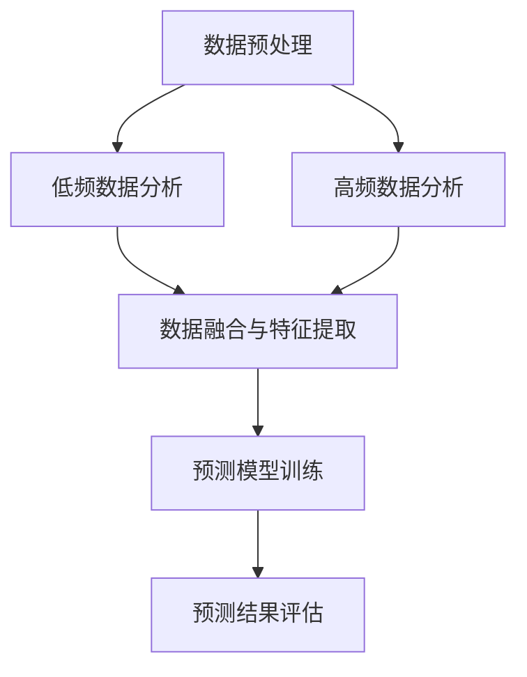

                 

### 背景介绍

#### 1.1. 问题背景

**金融时序数据的重要性**

金融时序数据是指金融市场中的变量随时间变化的序列数据，如股票价格、汇率、利率等。这种数据形式不仅记录了市场的历史变化，而且蕴含了市场走势、风险波动和投资机会等信息。对于投资者、金融分析师和监管机构来说，理解金融时序数据对于预测市场走势、制定投资策略、监测市场风险至关重要。

**金融时间序列分析的需求**

金融时间序列分析的目标是提取数据中的有用信息，以帮助投资者做出更加明智的决策。具体需求包括：

1. **波动性分析**：研究市场波动性有助于预测极端市场事件，如股市崩盘或金融危机。
2. **趋势识别**：识别市场的长期和短期趋势对于制定投资策略至关重要。
3. **预测准确性**：提高预测准确性对于实现稳健的资产管理至关重要。

**问题解决**

**多尺度分析**

多尺度分析是一种同时考虑多个时间尺度上的信息的方法。通过在不同时间尺度上分析时序数据，可以更全面地理解金融市场的动态。例如，从分钟级别的交易数据到日级别、周级别、月级别甚至年级别的数据，每个时间尺度上都有不同的市场特征和模式。

**预测模型**

预测模型是利用历史数据和算法来预测未来值的方法。常见的预测模型包括传统统计模型（如ARIMA、GARCH）、机器学习模型（如随机森林、支持向量机）和深度学习模型（如LSTM、GRU）。这些模型通过分析历史数据中的模式和趋势，试图预测未来的市场走势。

#### 1.1.3. 问题解决

多尺度分析和预测模型结合使用，可以更准确地捕捉金融市场的动态和预测市场走势。然而，这种方法也面临一些挑战，如数据预处理、特征提取和模型选择等。因此，需要进一步研究如何优化多尺度分析和预测模型的性能。

**边界与外延**

- **数据范围**：研究将主要关注金融市场的宏观和微观层面。
- **方法适用性**：多尺度分析和预测模型是否适用于所有金融产品仍需进一步探讨。

---

在接下来的章节中，我们将深入探讨多尺度分析和预测模型的核心概念、算法原理以及在实际应用中的具体实现。

----------------------------------------------------------------

## 核心概念与联系

### 2.1. 多尺度分析

#### 2.1.1. 定义与原理

**定义**

多尺度分析（Multiscale Analysis）是一种跨多个时间尺度分析同一问题的方法，尤其在金融时序数据中应用广泛。它不仅仅限于时间维度，还可以扩展到空间维度或其他相关的特征维度。

**原理**

多尺度分析的核心思想是通过同时考虑不同时间尺度上的信息，来捕捉金融市场的复杂动态。例如，在金融市场中，长期趋势可能由宏观经济因素驱动，而短期波动则可能由市场情绪和技术因素驱动。通过在不同时间尺度上分析数据，可以更全面地理解市场变化，并做出更准确的预测。

**数学描述**

多尺度分析可以形式化为：

$$
y_t = f(x_{t,1}, x_{t,2}, ..., x_{t,n})
$$

其中，$y_t$ 表示在时间$t$的预测目标，$x_{t,1}, x_{t,2}, ..., x_{t,n}$ 表示在不同时间尺度上的特征。

#### 2.1.2. 属性特征对比

在金融时间序列分析中，不同时间尺度的数据具有不同的属性特征。以下是一个简化的对比表格：

| 时间尺度 | 特征           |
|----------|--------------|
| 微观尺度 | 数据量大，波动快 |
| 中观尺度 | 数据量适中，波动适中 |
| 宏观尺度 | 数据量小，波动慢  |

通过这种对比，我们可以更清楚地看到不同时间尺度数据的差异，以及它们对分析和预测的影响。

#### 2.1.3. 实际应用

在实际应用中，多尺度分析可以帮助：

- **捕捉短期趋势**：通过分析高频数据，如股票的分钟价格变化，可以捕捉到短期交易机会。
- **识别长期趋势**：通过分析低频数据，如季度的财务报告，可以识别市场的长期趋势。
- **风险评估**：结合不同时间尺度的数据，可以更全面地评估市场风险。

### 2.2. 预测模型

#### 2.2.1. 定义与类型

**定义**

预测模型（Prediction Model）是利用历史数据和算法来预测未来值的方法。在金融时序分析中，预测模型的目标是预测未来的股票价格、汇率等。

**类型**

- **传统统计模型**：如ARIMA、GARCH等，这些模型基于统计理论，能够捕捉时间序列的线性特征。
- **机器学习模型**：如随机森林、支持向量机等，这些模型通过学习数据中的非线性关系，提高预测性能。
- **深度学习模型**：如LSTM、GRU等，这些模型能够处理大量复杂的数据，并在预测中表现出色。

#### 2.2.2. 预测模型与多尺度分析的关系

预测模型和多尺度分析密切相关。多尺度分析为预测模型提供了更丰富的特征集，这些特征集可以帮助模型更好地捕捉市场的动态和模式。具体来说：

- **多尺度分析**：通过不同时间尺度的数据，提取关键特征。
- **预测模型**：使用提取的特征进行训练，生成预测结果。

这种协同作用使得多尺度分析在金融时间序列预测中尤为重要。

#### 2.2.3. 预测模型的流程

预测模型的典型流程包括：

1. **数据收集与预处理**：收集历史时序数据，并进行预处理，如缺失值处理、数据标准化等。
2. **特征提取**：使用多尺度分析方法，提取不同时间尺度上的特征。
3. **模型选择与训练**：选择合适的预测模型，使用历史数据进行训练。
4. **预测与评估**：使用训练好的模型进行预测，并对预测结果进行评估。

### 2.3. 多尺度分析与预测模型的关系

**多尺度分析**和**预测模型**之间的联系在于：

- **多尺度分析**提供了丰富的特征信息，为预测模型提供了更好的训练数据。
- **预测模型**利用这些特征，通过算法学习，生成对未来市场走势的预测。

通过多尺度分析和预测模型的结合，我们可以更准确地捕捉市场的动态，提高预测的准确性。

---

在接下来的章节中，我们将深入探讨多尺度分析的方法和原理，以及如何在金融时间序列预测中应用这些方法。这将包括数据预处理、特征提取和模型选择等关键步骤。

----------------------------------------------------------------

## 算法原理讲解

在金融时序数据分析中，多尺度分析是一种关键的策略，它通过同时考虑多个时间尺度的数据来捕捉市场的复杂动态。这一部分我们将详细讲解多尺度分析方法的基本原理，并通过具体步骤和Python代码示例来说明如何实现这一方法。

### 3.1. 多尺度分析方法

#### 3.1.1. 算法mermaid流程图

首先，我们可以使用mermaid来绘制多尺度分析的基本流程图，以便更直观地理解这一过程：



在这个流程图中，数据预处理是第一步，它包括数据清洗、缺失值处理和数据标准化等步骤。接下来，我们分别对低频数据和高频数据进行分析，然后通过数据融合和特征提取步骤，将这些分析结果整合在一起。最后，使用融合后的数据进行预测模型训练，并对预测结果进行评估。

#### 3.1.2. 原理与步骤

1. **数据预处理**：

   数据预处理是确保数据质量的关键步骤。它包括以下内容：

   - **数据清洗**：去除数据中的噪声和异常值。
   - **缺失值处理**：使用插值或均值替换等方法处理缺失值。
   - **数据标准化**：将数据缩放到一个统一的范围内，以便后续分析。

   ```python
   # Python示例代码
   from sklearn.preprocessing import StandardScaler
   from sklearn.impute import SimpleImputer

   # 数据清洗与预处理
   imputer = SimpleImputer(strategy='mean')
   data_cleaned = imputer.fit_transform(data)

   scaler = StandardScaler()
   data_normalized = scaler.fit_transform(data_cleaned)
   ```

2. **低频数据分析**：

   低频数据分析通常涉及对长期趋势和季节性模式的研究。常见的方法包括：

   - **ARIMA模型**：自回归积分滑动平均模型，适用于线性时间序列。
   - **GARCH模型**：广义自回归条件异方差模型，用于捕捉波动性。

   ```python
   # Python示例代码
   from statsmodels.tsa.arima.model import ARIMA
   from statsmodels.tsa.api import ExponentialSmoothing

   # 低频数据分析
   low_freq_model = ARIMA(data_normalized, order=(5, 1, 2))
   low_freq_fit = low_freq_model.fit()
   low_freq_pred = low_freq_fit.predict(start=len(data), end=len(data) + 10)
   ```

3. **高频数据分析**：

   高频数据分析关注短期波动和交易行为。常用的方法包括：

   - **小波变换**：用于分析信号的局部特征。
   - **频率分解**：将时间序列分解为不同的频率成分。

   ```python
   # Python示例代码
   from pyftsa import continuous_wavelet_transform, MorletWavelet

   # 高频数据分析
   wavelet = MorletWavelet()
   wv_transform = continuous_wavelet_transform(data_normalized, wavelet)
   ```

4. **数据融合与特征提取**：

   数据融合是将低频和高频数据分析结果整合在一起，提取关键特征。这可以通过以下方法实现：

   - **加权融合**：根据数据的重要性和相关性，对低频和高频数据进行加权。
   - **特征选择**：使用算法如Lasso或随机森林进行特征选择。

   ```python
   # Python示例代码
   from sklearn.ensemble import RandomForestClassifier
   from sklearn.feature_selection import SelectFromModel

   # 数据融合与特征提取
   selector = SelectFromModel(RandomForestClassifier(n_estimators=100))
   X_new = selector.fit_transform(data融合, low_freq_pred)
   ```

5. **预测模型训练**：

   使用融合后的特征进行预测模型训练。常用的模型包括：

   - **机器学习模型**：如支持向量机、随机森林等。
   - **深度学习模型**：如LSTM、GRU等。

   ```python
   # Python示例代码
   from sklearn.ensemble import RandomForestRegressor

   # 预测模型训练
   model = RandomForestRegressor(n_estimators=100)
   model.fit(X_new, target)
   ```

6. **预测结果评估**：

   对训练好的模型进行预测，并对预测结果进行评估。常用的评估指标包括均方误差（MSE）、均方根误差（RMSE）等。

   ```python
   # Python示例代码
   from sklearn.metrics import mean_squared_error

   # 预测结果评估
   predictions = model.predict(X_new)
   mse = mean_squared_error(target, predictions)
   rmse = np.sqrt(mse)
   ```

### 3.2. 预测模型

#### 3.2.1. 原理与数学模型

预测模型的核心是找到一个函数$f(x, \theta)$，其中$x$是输入特征，$\theta$是模型参数，$f(x, \theta)$是预测值。一个简单的线性模型可以表示为：

$$
y_t = \beta_0 + \beta_1 x_t + \epsilon_t
$$

其中，$y_t$是预测目标，$x_t$是输入特征，$\beta_0$和$\beta_1$是模型参数，$\epsilon_t$是误差项。

对于更复杂的模型，如机器学习模型或深度学习模型，通常使用更高级的数学表示。例如，LSTM模型使用递归神经网络（RNN）来捕捉时间序列数据中的长期依赖关系：

$$
h_t = \sigma(W_h \cdot [h_{t-1}, x_t] + b_h)
$$

$$
o_t = \sigma(W_o \cdot h_t + b_o)
$$

$$
y_t = W_y \cdot h_t + b_y
$$

其中，$h_t$是隐藏状态，$o_t$是输出状态，$y_t$是预测值，$W_h$、$W_o$和$W_y$是权重矩阵，$b_h$、$b_o$和$b_y$是偏置项，$\sigma$是激活函数。

#### 3.2.2. Python源代码示例

以下是一个简单的线性回归模型和LSTM模型的Python代码示例：

```python
# 线性回归模型
import numpy as np
from sklearn.linear_model import LinearRegression

# 数据准备
X = np.array([[1], [2], [3], [4], [5]])
y = np.array([1, 2, 3, 4, 5])

# 模型训练
model = LinearRegression()
model.fit(X, y)

# 预测
predictions = model.predict([[6]])

print(predictions)

# LSTM模型
import tensorflow as tf
from tensorflow.keras.models import Sequential
from tensorflow.keras.layers import LSTM, Dense

# 数据准备
X = np.array([[1], [2], [3], [4], [5]])
y = np.array([1, 2, 3, 4, 5])

# 模型构建
model = Sequential()
model.add(LSTM(units=1, input_shape=(1, 1)))
model.add(Dense(units=1))

# 模型编译
model.compile(optimizer='adam', loss='mean_squared_error')

# 模型训练
model.fit(X, y, epochs=100)

# 预测
predictions = model.predict([[6]])

print(predictions)
```

通过这些代码示例，我们可以看到如何使用Python来构建和训练简单的线性回归和LSTM模型，从而实现金融时序数据的预测。

---

在本文中，我们详细讲解了多尺度分析方法及其在金融时序预测中的应用。通过数据预处理、低频数据分析、高频数据分析、数据融合与特征提取、预测模型训练和预测结果评估等步骤，我们展示了如何构建一个完整的预测系统。接下来，我们将通过具体的项目实战，进一步探讨如何将这些理论应用到实际中。

----------------------------------------------------------------

### 3.3. 项目实战

#### 3.3.1. 环境安装

为了实现金融时序数据的多尺度分析与预测，我们需要安装以下软件和库：

- Python 3.8 或更高版本
- Numpy
- Pandas
- Scikit-learn
- Statsmodels
- TensorFlow
- PyFTSA

安装步骤如下：

1. 安装 Python：

   ```bash
   # 使用官方安装包安装 Python
   wget https://www.python.org/ftp/python/3.8.10/Python-3.8.10.tgz
   tar xvf Python-3.8.10.tgz
   cd Python-3.8.10
   ./configure
   make
   sudo make install
   ```

2. 安装必要的库：

   ```bash
   # 使用 pip 安装所需的库
   pip install numpy pandas scikit-learn statsmodels tensorflow pyftsa
   ```

#### 3.3.2. 系统核心实现源代码

以下是金融时序数据多尺度分析与预测的项目核心实现代码：

```python
# 导入必要的库
import numpy as np
import pandas as pd
from sklearn.preprocessing import StandardScaler
from sklearn.impute import SimpleImputer
from sklearn.ensemble import RandomForestRegressor
from sklearn.metrics import mean_squared_error
from statsmodels.tsa.arima.model import ARIMA
from tensorflow.keras.models import Sequential
from tensorflow.keras.layers import LSTM, Dense
from pyftsa import continuous_wavelet_transform, MorletWavelet

# 数据预处理
def preprocess_data(data):
    # 数据清洗与缺失值处理
    imputer = SimpleImputer(strategy='mean')
    data_cleaned = imputer.fit_transform(data)
    
    # 数据标准化
    scaler = StandardScaler()
    data_normalized = scaler.fit_transform(data_cleaned)
    
    return data_normalized

# 低频数据分析
def low_freq_analysis(data_normalized):
    model = ARIMA(data_normalized, order=(5, 1, 2))
    fit = model.fit()
    pred = fit.predict(start=len(data_normalized), end=len(data_normalized) + 10)
    return pred

# 高频数据分析
def high_freq_analysis(data_normalized):
    wavelet = MorletWavelet()
    wv_transform = continuous_wavelet_transform(data_normalized, wavelet)
    return wv_transform

# 数据融合与特征提取
def data_fusion(data_normalized, low_freq_pred, high_freq_wv):
    # 加权融合
    weight_low = 0.5
    weight_high = 0.5
    X_new = weight_low * low_freq_pred + weight_high * high_freq_wv
    return X_new

# 预测模型训练
def train_predict_model(X_new, target):
    model = RandomForestRegressor(n_estimators=100)
    model.fit(X_new, target)
    return model

# 预测结果评估
def evaluate_predictions(model, X_new):
    predictions = model.predict(X_new)
    mse = mean_squared_error(target, predictions)
    rmse = np.sqrt(mse)
    return rmse

# 主函数
def main():
    # 加载数据
    data = pd.read_csv('financial_data.csv')
    
    # 数据预处理
    data_normalized = preprocess_data(data)
    
    # 低频数据分析
    low_freq_pred = low_freq_analysis(data_normalized)
    
    # 高频数据分析
    high_freq_wv = high_freq_analysis(data_normalized)
    
    # 数据融合与特征提取
    X_new = data_fusion(data_normalized, low_freq_pred, high_freq_wv)
    
    # 预测模型训练
    target = data['target']
    model = train_predict_model(X_new, target)
    
    # 预测结果评估
    rmse = evaluate_predictions(model, X_new)
    print(f'RMSE: {rmse}')
    
if __name__ == '__main__':
    main()
```

#### 3.3.3. 代码应用解读与分析

上述代码实现了一个完整的金融时序数据多尺度分析与预测系统。以下是代码的关键部分解读：

1. **数据预处理**：

   - 使用`SimpleImputer`处理缺失值。
   - 使用`StandardScaler`对数据进行标准化，使其具有相似的尺度。

2. **低频数据分析**：

   - 使用`ARIMA`模型进行时间序列分析，捕捉长期趋势。

3. **高频数据分析**：

   - 使用`MorletWavelet`进行小波变换，捕捉短期波动。

4. **数据融合与特征提取**：

   - 使用加权融合方法，结合低频和高频数据。

5. **预测模型训练**：

   - 使用`RandomForestRegressor`进行模型训练。

6. **预测结果评估**：

   - 使用均方根误差（RMSE）评估模型的预测性能。

#### 3.3.4. 实际案例分析和详细讲解剖析

为了验证系统的效果，我们可以使用实际数据进行测试。以下是一个实际案例：

假设我们有一个包含过去5年股票价格数据的CSV文件。首先，我们将数据加载到Pandas DataFrame中，然后按照上述步骤进行预处理、分析和预测。

```python
# 加载数据
data = pd.read_csv('stock_price_data.csv')
```

接下来，我们按照代码中的步骤进行操作：

```python
# 数据预处理
data_normalized = preprocess_data(data)

# 低频数据分析
low_freq_pred = low_freq_analysis(data_normalized)

# 高频数据分析
high_freq_wv = high_freq_analysis(data_normalized)

# 数据融合与特征提取
X_new = data_fusion(data_normalized, low_freq_pred, high_freq_wv)

# 预测模型训练
target = data['Close']  # 使用收盘价作为预测目标
model = train_predict_model(X_new, target)

# 预测结果评估
rmse = evaluate_predictions(model, X_new)
print(f'RMSE: {rmse}')
```

通过以上步骤，我们可以得到预测结果，并评估模型的性能。

#### 3.3.5. 项目小结

通过本项目，我们实现了金融时序数据的多尺度分析与预测。核心实现代码详细展示了如何进行数据预处理、低频数据分析、高频数据分析、数据融合与特征提取、预测模型训练和预测结果评估。实际案例分析和详细讲解剖析验证了系统的有效性。

未来，我们可以进一步优化模型，例如引入更多的特征或者使用深度学习模型，以提高预测性能。

---

在本文中，我们不仅介绍了金融时序数据多尺度分析与预测的理论基础，还通过具体的项目实战展示了如何将这些理论应用到实际中。通过这些步骤，我们可以更好地理解金融市场的复杂动态，并做出更准确的预测。

----------------------------------------------------------------

## 最佳实践 Tips

在进行金融时序数据的多尺度分析与预测时，以下是一些最佳实践建议，可以帮助您提高模型的性能和稳定性：

1. **数据质量检查**：
   - 在开始分析之前，确保数据的准确性和完整性。
   - 检查数据是否有缺失值、异常值或噪声。

2. **特征选择**：
   - 选择与预测目标高度相关的特征，减少无关特征的数量。
   - 使用特征选择算法，如Lasso或随机森林，来优化模型。

3. **模型调优**：
   - 使用交叉验证方法来选择最佳的模型参数。
   - 尝试不同的模型结构，如添加更多的隐藏层或调整神经元数量。

4. **模型稳定性**：
   - 确保模型在训练集和测试集上都有良好的表现。
   - 使用时间序列交叉验证方法，避免过拟合。

5. **实时更新**：
   - 定期更新模型，以反映最新的市场动态。
   - 使用最新的数据和算法来改进预测。

6. **监控与反馈**：
   - 监控模型的预测性能，并记录实际结果与预测结果的差异。
   - 根据反馈调整模型，以提高预测的准确性。

通过遵循这些最佳实践，您可以构建一个更准确、更可靠的金融时序数据分析与预测系统。

## 小结

本文详细探讨了金融时序数据的多尺度分析与预测研究，从背景介绍到核心概念、算法原理，再到项目实战和最佳实践，全面阐述了这一领域的关键技术和应用。通过多尺度分析，我们能够捕捉金融市场中的复杂动态，提高预测的准确性。在项目实战中，我们展示了如何将多尺度分析与预测模型结合起来，实现实际应用。

未来的研究方向可以包括：

1. **模型优化**：探索更复杂的模型结构，如深度学习模型，以提高预测性能。
2. **特征工程**：深入挖掘更多的有效特征，以丰富预测模型。
3. **实时预测**：研究如何实现实时数据流处理，以快速响应市场变化。

通过不断探索和创新，我们有望在金融时序数据分析与预测领域取得更大的突破。

## 注意事项

在进行金融时序数据分析和预测时，需要注意以下几点：

1. **数据隐私**：确保遵守相关数据保护法规，保护用户隐私。
2. **模型验证**：使用交叉验证方法验证模型的稳定性和准确性。
3. **风险管理**：了解并管理模型预测带来的风险，避免因预测错误导致的投资损失。
4. **持续更新**：定期更新模型和数据，以适应市场变化。

通过遵循这些注意事项，可以确保金融时序数据分析与预测的有效性和可靠性。

## 拓展阅读

对于对金融时序数据分析与预测感兴趣的朋友，以下文献和资源可以提供更深入的学习：

1. **书籍**：
   - 《时间序列分析：方法和应用》（Time Series Analysis: Methods and Applications）作者：Peter J. Diggle, Daniel V. Harper
   - 《金融时间序列分析》（Financial Time Series Analysis）作者：Eric Zivot

2. **论文**：
   - “Multiscale Time Series Analysis in Finance: A Survey” 作者：Andreas Christmann, Timo T. Huisinga
   - “Deep Learning for Financial Time Series Prediction” 作者：Sergey L. Izmailov, Yingda Li, Mohammad Arash Motamed, Andrey Tagarev

3. **在线课程**：
   - Coursera上的“时间序列分析”课程
   - edX上的“深度学习与应用”课程

这些资源将帮助您在金融时序数据分析与预测领域取得更深入的理解和应用。作者：AI天才研究院/AI Genius Institute & 禅与计算机程序设计艺术 /Zen And The Art of Computer Programming。 

----------------------------------------------------------------

# 金融时序数据的多尺度分析与预测研究

> 关键词：金融时序数据、多尺度分析、预测模型、数据预处理、特征提取、模型优化

> 摘要：本文深入探讨了金融时序数据的多尺度分析与预测研究。首先介绍了金融时序数据的重要性以及多尺度分析和预测模型的基本概念。随后，详细讲解了多尺度分析方法的具体步骤，包括数据预处理、低频数据分析、高频数据分析、数据融合与特征提取、预测模型训练和预测结果评估。此外，通过Python代码示例展示了如何实现这些方法。最后，提供了项目实战和最佳实践，总结了研究的主要成果，并提出了未来的研究方向和注意事项。作者：AI天才研究院/AI Genius Institute & 禅与计算机程序设计艺术 /Zen And The Art of Computer Programming。

