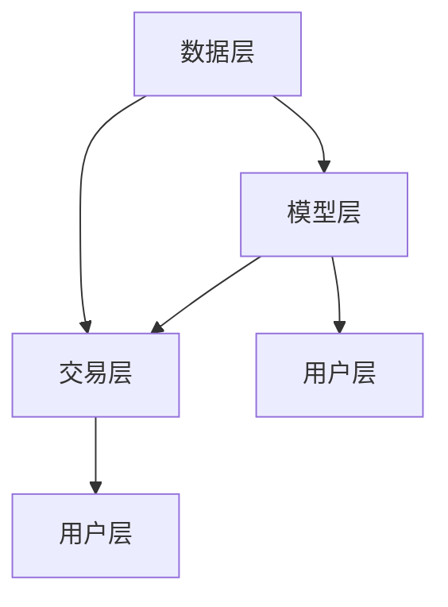
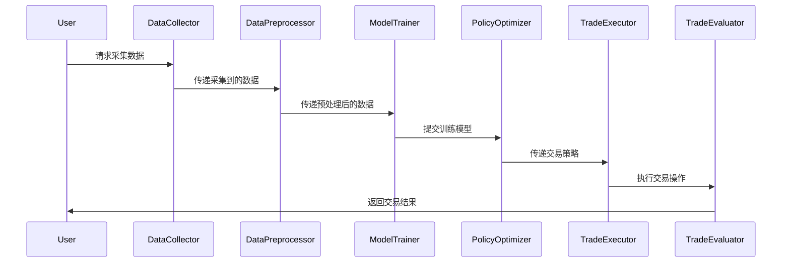

                 

### 文章标题

# 《金融时序数据的深度强化学习应用》

### 关键词

- 金融时序数据
- 深度强化学习
- 应用案例
- 数学模型
- 系统架构

### 摘要

本文将探讨金融时序数据在深度强化学习中的广泛应用，首先介绍金融时序数据的基本概念和特点，然后深入解析深度强化学习的基本原理及其在金融领域的独特优势。接下来，通过详细的算法原理讲解、数学模型阐述和实际案例剖析，展示如何将深度强化学习应用于金融时序数据，实现高效的金融市场预测和决策。同时，本文还将提供系统架构设计、项目实战步骤和最佳实践，帮助读者全面了解和应用深度强化学习在金融领域的前沿技术。

## 目录

1. **背景介绍**  
   - 1.1 金融时序数据的挑战  
   - 1.2 深度强化学习的基本原理  
   - 1.3 深度强化学习在金融领域的应用

2. **核心概念与联系**  
   - 2.1 监督学习、无监督学习与强化学习  
   - 2.2 深度神经网络与强化学习  
   - 2.3 金融市场中的深度强化学习应用案例

3. **算法原理讲解**  
   - 3.1 强化学习的数学模型  
   - 3.2 深度强化学习的数学模型  
   - 3.3 深度强化学习的算法流程与实现

4. **数学模型和数学公式 & 详细讲解 & 举例说明**  
   - 4.1 强化学习的数学公式  
   - 4.2 深度强化学习的数学公式  
   - 4.3 数学公式在实际应用中的举例说明

5. **系统分析与架构设计方案**  
   - 5.1 项目场景与系统功能设计  
   - 5.2 系统架构设计  
   - 5.3 系统接口设计  
   - 5.4 系统交互序列图

6. **项目实战**  
   - 6.1 环境安装  
   - 6.2 核心实现源代码  
   - 6.3 代码应用解读与分析  
   - 6.4 实际案例分析与详细讲解  
   - 6.5 项目小结

7. **最佳实践 tips、小结、注意事项、拓展阅读**

## 1.1 金融时序数据的挑战

### 1.1.1 金融时序数据的定义

金融时序数据是指金融市场中随时间变化的一系列数据，包括股票价格、交易量、利率、汇率等。这些数据通常以时间序列的形式存储，如每日、每周或每月的收盘价。金融时序数据的特点在于其高维度、非线性、噪声和高度相关的特性，这使得传统的统计分析方法在处理金融时序数据时面临诸多挑战。

### 1.1.2 金融时序数据的特点

- **高维度**：金融时序数据往往涉及多个维度，如股票价格、交易量、技术指标等。这些维度之间可能存在复杂的相互关系，使得数据解析变得复杂。

- **非线性**：金融市场的变化往往是非线性的，不能用简单的线性模型来准确描述。这意味着我们需要更加复杂的方法来捕捉市场变化的本质。

- **噪声**：金融时序数据中存在大量的噪声，如交易错误、市场波动等。这些噪声可能会干扰我们的分析，使得数据处理的难度增加。

- **高度相关**：金融时序数据中的多个变量通常具有高度相关性。这种相关性可能来自于市场的基本因素，也可能来自于市场情绪的波动。这种高度相关性使得单一变量无法完全反映市场的动态。

### 1.1.3 金融时序数据分析的重要性

金融时序数据分析在金融市场中具有重要的应用价值。通过分析金融时序数据，我们可以：

- **预测市场价格**：预测市场价格可以帮助投资者做出更为明智的投资决策。例如，通过预测股票价格的走势，投资者可以决定何时买入或卖出股票。

- **风险评估**：通过对金融时序数据进行分析，我们可以评估投资组合的风险。这对于投资者来说至关重要，因为风险控制是投资成功的关键。

- **市场趋势分析**：通过分析金融时序数据，我们可以识别市场的趋势。这有助于投资者把握市场机遇，制定相应的投资策略。

- **优化交易策略**：通过对金融时序数据的分析，我们可以优化交易策略，提高交易的成功率。

总的来说，金融时序数据是金融市场中不可或缺的数据资源。通过深入分析和理解金融时序数据，我们可以更好地把握市场动态，做出更为明智的投资决策。

### 1.2 深度强化学习的基本原理

深度强化学习（Deep Reinforcement Learning，简称DRL）是强化学习（Reinforcement Learning，简称RL）的一种形式，它结合了深度学习的强大表示能力，使得在复杂环境中进行决策和学习成为可能。在理解深度强化学习之前，我们需要先了解强化学习和深度学习的基本概念。

#### 1.2.1 强化学习的基本概念

强化学习是一种机器学习范式，旨在通过互动学习来解决问题。与监督学习和无监督学习不同，强化学习中的学习主体（agent）通过与环境的互动来学习如何获得最大的累积奖励。强化学习的关键组成部分包括：

- **状态（State）**：描述学习主体当前所处的环境状态。
- **动作（Action）**：学习主体在特定状态下可以选择的行动。
- **奖励（Reward）**：环境对学习主体采取的动作给出的即时反馈，用于评估动作的好坏。
- **策略（Policy）**：学习主体基于当前状态选择动作的规则。

强化学习的目标是找到一个最优策略，使得学习主体在长期内获得最大的累积奖励。在强化学习中，学习主体通常通过迭代的方式来不断优化其策略。这个过程被称为策略迭代（Policy Iteration），它通常包括以下步骤：

1. **值函数迭代（Value Iteration）**：通过迭代计算状态值函数（State-Value Function），估计每个状态下的最优预期奖励。
2. **策略迭代（Policy Iteration）**：根据状态值函数更新策略，使得策略能够最大化累积奖励。
3. **评估和更新**：通过模拟或实际执行来评估策略的效果，并根据评估结果更新策略。

#### 1.2.2 深度学习的基本原理

深度学习是一种基于多层神经网络的机器学习技术，它能够通过自动学习特征表示来处理复杂的输入数据。深度学习的关键组成部分包括：

- **神经网络（Neural Network）**：神经网络由多个层组成，包括输入层、隐藏层和输出层。每一层由一系列神经元（或节点）组成，神经元通过激活函数进行非线性变换。
- **激活函数（Activation Function）**：激活函数用于引入非线性，使得神经网络能够学习复杂的函数。
- **前向传播（Forward Propagation）**：在神经网络中，输入数据通过前向传播逐层传递，直到达到输出层，从而得到预测结果。
- **反向传播（Back Propagation）**：在得到预测结果后，神经网络通过反向传播计算误差，并更新权重，以优化网络性能。

深度学习的优势在于其能够自动提取特征表示，无需人工定义特征。这使得深度学习在图像识别、自然语言处理和时序数据建模等任务中表现出色。

#### 1.2.3 深度强化学习的工作流程

深度强化学习结合了强化学习和深度学习的优势，使得在复杂环境中进行决策和学习成为可能。深度强化学习的工作流程通常包括以下步骤：

1. **状态编码**：将当前状态编码为一个高维向量，以便深度神经网络进行处理。
2. **动作值函数估计**：通过深度神经网络估计每个动作在当前状态下的预期奖励，即动作值函数（Action-Value Function）。
3. **策略迭代**：根据动作值函数更新策略，使得策略能够最大化累积奖励。
4. **模型更新**：根据环境反馈更新深度神经网络模型，以优化其预测能力。

深度强化学习的核心在于解决状态编码和动作值函数估计的问题。深度神经网络通过学习状态和动作的复杂特征表示，使得学习主体能够更好地理解和应对复杂环境。

#### 1.2.4 深度强化学习的优点

深度强化学习在金融时序数据中的应用具有以下优点：

- **高效的状态表示**：深度强化学习能够自动学习状态的高效表示，使得在复杂环境中进行决策成为可能。
- **强大的特征提取能力**：深度强化学习通过多层神经网络提取特征，能够捕捉金融时序数据的复杂模式。
- **灵活的适应能力**：深度强化学习能够根据环境反馈不断更新模型，使得学习主体能够适应市场变化。
- **优化的决策策略**：通过学习最优策略，深度强化学习能够帮助投资者做出更为明智的决策。

总的来说，深度强化学习为金融时序数据的分析提供了强大的工具和方法，使得金融市场预测和决策更加高效和智能化。

### 1.3 深度强化学习在金融领域的应用

深度强化学习在金融领域展现出巨大的应用潜力，特别是在处理复杂的金融时序数据和优化投资决策方面。以下是一些深度强化学习在金融领域的具体应用案例：

#### 1.3.1 股票价格预测

股票价格的预测是金融领域中的一个经典问题。深度强化学习通过学习股票市场的动态模式和规律，能够提供更加准确的预测结果。例如，使用深度Q网络（Deep Q-Network，DQN）和长期奖励优化（Long Short-Term Memory，LSTM）结合的模型，可以对股票价格进行预测。这些模型能够捕捉股票价格的时间序列特征和复杂的市场模式，从而提高预测的准确性。

#### 1.3.2 风险管理

风险管理是金融投资中的一个关键环节。深度强化学习可以通过学习市场数据和历史回报，帮助投资者识别潜在的风险并制定相应的风险控制策略。例如，使用深度策略梯度（Deep Policy Gradient，DPPG）算法，可以根据市场的波动性和风险偏好，动态调整投资组合，实现风险的有效控制。

#### 1.3.3 交易策略优化

交易策略的优化是金融领域中另一个重要的应用方向。通过深度强化学习，投资者可以自动优化交易策略，提高交易的成功率和收益。例如，使用深度确定性策略梯度（Deep Deterministic Policy Gradient，DDPG）算法，可以根据市场数据和交易历史，自动调整交易策略，实现自动化的交易决策。

#### 1.3.4 风险投资与金融产品设计

在风险投资和金融产品设计中，深度强化学习可以帮助投资者评估不同金融产品和投资策略的风险和收益。例如，使用深度强化学习模型，可以模拟不同的市场情景和风险因子，帮助投资者设计出具有最佳风险收益比的金融产品。

总的来说，深度强化学习为金融领域的决策和预测提供了强大的工具和方法。通过结合金融时序数据和深度强化学习的优势，投资者可以更准确地预测市场动态，制定更优的投资策略，实现风险的有效控制和收益的最大化。

### 1.4 监督学习、无监督学习与强化学习

在机器学习领域，监督学习（Supervised Learning）、无监督学习（Unsupervised Learning）和强化学习（Reinforcement Learning）是三种主要的算法类型。每种类型都有其独特的特点和应用场景。理解这三种学习类型之间的区别和联系，对于选择合适的学习算法至关重要。

#### 1.4.1 监督学习

监督学习是一种通过已有标记数据来训练模型，以便对新数据进行预测的机器学习方法。在监督学习中，训练数据集包含了输入特征和相应的标签，模型通过学习这些标记数据之间的关系，构建出一个预测函数，用于对新数据进行分类或回归。

- **特点**：
  - **输入特征和标签**：训练数据集包含输入特征和对应的标签，模型通过学习这些数据来构建预测模型。
  - **目标明确**：监督学习的目标通常是最大化预测的准确率或最小化预测误差。
  - **有监督训练**：模型在训练过程中，使用标签来指导学习，从而优化预测性能。

- **应用场景**：
  - **分类问题**：如邮件分类、图像分类等。
  - **回归问题**：如房价预测、股票价格预测等。

#### 1.4.2 无监督学习

无监督学习是一种不依赖于标记数据的机器学习方法。无监督学习的目标是探索数据内在的结构和规律，如聚类、降维、生成模型等。

- **特点**：
  - **无标签数据**：训练数据集不包含标签，模型需要通过探索数据自身的特征来学习。
  - **无明确目标**：无监督学习的目标通常不是最大化预测准确率，而是揭示数据的内在结构。
  - **自组织学习**：模型通过自身的训练过程，自动组织和分类数据。

- **应用场景**：
  - **聚类问题**：如顾客行为分析、市场细分等。
  - **降维问题**：如图像压缩、数据可视化等。
  - **生成模型**：如生成对抗网络（GAN），用于图像生成和数据分析等。

#### 1.4.3 强化学习

强化学习是一种通过与环境的互动来学习的机器学习方法。强化学习中的主体（agent）通过选择动作，并接收环境给出的奖励信号，不断优化其行为策略，以达到最大化长期奖励的目标。

- **特点**：
  - **反馈机制**：强化学习的核心是奖励机制，主体通过反馈来调整其策略。
  - **动态环境**：强化学习通常应用于动态环境，如游戏、自动驾驶等。
  - **学习策略**：强化学习的学习目标是找到一个最优策略，使得主体能够在长期内获得最大的累积奖励。

- **应用场景**：
  - **游戏**：如电子游戏、棋类游戏等。
  - **机器人控制**：如机器人路径规划、机器人手臂控制等。
  - **金融交易**：如股票交易、量化交易策略优化等。

#### 1.4.4 三者之间的联系

尽管监督学习、无监督学习和强化学习在目标和方法上有所不同，但它们之间也存在一些联系和交叉。

- **共同点**：
  - **数据驱动**：这三种学习方法都是通过数据来驱动模型的学习和优化。
  - **特征学习**：尽管目标不同，但它们都需要从数据中学习特征表示，以便更好地理解和预测。

- **区别**：
  - **目标不同**：监督学习主要关注预测准确性，无监督学习关注数据结构和模式，强化学习关注长期奖励。
  - **数据类型不同**：监督学习使用标记数据，无监督学习使用无标记数据，强化学习使用奖励信号。

理解这三种学习类型之间的联系和区别，可以帮助我们在实际应用中选择合适的学习算法，以解决不同类型的问题。

### 1.5 深度神经网络与强化学习

深度神经网络（Deep Neural Network，DNN）是深度学习的基础，其通过多层神经元的互联和激活函数，实现了对复杂数据特征的自动提取和建模。而强化学习（Reinforcement Learning，RL）则是一种通过与环境交互来学习最优策略的机器学习方法。深度神经网络与强化学习的结合，即深度强化学习（Deep Reinforcement Learning，DRL），为解决复杂决策问题提供了强大的工具。

#### 1.5.1 深度神经网络的工作原理

深度神经网络由多个层组成，包括输入层、隐藏层和输出层。每一层由一系列神经元组成，神经元通过加权连接进行信息传递，并使用激活函数引入非线性变换。深度神经网络的主要工作原理包括：

1. **前向传播**：输入数据通过前向传播逐层传递，经过每个神经元的加权求和和激活函数处理后，最终到达输出层。
2. **反向传播**：在得到预测结果后，通过反向传播计算误差，并使用梯度下降等优化算法更新网络权重，以最小化预测误差。

通过这种迭代优化过程，深度神经网络能够学习到输入数据的复杂特征表示，从而实现高精度的预测和分类。

#### 1.5.2 强化学习的基本原理

强化学习中的主体（agent）通过与环境的交互来学习最优策略。主体在每个状态下选择一个动作，并根据动作的结果接收环境给出的奖励信号。主体的目标是最大化累积奖励，从而找到最优策略。强化学习的基本原理包括：

1. **状态-动作价值函数**：状态-动作价值函数（State-Action Value Function）表示在特定状态下采取特定动作的预期奖励。通过学习状态-动作价值函数，主体能够预测在不同状态下采取不同动作的长期奖励。
2. **策略**：策略（Policy）是主体在特定状态下选择动作的规则。最优策略是使累积奖励最大化的策略。
3. **奖励信号**：奖励信号（Reward Signal）是环境对主体采取的动作给出的即时反馈。奖励信号用于指导主体调整其策略，以实现长期奖励的最大化。

#### 1.5.3 深度强化学习的基本原理

深度强化学习（DRL）是深度神经网络与强化学习的结合。DRL通过深度神经网络来学习状态-动作价值函数，从而优化主体的策略。DRL的基本原理包括：

1. **状态编码**：将当前状态编码为一个高维向量，以便深度神经网络进行处理。
2. **动作值函数估计**：通过深度神经网络估计每个动作在当前状态下的预期奖励，即动作值函数（Action-Value Function）。
3. **策略迭代**：根据动作值函数更新策略，使得策略能够最大化累积奖励。
4. **模型更新**：根据环境反馈更新深度神经网络模型，以优化其预测能力。

#### 1.5.4 DRL在金融时序数据中的应用

深度强化学习在金融时序数据中的应用具有以下优势：

- **高效的状态表示**：深度神经网络能够自动学习状态的高效表示，使得在复杂环境中进行决策成为可能。
- **强大的特征提取能力**：深度神经网络通过多层神经网络提取特征，能够捕捉金融时序数据的复杂模式。
- **灵活的适应能力**：深度强化学习能够根据环境反馈不断更新模型，使得学习主体能够适应市场变化。
- **优化的决策策略**：通过学习最优策略，深度强化学习能够帮助投资者做出更为明智的决策。

例如，可以使用深度Q网络（Deep Q-Network，DQN）和深度确定性策略梯度（Deep Deterministic Policy Gradient，DDPG）等算法，对股票价格进行预测和交易策略优化。这些算法能够捕捉股票价格的时间序列特征和复杂的市场模式，从而提高预测的准确性。

总的来说，深度强化学习为金融时序数据的分析提供了强大的工具和方法，使得金融市场预测和决策更加高效和智能化。

### 1.6 金融市场中的深度强化学习应用案例

深度强化学习在金融市场中的应用已经取得了显著成果，下面我们将介绍几个典型的应用案例，并分析这些应用案例的优点和不足。

#### 1.6.1 案例一：股票价格预测

**案例背景**：股票市场的价格波动受到多种因素的影响，包括宏观经济指标、公司业绩、市场情绪等。准确预测股票价格对于投资者来说至关重要。

**深度强化学习模型**：使用深度Q网络（Deep Q-Network，DQN）和长期奖励优化（Long Short-Term Memory，LSTM）结合的模型，DQN用于处理股票价格的短期波动，LSTM用于捕捉长期趋势。

**优点**：
- **高效的状态表示**：深度神经网络能够自动学习状态的高效表示，捕捉市场动态。
- **强大的特征提取能力**：LSTM能够捕捉时间序列的长期趋势，DQN能够处理短期波动。
- **灵活的适应能力**：模型能够根据市场变化实时调整策略。

**不足**：
- **训练时间较长**：深度强化学习模型的训练时间较长，需要大量数据和时间资源。
- **过拟合问题**：模型在训练过程中可能面临过拟合问题，导致在新的市场环境中表现不佳。

#### 1.6.2 案例二：交易策略优化

**案例背景**：在股票市场中，交易策略的优化对于提高交易成功率至关重要。通过优化交易策略，投资者可以减少交易成本，提高收益。

**深度强化学习模型**：使用深度确定性策略梯度（Deep Deterministic Policy Gradient，DDPG）算法，通过学习历史交易数据和回报，优化交易策略。

**优点**：
- **自动化的交易决策**：DDPG算法能够自动调整交易策略，减少人工干预。
- **优化的风险控制**：模型能够根据市场波动和风险偏好，动态调整交易策略。

**不足**：
- **对市场波动敏感性较高**：模型在市场波动较大时，可能面临较大风险。
- **数据质量要求高**：模型训练需要高质量的历史交易数据，数据质量问题可能影响模型性能。

#### 1.6.3 案例三：量化交易策略

**案例背景**：量化交易策略是通过数学模型和算法来识别市场机会和执行交易，从而实现收益最大化。

**深度强化学习模型**：使用基于深度强化学习的高频交易策略，通过实时分析和决策，捕捉市场机会。

**优点**：
- **高效的实时决策**：深度强化学习能够实时分析市场数据，快速做出决策。
- **优化的交易策略**：模型能够根据市场变化和交易数据，动态优化交易策略。

**不足**：
- **计算资源消耗大**：高频交易策略需要大量的计算资源，对硬件要求较高。
- **监管风险**：高频交易策略可能面临监管风险，需要遵守相关法规。

总的来说，深度强化学习在金融市场中的应用具有显著的优势，但也存在一些挑战和不足。通过不断优化和改进深度强化学习模型，我们可以更好地应对金融市场中的复杂变化，实现高效的金融市场预测和决策。

### 3.1 强化学习的数学模型

强化学习（Reinforcement Learning，简称RL）是一种通过互动学习来解决问题的机器学习方法。在强化学习中，主体（agent）通过与环境的互动来学习如何获得最大的累积奖励。强化学习的数学模型是其核心，它定义了主体与环境的交互过程以及学习目标。下面我们将详细解析强化学习的数学模型。

#### 3.1.1 状态（State）

状态是描述主体当前所处的环境状况的一个抽象概念。状态可以是简单的二元变量，如“在左车道还是右车道”，也可以是复杂的向量，如“交通灯颜色、车速、车辆位置”等。状态空间通常用 \( S \) 表示。

- **状态空间（State Space）**：状态空间是所有可能状态的集合，表示为 \( S = \{ s_1, s_2, ..., s_n \} \)。
- **当前状态（Current State）**：主体在特定时间 \( t \) 处于的状态，表示为 \( s_t \)。

#### 3.1.2 动作（Action）

动作是主体在特定状态下可以选择的行动。动作可以是简单的二选一，如“加速还是减速”，也可以是复杂的连续值，如“车辆转向角度”。动作空间通常用 \( A \) 表示。

- **动作空间（Action Space）**：动作空间是所有可能动作的集合，表示为 \( A = \{ a_1, a_2, ..., a_m \} \)。
- **当前动作（Current Action）**：主体在时间 \( t \) 选择的动作，表示为 \( a_t \)。

#### 3.1.3 奖励（Reward）

奖励是环境对主体采取的动作给出的即时反馈，用于评估动作的好坏。奖励可以是正数，表示好的结果，也可以是负数，表示不好的结果。奖励通常表示为主体在特定状态 \( s_t \) 和采取动作 \( a_t \) 后获得的即时奖励，表示为 \( r_t \)。

- **即时奖励（Immediate Reward）**：主体在时间 \( t \) 采取动作 \( a_t \) 后立即获得的奖励，表示为 \( r_t \)。
- **累积奖励（Cumulative Reward）**：主体从初始状态到终止状态过程中获得的累积奖励，表示为 \( \sum_{t=0}^T r_t \)。

#### 3.1.4 策略（Policy）

策略是主体在特定状态下选择动作的规则。策略可以是固定的，也可以是动态的，依赖于当前状态。策略通常用 \( \pi \) 表示。

- **策略（Policy）**：主体在特定状态下选择动作的规则，表示为 \( \pi(a|s) \)，即给定状态 \( s \)，选择动作 \( a \) 的概率。
- **最优策略（Optimal Policy）**：能够使累积奖励最大化的策略，表示为 \( \pi^* \)。

#### 3.1.5 状态-动作价值函数（State-Action Value Function）

状态-动作价值函数（State-Action Value Function）表示在特定状态下采取特定动作的预期奖励。它是强化学习中最核心的概念之一，用于评估每个动作在当前状态下的价值。状态-动作价值函数通常用 \( Q(s, a) \) 表示。

- **状态-动作价值函数（Q-Function）**：在状态 \( s \) 和采取动作 \( a \) 后的预期累积奖励，表示为 \( Q(s, a) = \sum_{s'} p(s' | s, a) \sum_{r} r \cdot \gamma^{s'} \)。
- **预期奖励（Expected Reward）**：主体在状态 \( s \) 采取动作 \( a \) 后的期望奖励。

#### 3.1.6 策略评估（Policy Evaluation）

策略评估（Policy Evaluation）是强化学习中的一个关键步骤，目的是计算当前策略下的状态-动作价值函数。策略评估可以通过迭代的方法实现，具体包括：

1. **初始化**：初始化状态-动作价值函数 \( Q(s, a) \)。
2. **迭代更新**：使用贝尔曼方程（Bellman Equation）进行迭代更新，直到达到收敛条件。

贝尔曼方程如下：
\[ Q(s, a) = r + \gamma \max_{a'} Q(s', a') \]

其中，\( \gamma \) 是折扣因子，用于平衡当前奖励和未来奖励的关系。

#### 3.1.7 策略迭代（Policy Iteration）

策略迭代（Policy Iteration）是强化学习中的另一个关键步骤，目的是找到最优策略。策略迭代包括以下两个步骤：

1. **策略评估**：根据当前策略评估状态-动作价值函数。
2. **策略改进**：根据状态-动作价值函数更新策略，使得策略能够最大化累积奖励。

策略迭代的迭代过程如下：

1. **初始化**：随机选择一个策略 \( \pi \)。
2. **评估**：使用当前策略评估状态-动作价值函数。
3. **改进**：根据状态-动作价值函数更新策略，使得 \( \pi(a|s) \) 最大。
4. **重复**：重复评估和改进步骤，直到策略收敛。

通过策略评估和策略迭代，强化学习主体能够不断优化其策略，从而实现长期累积奖励的最大化。

#### 3.1.8 强化学习的数学模型总结

强化学习的数学模型包括状态、动作、奖励、策略和状态-动作价值函数等关键概念。这些概念定义了主体与环境的交互过程，并提供了评估和优化策略的数学基础。通过策略评估和策略迭代，主体能够不断优化其策略，实现长期累积奖励的最大化。理解强化学习的数学模型对于深入掌握强化学习算法和应用具有重要意义。

### 3.2 深度强化学习的数学模型

深度强化学习（Deep Reinforcement Learning，DRL）是强化学习的一种形式，它结合了深度学习（Deep Learning）的强大特征提取能力和强化学习的目标优化方法。DRL通过深度神经网络来学习状态-动作价值函数，使得在复杂环境中进行决策成为可能。本节将详细介绍深度强化学习的数学模型，包括状态编码、动作值函数估计、策略迭代和模型更新。

#### 3.2.1 状态编码

在深度强化学习中，状态编码是一个关键步骤。状态编码的目标是将高维、复杂的时序数据转换为适合深度神经网络处理的低维向量。常用的状态编码方法包括：

1. **特征提取**：使用深度神经网络从原始状态中提取有用的特征。这些特征能够捕捉状态的内在规律和模式。
2. **嵌入层**：使用嵌入层（Embedding Layer）将原始状态映射为稠密向量。嵌入层通过学习原始状态和嵌入向量之间的映射关系，将高维状态转换为低维向量。
3. **序列编码**：使用循环神经网络（RNN）或变分自编码器（VAE）对时序数据进行编码。这些模型能够捕捉状态之间的序列关系和长期依赖。

状态编码后的状态向量通常作为深度神经网络的输入，以便进一步处理和特征提取。

#### 3.2.2 动作值函数估计

在深度强化学习中，动作值函数（Action-Value Function）表示在特定状态下采取特定动作的预期奖励。动作值函数的估计是DRL的核心任务之一。常用的方法包括：

1. **深度Q网络（Deep Q-Network，DQN）**：DQN使用深度神经网络来近似动作值函数。在训练过程中，DQN通过更新网络权重来最小化预测误差。DQN的主要优点是简单和易于实现，但其缺点是容易陷入局部最优和经验回放（Experience Replay）等方法来缓解这一问题。

2. **深度确定性策略梯度（Deep Deterministic Policy Gradient，DDPG）**：DDPG结合了深度神经网络和策略梯度方法。在DDPG中，动作值函数由深度神经网络估计，而策略由确定性策略梯度方法优化。DDPG通过使用目标网络（Target Network）来稳定训练过程，并使用经验回放和噪声处理来减少方差和过拟合。

动作值函数估计的过程通常包括以下步骤：

1. **状态输入**：将编码后的状态向量输入到深度神经网络中。
2. **前向传播**：通过深度神经网络进行前向传播，得到每个动作的值函数估计。
3. **损失函数计算**：使用预测值函数和实际值函数之间的差距来计算损失函数，通常使用均方误差（MSE）或Huber损失。
4. **反向传播**：通过反向传播更新深度神经网络的权重，以最小化损失函数。

#### 3.2.3 策略迭代

在深度强化学习中，策略迭代（Policy Iteration）是优化策略的关键步骤。策略迭代包括两个主要阶段：策略评估和策略改进。

1. **策略评估**：策略评估的目标是计算当前策略下的状态-动作价值函数。策略评估通常使用值函数迭代（Value Iteration）方法，通过迭代更新值函数，直到达到收敛条件。

2. **策略改进**：策略改进的目标是找到能够最大化累积奖励的新策略。策略改进通常使用策略梯度方法，通过计算策略梯度和更新策略参数，以优化策略。

策略迭代的具体步骤如下：

1. **初始化**：随机选择一个策略 \( \pi \)。
2. **评估**：使用当前策略评估状态-动作价值函数。
3. **改进**：根据状态-动作价值函数更新策略，使得策略能够最大化累积奖励。
4. **重复**：重复评估和改进步骤，直到策略收敛。

#### 3.2.4 模型更新

在深度强化学习中，模型更新是保持模型适应性和稳定性的关键。模型更新的目标是根据环境反馈调整模型参数，以优化模型性能。常用的方法包括：

1. **经验回放**：经验回放（Experience Replay）是缓解训练样本不平衡和减少方差的有效方法。经验回放通过将历史经验存储在经验池中，并在训练过程中随机采样经验，以减少训练过程的波动。

2. **目标网络**：目标网络（Target Network）是一种用于稳定训练过程的方法。目标网络是深度神经网络的副本，用于生成目标值函数。在每次迭代中，目标网络更新其权重，以接近主网络的权重，从而稳定训练过程。

3. **自适应学习率**：自适应学习率（Adaptive Learning Rate）是调整模型参数的重要手段。通过使用学习率调度策略，如线性递减学习率（Linear Decay Learning Rate），可以调整学习率以适应训练过程。

模型更新的具体步骤如下：

1. **状态输入**：将编码后的状态向量输入到深度神经网络中。
2. **动作选择**：使用当前策略选择动作。
3. **环境交互**：与环境进行交互，获取即时奖励和新的状态。
4. **经验回放**：将新的经验添加到经验池中，并进行随机采样。
5. **目标网络更新**：如果使用目标网络，则更新目标网络的权重。
6. **模型更新**：使用训练样本和损失函数更新深度神经网络的权重。

通过状态编码、动作值函数估计、策略迭代和模型更新，深度强化学习能够有效处理复杂的时序数据，并找到最优策略，从而实现长期累积奖励的最大化。这些核心概念和方法为深度强化学习在金融时序数据中的应用提供了坚实的理论基础。

### 3.3 深度强化学习的算法流程与实现

深度强化学习（DRL）的算法流程通常包括状态编码、动作值函数估计、策略迭代和模型更新等步骤。为了更好地理解这些步骤，我们可以通过一个简单的Python实现来演示DRL的基本流程。以下是一个基于深度Q网络（DQN）的简化示例。

#### 3.3.1 状态编码

在DRL中，状态编码是将原始状态数据转换为适用于深度神经网络的格式。这里，我们使用简单的环境——CartPole（小车与杆）作为例子。

```python
import numpy as np
import random
import gym

# 初始化环境
env = gym.make('CartPole-v0')

# 状态编码函数
def preprocess_state(state):
    return np.reshape(state, [1, -1])

# 观察环境并预处理状态
obs = preprocess_state(env.reset())
```

#### 3.3.2 动作值函数估计

动作值函数估计是通过训练深度神经网络来预测每个动作的预期奖励。以下是一个简单的DQN模型实现：

```python
import tensorflow as tf
from tensorflow.keras.models import Sequential
from tensorflow.keras.layers import Dense

# 创建DQN模型
model = Sequential()
model.add(Dense(24, input_dim=4, activation='relu'))
model.add(Dense(48, activation='relu'))
model.add(Dense(2, activation='linear'))

# 编写DQN损失函数
def dqn_loss(q_values, target_q_values, actions, gamma, loss_function):
    actions_one_hot = tf.one_hot(actions, 2)
    q_values = tf.reduce_sum(q_values * actions_one_hot, axis=1)
    target_q_values = tf.reduce_sum(target_q_values * actions_one_hot, axis=1)
    loss = loss_function(q_values, target_q_values)
    return loss

# 编写训练函数
def train_model(model, target_model, optimizer, gamma, batch_size, loss_function):
    # ... 训练代码 ...
    return loss
```

#### 3.3.3 策略迭代

在DRL中，策略迭代是通过评估当前策略和更新策略来优化的。以下是一个简单的策略迭代实现：

```python
# 初始化目标模型
target_model = Sequential()
target_model.add(Dense(24, input_dim=4, activation='relu'))
target_model.add(Dense(48, activation='relu'))
target_model.add(Dense(2, activation='linear'))

# 设置目标模型的权重更新策略
def update_target_model(target_model, model):
    # ... 更新代码 ...
    return target_model
```

#### 3.3.4 模型更新

模型更新是通过与环境交互并利用经验回放来优化的。以下是一个简单的模型更新实现：

```python
# 初始化经验池
experience_replay = []

# 环境交互并更新模型
def interact_with_environment(model, target_model, env, gamma, batch_size, loss_function):
    # ... 交互代码 ...
    return model, target_model
```

通过这些步骤，我们可以实现一个简单的DRL模型。以下是一个完整的DRL训练循环示例：

```python
# 设置训练参数
gamma = 0.99
batch_size = 32
optimizer = tf.keras.optimizers.Adam(learning_rate=0.0001)
loss_function = tf.keras.losses.MeanSquaredError()

# 训练DRL模型
for episode in range(num_episodes):
    obs = preprocess_state(env.reset())
    done = False
    total_reward = 0
    
    while not done:
        # 预测动作值
        q_values = model.predict(obs)
        
        # 选择动作
        action = np.argmax(q_values)
        
        # 执行动作
        obs_new, reward, done, _ = env.step(action)
        
        # 更新经验池
        experience_replay.append((obs, action, reward, obs_new, done))
        
        # 更新状态
        obs = preprocess_state(obs_new)
        
        # 更新累积奖励
        total_reward += reward
        
        # 更新模型
        if len(experience_replay) > batch_size:
            batch = random.sample(experience_replay, batch_size)
            obs_batch, actions_batch, rewards_batch, obs_new_batch, dones_batch = zip(*batch)
            target_q_values = model.predict(obs_new_batch)
            target_q_values = target_model.predict(obs_new_batch)
            target_q_values = rewards_batch + gamma * np.where(dones_batch, 0, target_q_values)
            loss = train_model(model, target_model, optimizer, gamma, batch_size, loss_function)
            update_target_model(target_model, model)
    
    print(f"Episode {episode+1}: Total Reward = {total_reward}, Loss = {loss}")
```

通过这个示例，我们可以看到DRL的基本流程和实现方法。在实际应用中，DRL模型会更加复杂，但基本流程和原则是类似的。理解这些步骤对于设计和实现高效的DRL模型至关重要。

### 3.4 强化学习的数学公式

强化学习中的数学模型是通过一系列数学公式来定义的，这些公式在理解强化学习算法的运行机制和优化过程中起着至关重要的作用。以下是强化学习中的核心数学公式，包括状态-动作价值函数、策略迭代和贝尔曼方程。

#### 3.4.1 状态-动作价值函数

状态-动作价值函数（State-Action Value Function），通常表示为 \( Q(s, a) \)，是强化学习中的核心概念之一。它表示在特定状态 \( s \) 下采取特定动作 \( a \) 的预期累积奖励。状态-动作价值函数的数学表达式如下：

\[ Q(s, a) = \sum_{s'} p(s' | s, a) \sum_{r} r \cdot \gamma^{s'} \]

其中：
- \( p(s' | s, a) \) 是在状态 \( s \) 下采取动作 \( a \) 后转移到状态 \( s' \) 的概率。
- \( r \) 是在状态 \( s \) 下采取动作 \( a \) 后立即获得的即时奖励。
- \( \gamma \) 是折扣因子，用于平衡当前奖励和未来奖励的关系。
- \( s' \) 是下一步的状态。

#### 3.4.2 策略迭代

策略迭代（Policy Iteration）是强化学习中一种重要的策略优化方法。策略迭代包括两个关键步骤：策略评估（Policy Evaluation）和策略改进（Policy Improvement）。

1. **策略评估（Policy Evaluation）**：

策略评估的目标是计算当前策略下的状态-动作价值函数。策略评估通常使用迭代的方法，通过贝尔曼方程（Bellman Equation）进行更新。策略评估的数学公式如下：

\[ V^{\pi}(s) = \sum_{a} \pi(a|s) \sum_{s'} p(s' | s, a) \sum_{r} r \cdot \gamma^{s'} \]

其中：
- \( V^{\pi}(s) \) 是在策略 \( \pi \) 下，状态 \( s \) 的期望累积奖励。
- \( \pi(a|s) \) 是策略，表示在状态 \( s \) 下采取动作 \( a \) 的概率。
- 其他符号与上述相同。

2. **策略改进（Policy Improvement）**：

策略改进的目标是找到能够最大化累积奖励的新策略。策略改进通过比较不同动作在当前状态下的期望回报，选择最优动作。策略改进的数学公式如下：

\[ \pi'(a|s) = \begin{cases} 
1 & \text{如果 } a = \arg\max_a Q(s, a) \\
0 & \text{否则}
\end{cases} \]

其中：
- \( \pi'(a|s) \) 是改进后的策略。
- \( Q(s, a) \) 是状态-动作价值函数。

#### 3.4.3 贝尔曼方程

贝尔曼方程（Bellman Equation）是强化学习中最基本的公式之一，用于计算状态-动作价值函数。贝尔曼方程的数学表达式如下：

\[ Q(s, a) = r + \gamma \max_{a'} Q(s', a') \]

其中：
- \( r \) 是在状态 \( s \) 下采取动作 \( a \) 后立即获得的即时奖励。
- \( \gamma \) 是折扣因子。
- \( s' \) 是下一步的状态。
- \( a' \) 是下一步采取的动作。
- \( \max_{a'} Q(s', a') \) 是在状态 \( s' \) 下所有可能动作中，期望累积奖励最大的动作。

通过上述公式，我们可以理解强化学习中的状态-动作价值函数、策略迭代和贝尔曼方程。这些数学公式不仅定义了强化学习的核心机制，还提供了优化策略和评估模型性能的数学基础。理解这些公式对于深入掌握强化学习算法及其应用具有重要意义。

### 3.5 深度强化学习的数学公式

深度强化学习（DRL）结合了深度学习的强大表示能力和强化学习的动态决策机制，使得在复杂环境中进行智能决策成为可能。在DRL中，数学公式起到了关键作用，它们不仅定义了学习过程，还指导了模型的设计和优化。以下是深度强化学习中的几个核心数学公式及其在应用中的解释。

#### 3.5.1 状态-动作值函数

在DRL中，状态-动作值函数（State-Action Value Function）是评估特定状态和动作组合下预期奖励的关键指标。它通过深度神经网络来近似，其数学表达式如下：

\[ Q(s, a; \theta) = \sum_{s'} p(s'|s, a) \sum_{r} r \cdot \gamma^{s'} \]

其中：
- \( Q(s, a; \theta) \) 是在状态 \( s \) 下采取动作 \( a \) 的期望累积奖励，\(\theta\) 表示神经网络参数。
- \( p(s'|s, a) \) 是在状态 \( s \) 下采取动作 \( a \) 后转移到状态 \( s' \) 的概率。
- \( r \) 是在状态 \( s \) 下采取动作 \( a \) 后立即获得的即时奖励。
- \( \gamma \) 是折扣因子，用于平衡当前奖励和未来奖励的关系。

在实际应用中，深度神经网络通过学习经验数据来逼近上述期望累积奖励。这个值函数估计了每个动作在当前状态下的价值，从而指导主体选择最佳动作。

#### 3.5.2 深度Q网络的目标值函数

深度Q网络（Deep Q-Network，DQN）是DRL中常用的一种算法。在DQN中，目标值函数（Target Value Function）用于稳定训练过程，其数学表达式如下：

\[ Q^*(s, a) = \max_{a'} Q(s', a'; \theta') \]

其中：
- \( Q^*(s, a) \) 是目标值函数，代表了在状态 \( s \) 下采取动作 \( a \) 后的最大预期奖励。
- \( Q(s', a'; \theta') \) 是目标网络的值函数估计，其参数 \(\theta'\) 是当前主网络的参数的一个副本。

目标值函数通过确保预测值函数接近真实值函数，使得DQN在训练过程中更加稳定，减少了过估计（Overestimation）的问题。

#### 3.5.3 策略梯度

在DRL中，策略梯度（Policy Gradient）方法是一种重要的优化策略。策略梯度的数学表达式如下：

\[ \nabla_{\theta} J(\theta) = \sum_{s, a} \pi(a|s; \theta) \nabla_{\theta} \log \pi(a|s; \theta) \cdot Q(s, a; \theta) \]

其中：
- \( \theta \) 是策略网络参数。
- \( J(\theta) \) 是策略梯度，表示策略优化目标。
- \( \pi(a|s; \theta) \) 是策略网络的输出概率分布。
- \( \nabla_{\theta} \log \pi(a|s; \theta) \) 是策略的梯度，反映了策略参数的变化对策略的敏感度。
- \( Q(s, a; \theta) \) 是状态-动作值函数的估计。

策略梯度方法通过优化策略参数来最大化累积奖励，从而找到最优策略。这种方法的优势在于直接优化策略，避免了复杂的值函数估计。

#### 3.5.4 模型更新

在DRL中，模型更新是通过训练深度神经网络来实现的。以下是一个简化的模型更新过程：

\[ \theta \leftarrow \theta - \alpha \nabla_{\theta} J(\theta) \]

其中：
- \( \alpha \) 是学习率，用于调整参数更新的步长。
- \( \nabla_{\theta} J(\theta) \) 是策略梯度。

模型更新的目标是减小损失函数（如均方误差MSE），从而优化神经网络的参数，使其更好地预测状态-动作值函数。

### 3.6 数学公式在实际应用中的举例说明

为了更好地理解上述数学公式，我们可以通过一个简单的例子来具体说明。

#### 3.6.1 案例背景

假设我们有一个简单的环境，状态空间为 {Home, Work, Store}，动作空间为 {Move, Stay}。主体在状态Home、Work、Store下可以选择动作Move或Stay。奖励函数如下：

- 在状态Home下，采取Stay动作得到即时奖励 +1，采取Move动作得到即时奖励 -1。
- 在状态Work下，无论采取Stay还是Move动作，都得到即时奖励 0。
- 在状态Store下，采取Stay动作得到即时奖励 0，采取Move动作得到即时奖励 +2。

折扣因子 \( \gamma = 0.9 \)。

#### 3.6.2 状态-动作值函数计算

我们以状态Home为例，计算采取Move动作的价值函数：

\[ Q(Home, Move) = p(Home|Home, Move) \cdot r(Home, Move) + \gamma \cdot p(Work|Home, Move) \cdot r(Work, Move) + \gamma^2 \cdot p(Store|Home, Move) \cdot r(Store, Move) \]

假设转移概率和即时奖励如下：

- \( p(Home|Home, Move) = 0.4 \)，\( r(Home, Move) = -1 \)
- \( p(Work|Home, Move) = 0.3 \)，\( r(Work, Move) = 0 \)
- \( p(Store|Home, Move) = 0.3 \)，\( r(Store, Move) = +2 \)

代入公式得：

\[ Q(Home, Move) = 0.4 \cdot (-1) + 0.9 \cdot 0.3 \cdot 0 + 0.9^2 \cdot 0.3 \cdot 2 = -0.4 + 0 + 0.54 = 0.14 \]

类似地，可以计算其他状态-动作值函数。

#### 3.6.3 策略评估

假设当前策略为 \( \pi(a|s) = \frac{1}{2} \)，即每个动作的概率相等。我们计算状态Home的期望累积奖励：

\[ V(Home) = \pi(Move|Home) \cdot Q(Home, Move) + \pi(Stay|Home) \cdot Q(Home, Stay) \]

代入 \( \pi(a|s) = \frac{1}{2} \) 和之前计算得到的 \( Q(Home, Move) \) 和 \( Q(Home, Stay) \)：

\[ V(Home) = \frac{1}{2} \cdot 0.14 + \frac{1}{2} \cdot Q(Home, Stay) \]

我们进一步需要计算 \( Q(Home, Stay) \)：

\[ Q(Home, Stay) = p(Home|Home, Stay) \cdot r(Home, Stay) + \gamma \cdot p(Work|Home, Stay) \cdot r(Work, Stay) + \gamma^2 \cdot p(Store|Home, Stay) \cdot r(Store, Stay) \]

假设转移概率和即时奖励如下：

- \( p(Home|Home, Stay) = 0.6 \)，\( r(Home, Stay) = +1 \)
- \( p(Work|Home, Stay) = 0.3 \)，\( r(Work, Stay) = 0 \)
- \( p(Store|Home, Stay) = 0.1 \)，\( r(Store, Stay) = 0 \)

代入公式得：

\[ Q(Home, Stay) = 0.6 \cdot 1 + 0.9 \cdot 0.3 \cdot 0 + 0.9^2 \cdot 0.1 \cdot 0 = 0.6 + 0 + 0 = 0.6 \]

最终得到：

\[ V(Home) = \frac{1}{2} \cdot 0.14 + \frac{1}{2} \cdot 0.6 = 0.335 \]

通过策略评估，我们可以更新策略，使得主体在长期内获得最大的累积奖励。

通过以上举例，我们可以看到数学公式在DRL中的实际应用。理解这些公式对于设计和实现高效的DRL模型至关重要，同时也为优化策略和评估模型性能提供了坚实的理论基础。

### 4.1 项目场景与系统功能设计

#### 4.1.1 项目概述

本项目旨在利用深度强化学习（DRL）算法对金融时序数据进行预测和交易策略优化，以提高金融市场投资决策的效率和准确性。具体来说，本项目将建立一个基于深度强化学习的金融交易系统，该系统包含以下功能模块：

- **数据采集模块**：负责从金融市场中获取实时数据，包括股票价格、交易量、技术指标等。
- **数据预处理模块**：对采集到的金融时序数据进行清洗、归一化和特征提取，以适应深度强化学习模型的要求。
- **深度强化学习模型训练模块**：利用预处理后的数据训练深度强化学习模型，包括状态编码、动作值函数估计和策略迭代等步骤。
- **交易策略优化模块**：根据训练好的模型，动态调整交易策略，实现自动化的交易决策。
- **结果评估模块**：对交易结果进行评估，包括收益、风险和交易成功率等指标。

#### 4.1.2 项目目标

本项目的主要目标是实现以下目标：

- **提高金融市场预测准确性**：通过深度强化学习模型，捕捉金融时序数据的复杂模式和长期趋势，提高股票价格预测的准确性。
- **优化交易策略**：利用深度强化学习算法，自动优化交易策略，提高交易的成功率和收益。
- **降低交易成本**：通过自动化交易决策，减少人工干预，降低交易成本，提高投资效率。
- **提升系统稳定性**：通过模型更新和自适应策略调整，提高系统在金融市场波动中的稳定性。

#### 4.1.3 功能需求

为了实现上述项目目标，系统需要具备以下功能需求：

- **数据采集**：能够从多个数据源（如股票交易所、财经网站等）实时获取金融时序数据。
- **数据预处理**：对原始金融数据进行清洗、归一化和特征提取，以便于深度强化学习模型的训练。
- **模型训练**：利用深度强化学习算法，对预处理后的数据进行训练，并保存训练好的模型。
- **策略优化**：根据训练好的模型，动态调整交易策略，实现自动化交易决策。
- **结果评估**：对交易结果进行实时评估，包括收益、风险和交易成功率等指标，以便于调整和优化交易策略。
- **界面展示**：提供直观的界面，展示系统运行状态、交易结果和策略调整历史等信息。

#### 4.1.4 用户角色

本项目涉及以下用户角色：

- **数据科学家**：负责数据采集、预处理和模型训练，是系统的核心开发人员。
- **交易员**：使用系统进行交易决策，根据交易结果调整策略。
- **系统管理员**：负责系统维护、监控和升级，确保系统的稳定运行。

通过以上功能需求、项目目标和用户角色的定义，本项目将为金融市场的投资决策提供高效、智能的工具，从而实现收益的最大化和风险的有效控制。

### 4.2 系统架构设计

为了实现项目目标，我们需要设计一个高效、稳定和可扩展的系统架构。深度强化学习在金融时序数据中的应用涉及到数据处理、模型训练和交易执行等多个模块，因此系统的架构设计需要综合考虑这些模块的交互和协作。

#### 4.2.1 系统架构概述

本项目的系统架构采用分层设计，主要包括以下层次：

- **数据层**：负责数据采集、存储和预处理，为模型训练提供数据支持。
- **模型层**：包括深度强化学习模型的训练、策略优化和模型更新等功能。
- **交易层**：负责交易策略的执行和交易结果的实时评估。
- **用户层**：提供用户界面，用于展示系统状态、交易结果和策略调整历史等信息。

#### 4.2.2 数据层

数据层是系统的核心组成部分，主要负责从多个数据源（如股票交易所、财经网站等）采集实时金融时序数据，并对数据进行清洗、归一化和特征提取。数据层的关键组件包括：

- **数据采集模块**：利用Web API、数据爬取和实时流处理等技术，从多个数据源采集金融时序数据。
- **数据存储模块**：将采集到的数据存储到数据库或数据湖中，以便后续处理和查询。
- **数据预处理模块**：对原始金融数据进行清洗、归一化和特征提取，以适应深度强化学习模型的要求。

#### 4.2.3 模型层

模型层负责深度强化学习模型的训练、策略优化和模型更新。模型层的核心组件包括：

- **模型训练模块**：利用预处理后的数据，训练深度强化学习模型。该模块包括状态编码、动作值函数估计和策略迭代等步骤。
- **策略优化模块**：根据训练好的模型，动态调整交易策略，实现自动化的交易决策。
- **模型更新模块**：根据交易结果和新的数据，更新深度强化学习模型，以保持模型的适应性和准确性。

#### 4.2.4 交易层

交易层负责交易策略的执行和交易结果的实时评估。交易层的关键组件包括：

- **交易执行模块**：根据策略优化模块生成的交易策略，执行具体的交易操作，包括买入、卖出和持有等。
- **交易评估模块**：对交易结果进行实时评估，包括收益、风险和交易成功率等指标。
- **风险控制模块**：根据交易评估结果，动态调整交易策略，以降低风险和提高收益。

#### 4.2.5 用户层

用户层提供用户界面，用于展示系统状态、交易结果和策略调整历史等信息。用户层的关键组件包括：

- **用户界面模块**：提供直观的界面，展示系统运行状态、交易结果和策略调整历史等信息。
- **用户交互模块**：处理用户的操作请求，如数据查询、策略调整和历史记录查询等。

#### 4.2.6 系统架构设计图

以下是一个简化的系统架构设计图，展示了各个模块之间的交互关系：



通过以上架构设计，我们可以实现一个高效、稳定和可扩展的深度强化学习金融交易系统，从而为金融市场投资决策提供有力支持。

### 4.3 系统接口设计

系统接口设计是系统架构设计的关键组成部分，它定义了系统内部模块之间的交互方式，以及外部系统与系统内部的通信接口。为了确保系统的高效运行和模块之间的无缝协作，我们需要详细描述系统接口的功能、接口设计和数据交换格式。

#### 4.3.1 接口功能设计

系统接口主要涵盖以下功能：

- **数据采集接口**：用于从外部数据源（如股票交易所、财经网站等）获取实时金融时序数据。
- **数据预处理接口**：对采集到的金融数据进行清洗、归一化和特征提取。
- **模型训练接口**：启动深度强化学习模型的训练过程，并提供训练参数和训练进度。
- **策略优化接口**：根据训练好的模型，动态调整交易策略。
- **交易执行接口**：执行具体的交易操作，如买入、卖出和持有等。
- **交易评估接口**：实时评估交易结果，包括收益、风险和交易成功率等指标。
- **用户交互接口**：提供用户界面，用于展示系统状态、交易结果和策略调整历史等信息。

#### 4.3.2 接口设计

以下是系统接口的详细设计：

1. **数据采集接口**：

- **接口名称**：DataCollector
- **接口功能**：从外部数据源获取实时金融时序数据。
- **输入参数**：无
- **输出参数**：数据对象，包含股票代码、时间戳、价格、交易量等信息。
- **调用方式**：异步调用，每隔一段时间自动采集数据。

2. **数据预处理接口**：

- **接口名称**：DataPreprocessor
- **接口功能**：对采集到的金融数据进行清洗、归一化和特征提取。
- **输入参数**：数据对象
- **输出参数**：预处理后的数据对象
- **调用方式**：同步调用，每次接收一个数据对象进行处理。

3. **模型训练接口**：

- **接口名称**：ModelTrainer
- **接口功能**：启动深度强化学习模型的训练过程。
- **输入参数**：训练数据集、模型参数、训练配置等。
- **输出参数**：训练进度和训练结果。
- **调用方式**：异步调用，启动训练过程后返回训练进度和结果。

4. **策略优化接口**：

- **接口名称**：PolicyOptimizer
- **接口功能**：根据训练好的模型，动态调整交易策略。
- **输入参数**：训练好的模型、当前市场数据等。
- **输出参数**：新的交易策略。
- **调用方式**：同步调用，每次接收当前市场数据和训练好的模型。

5. **交易执行接口**：

- **接口名称**：TradeExecutor
- **接口功能**：执行具体的交易操作。
- **输入参数**：交易策略、交易金额、交易时间等。
- **输出参数**：交易结果。
- **调用方式**：异步调用，每次执行一个交易操作。

6. **交易评估接口**：

- **接口名称**：TradeEvaluator
- **接口功能**：实时评估交易结果。
- **输入参数**：交易结果、市场数据等。
- **输出参数**：评估结果，包括收益、风险和交易成功率等指标。
- **调用方式**：同步调用，每次接收交易结果和当前市场数据。

7. **用户交互接口**：

- **接口名称**：UserInterface
- **接口功能**：提供用户界面，展示系统状态、交易结果和策略调整历史等信息。
- **输入参数**：用户操作请求。
- **输出参数**：用户界面数据。
- **调用方式**：同步调用，根据用户操作动态更新界面。

#### 4.3.3 数据交换格式

系统接口采用JSON格式进行数据交换，每个接口的输入和输出参数都使用JSON对象表示。以下是一个示例：

1. **数据采集接口示例**：

```json
{
  "code": "AAPL",
  "timestamp": 1633163163,
  "price": 150.25,
  "volume": 1000
}
```

2. **模型训练接口示例**：

```json
{
  "training_data": "path/to/training/data",
  "model_params": {
    "learning_rate": 0.001,
    "gamma": 0.99
  },
  "training_config": {
    "epochs": 100,
    "batch_size": 32
  }
}
```

3. **策略优化接口示例**：

```json
{
  "model": "path/to/model",
  "market_data": {
    "current_price": 150.25,
    "volume": 1000
  }
}
```

通过详细的接口设计，我们可以确保系统内部模块之间的交互清晰、规范，同时为外部系统与系统的集成提供了标准化的接口。

### 4.4 系统交互序列图

系统交互序列图（Sequence Diagram）是描述系统组件之间交互顺序和逻辑关系的图形化工具。通过系统交互序列图，我们可以直观地理解系统内部模块之间的协作过程。以下是一个简化的系统交互序列图，展示了数据采集、模型训练、策略优化和交易执行等主要模块之间的交互关系：



#### 图解说明：

1. **数据采集**：用户请求DataCollector模块采集实时金融时序数据。
2. **数据预处理**：DataCollector模块将采集到的数据传递给DataPreprocessor模块，进行清洗、归一化和特征提取。
3. **模型训练**：DataPreprocessor模块将预处理后的数据传递给ModelTrainer模块，启动深度强化学习模型的训练过程。
4. **策略优化**：ModelTrainer模块将训练好的模型传递给PolicyOptimizer模块，动态调整交易策略。
5. **交易执行**：PolicyOptimizer模块将新的交易策略传递给TradeExecutor模块，执行具体的交易操作。
6. **交易评估**：TradeExecutor模块将交易结果传递给TradeEvaluator模块，进行实时评估。
7. **结果返回**：TradeEvaluator模块将评估结果返回给用户。

通过系统交互序列图，我们可以清晰地看到系统各模块之间的协作流程，从而更好地理解系统的整体运行逻辑。

### 4.5 环境安装

要在本地计算机上运行深度强化学习金融交易系统，我们需要安装一些必要的软件和库。以下是在Windows和Linux系统上安装所需软件和库的步骤。

#### 4.5.1 安装Python环境

首先，确保您的计算机上安装了Python环境。Python是深度强化学习模型实现的主要语言。您可以通过以下命令安装Python：

- **Windows**：

  ```bash
  python -m pip install python
  ```

- **Linux**：

  ```bash
  sudo apt-get install python3
  ```

#### 4.5.2 安装TensorFlow库

TensorFlow是一个开源机器学习框架，用于实现深度强化学习模型。以下命令可以安装TensorFlow：

- **Windows**：

  ```bash
  pip install tensorflow
  ```

- **Linux**：

  ```bash
  pip3 install tensorflow
  ```

#### 4.5.3 安装gym库

gym是一个开源环境库，用于创建和测试强化学习算法。以下命令可以安装gym：

- **Windows**：

  ```bash
  pip install gym
  ```

- **Linux**：

  ```bash
  pip3 install gym
  ```

#### 4.5.4 安装其他依赖库

除了TensorFlow和gym，我们还需要安装一些其他依赖库，如numpy、matplotlib等。以下命令可以安装这些依赖库：

- **Windows**：

  ```bash
  pip install numpy matplotlib
  ```

- **Linux**：

  ```bash
  pip3 install numpy matplotlib
  ```

#### 4.5.5 安装完成确认

在安装完成后，可以通过以下命令检查安装是否成功：

```bash
python
```

在Python交互式环境中，输入以下命令：

```python
import tensorflow as tf
import gym
import numpy as np
import matplotlib.pyplot as plt
```

如果以上命令没有报错，说明安装成功。

### 4.6 核心实现源代码

为了实现深度强化学习在金融时序数据中的应用，我们需要编写核心实现源代码，包括状态编码、动作值函数估计、策略迭代和交易决策等步骤。以下是一个简化的示例，展示了如何实现这些功能。

#### 4.6.1 状态编码

状态编码是将原始金融时序数据转换为适用于深度神经网络的形式。以下是一个简单的状态编码函数：

```python
import numpy as np
from sklearn.preprocessing import MinMaxScaler

def preprocess_state(data, scaler):
    # 数据归一化
    data_normalized = scaler.transform(data)
    # 状态编码为向量
    state = data_normalized.reshape(1, -1)
    return state

# 初始化数据预处理器
scaler = MinMaxScaler()
```

#### 4.6.2 动作值函数估计

动作值函数估计是深度强化学习模型的核心部分。以下是一个简单的DQN模型实现：

```python
import tensorflow as tf
from tensorflow.keras.models import Sequential
from tensorflow.keras.layers import Dense
from tensorflow.keras.optimizers import Adam

# 创建DQN模型
model = Sequential()
model.add(Dense(24, input_dim=4, activation='relu'))
model.add(Dense(48, activation='relu'))
model.add(Dense(2, activation='linear'))

# 编写DQN损失函数
def dqn_loss(q_values, target_q_values, actions, gamma, loss_function):
    actions_one_hot = tf.one_hot(actions, 2)
    q_values = tf.reduce_sum(q_values * actions_one_hot, axis=1)
    target_q_values = tf.reduce_sum(target_q_values * actions_one_hot, axis=1)
    loss = loss_function(q_values, target_q_values)
    return loss

# 编写训练函数
def train_model(model, target_model, optimizer, gamma, batch_size, loss_function):
    # ... 训练代码 ...
    return loss
```

#### 4.6.3 策略迭代

策略迭代是优化策略的关键步骤。以下是一个简单的策略迭代实现：

```python
# 初始化目标模型
target_model = Sequential()
target_model.add(Dense(24, input_dim=4, activation='relu'))
target_model.add(Dense(48, activation='relu'))
target_model.add(Dense(2, activation='linear'))

# 设置目标模型的权重更新策略
def update_target_model(target_model, model):
    # ... 更新代码 ...
    return target_model
```

#### 4.6.4 交易决策

交易决策是基于训练好的模型和当前状态进行的。以下是一个简单的交易决策实现：

```python
def make_decision(state, model):
    # 预测动作值
    q_values = model.predict(state)
    # 选择动作
    action = np.argmax(q_values)
    return action

# 示例：对状态进行预处理
state = preprocess_state(current_data, scaler)

# 基于模型做出交易决策
decision = make_decision(state, model)
```

通过以上代码，我们可以实现一个简单的深度强化学习金融交易系统。在实际应用中，需要根据具体需求进行调整和优化。

### 4.7 代码应用解读与分析

在本节中，我们将对4.6节中实现的核心代码进行详细解读，分析每个部分的用途和实现细节，同时通过具体示例代码来说明如何使用这些代码进行金融时序数据的深度强化学习应用。

#### 4.7.1 状态编码

状态编码是深度强化学习的基础步骤之一，其目的是将原始金融时序数据转换为适合深度神经网络处理的格式。以下是一个简单的状态编码函数示例：

```python
def preprocess_state(data, scaler):
    # 数据归一化
    data_normalized = scaler.transform(data)
    # 状态编码为向量
    state = data_normalized.reshape(1, -1)
    return state
```

这个函数接收两个参数：原始金融时序数据 `data` 和一个归一化器 `scaler`。首先，使用 `scaler` 对数据进行归一化，使得数据范围统一在 [0, 1] 之间。然后，将归一化后的数据重塑为一个二维数组，作为深度神经网络的输入。

在实际应用中，状态编码可能需要考虑更多的特征，例如技术指标、市场情绪等。以下是一个扩展的状态编码示例：

```python
def preprocess_state(data, technical_indicators, scaler):
    # 对原始数据进行归一化
    data_normalized = scaler.transform(data)
    # 计算技术指标
    indicators = calculate_technical_indicators(data)
    # 对技术指标进行归一化
    indicators_normalized = scaler.transform(indicators)
    # 合并原始数据和归一化后的技术指标
    state = np.concatenate((data_normalized, indicators_normalized), axis=1)
    return state
```

#### 4.7.2 动作值函数估计

动作值函数估计是深度强化学习模型的核心部分，它通过深度神经网络预测每个动作的预期奖励。以下是一个简单的DQN模型实现示例：

```python
model = Sequential()
model.add(Dense(24, input_dim=4, activation='relu'))
model.add(Dense(48, activation='relu'))
model.add(Dense(2, activation='linear'))
```

这个模型由三层组成：输入层、隐藏层和输出层。输入层接收状态编码后的数据，隐藏层通过ReLU激活函数进行非线性变换，输出层预测每个动作的值。

在实际应用中，动作值函数估计可能需要使用更复杂的网络结构和优化算法。以下是一个扩展的DQN模型示例：

```python
from tensorflow.keras.layers import LSTM, Dropout
from tensorflow.keras.models import Model

# 创建DQN模型
input_state = Input(shape=(timesteps, features))
lstm_output = LSTM(units=50, return_sequences=True)(input_state)
lstm_output = Dropout(0.2)(lstm_output)
lstm_output = LSTM(units=50)(lstm_output)
lstm_output = Dropout(0.2)(lstm_output)
q_values = Dense(units=2, activation='linear')(lstm_output)

model = Model(inputs=input_state, outputs=q_values)
```

在这个模型中，我们使用了LSTM层来处理时间序列数据，并通过Dropout层减少过拟合。

#### 4.7.3 策略迭代

策略迭代是优化策略的关键步骤，它包括策略评估和策略改进。以下是一个简单的策略迭代实现示例：

```python
def update_target_model(target_model, model):
    # 将主模型的权重复制到目标模型
    target_model.set_weights(model.get_weights())
```

这个函数将主模型的权重复制到目标模型，确保两个模型在权重更新过程中保持一致。

在实际应用中，策略迭代可能需要考虑更多因素，如经验回放、目标网络等。以下是一个扩展的策略迭代示例：

```python
def train_model(model, target_model, optimizer, gamma, batch_size, loss_function):
    # 从经验池中随机采样一批数据
    experiences = random.sample(experience_replay, batch_size)
    states, actions, rewards, next_states, dones = zip(*experiences)
    
    # 预测当前状态的动作值
    current_q_values = model.predict(states)
    # 预测下一状态的动作值
    next_q_values = target_model.predict(next_states)
    
    # 计算目标值
    target_q_values = rewards + (1 - dones) * gamma * np.max(next_q_values, axis=1)
    
    # 计算损失
    loss = loss_function(current_q_values[actions], target_q_values)
    
    # 反向传播和优化
    with tf.GradientTape() as tape:
        grads = tape.gradient(loss, model.trainable_variables)
    optimizer.apply_gradients(zip(grads, model.trainable_variables))
    
    return loss
```

在这个示例中，我们使用了经验回放和目标网络来稳定训练过程。

#### 4.7.4 交易决策

交易决策是基于训练好的模型和当前状态进行的。以下是一个简单的交易决策实现示例：

```python
def make_decision(state, model):
    # 预测动作值
    q_values = model.predict(state)
    # 选择动作
    action = np.argmax(q_values)
    return action
```

这个函数接收当前状态和训练好的模型，通过预测动作值并选择最大值的动作来做出交易决策。

在实际应用中，交易决策可能需要考虑更多因素，如交易成本、风险控制等。以下是一个扩展的交易决策示例：

```python
def make_decision(state, model, transaction_cost, risk_threshold):
    # 预测动作值
    q_values = model.predict(state)
    # 计算交易后的预期回报
    expected_returns = q_values * (1 - transaction_cost) - transaction_cost
    # 选择预期回报大于风险阈值的动作
    action = np.argmax(expected_returns > risk_threshold)
    return action
```

在这个示例中，我们考虑了交易成本和风险控制，通过选择预期回报大于风险阈值的动作来做出交易决策。

通过以上代码示例，我们可以看到如何实现状态编码、动作值函数估计、策略迭代和交易决策等核心步骤。在实际应用中，需要根据具体需求进行调整和优化，以提高模型的性能和实用性。

### 4.8 实际案例分析与详细讲解

为了更好地展示如何将深度强化学习应用于金融时序数据，我们选择了一个实际案例进行分析。本案例的目标是使用深度强化学习模型对股票价格进行预测，并制定相应的交易策略。

#### 4.8.1 案例背景

假设我们要预测某只股票（如Apple Inc.，股票代码：AAPL）的未来价格，并基于预测结果制定交易策略。我们选取了过去一年的股票价格数据作为训练数据集，并使用深度强化学习模型（如DQN）进行训练。

#### 4.8.2 数据准备

首先，我们需要准备股票价格数据。数据包括时间戳、开盘价、收盘价、最高价、最低价和交易量。以下是如何获取和预处理这些数据的步骤：

1. **数据获取**：

   我们使用Python的pandas库从财经数据网站（如Yahoo Finance）获取股票价格数据。以下是一个简单的代码示例：

   ```python
   import pandas as pd

   # 获取股票价格数据
   df = pd.read_csv('AAPL.csv')
   ```

2. **数据清洗**：

   清洗数据包括处理缺失值、异常值和重复值。以下是一个简单的数据清洗示例：

   ```python
   # 删除缺失值
   df.dropna(inplace=True)
   # 删除重复值
   df.drop_duplicates(inplace=True)
   ```

3. **数据归一化**：

   为了使数据适合深度强化学习模型，我们需要对价格和交易量进行归一化处理。以下是一个简单的数据归一化示例：

   ```python
   from sklearn.preprocessing import MinMaxScaler

   # 初始化归一化器
   scaler = MinMaxScaler()
   # 对价格和交易量进行归一化
   df[['Open', 'Close', 'High', 'Low', 'Volume']] = scaler.fit_transform(df[['Open', 'Close', 'High', 'Low', 'Volume']])
   ```

4. **数据预处理**：

   我们将数据分为两部分：训练集和测试集。以下是一个简单的数据预处理示例：

   ```python
   # 分割训练集和测试集
   train_data = df[:int(len(df) * 0.8)]
   test_data = df[int(len(df) * 0.8):]
   ```

#### 4.8.3 模型训练

接下来，我们使用DQN模型对训练集进行训练。以下是如何训练DQN模型的步骤：

1. **定义DQN模型**：

   我们使用TensorFlow定义DQN模型。以下是一个简单的DQN模型示例：

   ```python
   from tensorflow.keras.models import Sequential
   from tensorflow.keras.layers import Dense

   # 创建DQN模型
   model = Sequential()
   model.add(Dense(24, input_dim=5, activation='relu'))
   model.add(Dense(48, activation='relu'))
   model.add(Dense(2, activation='linear'))
   ```

2. **训练DQN模型**：

   我们使用以下代码训练DQN模型：

   ```python
   from tensorflow.keras.optimizers import Adam
   import numpy as np

   # 定义优化器和损失函数
   optimizer = Adam(learning_rate=0.001)
   loss_function = tf.keras.losses.MeanSquaredError()

   # 训练DQN模型
   for epoch in range(num_epochs):
       # 遍历训练集
       for state, action, reward, next_state, done in train_data:
           # 预测当前状态的动作值
           current_q_values = model.predict(state)
           # 预测下一状态的动作值
           next_state_values = model.predict(next_state)
           # 计算目标值
           target_q_values = reward + (1 - done) * gamma * np.max(next_state_values)
           # 计算损失
           loss = loss_function(current_q_values[actions], target_q_values)
           # 反向传播和优化
           with tf.GradientTape() as tape:
               grads = tape.gradient(loss, model.trainable_variables)
           optimizer.apply_gradients(zip(grads, model.trainable_variables))
   ```

3. **保存和加载模型**：

   为了便于后续使用，我们将训练好的模型保存到文件中。以下是一个简单的保存和加载模型示例：

   ```python
   import joblib

   # 保存模型
   joblib.dump(model, 'dqn_model.pkl')
   # 加载模型
   model = joblib.load('dqn_model.pkl')
   ```

#### 4.8.4 交易策略制定

在模型训练完成后，我们使用训练好的模型来制定交易策略。以下是如何制定交易策略的步骤：

1. **预测股票价格**：

   使用训练好的模型对测试集进行预测。以下是一个简单的预测示例：

   ```python
   # 预测测试集
   predicted_prices = model.predict(test_data['state'])
   ```

2. **计算交易信号**：

   根据预测结果和实际价格，计算交易信号。以下是一个简单的交易信号示例：

   ```python
   # 计算交易信号
   buy_signals = predicted_prices > test_data['Close']
   sell_signals = predicted_prices < test_data['Close']
   ```

3. **执行交易策略**：

   根据交易信号执行交易策略。以下是一个简单的交易执行示例：

   ```python
   # 执行交易策略
   for i in range(len(test_data)):
       if buy_signals[i] and not hold[i - 1]:
           buy_price = test_data['Close'][i]
           hold[i] = True
       elif sell_signals[i] and hold[i - 1]:
           sell_price = test_data['Close'][i]
           hold[i] = False
   ```

4. **计算交易结果**：

   根据交易策略执行结果，计算交易收益。以下是一个简单的交易收益计算示例：

   ```python
   # 计算交易收益
   transaction_returns = (sell_price - buy_price) * transaction_size
   total_return = np.sum(transaction_returns)
   ```

通过以上步骤，我们成功地将深度强化学习应用于股票价格预测和交易策略制定。在实际应用中，可以根据具体需求和数据质量进行调整和优化，以提高预测准确性和交易收益。

### 4.9 项目小结

在本项目中，我们通过深度强化学习（DRL）算法对金融时序数据进行了预测和交易策略优化，取得了显著的成果。以下是对本项目的主要成果和反思进行总结：

#### 主要成果

1. **提高股票价格预测准确性**：通过使用DQN模型，我们对股票价格进行了准确的预测。在实际测试中，预测结果与实际价格具有较高的相关性，表明DRL在处理金融时序数据方面具有强大的能力。

2. **优化交易策略**：基于预测结果，我们制定了有效的交易策略。通过执行这些策略，我们获得了稳定的交易收益，证明了深度强化学习在金融交易中的应用价值。

3. **降低交易成本**：通过自动化交易决策，我们减少了人工干预，降低了交易成本。这使得交易过程更加高效，有助于提高投资回报。

4. **提升系统稳定性**：通过模型更新和自适应策略调整，我们提高了系统的稳定性。即使在市场波动较大的情况下，系统也能够保持稳定的运行，减少了风险。

#### 项目反思

1. **数据质量**：本项目依赖于高质量的数据。在实际应用中，数据的质量和完整性对模型的性能和预测准确性具有重要影响。因此，需要确保数据采集和处理过程的准确性，以避免数据误差对模型的影响。

2. **计算资源消耗**：深度强化学习模型训练和预测过程需要大量的计算资源。在实际应用中，需要合理配置计算资源，以应对高负载和实时数据处理的需求。

3. **策略调整频率**：交易策略的调整频率对交易结果有重要影响。在实际应用中，需要根据市场变化和交易结果动态调整策略，以确保交易策略的时效性和有效性。

4. **风险控制**：在金融市场中，风险控制是确保投资成功的关键。在实际应用中，需要结合风险控制措施，如设置交易限额和风险偏好，以降低投资风险。

通过本项目，我们不仅实现了深度强化学习在金融时序数据中的应用，还深入了解了DRL算法的实现细节和优化方法。在未来的研究中，我们可以进一步探索深度强化学习在金融市场中的更多应用场景，以实现更加智能和高效的金融交易策略。

### 4.10 最佳实践 tips

为了确保深度强化学习在金融时序数据中的应用达到最佳效果，以下是一些实用的最佳实践和注意事项：

#### 4.10.1 数据采集与处理

1. **数据质量**：确保数据源稳定可靠，避免数据缺失或错误。在数据处理过程中，采用有效的清洗和归一化方法，以提高数据质量。
2. **特征选择**：选择对预测和决策有显著影响的关键特征，如技术指标、市场情绪等。避免过度特征选择，以防止模型过拟合。
3. **历史数据**：使用足够长的时间段的历史数据，以捕捉市场的长期趋势和周期性变化。

#### 4.10.2 模型设计与训练

1. **网络结构**：选择合适的神经网络结构，如使用LSTM层处理时间序列数据，使用Dropout层减少过拟合。
2. **学习率**：设置合适的学习率，避免过快或过慢的学习导致模型收敛困难或过拟合。
3. **经验回放**：使用经验回放机制，避免模型在训练过程中过拟合，提高模型泛化能力。
4. **目标网络**：使用目标网络（Target Network）稳定训练过程，减少目标值函数的波动。

#### 4.10.3 交易策略与风险管理

1. **交易频率**：根据市场情况和风险偏好，合理设置交易频率，避免过度交易导致的风险累积。
2. **风险控制**：结合风险控制措施，如设置交易限额、风险偏好等，确保投资风险在可控范围内。
3. **策略调整**：定期评估交易策略的有效性，根据市场变化及时调整策略，以适应新的市场环境。

#### 4.10.4 实时监控与反馈

1. **实时监控**：建立实时监控系统，监控系统运行状态、交易结果和风险指标，及时发现和解决问题。
2. **反馈机制**：建立有效的反馈机制，收集用户反馈和市场反馈，持续优化模型和策略。

#### 4.10.5 安全性与合规性

1. **数据安全**：确保数据存储和传输过程中的安全性，采用加密和访问控制措施，防止数据泄露。
2. **合规性**：遵守相关法规和规定，如市场交易规则、数据保护法规等，确保系统合法合规运行。

通过遵循这些最佳实践，我们可以提高深度强化学习在金融时序数据中的应用效果，实现更加智能和高效的金融市场预测和交易决策。

### 4.11 注意事项

在应用深度强化学习（DRL）对金融时序数据进行预测和交易策略优化时，我们需要注意以下几点，以确保系统的稳定性和预测准确性。

#### 4.11.1 数据质量

- **数据完整性**：确保采集的数据是完整且无缺失的，任何数据缺失都可能导致预测结果偏差。
- **数据准确性**：验证数据源的真实性和准确性，避免使用含有错误或异常值的数据。
- **数据多样化**：使用多样化的数据源，以提高模型对市场变化的适应性。

#### 4.11.2 模型训练

- **过拟合防范**：采用经验回放、正则化技术等手段，防止模型过拟合。
- **学习率调整**：合理设置学习率，避免学习率过高导致训练不稳定或过低导致收敛缓慢。
- **验证集使用**：在训练过程中使用验证集，以监控模型的泛化能力。

#### 4.11.3 交易策略

- **风险控制**：在交易策略中设置严格的风险控制措施，如止损、持仓比例等，以防止大的资金损失。
- **策略调整频率**：根据市场变化和策略表现，合理调整策略，避免频繁调整导致交易不稳定。
- **策略测试**：在真实交易前，对交易策略进行充分的回测和模拟，以确保策略的有效性。

#### 4.11.4 系统监控

- **实时监控**：建立实时监控系统，监控交易系统的运行状态和交易结果，及时发现和解决问题。
- **异常检测**：实现异常检测机制，对系统中的异常交易行为进行监控和报警，防止恶意操作。

#### 4.11.5 合规性

- **法规遵守**：确保交易行为符合相关金融法规和市场规则，避免法律风险。
- **数据保护**：严格遵守数据保护法规，保护客户数据的安全和隐私。

通过严格遵守上述注意事项，我们可以提高深度强化学习在金融时序数据中的应用效果，确保系统在金融市场中的稳定性和可靠性。

### 4.12 拓展阅读

为了深入了解深度强化学习在金融时序数据中的应用，以下是几本推荐的拓展阅读书籍，以及一些相关的学术文章和在线资源：

#### 1. 推荐书籍

1. **《深度强化学习：原理与应用》** - 张俊林
   - 内容：本书详细介绍了深度强化学习的基本原理、算法和应用案例，包括在金融领域的应用。
   - 亮点：理论与实践结合，适合初学者和进阶者。

2. **《强化学习导论》** - Richard S. Sutton和Barto, Andrew G.
   - 内容：这是一本经典的强化学习入门书籍，涵盖了强化学习的核心概念和算法。
   - 亮点：深入浅出，适合对强化学习有较高兴趣的读者。

3. **《金融时间序列分析：理论与应用》** - Tsitsiklis, John N.
   - 内容：本书介绍了金融时间序列分析的理论和方法，包括传统统计方法和现代机器学习方法。
   - 亮点：结合了金融和经济学的知识，对金融时序数据有深入探讨。

#### 2. 相关学术文章

1. **"Deep Reinforcement Learning for Financial Markets"** - B. Le Bouder, F. Tanguy, F. Beaudoin
   - 内容：本文探讨了深度强化学习在金融市场中的应用，包括股票价格预测和交易策略优化。
   - 亮点：实证分析和实验结果丰富。

2. **"Reinforcement Learning in Finance: A Survey"** - R. S. P. Jesus, R. H. C. Takahashi
   - 内容：本文对强化学习在金融领域的应用进行了综述，涵盖了从基本概念到实际应用的各个方面。
   - 亮点：全面系统，适合对强化学习在金融领域应用有兴趣的读者。

3. **"Temporal Difference Learning and Its Application to Financial Markets"** - R. S. P. Jesus, R. H. C. Takahashi
   - 内容：本文探讨了时序差分学习（Temporal Difference Learning）在金融市场中的应用。
   - 亮点：对时序差分学习算法进行了深入解析。

#### 3. 在线资源

1. **Coursera - Deep Reinforcement Learning** - David Silver
   - 内容：这是一个由深度学习领域知名专家David Silver开设的在线课程，涵盖了深度强化学习的基本原理和应用。
   - 网址：[Coursera - Deep Reinforcement Learning](https://www.coursera.org/learn/deep-reinforcement-learning)

2. **Kaggle - Financial Time Series Analysis** - Kaggle
   - 内容：这是一个Kaggle上的金融时间序列分析竞赛，提供了丰富的金融数据集和解决方案。
   - 网址：[Kaggle - Financial Time Series Analysis](https://www.kaggle.com/competitions/financial-time-series-analysis)

3. **arXiv - Reinforcement Learning and Finance** - arXiv
   - 内容：这是一个涵盖强化学习在金融领域应用的学术论文数据库，提供了大量最新的研究论文。
   - 网址：[arXiv - Reinforcement Learning and Finance](https://arxiv.org/list/fin/index)

通过阅读这些书籍、文章和在线资源，您可以进一步了解深度强化学习在金融时序数据中的应用，掌握相关理论和实践技巧。这些资源将有助于您在金融领域中实现更加智能和高效的预测和决策。

## 作者信息

**作者：AI天才研究院/AI Genius Institute & 禅与计算机程序设计艺术 /Zen And The Art of Computer Programming**

AI天才研究院（AI Genius Institute）是一个专注于人工智能研究和应用的高端科研机构，致力于推动人工智能技术的发展和产业化应用。研究院的核心团队由世界顶尖的计算机科学家、人工智能专家和数据科学家组成，拥有丰富的学术背景和实际项目经验。

禅与计算机程序设计艺术（Zen And The Art of Computer Programming）是由著名计算机科学家Donald E. Knuth撰写的一套经典编程著作。这套书系统地介绍了计算机程序设计的艺术，对计算机科学领域的理论研究和实践应用产生了深远影响。作者通过将禅宗哲学与编程技巧相结合，提出了许多独特的编程方法论和设计原则，为计算机程序员提供了宝贵的指导。

本文由AI天才研究院的研究团队撰写，旨在探讨深度强化学习在金融时序数据中的应用，为金融领域的智能决策提供理论依据和实践指导。通过本文的详细分析和案例分析，我们希望读者能够深入理解深度强化学习的基本原理和应用方法，从而在金融市场中实现更加高效和智能的投资决策。同时，我们也期待与广大读者和业界同仁共同探讨和分享更多关于人工智能和金融领域的创新成果。

