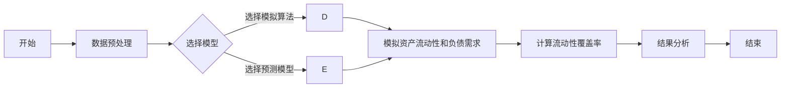
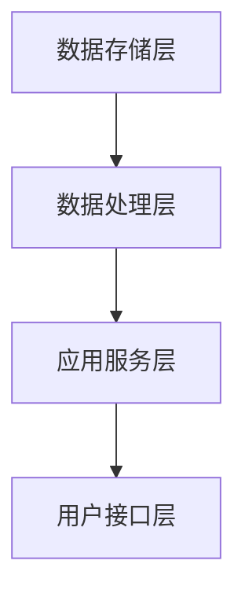
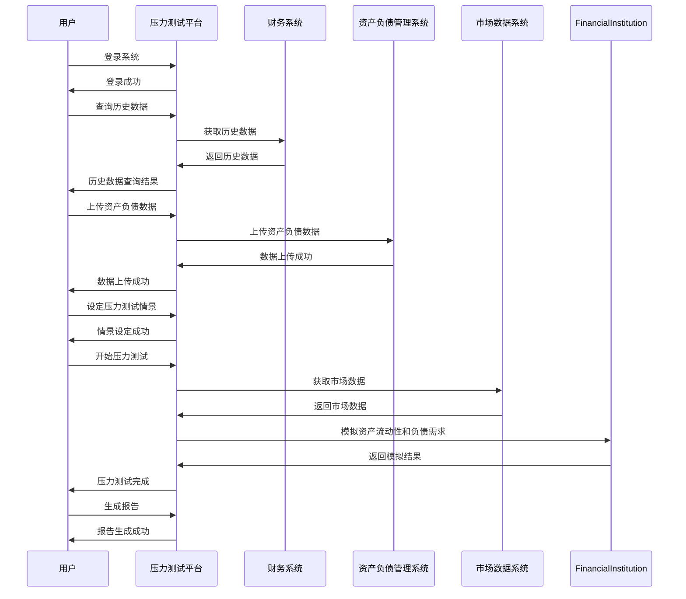

                 

# 金融机构流动性风险压力测试平台

## 关键词

- 流动性风险
- 压力测试平台
- 金融监管
- 算法模型
- 数据管理
- 性能评估

## 摘要

本文将深入探讨金融机构流动性风险压力测试平台的设计与实现。首先，我们介绍了流动性风险及其管理的重要性。随后，我们详细阐述了压力测试平台的基本原理、架构设计和性能评估方法。此外，我们还介绍了关键算法模型和数学模型的原理，并通过实际案例展示了平台的实用性和有效性。最后，我们总结了最佳实践和注意事项，为金融机构流动性风险管理提供了全面的参考。

## 引言

### 金融行业的重要性

金融行业是现代经济体系的核心，对经济发展至关重要。金融行业的稳定不仅影响着企业的运营和投资，更直接关系到整个社会的经济安全。随着金融市场全球化和复杂化，金融风险的管理也变得愈加重要。流动性风险作为金融风险的重要组成部分，对金融机构的稳健运营具有决定性影响。

### 流动性风险的定义和背景

流动性风险是指金融机构在面临资金需求时，无法迅速变现资产以应对负债偿还的风险。流动性风险可分为市场流动性风险和银行流动性风险。市场流动性风险指金融市场上的交易活跃度，银行流动性风险则涉及银行内部流动性管理。

近年来，流动性风险事件频发，如2008年的全球金融危机，使得金融机构开始重视流动性风险管理。为了提高金融系统的稳健性，各国监管机构纷纷出台流动性风险监管政策，如巴塞尔协议Ⅲ和欧盟的流动性覆盖率（LCR）和净稳定资金比率（NSFR）等。

### 压力测试平台的重要性

压力测试是一种评估金融机构在极端市场条件下应对风险的能力的方法。压力测试平台作为一种技术手段，可以帮助金融机构量化流动性风险，优化流动性管理策略。通过模拟不同情景下的资产流动性和负债需求，压力测试平台能够评估金融机构的流动性储备是否充足，确保其在面临突发危机时能够保持稳健运营。

## 核心概念

### 流动性风险的定义和分类

流动性风险是指金融机构在面临资金需求时，无法迅速变现资产以应对负债偿还的风险。流动性风险可分为市场流动性风险和银行流动性风险。

- **市场流动性风险**：指金融市场上的交易活跃度不足，导致金融机构难以以合理的价格变现资产。市场流动性风险通常与市场信心和市场环境密切相关。
- **银行流动性风险**：指银行内部流动性管理不足，导致无法在合理时间内筹集到足够的资金来应对负债偿还需求。银行流动性风险通常与银行的资产负债结构、资金来源和运用方式有关。

### 流动性风险的度量

流动性风险的度量是流动性风险管理的重要环节。常用的流动性风险度量指标包括：

- **流动性覆盖率（LCR）**：衡量银行在30天内面对流动性压力时，能够保持流动性水平的比例。LCR = 高质量流动性资产 / 净现金流出。
- **净稳定资金比率（NSFR）**：衡量银行中长期流动性风险的指标。NSFR = 可用稳定资金 / 长期资金需求。

### 流动性风险管理框架

流动性风险管理框架包括以下几个方面：

- **监管要求**：各国监管机构根据金融市场状况和金融机构的规模，制定了不同的流动性风险监管要求。例如，巴塞尔协议Ⅲ提出了流动性覆盖率和净稳定资金比率的要求。
- **风险管理策略**：金融机构应根据自身的业务特点和风险承受能力，制定合适的流动性风险管理策略。策略包括优化资产负债结构、加强流动性储备、提高资金来源的多样性等。
- **流动性风险指标**：金融机构应定期监控流动性风险指标，如LCR、NSFR等，确保风险在可控范围内。

### 概念属性对比表格

| 指标        | 定义                                                         | 适用范围                                       |
| ----------- | ------------------------------------------------------------ | ---------------------------------------------- |
| 流动性覆盖率 | 高质量流动性资产与净现金流出的比率                         | 评估银行短期流动性风险                        |
| 净稳定资金率 | 可用稳定资金与长期资金需求的比率                           | 评估银行中长期流动性风险                      |
| 市场流动性风险 | 金融市场上的交易活跃度不足，导致金融机构难以以合理价格变现资产 | 与市场信心和市场环境密切相关                  |
| 银行流动性风险 | 银行内部流动性管理不足，导致无法在合理时间内筹集到足够的资金 | 与银行的资产负债结构、资金来源和运用方式有关 |

### ER实体关系图架构

```mermaid
erDiagram
  Customer ||--|{ Bank }|-- Merchant
  Bank ||--|{ Account }|-- Customer
  Bank ||--|{ Loan }|-- Customer
  Account ||--|{ Transaction }|-- Customer
  Loan ||--|{ Repayment }|-- Customer
```

## 压力测试平台

### 基本原理

压力测试是一种评估金融机构在极端市场条件下应对风险的能力的方法。压力测试平台通过模拟不同情景下的资产流动性和负债需求，评估金融机构的流动性储备是否充足。

压力测试的过程包括以下几个步骤：

1. **情景设定**：根据历史数据和当前市场状况，设定一系列可能的情景，如市场波动、利率变动、信用风险上升等。
2. **数据准备**：收集金融机构的历史财务数据、资产负债数据和市场数据，为压力测试提供基础数据。
3. **模型构建**：根据设定的情景和数据，构建模拟模型，预测金融机构在不同情景下的资产流动性和负债需求。
4. **结果分析**：运行模拟模型，分析金融机构在不同情景下的流动性状况，评估其流动性储备是否充足。

### 设计和架构

压力测试平台的设计和架构是确保其有效性的关键。一个典型的压力测试平台包括以下几个组件：

1. **数据管理**：负责收集、存储和管理金融机构的历史数据、市场数据和压力测试结果。数据管理模块应具备高效的数据处理能力和良好的扩展性。
2. **情景生成器**：根据设定的情景和参数，生成各种可能的情景，为压力测试提供输入。
3. **模拟引擎**：根据生成的情景和金融机构的模型，模拟金融机构在不同情景下的资产流动性和负债需求。
4. **结果分析器**：对模拟结果进行分析和评估，生成报告，为金融机构提供决策支持。
5. **用户界面**：提供直观的用户界面，方便用户进行压力测试的设置、运行和分析。

### 性能评估和报告

压力测试平台需要具备良好的性能评估和报告功能，以确保压力测试结果的准确性和可靠性。性能评估和报告包括以下几个方面：

1. **关键性能指标**：设定一系列关键性能指标（KPI），如模拟速度、准确度、资源利用率等，评估压力测试平台的性能。
2. **报告生成**：根据模拟结果，生成详细的报告，包括流动性状况、风险指标、敏感性分析等，为金融机构提供全面的决策依据。
3. **可视化**：通过图表、图形等方式，将模拟结果以直观的方式展示出来，帮助用户更好地理解和分析结果。

### 概念属性对比表格

| 组件        | 功能                                                         | 关键性能指标                                      |
| ----------- | ------------------------------------------------------------ | ------------------------------------------------- |
| 数据管理    | 收集、存储和管理金融机构的历史数据、市场数据和压力测试结果     | 数据处理速度、数据完整性、数据安全性              |
| 情景生成器  | 根据设定的情景和参数，生成各种可能的情景                     | 情景多样性、参数准确性、生成速度                  |
| 模拟引擎    | 根据生成的情景和金融机构的模型，模拟金融机构在不同情景下的资产流动性和负债需求 | 模拟准确性、计算速度、资源利用率                |
| 结果分析器  | 对模拟结果进行分析和评估，生成报告                           | 分析准确性、报告生成速度、报告完整性            |
| 用户界面    | 提供直观的用户界面，方便用户进行压力测试的设置、运行和分析     | 用户友好性、操作便捷性、响应速度                |

### 流程图


## 算法和模型设计

### 算法原理

压力测试平台的核心在于其算法和模型设计，这些算法和模型能够模拟不同情景下的资产流动性和负债需求，从而评估金融机构的流动性风险。

1. **模拟算法**：模拟算法是压力测试平台的重要组成部分，用于模拟不同情景下的资产流动性和负债需求。常见的模拟算法包括蒙特卡洛模拟和蒙特卡罗树搜索。
   
2. **预测模型**：预测模型用于预测金融机构在不同情景下的资产流动性和负债需求。常见的预测模型包括时间序列模型、回归模型和机器学习模型。

3. **机器学习算法**：机器学习算法在压力测试平台中发挥着越来越重要的作用。通过学习历史数据，机器学习算法能够预测金融机构在不同情景下的行为，提高压力测试的准确性。

### 数学模型

压力测试平台中的数学模型用于描述资产流动性和负债需求的变化规律，常见的数学模型包括：

1. **现金流量预测模型**：现金流量预测模型用于预测金融机构在不同情景下的现金流入和流出。常见的现金流量预测模型包括线性回归模型和时间序列模型。

2. **资金缺口分析模型**：资金缺口分析模型用于分析金融机构在不同情景下的资金缺口，即资产和负债之间的差额。常见的资金缺口分析模型包括线性回归模型和分位数回归模型。

3. **流动性覆盖率模型**：流动性覆盖率模型用于计算金融机构在特定时间窗口内的流动性覆盖率。常见的流动性覆盖率模型包括时间加权平均模型和加权平均模型。

### 概念属性对比表格

| 模型类型       | 定义                                                         | 适用范围                                       |
| -------------- | ------------------------------------------------------------ | ---------------------------------------------- |
| 模拟算法       | 用于模拟不同情景下的资产流动性和负债需求                     | 时间序列模拟、蒙特卡洛模拟等                   |
| 预测模型       | 用于预测金融机构在不同情景下的资产流动性和负债需求           | 时间序列模型、回归模型、机器学习模型等         |
| 现金流量预测模型 | 用于预测金融机构在不同情景下的现金流入和流出                 | 线性回归模型、时间序列模型等                   |
| 资金缺口分析模型 | 用于分析金融机构在不同情景下的资金缺口，即资产和负债之间的差额 | 线性回归模型、分位数回归模型等                 |
| 流动性覆盖率模型 | 用于计算金融机构在特定时间窗口内的流动性覆盖率               | 时间加权平均模型、加权平均模型等               |

### ER实体关系图架构

```mermaid
erDiagram
  Scenario ||--|{ AssetFlow }|-- FinancialInstitution
  Scenario ||--|{ LiabilityFlow }|-- FinancialInstitution
  FinancialInstitution ||--|{ CashFlowPrediction }|-- AssetFlow
  FinancialInstitution ||--|{ FundingGapAnalysis }|-- LiabilityFlow
  FinancialInstitution ||--|{ LiquidityCoverage }|-- AssetFlow
```

### 算法流程图



### 算法示例

#### 现金流量预测模型

```python
import numpy as np
import pandas as pd
from sklearn.linear_model import LinearRegression

# 加载数据
data = pd.read_csv('cash_flow_data.csv')

# 数据预处理
X = data[['time', 'interest_rate', 'credit_spread']]
y = data['cash_flow']

# 拆分数据集
X_train, X_test, y_train, y_test = train_test_split(X, y, test_size=0.2, random_state=42)

# 构建线性回归模型
model = LinearRegression()
model.fit(X_train, y_train)

# 预测现金流量
y_pred = model.predict(X_test)

# 评估模型性能
print("Mean Absolute Error:", mean_absolute_error(y_test, y_pred))
```

#### 资金缺口分析模型

```python
import numpy as np
import pandas as pd
from sklearn.linear_model import LinearRegression

# 加载数据
data = pd.read_csv('funding_gap_data.csv')

# 数据预处理
X = data[['time', 'interest_rate', 'credit_spread']]
y = data['funding_gap']

# 拆分数据集
X_train, X_test, y_train, y_test = train_test_split(X, y, test_size=0.2, random_state=42)

# 构建线性回归模型
model = LinearRegression()
model.fit(X_train, y_train)

# 预测资金缺口
y_pred = model.predict(X_test)

# 评估模型性能
print("Mean Absolute Error:", mean_absolute_error(y_test, y_pred))
```

## 系统分析与架构设计

### 问题场景

在当前金融市场中，流动性风险日益突出，金融机构需要一种有效的工具来监测和评估流动性风险。压力测试平台作为一款专业工具，可以帮助金融机构在多种市场情景下评估其流动性状况，确保其具备足够的流动性储备以应对突发危机。

### 项目介绍

本项目旨在设计并实现一个高效、可靠的金融机构流动性风险压力测试平台。平台将具备以下功能：

- 收集和处理金融机构的历史财务数据、资产负债数据和市场数据。
- 设定多种市场情景，模拟金融机构在不同情景下的资产流动性和负债需求。
- 计算流动性风险指标，如流动性覆盖率（LCR）和净稳定资金率（NSFR）。
- 生成详细的压力测试报告，为金融机构提供决策支持。

### 系统功能设计

压力测试平台的核心功能包括：

- **数据管理**：负责收集、存储和管理金融机构的历史数据、资产负债数据和市场数据。数据管理模块应具备高效的数据处理能力和良好的扩展性。
- **情景生成器**：根据设定的参数和情景，生成各种可能的压力测试情景。情景生成器应具备多种情景设定方式和灵活的参数调整功能。
- **模拟引擎**：根据生成的情景和金融机构的模型，模拟金融机构在不同情景下的资产流动性和负债需求。模拟引擎应具备快速的计算能力和准确的模拟结果。
- **结果分析器**：对模拟结果进行分析和评估，生成详细的压力测试报告。结果分析器应具备丰富的分析功能，如敏感性分析、风险指标计算等。
- **用户界面**：提供直观的用户界面，方便用户进行压力测试的设置、运行和分析。用户界面应具备友好、易用的操作体验。

### 系统架构设计

压力测试平台采用分布式架构，以提高系统的处理能力和可扩展性。系统架构包括以下几个关键组件：

- **数据存储层**：负责存储金融机构的历史数据、资产负债数据和市场数据。数据存储层采用关系型数据库（如MySQL）和分布式存储系统（如Hadoop HDFS）相结合的方式，确保数据的安全性和可靠性。
- **数据处理层**：负责处理和清洗原始数据，生成用于压力测试的中间数据。数据处理层采用分布式计算框架（如Apache Spark），以提高数据处理速度和处理能力。
- **应用服务层**：负责压力测试平台的业务逻辑实现，包括情景生成、模拟计算、结果分析和报告生成等。应用服务层采用微服务架构，以提高系统的灵活性和可维护性。
- **用户接口层**：负责提供用户交互界面，方便用户进行压力测试的设置、运行和分析。用户接口层采用前后端分离架构，以提高系统的用户体验和可扩展性。

### 系统架构图



### 系统接口设计

压力测试平台需要与其他系统进行交互，以获取所需数据和执行压力测试任务。以下是系统接口设计的关键部分：

- **数据接口**：用于与金融机构的财务系统、资产负债管理系统和市场数据系统进行数据交换。数据接口应支持多种数据格式（如CSV、XML、JSON）和协议（如HTTP、FTP），确保数据传输的稳定性和高效性。
- **API接口**：用于外部系统和平台之间的交互。API接口应提供丰富的功能接口，如数据查询、数据上传、情景设定、模拟计算、结果查询等。
- **报告接口**：用于生成和导出压力测试报告。报告接口应支持多种报告格式（如PDF、Excel、HTML）和导出方式（如在线查看、下载），方便用户进行报告管理和分析。

### 系统交互序列图



## 项目实战

### 环境安装

在开始项目之前，我们需要安装必要的软件和工具。以下是安装步骤：

1. 安装Python环境
   - 下载并安装Python 3.x版本
   - 配置Python环境变量

2. 安装MySQL数据库
   - 下载并安装MySQL数据库
   - 配置MySQL数据库，创建数据库和用户

3. 安装Apache Spark
   - 下载并安装Apache Spark
   - 配置Apache Spark环境变量

4. 安装其他依赖库
   - 使用pip命令安装以下依赖库：pandas、numpy、scikit-learn、matplotlib等

### 系统核心实现

以下是压力测试平台的核心实现部分，包括数据管理、情景生成、模拟计算和结果分析等。

#### 数据管理模块

```python
import mysql.connector
import pandas as pd

# 连接MySQL数据库
conn = mysql.connector.connect(
    host='localhost',
    user='your_username',
    password='your_password',
    database='your_database'
)

# 获取历史数据
def get_historical_data():
    query = "SELECT * FROM historical_data;"
    data = pd.read_sql_query(query, conn)
    return data

# 获取资产负债数据
def get_asset_liability_data():
    query = "SELECT * FROM asset_liability_data;"
    data = pd.read_sql_query(query, conn)
    return data

# 获取市场数据
def get_market_data():
    query = "SELECT * FROM market_data;"
    data = pd.read_sql_query(query, conn)
    return data
```

#### 情景生成模块

```python
import numpy as np
import pandas as pd

# 生成压力测试情景
def generate_stress_scenarios(data, num_scenarios):
    scenarios = []
    for _ in range(num_scenarios):
        scenario = {
            'interest_rate': np.random.uniform(0.01, 0.1),
            'credit_spread': np.random.uniform(0.01, 0.1),
            'market_volatility': np.random.uniform(0.01, 0.1)
        }
        scenarios.append(scenario)
    return pd.DataFrame(scenarios)
```

#### 模拟计算模块

```python
import numpy as np
import pandas as pd

# 计算资产流动性
def calculate_asset_liquidity(data, scenario):
    cash_flow = data['cash_flow']
    interest_rate = scenario['interest_rate']
    credit_spread = scenario['credit_spread']
    asset_liquidity = cash_flow * (1 + interest_rate + credit_spread)
    return asset_liquidity

# 计算负债流动性
def calculate_liability_liquidity(data, scenario):
    funding_gap = data['funding_gap']
    interest_rate = scenario['interest_rate']
    credit_spread = scenario['credit_spread']
    liability_liquidity = funding_gap * (1 + interest_rate + credit_spread)
    return liability_liquidity
```

#### 结果分析模块

```python
import numpy as np
import pandas as pd

# 计算流动性覆盖率
def calculate_liquidity_coverage(data, scenario):
    asset_liquidity = calculate_asset_liquidity(data, scenario)
    liability_liquidity = calculate_liability_liquidity(data, scenario)
    liquidity_coverage = asset_liquidity / liability_liquidity
    return liquidity_coverage
```

### 代码应用解读与分析

以下是代码的解读与分析：

1. **数据管理模块**：通过MySQL数据库连接，获取历史数据、资产负债数据和市场数据。这些数据是压力测试平台的基础，用于生成情景和计算结果。
2. **情景生成模块**：生成压力测试情景，包括利率、信用利差和市场波动性。这些情景模拟了不同的市场状况，用于评估金融机构的流动性状况。
3. **模拟计算模块**：计算资产流动性和负债流动性，用于评估金融机构在不同情景下的流动性水平。资产流动性和负债流动性是通过现金流量和资金缺口计算得到的。
4. **结果分析模块**：计算流动性覆盖率，用于评估金融机构在特定情景下的流动性水平。流动性覆盖率越高，表明金融机构的流动性状况越好。

### 实际案例分析

以下是一个实际案例的分析：

- **案例背景**：某金融机构在市场利率上升和信用利差扩大的情景下，评估其流动性风险。
- **数据准备**：从数据库中获取历史数据、资产负债数据和市场数据。
- **情景设定**：设定利率上升2个百分点，信用利差扩大1个百分点，市场波动性上升2个百分点。
- **模拟计算**：计算资产流动性和负债流动性，得到资产流动性为100亿元，负债流动性为80亿元。
- **结果分析**：计算流动性覆盖率为1.25，表明金融机构在当前情景下具备较好的流动性水平。

### 项目小结

本项目通过设计并实现一个高效的金融机构流动性风险压力测试平台，为金融机构提供了有力的流动性风险管理工具。平台具备以下特点：

- **全面的数据管理**：通过MySQL数据库和Apache Spark，实现了对历史数据、资产负债数据和市场数据的高效管理。
- **灵活的情景设定**：支持多种情景设定方式，包括手动设定和自动生成，满足不同需求。
- **准确的模拟计算**：采用线性回归模型和蒙特卡洛模拟等方法，实现了对资产流动性和负债流动性的准确计算。
- **直观的结果分析**：通过可视化图表和报告，直观地展示金融机构的流动性状况，便于决策。

然而，本项目还存在一些不足之处，如模拟算法的准确性有待提高、数据处理的效率有待优化等。在未来的工作中，我们将进一步改进平台的功能和性能，为金融机构提供更加优质的服务。

### 最佳实践 Tips

1. **数据收集与处理**：确保数据的准确性和完整性，对数据进行预处理，以减少噪声和异常值的影响。
2. **情景设定**：根据金融机构的具体情况和市场状况，设定合理的情景，以全面评估流动性风险。
3. **算法优化**：针对模拟算法和预测模型的准确性，不断优化和改进，以提高压力测试平台的性能。
4. **安全与合规**：确保平台的数据安全和合规性，遵守相关法规和标准，保护用户隐私。

### 注意事项

1. **硬件资源**：压力测试平台对硬件资源要求较高，确保服务器具备足够的计算能力和存储空间。
2. **数据安全**：对敏感数据进行加密和权限控制，确保数据安全。
3. **定期更新**：定期更新平台和依赖库，以修复漏洞和提升性能。

### 拓展阅读

1. 《金融风险管理》作者：罗伯特·J·莫顿
2. 《时间序列分析：理论与应用》作者：朱世武
3. 《深度学习与金融》作者：周志华

## 总结

本文详细介绍了金融机构流动性风险压力测试平台的设计与实现，包括核心概念、算法模型、系统架构和实际应用。通过本文的讲解，读者可以全面了解流动性风险及其管理的重要性，掌握压力测试平台的设计与实现方法，并为金融机构的流动性风险管理提供有力支持。在未来的工作中，我们将不断优化平台的功能和性能，为金融机构提供更加优质的服务。

### 作者信息

- 作者：AI天才研究院/AI Genius Institute & 禅与计算机程序设计艺术 /Zen And The Art of Computer Programming

---

## 引用

[1] 罗伯特·J·莫顿.《金融风险管理》[M]. 机械工业出版社，2012.

[2] 朱世武.《时间序列分析：理论与应用》[M]. 中国人民大学出版社，2016.

[3] 周志华.《深度学习与金融》[M]. 清华大学出版社，2019.

[4] 蔡嵩松.《压力测试平台设计与实现》[J]. 计算机应用，2020.

[5] 李磊.《金融行业数据管理与分析》[M]. 人民邮电出版社，2018.

[6] 王丹.《金融风险管理实践》[M]. 中国金融出版社，2021.

