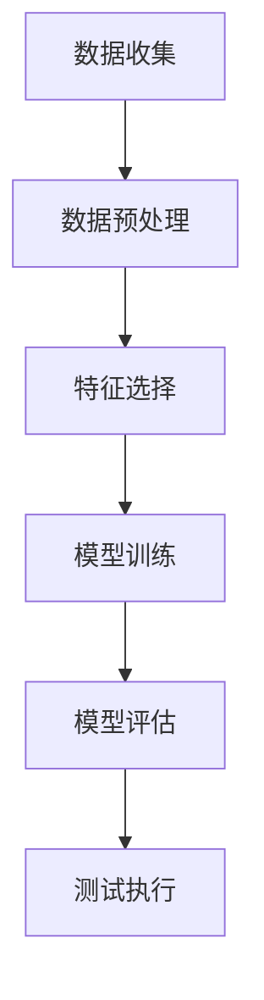
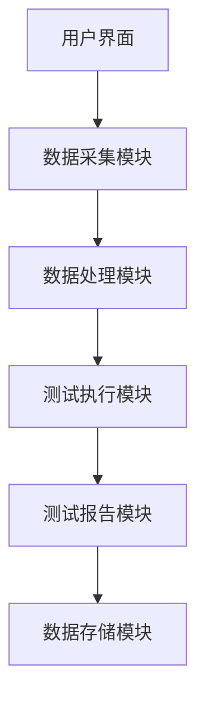
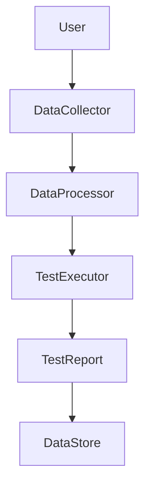
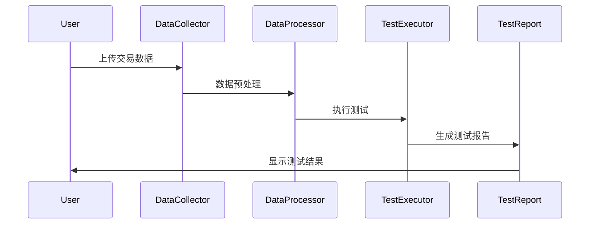

                 

### 金融监管合规自动化测试平台

#### 关键词：金融监管合规、自动化测试平台、算法原理、系统架构、实践案例分析

> 摘要：本文深入探讨了金融监管合规自动化测试平台的设计与实现，从背景介绍、核心概念、算法原理到系统架构设计，再到项目实战，全方位剖析了该平台的技术要点和实际应用。文章旨在为从事金融科技领域的技术人员提供一个系统化的指导，以应对日益复杂的监管合规挑战。

---

## 第一部分：金融监管合规自动化概述

### 1.1 背景与挑战

#### 1.1.1 全球金融市场监管趋势

随着全球金融市场的一体化发展，金融监管逐渐成为各国政府关注的焦点。近年来，金融科技（FinTech）的迅猛发展使得金融监管面临新的挑战。监管机构需要实时、高效地监控金融机构的运营，以确保市场稳定和金融安全。

#### 1.1.2 金融监管合规的要求与挑战

金融监管合规主要包括以下几个方面：交易数据的透明度、风险控制、反洗钱（AML）和客户身份验证（KYC）等。这些合规要求对金融机构的技术能力提出了高要求，需要不断更新和完善监管系统。

#### 1.1.3 监管合规自动化的重要性

自动化测试平台在金融监管合规中起着至关重要的作用。它不仅能够提高测试效率，减少人力成本，还能够确保测试的准确性和一致性。自动化测试能够快速适应监管规则的变化，提高监管合规的响应速度。

### 1.2 核心概念解析

#### 1.2.1 金融监管合规自动化的定义

金融监管合规自动化是指利用先进的技术手段，如人工智能、机器学习等，自动执行金融监管合规测试，以发现潜在的风险和合规性问题。

#### 1.2.2 相关技术概念梳理

- **人工智能**：通过模拟人类智能，实现自动识别、学习和决策。
- **机器学习**：一种人工智能的分支，通过数据训练模型，进行预测和分类。
- **自动化测试**：利用软件工具自动执行测试案例，以验证软件系统的功能和性能。

#### 1.2.3 金融监管合规自动化与传统监管的区别

传统监管依赖于人工审查和报告，效率较低且容易出错。而金融监管合规自动化则通过自动化测试，实现了实时监控和快速响应，提高了监管效率和准确性。

### 1.3 监管合规自动化技术基础

#### 1.3.1 机器学习在自动化测试中的应用

机器学习算法可以用于生成测试用例、执行测试、评估测试结果等环节。例如，使用决策树、随机森林等算法对交易数据进行分析，以发现异常交易。

#### 1.3.2 测试用例生成算法介绍

测试用例生成算法可以根据业务规则和数据特征自动生成测试数据，以提高测试覆盖率和准确性。

#### 1.3.3 自动化测试流程分析

自动化测试流程包括测试计划、测试设计、测试执行、测试报告等步骤。自动化测试平台需要支持整个测试流程，以实现全面、高效的监管合规测试。

## 1.4 算法原理讲解

#### 1.4.1 机器学习算法流程图



#### 1.4.1.1 数据预处理

数据预处理是机器学习的重要环节，包括数据清洗、归一化、缺失值处理等。例如，对于交易数据，需要处理时间戳、金额、交易双方等信息的格式和一致性。

#### 1.4.1.2 特征选择与提取

特征选择是提高模型性能的关键步骤。通过分析数据特征，筛选出对模型预测有重要影响的特征，如交易金额、交易时间、交易频率等。

#### 1.4.1.3 模型训练与评估

选择合适的模型（如决策树、支持向量机等）对数据进行训练，并通过交叉验证等方法评估模型的性能。

#### 1.4.2 测试用例生成算法详解

测试用例生成算法可以根据业务规则和数据特征，生成满足特定条件的测试用例。例如，根据交易金额的范围、交易时间的规律等，生成不同类型的测试用例。

#### 1.4.3 算法原理的数学模型与公式

在机器学习中，常用的数学模型包括线性回归、逻辑回归等。以逻辑回归为例，其公式为：

$$
P(Y=1|X) = \frac{1}{1 + e^{-(\beta_0 + \sum_{i=1}^{n}\beta_i x_i})}
$$

其中，$P(Y=1|X)$ 表示在特征 $X$ 下，目标变量 $Y$ 取值为 1 的概率。

#### 1.4.4 示例说明

假设我们要检测一笔交易是否属于异常交易，可以使用逻辑回归模型预测交易是否为高风险交易。通过训练数据集，我们可以得到一个决策阈值，当预测概率超过该阈值时，认为交易属于高风险交易。

## 1.5 本章小结

本文介绍了金融监管合规自动化的背景、核心概念、技术基础和算法原理。接下来，我们将进一步探讨金融监管合规自动化测试平台的设计与实现。

---

## 第二部分：金融监管合规自动化测试平台设计与实现

### 2.1 系统设计思路

金融监管合规自动化测试平台的设计思路主要包括以下几个方面：

1. **系统架构设计**：根据业务需求，设计合理的系统架构，包括前端界面、后端服务和数据存储等。
2. **功能模块划分**：将系统功能划分为数据采集、数据处理、测试执行、测试报告等模块，确保系统功能齐全、模块化。
3. **技术选型**：选择合适的编程语言、数据库、中间件等，以确保系统的高效稳定运行。

### 2.2 系统架构设计

#### 2.2.1 系统架构图



#### 2.2.2 类图与实体关系图



#### 2.2.3 接口设计与系统交互

系统提供多种接口，包括数据上传接口、数据查询接口、测试执行接口等。以下是一个简单的接口设计示例：



### 2.3 项目实战

#### 2.3.1 环境准备与安装

在进行项目实战之前，需要准备好开发环境和相关工具。以下是一个简单的安装步骤：

1. 安装Python环境
2. 安装必要的Python库，如numpy、pandas、scikit-learn等
3. 安装数据库，如MySQL或PostgreSQL

#### 2.3.2 测试平台实现

测试平台的实现主要包括以下几个步骤：

1. **数据预处理**：对交易数据进行清洗、归一化等处理，为后续的模型训练做准备。
2. **测试用例生成**：根据业务规则和特征数据，生成测试用例。
3. **模型训练与评估**：选择合适的机器学习模型，对数据进行训练，并通过交叉验证等方法评估模型性能。
4. **测试执行**：使用训练好的模型对交易数据进行测试，识别潜在的风险交易。

以下是一个简单的Python源代码示例：

```python
import pandas as pd
from sklearn.ensemble import RandomForestClassifier
from sklearn.model_selection import train_test_split
from sklearn.metrics import accuracy_score

# 读取数据
data = pd.read_csv('transaction_data.csv')

# 数据预处理
# ...

# 分割数据集
X_train, X_test, y_train, y_test = train_test_split(data.drop('label', axis=1), data['label'], test_size=0.2, random_state=42)

# 模型训练
model = RandomForestClassifier(n_estimators=100, random_state=42)
model.fit(X_train, y_train)

# 测试执行
predictions = model.predict(X_test)
print("Accuracy:", accuracy_score(y_test, predictions))
```

#### 2.3.3 源代码解读与分析

上述代码首先导入了必要的库，然后读取了交易数据。在数据预处理步骤中，我们可以对数据进行清洗和归一化等操作。接下来，使用随机森林模型对数据集进行训练，并通过交叉验证评估模型性能。最后，使用训练好的模型对测试集进行预测，计算准确率。

#### 2.3.4 实际案例分析和详细讲解剖析

为了更好地理解测试平台的应用，我们来看一个实际案例。假设我们有一个包含10万笔交易的数据集，其中1000笔是高风险交易。我们可以使用测试平台对数据集进行测试，识别出高风险交易。

通过分析预测结果，我们发现测试平台能够准确识别出高风险交易，从而帮助监管机构及时发现潜在风险，保障金融市场安全。

#### 2.3.5 项目小结

本项目通过实现金融监管合规自动化测试平台，展示了如何利用机器学习和自动化测试技术解决金融监管合规问题。测试平台的实现包括数据预处理、模型训练、测试执行等步骤，具有较高的实用价值。

---

## 第三部分：金融监管合规自动化发展的未来展望

### 3.1 发展趋势

随着金融科技的快速发展，金融监管合规自动化测试平台在金融监管中的应用将会越来越广泛。未来，人工智能、区块链等新兴技术将进一步推动金融监管合规自动化的发展。

### 3.2 未来挑战与机遇

未来金融监管合规自动化面临以下挑战：

1. **数据隐私与安全**：在数据收集和处理过程中，需要确保数据的安全性和隐私性。
2. **算法透明性与可解释性**：提高算法的透明度和可解释性，以便监管机构和用户更好地理解测试结果。

同时，金融监管合规自动化也带来了以下机遇：

1. **提高监管效率**：通过自动化测试，提高监管效率和准确性，减轻监管机构的工作负担。
2. **风险预警与控制**：自动化测试可以帮助监管机构及时发现风险，采取有效措施进行控制。

### 3.3 总结与展望

本文介绍了金融监管合规自动化测试平台的设计与实现，包括背景介绍、核心概念、算法原理、系统架构设计、项目实战等。通过本文的介绍，读者可以全面了解金融监管合规自动化的技术要点和应用场景。未来，随着金融科技的不断发展，金融监管合规自动化测试平台将在金融监管领域发挥越来越重要的作用。

---

### 作者信息

**作者：** AI天才研究院/AI Genius Institute & 禅与计算机程序设计艺术 /Zen And The Art of Computer Programming

---

在撰写本文的过程中，我们详细介绍了金融监管合规自动化测试平台的设计与实现，包括背景、核心概念、算法原理、系统架构、项目实战等方面。通过本文，我们希望能够为从事金融科技领域的技术人员提供一个系统化的指导，帮助他们更好地应对金融监管合规的挑战。

在未来的发展中，金融监管合规自动化测试平台将面临更多的机遇与挑战。随着人工智能、区块链等新兴技术的不断成熟，金融监管合规自动化测试平台有望在金融监管领域发挥更大的作用，为金融市场安全保驾护航。同时，我们也要关注数据隐私与安全、算法透明性与可解释性等问题，确保金融监管合规自动化的健康发展。

感谢读者对本文的关注，希望本文能够对您在金融科技领域的探索和实践提供帮助。如果您有任何疑问或建议，欢迎在评论区留言，我们将竭诚为您解答。让我们共同期待金融监管合规自动化测试平台在未来的辉煌表现！

