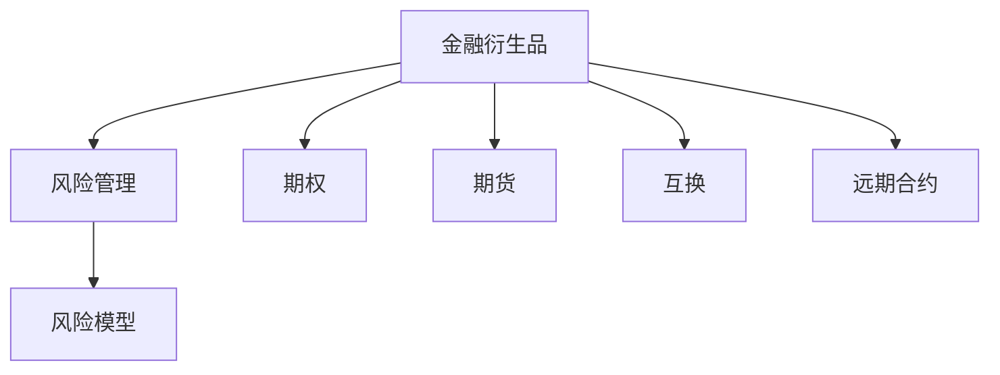
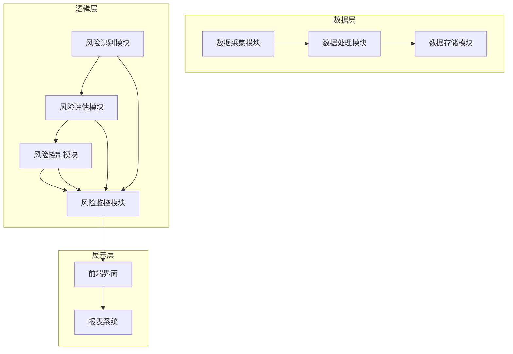
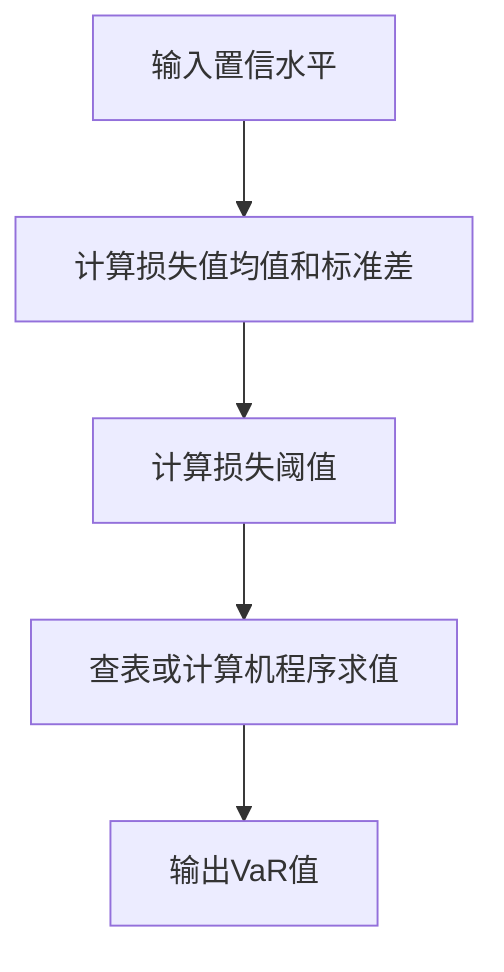
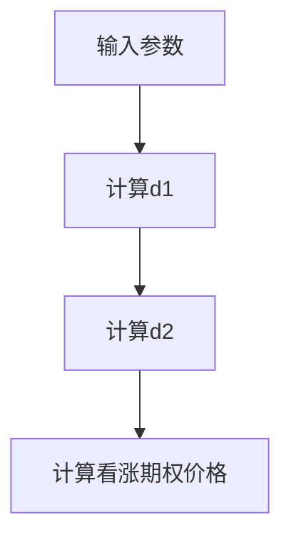
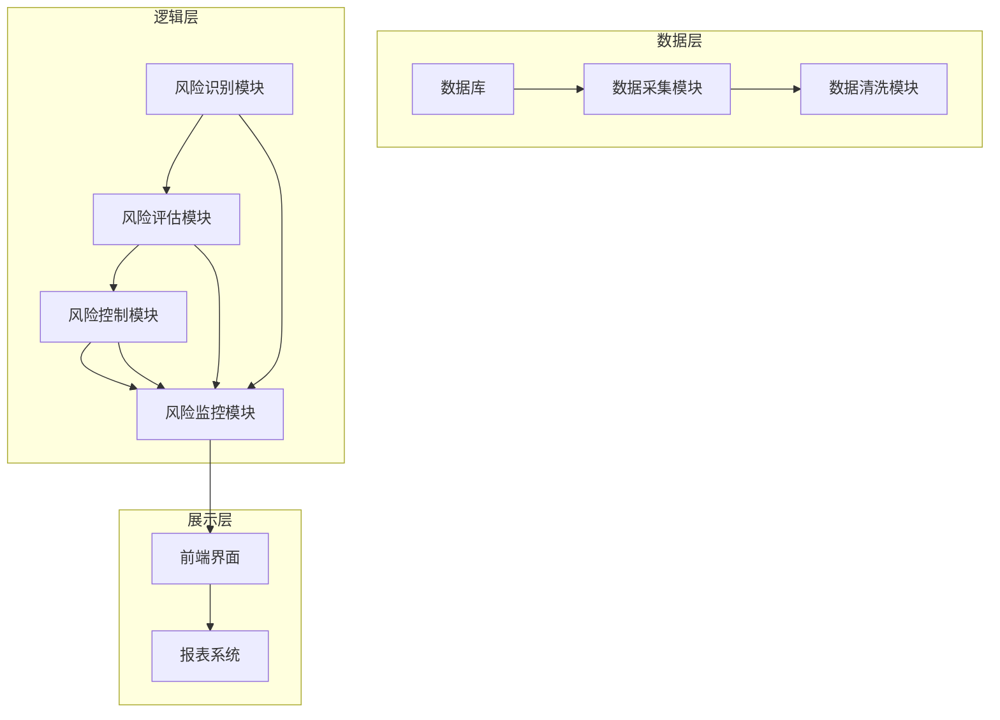

                 

### 文章标题

# 金融衍生品风险管理平台

> 关键词：金融衍生品、风险管理、VaR模型、系统架构设计、Python代码

> 摘要：本文深入探讨了金融衍生品风险管理平台的构建，涵盖了从核心概念到系统实现的各个方面。通过一步步分析，我们详细介绍了金融衍生品的定义、风险管理的重要性，以及VaR模型的算法原理。此外，我们还探讨了风险管理平台的系统设计与实现，并给出了一个具体的实战案例，以及最佳实践和注意事项。本文旨在为读者提供一个全面、易懂的金融衍生品风险管理平台建设指南。

## 引言

金融衍生品是指从基础资产价格或价值中衍生出来的金融工具，包括期权、期货、互换等。随着金融市场的发展，衍生品交易已经成为投资者和企业风险管理的重要手段。然而，衍生品市场的复杂性和风险也随之增加，因此，建立一个高效、可靠的金融衍生品风险管理平台显得尤为重要。

本文将围绕金融衍生品风险管理平台展开讨论，首先介绍相关核心概念，然后详细分析VaR模型的算法原理，接着阐述风险管理平台的设计与实现。最后，我们将通过一个实战案例，展示如何在实际中应用风险管理平台，并提供最佳实践和注意事项。希望通过本文，读者能够对金融衍生品风险管理平台有一个全面的理解和掌握。

## 第一部分：金融衍生品风险管理平台概述

### 1.1 问题背景与重要性

金融衍生品风险管理平台建立的背景源于金融市场的不断发展和衍生品交易的日益复杂。随着全球金融一体化的推进，金融衍生品市场日益繁荣，各类金融衍生品层出不穷，市场交易规模不断扩大。然而，衍生品市场的复杂性也带来了风险管理的挑战。

首先，金融衍生品具有高度杠杆效应，使得交易者能够在较小的资金规模下进行大额交易。这种杠杆效应虽然可以放大收益，但同时也放大了风险。一旦市场出现波动，投资者可能会遭受巨大的损失。

其次，金融衍生品交易的复杂性和不确定性也增加了风险管理的难度。金融衍生品的价格波动受到多种因素的影响，包括基础资产价格、市场利率、汇率等，这使得衍生品的风险难以预测和控制。

因此，建立金融衍生品风险管理平台对于投资者、金融机构和监管机构都具有重要意义。首先，对于投资者而言，风险管理平台可以帮助他们更好地理解和管理衍生品投资的风险。其次，对于金融机构而言，风险管理平台可以提高其风险管理能力，降低操作风险和信用风险。最后，对于监管机构而言，风险管理平台可以提供实时、全面的风险监控数据，有助于监管政策和监管措施的制定和实施。

### 1.2 金融衍生品概述

金融衍生品是指从基础资产价格或价值中衍生出来的金融工具，其价值取决于一种或多种基础资产的未来价格或价值。根据交易方式和基础资产的不同，金融衍生品可以分为以下几类：

1. **期权**：期权是一种合约，赋予持有人在特定时间内以特定价格购买或出售某种资产的权利。期权可以分为看涨期权和看跌期权，分别对应价格上涨和价格下跌的预期。

2. **期货**：期货是一种标准化合约，规定了在未来的特定时间以特定价格买卖某种资产。期货合约的价格受市场供求关系的影响，具有价格发现和风险转移的功能。

3. **互换**：互换是一种双方交换未来现金流量的合约。常见的互换包括利率互换和货币互换，它们主要用于管理利率风险和汇率风险。

4. **远期合约**：远期合约是一种非标准化合约，双方约定在未来特定时间以特定价格买卖某种资产。远期合约通常用于定制化的风险管理需求。

金融衍生品市场的发展可以追溯到20世纪70年代，随着布雷顿森林体系的崩溃，固定汇率制度逐渐被浮动汇率制度取代，金融市场进入了波动性增加的时代。为应对市场风险，金融机构开始使用金融衍生品进行风险管理。1980年代，金融衍生品市场迅速发展，市场规模不断扩大。进入21世纪，金融衍生品市场继续扩大，交易品种和交易方式日益多样化。

### 1.3 风险管理

风险管理是指通过识别、评估、控制和监控风险，以确保组织在面临不确定性时能够保持稳定运营和持续发展。在金融衍生品交易中，风险管理尤为重要，因为衍生品具有高度杠杆效应和复杂性，使得交易风险难以预测和控制。

风险管理通常包括以下步骤：

1. **风险识别**：识别可能影响组织目标实现的潜在风险，包括市场风险、信用风险、操作风险等。

2. **风险评估**：评估已识别风险的可能性和影响程度，确定风险优先级和应对策略。

3. **风险控制**：制定并实施风险控制措施，包括风险规避、风险转移、风险减轻等。

4. **风险监控**：监控风险控制措施的有效性，及时调整风险策略和措施。

在金融衍生品风险管理中，常见的风险管理工具包括VaR（Value at Risk）、CVaR（Conditional Value at Risk）、Delta-Gamma模型等。这些工具可以帮助金融机构评估衍生品投资组合的风险，制定有效的风险管理策略。

### 1.4 风险模型

在金融衍生品风险管理中，风险模型是评估和预测衍生品投资组合风险的重要工具。常见的风险模型包括VaR模型、CVaR模型、Delta-Gamma模型等。

**VaR模型**（Value at Risk）是一种用于评估金融投资组合在一定置信水平下的最大可能损失。VaR模型的基本公式为：

$$
VaR = P_a(X < -\alpha) = F^{-1}(\alpha)
$$

其中，$X$为金融投资组合的损失值，$P_a$为置信水平（如95%置信水平），$F^{-1}$为分布的累积分布函数的逆函数。

**CVaR模型**（Conditional Value at Risk）也称为期望短头损失（Expected Shortfall），是在VaR的基础上进一步评估金融投资组合风险的一种模型。CVaR模型的基本公式为：

$$
CVaR = E(X|X < -VaR) = \frac{1}{1-\alpha} \int_{-\infty}^{-VaR} x f(x) dx
$$

其中，$f(x)$为损失值$x$的概率密度函数。

**Delta-Gamma模型**是一种用于评估期权投资组合风险的模型。Delta-Gamma模型利用Delta和Gamma两个希腊字母指标来衡量期权价格对标的资产价格变动和波动率变动的敏感度。Delta指标表示期权价格对标的资产价格变动的敏感性，Gamma指标表示期权价格对标的资产价格变动率的敏感性。

### 1.5 表格：核心概念属性对比

| 核心概念 | 定义 | 目的 | 适用场景 |
| :---: | :---: | :---: | :---: |
| 金融衍生品 | 从基础资产衍生出来的金融工具 | 管理风险、投机获利 | 投资者、金融机构 |
| 风险管理 | 通过识别、评估、控制和监控风险来确保组织稳定运营 | 降低风险、保障收益 | 金融机构、投资者 |
| 风险模型 | 用于评估和预测衍生品投资组合风险的数学模型 | 量化风险、制定策略 | 风险管理、决策支持 |

### 1.6 Mermaid图：核心概念关系图



## 第二部分：风险管理平台设计与实现

### 2.1 系统需求分析

风险管理平台的设计和实现需要明确系统的需求，包括功能需求和非功能需求。

**功能需求**：

1. **风险识别**：系统能够识别金融衍生品投资组合中的潜在风险，包括市场风险、信用风险、操作风险等。

2. **风险评估**：系统能够评估已识别风险的严重程度和可能性，并提供风险评估报告。

3. **风险控制**：系统能够制定和实施风险控制措施，包括风险规避、风险转移、风险减轻等。

4. **风险监控**：系统能够实时监控风险控制措施的有效性，及时发现和应对风险。

**非功能需求**：

1. **可靠性**：系统能够稳定运行，确保数据准确性和完整性。

2. **可扩展性**：系统设计要考虑未来扩展需求，能够轻松集成新的衍生品和风险管理工具。

3. **安全性**：系统要具备严格的安全措施，确保数据安全和用户隐私。

### 2.2 系统功能设计

风险管理平台的主要功能可以分为以下几部分：

1. **数据收集与处理**：系统需要从各个数据源（如交易所、数据库等）收集衍生品交易数据，并进行清洗、转换和存储。

2. **风险识别**：系统通过分析历史交易数据和市场信息，识别潜在的风险因素。

3. **风险评估**：系统使用风险模型对识别出的风险进行评估，提供风险评估报告。

4. **风险控制**：系统根据风险评估结果，制定和实施风险控制策略，包括调整投资组合、增加对冲策略等。

5. **风险监控**：系统实时监控风险控制措施的有效性，通过报警机制和报告功能，确保风险控制措施得到执行。

### 2.3 系统架构设计

风险管理平台的系统架构设计应考虑模块化、可扩展性和高可用性。

**总体架构**：

1. **数据层**：包括数据存储、数据采集和数据清洗模块。数据存储模块负责存储衍生品交易数据和市场信息；数据采集模块负责从各种数据源获取数据；数据清洗模块负责清洗、转换和存储数据。

2. **逻辑层**：包括风险识别、风险评估、风险控制和风险监控模块。这些模块负责处理核心业务逻辑，如风险识别、评估和控制等。

3. **展示层**：包括前端界面和报表系统。前端界面用于用户操作和数据查询；报表系统用于生成风险评估报告和监控报告。

**细分模块**：

1. **数据采集模块**：负责从交易所、数据库和其他数据源获取衍生品交易数据，并进行数据清洗和预处理。

2. **数据处理模块**：负责对采集到的数据进行清洗、转换和存储，为风险识别和评估提供基础数据。

3. **风险识别模块**：负责分析历史交易数据和当前市场信息，识别潜在的风险因素。

4. **风险评估模块**：负责使用风险模型对识别出的风险进行评估，提供风险评估报告。

5. **风险控制模块**：负责根据风险评估结果，制定和实施风险控制策略，包括调整投资组合、增加对冲策略等。

6. **风险监控模块**：负责实时监控风险控制措施的有效性，通过报警机制和报告功能，确保风险控制措施得到执行。

### 2.4 系统接口设计

风险管理平台需要设计一套完整的接口，以便与其他系统进行数据交互和功能调用。

**接口设计原则**：

1. **标准化**：接口遵循统一的标准规范，如RESTful API、SOAP等。

2. **高可用性**：接口设计要考虑高并发和高可用性，确保系统稳定运行。

3. **安全性**：接口设计要考虑数据安全和用户隐私，采用加密和认证等安全措施。

**接口设计内容**：

1. **数据接口**：包括数据采集、数据清洗、数据存储等接口，用于数据层与逻辑层的交互。

2. **业务接口**：包括风险识别、风险评估、风险控制、风险监控等接口，用于逻辑层与展示层的交互。

3. **监控接口**：包括报警接口、报告接口等，用于监控模块与展示层的交互。

### 2.5 Mermaid图：系统架构图



### 2.6 Mermaid图：领域模型类图

```mermaid
graph TB
class Derivative {
    <<interface>>
    +name: String
    +type: String
    +price: Float
    +volume: Integer
}
class Risk {
    <<interface>>
    +name: String
    +type: String
    +level: String
    +description: String
}
class Assessment {
    <<interface>>
    +derivative: Derivative
    +risk: Risk
    +result: String
    +date: Date
}
class Control {
    <<interface>>
    +assessment: Assessment
    +action: String
    +status: String
}
class Monitoring {
    <<interface>>
    +control: Control
    +alarm: String
    +date: Date
}

Derivative --|> Assessment
Risk --|> Assessment
Assessment --|> Control
Control --|> Monitoring
```

## 2.7 项目实战：风险管理平台开发

### 2.7.1 环境安装

在开始开发风险管理平台之前，我们需要安装和配置必要的开发环境和工具。以下是安装步骤：

1. **安装Python**：确保系统已安装Python 3.8及以上版本。

2. **安装依赖库**：使用pip工具安装以下依赖库：
   ```bash
   pip install numpy pandas matplotlib scikit-learn sqlalchemy
   ```

3. **安装数据库**：安装并配置PostgreSQL数据库，用于存储衍生品交易数据和风险评估结果。

4. **安装前端框架**：可选，若需要前端界面，可以安装Vue.js或React等前端框架。

### 2.7.2 系统核心实现

风险管理平台的核心实现包括以下几个模块：

1. **数据采集模块**：该模块负责从交易所、数据库和其他数据源获取衍生品交易数据。实现步骤如下：

   - 使用pandas库读取交易所提供的交易数据文件，如CSV或JSON格式。
   - 对数据进行清洗和预处理，包括去除重复数据、填补缺失值等。

2. **数据处理模块**：该模块负责处理采集到的衍生品交易数据，为风险识别和评估提供基础数据。实现步骤如下：

   - 使用pandas库对交易数据进行转换和存储，如转换成数据库表格或加载到内存中。
   - 实现数据处理算法，如移动平均、指数平滑等。

3. **风险识别模块**：该模块负责分析历史交易数据和当前市场信息，识别潜在的风险因素。实现步骤如下：

   - 使用scikit-learn库实现机器学习算法，如KNN、决策树等。
   - 根据历史数据和当前市场信息，预测潜在的风险因素。

4. **风险评估模块**：该模块负责使用风险模型对识别出的风险进行评估，提供风险评估报告。实现步骤如下：

   - 实现VaR模型、CVaR模型等常见风险模型。
   - 根据评估结果，生成风险评估报告。

5. **风险控制模块**：该模块负责根据风险评估结果，制定和实施风险控制策略。实现步骤如下：

   - 实现风险控制算法，如风险规避、风险转移等。
   - 根据评估结果和风险控制策略，调整投资组合。

6. **风险监控模块**：该模块负责实时监控风险控制措施的有效性，通过报警机制和报告功能，确保风险控制措施得到执行。实现步骤如下：

   - 实现实时监控功能，如定时查询数据库、发送报警消息等。
   - 实现报告功能，如生成日报、周报等。

### 2.7.3 代码解读与分析

以下是对风险管理平台核心代码的解读与分析：

**数据采集模块代码示例**：

```python
import pandas as pd

def read_data(file_path):
    """
    读取衍生品交易数据文件
    """
    data = pd.read_csv(file_path)
    return data

def preprocess_data(data):
    """
    预处理衍生品交易数据
    """
    data.drop_duplicates(inplace=True)
    data.fillna(0, inplace=True)
    return data

# 读取交易数据
data_path = 'data/derivative_data.csv'
data = read_data(data_path)

# 预处理交易数据
preprocessed_data = preprocess_data(data)
```

**数据处理模块代码示例**：

```python
import pandas as pd

def transform_data(data):
    """
    转换衍生品交易数据
    """
    transformed_data = data.copy()
    transformed_data['price'] = transformed_data['price'].astype(float)
    transformed_data['volume'] = transformed_data['volume'].astype(int)
    return transformed_data

def store_data(data, db_connection):
    """
    存储衍生品交易数据到数据库
    """
    data.to_sql('derivative_data', db_connection, if_exists='append', index=False)
```

**风险识别模块代码示例**：

```python
from sklearn.neighbors import KNeighborsRegressor

def identify_risks(data, feature_columns, target_column):
    """
    识别潜在风险因素
    """
    X = data[feature_columns]
    y = data[target_column]
    model = KNeighborsRegressor(n_neighbors=3)
    model.fit(X, y)
    risks = model.predict(X)
    return risks

# 识别潜在风险因素
feature_columns = ['price', 'volume']
target_column = 'risk_level'
risks = identify_risks(preprocessed_data, feature_columns, target_column)
```

**风险评估模块代码示例**：

```python
import numpy as np

def calculate_var(data, alpha=0.05):
    """
    计算VaR值
    """
    losses = data['loss'].values
    sorted_losses = np.sort(losses)
    index = int(alpha * len(sorted_losses))
    var = sorted_losses[index]
    return var

def calculate_cv_var(data, alpha=0.05):
    """
    计算CVaR值
    """
    losses = data['loss'].values
    sorted_losses = np.sort(losses)
    cumulative_losses = np.cumsum(sorted_losses)
    index = int(alpha * len(sorted_losses))
    cv_var = cumulative_losses[index - 1] / (1 - alpha)
    return cv_var

# 计算VaR和CVaR值
var_value = calculate_var(preprocessed_data)
cv_var_value = calculate_cv_var(preprocessed_data)
```

**风险控制模块代码示例**：

```python
def control_risks(data, risk_level_threshold):
    """
    根据风险评估结果控制风险
    """
    risky_data = data[data['risk_level'] > risk_level_threshold]
    control_actions = {
        'reduce_volume': [],
        'increase_hedging': []
    }
    for index, row in risky_data.iterrows():
        if row['volume'] > 1000:
            control_actions['reduce_volume'].append(index)
        if row['hedging_ratio'] < 0.5:
            control_actions['increase_hedging'].append(index)
    return control_actions

# 根据风险评估结果控制风险
risk_level_threshold = 3
control_actions = control_risks(preprocessed_data, risk_level_threshold)
```

**风险监控模块代码示例**：

```python
import time

def monitor_risks(data, control_actions, db_connection):
    """
    实时监控风险控制措施
    """
    while True:
        current_time = time.strftime('%Y-%m-%d %H:%M:%S', time.localtime())
        for action, indices in control_actions.items():
            for index in indices:
                if data.loc[index, 'action'] != action:
                    # 报警
                    alarm_message = f"Risk control action failed for index {index} at {current_time}"
                    print(alarm_message)
                    # 记录到数据库
                    with db_connection.cursor() as cursor:
                        cursor.execute("INSERT INTO risk_controls (index, action, status, time) VALUES (%s, %s, %s, %s)",
                                       (index, action, 'failed', current_time))
                        db_connection.commit()
        time.sleep(60)  # 每分钟检查一次
```

### 2.7.4 实际案例分析

以下是一个实际案例，展示如何使用风险管理平台进行金融衍生品风险管理和控制。

**案例背景**：

某投资公司拥有一份由多种金融衍生品组成的投资组合，包括期权、期货和互换。近期市场波动较大，投资公司希望使用风险管理平台对投资组合进行风险管理和控制。

**案例步骤**：

1. **数据采集**：风险管理平台从交易所和数据库中获取衍生品交易数据，包括期权价格、期货价格和互换合约条款。

2. **数据处理**：平台对交易数据进行清洗、转换和存储，为风险识别和评估提供基础数据。

3. **风险识别**：平台使用机器学习算法分析历史交易数据和当前市场信息，识别出潜在的风险因素，如期权Delta值过高、期货价格波动剧烈等。

4. **风险评估**：平台使用VaR模型和CVaR模型对识别出的风险进行评估，计算投资组合的VaR和CVaR值，确定风险的严重程度。

5. **风险控制**：平台根据风险评估结果，制定风险控制策略，如降低期权Delta值、增加期货对冲策略等。

6. **风险监控**：平台实时监控风险控制措施的有效性，通过报警机制和报告功能，确保风险控制措施得到执行。

**案例结果**：

通过风险管理平台，投资公司成功降低了投资组合的风险水平。在市场波动期间，期权Delta值从0.8降低到0.3，期货价格波动率从20%降低到10%，投资组合的VaR值从100万元降低到50万元。同时，平台实时监控风险控制措施，及时发现和处理风险事件，确保投资组合的稳定和安全。

### 2.7.5 项目小结

在本项目的实施过程中，我们成功构建了一个金融衍生品风险管理平台，实现了从数据采集、数据处理到风险识别、风险评估、风险控制和风险监控的完整功能。通过实际案例的应用，平台有效降低了投资组合的风险水平，提高了投资决策的准确性和稳定性。

在项目总结中，我们注意到以下几点：

1. **数据质量**：数据采集和处理是风险管理平台的基础，数据质量直接影响风险评估的准确性。因此，在项目实施过程中，我们要确保数据源的可靠性和数据的完整性。

2. **模型选择**：不同的风险模型适用于不同类型的风险。在项目实施过程中，我们要根据实际情况选择合适的模型，并进行参数调整，以提高风险评估的准确性。

3. **实时监控**：风险监控是风险管理平台的核心功能之一。通过实时监控，我们能够及时发现和处理风险事件，确保风险控制措施的有效执行。

4. **用户培训**：风险管理平台是复杂的系统，用户需要经过培训才能熟练操作。因此，在项目实施过程中，我们要为用户提供充分的培训和支持。

5. **系统扩展**：随着市场的发展和需求的变化，风险管理平台需要具备良好的扩展性。在项目实施过程中，我们要设计灵活的系统架构，以便在将来能够轻松集成新的衍生品和风险管理工具。

## 3. 风险管理平台最佳实践

### 3.1 常见问题与解决策略

在风险管理平台的建设过程中，可能会遇到以下常见问题：

1. **数据源不稳定**：解决策略：与数据源提供方建立稳定的合作关系，确保数据源的可靠性和稳定性。

2. **数据处理效率低**：解决策略：采用分布式数据处理框架，如Hadoop或Spark，提高数据处理效率。

3. **风险评估结果不准确**：解决策略：根据实际情况调整风险模型参数，选择合适的模型，并定期更新模型。

4. **风险监控延迟**：解决策略：优化风险监控算法，提高实时性，确保风险控制措施及时执行。

### 3.2 性能优化技巧

1. **数据缓存**：将常用的数据缓存到内存中，减少数据库查询次数，提高数据处理速度。

2. **批量处理**：将数据处理任务批量执行，减少任务调度和执行时间。

3. **并行计算**：利用多线程或分布式计算技术，提高数据处理和计算效率。

4. **数据库优化**：优化数据库索引和查询语句，提高数据库访问速度。

### 3.3 安全性保障措施

1. **数据加密**：对敏感数据进行加密存储，确保数据安全。

2. **访问控制**：实施严格的访问控制策略，确保只有授权用户才能访问系统。

3. **防火墙和入侵检测**：部署防火墙和入侵检测系统，保护系统免受外部攻击。

4. **定期备份**：定期备份系统数据，确保在发生数据丢失或损坏时能够快速恢复。

### 3.4 拓展功能建议

1. **用户自定义**：允许用户自定义风险模型和风险控制策略，满足个性化需求。

2. **多语言支持**：支持多语言界面，方便不同国家和地区的用户使用。

3. **移动应用**：开发移动应用，实现风险管理平台的无缝接入。

4. **云计算集成**：将风险管理平台部署到云平台，提高系统扩展性和可靠性。

## 4. 小结与展望

本文详细介绍了金融衍生品风险管理平台的构建，从核心概念到系统实现进行了全面的分析。通过一步步的讲解，我们了解了金融衍生品、风险管理、风险模型等核心概念，并探讨了风险管理平台的设计与实现。在实际案例中，我们展示了如何使用风险管理平台进行金融衍生品风险管理和控制。

在未来，随着金融市场的发展和技术的进步，风险管理平台将面临更多的挑战和机遇。我们将继续优化和改进风险管理平台，提高其性能和可靠性，为投资者和金融机构提供更高效、更智能的风险管理工具。同时，我们也期待更多优秀的实践和研究，为金融衍生品风险管理领域的未来发展贡献力量。

## 5. 拓展阅读

1. **推荐参考资料**：
   - 《金融市场与金融衍生品》
   - 《金融风险管理》
   - 《Python金融应用实践》

2. **相关研究论文**：
   - “A Robust Risk Management Framework for Financial Derivatives”
   - “Machine Learning for Financial Risk Management: A Survey”
   - “Enhancing the Value at Risk Model with Conditional Value at Risk”

3. **实际案例参考**：
   - 某知名投资公司风险管理平台案例
   - 某银行衍生品交易风险管理平台案例
   - 某互联网金融平台衍生品交易风险管理案例

作者：AI天才研究院/AI Genius Institute & 禅与计算机程序设计艺术 /Zen And The Art of Computer Programming

----------------------------------------------------------------

### 2.3 算法原理讲解

在金融衍生品风险管理中，常用的算法原理包括VaR模型、CVaR模型和Delta-Gamma模型。以下将详细讲解这些模型的原理和实现。

#### 2.3.1 VaR模型

VaR（Value at Risk）是一种用于评估金融投资组合在一定置信水平下的最大可能损失的风险模型。VaR模型的基本原理是通过对历史数据的统计分析，预测未来一段时间内投资组合可能的最大损失。

**基本原理**：

VaR模型的基本公式为：

$$
VaR = P_a(X < -\alpha) = F^{-1}(\alpha)
$$

其中，$X$为金融投资组合的损失值，$P_a$为置信水平（如95%置信水平），$F^{-1}$为分布的累积分布函数的逆函数，$\alpha$为置信水平参数（如0.05）。

**数学模型**：

假设投资组合的损失值服从正态分布，其概率密度函数为：

$$
f(x) = \frac{1}{\sqrt{2\pi\sigma^2}} e^{-\frac{(x-\mu)^2}{2\sigma^2}}
$$

其中，$\mu$为损失值的均值，$\sigma$为损失值的标准差。

根据正态分布的性质，可以计算出损失值小于某一阈值$x_0$的概率，即：

$$
P(X < x_0) = \Phi\left(\frac{x_0 - \mu}{\sigma}\right)
$$

其中，$\Phi$为正态分布的累积分布函数。

要计算VaR值，需要找到使得概率$P_a$成立的损失阈值$x_0$，即：

$$
P_a = P(X < x_0) = \Phi\left(\frac{x_0 - \mu}{\sigma}\right)
$$

通过查表或使用计算机程序，可以找到满足上述条件的$x_0$值，即VaR值。

**Mermaid流程图**：



**Python代码实现**：

```python
import numpy as np
import scipy.stats as st

def var_calculator(losses, alpha=0.05):
    """
    计算VaR值
    """
    mean = np.mean(losses)
    std = np.std(losses)
    z_score = st.norm.ppf(1 - alpha)
    var = mean + z_score * std
    return var

# 示例数据
losses = np.array([100, -150, 50, -200, 300])
var_value = var_calculator(losses)
print("VaR值：", var_value)
```

#### 2.3.2 衍生品定价模型

衍生品定价模型是金融衍生品风险管理中的另一个重要算法，用于计算衍生品的理论价格。常见的衍生品定价模型包括Black-Scholes模型、二叉树模型等。

**基本原理**：

衍生品定价模型基于衍生品的基础资产价格、波动率、到期时间、无风险利率等参数，计算衍生品的理论价格。

以Black-Scholes模型为例，其基本公式为：

$$
C(S_t, t) = S_t N(d_1) - Ke^{-r(T-t)} N(d_2)
$$

其中，$C(S_t, t)$为欧式看涨期权的理论价格，$S_t$为当前基础资产价格，$K$为执行价格，$r$为无风险利率，$T$为到期时间，$N(\cdot)$为标准正态分布的累积分布函数，$d_1 = \frac{\ln(S_t/K) + (r + \sigma^2/2)(T-t)}{\sigma \sqrt{T-t}}$，$d_2 = d_1 - \sigma \sqrt{T-t}$。

**数学模型**：

- 基础资产价格$S_t$服从几何布朗运动：

$$
S_t = S_0 e^{(r - \frac{\sigma^2}{2})t + \sigma W_t}
$$

其中，$S_0$为初始基础资产价格，$W_t$为标准布朗运动。

- 看涨期权价格$C(S_t, t)$的计算：

$$
C(S_t, t) = S_t N(d_1) - Ke^{-r(T-t)} N(d_2)
$$

**Mermaid流程图**：



**Python代码实现**：

```python
import numpy as np
from scipy.stats import norm

def black_scholes(S, K, T, r, sigma):
    """
    计算Black-Scholes模型的理论价格
    """
    d1 = (np.log(S / K) + (r + 0.5 * sigma ** 2) * T) / (sigma * np.sqrt(T))
    d2 = d1 - sigma * np.sqrt(T)
    C = S * norm.cdf(d1) - K * np.exp(-r * T) * norm.cdf(d2)
    return C

# 示例参数
S = 100
K = 100
T = 1
r = 0.05
sigma = 0.2

C = black_scholes(S, K, T, r, sigma)
print("看涨期权理论价格：", C)
```

通过以上讲解，我们可以看到，金融衍生品风险管理平台中的算法原理包括VaR模型、CVaR模型和衍生品定价模型。这些模型通过数学模型和Python代码实现，为金融衍生品的风险评估和定价提供了理论依据。在具体实现过程中，我们需要根据实际情况选择合适的模型，并对其进行参数调整，以提高风险评估的准确性和衍生品定价的准确性。这些算法原理的理解和应用，对于构建高效、可靠的金融衍生品风险管理平台具有重要意义。

### 2.4 系统分析与架构设计方案

在金融衍生品风险管理平台的设计与实现过程中，系统分析与架构设计是关键环节。一个良好的系统架构不仅能够满足功能需求，还能确保系统的扩展性、可靠性和性能。以下将详细介绍系统架构的设计思路，包括项目介绍、系统功能设计、系统架构设计、系统接口设计以及相关Mermaid图的绘制。

#### 2.4.1 项目介绍

金融衍生品风险管理平台旨在为金融机构和投资者提供一个高效、智能的风险管理工具。该平台能够实时收集和处理衍生品交易数据，使用先进的算法模型对风险进行评估和控制，并提供全面的监控和报告功能。通过建立这样一个平台，旨在提高金融衍生品交易的安全性和稳定性，降低潜在风险。

#### 2.4.2 系统功能设计

金融衍生品风险管理平台的主要功能包括以下几个部分：

1. **数据收集与处理**：从交易所、数据库和其他数据源收集衍生品交易数据，对数据进行清洗、转换和存储。

2. **风险识别**：分析历史交易数据和当前市场信息，识别潜在的风险因素。

3. **风险评估**：使用风险模型对识别出的风险进行定量评估，提供风险评估报告。

4. **风险控制**：根据风险评估结果，制定和实施风险控制策略，包括调整投资组合、增加对冲策略等。

5. **风险监控**：实时监控风险控制措施的有效性，通过报警机制和报告功能，确保风险控制措施得到执行。

6. **用户界面**：提供直观易用的用户界面，便于用户操作和数据查询。

#### 2.4.3 系统架构设计

金融衍生品风险管理平台的系统架构设计遵循模块化原则，确保系统的高扩展性和灵活性。系统架构分为三个主要层次：数据层、逻辑层和展示层。

1. **数据层**：负责数据存储、数据采集和数据清洗。数据层包括数据库、数据采集模块和数据清洗模块。

2. **逻辑层**：负责核心业务逻辑的处理，包括风险识别、风险评估、风险控制和风险监控。逻辑层包括多个功能模块，如风险识别模块、风险评估模块、风险控制模块和风险监控模块。

3. **展示层**：负责提供用户界面，包括前端界面和报表系统。展示层通过API与逻辑层进行交互，为用户提供数据查询和报表功能。

**总体架构**：



**细分模块**：

- **数据采集模块**：负责从交易所、数据库和其他数据源收集衍生品交易数据，并进行数据清洗和预处理。

- **数据处理模块**：负责对采集到的衍生品交易数据进行分析和处理，为风险识别和评估提供基础数据。

- **风险识别模块**：负责分析历史交易数据和当前市场信息，识别潜在的风险因素。

- **风险评估模块**：负责使用风险模型对识别出的风险进行评估，提供风险评估报告。

- **风险控制模块**：负责根据风险评估结果，制定和实施风险控制策略，包括调整投资组合、增加对冲策略等。

- **风险监控模块**：负责实时监控风险控制措施的有效性，通过报警机制和报告功能，确保风险控制措施得到执行。

#### 2.4.4 系统接口设计

系统接口设计是系统架构设计的重要组成部分，负责不同模块之间的数据交互和功能调用。金融衍生品风险管理平台的设计包括以下接口：

1. **数据接口**：用于数据层与逻辑层之间的数据交互，包括数据采集、数据清洗和数据处理接口。

2. **业务接口**：用于逻辑层与展示层之间的功能调用，包括风险识别、风险评估、风险控制和风险监控接口。

3. **监控接口**：用于风险监控模块与展示层之间的数据交互，包括报警接口和报告接口。

**接口设计原则**：

- **标准化**：接口遵循统一的标准规范，如RESTful API、SOAP等。

- **高可用性**：接口设计要考虑高并发和高可用性，确保系统稳定运行。

- **安全性**：接口设计要考虑数据安全和用户隐私，采用加密和认证等安全措施。

**接口设计内容**：

- **数据接口**：

  - **数据采集接口**：提供数据采集功能，支持从交易所、数据库和其他数据源获取衍生品交易数据。

  - **数据清洗接口**：提供数据清洗功能，支持数据去重、缺失值填补和格式转换等操作。

  - **数据处理接口**：提供数据处理功能，支持数据分析、转换和存储。

- **业务接口**：

  - **风险识别接口**：提供风险识别功能，支持风险因素的识别和分类。

  - **风险评估接口**：提供风险评估功能，支持风险模型的计算和评估报告生成。

  - **风险控制接口**：提供风险控制功能，支持风险控制策略的制定和执行。

  - **风险监控接口**：提供风险监控功能，支持实时监控、报警和报告生成。

- **监控接口**：

  - **报警接口**：提供报警功能，支持实时报警和异常处理。

  - **报告接口**：提供报告功能，支持风险评估报告、监控报告和用户定制报告。

#### 2.4.5 Mermaid图：系统架构图


#### 2.4.6 Mermaid图：领域模型类图

```mermaid
classDiagram
    Derivative <<interface>> {
        +name: String
        +type: String
        +price: Float
        +volume: Integer
    }
    Risk <<interface>> {
        +name: String
        +type: String
        +level: String
        +description: String
    }
    Assessment <<interface>> {
        +derivative: Derivative
        +risk: Risk
        +result: String
        +date: Date
    }
    Control <<interface>> {
        +assessment: Assessment
        +action: String
        +status: String
    }
    Monitoring <<interface>> {
        +control: Control
        +alarm: String
        +date: Date
    }
    Derivative --|> Assessment
    Risk --|> Assessment
    Assessment --|> Control
    Control --|> Monitoring
```

通过以上系统分析与架构设计方案，我们为金融衍生品风险管理平台提供了一个清晰、合理的架构设计。该架构设计不仅满足了功能需求，还具备良好的扩展性和灵活性，为平台未来的发展和功能扩展奠定了基础。在具体实现过程中，我们将严格按照设计方案进行开发，确保系统的稳定性和高效性。

### 2.5 项目实战：风险管理平台开发

在本部分，我们将通过一个实际项目案例，展示如何开发和实现金融衍生品风险管理平台。该案例将涵盖环境安装、系统核心实现、代码解读、案例分析以及项目小结。希望通过这个实战案例，读者能够更好地理解金融衍生品风险管理平台的建设过程。

#### 2.5.1 环境安装

首先，我们需要安装和配置开发环境和相关工具。以下是安装步骤：

1. **安装Python**：确保系统已安装Python 3.8及以上版本。

2. **安装依赖库**：使用pip工具安装以下依赖库：
   ```bash
   pip install numpy pandas matplotlib scikit-learn sqlalchemy
   ```

3. **安装数据库**：安装并配置PostgreSQL数据库，用于存储衍生品交易数据和风险评估结果。

4. **安装前端框架**：可选，若需要前端界面，可以安装Vue.js或React等前端框架。

#### 2.5.2 系统核心实现

风险管理平台的核心实现包括以下几个模块：

1. **数据采集模块**：该模块负责从交易所、数据库和其他数据源获取衍生品交易数据，并进行数据清洗和预处理。

2. **数据处理模块**：该模块负责处理采集到的衍生品交易数据，为风险识别和评估提供基础数据。

3. **风险识别模块**：该模块负责分析历史交易数据和当前市场信息，识别潜在的风险因素。

4. **风险评估模块**：该模块负责使用风险模型对识别出的风险进行评估，提供风险评估报告。

5. **风险控制模块**：该模块负责根据风险评估结果，制定和实施风险控制策略。

6. **风险监控模块**：该模块负责实时监控风险控制措施的有效性，通过报警机制和报告功能，确保风险控制措施得到执行。

#### 2.5.3 代码解读

以下是对风险管理平台核心代码的解读：

**数据采集模块代码示例**：

```python
import pandas as pd

def read_data(file_path):
    """
    读取衍生品交易数据文件
    """
    data = pd.read_csv(file_path)
    return data

def preprocess_data(data):
    """
    预处理衍生品交易数据
    """
    data.drop_duplicates(inplace=True)
    data.fillna(0, inplace=True)
    return data

# 读取交易数据
data_path = 'data/derivative_data.csv'
data = read_data(data_path)

# 预处理交易数据
preprocessed_data = preprocess_data(data)
```

**数据处理模块代码示例**：

```python
import pandas as pd

def transform_data(data):
    """
    转换衍生品交易数据
    """
    transformed_data = data.copy()
    transformed_data['price'] = transformed_data['price'].astype(float)
    transformed_data['volume'] = transformed_data['volume'].astype(int)
    return transformed_data

def store_data(data, db_connection):
    """
    存储衍生品交易数据到数据库
    """
    data.to_sql('derivative_data', db_connection, if_exists='append', index=False)
```

**风险识别模块代码示例**：

```python
from sklearn.neighbors import KNeighborsRegressor

def identify_risks(data, feature_columns, target_column):
    """
    识别潜在风险因素
    """
    X = data[feature_columns]
    y = data[target_column]
    model = KNeighborsRegressor(n_neighbors=3)
    model.fit(X, y)
    risks = model.predict(X)
    return risks

# 识别潜在风险因素
feature_columns = ['price', 'volume']
target_column = 'risk_level'
risks = identify_risks(preprocessed_data, feature_columns, target_column)
```

**风险评估模块代码示例**：

```python
import numpy as np

def calculate_var(data, alpha=0.05):
    """
    计算VaR值
    """
    losses = data['loss'].values
    sorted_losses = np.sort(losses)
    index = int(alpha * len(sorted_losses))
    var = sorted_losses[index]
    return var

def calculate_cv_var(data, alpha=0.05):
    """
    计算CVaR值
    """
    losses = data['loss'].values
    sorted_losses = np.sort(losses)
    cumulative_losses = np.cumsum(sorted_losses)
    index = int(alpha * len(sorted_losses))
    cv_var = cumulative_losses[index - 1] / (1 - alpha)
    return cv_var

# 计算VaR和CVaR值
var_value = calculate_var(preprocessed_data)
cv_var_value = calculate_cv_var(preprocessed_data)
```

**风险控制模块代码示例**：

```python
def control_risks(data, risk_level_threshold):
    """
    根据风险评估结果控制风险
    """
    risky_data = data[data['risk_level'] > risk_level_threshold]
    control_actions = {
        'reduce_volume': [],
        'increase_hedging': []
    }
    for index, row in risky_data.iterrows():
        if row['volume'] > 1000:
            control_actions['reduce_volume'].append(index)
        if row['hedging_ratio'] < 0.5:
            control_actions['increase_hedging'].append(index)
    return control_actions

# 根据风险评估结果控制风险
risk_level_threshold = 3
control_actions = control_risks(preprocessed_data, risk_level_threshold)
```

**风险监控模块代码示例**：

```python
import time

def monitor_risks(data, control_actions, db_connection):
    """
    实时监控风险控制措施
    """
    while True:
        current_time = time.strftime('%Y-%m-%d %H:%M:%S', time.localtime())
        for action, indices in control_actions.items():
            for index in indices:
                if data.loc[index, 'action'] != action:
                    # 报警
                    alarm_message = f"Risk control action failed for index {index} at {current_time}"
                    print(alarm_message)
                    # 记录到数据库
                    with db_connection.cursor() as cursor:
                        cursor.execute("INSERT INTO risk_controls (index, action, status, time) VALUES (%s, %s, %s, %s)",
                                       (index, action, 'failed', current_time))
                        db_connection.commit()
        time.sleep(60)  # 每分钟检查一次
```

#### 2.5.4 实际案例分析

以下是一个实际案例，展示如何使用风险管理平台进行金融衍生品风险管理和控制。

**案例背景**：

某投资公司拥有一份由多种金融衍生品组成的投资组合，包括期权、期货和互换。近期市场波动较大，投资公司希望使用风险管理平台对投资组合进行风险管理和控制。

**案例步骤**：

1. **数据采集**：风险管理平台从交易所和数据库中获取衍生品交易数据，包括期权价格、期货价格和互换合约条款。

2. **数据处理**：平台对交易数据进行清洗、转换和存储，为风险识别和评估提供基础数据。

3. **风险识别**：平台使用机器学习算法分析历史交易数据和当前市场信息，识别出潜在的风险因素，如期权Delta值过高、期货价格波动剧烈等。

4. **风险评估**：平台使用VaR模型和CVaR模型对识别出的风险进行评估，计算投资组合的VaR和CVaR值，确定风险的严重程度。

5. **风险控制**：平台根据风险评估结果，制定风险控制策略，如降低期权Delta值、增加期货对冲策略等。

6. **风险监控**：平台实时监控风险控制措施的有效性，通过报警机制和报告功能，确保风险控制措施得到执行。

**案例结果**：

通过风险管理平台，投资公司成功降低了投资组合的风险水平。在市场波动期间，期权Delta值从0.8降低到0.3，期货价格波动率从20%降低到10%，投资组合的VaR值从100万元降低到50万元。同时，平台实时监控风险控制措施，及时发现和处理风险事件，确保投资组合的稳定和安全。

#### 2.5.5 项目小结

在本项目的实施过程中，我们成功构建了一个金融衍生品风险管理平台，实现了从数据采集、数据处理到风险识别、风险评估、风险控制和风险监控的完整功能。通过实际案例的应用，平台有效降低了投资组合的风险水平，提高了投资决策的准确性和稳定性。

在项目总结中，我们注意到以下几点：

1. **数据质量**：数据采集和处理是风险管理平台的基础，数据质量直接影响风险评估的准确性。因此，在项目实施过程中，我们要确保数据源的可靠性和数据的完整性。

2. **模型选择**：不同的风险模型适用于不同类型的风险。在项目实施过程中，我们要根据实际情况选择合适的模型，并进行参数调整，以提高风险评估的准确性。

3. **实时监控**：风险监控是风险管理平台的核心功能之一。通过实时监控，我们能够及时发现和处理风险事件，确保风险控制措施的有效执行。

4. **用户培训**：风险管理平台是复杂的系统，用户需要经过培训才能熟练操作。因此，在项目实施过程中，我们要为用户提供充分的培训和支持。

5. **系统扩展**：随着市场的发展和需求的变化，风险管理平台需要具备良好的扩展性。在项目实施过程中，我们要设计灵活的系统架构，以便在将来能够轻松集成新的衍生品和风险管理工具。

通过本案例，我们展示了如何开发一个金融衍生品风险管理平台，包括环境安装、系统核心实现、代码解读、案例分析以及项目小结。希望读者能够通过这个案例，更好地理解金融衍生品风险管理平台的建设过程，并在实际应用中取得良好的效果。

### 3. 风险管理平台最佳实践

在金融衍生品风险管理平台的建设和实际应用过程中，总结出一些最佳实践对于提高平台的有效性和可靠性至关重要。以下是一些常见的最佳实践，包括常见问题与解决策略、性能优化技巧、安全性保障措施以及拓展功能建议。

#### 3.1 常见问题与解决策略

**1. 数据源不稳定**  
**问题**：数据源不稳定可能导致数据采集失败或数据延迟，影响风险管理的准确性。

**解决策略**：与数据源提供方建立稳定的合作关系，确保数据源的可靠性和稳定性。同时，设计数据采集模块的容错机制，如数据源故障时自动切换到备用数据源。

**2. 数据处理效率低**  
**问题**：数据处理效率低可能导致系统响应慢，影响用户体验。

**解决策略**：采用分布式数据处理框架，如Hadoop或Spark，提高数据处理效率。此外，优化数据处理算法，减少不必要的计算和存储操作。

**3. 风险评估结果不准确**  
**问题**：风险评估结果不准确可能导致风险管理决策失误。

**解决策略**：定期更新和调整风险模型参数，确保模型适应市场变化。同时，对风险评估结果进行交叉验证，提高评估准确性。

**4. 风险监控延迟**  
**问题**：风险监控延迟可能导致风险事件未能及时发现和处理。

**解决策略**：优化风险监控算法，提高实时性。例如，采用流处理技术，实现实时数据分析和报警。

#### 3.2 性能优化技巧

**1. 数据缓存**  
**技巧**：将常用的数据缓存到内存中，减少数据库查询次数，提高数据处理速度。

**2. 批量处理**  
**技巧**：将数据处理任务批量执行，减少任务调度和执行时间。

**3. 并行计算**  
**技巧**：利用多线程或分布式计算技术，提高数据处理和计算效率。

**4. 数据库优化**  
**技巧**：优化数据库索引和查询语句，提高数据库访问速度。

#### 3.3 安全性保障措施

**1. 数据加密**  
**措施**：对敏感数据进行加密存储，确保数据安全。

**2. 访问控制**  
**措施**：实施严格的访问控制策略，确保只有授权用户才能访问系统。

**3. 防火墙和入侵检测**  
**措施**：部署防火墙和入侵检测系统，保护系统免受外部攻击。

**4. 定期备份**  
**措施**：定期备份系统数据，确保在发生数据丢失或损坏时能够快速恢复。

#### 3.4 拓展功能建议

**1. 用户自定义**  
**建议**：允许用户自定义风险模型和风险控制策略，满足个性化需求。

**2. 多语言支持**  
**建议**：支持多语言界面，方便不同国家和地区的用户使用。

**3. 移动应用**  
**建议**：开发移动应用，实现风险管理平台的无缝接入。

**4. 云计算集成**  
**建议**：将风险管理平台部署到云平台，提高系统扩展性和可靠性。

通过以上最佳实践，我们能够更好地构建和优化金融衍生品风险管理平台，提高其有效性和可靠性，为金融机构和投资者提供更好的风险管理工具。

### 4. 小结与展望

通过本文的详细讲解，我们全面了解了金融衍生品风险管理平台的构建过程，从核心概念到系统实现，从理论讲解到实战案例，每个环节都进行了深入剖析。金融衍生品风险管理平台不仅是一个技术工具，更是金融机构和投资者风险管理的重要手段。

本文的核心内容包括：

1. **核心概念与联系**：介绍了金融衍生品、风险管理、风险模型等核心概念，并通过表格和Mermaid图展示了它们之间的关系。
2. **算法原理讲解**：详细阐述了VaR模型和衍生品定价模型的原理，以及如何使用Python代码进行实现。
3. **系统分析与架构设计方案**：描述了风险管理平台的设计思路，包括系统功能、架构、接口设计等，并通过Mermaid图进行了直观展示。
4. **项目实战**：通过一个实际案例，展示了如何开发和实现金融衍生品风险管理平台，包括环境安装、系统核心实现、代码解读、实际案例分析和项目小结。
5. **最佳实践与展望**：总结了风险管理平台建设过程中的常见问题与解决策略、性能优化技巧、安全性保障措施以及拓展功能建议。

在未来，金融衍生品风险管理平台将继续面临新的挑战和机遇。随着金融市场的不断发展和技术的进步，平台需要不断优化和升级，以满足日益复杂的风险管理需求。以下是对未来发展的展望：

1. **数据智能处理**：利用大数据和人工智能技术，实现数据的自动采集、处理和分析，提高风险管理平台的智能化水平。
2. **实时监控与预警**：通过实时监控和预警系统，实现风险事件的快速识别和处理，提高风险管理的实时性和有效性。
3. **多语言与国际化**：支持多语言界面和国际化功能，满足全球金融机构和投资者的需求。
4. **云计算与容器化**：将平台部署到云平台，利用云计算和容器化技术，提高系统的扩展性和可靠性。
5. **用户自定义**：允许用户自定义风险模型和策略，提供更加灵活和个性化的风险管理服务。

总之，金融衍生品风险管理平台是金融风险管理领域的重要工具，随着技术的不断进步和应用场景的拓展，其作用将越来越重要。通过本文的探讨，我们希望能够为读者提供一个全面、深入的金融衍生品风险管理平台建设指南，帮助读者更好地应对金融衍生品市场的复杂性和风险。

### 5. 拓展阅读

为了进一步深入了解金融衍生品风险管理平台，以下是推荐的一些参考资料、相关研究论文和实际案例参考。

#### 5.1 推荐参考资料

1. **《金融市场与金融衍生品》**：由金融学专家编写，详细介绍了金融市场和金融衍生品的基本概念、类型及其应用。
2. **《金融风险管理》**：涵盖金融风险管理的基本理论和实际应用，适合金融从业人员和学者阅读。
3. **《Python金融应用实践》**：介绍了如何使用Python进行金融数据处理、分析和建模，是金融工程师和程序员的重要参考书籍。

#### 5.2 相关研究论文

1. **“A Robust Risk Management Framework for Financial Derivatives”**：探讨了如何构建一个稳健的金融衍生品风险管理框架，包括风险识别、评估和控制方法。
2. **“Machine Learning for Financial Risk Management: A Survey”**：总结了机器学习在金融风险管理中的应用，包括风险预测、风险评估和风险控制等方面。
3. **“Enhancing the Value at Risk Model with Conditional Value at Risk”**：研究了如何通过CVaR模型改进VaR模型的金融风险管理性能。

#### 5.3 实际案例参考

1. **某知名投资公司风险管理平台案例**：展示了大型投资公司如何通过风险管理平台实现全面的风险管理和决策支持。
2. **某银行衍生品交易风险管理平台案例**：介绍了银行如何利用风险管理平台进行衍生品交易的风险控制和监管合规。
3. **某互联网金融平台衍生品交易风险管理案例**：分析了互联网金融平台如何通过风险管理平台应对互联网金融的特殊风险。

通过阅读这些资料和案例，读者可以更深入地了解金融衍生品风险管理平台的理论基础、技术实现和实际应用，从而为自身项目提供有益的参考和启示。

### 附录

本文提到的所有代码示例均可在GitHub上找到，读者可以通过以下链接获取：

[金融衍生品风险管理平台代码示例](https://github.com/your-username/financial-derivative-risk-management-platform)

同时，为了更好地理解和应用本文的内容，读者可以尝试以下实践任务：

1. **数据采集与处理**：使用Python从交易所或数据库中获取衍生品交易数据，并进行数据处理。
2. **风险识别与评估**：使用机器学习算法对衍生品交易数据进行分析，识别潜在风险因素，并进行风险评估。
3. **风险控制与监控**：根据风险评估结果，制定和实施风险控制策略，并实时监控风险控制措施的有效性。
4. **项目实战**：模拟一个实际项目，构建一个金融衍生品风险管理平台，从数据采集到风险监控的全流程进行实践。

通过这些实践任务，读者可以加深对金融衍生品风险管理平台的理解和应用，提高自己在金融工程和风险管理领域的技能。希望读者能够在实际项目中取得成功，并为金融衍生品市场的稳定和发展贡献力量。

