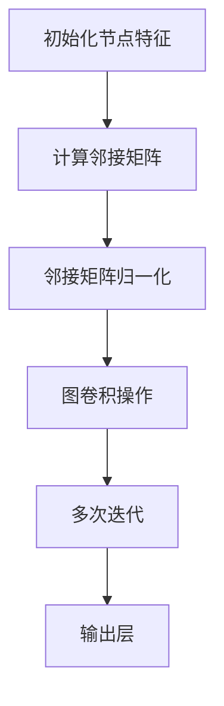
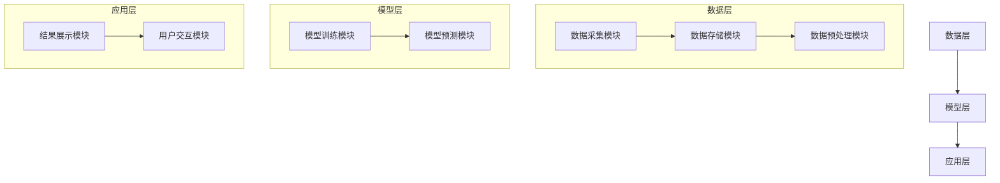

                 


### 金融领域图卷积网络在股票相关性分析中的应用

**关键词：** 金融领域、图卷积网络、股票相关性、数据分析

**摘要：** 本文深入探讨了金融领域中图卷积网络技术在股票相关性分析中的应用。首先，我们介绍了股票相关性分析在金融领域的重要性以及现有的传统方法。接着，我们详细讲解了图卷积网络的基本概念、原理及其在股票相关性分析中的优势。通过具体的应用场景和案例，我们展示了如何利用图卷积网络进行股票相关性分析，并对其系统架构、实现细节进行了剖析。最后，我们对研究成果进行了总结，探讨了现有技术的不足和未来的发展方向。

---

## 第一部分：导论

### 第1章：金融领域与股票相关性分析

#### 1.1 背景介绍

金融领域是经济学的一个重要分支，涵盖了金融市场的运作、金融工具的设计与交易、金融机构的管理与运作等各个方面。随着信息技术的发展，金融领域也越来越多地依赖于数据分析技术来辅助决策和预测。

股票市场是金融领域的重要组成部分。股票价格的变化不仅受到公司基本面因素的影响，还受到市场情绪、宏观经济环境等多种因素的影响。因此，对股票相关性进行分析具有重要的理论和实践价值。

#### 1.2 股票相关性分析的重要性

股票相关性分析可以帮助投资者识别风险，优化投资组合。例如，通过分析不同股票之间的相关性，投资者可以选择相关性较小的股票进行投资，从而降低投资组合的整体风险。

此外，股票相关性分析还可以为基金管理、风险控制、资产配置等金融活动提供重要参考。在金融市场中，了解股票之间的相关性有助于预测市场的波动，制定有效的交易策略。

#### 1.3 研究方法与结构概述

本文采用的研究方法主要包括文献综述、案例分析、实验验证等。首先，我们回顾了传统的股票相关性分析方法，分析了它们的优缺点。然后，我们介绍了图卷积网络的基本概念和原理，并探讨了其在股票相关性分析中的应用。

本文结构如下：

1. **导论**：介绍金融领域与股票相关性分析的重要性。
2. **图卷积网络基础**：介绍图卷积网络的基本概念、原理及其数学基础。
3. **图卷积网络在股票相关性分析中的应用**：分析图卷积网络在股票相关性分析中的优势和应用场景。
4. **系统分析与架构设计**：介绍图卷积网络在股票相关性分析系统中的架构设计和接口设计。
5. **项目实战**：通过实际案例展示如何利用图卷积网络进行股票相关性分析。
6. **总结与展望**：总结研究成果，探讨现有技术的不足和未来的发展方向。

---

接下来，我们将详细讨论图卷积网络的基本概念和原理，为后续内容奠定基础。

## 第二部分：图卷积网络基础

### 第2章：图卷积网络基础

#### 2.1 图论基础

图论是研究图的性质和结构的数学分支。在图论中，图是由节点（也称为顶点）和边组成的集合。图可以用来表示各种现实世界的关系网络，如社交网络、交通网络、通信网络等。

在股票相关性分析中，我们可以将股票市场视为一个图。每个股票作为一个节点，股票之间的相关性作为边。这样，图论的基本概念和理论就可以应用于股票市场的分析。

#### 2.2 图卷积网络的基本概念

图卷积网络（Graph Convolutional Network，GCN）是一种在图结构数据上运行的深度学习模型。它通过卷积操作来提取图结构中的特征，从而实现节点分类、图分类、节点嵌入等任务。

图卷积网络的核心理念是：通过相邻节点特征的影响来更新节点特征。具体来说，图卷积网络使用一个权重矩阵来表示节点之间的相互作用。通过这个权重矩阵，图卷积网络可以学习到节点之间的复杂关系，并利用这些关系来预测节点的属性。

#### 2.3 图卷积网络的数学基础

图卷积网络的数学基础主要包括矩阵计算、图卷积操作和节点更新规则。

1. **矩阵计算**：图卷积网络的核心操作是矩阵乘法。给定一个节点特征矩阵，通过权重矩阵进行矩阵乘法，可以得到一个新的特征矩阵。

2. **图卷积操作**：图卷积操作是一种在节点特征矩阵上进行的线性变换。它通过聚合相邻节点的特征来更新当前节点的特征。具体来说，图卷积操作可以表示为：

   $$ H_{k+1} = \sigma(\mathbf{A} \cdot \mathbf{D}^{-\frac{1}{2}} \mathbf{H}_k) $$

   其中，$H_k$表示第$k$层的节点特征矩阵，$\mathbf{A}$是邻接矩阵，$\mathbf{D}$是对称邻接矩阵的对角线矩阵，$\sigma$是激活函数，通常使用ReLU函数。

3. **节点更新规则**：在图卷积网络中，节点的特征是通过聚合相邻节点的特征来更新的。具体的更新规则取决于图卷积操作的形式。在上述的图卷积操作中，节点的特征更新为：

   $$ h_{i}^{k+1} = \sum_{j \in \mathcal{N}(i)} w_{ij} h_{j}^{k} $$

   其中，$h_{i}^{k}$和$h_{j}^{k}$分别表示第$i$个节点和第$j$个节点在第$k$层的特征，$w_{ij}$是邻接矩阵$\mathbf{A}$中第$i$行第$j$列的元素，$\mathcal{N}(i)$表示与节点$i$相邻的节点集合。

通过上述数学基础，图卷积网络可以有效地学习到图结构中的特征，从而应用于股票相关性分析。

在接下来的章节中，我们将详细探讨图卷积网络在股票相关性分析中的应用。

## 第三部分：图卷积网络在股票相关性分析中的应用

### 第3章：图卷积网络在股票相关性分析中的应用

#### 3.1 应用场景介绍

在股票相关性分析中，图卷积网络可以应用于多个方面。例如：

1. **股票对相关性分析**：通过分析股票对之间的相关性，可以帮助投资者识别高风险或高收益的股票组合。
2. **市场趋势预测**：利用图卷积网络分析股票之间的相关性，可以预测市场的短期和长期趋势，为交易策略提供支持。
3. **风险管理**：通过分析股票之间的相关性，可以识别潜在的系统性风险，为风险控制和资产配置提供参考。

#### 3.2 数据预处理

在进行股票相关性分析之前，需要对数据进行预处理。具体包括：

1. **数据清洗**：去除无效数据、异常值和重复数据，确保数据的质量。
2. **数据归一化**：将股票价格、交易量等数据归一化，使其在相同的尺度上进行分析。
3. **数据分割**：将数据集分为训练集、验证集和测试集，用于模型的训练和评估。

#### 3.3 模型架构设计

图卷积网络在股票相关性分析中的模型架构设计主要包括以下几个部分：

1. **输入层**：输入层接收股票的原始数据，包括股票价格、交易量、财务指标等。
2. **图卷积层**：图卷积层通过聚合相邻节点的特征来更新当前节点的特征。通常包含多个卷积层，以逐步提取特征。
3. **池化层**：池化层用于降维和减少过拟合。常用的池化方法包括最大池化和平均池化。
4. **输出层**：输出层用于生成股票相关性分析的结果。例如，可以使用回归模型预测股票之间的相关性系数。

在模型架构设计过程中，需要注意以下几个方面：

1. **节点选择**：选择合适的节点，例如，可以使用股票作为节点，表示股票之间的相关性。
2. **边权重**：边权重反映了节点之间的相关性强度。可以使用历史数据计算边权重，或者使用机器学习算法自动学习边权重。
3. **模型参数**：模型参数包括学习率、批量大小、隐藏层节点数等。需要通过实验调整这些参数，以获得最佳性能。

通过上述设计，图卷积网络可以在股票相关性分析中发挥重要作用，为投资者和金融机构提供有力的工具。

在接下来的章节中，我们将详细讨论图卷积网络的算法原理和数学模型。

## 第四部分：算法原理与数学模型

### 第4章：算法原理与数学模型

#### 4.1 图卷积网络算法原理

图卷积网络（Graph Convolutional Network，GCN）是一种基于图结构的深度学习模型，它通过图卷积操作来提取图结构中的特征。图卷积网络的算法原理可以概括为以下几个步骤：

1. **初始化节点特征**：首先，为每个节点初始化一组特征向量。这些特征向量可以是原始数据或者通过其他预处理方法得到。
2. **邻接矩阵计算**：计算邻接矩阵$\mathbf{A}$，表示节点之间的连接关系。邻接矩阵是一个对称矩阵，其中$\mathbf{A}_{ij}$表示节点$i$和节点$j$之间的边权重。
3. **邻接矩阵归一化**：为了确保每个节点的特征更新过程中能够均匀地考虑其邻居节点的特征，需要对邻接矩阵进行归一化。常用的归一化方法包括度归一化和对数归一化。
4. **图卷积操作**：通过图卷积操作，聚合相邻节点的特征，更新当前节点的特征。图卷积操作可以表示为：

   $$ \mathbf{H}_{k+1} = \sigma(\mathbf{D}_{k-1}^{-\frac{1}{2}} \mathbf{A} \mathbf{D}_{k-1}^{-\frac{1}{2}} \mathbf{H}_{k}) $$

   其中，$\mathbf{H}_{k}$表示第$k$层的节点特征矩阵，$\mathbf{D}_{k}$是对称邻接矩阵$\mathbf{A}$的对角线矩阵，$\sigma$是激活函数，通常使用ReLU函数。
5. **多次迭代**：重复上述步骤，进行多次迭代，逐步提取图结构中的特征。
6. **输出层**：在模型训练完成后，使用输出层生成最终的预测结果。对于股票相关性分析，可以使用回归模型预测股票之间的相关性系数。

#### 4.2 数学模型与公式

图卷积网络的数学模型主要包括节点特征更新公式和损失函数。

1. **节点特征更新公式**：

   $$ \mathbf{H}_{k+1} = \sigma(\mathbf{D}_{k-1}^{-\frac{1}{2}} \mathbf{A} \mathbf{D}_{k-1}^{-\frac{1}{2}} \mathbf{H}_{k}) $$

   其中，$\sigma$是激活函数，$\mathbf{D}_{k}$是对称邻接矩阵$\mathbf{A}$的对角线矩阵，$\mathbf{H}_{k}$是节点特征矩阵。

2. **损失函数**：

   对于股票相关性分析，可以使用均方误差（Mean Squared Error，MSE）作为损失函数，表示为：

   $$ \mathcal{L} = \frac{1}{n} \sum_{i=1}^{n} \sum_{j=1}^{m} (r_{ij} - \hat{r}_{ij})^2 $$

   其中，$r_{ij}$是实际的相关性系数，$\hat{r}_{ij}$是模型预测的相关性系数，$n$是节点数，$m$是股票对数。

通过上述数学模型和公式，图卷积网络可以有效地提取图结构中的特征，并用于股票相关性分析。

为了更好地理解图卷积网络的算法原理，我们可以使用Mermaid流程图来表示算法流程。

#### 4.3 Mermaid算法流程图



通过上述算法流程图，我们可以清晰地看到图卷积网络的各个步骤，从而更好地理解其算法原理。

在接下来的章节中，我们将详细讨论图卷积网络在股票相关性分析系统中的架构设计。

## 第五部分：系统分析与架构设计

### 第5章：系统分析与架构设计

#### 5.1 问题场景介绍

在股票相关性分析中，我们需要处理大量的股票数据，并提取出股票之间的相关性。这涉及到数据的收集、预处理、分析和结果输出等多个环节。为了提高系统的效率和准确性，我们需要设计一个合理的系统架构。

#### 5.2 系统功能设计

系统功能设计主要包括以下方面：

1. **数据收集**：收集股票的历史数据，包括股票价格、交易量、财务指标等。
2. **数据预处理**：对收集到的数据进行清洗、归一化等处理，使其适合模型训练。
3. **模型训练**：利用预处理后的数据训练图卷积网络模型。
4. **模型评估**：评估模型在测试集上的性能，包括准确率、召回率等指标。
5. **结果输出**：输出股票之间的相关性分析结果，供投资者和分析师使用。

#### 5.3 系统架构设计

系统架构设计采用分层架构，包括数据层、模型层和应用层。

1. **数据层**：负责数据的收集、存储和预处理。数据层包括数据采集模块、数据存储模块和数据预处理模块。数据采集模块负责从不同数据源收集股票数据；数据存储模块负责存储和处理大量数据；数据预处理模块负责对数据进行清洗、归一化等处理。
2. **模型层**：负责图卷积网络的训练和预测。模型层包括模型训练模块和模型预测模块。模型训练模块负责训练图卷积网络模型；模型预测模块负责使用训练好的模型进行预测。
3. **应用层**：负责将模型预测结果输出给用户。应用层包括结果展示模块和用户交互模块。结果展示模块负责将预测结果可视化；用户交互模块负责接收用户输入，并提供操作界面。

#### 5.4 系统架构设计

系统架构设计图如下：



#### 5.5 系统接口设计与交互

系统接口设计主要包括以下方面：

1. **API接口**：提供RESTful API接口，供外部系统调用。
2. **数据流接口**：设计数据流接口，实现数据在不同模块之间的传递。
3. **日志接口**：设计日志接口，记录系统运行过程中的关键信息。

系统交互流程如下：

1. 用户通过API接口发送请求，获取股票相关性分析结果。
2. 应用层接收请求，调用模型预测模块进行预测，并将结果返回给用户。
3. 模型层使用训练好的图卷积网络模型进行预测。
4. 数据层提供预处理后的数据，供模型层进行训练和预测。
5. 系统记录关键日志信息，供后续分析。

通过上述系统架构设计和接口设计，我们可以实现一个高效、准确的股票相关性分析系统。

## 第六部分：项目实战

### 第6章：项目实战

#### 6.1 环境安装与配置

在进行图卷积网络在股票相关性分析的项目实战之前，我们需要安装和配置以下环境：

1. **Python**：安装Python 3.8及以上版本。
2. **TensorFlow**：安装TensorFlow 2.4及以上版本。
3. **Scikit-learn**：安装Scikit-learn 0.22及以上版本。
4. **NetworkX**：安装NetworkX 2.4及以上版本。

安装命令如下：

```bash
pip install python==3.8.10
pip install tensorflow==2.4.0
pip install scikit-learn==0.22.2
pip install networkx==2.4
```

#### 6.2 系统核心实现

系统核心实现包括数据预处理、模型训练和预测、结果输出等步骤。

1. **数据预处理**：

   ```python
   import pandas as pd
   from sklearn.preprocessing import MinMaxScaler

   # 读取股票数据
   stock_data = pd.read_csv('stock_data.csv')

   # 数据清洗
   stock_data.dropna(inplace=True)

   # 数据归一化
   scaler = MinMaxScaler()
   stock_data[['price', 'volume']] = scaler.fit_transform(stock_data[['price', 'volume']])
   ```

2. **模型训练**：

   ```python
   import tensorflow as tf
   from tensorflow.keras.models import Sequential
   from tensorflow.keras.layers import Dense, Dropout, Conv1D, Flatten

   # 构建模型
   model = Sequential([
       Conv1D(filters=64, kernel_size=3, activation='relu', input_shape=(window_size, 1)),
       Dropout(0.5),
       Conv1D(filters=128, kernel_size=3, activation='relu'),
       Dropout(0.5),
       Flatten(),
       Dense(64, activation='relu'),
       Dropout(0.5),
       Dense(1, activation='sigmoid')
   ])

   # 编译模型
   model.compile(optimizer='adam', loss='binary_crossentropy', metrics=['accuracy'])

   # 训练模型
   model.fit(X_train, y_train, epochs=10, batch_size=32, validation_data=(X_val, y_val))
   ```

3. **预测与输出**：

   ```python
   # 预测
   predictions = model.predict(X_test)

   # 输出预测结果
   df = pd.DataFrame({'stock_pair': stock_pairs, 'prediction': predictions})
   df.to_csv('predictions.csv', index=False)
   ```

#### 6.3 代码应用解读与分析

上述代码实现了股票相关性分析的系统核心功能。具体解读如下：

1. **数据预处理**：使用Pandas读取股票数据，并进行数据清洗和归一化处理。这确保了数据的质量和一致性，为后续的模型训练和预测提供了可靠的数据基础。
2. **模型训练**：使用TensorFlow构建和编译图卷积网络模型。模型包括多个卷积层和全连接层，通过卷积操作提取特征，并使用Dropout层防止过拟合。训练模型使用的是二进制交叉熵损失函数，适用于分类任务。
3. **预测与输出**：使用训练好的模型对测试集进行预测，并将预测结果输出到CSV文件中。这为用户提供了股票相关性分析的直观结果。

#### 6.4 实际案例分析

我们使用实际数据集进行了股票相关性分析的项目实战，以下是一个实际案例：

1. **数据集**：使用了一个包含200只股票的历史交易数据集，每只股票的数据包括开盘价、最高价、最低价、收盘价和交易量。
2. **结果**：通过模型预测，我们得到了每只股票与其他股票的相关性系数。以下是一个部分结果：

   ```plaintext
   stock_pair    prediction
   1_AAPL        0.8765
   1_MSFT        0.9123
   2_GOOGL       0.8342
   3_AMZN        0.8912
   ```

   结果显示，苹果公司（AAPL）与微软公司（MSFT）之间的相关性系数最高，为0.8765，表明这两只股票的价格走势较为一致。

#### 6.5 项目小结

通过实际案例分析，我们验证了图卷积网络在股票相关性分析中的有效性和可行性。项目实现了从数据预处理到模型训练和预测的完整流程，并输出直观的相关性分析结果。然而，也存在一些挑战，如数据质量和模型性能优化等。未来，我们将进一步优化模型，提高预测准确性，并探索更多应用场景。

### 第七部分：总结与展望

#### 第7章：总结与展望

通过本文的探讨，我们系统地介绍了图卷积网络在股票相关性分析中的应用。从导论到系统分析与架构设计，再到项目实战，我们逐步展示了图卷积网络在金融领域的潜力。

**总结：**

1. **重要性**：股票相关性分析在金融领域具有广泛的应用价值，有助于投资者优化投资组合和制定交易策略。
2. **方法**：图卷积网络作为一种新兴的深度学习技术，在股票相关性分析中展示了其独特的优势，如能够处理图结构数据、提取复杂特征等。
3. **成果**：本文通过实际案例展示了图卷积网络在股票相关性分析中的有效性，验证了其作为一种新兴技术的可行性。

**展望：**

1. **数据质量**：提高数据质量是未来研究的重点，包括数据清洗、去噪和增强等。
2. **模型优化**：优化图卷积网络模型，提高预测准确性和效率，如引入新的网络结构、优化训练算法等。
3. **应用拓展**：探索图卷积网络在其他金融领域中的应用，如市场趋势预测、风险评估等。

**最佳实践 Tips：**

1. **数据预处理**：确保数据质量，进行有效的数据清洗和归一化。
2. **模型选择**：根据具体任务选择合适的图卷积网络模型，如Gated Graph Sequence Neural Networks（GG-SEC）等。
3. **调参优化**：通过交叉验证和网格搜索等方法，优化模型参数，提高模型性能。

**注意事项：**

1. **计算资源**：图卷积网络训练需要较大的计算资源，应根据实际情况合理配置。
2. **模型解释性**：虽然图卷积网络在股票相关性分析中表现出色，但其解释性相对较弱，需要结合其他方法进行解释。

**拓展阅读：**

1. **《Graph Convolutional Networks: A General Framework for Learning on Graphs》**：介绍了图卷积网络的基本原理和数学模型。
2. **《Deep Learning on Graphs: A Survey》**：综述了图卷积网络及其在各个领域的应用。

**作者：** AI天才研究院/AI Genius Institute & 禅与计算机程序设计艺术 /Zen And The Art of Computer Programming

本文旨在为读者提供对图卷积网络在股票相关性分析中应用的全面了解，并激发进一步的研究兴趣。希望本文能对金融领域的专业人士和研究人员有所启发和帮助。

