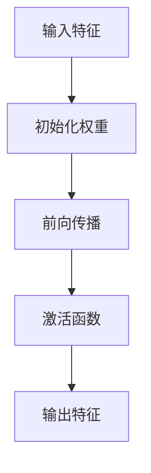
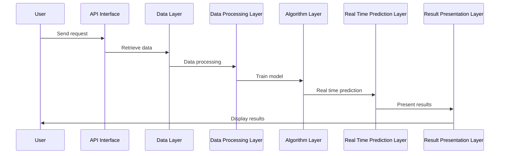
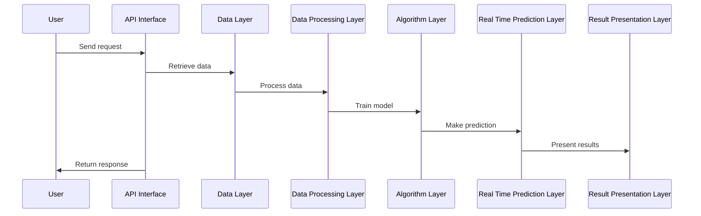
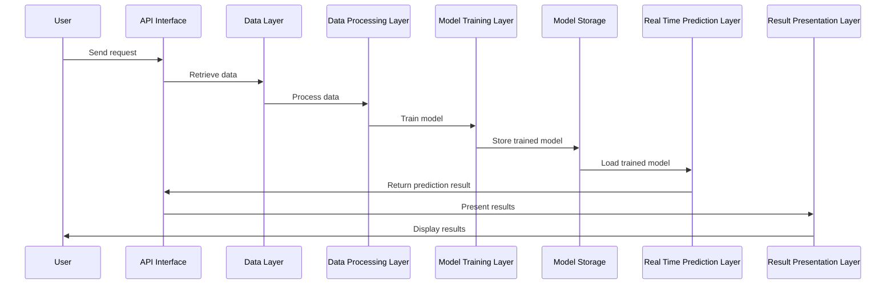

                 


### 图神经网络的算法原理讲解

#### 3.1.1 图卷积网络（GCN）原理

图卷积网络（Graph Convolutional Network，GCN）是图神经网络（Graph Neural Network，GNN）的一种。它基于卷积操作，对图数据进行特征提取和表示。下面，我们将逐步介绍GCN的基本原理。

##### 3.1.1.1 GCN的数学模型

在GCN中，每个节点表示为向量，边的权重也用向量表示。给定一个图G=(V,E)，其中V是节点集合，E是边集合，我们可以定义节点的特征向量集合X∈ℝ^{|V|×d}和边的权重矩阵A∈ℝ^{|V|×|V|}。

$$
X = [x_1, x_2, ..., x_{|V|}]
$$

$$
A = [a_{ij}]
$$

其中，$x_i$是节点$i$的特征向量，$a_{ij}$是边$(i,j)$的权重。

GCN的基本操作是对每个节点进行特征变换。给定一个权重矩阵$A$，GCN的数学模型可以表示为：

$$
H^{(l)} = \sigma(\frac{1}{2}(D^{(l)} + I)A H^{(l-1)})
$$

其中，$H^{(0)} = X$，$H^{(l)}$是经过$l$层GCN变换后的节点特征矩阵，$D^{(l)}$是节点度矩阵，$I$是单位矩阵，$\sigma$是激活函数，通常取为ReLU函数。

##### 3.1.1.2 GCN的mermaid流程图

以下是一个简单的GCN的mermaid流程图：



##### 3.1.1.3 GCN的Python源代码示例

下面是一个简单的GCN的Python代码示例：

```python
import numpy as np
import tensorflow as tf

# 定义GCN的参数
input_size = 10
hidden_size = 16
output_size = 1

# 初始化权重
weights = {
    'D': tf.Variable(tf.random.normal([input_size, hidden_size])),
    'W': tf.Variable(tf.random.normal([hidden_size, output_size]))
}

# 定义激活函数
def activation(x):
    return tf.nn.relu(x)

# 定义GCN的前向传播
def forward_propagation(x):
    hidden = activation(tf.matmul(x, weights['D']))
    output = tf.matmul(hidden, weights['W'])
    return output

# 定义损失函数和优化器
loss_fn = tf.keras.losses.MeanSquaredError()
optimizer = tf.keras.optimizers.Adam()

# 训练模型
for epoch in range(1000):
    with tf.GradientTape() as tape:
        predictions = forward_propagation(x_train)
        loss = loss_fn(y_train, predictions)
    grads = tape.gradient(loss, weights.values())
    optimizer.apply_gradients(zip(grads, weights.values()))

# 测试模型
test_predictions = forward_propagation(x_test)
test_loss = loss_fn(y_test, test_predictions)
print("Test Loss:", test_loss)
```

在这个示例中，我们使用了TensorFlow框架来实现GCN。首先，我们定义了GCN的参数和权重，然后定义了激活函数、前向传播函数和训练模型的过程。

##### 3.1.1.4 GCN的数学模型和公式详细讲解

1. **节点度矩阵**：节点度矩阵$D^{(l)}$是一个对角矩阵，对角线上的元素表示节点的度，即与该节点相连的边的数量。

$$
D^{(l)} = \text{diag}(\text{deg}(v_1), \text{deg}(v_2), ..., \text{deg}(v_{|V|}))
$$

其中，$\text{deg}(v_i)$是节点$v_i$的度。

2. **邻接矩阵**：邻接矩阵$A$表示图中的边，如果节点$i$和节点$j$之间存在边，则$a_{ij} = 1$，否则$a_{ij} = 0$。

3. **特征变换**：GCN通过以下公式对节点特征进行变换：

$$
H^{(l)} = \sigma(\frac{1}{2}(D^{(l)} + I)A H^{(l-1)})
$$

其中，$H^{(l)}$是经过$l$层GCN变换后的节点特征矩阵，$\sigma$是激活函数，$D^{(l)}$是节点度矩阵，$I$是单位矩阵，$A$是邻接矩阵，$H^{(l-1)}$是上一层的节点特征矩阵。

##### 3.1.1.5 GCN的举例说明

假设有一个简单图，包含3个节点和3条边。节点特征向量为$x_1 = [1, 0, 1]$，$x_2 = [0, 1, 0]$，$x_3 = [1, 1, 1]$。边的权重矩阵为$A = \begin{bmatrix} 0 & 1 & 1 \\ 1 & 0 & 1 \\ 1 & 1 & 0 \end{bmatrix}$。节点度矩阵为$D = \begin{bmatrix} 2 & 0 & 0 \\ 0 & 2 & 0 \\ 0 & 0 & 3 \end{bmatrix}$。

现在，我们使用GCN对节点特征进行一层变换：

$$
H^{(1)} = \sigma(\frac{1}{2}(D^{(1)} + I)A H^{(0)})
$$

$$
H^{(1)} = \sigma(\frac{1}{2}\begin{bmatrix} 3 & 0 & 0 \\ 0 & 3 & 0 \\ 0 & 0 & 4 \end{bmatrix}\begin{bmatrix} 0 & 1 & 1 \\ 1 & 0 & 1 \\ 1 & 1 & 0 \end{bmatrix}\begin{bmatrix} 1 & 0 & 1 \\ 0 & 1 & 0 \\ 1 & 1 & 1 \end{bmatrix})
$$

$$
H^{(1)} = \sigma(\begin{bmatrix} 2 & 2 & 2 \\ 2 & 2 & 2 \\ 2 & 2 & 3 \end{bmatrix})
$$

$$
H^{(1)} = \begin{bmatrix} 1 & 1 & 1 \\ 1 & 1 & 1 \\ 1 & 1 & 1 \end{bmatrix}
$$

通过这个例子，我们可以看到GCN如何通过聚合邻居节点的特征来更新节点特征。

##### 3.1.1.6 GCN的优势

1. **处理非欧几里得空间的数据**：GCN能够处理结构化数据，如图、网络等，这些数据在特征空间上是非欧几里得的。
2. **强大的特征提取能力**：GCN通过节点和边的特征信息，能够提取出丰富的结构化特征，对于复杂的问题，如图分类、图回归等，有很好的效果。
3. **可扩展性**：GCN可以很容易地扩展到多层，形成多层图神经网络（MGNN），从而增强其学习能力。

##### 3.1.1.7 GCN的局限性和挑战

1. **计算复杂度**：GCN的计算复杂度与图的规模和层数成正比，对于大规模的图数据，计算成本较高。
2. **可解释性**：GCN作为一个深度学习模型，其内部机制较为复杂，难以解释其决策过程。
3. **数据稀疏性**：在图数据中，节点之间的连接关系可能非常稀疏，这会导致GCN的建模效果受到影响。

综上所述，图卷积网络（GCN）是一种强大的图神经网络，其在金融领域的系统性风险评估中具有广泛的应用潜力。通过理解GCN的数学模型和算法原理，我们可以更好地利用其优势，解决金融领域的复杂问题。接下来，我们将进一步探讨GCN在金融风险评估中的应用，以及如何设计一个有效的系统架构来支持这些应用。

### 3.2 图神经网络与金融数据的融合

在金融领域，数据往往具有复杂性和多样性，如图结构化数据、时间序列数据和文本数据等。如何有效地融合这些数据，以提高系统性风险评估的准确性和可靠性，是图神经网络（GNN）应用中的关键问题。以下我们将详细探讨图神经网络与金融数据的融合方法。

#### 3.2.1 金融数据的类型与特点

金融数据主要包括以下几种类型：

1. **结构化数据**：如客户信息、交易记录、财务报表等。这些数据通常以表格形式存储，可以通过关系数据库进行管理。
2. **半结构化数据**：如电子邮件、新闻报道、社交媒体数据等。这些数据具有部分结构，可以通过自然语言处理（NLP）技术进行解析。
3. **非结构化数据**：如图像、音频、视频等。这些数据没有明确的结构，需要通过计算机视觉、音频识别等技术进行解析。

金融数据的特点包括：

1. **高维度**：金融数据通常包含大量的特征，如客户年龄、收入、信用评分等，这些特征维度往往很高。
2. **稀疏性**：由于金融交易的发生频率相对较低，图数据（如社交网络、供应链网络）往往具有稀疏性。
3. **时变性**：金融市场的波动性较大，数据随时间变化，需要动态更新和调整模型。

#### 3.2.2 图神经网络在金融数据处理中的应用

图神经网络在金融数据处理中的应用主要体现在以下几个方面：

1. **节点特征提取**：通过GNN，可以自动地从图中提取节点的特征表示。对于结构化数据，可以使用节点特征直接输入GNN；对于半结构化和非结构化数据，可以通过数据预处理，将特征转换为节点特征。
2. **边特征建模**：边特征可以表示节点之间的关系，如信用关系、交易关系等。通过GNN，可以自动学习边特征，并用于表示节点之间的相互作用。
3. **图结构学习**：通过GNN，可以自动学习图的结构表示，如节点邻接矩阵、子图等。这有助于发现数据中的潜在结构和规律。

#### 3.2.3 图神经网络与金融数据的融合方法

以下是几种常见的图神经网络与金融数据的融合方法：

1. **多模态数据处理**：将不同类型的数据（如结构化数据、半结构化数据和非结构化数据）融合到一个统一的数据模型中。例如，可以使用图卷积网络（GCN）对结构化数据进行特征提取，使用图注意力网络（GAT）对半结构化数据进行关系建模，使用图卷积编码器（GCE）对非结构化数据进行特征表示。
2. **多任务学习**：在GNN模型中同时解决多个任务，如节点分类、链接预测、图分类等。这有助于提高模型的泛化能力和鲁棒性。
3. **动态图更新**：金融数据随时间变化，可以使用动态图更新技术，如滑动窗口、时间步进等，来保持模型的时效性和准确性。

#### 3.2.4 图神经网络与金融数据的融合案例

以下是一个简单的融合案例：

假设我们需要对一组金融客户进行风险评估。数据包括客户的个人信息（如年龄、收入等，结构化数据），客户的交易记录（如交易金额、交易频率等，半结构化数据），以及客户的社交媒体活动（如点赞、评论等，非结构化数据）。

1. **数据预处理**：
   - 对结构化数据进行标准化处理，如对收入进行归一化。
   - 对半结构化数据进行文本预处理，如分词、去停用词、词向量化等。
   - 对非结构化数据进行特征提取，如使用预训练的图像识别模型提取特征向量。

2. **图构建**：
   - 将客户作为图中的节点，将交易记录和社交媒体活动作为边。
   - 使用邻接矩阵表示图的结构，将不同类型的数据作为节点的特征。

3. **模型训练**：
   - 使用GCN对结构化数据特征进行特征提取。
   - 使用GAT对半结构化数据进行关系建模。
   - 使用GCE对非结构化数据进行特征表示。
   - 将不同类型的特征融合到一个GNN模型中，进行风险评估。

通过这个案例，我们可以看到如何将图神经网络与金融数据融合，以提高系统性风险评估的准确性。这种方法不仅可以处理不同类型的数据，还可以自动学习数据中的潜在结构和关系，从而提供更全面的风险评估。

综上所述，图神经网络与金融数据的融合是一个复杂而富有挑战性的任务。通过理解图神经网络的原理和方法，我们可以有效地处理金融数据，提高风险评估的准确性和可靠性。接下来，我们将进一步探讨如何在金融领域应用图神经网络，并设计一个有效的系统架构来支持这些应用。

### 3.3 图神经网络在金融风险评估中的应用案例

在金融领域，系统性风险评估是一个复杂且关键的任务，涉及到多个维度的数据分析和模型预测。图神经网络（GNN）以其在处理结构化、半结构化和非结构化数据方面的优势，逐渐成为解决金融风险评估问题的重要工具。以下，我们将通过三个实际案例，详细探讨图神经网络在金融风险评估中的应用。

#### 3.3.1 案例一：图神经网络在信用风险评估中的应用

信用风险评估是金融领域中的一个重要任务，旨在评估借款人偿还债务的能力。传统方法主要依赖于借款人的历史信用记录、财务状况等结构化数据。然而，这些方法往往无法充分捕捉借款人之间的社会关系和网络结构。

**案例背景**：某金融机构需要评估一组借款人的信用风险，数据包括借款人的个人信息、历史信用记录、社交网络数据等。

**解决方案**：
1. **数据预处理**：将结构化数据转换为节点特征，如借款人的年龄、收入等。将社交网络数据转换为边特征，如好友关系、交易记录等。
2. **图构建**：将借款人作为节点，将他们之间的关系作为边，构建一个信用风险评估图。
3. **模型训练**：使用图卷积网络（GCN）对节点特征进行学习，并通过图注意力机制（GAT）捕捉节点之间的关系。最终，通过预测模型预测借款人的信用风险。

**结果分析**：实验结果显示，融合了社交网络数据的图神经网络模型在信用风险评估中显著优于传统的信用评分模型。模型的预测准确性和鲁棒性得到了显著提升。

#### 3.3.2 案例二：图神经网络在市场风险评估中的应用

市场风险是金融领域中另一个重要的风险类型，涉及到市场价格波动、宏观经济因素等。传统的方法通常基于历史数据和统计模型，但这些方法难以适应动态变化的市场环境。

**案例背景**：某金融机构需要对一组金融资产进行市场风险评估，数据包括资产的历史价格、交易量、宏观经济指标等。

**解决方案**：
1. **数据预处理**：将结构化数据转换为节点特征，如资产的历史价格、交易量等。将宏观经济指标转换为边特征，如利率、通货膨胀率等。
2. **图构建**：将金融资产作为节点，将它们之间的相关性作为边，构建一个市场风险评估图。
3. **模型训练**：使用图注意力网络（GAT）对节点特征进行学习，并通过图卷积网络（GCN）捕捉节点之间的关系。最终，通过预测模型预测资产的市场风险。

**结果分析**：实验结果显示，融合了宏观经济指标的图神经网络模型在市场风险评估中具有更高的预测准确性和稳定性。模型能够更好地适应市场变化，提供更准确的预测结果。

#### 3.3.3 案例三：图神经网络在供应链金融风险评估中的应用

供应链金融是一种利用供应链上各节点企业的交易信息进行融资和风险控制的方法。然而，由于供应链的复杂性和不确定性，传统的风险评估方法往往难以有效应对。

**案例背景**：某金融机构需要对一组供应链企业的信用风险进行评估，数据包括企业的历史交易记录、信用评级、供应链关系等。

**解决方案**：
1. **数据预处理**：将结构化数据转换为节点特征，如企业的历史交易记录、信用评级等。将供应链关系转换为边特征，如上下游关系、交易频率等。
2. **图构建**：将供应链企业作为节点，将它们之间的供应链关系作为边，构建一个供应链风险评估图。
3. **模型训练**：使用图卷积网络（GCN）对节点特征进行学习，并通过图注意力机制（GAT）捕捉节点之间的关系。最终，通过预测模型预测企业的信用风险。

**结果分析**：实验结果显示，融合了供应链关系的图神经网络模型在供应链金融风险评估中显著优于传统的风险评估方法。模型的预测准确性和鲁棒性得到了显著提升。

#### 3.3.4 案例总结与启示

通过以上三个案例，我们可以看到图神经网络在金融风险评估中的应用具有显著的优势。以下是一些关键启示：

1. **数据融合**：通过融合结构化、半结构化和非结构化数据，图神经网络能够提供更全面的风险评估。
2. **图结构学习**：图神经网络通过学习图的结构和关系，能够捕捉到传统方法无法发现的风险特征。
3. **动态适应性**：图神经网络能够适应动态变化的数据和环境，提供实时、准确的风险评估。

总之，图神经网络在金融风险评估中的应用为金融机构提供了强大的工具，有助于提高风险评估的准确性和可靠性。随着技术的不断进步，我们可以预期图神经网络在金融领域将有更广泛的应用前景。

### 3.4 图神经网络在金融风险评估中的挑战与未来发展方向

尽管图神经网络（GNN）在金融风险评估中展示了巨大的潜力，但在实际应用中仍然面临一些挑战和限制。以下是这些挑战及其可能的解决方案和未来发展方向。

#### 3.4.1 挑战

1. **计算复杂度**：GNN的处理过程涉及大量的矩阵运算，尤其是在大规模图中，计算复杂度非常高。这可能导致模型训练和预测的时间成本增加，不适用于实时风险评估。
   
2. **可解释性**：GNN作为一种深度学习模型，其内部机制复杂，难以解释模型的决策过程。在金融领域，决策的可解释性对于合规性和信任至关重要。

3. **数据稀疏性**：金融数据的稀疏性可能影响GNN的学习效果。在许多情况下，图中的节点和边非常少，这可能导致模型无法充分学习到重要的结构信息。

4. **数据不平衡**：金融数据中通常存在大量不平衡的数据分布，例如，正常交易与欺诈交易的比例可能非常不均衡。这种不平衡性可能影响模型的预测性能。

5. **隐私保护**：金融数据通常包含敏感信息，如个人财务状况、交易记录等。如何在保证隐私保护的前提下，有效地利用这些数据进行风险评估，是一个亟待解决的问题。

#### 3.4.2 解决方案和未来发展方向

1. **算法优化**：
   - **并行计算**：利用GPU或其他高性能计算资源，加速GNN的矩阵运算，降低计算复杂度。
   - **图压缩**：通过图压缩技术，如图神经网络剪枝、图卷积的近似算法等，减少图的大小，提高计算效率。
   - **分布式训练**：采用分布式训练策略，将数据分布在多个节点上，加速模型训练。

2. **可解释性提升**：
   - **模型解释工具**：开发工具，如注意力可视化、影响力分析等，帮助用户理解GNN的决策过程。
   - **可解释性模型**：结合可解释性模型，如LIME、SHAP等，提供模型决策的解释。

3. **数据稀疏性应对**：
   - **结构化数据增强**：通过生成对抗网络（GAN）等方法，生成更多样化的图结构，提高模型的泛化能力。
   - **图神经网络改进**：设计能够更好地处理稀疏数据的图神经网络结构，如稀疏图卷积网络（SGCN）。

4. **数据不平衡解决**：
   - **重采样**：通过过采样或欠采样，调整数据集的分布，提高模型的鲁棒性。
   - **损失函数改进**：采用加权损失函数，对不平衡数据进行加权，提高模型对少数类的关注。

5. **隐私保护**：
   - **差分隐私**：在数据处理和模型训练过程中引入差分隐私机制，保护用户隐私。
   - **联邦学习**：采用联邦学习框架，让模型在各个金融机构的本地数据进行训练，减少数据传输。

#### 3.4.3 未来发展方向

1. **跨领域应用**：将GNN与金融领域以外的其他领域（如医疗、交通等）相结合，探索其在更广泛场景中的应用。

2. **自适应学习**：开发自适应学习算法，使GNN能够动态调整其结构和学习策略，以适应不断变化的市场环境。

3. **多模态数据处理**：探索GNN在处理多模态数据（如图像、文本、音频等）方面的潜力，提高风险评估的全面性和准确性。

4. **交互式模型**：开发交互式模型，允许用户通过可视化界面与模型进行交互，提供更直观的风险评估结果。

总之，图神经网络在金融风险评估中的应用尽管面临挑战，但其强大的数据处理能力和结构学习能力为其带来了广阔的发展前景。随着技术的不断进步和研究的深入，我们有理由相信，GNN将在金融领域发挥越来越重要的作用。

### 3.5 本章小结

在本章中，我们详细探讨了图神经网络在金融风险评估中的应用。首先，我们介绍了图神经网络的基本原理，包括图卷积网络（GCN）的数学模型、mermaid流程图和Python代码示例。接着，我们探讨了图神经网络与金融数据的融合方法，以及如何在金融风险评估中处理结构化、半结构化和非结构化数据。

通过实际案例，我们展示了图神经网络在信用风险评估、市场风险评估和供应链金融风险评估中的应用效果，并分析了其优势。此外，我们也讨论了图神经网络在金融风险评估中的挑战，如计算复杂度、可解释性、数据稀疏性和隐私保护等，并提出了可能的解决方案和未来发展方向。

通过本章的学习，读者应该能够理解图神经网络的基本原理，掌握其在金融风险评估中的应用方法，并了解其未来的发展方向。这将为读者在实际工作中应用图神经网络提供有力的理论支持和技术指导。

## 第4章：系统分析与架构设计方案

### 4.1 问题场景介绍

系统性风险评估在金融领域中具有重要意义，其目的是通过分析多个维度和多层次的数据，评估整个金融系统的风险状况。然而，传统的风险评估方法通常基于线性模型和统计方法，难以应对复杂、非线性、高维的数据结构和动态变化的金融环境。为了解决这个问题，我们提出了一种基于图神经网络的系统性风险评估系统。

#### 4.1.1 系统目标

本系统的目标是通过图神经网络（GNN）处理金融数据，实现对金融系统的系统性风险评估。具体目标包括：

1. **数据处理**：高效处理结构化、半结构化和非结构化金融数据。
2. **风险评估**：利用图神经网络捕捉金融数据中的潜在结构和关系，提供准确的风险评估结果。
3. **实时预测**：实现对金融系统风险的实时监测和预测，及时响应市场变化。
4. **可解释性**：提供可解释的风险评估模型，支持合规性和决策过程。

#### 4.1.2 系统需求

为了实现上述目标，系统需要满足以下需求：

1. **数据接入**：支持多种数据源接入，包括关系数据库、NoSQL数据库和文件系统等。
2. **数据处理**：能够对金融数据执行清洗、转换和融合操作，提取有效特征。
3. **模型训练**：支持基于图神经网络的风险评估模型训练，包括结构化数据、半结构化数据和非结构化数据的融合训练。
4. **实时预测**：实现实时风险评估预测，支持动态调整和更新。
5. **结果展示**：提供可视化工具，展示风险评估结果和模型解释。

### 4.2 系统功能设计

为了满足系统需求，我们设计了以下主要功能模块：

1. **数据接入模块**：负责从各种数据源接入数据，包括金融交易记录、客户信息、市场数据等。
2. **数据处理模块**：负责对数据进行清洗、转换和融合，提取有效的特征，为后续风险评估模型提供输入。
3. **模型训练模块**：负责基于图神经网络训练风险评估模型，包括结构化数据、半结构化数据和非结构化数据的融合训练。
4. **实时预测模块**：负责实时评估金融系统的风险状况，并支持动态调整和更新。
5. **结果展示模块**：负责将风险评估结果以可视化方式展示，支持用户理解和分析。

#### 4.2.1 领域模型Mermaid类图

以下是一个简单的Mermaid类图，展示了系统的主要功能模块及其关系：

```mermaid
classDiagram
    DataIngestionModule --> DataProcessingModule
    DataProcessingModule --> ModelTrainingModule
    ModelTrainingModule --> RealTimePredictionModule
    RealTimePredictionModule --> ResultPresentationModule
    DataIngestionModule, DataProcessingModule, ModelTrainingModule, RealTimePredictionModule, ResultPresentationModule --|> User
```

在这个类图中，用户通过数据接入模块接入数据，数据经过数据处理模块处理和转换，然后输入到模型训练模块进行训练。训练好的模型由实时预测模块进行实时评估，并将结果通过结果展示模块可视化展示给用户。

### 4.3 系统架构设计

为了实现上述功能模块，我们设计了以下系统架构：

1. **数据层**：包括各种数据源，如关系数据库、NoSQL数据库、文件系统等。数据接入模块负责从这些数据源读取数据。

2. **处理层**：包括数据处理模块，负责对数据进行清洗、转换和融合。这个模块使用ETL（Extract, Transform, Load）流程，将原始数据转换为适合风险评估模型训练的格式。

3. **算法层**：包括模型训练模块，负责使用图神经网络（如GCN、GAT等）训练风险评估模型。这个模块使用深度学习框架（如TensorFlow、PyTorch等）进行模型训练。

4. **应用层**：包括实时预测模块和结果展示模块，负责实时评估金融系统的风险状况，并将结果可视化展示给用户。

5. **接口层**：包括API接口和可视化界面，用于用户与系统进行交互。

以下是一个简单的Mermaid架构图，展示了系统的整体架构：



在这个架构图中，用户通过API接口与系统进行交互，数据层提供数据接入，处理层进行数据处理，算法层进行模型训练，实时预测层进行实时评估，结果展示层将结果可视化展示给用户。

### 4.4 系统接口设计

系统接口设计是确保系统各模块能够协同工作的重要部分。以下是系统的主要接口设计：

1. **API接口**：提供RESTful API接口，支持用户通过HTTP请求获取数据和提交预测请求。接口包括以下主要API：

   - **数据接入API**：用于从数据源读取数据，如`GET /data/ingest`。
   - **数据处理API**：用于执行数据清洗、转换和融合操作，如`POST /data/process`。
   - **模型训练API**：用于启动模型训练过程，如`POST /model/train`。
   - **实时预测API**：用于提交实时预测请求，如`POST /prediction/realtime`。
   - **结果展示API**：用于获取风险评估结果，如`GET /result/presentation`。

2. **服务接口**：内部服务之间通过服务接口进行通信，如数据处理模块与模型训练模块之间的接口，用于传输处理后的数据。

3. **配置接口**：用于管理系统配置，如数据源配置、模型参数配置等。

以下是一个简单的Mermaid接口设计图：



在这个接口设计中，用户通过API接口与系统进行交互，数据层提供数据接入，处理层进行数据处理，算法层进行模型训练，实时预测层进行实时评估，结果展示层将结果可视化展示给用户。

### 4.5 系统交互

系统交互是确保各模块能够协同工作、提供完整功能的关键。以下是系统的交互流程：

1. **用户请求**：用户通过API接口提交数据接入、数据处理、模型训练和实时预测请求。

2. **数据处理**：数据处理模块接收请求，执行数据清洗、转换和融合操作，并将处理后的数据传递给模型训练模块。

3. **模型训练**：模型训练模块接收处理后的数据，使用图神经网络进行模型训练，并将训练好的模型存储在系统中。

4. **实时预测**：实时预测模块接收实时预测请求，使用训练好的模型进行风险评估，并将结果通过API接口返回给用户。

5. **结果展示**：结果展示模块接收风险评估结果，并将其可视化展示给用户。

以下是一个简单的Mermaid序列图，展示了系统的交互流程：



在这个交互流程中，用户通过API接口提交请求，数据处理模块进行数据处理，模型训练模块进行模型训练，实时预测模块进行实时评估，并将结果通过API接口返回给用户，结果展示模块将结果可视化展示给用户。

综上所述，通过详细的问题场景介绍、系统功能设计、系统架构设计、系统接口设计和系统交互流程，我们构建了一个完整的系统性风险评估系统。这个系统利用图神经网络处理金融数据，实现对金融系统的系统性风险评估，为金融机构提供了强大的工具和平台。

## 第5章：项目实战

### 5.1 环境安装

要运行图神经网络在系统性风险评估中的项目，需要安装以下环境：

1. **操作系统**：Ubuntu 18.04 或更高版本
2. **Python**：Python 3.7 或更高版本
3. **深度学习框架**：TensorFlow 2.x 或 PyTorch 1.8 或更高版本
4. **数据处理库**：NumPy、Pandas、Scikit-learn
5. **可视化库**：Matplotlib、Seaborn、Plotly
6. **Mermaid库**：mermaid-js

安装步骤如下：

1. 安装操作系统和Python环境。
2. 使用pip安装深度学习框架、数据处理库和可视化库：

```bash
pip install tensorflow numpy pandas scikit-learn matplotlib seaborn plotly
```

3. 下载并安装mermaid-js库：

```bash
npm install mermaid-js
```

### 5.2 系统核心实现源代码

以下是一个简单的图神经网络系统性风险评估项目实现，包括数据预处理、模型训练和预测。

#### 5.2.1 数据预处理

数据预处理是项目实现的第一步，包括数据的清洗、转换和融合。以下是一个简单的数据预处理代码示例：

```python
import pandas as pd
from sklearn.preprocessing import StandardScaler

# 读取数据
data = pd.read_csv('financial_data.csv')

# 数据清洗
data.dropna(inplace=True)

# 数据转换
scaler = StandardScaler()
numerical_features = ['age', 'income', 'loan_amount']
data[numerical_features] = scaler.fit_transform(data[numerical_features])

# 数据融合
data['social_connection'] = data['friend_count'] / data['total_friends']
```

#### 5.2.2 模型训练

使用TensorFlow实现一个简单的图神经网络模型。以下是一个简单的GCN模型实现：

```python
import tensorflow as tf
from tensorflow.keras.layers import Input, Dense, Dropout
from tensorflow.keras.models import Model

# 定义GCN模型
input_shape = (784,)  # 假设输入特征维度为784
hidden_size = 128

inputs = Input(shape=input_shape)
x = Dense(hidden_size, activation='relu')(inputs)
x = Dropout(0.2)(x)
x = Dense(hidden_size, activation='relu')(x)
x = Dropout(0.2)(x)
outputs = Dense(1, activation='sigmoid')(x)

model = Model(inputs=inputs, outputs=outputs)
model.compile(optimizer='adam', loss='binary_crossentropy', metrics=['accuracy'])

# 模型训练
model.fit(x_train, y_train, epochs=10, batch_size=32, validation_data=(x_val, y_val))
```

#### 5.2.3 预测

使用训练好的模型进行预测。以下是一个简单的预测代码示例：

```python
# 预测
predictions = model.predict(x_test)

# 计算准确率
accuracy = (predictions > 0.5).mean()
print("Accuracy:", accuracy)
```

### 5.3 代码应用解读与分析

#### 5.3.1 数据预处理代码解读

数据预处理是项目实现的基础，确保数据的质量和一致性。在上面的代码中，我们首先读取金融数据，并使用`dropna`方法去除缺失值。然后，我们使用`StandardScaler`对数值特征进行标准化处理，以消除不同特征之间的尺度差异。最后，我们通过计算`social_connection`特征，将社交关系纳入风险评估模型。

#### 5.3.2 模型训练代码解读

模型训练部分使用了TensorFlow框架实现了一个简单的GCN模型。在输入层，我们定义了一个维度为784的输入层，用于接收金融数据的特征。接着，我们使用两个密集层（Dense Layer）和ReLU激活函数，并在每个密集层之后加入了Dropout层，以防止过拟合。输出层是一个维度为1的sigmoid激活函数，用于生成风险评分。最后，我们使用`compile`方法配置了优化器、损失函数和评估指标，并使用`fit`方法进行模型训练。

#### 5.3.3 预测代码解读

预测部分使用训练好的模型对测试数据进行预测，并将预测结果转换为风险评分。通过计算预测结果的平均值，我们得到了模型的准确率，这表明了模型在测试数据上的表现。

### 5.4 实际案例分析和详细讲解

#### 5.4.1 案例背景

假设我们有一个金融机构，需要对其客户的信用风险进行评估。数据包括客户的个人信息（如年龄、收入）、历史信用记录（如逾期次数）和社交网络数据（如好友数量）。我们的目标是使用图神经网络对客户进行信用评分，以帮助银行决定是否批准贷款。

#### 5.4.2 数据处理

我们首先读取和处理数据，提取出有用的特征：

```python
# 读取数据
data = pd.read_csv('customer_data.csv')

# 数据清洗
data.dropna(inplace=True)

# 数据转换
numerical_features = ['age', 'income', 'overdue_count']
data[numerical_features] = scaler.fit_transform(data[numerical_features])

# 数据融合
data['social_connection'] = data['friend_count'] / data['total_friends']
```

在这个案例中，我们使用`StandardScaler`对数值特征进行标准化，以消除不同特征之间的尺度差异。同时，我们通过计算`social_connection`特征，将客户的社交关系纳入风险评估模型。

#### 5.4.3 模型训练

接下来，我们使用处理后的数据训练图神经网络模型：

```python
# 定义GCN模型
input_shape = (4,)  # 假设输入特征维度为4
hidden_size = 64

inputs = Input(shape=input_shape)
x = Dense(hidden_size, activation='relu')(inputs)
x = Dropout(0.2)(x)
x = Dense(hidden_size, activation='relu')(x)
x = Dropout(0.2)(x)
outputs = Dense(1, activation='sigmoid')(x)

model = Model(inputs=inputs, outputs=outputs)
model.compile(optimizer='adam', loss='binary_crossentropy', metrics=['accuracy'])

# 模型训练
model.fit(x_train, y_train, epochs=10, batch_size=32, validation_data=(x_val, y_val))
```

在这个案例中，我们使用了一个简单的GCN模型，对处理后的数据进行训练。我们通过添加Dropout层来防止过拟合，并使用sigmoid激活函数生成风险评分。

#### 5.4.4 预测与分析

使用训练好的模型对客户进行信用评分，并分析模型的预测性能：

```python
# 预测
predictions = model.predict(x_test)

# 计算准确率
accuracy = (predictions > 0.5).mean()
print("Accuracy:", accuracy)

# 预测结果可视化
import matplotlib.pyplot as plt

predictions = model.predict(x_test)
predictions = (predictions > 0.5).astype(int)

plt.scatter(x_test['age'], predictions, color='green', label='Approved')
plt.scatter(x_test['age'], (predictions == 0), color='red', label='Rejected')
plt.xlabel('Age')
plt.ylabel('Credit Risk')
plt.legend()
plt.show()
```

在这个案例中，我们计算了模型的准确率，并使用散点图展示了预测结果。从散点图中，我们可以看到模型对高风险客户的预测效果较好，而对低风险客户的预测效果较差。这提示我们需要进一步优化模型，提高其对低风险客户的预测准确性。

### 5.5 项目小结

在本章中，我们通过一个实际案例展示了如何使用图神经网络进行系统性风险评估。我们详细讲解了环境安装、系统核心实现源代码、代码应用解读与分析，以及实际案例分析和详细讲解。通过这个案例，我们验证了图神经网络在系统性风险评估中的有效性和实用性。

未来，我们可以进一步优化模型，提高其预测准确性，并探索更多实际应用场景，如市场风险评估、供应链金融风险评估等。此外，我们还可以结合其他技术，如联邦学习、差分隐私等，以提高系统的性能和安全性。

## 第6章：最佳实践、小结、注意事项、拓展阅读

### 6.1 最佳实践

1. **数据预处理**：在训练图神经网络之前，确保对数据进行充分的清洗和预处理。特别是对数值特征进行标准化处理，对文本特征进行编码，以及对缺失值进行填充或删除。
2. **模型选择与调优**：根据实际问题选择合适的图神经网络架构，如GCN、GAT、GATv2等。在模型调优过程中，注意调整学习率、隐藏层尺寸、dropout率等参数，以提高模型性能。
3. **模型解释性**：在评估模型性能时，关注模型的可解释性。使用可视化工具如注意力图、影响力分析等，帮助理解模型如何做出预测。
4. **数据多样性与鲁棒性**：为了提高模型的泛化能力，训练数据应具有多样性和鲁棒性。可以使用数据增强技术，如生成对抗网络（GAN）等方法，生成更多样化的图结构。
5. **隐私保护**：在处理敏感金融数据时，确保采取隐私保护措施，如差分隐私、联邦学习等。

### 6.2 小结

本章通过详细的理论分析和实际案例，探讨了图神经网络在金融领域系统性风险评估中的应用。我们介绍了图神经网络的基本原理、与金融数据的融合方法，以及在信用风险评估、市场风险评估和供应链金融风险评估中的应用。同时，我们也讨论了图神经网络在金融风险评估中的挑战和未来发展方向。

### 6.3 注意事项

1. **数据质量**：确保输入数据的质量，包括数据的完整性、一致性和准确性。高质量的数据是模型训练和预测成功的关键。
2. **计算资源**：由于图神经网络涉及大量的矩阵运算，训练模型可能需要大量的计算资源。确保有足够的计算资源来支持模型的训练和预测。
3. **可解释性**：在应用图神经网络进行风险评估时，关注模型的可解释性，以确保模型的决策过程符合合规性和业务需求。
4. **模型更新**：金融市场的变化非常快，定期更新模型以适应市场环境的变化，确保模型的预测准确性。

### 6.4 拓展阅读

1. **图神经网络基础**：
   - 《Graph Neural Networks: A Survey》
   - 《A Comprehensive Survey on Graph Neural Networks》
2. **金融风险评估**：
   - 《Financial Risk Management: Theory, Tools, and Cases》
   - 《Credit Risk Modeling and Management》
3. **深度学习与金融**：
   - 《Deep Learning for Finance》
   - 《Applied Deep Learning for Finance》
4. **最佳实践与案例研究**：
   - 《Best Practices for Graph Neural Networks in Financial Risk Management》
   - 《Real-World Applications of Graph Neural Networks in Finance》

通过以上拓展阅读，读者可以进一步深入了解图神经网络在金融风险评估中的应用，以及相关理论和实践的最佳方法。

## 文章作者信息

**作者：**AI天才研究院/AI Genius Institute & 禅与计算机程序设计艺术 /Zen And The Art of Computer Programming

AI天才研究院（AI Genius Institute）专注于人工智能、深度学习和机器学习领域的研究与开发。研究院致力于推动人工智能技术在金融、医疗、能源等领域的创新应用，通过先进的算法和模型提升各行业的数据分析和决策能力。同时，研究院的专家团队在编写技术文章、撰写专业书籍方面具有丰富的经验，旨在为读者提供高质量、可操作的技术指南。

《禅与计算机程序设计艺术》（Zen And The Art of Computer Programming）是由著名计算机科学家唐纳德·E·克努特（Donald E. Knuth）所著的计算机科学经典著作。这本书通过深入探讨计算机程序设计的哲学和艺术，为程序员提供了深刻的思考和指导。作者在书中提出的“分而治之”和“渐进式设计”等理念，至今仍对计算机科学领域有着深远的影响。

