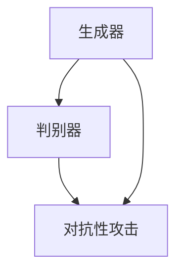
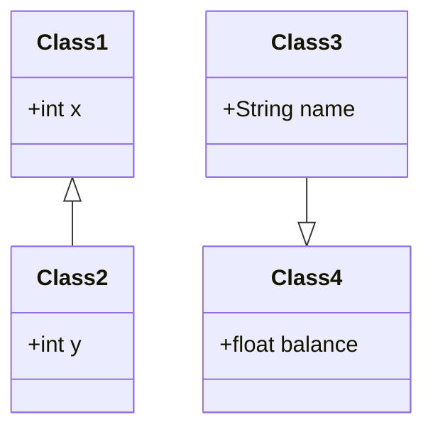
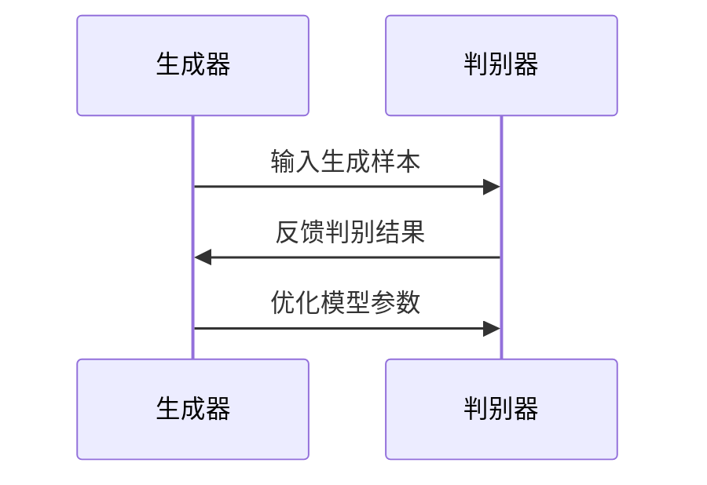

                 

# 《金融领域对抗学习的研究与应用》

## 关键词

对抗学习、金融领域、风险控制、数据安全、量化交易、欺诈检测、人工智能

## 摘要

本文将深入探讨对抗学习在金融领域的应用。首先，我们将介绍对抗学习的基本概念和理论背景，接着分析其在金融风险控制、数据安全、量化交易和欺诈检测等方面的具体应用。通过一系列的实例分析和系统架构设计，本文旨在展示对抗学习如何提高金融行业的效率、安全性和准确性。最后，我们将总结当前的研究成果，展望对抗学习在金融领域的未来发展方向和潜在挑战。

---

## 第一部分：对抗学习的理论基础

### 第1章：对抗学习的背景与概述

#### 1.1 问题背景

随着金融市场的快速发展，数据量呈指数级增长，金融分析变得更加复杂。传统的机器学习方法在处理非线性和高维数据时往往表现出局限性。为了应对这些挑战，对抗学习（Adversarial Learning）作为一种新兴的机器学习方法被提出。

#### 1.2 问题描述

对抗学习的核心问题是如何让模型在训练过程中能够抵御对抗性攻击，从而提高其鲁棒性和泛化能力。在金融领域，这意味着模型需要在面对各种可能的攻击时依然能够准确预测和决策。

#### 1.3 问题解决

对抗学习通过引入对抗性样本训练模型，使得模型在面对对抗性攻击时能够保持较高的性能。这种训练方法不仅能够增强模型的鲁棒性，还能够提高其在真实场景中的适应性。

#### 1.4 边界与外延

对抗学习不仅在金融领域有广泛应用，还在计算机视觉、自然语言处理等领域取得了显著成果。然而，其理论和应用仍然存在诸多挑战，需要进一步研究和探索。

#### 1.5 对抗学习的核心概念与联系

**核心概念：**
- 对抗性攻击（Adversarial Attack）：一种通过微小扰动改变输入数据，使模型预测结果发生变化的攻击方法。
- 对抗性样本（Adversarial Sample）：被对抗性攻击处理后的样本。
- 抗攻击性（Robustness）：模型在面对对抗性攻击时仍能保持高准确率的特性。

**联系：**
对抗学习通过生成对抗性样本训练模型，提高模型的抗攻击性，从而在金融领域中实现更准确、更安全的预测和决策。

### 第2章：对抗学习的基本原理

#### 2.1 对抗学习的基本概念

对抗学习是一种通过训练两个对抗性模型（生成器和判别器）相互竞争，从而提高模型性能的方法。生成器试图生成与真实数据难以区分的样本，而判别器则试图区分真实数据和生成数据。

#### 2.2 对抗学习的主要特征

- **非监督性**：对抗学习不需要标签数据，可以通过无监督方式学习数据分布。
- **高泛化性**：对抗性训练使得模型在真实数据上具有更好的泛化能力。
- **鲁棒性**：对抗性样本训练提高了模型的鲁棒性，使其能够抵御对抗性攻击。

#### 2.3 对抗学习与传统机器学习对比

| 特性 | 对抗学习 | 传统机器学习 |
| --- | --- | --- |
| 数据需求 | 不需要标签数据 | 需要大量标签数据 |
| 泛化能力 | 高 | 中 |
| 鲁棒性 | 高 | 低 |
| 学习方式 | 对抗性训练 | 监督性训练 |

### 第3章：对抗学习数学模型

#### 3.1 数学模型介绍

对抗学习的主要数学模型包括生成对抗网络（GAN）和对抗性训练（Adversarial Training）。下面将分别介绍这两种模型的数学公式和原理。

#### 3.2 数学公式与详细讲解

**生成对抗网络（GAN）：**
- 生成器：\( G(z) \)
- 判别器：\( D(x) \)
- 损失函数：\( L(G,D) = -\log D(x) - \log(1 - D(G(z)) \)

**对抗性训练：**
- 抗攻击性损失函数：\( L_R(x, y) = L(y) + \lambda \cdot L_A(x, y) \)
- \( L_A(x, y) \)：对抗性损失函数

#### 3.3 举例说明

以GAN为例，我们假设生成器的输入为随机噪声向量\( z \)，生成的样本为\( x_G \)，判别器的输入为真实样本\( x_R \)和生成样本\( x_G \)。训练过程中，生成器和判别器通过对抗性训练相互竞争，使得判别器能够更好地区分真实样本和生成样本，而生成器则试图生成更加逼真的样本。

## 第二部分：金融领域对抗学习的应用

### 第4章：金融风险管理与对抗学习

#### 4.1 金融风险管理背景

金融风险管理是金融领域的重要研究方向，旨在识别、评估和管理金融资产和业务面临的各种风险。随着金融市场复杂性的增加，传统的风险管理方法已无法满足需求，对抗学习技术为这一领域带来了新的机遇。

#### 4.2 风险管理模型与应用

**风险识别与评估：** 
对抗学习可以通过分析金融数据，识别潜在的金融风险。例如，通过对抗性训练生成对抗性样本，检测金融交易中的异常行为，从而提高风险识别的准确性。

**风险控制与优化：**
对抗学习可以帮助优化风险控制策略。例如，通过对抗性训练改进信用评分模型，提高风险预测的准确性，从而优化贷款审批流程。

### 第5章：金融欺诈检测中的对抗学习

#### 5.1 金融欺诈检测背景

金融欺诈是金融领域面临的重大挑战之一。传统的欺诈检测方法往往依赖于规则和统计模型，但其效果受到欺诈行为的复杂性和隐蔽性的影响。对抗学习技术为欺诈检测提供了新的思路。

#### 5.2 欺诈检测模型与应用

**欺诈特征提取：**
对抗学习可以通过生成对抗性样本，提取出更具代表性的欺诈特征。这些特征可以帮助模型更准确地识别欺诈行为。

**欺诈检测算法优化：**
对抗性训练可以提高欺诈检测算法的鲁棒性，使其在面对对抗性攻击时仍能保持高准确率。

### 第6章：金融量化交易与对抗学习

#### 6.1 量化交易背景

量化交易是利用数学模型和算法进行金融投资决策的一种交易方式。随着金融市场数据量的增加，对抗学习技术为量化交易提供了新的工具。

#### 6.2 量化交易模型与应用

**交易信号生成：**
对抗学习可以通过分析市场数据，生成具有高预测准确性的交易信号。

**交易策略优化：**
对抗性训练可以帮助优化交易策略，提高交易收益。

### 第7章：金融数据安全与对抗学习

#### 7.1 金融数据安全背景

金融数据安全是金融领域的重要问题。随着金融数据量的增加，数据泄露和攻击的风险也在增加。对抗学习技术为金融数据安全提供了新的解决方案。

#### 7.2 数据安全模型与应用

**数据加密：**
对抗学习可以用于生成对抗性加密模型，提高数据加密的鲁棒性。

**攻击检测与防御：**
对抗性训练可以帮助检测和防御各种数据攻击，提高金融数据的安全性。

## 第三部分：实战案例分析

### 第8章：金融领域对抗学习案例研究

#### 8.1 案例一：某银行信用评分系统优化

**案例背景：**
某银行希望优化其信用评分系统，以提高贷款审批的准确性。

**解决方案：**
采用对抗学习技术，通过对抗性训练改进信用评分模型。

**实施效果：**
通过对抗性训练，信用评分模型的准确性得到了显著提高，贷款审批的通过率也有所提升。

#### 8.2 案例二：某支付平台欺诈检测系统升级

**案例背景：**
某支付平台希望提高其欺诈检测系统的准确性和效率。

**解决方案：**
采用对抗学习技术，通过生成对抗性样本优化欺诈检测模型。

**实施效果：**
欺诈检测系统的准确率得到了显著提高，同时检测速度也得到了优化。

#### 8.3 案例三：某基金公司量化交易策略改进

**案例背景：**
某基金公司希望优化其量化交易策略，以提高交易收益。

**解决方案：**
采用对抗学习技术，通过对抗性训练优化交易策略模型。

**实施效果：**
交易策略的准确性得到了显著提高，基金公司的交易收益也有所提升。

## 第四部分：总结与展望

### 第9章：对抗学习在金融领域的最佳实践

#### 9.1 最佳实践 Tips

1. 充分了解金融领域的特定需求和挑战，为对抗学习应用提供明确的方向。
2. 选择合适的对抗学习模型和算法，结合金融数据特点进行优化。
3. 注重模型的可解释性和透明性，确保应用的安全性和合规性。

#### 9.2 注意事项

1. 避免过度依赖对抗学习，结合其他机器学习方法，提高模型性能。
2. 注意数据质量和预处理，保证模型输入的可靠性和一致性。
3. 定期更新和调整模型，以应对金融市场的动态变化。

#### 9.3 拓展阅读

1. Goodfellow, I. J., Bengio, Y., & Courville, A. (2016). *Deep Learning*. MIT Press.
2. Arjovsky, M., Chintala, S., & Bottou, L. (2017). Wasserstein GAN. *arXiv preprint arXiv:1701.07875*.
3. Moosavi-Dezfooli, S. M., Fawzi, A., & Frossard, P. (2016). Deepfool: a simple and accurate method to fool deep neural networks. *In Proceedings of the IEEE conference on computer vision and pattern recognition (CVPR),* pages 2574–2582.

## 作者

作者：AI天才研究院/AI Genius Institute & 禅与计算机程序设计艺术 /Zen And The Art of Computer Programming

----------------------------------------------------------------

### 附录

以下是文中使用的部分公式和流程图的 LaTeX 和 Mermaid 格式代码：

**LaTeX 公式：**
- \( G(z) \)
- \( D(x) \)
- \( L(G,D) = -\log D(x) - \log(1 - D(G(z))) \)
- \( L_R(x, y) = L(y) + \lambda \cdot L_A(x, y) \)

**Mermaid 流程图：**

**Mermaid 类图：**

**Mermaid 序列图：**

这些代码可以在支持 Markdown 的编辑器中直接使用，生成对应的图形和公式。附录部分提供这些代码，以便读者更好地理解和应用文中的技术概念。如果您在阅读过程中遇到任何问题，可以参考这些代码进行调试和验证。

