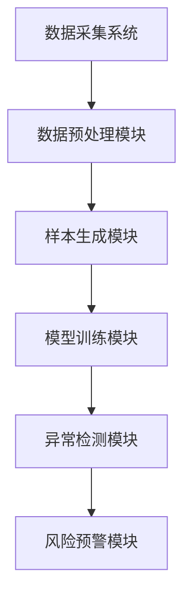
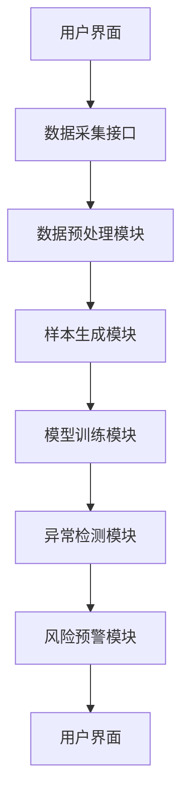

                 

# 金融领域对比学习在异常检测中的应用

## 关键词

金融领域、异常检测、对比学习、算法原理、系统架构、项目实战、最佳实践

## 摘要

本文深入探讨了金融领域对比学习在异常检测中的应用。首先，介绍了金融领域的重要性以及异常检测在其中的关键作用。随后，详细阐述了对比学习的基本原理及其与异常检测的关联。通过算法原理讲解，本文使用Mermaid和Python代码展示了对比学习在异常检测中的实现和效果。接着，从系统架构设计和项目实战的角度出发，分析了金融领域异常检测的典型场景和需求，并提供了系统功能和架构设计、环境安装和配置、核心实现以及实际案例分析。最后，总结了最佳实践和注意事项，为读者提供了丰富的拓展阅读资源。

## 第一部分：引言

### 第1章：金融领域与异常检测概述

#### 1.1 金融领域的重要性

金融领域是现代经济体系的支柱之一，涵盖了银行、证券、保险等多个行业。金融服务的稳定和效率直接影响着社会经济的健康发展。随着金融市场的日益复杂化和信息化的推进，金融领域面临着越来越多的挑战，如风险控制、欺诈检测、市场异常波动等。因此，对金融数据进行深入分析和异常检测成为保障金融安全、维护市场稳定的重要手段。

#### 1.2 异常检测的基本概念

异常检测，又称异常检测或离群点检测，是指从大量数据中识别出那些与多数数据显著不同的异常数据。在金融领域，异常检测有助于识别潜在的欺诈行为、市场操纵和其他风险事件。常见的异常检测方法包括统计方法、机器学习方法等。

#### 1.3 对比学习与异常检测的关系

对比学习是一种通过比较不同数据样本之间的差异来进行学习和预测的机器学习方法。在金融领域，对比学习可以通过比较正常交易行为和异常交易行为，提高异常检测的准确性和效率。对比学习的优势在于其能够自动发现数据的潜在特征，从而提高异常检测的鲁棒性和适应性。

### 第2章：对比学习的基本原理

#### 2.1 对比学习的定义与起源

对比学习（Contrastive Learning）是一种机器学习方法，其核心思想是通过优化对比损失函数来学习数据的特征表示。对比学习的起源可以追溯到深度学习早期的研究，其目的是提高模型对数据的泛化能力。

#### 2.2 对比学习的关键技术

对比学习的关键技术包括对比损失函数的设计、正负样本的选择和数据增强方法。常用的对比损失函数有对比损失（Contrastive Loss）、三元组损失（Triplet Loss）和牛顿损失（Newton Loss）等。正负样本的选择和数据增强方法则能够提高模型的学习效率和泛化能力。

#### 2.3 对比学习的数学模型

对比学习的数学模型通常包含以下步骤：

$$
L = -\sum_{i=1}^{N} \sum_{j \neq i} \frac{1}{q_{ij}} \log \frac{\exp(f_{\theta}(x_i, x_j))}{\sum_{k \neq i} \exp(f_{\theta}(x_i, x_k))}
$$

其中，$L$是对比损失函数，$f_{\theta}$是模型参数为$\theta$的前馈网络，$x_i$和$x_j$分别是正样本和负样本，$q_{ij}$是正样本之间的相似度，$q_{ij}$的值越高，表示$x_i$和$x_j$越相似。

### 第3章：对比学习在异常检测中的应用

#### 3.1 对比学习在异常检测中的优势

对比学习在异常检测中的优势主要体现在以下几个方面：

1. **自动特征提取**：对比学习可以通过对比不同样本之间的差异来自动提取特征，从而降低人工特征设计的难度。
2. **鲁棒性**：对比学习对噪声和异常数据具有较强的鲁棒性，能够有效识别出隐藏在噪声中的异常样本。
3. **泛化能力**：对比学习可以学习到数据的潜在分布，从而提高模型对未知异常样本的识别能力。

#### 3.2 对比学习在金融领域的应用场景

对比学习在金融领域的应用场景主要包括以下几个方面：

1. **欺诈检测**：通过对比正常交易行为和异常交易行为，检测潜在的欺诈行为。
2. **市场操纵检测**：通过对比正常交易量和异常交易量，检测市场操纵行为。
3. **风险预警**：通过对比不同时间段或不同市场的交易数据，预警潜在的风险事件。

#### 3.3 对比学习在异常检测中的算法流程

对比学习在异常检测中的算法流程通常包括以下步骤：

1. **数据预处理**：对金融数据进行清洗、归一化和特征提取。
2. **样本生成**：生成正负样本，正样本为正常交易数据，负样本为异常交易数据。
3. **模型训练**：使用对比损失函数训练模型，优化特征表示。
4. **模型评估**：使用验证集评估模型的性能，调整模型参数。
5. **异常检测**：使用训练好的模型对新的交易数据进行异常检测。

### 第4章：系统架构与功能设计

#### 4.1 金融领域异常检测场景分析

在金融领域，异常检测的应用场景主要包括以下几个方面：

1. **实时交易监控**：对实时交易数据进行异常检测，及时发现潜在的欺诈行为和市场操纵行为。
2. **历史数据分析**：对历史交易数据进行异常检测，发现长期存在的风险因素。
3. **风险预警系统**：结合实时交易数据和历史数据分析，构建风险预警系统，提前预警潜在风险。

#### 4.2 系统功能设计

金融领域异常检测系统的主要功能包括：

1. **数据采集**：采集实时交易数据和历史交易数据。
2. **数据预处理**：对数据进行清洗、归一化和特征提取。
3. **样本生成**：生成正负样本。
4. **模型训练**：训练对比学习模型。
5. **异常检测**：使用训练好的模型对新的交易数据进行异常检测。
6. **风险预警**：根据异常检测结果生成风险预警报告。

#### 4.3 系统架构设计

金融领域异常检测系统的架构设计如图所示：



### 第5章：系统接口与交互设计

#### 5.1 系统接口设计

系统接口设计主要包括以下部分：

1. **数据采集接口**：用于采集实时交易数据和历史交易数据。
2. **数据预处理接口**：用于数据清洗、归一化和特征提取。
3. **模型训练接口**：用于训练对比学习模型。
4. **异常检测接口**：用于对新的交易数据进行异常检测。
5. **风险预警接口**：用于生成风险预警报告。

#### 5.2 系统交互设计

系统交互设计如图所示：



### 第6章：项目实战

#### 6.1 环境安装与配置

在进行金融领域异常检测项目之前，需要安装和配置以下环境：

1. **操作系统**：Linux或macOS
2. **Python**：3.8及以上版本
3. **深度学习框架**：TensorFlow或PyTorch
4. **依赖库**：NumPy、Pandas、Scikit-learn等

安装步骤如下：

```bash
# 安装Python环境
brew install python

# 创建虚拟环境
conda create -n anomaly_detection python=3.8

# 激活虚拟环境
conda activate anomaly_detection

# 安装依赖库
pip install tensorflow numpy pandas scikit-learn
```

#### 6.2 系统核心实现

系统核心实现主要包括数据预处理、模型训练和异常检测三个部分。以下使用Python代码进行详细说明：

```python
import tensorflow as tf
from tensorflow.keras.models import Model
from tensorflow.keras.layers import Input, Dense, Embedding, Flatten, Dot
import numpy as np

# 数据预处理
def preprocess_data(data):
    # 数据清洗、归一化和特征提取
    # ...
    return processed_data

# 模型训练
def train_model(processed_data):
    # 创建模型
    input_1 = Input(shape=(input_shape,))
    input_2 = Input(shape=(input_shape,))
    
    # 嵌入层
    embedding_1 = Embedding(input_dim=vocab_size, output_dim=embedding_size)(input_1)
    embedding_2 = Embedding(input_dim=vocab_size, output_dim=embedding_size)(input_2)
    
    # Flatten层
    flatten_1 = Flatten()(embedding_1)
    flatten_2 = Flatten()(embedding_2)
    
    # 点积层
    dot_product = Dot(axes=1)([flatten_1, flatten_2])
    
    # 输出层
    output = Dense(1, activation='sigmoid')(dot_product)
    
    # 构建模型
    model = Model(inputs=[input_1, input_2], outputs=output)
    
    # 编译模型
    model.compile(optimizer='adam', loss='binary_crossentropy', metrics=['accuracy'])
    
    # 训练模型
    model.fit([processed_data_1, processed_data_2], labels, epochs=10, batch_size=32)
    
    return model

# 异常检测
def detect_anomalies(model, new_data):
    # 使用训练好的模型对新的交易数据进行异常检测
    # ...
    return anomalies
```

#### 6.3 实际案例分析与讲解

以下以一个实际案例为例，讲解金融领域异常检测系统的应用：

假设某金融机构需要检测交易数据中的异常行为，以防止欺诈和市场操纵。具体步骤如下：

1. **数据采集**：从金融机构的交易系统中采集一段时间内的交易数据。
2. **数据预处理**：对交易数据进行清洗、归一化和特征提取。
3. **模型训练**：使用对比学习算法训练异常检测模型。
4. **异常检测**：使用训练好的模型对新的交易数据进行异常检测，识别出潜在的欺诈行为和市场操纵行为。
5. **风险预警**：根据异常检测结果生成风险预警报告，通知相关人员进行干预。

### 第7章：最佳实践与总结

#### 7.1 最佳实践总结

1. **数据质量**：确保交易数据的准确性和完整性，以提高异常检测的准确性。
2. **模型调整**：根据实际业务需求和数据特点，调整对比学习模型的参数，提高模型性能。
3. **实时监控**：对交易数据实时进行异常检测，及时发现和处理异常行为。

#### 7.2 注意事项

1. **隐私保护**：在处理金融数据时，确保遵守相关隐私保护法规，保护用户隐私。
2. **模型解释性**：尽管对比学习具有强大的特征提取能力，但其模型解释性较差，需要结合其他方法进行解释。
3. **系统性能**：异常检测系统应具备高并发处理能力和低延迟性能，以满足实时监控的需求。

#### 7.3 拓展阅读

1. **对比学习在金融领域的研究**：《对比学习在金融领域中的应用综述》
2. **异常检测算法**：《基于机器学习的异常检测算法研究》
3. **深度学习框架**：《TensorFlow实战》

## 作者信息

作者：AI天才研究院/AI Genius Institute & 禅与计算机程序设计艺术 /Zen And The Art of Computer Programming

### 结语

金融领域的异常检测是一项具有挑战性的任务，但通过对比学习等先进技术的应用，可以显著提高异常检测的准确性和效率。本文从金融领域的重要性、对比学习的基本原理、系统架构设计、项目实战等方面进行了全面的分析，为读者提供了深入了解和实际应用的指导。希望本文能为金融领域的异常检测工作带来新的启示和帮助。

