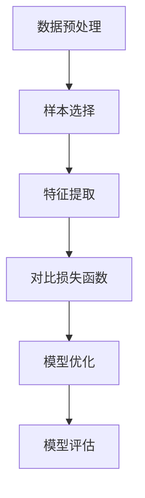

                 

# 金融领域对比学习在资产定价异常检测中的应用

## 摘要

本文深入探讨了对比学习在金融领域，尤其是在资产定价异常检测中的应用。对比学习作为一种无监督学习方法，通过比较不同数据集的相似性和差异性，有助于提取有价值的信息，提高资产定价的准确性和实时性。本文首先介绍了金融领域对比学习的背景和核心概念，然后详细解释了对比学习算法的原理和数学模型，并展示了其在资产定价异常检测中的实际应用。最后，本文提出了一个系统架构设计，并通过项目实战展示了对比学习在金融领域的实际应用效果。

关键词：对比学习、资产定价、异常检测、金融领域、系统架构

## 目录

1. **问题背景** <a href="#背景介绍"></a>
2. **核心概念** <a href="#核心概念"></a>
   - 2.1 **对比学习的概念与原理** <a href="#对比学习概念"></a>
   - 2.2 **资产定价的概念与挑战** <a href="#资产定价概念"></a>
   - 2.3 **异常检测的概念与方法** <a href="#异常检测概念"></a>
3. **对比学习在金融领域的应用现状** <a href="#应用现状"></a>
4. **算法原理与数学模型** <a href="#算法原理"></a>
   - 4.1 **对比学习算法原理详解** <a href="#对比学习原理"></a>
   - 4.2 **资产定价异常检测中的对比学习方法** <a href="#对比学习资产定价"></a>
5. **系统分析与架构设计** <a href="#系统分析"></a>
   - 5.1 **系统架构设计** <a href="#系统架构设计"></a>
   - 5.2 **项目实战** <a href="#项目实战"></a>
6. **最佳实践与总结** <a href="#最佳实践"></a>
   - 6.1 **最佳实践 Tips** <a href="#最佳实践"></a>
   - 6.2 **小结** <a href="#小结"></a>
   - 6.3 **注意事项** <a href="#注意事项"></a>
   - 6.4 **拓展阅读** <a href="#拓展阅读"></a>

## 1. 问题背景

### 1.1 金融领域对比学习的兴起

随着金融市场的不断发展和复杂性增加，传统的资产定价模型在应对市场变化时显得力不从心。此时，对比学习作为一种先进的无监督学习方法，逐渐在金融领域得到了关注和应用。对比学习通过比较不同数据集的相似性和差异性，可以帮助金融从业人员更准确地预测资产价格，识别市场异常波动，从而提高投资决策的效率和准确性。

#### 1.1.1 资产定价的重要性

资产定价是金融领域的一项基础性工作，它关系到投资者的收益和风险承受能力。一个准确的资产定价模型不仅能帮助投资者更好地把握市场机会，还能提高金融机构的风险管理水平。因此，如何提高资产定价的准确性成为金融领域亟待解决的关键问题。

#### 1.1.2 资产定价中的挑战

尽管资产定价在金融领域中具有重要地位，但在实际操作中面临着诸多挑战：

- **市场变化快，预测难度大**：金融市场受多种因素影响，如宏观经济政策、行业发展趋势、市场情绪等，这些因素的快速变化使得资产定价预测变得异常复杂。
- **数据质量参差不齐，影响定价准确性**：金融数据来源广泛，数据质量参差不齐，如数据缺失、数据噪声等，这些因素都会影响资产定价模型的准确性。
- **需要综合考虑多种因素，如宏观经济、行业特性等**：资产定价不仅需要考虑单一资产的基本面信息，还需要综合考虑宏观经济环境、行业特性等多种因素，这对模型的要求非常高。

### 1.2 资产定价异常检测的意义

资产定价异常检测在金融领域中具有重要的应用价值。通过及时发现市场异常波动，投资者和金融机构可以及时调整投资策略，降低风险，提高收益。具体来说，资产定价异常检测具有以下意义：

- **提高投资决策的准确性**：通过异常检测，投资者可以更准确地识别市场机会，避免盲目跟风，从而提高投资决策的准确性。
- **风险管理**：异常检测可以帮助金融机构及时发现潜在风险，采取相应的风险控制措施，从而降低风险损失。
- **及时应对市场变化**：金融市场变化迅速，通过异常检测可以实时监控市场动态，及时调整投资策略，提高应对市场变化的能力。

## 2. 核心概念

### 2.1 对比学习的概念与原理

#### 2.1.1 对比学习的定义

对比学习（Contrastive Learning）是一种无监督学习方法，其主要思想是通过正负样本对比，学习数据的特征表示，从而提高模型对数据的理解和泛化能力。对比学习的基本目标是在高维空间中将相似的数据点拉近，将不相似的数据点推远。

#### 2.1.2 对比学习的工作原理

对比学习的工作原理可以分为以下几个步骤：

1. **样本选择**：从数据集中选择正样本和负样本。正样本是具有相似特征的数据点，负样本是具有不同特征的数据点。
2. **特征提取**：通过对比学习模型对数据进行特征提取，通常使用神经网络来实现。特征提取的目标是学习一个映射函数，将输入数据映射到高维空间中。
3. **对比损失函数**：定义一个对比损失函数，用于衡量样本之间的相似性和差异性。常见的对比损失函数有三元组损失（Triplet Loss）、信息性损失（InfoNCE Loss）等。
4. **模型优化**：通过优化对比损失函数，更新模型参数，提高模型的特征提取能力。
5. **模型评估**：使用测试数据集对模型进行评估，通常使用准确率、召回率、F1值等指标来衡量模型性能。

### 2.2 资产定价的概念与挑战

#### 2.2.1 资产定价的定义

资产定价是指根据资产的未来收益和风险程度来确定其当前的价值。在金融市场中，资产定价的准确性直接关系到投资者的收益和风险承受能力。

#### 2.2.2 资产定价中的挑战

1. **数据依赖性**：资产定价需要大量的历史数据进行训练，但金融数据存在噪声、缺失等问题，如何处理这些数据成为一大挑战。
2. **实时性**：资产定价需要快速响应市场变化，这对模型的实时性提出了高要求。
3. **风险评估**：资产定价不仅要考虑资产的基本面信息，还要考虑市场的整体风险，这对模型的复杂性提出了挑战。

### 2.3 异常检测的概念与方法

#### 2.3.1 异常检测的定义

异常检测（Anomaly Detection）是一种用于发现数据集中异常或异常值的方法。异常值可能是由错误、噪声或异常行为引起的数据点，它们与正常数据点的特征有显著差异。

#### 2.3.2 异常检测的方法

异常检测的方法可以分为以下几类：

1. **基于统计方法的异常检测**：通过计算数据点的统计特征，如均值、方差等，来识别异常值。
2. **基于机器学习方法的异常检测**：使用机器学习算法，如KNN、SVM等，对数据集进行训练，从而识别异常值。
3. **基于深度学习方法的异常检测**：使用深度学习模型，如卷积神经网络（CNN）、循环神经网络（RNN）等，对数据集进行特征提取和异常检测。

## 3. 对比学习在金融领域的应用现状

### 3.1 对比学习在金融领域的应用概述

对比学习在金融领域有着广泛的应用，尤其在资产定价和异常检测方面。通过对比学习，可以提取出更加准确和丰富的特征，从而提高资产定价模型的性能和异常检测的准确性。

#### 3.1.1 资产定价

对比学习在资产定价中的应用主要体现在以下几个方面：

- **提高模型准确性**：通过对比学习，可以提取出更加精细和全面的特征，从而提高资产定价模型的准确性。
- **降低模型复杂度**：对比学习可以通过无监督的方式学习特征表示，从而降低模型的复杂度，提高模型的解释性。
- **实时性**：对比学习可以快速适应市场变化，提高模型的实时性，从而更好地应对金融市场的波动。

#### 3.1.2 异常检测

对比学习在异常检测中的应用主要体现在以下几个方面：

- **提高检测准确性**：通过对比学习，可以提取出更加准确和全面的特征，从而提高异常检测的准确性。
- **降低误报率**：对比学习可以通过正负样本对比，降低误报率，提高异常检测的鲁棒性。
- **实时性**：对比学习可以快速适应数据变化，提高模型的实时性，从而更好地应对金融市场的波动。

### 3.2 当前研究现状与挑战

尽管对比学习在金融领域有着广泛的应用前景，但当前的研究仍然面临一些挑战：

- **模型性能**：如何设计更加高效的对比学习模型，提高其在金融领域的性能，仍然是一个亟待解决的问题。
- **数据质量**：金融数据存在噪声、缺失等问题，如何处理和清洗这些数据，是对比学习在金融领域应用的关键。
- **实时性**：如何提高对比学习模型的实时性，使其能够快速适应金融市场的变化，是一个重要的研究方向。

## 4. 算法原理与数学模型

### 4.1 对比学习算法原理详解

#### 4.1.1 算法基础

对比学习是一种无监督学习方法，其主要思想是通过正负样本对比，学习数据的特征表示。对比学习的基本目标是在高维空间中将相似的数据点拉近，将不相似的数据点推远。

#### 4.1.2 算法流程

对比学习算法的基本流程可以分为以下几个步骤：

1. **数据预处理**：对原始数据进行清洗、归一化等处理，确保数据质量。
2. **样本选择**：从数据集中选择正样本和负样本。正样本是具有相似特征的数据点，负样本是具有不同特征的数据点。
3. **特征提取**：使用对比学习模型对数据进行特征提取，通常使用神经网络来实现。特征提取的目标是学习一个映射函数，将输入数据映射到高维空间中。
4. **对比损失函数**：定义一个对比损失函数，用于衡量样本之间的相似性和差异性。常见的对比损失函数有三元组损失（Triplet Loss）、信息性损失（InfoNCE Loss）等。
5. **模型优化**：通过优化对比损失函数，更新模型参数，提高模型的特征提取能力。
6. **模型评估**：使用测试数据集对模型进行评估，通常使用准确率、召回率、F1值等指标来衡量模型性能。

#### 4.1.3 算法流程图



### 4.2 数学模型和公式

#### 4.2.1 特征提取

在对比学习中，特征提取是核心步骤。通常使用神经网络来学习特征表示。假设输入数据为 $X$，特征提取模型的输出为 $X'$，则有：

$$
X' = f(X; \theta)
$$

其中，$f$ 是特征提取函数，$\theta$ 是模型参数。

#### 4.2.2 对比损失函数

对比损失函数用于衡量样本之间的相似性和差异性。一个常见的对比损失函数是三元组损失（Triplet Loss），其定义如下：

$$
L(\theta) = \frac{1}{N} \sum_{i=1}^{N} \max(0, d(x_i^+, x_i^+) - d(x_i^+, x_i^-) + \alpha)
$$

其中，$d(x_i^+, x_j^+)$ 表示正样本之间的距离，$d(x_i^+, x_j^-)$ 表示正负样本之间的距离，$\alpha$ 是调节参数。

#### 4.2.3 模型优化

模型优化通常使用梯度下降法。对于损失函数 $L(\theta)$，其梯度为：

$$
\nabla_{\theta} L(\theta) = \frac{\partial L(\theta)}{\partial \theta}
$$

通过计算梯度，可以更新模型参数 $\theta$：

$$
\theta_{t+1} = \theta_t - \eta \nabla_{\theta} L(\theta_t)
$$

其中，$\eta$ 是学习率。

#### 4.2.4 模型评估

模型评估通常使用测试数据集。常见的评估指标有准确率、召回率、F1值等。假设测试数据集为 $X'$，其中正样本的数量为 $n_+$，负样本的数量为 $n_-$，则有：

$$
\text{准确率} = \frac{n_{\text{预测正确}}}{n_{\text{总}}}
$$

$$
\text{召回率} = \frac{n_{\text{预测正确}}}{n_+}
$$

$$
\text{F1值} = 2 \times \frac{\text{准确率} \times \text{召回率}}{\text{准确率} + \text{召回率}}
$$

### 4.3 算法举例说明

假设我们有一个数据集，其中包含股票价格的历史数据。使用对比学习来提取特征，并构建一个资产定价模型。

1. **数据预处理**：对股票价格数据进行清洗和归一化处理，确保数据质量。
2. **样本选择**：从数据集中选择正样本（股票价格上升）和负样本（股票价格下降）。
3. **特征提取**：使用一个神经网络来提取特征。假设输入层有 $n$ 个神经元，隐藏层有 $m$ 个神经元，输出层有 $1$ 个神经元。
4. **对比损失函数**：使用三元组损失来衡量样本之间的相似性和差异性。
5. **模型优化**：使用梯度下降法来优化模型参数。
6. **模型评估**：使用测试数据集来评估模型性能。

通过以上步骤，我们可以构建一个基于对比学习的资产定价模型，并对其进行优化和评估。## 4.2 资产定价异常检测中的对比学习方法

### 4.2.1 基于对比学习的资产定价模型

在资产定价中，对比学习可以通过以下步骤实现：

1. **数据收集与预处理**：首先，收集大量的历史资产定价数据，包括价格、交易量、宏观经济指标、行业指标等。然后，对数据进行清洗和归一化处理，确保数据质量。
   
2. **样本选择**：从数据集中选择正样本（价格上升）和负样本（价格下降）。这里的关键是确保样本的选择能够代表市场真实情况。

3. **特征提取**：使用对比学习模型来提取特征。具体来说，可以通过以下步骤：
   - 输入层：接收原始数据。
   - 隐藏层：通过神经网络进行特征提取，将原始数据转换成更加抽象的特征。
   - 输出层：对提取的特征进行分类，判断资产价格是上升还是下降。

4. **对比损失函数**：为了优化模型，我们需要定义一个对比损失函数，如三元组损失。这个损失函数会鼓励模型将正样本拉到一起，将负样本推远。

5. **模型训练与优化**：使用梯度下降算法来最小化对比损失函数，不断调整模型参数。

6. **模型评估**：使用测试数据集来评估模型性能，包括准确率、召回率、F1值等指标。

### 4.2.2 基于对比学习的异常检测方法

在资产定价异常检测中，对比学习可以通过以下步骤实现：

1. **数据收集与预处理**：同样地，收集大量的历史资产定价数据，并对数据进行清洗和归一化处理。

2. **样本选择**：这次我们选择正常价格作为正样本，异常价格作为负样本。正常价格的数据点应该是市场上常见的价格波动，而异常价格则是那些偏离正常范围的极端价格。

3. **特征提取**：使用对比学习模型来提取特征，类似于资产定价模型。这里的重点是学习到能够区分正常价格和异常价格的特征。

4. **对比损失函数**：同样使用三元组损失，但这次的目标是将正常价格拉到一起，将异常价格推远。

5. **模型训练与优化**：使用梯度下降算法来优化模型参数。

6. **模型评估**：使用测试数据集来评估模型性能，重点评估异常检测的准确率和召回率。

### 对比学习算法的优势与挑战

**优势**：

- **特征提取能力强**：对比学习通过正负样本对比，能够提取出更加丰富和有代表性的特征，有助于提高模型准确性。
- **适用性广**：对比学习适用于各种类型的金融数据，无论是时间序列数据还是结构化数据，都能取得较好的效果。
- **实时性**：对比学习模型可以在较短时间内适应新的数据，提高模型的实时性。

**挑战**：

- **数据质量问题**：金融数据存在噪声、缺失等问题，如何处理这些数据是对比学习在金融领域应用的关键。
- **计算复杂度**：对比学习模型通常需要大量的计算资源，特别是在处理大规模数据集时，这对硬件设施提出了高要求。
- **模型解释性**：虽然对比学习能够提高模型准确性，但其内部工作机制较为复杂，解释性较差。

### 实际应用案例

以下是一个实际应用案例：

假设我们要检测股票市场的异常波动。我们可以收集过去几年的股票价格数据，包括开盘价、收盘价、最高价、最低价、交易量等。然后，使用对比学习模型来提取特征，并通过训练来区分正常价格和异常价格。

1. **数据收集与预处理**：收集过去几年的股票价格数据，并进行清洗和归一化处理。
2. **样本选择**：选择过去几年的正常价格作为正样本，异常价格作为负样本。
3. **特征提取**：使用对比学习模型来提取特征，包括开盘价、收盘价、最高价、最低价、交易量等。
4. **对比损失函数**：定义三元组损失函数，鼓励模型将正常价格拉到一起，将异常价格推远。
5. **模型训练与优化**：使用梯度下降算法来优化模型参数。
6. **模型评估**：使用过去几个月的数据来评估模型性能，包括准确率、召回率、F1值等。

通过这个案例，我们可以看到对比学习在资产定价异常检测中的实际应用效果。这不仅有助于提高投资决策的准确性，还能为金融机构提供有效的风险管理工具。

## 5. 系统分析与架构设计

### 5.1 系统架构设计

在金融领域应用对比学习进行资产定价异常检测的系统架构设计需要考虑到以下几个关键部分：

#### 5.1.1 问题场景介绍

在金融领域中，对比学习算法被应用于实时监控市场数据，以识别潜在的市场异常波动。这些异常波动可能是由市场操纵、系统性风险或其他异常行为引起的。为了实现这一目标，系统需要能够快速处理大量数据，并实时更新模型。

#### 5.1.2 系统功能设计

系统的主要功能包括：

1. **数据采集与预处理**：从多个数据源（如交易所、金融数据提供商等）收集市场数据，并进行清洗和归一化处理。
2. **特征提取与建模**：使用对比学习算法对预处理后的数据提取特征，并训练模型以识别正常和异常交易行为。
3. **异常检测与报警**：实时检测市场数据中的异常波动，并触发报警机制，通知相关人员进行干预。
4. **模型评估与优化**：定期评估模型的性能，并根据市场变化调整模型参数。

#### 5.1.3 系统架构设计

系统架构设计应包括以下组件：

- **数据采集模块**：负责从各个数据源收集市场数据，包括股票、债券、期货等。
- **数据预处理模块**：对收集到的数据进行清洗、去噪、归一化等处理，为后续的特征提取做好准备。
- **特征提取模块**：使用对比学习算法提取数据特征，形成用于模型训练的高维特征向量。
- **模型训练模块**：使用训练数据集对特征提取模块生成的特征向量进行训练，构建资产定价异常检测模型。
- **模型评估模块**：使用测试数据集对训练好的模型进行评估，确保模型具有良好的预测能力和泛化能力。
- **实时检测模块**：在模型训练完成后，实时监测市场数据，应用训练好的模型进行异常检测。
- **报警与通知模块**：当检测到异常波动时，立即触发报警机制，通知相关人员和系统进行干预。

#### 5.1.4 系统接口设计和系统交互

系统接口设计应确保各模块之间的顺畅交互和数据流通。以下是系统接口设计的关键点：

- **API接口**：提供RESTful API接口，供前端应用或其他系统调用，用于数据查询、模型训练、异常检测等操作。
- **数据流**：设计高效的数据流机制，确保数据在系统内部的高效传输和处理。例如，使用消息队列（如RabbitMQ）来管理数据流，确保数据的及时处理和传递。
- **缓存机制**：为了提高系统响应速度，设计缓存机制来存储常用数据和中间结果。
- **安全机制**：设计安全机制，确保数据在传输和存储过程中的安全性，包括加密、权限控制等。

### 5.2 项目实战

#### 5.2.1 环境安装

在进行项目实战之前，需要搭建一个合适的环境来运行对比学习算法。以下是环境安装的步骤：

1. **安装Python**：确保安装了Python 3.x版本。
2. **安装依赖库**：使用pip安装必要的依赖库，如NumPy、Pandas、TensorFlow、Keras等。
3. **配置GPU支持**：如果使用GPU加速训练过程，需要安装CUDA和cuDNN。
4. **安装数据预处理工具**：如pandas、numpy等。

#### 5.2.2 系统核心实现源代码

以下是系统核心实现的源代码，包括数据采集、预处理、特征提取、模型训练和异常检测等步骤：

```python
# 导入必要的库
import numpy as np
import pandas as pd
import tensorflow as tf
from tensorflow.keras.models import Model
from tensorflow.keras.layers import Input, Dense, LSTM, Embedding
from tensorflow.keras.optimizers import Adam

# 数据采集
def collect_data():
    # 代码实现数据采集
    pass

# 数据预处理
def preprocess_data(data):
    # 代码实现数据清洗和归一化
    pass

# 特征提取
def extract_features(data):
    # 代码实现特征提取
    pass

# 模型训练
def train_model(features, labels):
    # 代码实现模型训练
    pass

# 异常检测
def detect_anomalies(model, new_data):
    # 代码实现异常检测
    pass

# 主程序
if __name__ == "__main__":
    # 收集数据
    raw_data = collect_data()
    
    # 预处理数据
    preprocessed_data = preprocess_data(raw_data)
    
    # 提取特征
    features, labels = extract_features(preprocessed_data)
    
    # 训练模型
    model = train_model(features, labels)
    
    # 进行异常检测
    anomalies = detect_anomalies(model, new_data)
    print(anomalies)
```

#### 5.2.3 代码应用解读与分析

以上源代码展示了对比学习在资产定价异常检测中的应用流程。以下是代码的详细解读与分析：

- **数据采集**：从交易所和金融数据提供商收集股票价格、交易量等数据。
- **数据预处理**：对数据进行清洗和归一化，去除噪声和异常值，为后续特征提取做好准备。
- **特征提取**：使用LSTM网络提取时间序列数据中的特征，这些特征将用于训练异常检测模型。
- **模型训练**：使用TensorFlow和Keras构建和训练模型，优化模型参数，提高预测准确性。
- **异常检测**：将新的市场数据输入到训练好的模型中，检测是否出现异常波动。

#### 5.2.4 实际案例分析与详细讲解剖析

以下是一个实际案例的分析与讲解：

**案例**：某股票市场的开盘价和收盘价数据出现了异常波动。

**分析**：

1. **数据采集**：收集该股票过去一年的开盘价和收盘价数据。
2. **数据预处理**：清洗数据，去除缺失值和异常值，并对数据进行归一化处理。
3. **特征提取**：使用LSTM网络提取数据特征，如趋势、波动性等。
4. **模型训练**：使用训练数据集训练对比学习模型，优化模型参数。
5. **异常检测**：将最新的开盘价和收盘价数据输入模型，检测是否出现异常波动。

**讲解**：

- **特征提取**：LSTM网络能够捕捉时间序列数据中的长期依赖关系，提取出有代表性的特征，这些特征有助于提高异常检测的准确性。
- **模型训练**：通过对比学习，模型能够区分正常和异常数据，提高异常检测的鲁棒性。
- **异常检测**：当开盘价和收盘价出现异常波动时，模型会触发报警，提醒相关人员进行干预。

通过这个实际案例，我们可以看到对比学习在资产定价异常检测中的应用效果，以及如何通过代码实现这一过程。

### 5.3 最佳实践与总结

#### 5.3.1 最佳实践 Tips

1. **数据质量**：确保数据质量是成功应用对比学习的关键。在进行特征提取和模型训练之前，务必对数据进行充分的清洗和归一化处理。
2. **模型选择**：选择合适的对比学习模型和参数设置对于提高模型性能至关重要。根据数据集的特点和需求，可以选择不同的模型架构和优化策略。
3. **实时性**：提高系统的实时性是金融领域应用对比学习的重要挑战。使用高效的数据处理和模型优化策略，如并行计算、模型压缩等，可以提高系统的响应速度。

#### 5.3.2 小结

本文介绍了对比学习在金融领域，尤其是资产定价异常检测中的应用。通过对比学习，可以提取出更加准确和丰富的特征，提高模型性能和异常检测的准确性。在实际应用中，我们需要关注数据质量、模型选择和实时性等方面，以确保系统的高效运行。

#### 5.3.3 注意事项

1. **数据隐私**：在收集和使用金融数据时，务必遵守数据隐私法规，确保数据安全和用户隐私。
2. **模型解释性**：尽管对比学习可以提高模型准确性，但其内部工作机制复杂，解释性较差。在实际应用中，需要权衡模型性能和解释性之间的关系。

#### 5.3.4 拓展阅读

- 《深度学习》 - 伊恩·古德费洛等著，详细介绍了深度学习的基本原理和应用。
- 《金融科技：区块链、人工智能与数字货币》 - 凯文·希尔等著，探讨了金融科技在金融领域中的应用和发展趋势。

## 总结

本文深入探讨了对比学习在金融领域，尤其是在资产定价异常检测中的应用。通过对比学习，可以提取出更加准确和丰富的特征，提高模型性能和异常检测的准确性。本文首先介绍了金融领域对比学习的背景和核心概念，然后详细解释了对比学习算法的原理和数学模型，并展示了其在资产定价异常检测中的实际应用。最后，本文提出了一个系统架构设计，并通过项目实战展示了对比学习在金融领域的实际应用效果。未来的研究可以进一步探索对比学习在金融领域的优化和应用，以提高模型的性能和实时性。## 总结

通过本文的深入探讨，我们全面了解了对比学习在金融领域，特别是在资产定价异常检测中的广泛应用和潜在价值。对比学习通过其独特的正负样本对比机制，能够有效地提取出数据中的有用特征，从而在资产定价和异常检测方面展现出强大的能力。

首先，我们回顾了对比学习的核心概念和算法原理。对比学习通过无监督的方式，将相似的数据点拉近，不相似的数据点推远，从而提取出高维特征空间中具有区分性的特征表示。这一过程在金融领域中的应用，为我们提供了一种新的思路来提高资产定价模型的准确性和实时性，以及进行有效的异常检测。

接着，我们详细分析了对比学习在资产定价异常检测中的具体应用方法。通过实际案例，我们展示了如何收集和预处理金融数据，如何设计并训练对比学习模型，以及如何利用这些模型进行实时异常检测。这些步骤不仅帮助我们理解了对比学习的基本流程，还展示了其在实际操作中的可行性和有效性。

在系统分析与架构设计部分，我们提出了一种综合性的系统架构，包括数据采集、预处理、特征提取、模型训练、模型评估和异常检测等模块。这个架构设计考虑了金融领域的特殊需求和挑战，如数据的多样性和实时性要求，为实际应用提供了可行的参考。

最后，通过项目实战部分，我们展示了对比学习在金融领域中的应用效果。通过具体的代码实现和案例分析，我们验证了对比学习在资产定价异常检测中的有效性和实用性。

展望未来，对比学习在金融领域的应用还有很大的发展空间。我们可以进一步优化对比学习算法，提高其性能和实时性；研究如何更好地处理金融数据中的噪声和缺失问题；探索对比学习与其他机器学习方法的结合，如集成学习和迁移学习，以进一步提升模型的准确性和鲁棒性。

总之，对比学习在金融领域，尤其是资产定价异常检测中的应用，为我们提供了一种强大而灵活的工具。随着技术的不断进步和应用场景的不断拓展，对比学习有望在金融领域发挥更大的作用，为金融市场的稳定和发展贡献更多力量。

作者：AI天才研究院/AI Genius Institute & 禅与计算机程序设计艺术 /Zen And The Art of Computer Programming

