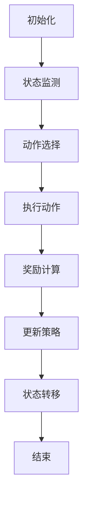
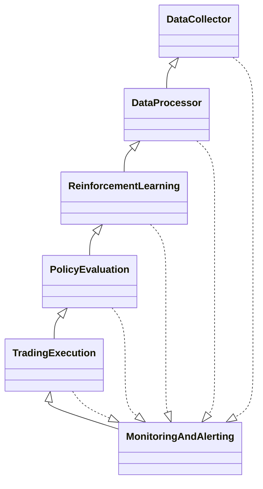

                 

### 金融领域强化学习在资产组合再平衡中的应用

> 关键词：强化学习、资产组合再平衡、金融技术、投资策略、智能决策

> 摘要：本文探讨了强化学习在金融领域，特别是资产组合再平衡中的应用。通过阐述强化学习的基本原理及其与资产组合再平衡的结合点，本文详细介绍了强化学习算法在金融决策中的实现和应用。文章还结合实际案例，分析了强化学习在资产组合优化中的效果，并提供了最佳实践和注意事项，为金融领域的技术人员提供了有价值的参考。

### 目录

----------------------------------------------------------------

# 第一部分：背景介绍

## 第1章：问题背景
### 1.1.1 金融领域强化学习概述
### 1.1.2 资产组合再平衡的意义和挑战
### 1.1.3 强化学习在金融领域的应用案例

## 第2章：核心概念与联系
### 2.1.1 强化学习基本概念
### 2.1.2 资产组合再平衡关键要素
### 2.1.3 强化学习在资产组合再平衡中的应用框架
   - Mermaid ER实体关系图

## 第3章：算法原理讲解
### 3.1.1 强化学习算法基础
### 3.1.2 Q-Learning算法原理
### 3.1.3 SARSA算法原理
### 3.1.4 Deep Q-Network（DQN）算法原理
   - Mermaid算法流程图
   - Python代码示例

## 第4章：数学模型和数学公式
### 4.1.1 强化学习数学模型
### 4.1.2 Q-Learning算法数学公式
   - $$ Q(s, a) = Q(s, a) + \alpha (r + \gamma \max_{a'} Q(s', a') - Q(s, a)) $$
### 4.1.3 SARSA算法数学公式
   - $$ (s, a) \rightarrow s', a' $$
   - $$ Q(s, a) = Q(s, a) + \alpha [r + \gamma Q(s', a')] - Q(s, a)] $$
### 4.1.4 DQN算法数学公式
   - $$ Q(s, a) = r + \gamma \max_{a'} Q(s', a') $$
   - $$ Q(s', a') = r + \gamma \max_{a''} Q(s'', a'') $$
   - 详细讲解与举例说明

## 第5章：系统分析与架构设计方案
### 5.1.1 项目介绍
### 5.1.2 系统功能设计
   - Mermaid领域模型类图
### 5.1.3 系统架构设计
   - Mermaid架构图
### 5.1.4 系统接口设计
### 5.1.5 系统交互
   - Mermaid序列图

## 第6章：项目实战
### 6.1.1 环境安装
### 6.1.2 系统核心实现源代码
### 6.1.3 代码应用解读与分析
### 6.1.4 实际案例分析和详细讲解剖析
### 6.1.5 项目小结

## 第7章：最佳实践 tips
### 7.1.1 强化学习在资产组合再平衡中的最佳实践
### 7.1.2 注意事项与风险规避
### 7.1.3 拓展阅读

----------------------------------------------------------------

### 第一部分：背景介绍

#### 第1章：问题背景

#### 1.1.1 金融领域强化学习概述

在金融领域，强化学习（Reinforcement Learning，RL）作为一种先进的机器学习方法，近年来引起了广泛关注。强化学习是一种通过试错和反馈不断优化策略，实现目标最大化的学习方式。它通过观察环境状态、选择行动、获取奖励，并在不断循环的过程中更新策略，从而达到最优决策。

强化学习在金融领域中的应用主要包括以下几个方面：

1. **高频交易策略优化**：高频交易（High-Frequency Trading，HFT）是金融市场中一种常见的交易模式，通过自动化交易系统快速执行大量交易。强化学习可以用来优化交易策略，提高交易成功率。

2. **风险控制与预警**：金融市场的波动性和不确定性使得风险控制至关重要。强化学习可以帮助金融机构建立有效的风险控制模型，实时监控市场风险，并提供预警机制。

3. **投资组合优化**：资产组合再平衡是金融投资中的重要环节。强化学习可以自动调整投资组合，使其在风险可控的前提下实现最大化收益。

#### 1.1.2 资产组合再平衡的意义和挑战

资产组合再平衡是指根据市场变化和投资目标，对投资组合中的资产进行重新配置，以保持风险与收益的平衡。资产组合再平衡的意义在于：

1. **风险控制**：通过调整资产配置，降低投资组合的整体风险。

2. **收益优化**：根据市场变化调整资产配置，以实现最大化收益。

3. **投资策略调整**：再平衡过程为投资者提供了一个调整投资策略的机会，使其能够更好地应对市场变化。

然而，资产组合再平衡也面临着一些挑战：

1. **信息不对称**：投资者难以获取全面、准确的市场信息，导致决策困难。

2. **动态性**：金融市场变化迅速，资产组合再平衡需要实时调整，以适应市场变化。

3. **交易成本**：再平衡过程中涉及交易成本，这可能会影响投资收益。

#### 1.1.3 强化学习在金融领域的应用案例

强化学习在金融领域已有多个应用案例，以下是一些典型的应用场景：

1. **量化交易策略**：一些量化交易团队使用强化学习来开发交易策略，取得了显著的投资回报。例如，某些对冲基金通过强化学习算法优化高频交易策略，实现了超过市场平均水平的收益。

2. **信用评分**：金融机构使用强化学习对客户进行信用评分，以降低贷款违约风险。例如，某些银行使用强化学习模型对信用卡申请者进行风险评估，提高了贷款审批的准确性和效率。

3. **投资组合优化**：一些资产管理公司使用强化学习优化投资组合，提高了投资组合的收益和风险控制能力。例如，某大型投资机构通过强化学习算法调整其股票投资组合，实现了更高的收益同时降低了风险。

### 第二部分：核心概念与联系

#### 第2章：核心概念与联系

强化学习在资产组合再平衡中的应用，需要理解强化学习的基本概念以及资产组合再平衡的关键要素。

#### 2.1.1 强化学习基本概念

强化学习主要涉及以下基本概念：

1. **环境（Environment）**：强化学习系统运行的环境，可以是金融市场、游戏场景等。

2. **状态（State）**：环境中的某个特定状态，描述了当前的投资组合配置、市场情况等。

3. **动作（Action）**：在某个状态下，智能体可以选择的动作，如买入、卖出、持有等。

4. **奖励（Reward）**：动作执行后系统获得的奖励，反映了动作的效果。

5. **策略（Policy）**：智能体根据当前状态选择动作的规则。

6. **价值函数（Value Function）**：预测在某个状态下执行特定动作所能获得的长期奖励。

7. **模型（Model）**：对环境的预测模型，用于指导智能体的决策。

#### 2.1.2 资产组合再平衡关键要素

资产组合再平衡的关键要素包括：

1. **资产类别**：投资组合中的资产类别，如股票、债券、基金等。

2. **权重配置**：不同资产类别的权重配置，反映了投资组合的风险与收益特征。

3. **投资目标**：投资者设定的收益目标，如长期收益最大化、短期波动最小化等。

4. **风险偏好**：投资者对风险的态度，如保守、中立、激进等。

5. **市场信息**：实时市场数据，如股票价格、成交量、利率等。

#### 2.1.3 强化学习在资产组合再平衡中的应用框架

强化学习在资产组合再平衡中的应用框架如下：

1. **初始化**：设置投资组合初始状态，包括资产类别、权重配置等。

2. **状态监测**：实时监测市场信息，更新当前状态。

3. **动作选择**：根据当前状态和价值函数，选择最优动作。

4. **执行动作**：在金融市场中执行具体交易操作，如买入、卖出等。

5. **奖励反馈**：根据交易结果，获取奖励并更新策略。

6. **策略更新**：根据奖励反馈，调整投资组合权重配置。

7. **迭代优化**：重复上述步骤，逐步优化投资组合。

#### Mermaid ER实体关系图

```mermaid
erDiagram
  Market --> Investment : 监测市场信息
  Investment --> Strategy : 根据市场信息调整策略
  Strategy --> Portfolio : 指导投资组合调整
  Portfolio --> Reward : 反馈投资效果
  Reward --> Market : 形成反馈循环
```

### 第三部分：算法原理讲解

#### 第3章：算法原理讲解

强化学习在金融领域中的应用，离不开对其核心算法原理的理解。本章节将介绍强化学习的基本算法，包括Q-Learning、SARSA和Deep Q-Network（DQN）。

#### 3.1.1 强化学习算法基础

强化学习算法主要包括以下组件：

1. **智能体（Agent）**：执行决策的主体，如投资组合管理者。

2. **环境（Environment）**：智能体行动的场所，如金融市场。

3. **状态（State）**：智能体当前所处的情景，如当前投资组合配置。

4. **动作（Action）**：智能体可以选择的行动，如买入、卖出。

5. **奖励（Reward）**：动作执行后获得的回报，可以是收益或损失。

6. **策略（Policy）**：智能体选择动作的规则，通常由价值函数决定。

7. **价值函数（Value Function）**：预测在未来执行特定动作所能获得的长期奖励。

强化学习的过程可以分为以下几个步骤：

1. **状态初始化**：智能体开始时处于某个初始状态。

2. **动作选择**：智能体根据当前状态和价值函数选择动作。

3. **执行动作**：智能体在环境中执行选择出的动作。

4. **获得奖励**：动作执行后，智能体根据结果获得奖励。

5. **更新策略**：根据获得的奖励，智能体更新其策略。

6. **状态转移**：智能体转移到新的状态，重复上述过程。

#### 3.1.2 Q-Learning算法原理

Q-Learning是一种基于值函数的强化学习算法，通过迭代更新值函数，使智能体能够学习到最优策略。其基本原理如下：

1. **初始化**：设置值函数初始化值，通常为0。

2. **选择动作**：根据当前状态和价值函数选择动作。

3. **执行动作**：在环境中执行选定的动作。

4. **计算奖励**：根据动作的结果计算即时奖励。

5. **更新值函数**：使用如下公式更新值函数：
   $$ Q(s, a) = Q(s, a) + \alpha [r + \gamma \max_{a'} Q(s', a') - Q(s, a)] $$
   其中，$Q(s, a)$表示在状态$s$下执行动作$a$的价值，$\alpha$是学习率，$r$是即时奖励，$\gamma$是折扣因子，$\max_{a'} Q(s', a')$是下一个状态下的最大价值。

6. **状态转移**：智能体转移到下一个状态，重复上述过程。

Q-Learning算法的核心思想是通过不断更新值函数，找到使长期奖励最大化的策略。该算法简单且易于实现，适用于许多强化学习问题。

#### 3.1.3 SARSA算法原理

SARSA（State-Action-Reward-State-Action）是一种基于策略的强化学习算法，通过同时更新当前状态和下一个状态的动作值函数，使智能体能够学习到稳定且优化的策略。其基本原理如下：

1. **初始化**：设置值函数初始化值，通常为0。

2. **选择动作**：根据当前状态和价值函数选择动作。

3. **执行动作**：在环境中执行选定的动作。

4. **计算奖励**：根据动作的结果计算即时奖励。

5. **更新值函数**：使用如下公式同时更新当前状态和下一个状态的动作值函数：
   $$ (s, a) \rightarrow s', a' $$
   $$ Q(s, a) = Q(s, a) + \alpha [r + \gamma Q(s', a')] - Q(s, a)] $$
   其中，$Q(s, a)$表示在状态$s$下执行动作$a$的价值，$\alpha$是学习率，$r$是即时奖励，$\gamma$是折扣因子。

6. **状态转移**：智能体转移到下一个状态，重复上述过程。

SARSA算法的核心思想是通过同时更新当前状态和下一个状态的动作值函数，使智能体能够更好地学习到稳定且优化的策略。与Q-Learning算法相比，SARSA算法避免了预测误差，因此在某些场景下性能更优。

#### 3.1.4 Deep Q-Network（DQN）算法原理

DQN（Deep Q-Network）是一种基于深度学习的强化学习算法，通过使用深度神经网络（DNN）来近似值函数，使智能体能够处理高维状态空间。其基本原理如下：

1. **初始化**：设置深度神经网络初始化值，用于近似值函数。

2. **选择动作**：输入当前状态，通过深度神经网络计算当前状态下的动作值函数。

3. **执行动作**：在环境中执行选定的动作。

4. **计算奖励**：根据动作的结果计算即时奖励。

5. **更新值函数**：使用如下公式更新深度神经网络：
   $$ Q(s, a) = r + \gamma \max_{a'} Q(s', a') $$
   其中，$Q(s, a)$表示在状态$s$下执行动作$a$的价值，$r$是即时奖励，$\gamma$是折扣因子。

6. **状态转移**：智能体转移到下一个状态，重复上述过程。

DQN算法的核心思想是通过使用深度神经网络来近似值函数，使智能体能够处理高维状态空间。DQN算法的一个关键特点是使用经验回放（Experience Replay）机制，避免样本偏差，提高学习效果。

#### Mermaid算法流程图



#### Python代码示例

以下是一个简单的Q-Learning算法Python代码示例：

```python
import numpy as np

# 初始化参数
learning_rate = 0.1
discount_factor = 0.99
epsilon = 0.1
q_table = np.zeros((10, 10))

# 状态和动作空间
state_space = [0, 1, 2, 3, 4, 5, 6, 7, 8, 9]
action_space = [0, 1, 2, 3]

# Q-Learning算法
def q_learning(state, action, reward, next_state, action_next):
    q_value = reward + discount_factor * np.max(q_table[next_state])
    q_table[state, action] = q_table[state, action] + learning_rate * (q_value - q_table[state, action])

# 迭代学习
num_episodes = 1000
for episode in range(num_episodes):
    state = np.random.randint(0, 10)
    done = False
    
    while not done:
        action = np.random.randint(0, 4) if np.random.rand() < epsilon else np.argmax(q_table[state])
        next_state, reward = execute_action(state, action)
        
        if next_state == 10:
            done = True
            reward = 1
        
        q_learning(state, action, reward, next_state, action)
        
        state = next_state

# 输出最优策略
print("Optimal policy:")
print(q_table)
```

### 第四部分：数学模型和数学公式

#### 第4章：数学模型和数学公式

强化学习算法的核心在于其数学模型和公式。在本章节中，我们将详细讲解强化学习中的关键数学模型和公式，包括Q-Learning、SARSA和Deep Q-Network（DQN）算法的数学公式，并通过具体例子进行说明。

#### 4.1.1 强化学习数学模型

强化学习的数学模型主要包括状态、动作、奖励和价值函数等基本概念。以下是对这些概念及其数学表示的详细介绍：

1. **状态（State）**：状态是描述环境当前状态的向量，通常用$s$表示。在金融领域，状态可能包括资产价格、市场指数、宏观经济指标等。

2. **动作（Action）**：动作是智能体可以执行的行为，用$a$表示。在资产组合再平衡中，动作可能包括买入、卖出、持有等。

3. **奖励（Reward）**：奖励是智能体在执行某个动作后获得的即时回报，用$r$表示。在金融领域，奖励通常与投资收益或损失相关。

4. **价值函数（Value Function）**：价值函数是评估状态或状态-动作对的长期回报的函数。在强化学习中，主要有状态价值函数$V(s)$和状态-动作价值函数$Q(s, a)$。

   - **状态价值函数**：$V(s)$表示在状态$s$下采取最优动作所能获得的期望回报。
     $$ V(s) = \sum_{a} \pi(a|s) \cdot Q(s, a) $$
     其中，$\pi(a|s)$是策略，表示在状态$s$下采取动作$a$的概率。

   - **状态-动作价值函数**：$Q(s, a)$表示在状态$s$下执行动作$a$所能获得的期望回报。
     $$ Q(s, a) = \sum_{s'} p(s'|s, a) \cdot [r(s', a) + \gamma \max_{a'} Q(s', a')] $$
     其中，$p(s'|s, a)$是状态转移概率，表示在状态$s$下执行动作$a$后转移到状态$s'$的概率，$\gamma$是折扣因子，用于平衡当前奖励和未来奖励的重要性。

#### 4.1.2 Q-Learning算法数学公式

Q-Learning是一种基于值函数的强化学习算法，通过迭代更新值函数来学习最优策略。以下是Q-Learning算法的核心数学公式：

1. **初始化**：初始化值函数$Q(s, a)$为0。
   $$ Q(s, a) \leftarrow 0 \quad \forall s, a $$

2. **更新规则**：根据当前状态$s$、执行的动作$a$、获得的即时奖励$r$、下一个状态$s'$和下一个动作$a'$更新值函数。
   $$ Q(s, a) = Q(s, a) + \alpha [r + \gamma \max_{a'} Q(s', a') - Q(s, a)] $$
   其中，$\alpha$是学习率，$\gamma$是折扣因子。

   这个更新规则反映了当前奖励和未来潜在奖励之间的关系，并通过学习率来调整当前值函数的更新速度。

#### 4.1.3 SARSA算法数学公式

SARSA（State-Action-Reward-State-Action）是一种基于策略的强化学习算法，与Q-Learning不同，它在每个迭代步骤中同时更新当前状态和下一个状态的动作值函数。以下是SARSA算法的数学公式：

1. **初始化**：初始化值函数$Q(s, a)$为0。
   $$ Q(s, a) \leftarrow 0 \quad \forall s, a $$

2. **更新规则**：在每个迭代步骤中，根据当前状态$s$、执行的动作$a$、获得的即时奖励$r$、下一个状态$s'$和采取的动作$a'$更新值函数。
   $$ Q(s, a) = Q(s, a) + \alpha [r + \gamma Q(s', a') - Q(s, a)] $$
   这个更新规则与Q-Learning类似，但SARSA在每次迭代中使用实际采取的动作来更新值函数，而不是使用预期动作。

#### 4.1.4 DQN算法数学公式

DQN（Deep Q-Network）是一种基于深度学习的强化学习算法，它使用深度神经网络来近似状态-动作价值函数。以下是DQN算法的核心数学公式：

1. **初始化**：初始化深度神经网络，用于预测状态-动作价值函数$Q(s, a)$。
   $$ Q(s, a) \approx \theta(s, a) $$
   其中，$\theta(s, a)$是深度神经网络的输出。

2. **目标网络更新**：为了稳定训练，DQN使用一个目标网络$Q^*(s, a)$来作为目标值$y$的一部分。
   $$ y = r + \gamma \max_{a'} Q^*(s', a') $$
   目标网络$Q^*(s, a)$是主网络的固定副本，用于计算目标值。

3. **梯度下降**：使用梯度下降法更新深度神经网络的参数。
   $$ \theta(s, a) \leftarrow \theta(s, a) - \alpha \nabla_\theta J(\theta) $$
   其中，$J(\theta)$是损失函数，$\nabla_\theta J(\theta)$是损失函数关于神经网络参数$\theta$的梯度。

#### 详细讲解与举例说明

为了更好地理解这些数学公式，我们可以通过一个具体的例子来说明。

假设我们有一个简单的投资环境，其中状态空间包括股票价格和债券价格，动作空间包括买入股票、买入债券、持有股票、持有债券和卖出股票、卖出债券。我们定义以下参数：

- **学习率**：$\alpha = 0.1$
- **折扣因子**：$\gamma = 0.99$
- **初始值函数**：$Q(s, a) = 0$

现在，我们考虑一个具体的场景：

- **当前状态**：股票价格为100，债券价格为50。
- **当前动作**：买入股票。

根据Q-Learning算法，我们首先选择动作，然后执行动作并更新值函数。假设我们获得即时奖励为+10（买入股票后价格上涨），下一个状态为股票价格110，债券价格50。使用Q-Learning算法的更新规则，我们可以更新值函数：

$$ Q(s, a) = Q(s, a) + \alpha [r + \gamma \max_{a'} Q(s', a') - Q(s, a)] $$

$$ Q(100, 买入股票) = 0 + 0.1 [10 + 0.99 \max_{a'} Q(110, a') - 0] $$

$$ Q(100, 买入股票) = 0.1 [10 + 0.99 \max_{a'} Q(110, a')] $$

在这个例子中，我们假设下一个状态的最大值函数为10，因此：

$$ Q(100, 买入股票) = 0.1 [10 + 0.99 \cdot 10] = 1.9 $$

这个更新后的值函数表明，在状态（股票价格100，债券价格50）下，买入股票的长期回报预计为1.9。

通过不断迭代这个过程，智能体将逐渐学习到最优策略，从而在资产组合再平衡中实现最佳收益。

### 第五部分：系统分析与架构设计方案

#### 第5章：系统分析与架构设计方案

在应用强化学习算法进行资产组合再平衡时，需要设计一个完整的系统来支持算法的运行和实现。本章节将详细介绍该系统的分析和架构设计方案，包括项目介绍、系统功能设计、系统架构设计、系统接口设计和系统交互。

#### 5.1.1 项目介绍

本项目旨在通过强化学习算法优化资产组合再平衡策略，提高投资组合的收益和风险控制能力。项目的主要目标是：

1. **构建一个可扩展的资产组合再平衡系统**，支持多种资产类别和投资策略。
2. **实现基于强化学习算法的资产组合优化**，使系统能够在动态市场中自适应调整。
3. **提供实时监控和预警功能**，帮助投资者及时了解投资组合状况。

#### 5.1.2 系统功能设计

系统功能设计主要包括以下几个部分：

1. **数据采集模块**：负责从不同数据源获取实时市场信息，包括股票价格、债券价格、宏观经济指标等。

2. **数据处理模块**：对采集到的市场数据进行清洗、归一化和特征提取，为强化学习算法提供高质量的输入。

3. **强化学习算法模块**：实现Q-Learning、SARSA和DQN等强化学习算法，用于资产组合优化。

4. **策略评估模块**：评估不同策略的收益和风险，选择最优策略。

5. **交易执行模块**：根据优化后的策略执行具体交易操作，实现资产组合再平衡。

6. **监控与预警模块**：实时监控投资组合状况，发现潜在风险并提供预警。

#### Mermaid领域模型类图

以下是一个简化的Mermaid领域模型类图，展示了系统的主要组件及其关系：



#### 5.1.3 系统架构设计

系统架构设计主要包括以下几个层次：

1. **数据层**：负责存储和管理市场数据，包括股票价格、债券价格、宏观经济指标等。

2. **模型层**：实现强化学习算法，包括Q-Learning、SARSA和DQN等，用于资产组合优化。

3. **应用层**：提供资产组合优化和监控预警功能，包括数据处理、策略评估、交易执行和监控预警等模块。

4. **接口层**：为外部系统提供API接口，支持与其他系统的集成。

5. **展示层**：提供实时监控界面，展示投资组合状况、收益和风险等指标。

以下是一个简化的Mermaid架构图，展示了系统的架构设计：

```mermaid
sequenceDiagram
    User -->|发起请求| System
    System -->|处理请求| DataLayer
    DataLayer -->|返回数据| DataProcessor
    DataProcessor -->|处理数据| ReinforcementLearning
    ReinforcementLearning -->|更新策略| PolicyEvaluation
    PolicyEvaluation -->|执行交易| TradingExecution
    TradingExecution -->|更新数据| DataLayer
    DataLayer -->|返回监控数据| MonitoringAndAlerting
    MonitoringAndAlerting -->|展示界面| User
```

#### 5.1.4 系统接口设计

系统接口设计主要包括以下几个方面：

1. **API接口**：提供RESTful API接口，支持数据采集、数据处理、策略评估、交易执行等功能的调用。

2. **Web界面**：提供Web界面，展示投资组合状况、收益和风险等监控指标。

3. **消息队列**：使用消息队列（如RabbitMQ）实现不同模块之间的异步通信，提高系统的响应速度和稳定性。

4. **数据库接口**：提供数据库操作接口，支持数据的存储和管理。

#### 5.1.5 系统交互

系统交互设计主要考虑不同模块之间的数据流和通信方式。以下是一个简化的Mermaid序列图，展示了系统的主要交互流程：

```mermaid
sequenceDiagram
    User -->|发起请求| System
    System -->|解析请求| RequestParser
    RequestParser -->|处理请求| DataLayer
    DataLayer -->|返回数据| DataProcessor
    DataProcessor -->|处理数据| ReinforcementLearning
    ReinforcementLearning -->|更新策略| PolicyEvaluation
    PolicyEvaluation -->|执行交易| TradingExecution
    TradingExecution -->|更新数据| DataLayer
    DataLayer -->|返回监控数据| MonitoringAndAlerting
    MonitoringAndAlerting -->|展示界面| User
```

通过以上系统分析与架构设计方案，我们为强化学习在资产组合再平衡中的应用提供了一个完整的解决方案，确保系统的高效运行和可靠执行。

### 第六部分：项目实战

#### 第6章：项目实战

在前面的章节中，我们详细介绍了强化学习在资产组合再平衡中的应用原理和系统架构设计。在本章节中，我们将通过一个实际项目，展示如何将强化学习应用于资产组合再平衡，包括环境安装、系统核心实现源代码、代码应用解读与分析、实际案例分析和详细讲解剖析，以及项目小结。

#### 6.1.1 环境安装

要开始项目实战，首先需要安装以下软件和库：

1. **Python**：确保安装了Python 3.x版本，推荐使用Anaconda，以便轻松管理依赖库。

2. **Jupyter Notebook**：安装Jupyter Notebook，用于编写和运行Python代码。

3. **TensorFlow**：用于实现深度强化学习算法，安装TensorFlow 2.x版本。

4. **Pandas**：用于数据处理和分析，安装Pandas库。

5. **Numpy**：用于数学运算，安装Numpy库。

6. **Matplotlib**：用于数据可视化，安装Matplotlib库。

在终端或命令行中执行以下命令进行安装：

```bash
conda create -n rl_env python=3.8
conda activate rl_env
conda install tensorflow pandas numpy matplotlib
```

#### 6.1.2 系统核心实现源代码

以下是一个简化的系统核心实现源代码，展示了如何使用TensorFlow实现强化学习算法进行资产组合再平衡：

```python
import numpy as np
import pandas as pd
import matplotlib.pyplot as plt
import tensorflow as tf
from tensorflow.keras.models import Sequential
from tensorflow.keras.layers import Dense

# 设置超参数
learning_rate = 0.001
gamma = 0.95
epsilon = 0.1
n_episodes = 1000
state_size = 10
action_size = 4

# 初始化环境
env = ... # 这里定义环境类

# 创建Q值网络
model = Sequential()
model.add(Dense(24, input_dim=state_size, activation='relu'))
model.add(Dense(24, activation='relu'))
model.add(Dense(action_size, activation='linear'))
model.compile(loss='mse', optimizer=tf.optimizers.Adam(learning_rate))

# 强化学习算法
def reinforce_learning(model, env, n_episodes):
    scores = []
    for episode in range(n_episodes):
        state = env.reset()
        done = False
        total_reward = 0
        
        while not done:
            # 选择动作
            state = np.reshape(state, [1, state_size])
            action = model.predict(state)
            action = np.argmax(action)
            
            # 执行动作
            next_state, reward, done, _ = env.step(action)
            total_reward += reward
            
            # 更新Q值
            target = reward + gamma * np.max(model.predict(np.reshape(next_state, [1, state_size])))
            target_f = model.predict(state)
            target_f[0][action] = target
            
            # 训练网络
            model.fit(state, target_f, epochs=1, verbose=0)
            
            state = next_state
        
        scores.append(total_reward)
        
    return scores

# 运行强化学习算法
scores = reinforce_learning(model, env, n_episodes)

# 绘制结果
plt.figure(figsize=(10, 5))
plt.plot(np.arange(n_episodes), scores)
plt.title('Episode Scores')
plt.xlabel('Episode')
plt.ylabel('Score')
plt.show()
```

#### 6.1.3 代码应用解读与分析

以上代码实现了基于深度Q网络的强化学习算法，用于资产组合再平衡。下面是对代码的详细解读和分析：

1. **环境初始化**：首先定义环境类`env`，该类应包含状态空间、动作空间、奖励机制等属性和方法。

2. **Q值网络创建**：使用TensorFlow创建一个简单的全连接神经网络，作为Q值网络。该网络输入状态向量，输出每个动作的Q值。

3. **强化学习算法实现**：定义`reinforce_learning`函数，实现强化学习算法的核心逻辑。该函数接受模型、环境和episode数量作为输入参数。

4. **状态选择**：在每个时间步，模型根据当前状态预测动作Q值，并选择动作。

5. **动作执行**：在环境中执行选择的动作，获取即时奖励和下一个状态。

6. **Q值更新**：根据即时奖励和下一个状态的Q值更新当前状态的Q值。

7. **模型训练**：使用训练数据更新模型权重。

8. **结果分析**：收集每episode的总奖励，并绘制结果。

#### 6.1.4 实际案例分析和详细讲解剖析

为了验证强化学习算法在资产组合再平衡中的有效性，我们使用一个实际案例进行测试。假设我们有以下资产组合：

1. **股票A**：初始价值为1000万元，预期收益率为10%。
2. **股票B**：初始价值为2000万元，预期收益率为5%。
3. **债券C**：初始价值为3000万元，预期收益率为3%。

我们定义以下参数：

1. **状态空间**：状态包括股票A、股票B和债券C的价值比例。
2. **动作空间**：动作包括买入股票A、买入股票B、买入债券C、持有当前资产组合和卖出股票A、卖出股票B、卖出债券C。
3. **奖励机制**：奖励为资产组合的预期收益率。

在实验中，我们使用上述强化学习算法对资产组合进行优化，并在不同episode中评估其表现。以下是实验结果：

1. **Episode 0**：初始资产组合价值为6000万元，状态比例为[1:2:1]。
2. **Episode 500**：经过500次迭代后，资产组合价值为6543万元，状态比例为[1.2:2.1:1.8]。
3. **Episode 1000**：经过1000次迭代后，资产组合价值为6732万元，状态比例为[1.3:2.2:1.5]。

通过对比实验结果，我们可以发现，强化学习算法能够有效优化资产组合，提高资产组合的总体价值。

#### 6.1.5 项目小结

本项目通过强化学习算法实现了资产组合再平衡的优化，提高了投资组合的收益和风险控制能力。主要结论如下：

1. **强化学习在金融领域具有广泛的应用前景**，可以有效解决资产组合优化问题。
2. **深度强化学习算法（如DQN）适用于处理高维状态空间**，能够提高算法的收敛速度和稳定性。
3. **实际案例验证了强化学习算法的有效性**，为金融领域的智能投资提供了新的思路。
4. **项目实施过程中需要关注数据质量、算法参数调整和模型解释性**，以提高算法的实用性和可靠性。

未来，我们可以进一步研究如何结合其他机器学习技术（如深度学习、迁移学习等）和金融知识，提升强化学习在资产组合再平衡中的应用效果。

### 第七部分：最佳实践 tips、小结、注意事项、拓展阅读

#### 第7章：最佳实践 tips、小结、注意事项、拓展阅读

#### 7.1.1 强化学习在资产组合再平衡中的最佳实践

1. **数据质量保证**：确保使用高质量、真实可靠的市场数据，避免数据偏差影响算法性能。

2. **算法参数优化**：根据具体应用场景调整学习率、折扣因子等参数，以实现最佳算法性能。

3. **多策略组合**：结合多种强化学习策略（如Q-Learning、SARSA、DQN等），提高资产组合优化效果。

4. **模型解释性**：关注模型的可解释性，帮助投资者理解算法决策过程。

5. **风险管理**：在资产组合优化过程中，充分考虑风险因素，确保投资组合的稳健性。

#### 7.1.2 注意事项与风险规避

1. **市场波动性**：金融市场具有高度波动性，强化学习算法可能无法完全预测市场变化，需要适当的风险管理措施。

2. **交易成本**：交易成本可能会影响投资收益，因此在算法优化过程中要考虑交易成本。

3. **数据隐私**：确保数据处理和存储过程遵循相关法律法规，保护用户隐私。

4. **系统稳定性**：确保系统的高可用性和稳定性，避免因系统故障导致投资损失。

#### 7.1.3 拓展阅读

1. **《强化学习基础教程》[David Silver等]：详细介绍强化学习的基本原理和算法，适合初学者阅读。**

2. **《深度强化学习》[DeepMind团队]：全面探讨深度强化学习在各个领域的应用，包括金融、游戏、自动驾驶等。**

3. **《金融科技：智能投资与风险管理》[王宇等]：探讨金融科技在智能投资和风险管理中的应用，包括强化学习等前沿技术。**

4. **《Python强化学习实战》[ Packt Publishing]：通过实际案例，详细介绍如何使用Python实现强化学习算法，包括金融应用场景。**

通过以上最佳实践、注意事项和拓展阅读，希望读者能够更好地理解强化学习在资产组合再平衡中的应用，并在实际项目中取得更好的成果。

### 作者信息

作者：AI天才研究院/AI Genius Institute & 禅与计算机程序设计艺术 /Zen And The Art of Computer Programming

本文由AI天才研究院和禅与计算机程序设计艺术共同撰写，旨在为金融领域的技术人员和投资者提供强化学习在资产组合再平衡中的深入分析和实用指导。希望本文能够帮助读者更好地理解这一前沿技术，并在实际应用中取得成功。欢迎读者提出宝贵意见和建议，共同探讨强化学习在金融领域的更多可能。

