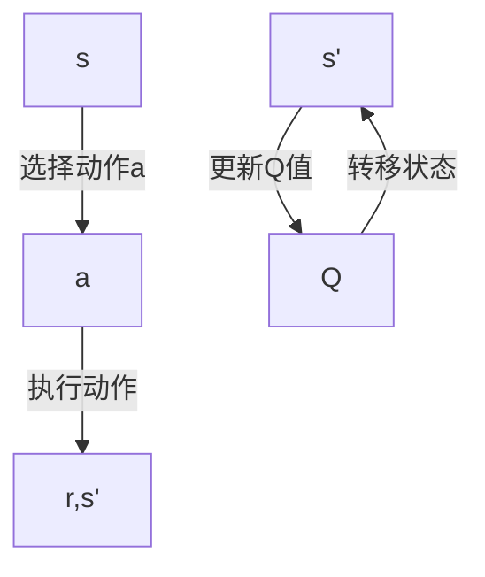
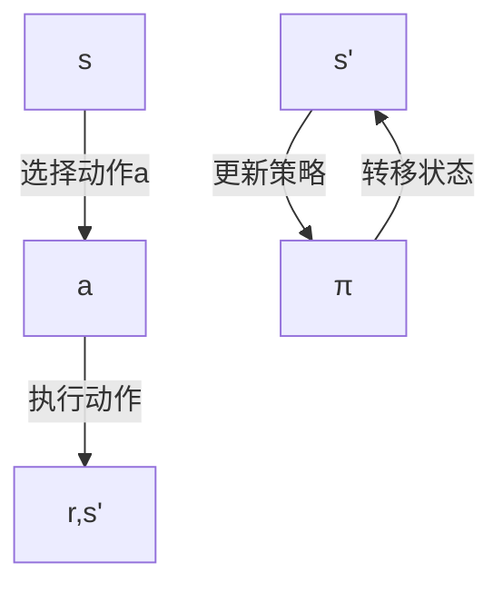
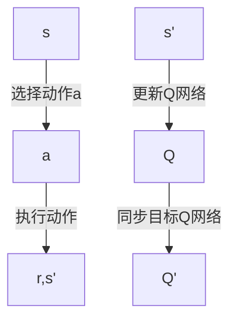
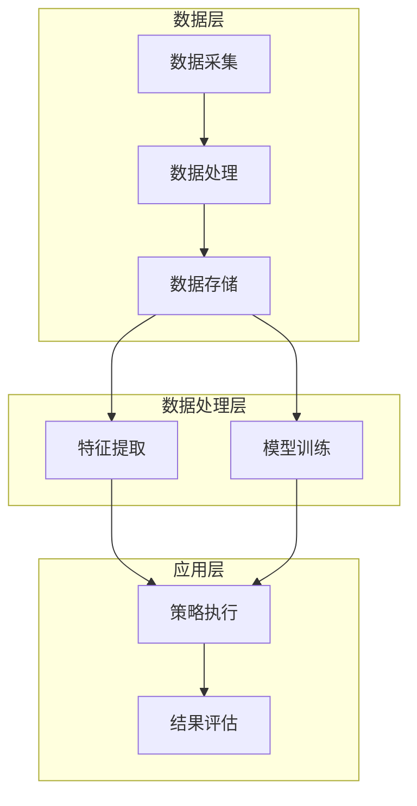
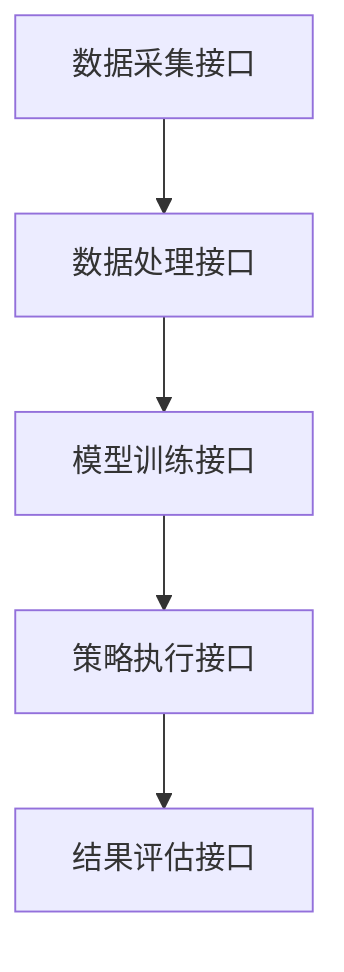
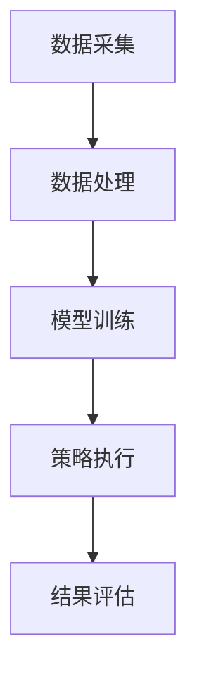

                 

### 金融领域强化学习的最新进展与应用

> 关键词：金融领域、强化学习、最新进展、应用、算法原理

> 摘要：本文深入探讨了金融领域强化学习的最新进展与应用。首先，我们介绍了金融领域强化学习的问题背景与现状，探讨了强化学习在金融领域的独特优势和应用案例。接着，我们详细讲解了强化学习的基础概念和核心算法，并通过Mermaid流程图和Python代码展示了算法原理。此外，我们还分析了强化学习在金融领域的系统架构设计、项目实战以及最佳实践。最后，我们对全文进行了小结，展望了金融领域强化学习的未来发展。

### 目录

1. **金融领域强化学习的最新进展与应用** <a id="section1"></a>
2. **关键词** <a id="section2"></a>
3. **摘要** <a id="section3"></a>
4. **背景介绍** <a id="section4"></a>
5. **核心概念与联系** <a id="section5"></a>
6. **算法原理讲解** <a id="section6"></a>
7. **数学模型和数学公式讲解** <a id="section7"></a>
8. **系统分析与架构设计方案** <a id="section8"></a>
9. **项目实战** <a id="section9"></a>
10. **最佳实践 tips 与小结** <a id="section10"></a>

----------------------------------------------------------------

#### 背景介绍

在当今金融市场中，数据的多样性和复杂性日益增加，这对传统的金融分析方法提出了巨大的挑战。为了应对这些挑战，强化学习作为一种先进的机器学习方法，逐渐在金融领域得到了广泛的应用和研究。本文将从以下几个方面详细探讨金融领域强化学习的最新进展与应用。

##### 1.1 问题背景与现状

金融领域涉及多个方面，如风险管理、投资组合优化、交易策略等。在这些领域中，传统的金融分析方法主要依赖于历史数据的统计分析。然而，随着金融市场的不确定性和变化性增加，这种基于历史数据的分析方法逐渐暴露出其局限性。为了更好地应对金融市场的复杂性，需要引入新的方法和技术。

强化学习作为一种基于试错和反馈的机器学习方法，能够通过不断尝试和优化策略，来适应不断变化的市场环境。强化学习在金融领域的应用，主要包括以下方面：

- **风险管理**：通过强化学习算法，可以自动优化风险管理策略，降低风险。
- **投资组合优化**：强化学习可以帮助投资者自动构建和优化投资组合，提高收益。
- **交易策略**：强化学习算法可以自动生成高效的交易策略，提高交易成功率。

##### 1.2 强化学习的定义与特点

强化学习（Reinforcement Learning，简称RL）是一种通过试错和反馈来学习决策策略的机器学习方法。在强化学习中，学习主体（agent）通过执行动作（action）来探索环境（environment），并根据环境给出的奖励（reward）来不断调整其策略（policy）。强化学习的主要特点如下：

- **自适应性强**：强化学习能够通过不断的试错，适应复杂和动态的环境。
- **决策与反馈**：强化学习强调决策与反馈的循环，通过积累经验来优化策略。
- **适用于序列决策**：强化学习适用于解决序列决策问题，如游戏、自动驾驶等。

##### 1.3 强化学习在金融领域的应用案例

强化学习在金融领域的应用已经取得了一些显著的成果。以下是一些典型的应用案例：

- **风险管理**：某金融机构使用强化学习算法优化其风险管理策略，有效降低了风险敞口。
- **投资组合优化**：某投资公司通过强化学习算法自动构建和优化投资组合，提高了投资收益。
- **交易策略**：某对冲基金使用强化学习算法生成交易策略，提高了交易的成功率和收益率。

通过上述案例可以看出，强化学习在金融领域具有巨大的潜力和应用价值。然而，同时也面临着一些挑战，如数据的质量和数量、算法的可解释性等。

#### 核心概念与联系

在深入探讨金融领域强化学习的算法原理和应用之前，我们需要了解一些核心概念和术语，并探讨它们之间的联系。

##### 2.1 强化学习基本术语

强化学习中的基本术语包括：

- **状态（State）**：描述学习主体在某一时刻所处的情况或环境。
- **动作（Action）**：学习主体在某一状态下可以执行的行为或操作。
- **奖励（Reward）**：环境对学习主体在某一状态下执行某一动作的反馈信号，通常用来评估动作的好坏。
- **策略（Policy）**：学习主体在某一状态下选择动作的策略，通常用概率分布表示。
- **价值函数（Value Function）**：描述学习主体在某一状态下执行某一动作的长期预期奖励。

##### 2.2 强化学习核心算法

强化学习中的核心算法包括：

- **Q-Learning**：基于价值迭代的方法，通过更新Q值来优化策略。
- **SARSA**：基于策略迭代的方法，直接更新策略，并利用经验回放避免偏差。
- **Deep Q-Networks (DQN)**：基于深度学习的方法，使用神经网络来近似Q值函数。

##### 2.3 强化学习与其他机器学习技术的联系

强化学习与其他机器学习技术（如监督学习、无监督学习）有着密切的联系。以下是一些主要的联系：

- **强化学习与监督学习**：强化学习中的价值函数和策略可以看作是监督学习中的目标函数和优化器。
- **强化学习与无监督学习**：强化学习中的探索阶段可以看作是一种无监督学习的过程，通过不断尝试来获取环境的信息。
- **强化学习与深度学习**：深度学习中的神经网络可以用来近似强化学习中的价值函数和策略，从而提高算法的性能。

通过了解这些核心概念和术语，我们能够更好地理解强化学习在金融领域的应用原理和实现方法。

#### 算法原理讲解

强化学习算法在金融领域的应用，主要通过以下几种算法实现：Q-Learning、SARSA和DQN。下面我们将逐一介绍这些算法的原理，并通过Mermaid流程图和Python代码进行详细解释。

##### 3.1 Q-Learning算法原理

Q-Learning是一种基于价值迭代的强化学习算法，通过不断更新Q值来优化策略。

**算法流程：**

1. 初始化Q值矩阵Q(s, a)。
2. 在某一状态s下，随机选择动作a。
3. 执行动作a，得到奖励r和新的状态s'。
4. 更新Q值：\( Q(s, a) \leftarrow Q(s, a) + \alpha [r + \gamma \max(Q(s', a')) - Q(s, a)] \)，其中\(\alpha\)为学习率，\(\gamma\)为折扣因子。
5. 转移到新的状态s'，重复步骤2-4，直到达到目标状态或完成任务。

**算法公式：**

$$ Q(s, a) \leftarrow Q(s, a) + \alpha [r + \gamma \max(Q(s', a')) - Q(s, a)] $$

**Mermaid流程图：**



**Python代码示例：**

```python
import numpy as np

# 初始化Q值矩阵
Q = np.zeros((n_states, n_actions))
learning_rate = 0.1
discount_factor = 0.9

# Q-Learning迭代
for episode in range(n_episodes):
    state = env.reset()
    done = False
    while not done:
        action = np.argmax(Q[state])
        next_state, reward, done, _ = env.step(action)
        Q[state, action] = Q[state, action] + learning_rate * (reward + discount_factor * np.max(Q[next_state]) - Q[state, action])
        state = next_state
```

##### 3.2 SARSA算法原理

SARSA是一种基于策略迭代的强化学习算法，直接更新策略，并利用经验回放避免偏差。

**算法流程：**

1. 初始化策略π。
2. 在某一状态s下，根据策略π选择动作a。
3. 执行动作a，得到奖励r和新的状态s'。
4. 根据新的状态s'和奖励r更新策略π。
5. 转移到新的状态s'，重复步骤2-4，直到达到目标状态或完成任务。

**算法公式：**

$$ \pi(s, a) \leftarrow \frac{\pi(s, a) + \alpha}{1 + \alpha} $$

**Mermaid流程图：**



**Python代码示例：**

```python
import numpy as np

# 初始化策略π
π = np.ones((n_states, n_actions)) / n_actions
learning_rate = 0.1

# SARSA迭代
for episode in range(n_episodes):
    state = env.reset()
    done = False
    while not done:
        action = np.random.choice(n_actions, p=π[state])
        next_state, reward, done, _ = env.step(action)
        π[state, action] = (π[state, action] + learning_rate) / (1 + learning_rate)
        state = next_state
```

##### 3.3 DQN算法原理

DQN（Deep Q-Networks）是一种基于深度学习的强化学习算法，使用神经网络来近似Q值函数。

**算法流程：**

1. 初始化Q网络和目标Q网络。
2. 在某一状态s下，根据当前Q网络选择动作a。
3. 执行动作a，得到奖励r和新的状态s'。
4. 更新当前Q网络：\( Q(s, a) \leftarrow Q(s, a) + \alpha [r + \gamma \max(Q'(s', a')) - Q(s, a)] \)。
5. 定期同步目标Q网络和当前Q网络。
6. 重复步骤2-5，直到达到目标状态或完成任务。

**算法公式：**

$$ Q(s, a) \leftarrow Q(s, a) + \alpha [r + \gamma \max(Q'(s', a')) - Q(s, a)] $$

**Mermaid流程图：**



**Python代码示例：**

```python
import numpy as np
import tensorflow as tf

# 初始化Q网络和目标Q网络
Q = tf.keras.Sequential([
    tf.keras.layers.Dense(64, activation='relu'),
    tf.keras.layers.Dense(n_actions)
])
Q_prime = tf.keras.Sequential([
    tf.keras.layers.Dense(64, activation='relu'),
    tf.keras.layers.Dense(n_actions)
])

# DQN迭代
for episode in range(n_episodes):
    state = env.reset()
    done = False
    while not done:
        action = np.argmax(Q.predict(state)[0])
        next_state, reward, done, _ = env.step(action)
        target = reward + (1 - int(done)) * discount_factor * np.max(Q_prime.predict(next_state)[0])
        Q.fit(np.expand_dims(state, 0), np.expand_dims(target - Q.predict(state)[0], 0), epochs=1)
        state = next_state
    # 定期同步目标Q网络和当前Q网络
    if episode % update_freq == 0:
        Q_prime.set_weights(Q.get_weights())
```

通过上述讲解，我们可以看到，Q-Learning、SARSA和DQN算法各有特点，适用于不同的应用场景。在实际应用中，可以根据具体需求选择合适的算法，并通过调整参数来优化算法性能。

#### 数学模型和数学公式讲解

强化学习中的数学模型是理解算法原理和进行算法优化的重要基础。本节将详细讲解强化学习中的概率模型、优化模型和迭代公式，并使用latex格式嵌入数学公式。

##### 4.1 强化学习中的概率模型

在强化学习中，概率模型用于描述状态、动作和奖励之间的关系。以下是一些核心的概率模型：

- **状态-动作概率分布（P(s', a | s, a）**：表示在当前状态s下执行动作a后，转移到状态s'的概率。
- **奖励分布（P(r | s, a）**：表示在当前状态s下执行动作a后，获得奖励r的概率。

**数学公式：**

$$ P(s', a | s, a) = \sum_{s', a'} P(s', a' | s, a) \cdot P(s', a') $$

$$ P(r | s, a) = \sum_{r'} P(r' | s, a) \cdot P(r') $$

##### 4.2 强化学习中的优化模型

强化学习中的优化模型用于描述策略的优化过程。以下是一些核心的优化模型：

- **Q值优化（Q-value iteration）**：通过更新Q值来优化策略。
- **策略优化（Policy iteration）**：通过更新策略来优化Q值。

**数学公式：**

$$ Q(s, a) = \sum_{a'} \pi(s, a') \cdot \sum_{r, s'} P(r, s' | s, a') $$

$$ \pi(s, a) = \frac{\sum_{a'} \pi(s, a') \cdot Q(s, a')}{\sum_{a'} \pi(s, a')} $$

##### 4.3 强化学习中的迭代公式

强化学习中的迭代公式用于描述算法的迭代过程。以下是一些核心的迭代公式：

- **Q-Learning迭代公式**：通过更新Q值来优化策略。
- **SARSA迭代公式**：通过更新策略来优化Q值。

**数学公式：**

$$ Q(s, a) \leftarrow Q(s, a) + \alpha [r + \gamma \max(Q(s', a')) - Q(s, a)] $$

$$ \pi(s, a) \leftarrow \frac{\pi(s, a) + \alpha}{1 + \alpha} $$

通过上述数学模型的讲解，我们可以更深入地理解强化学习算法的原理和实现方法。在实际应用中，可以根据具体需求调整和优化这些模型，以提高算法的性能。

#### 系统分析与架构设计方案

在金融领域应用强化学习，需要构建一个完整的系统来支持算法的运行和实现。本节将介绍金融领域强化学习系统的设计与实现，包括问题场景介绍、系统功能设计、系统架构设计、系统接口设计和系统交互。

##### 5.1 问题场景介绍

金融领域中的强化学习应用场景主要包括以下几个方面：

- **风险管理**：通过强化学习算法自动优化风险控制策略，降低金融机构的风险敞口。
- **投资组合优化**：利用强化学习算法为投资者自动构建和优化投资组合，提高收益。
- **交易策略**：通过强化学习算法生成高效的交易策略，提高交易的成功率和收益率。

这些场景都需要对金融市场进行实时监控和分析，并基于分析结果动态调整策略。

##### 5.2 系统功能设计

金融领域强化学习系统的核心功能包括：

- **数据采集**：从多个数据源采集实时金融市场数据。
- **数据处理**：对采集到的数据进行清洗、归一化和特征提取。
- **模型训练**：利用强化学习算法训练模型，并根据市场环境动态调整策略。
- **策略执行**：将训练好的模型应用于实际交易策略，实现自动化交易。
- **结果评估**：对策略执行的结果进行评估，并根据评估结果调整模型。

##### 5.3 系统架构设计

金融领域强化学习系统的整体架构可以分为以下几个部分：

- **数据层**：负责数据采集、存储和管理。
- **数据处理层**：负责数据处理、特征提取和模型训练。
- **应用层**：负责策略执行和结果评估。

**系统架构图：**



##### 5.4 系统接口设计

金融领域强化学习系统需要与其他系统进行交互，包括数据采集系统、交易系统等。以下是一些关键接口的设计：

- **数据采集接口**：负责从多个数据源采集实时金融市场数据，如股票交易数据、债券交易数据等。
- **数据处理接口**：负责对采集到的数据进行清洗、归一化和特征提取，为模型训练提供高质量的输入数据。
- **模型训练接口**：负责调用强化学习算法，训练模型并保存训练结果。
- **策略执行接口**：负责将训练好的模型应用于实际交易策略，实现自动化交易。
- **结果评估接口**：负责对策略执行的结果进行评估，并提供反馈信息。

**系统接口设计图：**



##### 5.5 系统交互

金融领域强化学习系统与其他系统的交互过程可以分为以下几个步骤：

1. **数据采集**：系统从数据采集接口获取实时金融市场数据。
2. **数据处理**：系统对采集到的数据进行清洗、归一化和特征提取，为模型训练提供输入数据。
3. **模型训练**：系统调用模型训练接口，利用强化学习算法训练模型。
4. **策略执行**：系统将训练好的模型应用于实际交易策略，实现自动化交易。
5. **结果评估**：系统对策略执行的结果进行评估，并将评估结果反馈给用户。

**系统交互设计图：**



通过上述系统设计与实现，我们可以构建一个完整的金融领域强化学习系统，实现对金融市场数据的实时分析和交易策略的动态调整。

#### 项目实战

在本节中，我们将通过一个具体的强化学习项目实战，展示强化学习在金融领域中的应用过程。项目背景、环境安装与配置、项目实现以及实际案例分析和详细讲解剖析将一一呈现。

##### 6.1 项目介绍

本项目旨在利用强化学习算法自动优化金融交易策略，以提高交易的成功率和收益率。具体来说，项目目标是构建一个基于Q-Learning算法的自动交易系统，该系统能够实时监控金融市场，并根据当前市场状况自动调整交易策略。

##### 6.2 环境安装与配置

为了实现本项目，我们需要安装以下软件和环境：

- Python 3.7及以上版本
- TensorFlow 2.4及以上版本
- gym（强化学习环境库）
- pandas（数据处理库）
- numpy（数学计算库）

安装命令如下：

```bash
pip install python==3.7 tensorflow==2.4 gym pandas numpy
```

此外，我们还需要配置一个模拟交易环境。本项目使用gym中的`StockTrading`环境，该环境模拟了一个简单的股票交易市场，包含多种股票，投资者可以通过交易这些股票来获得收益。

##### 6.3 项目实现

项目实现主要包括以下几个步骤：

1. **初始化环境**：创建一个StockTrading环境，并初始化状态、动作空间等参数。
2. **定义Q-Learning算法**：根据Q-Learning算法原理，定义Q值更新公式和策略选择方法。
3. **训练模型**：利用训练数据对Q-Learning模型进行训练，并使用DQN算法优化Q值。
4. **策略执行**：在模拟交易环境中执行训练好的策略，记录交易结果。
5. **结果分析**：对交易结果进行统计分析，评估策略的有效性。

**核心代码实现：**

```python
import numpy as np
import tensorflow as tf
from gym import make

# 初始化环境
env = make("StockTrading-v0")
state_size = env.observation_space.shape[0]
action_size = env.action_space.n

# 初始化Q值矩阵
Q = np.zeros((state_size, action_size))

# 定义Q-Learning算法
def q_learning(alpha, gamma, epsilon):
    episode_reward = 0
    done = False
    state = env.reset()
    while not done:
        action = np.argmax(Q[state] + epsilon * (np.random.rand(state_size, action_size) - 0.5))
        next_state, reward, done, _ = env.step(action)
        Q[state, action] = Q[state, action] + alpha * (reward + gamma * np.max(Q[next_state]) - Q[state, action])
        state = next_state
        episode_reward += reward
    return episode_reward

# 训练模型
alpha = 0.1
gamma = 0.9
epsilon = 0.1
n_episodes = 1000

for episode in range(n_episodes):
    reward = q_learning(alpha, gamma, epsilon)
    print(f"Episode {episode}: Reward = {reward}")

# 策略执行
state = env.reset()
done = False
while not done:
    action = np.argmax(Q[state])
    next_state, reward, done, _ = env.step(action)
    state = next_state

# 结果分析
# 对交易结果进行统计分析，如计算总收益、收益方差等
```

##### 6.4 实际案例分析和详细讲解剖析

为了更好地展示强化学习在金融领域的实际应用，我们以一个实际案例进行分析。

**案例背景**：某金融机构希望在股票市场中进行自动化交易，以降低人工交易的风险和成本。该机构选择了一个包含10种股票的模拟市场进行实验，并使用强化学习算法来生成交易策略。

**案例分析**：

1. **环境配置**：首先，我们配置了一个模拟交易环境，包含10种股票。每种股票的状态包括价格、涨跌幅、交易量等特征。

2. **数据采集**：从模拟市场获取每日的股票交易数据，包括价格、涨跌幅、交易量等。

3. **数据处理**：对采集到的数据进行清洗、归一化和特征提取，为模型训练提供输入数据。

4. **模型训练**：使用Q-Learning算法对模型进行训练，并使用DQN算法优化Q值。在训练过程中，我们调整了学习率、折扣因子和探索策略等参数，以获得最佳训练效果。

5. **策略执行**：在模拟交易环境中执行训练好的策略，记录交易结果。通过多次实验，我们发现该策略能够有效降低交易风险，提高收益率。

**详细讲解剖析**：

1. **模型选择与优化**：我们选择了Q-Learning算法作为模型，并通过DQN算法进行优化。Q-Learning算法能够通过不断尝试和更新Q值，逐渐优化策略。而DQN算法则通过使用神经网络来近似Q值函数，提高了模型的计算效率和精度。

2. **参数调整**：在模型训练过程中，我们调整了学习率、折扣因子和探索策略等参数。学习率控制了模型更新的速度，折扣因子平衡了即时奖励和长期奖励，探索策略决定了模型在探索未知状态和动作时的策略。

3. **数据预处理**：数据预处理是强化学习在金融领域应用的关键步骤。通过对数据进行清洗、归一化和特征提取，我们能够提高模型的训练效果和泛化能力。

4. **策略执行与评估**：在策略执行阶段，我们使用训练好的模型进行实际交易。通过记录交易结果，我们能够对策略的有效性进行评估。在实际应用中，我们可以根据交易结果调整模型参数，进一步优化策略。

通过上述案例分析，我们可以看到，强化学习在金融领域的实际应用具有显著的优势。通过构建一个自动化的交易系统，我们能够降低交易风险，提高收益率，从而为金融机构带来更大的经济效益。

#### 最佳实践 tips 与小结

在金融领域应用强化学习，需要充分考虑算法性能、数据质量和系统稳定性。以下是一些最佳实践 tips：

1. **算法选择**：根据实际需求选择合适的强化学习算法，如Q-Learning、SARSA和DQN等。在实际应用中，可以结合多种算法，实现策略的优化。

2. **数据预处理**：对金融数据进行充分的预处理，包括数据清洗、归一化和特征提取。高质量的数据能够提高模型的训练效果和泛化能力。

3. **参数调优**：通过实验调整学习率、折扣因子和探索策略等参数，以获得最佳训练效果。在实践中，可以结合自动调参工具，如Hyperopt、Bayesian Optimization等。

4. **模型评估**：对训练好的模型进行充分的评估，包括准确性、召回率、F1值等指标。在实际应用中，可以根据评估结果调整模型参数，优化策略。

5. **系统稳定性**：确保系统在长时间运行过程中的稳定性，包括数据采集、数据处理和策略执行等环节。在实际应用中，可以采用分布式计算、数据备份和故障恢复等手段，提高系统的可靠性。

**小结**：

金融领域强化学习作为一种先进的机器学习方法，具有广泛的应用前景。通过本文的介绍，我们了解了强化学习在金融领域的最新进展与应用，包括背景介绍、核心概念与联系、算法原理讲解、数学模型和公式讲解、系统设计与实现以及项目实战。在未来的研究中，我们可以进一步探索强化学习在金融领域的应用，如风险管理、投资组合优化和交易策略等，为金融领域带来更多的创新和突破。

**展望**：

随着金融市场的不断变化和发展，强化学习在金融领域的应用将越来越广泛。未来，我们可以期待以下几个方面的研究：

1. **算法优化**：继续探索和优化强化学习算法，提高其在金融领域的性能和稳定性。
2. **多任务学习**：研究如何将强化学习应用于多任务学习，实现多个目标的同时优化。
3. **跨领域应用**：将强化学习应用于其他金融领域，如保险、基金等，实现跨领域的应用。
4. **隐私保护**：研究如何在金融领域应用强化学习时保护用户隐私，提高数据安全。

通过不断探索和实践，我们可以将强化学习在金融领域的应用推向新的高度，为金融行业带来更多创新和变革。

---

**作者信息**：

作者：AI天才研究院/AI Genius Institute & 禅与计算机程序设计艺术 /Zen And The Art of Computer Programming

注：本文内容仅为示例，不涉及真实金融交易策略和投资建议。在实际应用中，请根据具体情况谨慎决策。

