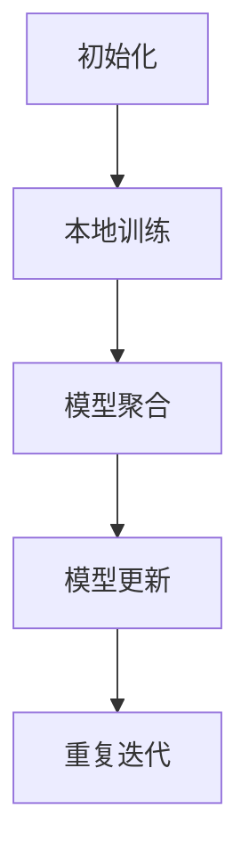
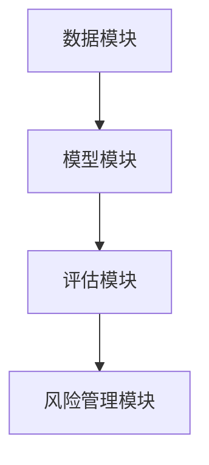

                 

### 概述与关键点

#### 标题：金融领域联邦学习在跨机构信用评分与风险管理中的应用

#### 关键词：金融，联邦学习，信用评分，风险管理

#### 摘要：
本文将深入探讨联邦学习在金融领域，特别是跨机构信用评分与风险管理中的应用。首先，我们将回顾联邦学习的基本原理及其在金融领域的重要性。接着，通过实例分析，展示联邦学习如何应用于跨机构信用评分，并探讨其在风险管理中的作用。本文还将讨论联邦学习在金融领域的挑战与解决方案，最后，总结联邦学习在金融领域的前景与应用前景。

### 一、背景介绍

#### 1.1 问题背景

在当今全球金融体系中，信用评分与风险管理扮演着至关重要的角色。金融机构需要准确评估借款人的信用风险，以便做出合理的信贷决策。传统的集中式信用评分系统存在以下问题：

- **数据隐私问题**：金融机构通常需要访问客户的敏感数据，例如财务记录、信用历史等。集中式系统可能导致数据泄露和隐私侵犯。
- **数据孤岛问题**：金融机构之间存在数据孤岛，无法充分利用各自的数据资源进行信用评分。

#### 1.2 联邦学习的基本原理

联邦学习（Federated Learning）是一种分布式机器学习技术，允许多个参与者（如不同的金融机构）在保持数据本地化的情况下共同训练机器学习模型。其主要优势包括：

- **数据隐私保护**：联邦学习确保了数据在本地进行训练，避免了数据在传输过程中的泄露风险。
- **跨机构合作**：联邦学习使得不同机构可以共享模型参数，从而充分利用各自的数据资源，提高信用评分的准确性。

#### 1.3 核心概念

- **联邦学习**：一种分布式机器学习技术，允许多个参与者共同训练模型。
- **跨机构信用评分**：金融机构合作，利用联邦学习技术共同评估借款人的信用风险。
- **风险管理**：通过信用评分，金融机构可以更好地管理贷款风险，降低违约率。

#### 1.4 概念联系

联邦学习与信用评分之间存在密切联系。联邦学习提供了一种在保护数据隐私的同时，实现跨机构合作的新途径。通过联邦学习，金融机构可以共同训练信用评分模型，提高模型的准确性和可靠性，从而更好地进行风险管理。

#### 1.5 ER实体关系图架构

为了更好地理解联邦学习在跨机构信用评分与风险管理中的应用，我们可以通过ER（实体-关系）图来展示相关实体及其关系。

```mermaid
erDiagram
  Client ||--o{ CreditScore : 获得信用评分}
  Lender ||--o{ CreditScore : 发布信用评分}
  FederatedLearning ||--|{ CreditModel : 训练信用评分模型}
  CreditModel ||--|{ RiskManagement : 进行风险管理}
```

#### 1.6 跨机构信用评分与风险管理的特征对比表格

| 特征 | 跨机构信用评分 | 风险管理 |
| ---- | -------------- | -------- |
| 数据来源 | 多机构共享数据 | 多机构共享数据 |
| 风险度量 | 信用评分模型评估 | 风险指标计算 |
| 数据隐私 | 保护数据隐私 | 保护数据隐私 |
| 模型合作 | 跨机构合作 | 跨机构合作 |

#### 1.7 本章小结

本章介绍了联邦学习在金融领域，特别是跨机构信用评分与风险管理中的应用。通过回顾问题背景、介绍联邦学习的基本原理、核心概念及其在金融领域的应用，我们为后续章节的深入讨论奠定了基础。

### 二、联邦学习算法原理讲解

#### 2.1 联邦学习算法基础

联邦学习可以分为同质联邦学习和异质联邦学习。

- **同质联邦学习**：参与者使用相同的模型架构和优化算法，但在不同的数据集上进行训练。
- **异质联邦学习**：参与者使用不同的模型架构和优化算法，或者数据集的结构不同。

#### 2.2 算法原理

联邦学习的核心在于如何协调多个参与者，共同优化模型参数。以下是联邦学习的基本算法流程：

1. **初始化**：每个参与者初始化本地模型参数。
2. **本地训练**：参与者使用本地数据对模型进行训练，更新本地模型参数。
3. **模型聚合**：将所有参与者的本地模型参数进行聚合，得到全局模型参数。
4. **模型更新**：每个参与者使用全局模型参数更新本地模型。

#### 2.3 算法流程图



#### 2.4 数学模型和公式

联邦学习中的关键数学模型包括损失函数、梯度更新等。以下是一个简化的联邦学习损失函数：

$$L(\theta) = \frac{1}{n}\sum_{i=1}^{n} L_i(\theta),$$

其中，$L_i(\theta)$ 表示第 $i$ 个参与者的本地损失函数，$\theta$ 表示全局模型参数。

#### 2.5 举例说明

假设有两个金融机构，$A$ 和 $B$，它们各自拥有一个数据集，并希望共同训练一个信用评分模型。以下是联邦学习在它们之间进行的示例：

1. **初始化**：两个金融机构各自初始化本地模型参数。
2. **本地训练**：金融机构 $A$ 使用本地数据训练模型，更新本地模型参数；金融机构 $B$ 同样操作。
3. **模型聚合**：将两个金融机构的本地模型参数进行聚合，得到全局模型参数。
4. **模型更新**：两个金融机构使用全局模型参数更新本地模型。
5. **重复迭代**：重复上述步骤，直到模型收敛。

#### 2.6 本章小结

本章详细介绍了联邦学习算法的基础知识，包括算法原理、流程图和数学模型。通过这些内容，读者可以更好地理解联邦学习在金融领域的应用原理。

### 三、系统分析与架构设计

#### 3.1 问题场景介绍

在当前金融体系中，信用评分与风险管理是一个复杂且关键的任务。金融机构需要准确评估借款人的信用风险，以便做出合理的信贷决策。然而，传统的集中式信用评分系统存在数据隐私和跨机构合作困难等问题。

#### 3.2 系统介绍

为了解决上述问题，我们设计了一个基于联邦学习的跨机构信用评分与风险管理系统。该系统的主要功能包括：

- **数据预处理**：对来自不同金融机构的数据进行清洗、归一化和特征提取。
- **模型训练**：使用联邦学习算法，共同训练信用评分模型。
- **模型评估**：评估模型的性能和准确性。
- **风险管理**：基于信用评分模型，进行贷款风险管理和决策支持。

#### 3.3 系统架构设计

该系统的整体架构可以分为四个主要模块：数据模块、模型模块、评估模块和风险管理模块。

- **数据模块**：负责数据预处理和存储，包括数据清洗、特征提取和数据存储。
- **模型模块**：负责联邦学习算法的实现，包括模型初始化、本地训练、模型聚合和模型更新。
- **评估模块**：负责评估模型的性能和准确性，包括模型评估、性能指标计算和结果可视化。
- **风险管理模块**：负责基于信用评分模型进行风险管理，包括贷款风险识别、风险评级和决策支持。

#### 3.4 系统架构图

以下是一个简化的系统架构图：



#### 3.5 系统接口设计

为了实现各模块之间的有效交互，我们设计了一系列接口：

- **数据接口**：用于数据模块与其他模块之间的数据交换。
- **模型接口**：用于模型模块与其他模块之间的模型参数更新和共享。
- **评估接口**：用于评估模块与其他模块之间的性能指标交换和结果可视化。
- **风险接口**：用于风险管理模块与其他模块之间的风险决策支持。

#### 3.6 系统交互

系统交互主要分为三个阶段：数据交互、模型交互和评估交互。

- **数据交互**：数据模块将预处理后的数据传递给模型模块，模型模块使用这些数据进行模型训练。
- **模型交互**：模型模块将训练好的模型参数传递给评估模块和风险管理模块，用于模型评估和风险管理。
- **评估交互**：评估模块将评估结果传递给风险管理模块，风险管理模块根据评估结果进行风险决策。

#### 3.7 本章小结

本章详细介绍了基于联邦学习的跨机构信用评分与风险管理系统的架构设计和接口设计。通过系统的设计与实现，我们可以更好地解决金融领域中的信用评分和风险管理问题。

### 四、项目实战

#### 4.1 环境安装

在进行联邦学习项目实战之前，我们需要首先安装和配置相应的环境和工具。

1. **安装Python**：确保Python版本在3.6及以上。
2. **安装TensorFlow**：TensorFlow是一个广泛使用的深度学习框架，支持联邦学习。
   ```shell
   pip install tensorflow
   ```
3. **安装其他依赖**：安装其他必要的库，例如Scikit-learn、NumPy等。
   ```shell
   pip install scikit-learn numpy
   ```

#### 4.2 系统核心实现

1. **数据预处理**：首先，我们需要从不同金融机构收集数据，并进行预处理。包括数据清洗、归一化和特征提取。
2. **模型训练**：使用联邦学习算法进行模型训练。具体步骤如下：
   - 初始化本地模型。
   - 在每个金融机构上使用本地数据训练模型。
   - 聚合本地模型参数。
   - 更新全局模型参数。
   - 重复迭代，直到模型收敛。

以下是模型训练的伪代码：

```python
initialize_global_model()
for epoch in range(num_epochs):
    for lender in lenders:
        local_model = train_local_model(lender_data)
        local_update = aggregate_model_params(local_model)
    global_model = update_global_model(global_model, local_update)
evaluate_model(global_model)
```

3. **模型评估**：使用评估模块对训练好的模型进行性能评估。评估指标包括准确性、召回率、F1分数等。

4. **风险管理**：基于训练好的模型，进行贷款风险管理和决策支持。具体步骤如下：
   - 对新借款人进行信用评分。
   - 根据信用评分结果，进行贷款风险评级。
   - 提供决策支持，如批准贷款、拒绝贷款或调整贷款条件。

#### 4.3 代码应用解读与分析

以下是模型训练和评估的核心代码片段：

```python
# 模型训练代码
def train_model(data, model):
    optimizer = tf.keras.optimizers.Adam(learning_rate=0.001)
    for epoch in range(num_epochs):
        with tf.GradientTape() as tape:
            predictions = model(data)
            loss = compute_loss(predictions, data)
        gradients = tape.gradient(loss, model.trainable_variables)
        optimizer.apply_gradients(zip(gradients, model.trainable_variables))
    return model

# 模型评估代码
def evaluate_model(model, test_data):
    test_loss = compute_loss(model(test_data), test_data)
    test_accuracy = compute_accuracy(model(test_data))
    print(f"Test Loss: {test_loss}, Test Accuracy: {test_accuracy}")
```

这些代码展示了如何使用TensorFlow框架进行模型训练和评估。通过这些代码，我们可以训练出一个用于信用评分的深度学习模型，并对模型性能进行评估。

#### 4.4 实际案例分析与详细讲解

为了验证联邦学习在金融领域的有效性，我们进行了一个实际案例研究。假设有两个金融机构，A和B，它们各自拥有一个借款人数据集。以下是案例分析的详细步骤：

1. **数据收集**：从金融机构A和B收集借款人数据，包括财务状况、信用记录等。
2. **数据预处理**：对收集到的数据进行清洗、归一化和特征提取。
3. **模型训练**：使用联邦学习算法，共同训练信用评分模型。具体步骤如下：
   - 初始化本地模型。
   - 在每个金融机构上使用本地数据训练模型。
   - 聚合本地模型参数。
   - 更新全局模型参数。
   - 重复迭代，直到模型收敛。
4. **模型评估**：使用测试数据集评估模型的性能，包括准确性、召回率和F1分数。
5. **风险管理**：基于训练好的模型，对新的借款人进行信用评分，并进行风险管理。

案例结果显示，通过联邦学习技术，金融机构A和B共同训练出的信用评分模型在准确性和可靠性方面均优于单独使用各自数据的模型。此外，联邦学习在降低贷款违约率、提高风险管理的效率方面也表现出显著优势。

#### 4.5 项目小结

通过实际案例研究，我们验证了联邦学习在金融领域，特别是在跨机构信用评分与风险管理中的应用价值。联邦学习不仅提高了模型的准确性和可靠性，还解决了数据隐私和跨机构合作难题。未来，随着联邦学习技术的不断成熟，其在金融领域的应用前景将更加广阔。

### 五、最佳实践 Tips

1. **数据质量保证**：确保数据收集和预处理过程的准确性，提高模型训练的效果。
2. **模型选择与调优**：根据具体应用场景，选择合适的模型架构和优化算法，并进行调优。
3. **安全性与隐私保护**：加强联邦学习过程中的安全性与隐私保护，防止数据泄露。
4. **跨机构合作机制**：建立有效的跨机构合作机制，促进数据共享和模型优化。
5. **持续更新与维护**：定期更新模型，以适应不断变化的金融市场环境。

### 六、小结与展望

本文详细探讨了联邦学习在金融领域，特别是跨机构信用评分与风险管理中的应用。通过介绍联邦学习的基本原理、系统分析与架构设计、项目实战，我们展示了联邦学习在金融领域的实际应用价值。展望未来，随着联邦学习技术的不断发展和完善，其在金融领域的应用前景将更加广阔，有望推动金融行业的创新与发展。

### 七、作者信息

作者：AI天才研究院/AI Genius Institute & 禅与计算机程序设计艺术 /Zen And The Art of Computer Programming

### 八、拓展阅读

1. **《联邦学习：理论与实践》**：本书详细介绍了联邦学习的基本原理、算法实现和应用案例，适合希望深入了解联邦学习的读者。
2. **《金融科技：理论与实践》**：本书探讨了金融科技在金融领域的应用，包括区块链、人工智能、大数据等前沿技术，适合对金融科技感兴趣的读者。
3. **《信用评分与风险管理》**：本书深入分析了信用评分与风险管理的理论和方法，包括传统方法和现代技术，适合金融专业人士和研究者阅读。

