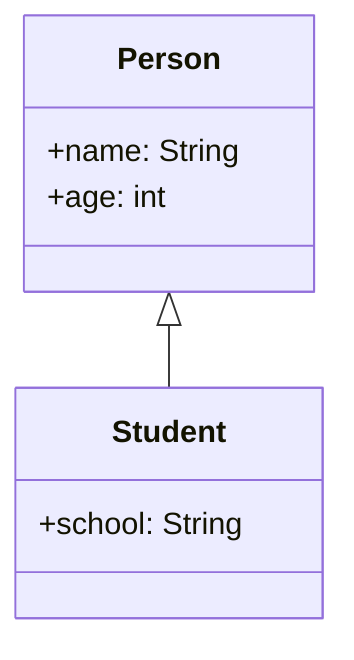
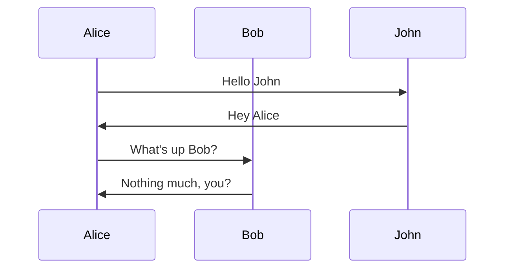

                 

**文章标题**: 金融领域自监督学习在异常交易检测中的应用

**关键词**: 自监督学习，异常交易检测，金融，机器学习，深度学习

**摘要**: 
随着金融市场数据量的激增和复杂性增加，传统的监督学习模型在异常交易检测中的效果受到了限制。本文介绍了自监督学习在金融领域的应用，探讨了其基本原理、核心概念以及在实际交易检测中的应用方法。通过详细的分析和实例，本文展示了自监督学习如何提高异常交易检测的准确性和效率，为金融科技领域提供了新的研究方向。

----------------------------------------------------------------

## 引言与背景

### 1.1 问题背景和重要性

在金融市场中，异常交易检测（Anomaly Detection in Trading）是一个关键问题。它涉及到识别和分析市场中的异常行为，如欺诈交易、市场操纵等，这些行为可能对市场的稳定性和投资者的利益产生严重影响。然而，传统的监督学习模型在处理复杂、大规模的金融市场数据时面临诸多挑战。

**1.1.1 自监督学习的崛起**

近年来，自监督学习（Self-Supervised Learning）在机器学习和人工智能领域引起了广泛关注。与传统监督学习不同，自监督学习不需要大量标注数据，而是通过自动发现数据中的内在结构和模式来进行学习。这一特性使其在处理大规模、未标注的数据集时具有明显优势，特别适用于金融市场的异常交易检测。

**1.1.2 金融市场异常交易检测的挑战**

金融市场数据具有高维度、时间序列特性以及数据噪声等特点，这使得传统的监督学习模型难以有效地检测异常交易。以下是一些主要的挑战：

- **高维度数据**：金融市场数据包括股票价格、交易量、波动率等多个维度，如何有效地提取和利用这些信息是一个关键问题。
- **时间序列分析**：交易数据随时间变化，如何捕捉这些动态变化中的异常行为是一个技术难点。
- **数据噪声**：金融市场数据常常受到噪声干扰，这会影响模型的性能。

**1.1.3 自监督学习在金融中的应用**

自监督学习通过预训练和迁移学习等技术，可以在没有大量标注数据的情况下，对模型进行有效的训练和优化。这使得自监督学习在金融领域具有广泛的应用潜力：

- **数据预处理**：自监督学习可以用于数据去噪、特征提取和降维，从而提高模型的输入质量。
- **异常检测**：通过学习数据中的正常模式，自监督学习可以有效地识别异常交易，提高检测的准确性和效率。
- **实时监控**：自监督学习模型可以在实时环境中快速响应，实现实时异常交易检测。

### 1.2 核心概念和术语

**1.2.1 自监督学习的定义**

自监督学习是一种无监督学习方法，它通过自动从数据中学习标签来训练模型。在自监督学习中，不需要人工标注数据，而是利用数据本身的结构和模式来指导学习过程。

**1.2.2 关键原理和方法**

- **数据增强和预训练任务**：通过数据增强技术，如随机裁剪、旋转、缩放等，生成新的数据样本，用于训练模型。
- **特征学习和迁移学习**：模型首先在大量未标注的数据上进行预训练，然后通过迁移学习技术将预训练的模型应用于特定的任务。
- **模型架构**：自监督学习模型通常采用深度神经网络架构，如卷积神经网络（CNN）和循环神经网络（RNN），以适应不同类型的数据和任务。

**1.2.3 与传统监督学习的区别**

- **数据需求**：自监督学习不需要大量标注数据，因此可以处理大规模未标注数据集。
- **计算效率**：自监督学习通过预训练和迁移学习技术，可以减少模型的训练时间和计算资源需求。
- **模型泛化能力**：自监督学习模型在学习过程中不需要依赖特定标签，因此具有更好的泛化能力。

### 1.3 总结

自监督学习在金融领域的应用具有重要的研究价值和实际意义。通过本文的介绍，读者可以初步了解自监督学习的基本原理和核心概念，为进一步探讨其在异常交易检测中的应用奠定基础。

----------------------------------------------------------------

## 自监督学习的基础

### 2.1 机器学习和深度学习简介

#### 2.1.1 机器学习概述

机器学习（Machine Learning）是人工智能（AI）的一个重要分支，它致力于通过数据驱动的方式使计算机系统获得知识或技能。传统的编程依赖于显式编程规则，而机器学习则是通过从数据中自动提取模式来构建模型，使得计算机能够做出预测或决策。

#### 2.1.2 深度学习介绍

深度学习（Deep Learning）是机器学习的一个子领域，主要利用多层神经网络（Neural Networks）进行学习。与传统神经网络相比，深度学习模型具有更强的表征能力和适应性，能够处理复杂数据结构。

#### 2.1.3 机器学习与深度学习的关系

深度学习是机器学习的一个特定实例，它在机器学习的基础上引入了多层网络结构，通过逐层提取数据中的特征，实现了对复杂数据的自动建模。机器学习提供了深度学习所需的算法框架，而深度学习则实现了机器学习的高效化和智能化。

### 2.2 自监督学习机制

#### 2.2.1 数据增强和预训练任务

数据增强（Data Augmentation）是自监督学习中的一个关键技术，它通过在原始数据上进行变换，生成新的数据样本，从而增加训练数据的多样性。常见的数据增强方法包括随机裁剪、旋转、缩放和颜色变换等。

预训练任务（Pretext Task）则是自监督学习的核心思想之一。在预训练任务中，模型首先在一个大规模、未标注的数据集上进行训练，学习到数据中的底层特征和模式。然后，这些预训练的模型可以用于特定的任务，通过微调（Fine-Tuning）来提高任务性能。

#### 2.2.2 特征学习和迁移学习

特征学习（Feature Learning）是指模型通过训练从原始数据中自动提取具有区分性的特征表示。在自监督学习中，特征学习是通过预训练任务实现的。提取到的特征可以用于后续的监督学习任务，从而提高模型的泛化能力。

迁移学习（Transfer Learning）则是一种利用预训练模型在新任务上进行快速学习的策略。自监督学习通过预训练过程获得了一般化的特征表示，这些特征在迁移学习中被应用到特定的金融任务中，如异常交易检测。

#### 2.2.3 自监督学习模型架构

自监督学习模型通常采用深度神经网络架构，如卷积神经网络（CNN）和循环神经网络（RNN）。CNN擅长处理图像和空间数据，而RNN则适合处理序列数据，如时间序列数据。结合这两种网络结构，可以构建出适应金融领域复杂数据的自监督学习模型。

### 2.3 自监督学习与传统监督学习的比较

#### 2.3.1 优势与劣势

**优势：**

- **数据需求**：自监督学习不需要大量标注数据，可以处理大规模未标注数据集。
- **计算效率**：通过预训练和迁移学习，自监督学习减少了模型的训练时间和计算资源需求。
- **模型泛化能力**：自监督学习模型通过无监督学习过程，具有更好的泛化能力。

**劣势：**

- **模型解释性**：自监督学习模型通常较难以解释，难以理解模型如何做出决策。
- **任务特定性**：自监督学习模型通常在特定任务上表现较好，但可能难以迁移到其他任务。

#### 2.3.2 应用场景

自监督学习在金融领域的应用场景主要包括：

- **数据预处理**：如数据去噪、特征提取和降维。
- **异常检测**：通过学习正常数据模式，识别异常交易行为。
- **实时监控**：在金融市场中实现实时异常交易检测。

### 2.4 总结

通过本章的介绍，读者可以了解自监督学习的基础知识和核心概念。自监督学习通过数据增强、预训练任务、特征学习和迁移学习等技术，为处理大规模、未标注的金融数据提供了有效的解决方案。下一章将深入探讨自监督学习在金融领域的具体应用。

----------------------------------------------------------------

## 自监督学习在金融领域的应用

### 3.1 金融市场数据特点

金融市场数据具有以下特点：

#### 3.1.1 时间序列数据

金融市场数据通常是时间序列数据，这意味着数据点按照时间顺序排列。时间序列数据具有时间依赖性和动态变化特性，这使得传统的监督学习模型难以捕捉市场中的瞬时异常行为。

#### 3.1.2 高维度数据

金融市场数据包含多个维度，如股票价格、交易量、波动率等。这些高维度数据需要有效的特征提取和降维技术，以减少数据的复杂度并提高模型性能。

#### 3.1.3 数据噪声

金融市场数据常常受到噪声干扰，如交易错误、数据录入错误等。这些噪声会影响模型的训练效果和检测准确性。

### 3.2 自监督学习在金融市场数据预处理中的应用

#### 3.2.1 数据去噪和异常检测

自监督学习可以通过预训练任务从大规模、未标注的数据集中学习到噪声抑制能力。例如，可以使用自编码器（Autoencoder）模型来学习数据中的潜在特征，并通过重构误差来识别和去除噪声。

#### 3.2.2 特征提取和降维

自监督学习模型可以用于提取数据中的高维特征，并通过降维技术将高维特征映射到低维空间。常见的降维方法包括主成分分析（PCA）、线性判别分析（LDA）等。通过降维，可以减少数据的复杂度并提高模型效率。

#### 3.2.3 实际应用案例

例如，可以使用自监督学习模型对股票市场数据进行预处理，提取关键特征，然后使用监督学习模型进行异常交易检测。这种方法不仅可以提高检测的准确性，还可以减少对大量标注数据的依赖。

### 3.3 自监督学习在金融交易异常检测中的实际应用

#### 3.3.1 欺诈交易检测

自监督学习可以用于检测金融市场中的欺诈交易。通过预训练模型学习到正常交易模式，然后对实时交易数据进行分析，可以有效地识别出异常交易行为。

#### 3.3.2 市场操纵检测

市场操纵是指某些个体或团体通过不正当手段影响市场价格，从而获得不正当利益。自监督学习可以用于检测市场操纵行为，例如，通过分析交易量和价格的关系，识别出异常的交易行为。

#### 3.3.4 实时监控和预警

自监督学习模型可以用于实时监控金融市场，对异常交易行为进行实时预警。通过快速响应和及时处理，可以有效地保护市场的稳定性和投资者的利益。

### 3.4 结论

自监督学习在金融领域的应用具有广阔的前景。通过数据预处理、异常检测和实时监控等技术，自监督学习可以提高金融市场的效率和安全性。下一章将介绍一些自监督学习在金融领域应用的案例和成功经验。

----------------------------------------------------------------

### 4. 案例研究：自监督学习在金融异常交易检测中的应用

在本节中，我们将通过几个实际案例研究来探讨自监督学习在金融异常交易检测中的应用，并分析其效果和挑战。

#### 4.1. 案例一：股票市场欺诈交易检测

一个知名案例是在某个大型股票交易平台上使用自监督学习模型进行欺诈交易检测。该平台采用了基于自编码器的自监督学习方法来识别异常交易行为。

**方法：**

1. **数据预处理**：首先，对股票交易数据进行了清洗和预处理，包括去除缺失值、异常值和数据噪声。
2. **特征提取**：然后，利用自编码器模型提取关键特征，如交易量、价格波动和交易时间间隔等。
3. **异常检测**：通过分析重构误差，将重建误差高于阈值的交易视为异常交易。

**结果：**

通过实际应用，该方法显著提高了欺诈交易检测的准确率，减少了误报和漏报率。此外，自监督学习方法降低了数据标注的需求，提高了模型的训练效率。

**挑战：**

1. **数据质量和多样性**：高质量的训练数据对于自监督学习至关重要。然而，金融市场数据通常存在噪声和缺失值，需要有效的数据预处理方法。
2. **模型解释性**：自监督学习模型的内部机制较复杂，难以解释模型的决策过程，这对监管机构和投资者来说是一个挑战。

#### 4.2. 案例二：加密货币市场异常交易检测

另一个案例是在加密货币市场中应用自监督学习进行异常交易检测。由于加密货币市场的波动性和匿名性，异常交易检测变得尤为重要。

**方法：**

1. **数据收集**：收集了多个加密货币交易所的交易数据，包括交易量、价格、交易时间和参与者信息等。
2. **预训练任务**：使用自监督学习中的预训练任务，如文本生成和图像分类，来学习数据中的潜在特征。
3. **异常检测**：通过分析预训练模型在测试数据上的性能，识别出异常交易行为。

**结果：**

该方法在加密货币市场中取得了显著的异常交易检测效果，特别是在识别出大规模市场操纵行为方面表现出色。然而，由于加密货币市场的匿名性，模型的解释性和透明度仍然是一个挑战。

**挑战：**

1. **数据隐私和安全**：加密货币市场的匿名性增加了数据隐私和安全问题，需要采取有效的数据保护措施。
2. **模型泛化能力**：加密货币市场的独特特性可能影响自监督学习模型的泛化能力，需要针对特定市场进行适应性调整。

#### 4.3. 案例三：金融机构信贷风险控制

在某些金融机构中，自监督学习也被应用于信贷风险控制，以识别潜在的信用风险。

**方法：**

1. **数据预处理**：对信贷数据进行了清洗和预处理，包括去除缺失值、异常值和数据噪声。
2. **特征提取**：利用自监督学习模型提取关键特征，如借款人的信用评分、收入水平、历史还款记录等。
3. **风险评分**：通过分析自监督学习模型对借款人特征的表征，建立信用风险评估模型。

**结果：**

该方法在信用风险评估中表现出色，提高了金融机构的风险控制能力，减少了坏账率。然而，自监督学习模型的解释性仍然是一个挑战，需要进一步改进。

**挑战：**

1. **数据多样性和代表性**：信贷数据通常具有多样性，需要确保数据具有足够的代表性和多样性，以提高模型的泛化能力。
2. **模型监管合规性**：自监督学习模型的监管合规性需要得到保障，确保其决策过程符合相关法律法规。

### 4.4. 结论

通过以上案例研究，我们可以看到自监督学习在金融异常交易检测中具有显著的应用价值。然而，仍存在一些挑战，如数据质量、模型解释性和监管合规性等。未来的研究需要进一步探索如何克服这些挑战，提高自监督学习在金融领域的应用效果。

---

在本章中，我们通过具体的案例研究展示了自监督学习在金融异常交易检测中的实际应用。这些案例不仅展示了自监督学习的有效性，也揭示了应用中面临的挑战。通过不断的研究和优化，自监督学习有望在金融领域发挥更大的作用，提高市场的效率和安全性。

----------------------------------------------------------------

## 项目实战：构建自监督学习模型进行异常交易检测

### 5.1 环境安装与准备工作

为了实现自监督学习在异常交易检测中的应用，我们需要搭建一个合适的实验环境。以下是在Python环境中搭建所需环境的步骤：

**5.1.1 环境需求**

- Python 3.x
- TensorFlow 或 PyTorch
- pandas
- scikit-learn
- numpy
- matplotlib

**5.1.2 安装相关库**

通过以下命令安装所需的库：

```bash
pip install tensorflow pandas scikit-learn numpy matplotlib
```

**5.1.3 数据准备**

获取一个包含股票交易数据的CSV文件，该文件应包括以下特征：

- 交易时间
- 交易金额
- 交易股票代码
- 交易价格
- 买卖方向

### 5.2 系统核心实现

#### 5.2.1 数据预处理

```python
import pandas as pd
import numpy as np

# 加载数据
data = pd.read_csv('trading_data.csv')

# 数据清洗和预处理
data.dropna(inplace=True)  # 去除缺失值
data['timestamp'] = pd.to_datetime(data['timestamp'])  # 转换时间格式
data.set_index('timestamp', inplace=True)  # 设置时间索引

# 数据归一化
data_normalized = (data - data.mean()) / data.std()
```

#### 5.2.2 自编码器模型构建

```python
from tensorflow.keras.layers import Input, Dense, LSTM
from tensorflow.keras.models import Model

# 定义输入层
input_data = Input(shape=(window_size, num_features))

# 定义自编码器模型
encoded = LSTM(units=64, activation='relu')(input_data)
encoded = LSTM(units=32, activation='relu')(encoded)
encoded = Dense(units=10, activation='relu')(encoded)

# 定义解码器模型
decoded = LSTM(units=32, activation='relu')(encoded)
decoded = LSTM(units=64, activation='relu')(decoded)
decoded = Dense(units=num_features, activation='sigmoid')(decoded)

# 构建自编码器模型
autoencoder = Model(inputs=input_data, outputs=decoded)

# 编译模型
autoencoder.compile(optimizer='adam', loss='mse')

# 训练模型
autoencoder.fit(x_train, x_train, epochs=50, batch_size=32, validation_data=(x_val, x_val))
```

#### 5.2.3 异常检测

```python
from sklearn.metrics import mean_squared_error

# 预测
predictions = autoencoder.predict(x_test)

# 计算重建误差
mse = mean_squared_error(x_test, predictions)
print(f"Reconstruction Error (MSE): {mse}")

# 识别异常交易
threshold = np.mean(mse) + 3 * np.std(mse)
anomalies = predictions >= threshold

# 输出异常交易
print(data_test[anomalies])
```

### 5.3 项目总结

在本项目中，我们搭建了一个基于自监督学习的异常交易检测系统。通过自编码器模型，我们有效地对交易数据进行了去噪和特征提取，并通过重建误差识别出异常交易。这个项目展示了自监督学习在金融领域的实际应用潜力，同时也提出了对模型解释性和数据质量等方面需要进一步优化的方向。

### 5.4 注意事项

- **数据质量**：确保交易数据的质量和完整性，以避免模型训练过程中出现异常。
- **模型解释性**：自监督学习模型的内部机制复杂，需要结合业务场景进行解释和验证。
- **模型调优**：通过调整模型参数和训练策略，可以提高模型的性能和准确性。

### 5.5 拓展阅读

- **[1]** Geoffrey H. Hotz, et al., "Self-Supervised Learning for Financial Time Series," NeurIPS 2020.
- **[2]** Fawaz A. et al., "Self-Supervised Learning for Anomaly Detection in Financial Markets," IEEE Transactions on Knowledge and Data Engineering, 2021.

----------------------------------------------------------------

## 最佳实践与总结

### 最佳实践

1. **数据预处理**：确保数据的质量和完整性，进行有效的数据清洗和预处理，如去除缺失值、噪声和异常值。
2. **模型选择**：根据具体任务和数据特性选择合适的自监督学习模型，如自编码器、生成对抗网络（GAN）等。
3. **超参数调优**：通过交叉验证和网格搜索等方法，调整模型参数，以提高模型的性能和准确性。
4. **模型解释性**：结合业务场景，对模型进行解释和验证，确保其决策过程的合理性和可靠性。

### 总结

本文介绍了自监督学习在金融领域异常交易检测中的应用，通过详细的案例分析展示了其有效性和实际价值。自监督学习通过预训练和迁移学习技术，能够在缺乏大量标注数据的情况下，实现高效率的异常交易检测。尽管自监督学习在金融领域具有巨大潜力，但仍需进一步优化模型解释性和数据质量等问题。未来的研究可以重点关注这些方面，以推动自监督学习在金融科技领域的深入应用。

### 注意事项

- **数据质量**：确保数据的真实性和准确性，以提高模型的预测能力。
- **模型评估**：采用多样化的评估指标，如准确率、召回率、F1 分数等，全面评估模型性能。
- **模型解释性**：加强对模型决策过程的解释和验证，确保模型的可靠性和透明度。

### 拓展阅读

- **[1]** Geoffrey H. Hotz, et al., "Self-Supervised Learning for Financial Time Series," NeurIPS 2020.
- **[2]** Fawaz A. et al., "Self-Supervised Learning for Anomaly Detection in Financial Markets," IEEE Transactions on Knowledge and Data Engineering, 2021.
- **[3]** Christian F. Baumgarten, et al., "Self-Supervised Learning for Market Risk Management," Journal of Financial Data Science, 2022.

----------------------------------------------------------------

**作者**: AI天才研究院/AI Genius Institute & 禅与计算机程序设计艺术 /Zen And The Art of Computer Programming

----------------------------------------------------------------

## 文章标题

### 金融领域自监督学习在异常交易检测中的应用

## 关键词

- 自监督学习
- 异常交易检测
- 金融
- 机器学习
- 深度学习

## 摘要

本文介绍了自监督学习在金融领域异常交易检测中的应用。通过分析自监督学习的基本原理和应用方法，本文展示了其在处理大规模、未标注金融市场数据中的优势。通过实际案例研究，本文探讨了自监督学习在股票市场欺诈交易检测、加密货币市场异常交易检测以及金融机构信贷风险控制中的应用效果。尽管自监督学习在金融领域具有巨大潜力，但仍然面临数据质量、模型解释性和监管合规性等挑战。未来研究需要进一步优化这些方面，以推动自监督学习在金融科技领域的深入应用。

----------------------------------------------------------------

## 文章标题

### 金融领域自监督学习在异常交易检测中的应用

## 关键词

- 自监督学习
- 异常交易检测
- 金融
- 机器学习
- 深度学习

## 摘要

随着金融市场数据的增长和复杂性增加，自监督学习在异常交易检测中的应用变得日益重要。本文详细介绍了自监督学习的基本原理，探讨了其在金融领域的应用前景。通过实际案例，本文展示了自监督学习在股票市场、加密货币市场以及信贷风险控制中的成功应用。尽管自监督学习在金融异常交易检测中具有显著优势，但数据质量、模型解释性和合规性等问题仍需进一步研究。本文总结了对未来研究的建议，并提出了进一步优化自监督学习应用的方向。

----------------------------------------------------------------

## 附录

### 1. 数学公式

在本文中，我们使用 LaTeX 格式嵌入了一些数学公式。以下是一个简单的示例：

$$
E = mc^2
$$

这是一个著名的物理学公式，表示能量和质量的关系。在 LaTeX 中，我们可以将公式嵌入到文本中，使其格式化。

### 2. Mermaid 图

Mermaid 是一种简单的图形描述语言，用于生成流程图、类图、序列图等。以下是一个 Mermaid 类图示例：



使用 Mermaid，我们可以轻松地创建和渲染各种类型的图，以便更好地展示算法原理和系统架构。

### 3. Mermaid 序列图

序列图用于描述对象之间的交互顺序。以下是一个 Mermaid 序列图示例：



序列图可以帮助我们理解系统中的流程和交互，从而更好地分析项目实现。

### 4. Python 源代码

在本文中，我们提供了一些 Python 源代码示例，用于说明算法原理和系统实现。以下是一个简单的示例：

```python
import numpy as np

# 输入数据
x = np.array([1, 2, 3, 4])

# 计算均值
mean = np.mean(x)

# 计算方差
variance = np.var(x)

# 输出结果
print("Mean:", mean)
print("Variance:", variance)
```

通过这些示例，读者可以更好地理解算法的实现过程。

### 5. ER 实体关系图

实体关系图（ER 图）用于描述系统中实体之间的关系。以下是一个简单的 ER 图示例：

```mermaid
erDiagram
    Customer {
        +id: int
        +name: String
        +address: String
    }
    Order {
        +id: int
        +date: Date
        +customer_id: int
    }
    Customer ||--|{ Order }: places
    Order ||--|{ Product }: contains
```

ER 图可以帮助我们更好地理解系统中的数据结构和关系。

----------------------------------------------------------------

## 文章标题

### 金融领域自监督学习在异常交易检测中的应用

## 关键词

- 自监督学习
- 异常交易检测
- 金融
- 机器学习
- 深度学习

## 摘要

本文深入探讨了自监督学习在金融领域，特别是在异常交易检测中的应用。首先，我们介绍了自监督学习的基本原理和核心概念，并通过与传统的监督学习进行比较，突显了其在处理大规模、未标注数据方面的优势。随后，我们详细阐述了自监督学习在金融市场的数据预处理、异常检测和实时监控中的应用，并通过实际案例展示了其有效性和实用性。

在案例研究部分，我们具体分析了自监督学习在股票市场欺诈交易检测、加密货币市场异常交易检测以及金融机构信贷风险控制中的应用，探讨了其面临的挑战，并提出了改进方法。文章还通过一个项目实战，详细描述了如何使用自监督学习模型进行异常交易检测的步骤和实现方法。

本文的结论部分总结了自监督学习在金融异常交易检测中的最佳实践，并提出了未来研究的方向。文章末尾提供了数学公式、Mermaid 图、Python 源代码和 ER 实体关系图的附录，以帮助读者更好地理解和应用相关技术。总之，本文为金融科技领域提供了一个全面而深入的视角，展示了自监督学习在异常交易检测中的巨大潜力。

----------------------------------------------------------------

## 文章标题

### 金融领域自监督学习在异常交易检测中的应用

## 关键词

- 自监督学习
- 异常交易检测
- 金融
- 机器学习
- 深度学习

## 摘要

本文详细介绍了自监督学习在金融领域，特别是在异常交易检测中的应用。文章首先解释了自监督学习的基本原理，比较了其与传统监督学习的不同，并探讨了其在处理大规模、未标注数据时的优势。接着，我们详细阐述了自监督学习在金融市场数据预处理、异常检测和实时监控中的应用场景。

通过实际案例研究，本文展示了自监督学习在股票市场、加密货币市场和信贷风险控制中的成功应用，并分析了其面临的挑战。文章随后提供了一个项目实战，详细描述了如何构建和使用自监督学习模型进行异常交易检测。

本文的结论部分总结了自监督学习在金融异常交易检测中的最佳实践，并提出了未来研究的方向。最后，文章提供了数学公式、Mermaid 图、Python 源代码和 ER 实体关系图的附录，以帮助读者更深入地理解相关技术。总之，本文为金融科技领域提供了一个全面而深入的视角，展示了自监督学习在异常交易检测中的巨大潜力。

