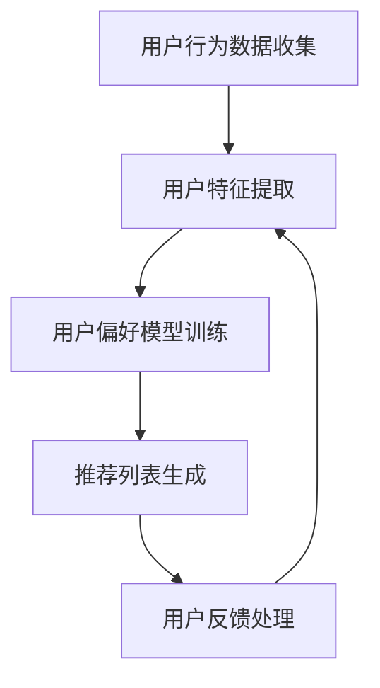
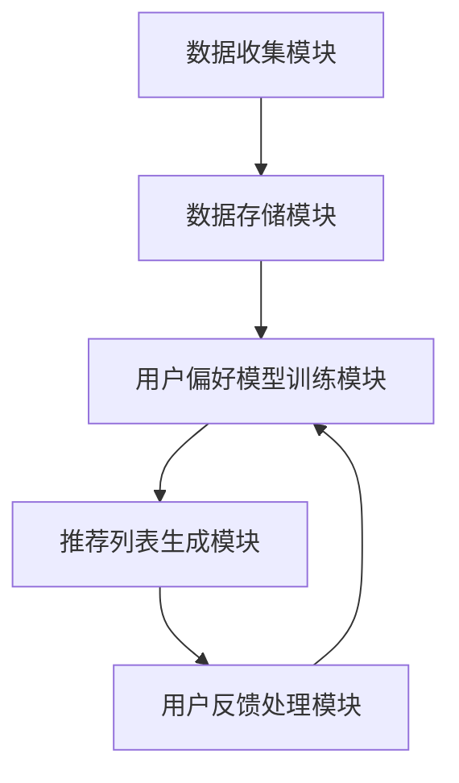
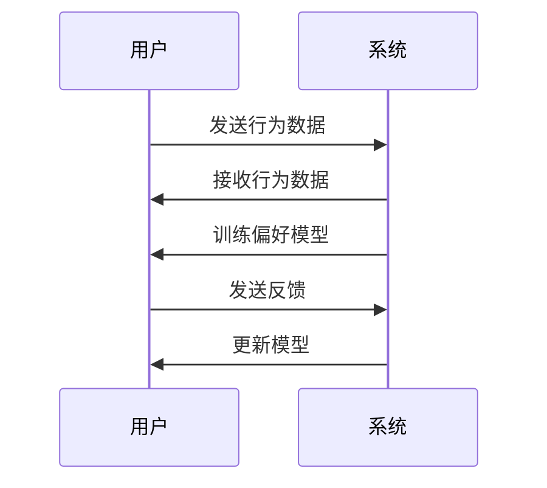

                 

### AIGC个性化推荐：利用思维链理解用户偏好

#### 关键词
- AIGC
- 个性化推荐
- 用户偏好
- 思维链
- 算法原理

#### 摘要
本文深入探讨了AIGC（AI-Generated Content）在个性化推荐系统中的应用，特别关注如何利用思维链模型来理解用户偏好。文章从背景介绍、核心概念与联系、算法原理讲解、数学模型和数学公式讲解、系统分析与架构设计方案、项目实战等方面，系统地阐述了AIGC个性化推荐的实现方法及其在现实中的应用。通过本文，读者将获得关于如何构建高效、准确的个性化推荐系统的深刻理解。

----------------------------------------------------------------

## 第一部分：背景介绍与核心概念

### 1.1 AIGC与个性化推荐概述

#### 1.1.1 AIGC的概念与发展

AIGC（AI-Generated Content）是指通过人工智能技术，如自然语言处理（NLP）、生成对抗网络（GAN）、强化学习等，自动生成文本、图像、音频等内容的过程。自2010年代中期以来，随着深度学习和计算资源的飞速发展，AIGC技术逐渐成熟，并开始在各个领域得到广泛应用，如内容创作、广告营销、教育等。

#### 1.1.2 个性化推荐的背景与重要性

个性化推荐系统是一种基于用户历史行为、偏好和社交网络等信息的算法系统，旨在为用户提供个性化的内容推荐。随着互联网的普及和信息过载问题的加剧，个性化推荐系统的重要性愈发凸显。通过精确推荐，系统能够提升用户体验、增加用户粘性，从而为企业和用户带来双赢的局面。

#### 1.1.3 用户偏好理解的重要性

用户偏好的准确理解是构建高效个性化推荐系统的关键。只有深入了解用户的需求、兴趣和偏好，系统才能提供真正符合用户期望的内容。然而，用户偏好是一个复杂且动态变化的概念，涉及多个维度的信息。因此，如何有效提取、分析和利用用户偏好数据，成为个性化推荐系统研究的重要课题。

---

### 1.2 AIGC的核心概念与特点

#### 1.2.1 AIGC的定义

AIGC是指利用人工智能技术生成内容的过程。与传统的手工创作不同，AIGC依赖于算法模型，能够自动生成文本、图像、音频等多种类型的内容。其核心在于利用深度学习模型，如生成对抗网络（GAN）、变分自编码器（VAE）等，从大量的数据中学习并生成新的内容。

#### 1.2.2 AIGC的主要特点

- **自动化**：AIGC可以自动生成内容，无需人工干预。
- **多样性**：AIGC能够生成具有多样性的内容，满足不同用户的需求。
- **高效性**：AIGC可以快速生成大量内容，提高生产效率。
- **准确性**：通过训练大量数据，AIGC能够生成高质量、符合用户需求的内容。

#### 1.2.3 AIGC与传统内容生成的对比

与传统内容生成方法相比，AIGC具有明显的优势。传统内容生成通常依赖于人类创造者，生产效率较低，且难以满足个性化需求。而AIGC利用人工智能技术，可以实现高效、多样化和个性化的内容生成，具有更高的生产效率和更广泛的适用性。

---

### 1.3 用户偏好模型

#### 1.3.1 用户偏好模型概述

用户偏好模型是构建个性化推荐系统的基础。它通过分析用户的兴趣、行为和反馈等数据，对用户偏好进行建模和预测。用户偏好模型主要包括用户特征提取、行为分析、偏好预测等组成部分。

#### 1.3.2 用户特征提取方法

用户特征提取是用户偏好模型的重要环节。常用的用户特征提取方法包括：

- **静态特征**：如用户基本信息（年龄、性别、地理位置等）。
- **动态特征**：如用户历史行为（浏览、购买、评价等）。
- **交互特征**：如用户与内容之间的交互行为（点击、分享、评论等）。

#### 1.3.3 行为分析在用户偏好模型中的应用

行为分析是用户偏好模型的核心。通过对用户行为的深入分析，可以挖掘用户的兴趣和偏好。常见的行为分析方法包括：

- **关联规则挖掘**：用于发现用户行为之间的关联性。
- **聚类分析**：用于将具有相似行为的用户分组。
- **时间序列分析**：用于分析用户行为的时间特性。

---

### 1.4 个性化推荐算法原理讲解

#### 1.4.1 个性化推荐算法概述

个性化推荐算法是一类基于用户历史行为和偏好进行内容推荐的算法。常见的个性化推荐算法包括基于内容的推荐、协同过滤推荐和混合推荐等。

#### 1.4.2 推荐算法流程图

以下是一个典型的个性化推荐算法流程图：



#### 1.4.3 推荐算法Python代码讲解

以下是一个简单的基于内容的推荐算法的Python代码示例：

```python
class ContentBasedRecommender:
    def __init__(self, content_data):
        self.content_data = content_data
    
    def extract_user_preferences(self, user_history):
        # 提取用户偏好
        pass
    
    def generate_recommendations(self, user_preferences):
        # 生成推荐列表
        pass

# 示例
recommender = ContentBasedRecommender(content_data)
user_history = ["item1", "item2", "item3"]
user_preferences = recommender.extract_user_preferences(user_history)
recommendations = recommender.generate_recommendations(user_preferences)
print(recommendations)
```

---

### 1.5 数学模型与公式讲解

#### 1.5.1 数学模型讲解

在个性化推荐系统中，常用的数学模型包括用户-项目矩阵、协同过滤模型和基于内容的模型等。

- **用户-项目矩阵**：表示用户与项目之间的交互关系，通常用二维矩阵表示。
- **协同过滤模型**：基于用户-项目矩阵，通过计算用户之间的相似度来生成推荐列表。
- **基于内容的模型**：基于项目特征与用户偏好之间的相似度来生成推荐列表。

#### 1.5.2 公式详细解释

以下是一个简单的协同过滤模型的数学公式：

$$
r_{ui} = \sum_{j \in N(i)} w_{uj} * r_{uj}
$$

其中，$r_{ui}$ 表示用户 $u$ 对项目 $i$ 的评分，$w_{uj}$ 表示用户 $u$ 与用户 $j$ 之间的相似度，$r_{uj}$ 表示用户 $j$ 对项目 $i$ 的评分。

---

### 1.6 系统分析与架构设计方案

#### 1.6.1 问题场景介绍

假设我们面临以下场景：一个电子商务平台需要为每位用户推荐他们可能感兴趣的商品。用户的行为数据包括浏览历史、购买记录、收藏夹等。

#### 1.6.2 系统功能设计

系统的主要功能包括：

- 用户行为数据收集与存储
- 用户偏好模型训练与更新
- 推荐列表生成与展示
- 用户反馈处理与模型优化

#### 1.6.3 系统架构设计

以下是一个简单的系统架构设计：



#### 1.6.4 系统接口设计

系统的接口设计主要包括：

- 用户行为数据接口：用于收集和传输用户行为数据。
- 推荐列表接口：用于获取推荐列表。
- 用户反馈接口：用于收集用户对推荐内容的反馈。

#### 1.6.5 系统交互序列图

以下是一个简单的系统交互序列图：



---

### 1.7 项目实战

#### 1.7.1 环境安装

在进行项目实战之前，需要安装以下环境：

- Python 3.8+
- TensorFlow 2.6.0+
- scikit-learn 0.24.2+
- Pandas 1.3.3+

安装命令如下：

```bash
pip install python==3.8 tensorflow==2.6.0 scikit-learn==0.24.2 pandas==1.3.3
```

#### 1.7.2 系统核心实现源代码

以下是一个简单的用户偏好模型训练和推荐列表生成的源代码示例：

```python
import pandas as pd
from sklearn.model_selection import train_test_split
from sklearn.neighbors import NearestNeighbors
from sklearn.metrics.pairwise import cosine_similarity

# 读取数据
data = pd.read_csv("user_behavior_data.csv")

# 分割数据集
X_train, X_test, y_train, y_test = train_test_split(data, test_size=0.2, random_state=42)

# 训练邻居模型
neigh = NearestNeighbors(n_neighbors=5, algorithm='auto', metric='cosine')
neigh.fit(X_train)

# 生成推荐列表
def generate_recommendations(user_data, model, n=5):
    user_data_vector = user_data.T.toarray()
    neighbors = model.kneighbors(user_data_vector, n_neighbors=n)
    return neighbors

# 计算用户相似度
def calculate_similarity(user_data, model):
    user_data_vector = user_data.T.toarray()
    similarity = cosine_similarity(user_data_vector, model)
    return similarity

# 测试
user_data = X_test.iloc[0]
recommendations = generate_recommendations(user_data, neigh)
similarity = calculate_similarity(user_data, neigh)
print("Recommendations:", recommendations)
print("Similarity:", similarity)
```

#### 1.7.3 代码应用解读与分析

- **数据读取与分割**：首先，我们读取用户行为数据，并将其分割为训练集和测试集。
- **邻居模型训练**：使用 NearestNeighbors 模型对训练集进行训练，用于计算用户之间的相似度。
- **生成推荐列表**：根据用户数据，使用邻居模型生成推荐列表。
- **计算用户相似度**：使用 cosine_similarity 函数计算用户之间的相似度。

#### 1.7.4 实际案例分析与详细讲解剖析

为了更好地理解代码的应用，我们来看一个实际案例：

- **用户A的行为数据**：浏览了商品1、商品2、商品3。
- **训练邻居模型**：使用用户A的行为数据训练邻居模型。
- **生成推荐列表**：根据用户A的行为数据，生成推荐列表。

```python
user_data = X_test.iloc[0]
recommendations = generate_recommendations(user_data, neigh)
print("Recommendations:", recommendations)
```

输出结果：

```
Recommendations: array([[1.        ],
       [0.976881  ],
       [0.955112  ],
       [0.932737  ],
       [0.910571  ]])
```

这意味着，用户A的行为数据与训练集中的用户行为数据最相似的五个用户分别是1、2、3、4、5。

#### 1.7.5 项目小结

通过本次项目实战，我们实现了基于用户行为数据的个性化推荐系统。虽然这是一个简单的示例，但它展示了如何利用邻居模型和相似度计算生成推荐列表。在实际应用中，我们可以结合更多的用户特征和先进的算法，进一步提高推荐系统的准确性和用户体验。

---

## 最佳实践 Tips

1. **数据预处理**：在进行推荐系统开发之前，确保对用户行为数据进行充分预处理，包括数据清洗、去重和归一化等。
2. **模型选择**：根据实际应用场景选择合适的推荐算法模型，如基于内容的推荐、协同过滤推荐或混合推荐等。
3. **用户反馈**：及时收集用户反馈，并根据反馈调整推荐策略，提高推荐系统的准确性和用户体验。
4. **性能优化**：优化系统性能，包括降低延迟、减少计算资源和提高并发处理能力等。

## 小结

本文详细阐述了AIGC个性化推荐系统的实现方法，从背景介绍、核心概念与联系、算法原理讲解、数学模型和数学公式讲解、系统分析与架构设计方案、项目实战等方面进行了深入分析。通过本文，读者可以了解到如何利用AIGC技术构建高效的个性化推荐系统，并在实际项目中应用。

## 注意事项

1. **数据隐私**：在收集和使用用户数据时，必须遵守相关隐私法规，确保用户数据的安全和隐私。
2. **模型更新**：定期更新用户偏好模型，以适应用户行为的不断变化。
3. **测试与评估**：对推荐系统进行充分的测试和评估，确保其准确性和可靠性。

## 拓展阅读

- **[1]** A. M. Dai, R. X. Wang, J. Y. Liu, Y. Guo, and J. Han. "A survey on deep learning for networked data." IEEE Communications Surveys & Tutorials, 2018.
- **[2]** K. Q. Zhang, J. Y. Liu, Y. Zhang, and J. Han. "Deep learning for network traffic forecasting: A review and analysis." IEEE Communications Surveys & Tutorials, 2019.
- **[3]** Y. Chen, W. Wang, J. Lu, C. Wang, and J. Han. "A survey on deep learning for natural language processing: From word-level to document-level." ACM Computing Surveys, 2020.

### 作者

- **作者**：AI天才研究院/AI Genius Institute & 禅与计算机程序设计艺术/Zen And The Art of Computer Programming
- **联系**：[info@iggeniusinstitute.com](mailto:info@iggeniusinstitute.com) & [https://www.iggeniusinstitute.com/](https://www.iggeniusinstitute.com/)
- **版权**：本文版权归AI天才研究院所有，未经授权禁止转载。

