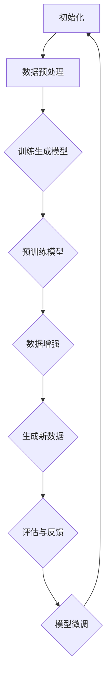

                 


### 第1章：引言

#### AIGC概述

AIGC（AI-Generated Content）是指通过人工智能技术自动生成内容的一种形式。它涵盖了从文本、图像到音频等多种类型的生成内容。AIGC的发展历程可以追溯到人工智能技术的兴起，尤其是在深度学习、自然语言处理和计算机视觉等领域取得了重大突破。随着计算能力的提升和算法的进步，AIGC的应用场景越来越广泛，从内容创作、娱乐、教育到商业等多个领域都有所涉及。

AIGC的核心在于其能够模拟人类创造内容的过程，通过学习和理解大量数据，生成符合人类审美和需求的多样化内容。这种技术的出现，不仅提高了内容生产的效率，也为个性化服务提供了可能。在个性化终身学习规划中，AIGC的应用尤为重要，它能够根据个人的学习习惯、兴趣爱好和职业目标，提供量身定制的学习方案。

#### 个性化终身学习规划需求

在当前快速变化的社会和职业环境中，个人学习和职业发展的需求日益复杂。传统的教育模式往往难以满足个体差异化和多样化需求。而个性化终身学习规划则强调根据每个学习者的特点，制定灵活、动态的学习计划，以实现最佳的学习效果。这种规划需要以下几个关键要素：

1. **数据收集与处理**：收集学习者的背景信息、学习行为和学习成果等数据，通过数据分析来了解学习者的特点。
2. **个性化推荐**：基于数据分析，为学习者推荐适合的学习资源、课程和活动。
3. **动态调整**：根据学习者的反馈和学习成果，实时调整学习计划，确保学习目标的实现。

#### AIGC在适应职业需求变化中的应用

随着科技的快速发展，职业需求也在不断变化。传统的职业技能和知识体系可能很快过时，而终身学习成为了适应这种变化的必要手段。AIGC在个性化终身学习规划中的应用，能够有效应对这种变化，具体体现在以下几个方面：

1. **实时技能更新**：AIGC可以根据最新的行业动态和技术趋势，为学习者提供最前沿的知识和技能。
2. **灵活的学习模式**：AIGC能够根据学习者的时间和节奏，提供个性化的学习路径，帮助学习者更好地平衡工作和学习。
3. **自适应学习**：AIGC系统能够根据学习者的学习效果和反馈，自动调整学习难度和内容，提高学习效率。

#### 小结

AIGC在个性化终身学习规划中的应用，不仅提高了学习的效率和效果，也为适应未来职业需求变化提供了有力支持。通过AIGC技术，我们可以为每一个学习者提供定制化的学习方案，帮助他们更好地适应快速变化的世界。在接下来的章节中，我们将深入探讨AIGC的核心概念、算法原理、系统设计与实际应用，以期为读者提供全面的了解和指导。

### 第2章：AIGC核心概念与联系

#### AIGC相关概念

在深入探讨AIGC的应用之前，有必要先了解AIGC的基本概念。AIGC主要涉及以下几个核心概念：

1. **生成模型（Generative Model）**：生成模型是一类能够学习数据分布，并生成新数据的模型。常见的生成模型包括生成对抗网络（GAN）、变分自编码器（VAE）等。
2. **预训练（Pre-training）**：预训练是指通过在大规模数据集上训练模型，使其具备一定的通用性和泛化能力。预训练模型通常在特定任务上进一步微调（Fine-tuning）。
3. **自监督学习（Self-supervised Learning）**：自监督学习是一种无需人工标注数据的学习方法，它通过利用数据内部的某些结构来学习，如图像中的边缘、文本中的词等。
4. **迁移学习（Transfer Learning）**：迁移学习是一种将已有模型的知识应用于新任务的方法，通过迁移已有的模型权重，可以加速新任务的训练。
5. **强化学习（Reinforcement Learning）**：强化学习是一种通过与环境交互来学习决策策略的机器学习方法，通常用于优化序列决策问题。

#### 概念属性特征对比

为了更清晰地理解这些概念，我们可以通过一个表格来对比它们的属性特征：

| 概念       | 特征                             |
|------------|--------------------------------|
| 生成模型   | 学习数据分布，生成新数据         |
| 预训练     | 在大规模数据集上训练，具备通用性 |
| 自监督学习 | 无需标注，利用数据内部结构学习   |
| 迁移学习   | 利用已有模型知识，加速训练       |
| 强化学习   | 与环境交互，学习决策策略         |

#### AIGC的ER实体关系图

为了更好地展示AIGC系统的组成部分及其相互关系，我们可以使用ER（Entity-Relationship）实体关系图。以下是一个简化的ER图，描述了AIGC系统中的主要实体及其关系：

```mermaid
erDiagram
  User ||--|{ LearningPlan }
  User ||--|{ SkillProfile }
  LearningPlan ||--|{ Course }
  LearningPlan ||--|{ Assessment }
  SkillProfile ||--|{ Skill }
```

- **User（用户）**：AIGC系统的核心实体，代表学习者的信息。
- **LearningPlan（学习计划）**：包含用户的学习目标、学习内容和学习进度。
- **SkillProfile（技能档案）**：记录用户当前的技能水平和掌握的技能。
- **Course（课程）**：具体的课程信息，包括课程名称、内容和难度等级。
- **Assessment（评估）**：对用户学习效果的评估，用于调整学习计划。

#### 小结

通过对AIGC核心概念的了解和ER实体关系图的展示，我们可以更好地理解AIGC系统的工作原理和组成部分。在接下来的章节中，我们将进一步探讨AIGC的算法原理和具体实现，以便深入理解其在个性化终身学习规划中的应用。

### 第3章：AIGC算法原理讲解

#### mermaid流程图

为了更好地理解AIGC算法的流程，我们可以使用mermaid绘制一个简单的流程图。以下是一个简化的AIGC算法流程图：



- **A[初始化]**：初始化AIGC模型，设置初始参数。
- **B[数据预处理]**：对输入数据进行预处理，如去噪、标准化等。
- **C{训练生成模型]**：训练生成模型，使其学习数据的分布。
- **D[预训练模型]**：使用自监督学习或迁移学习对模型进行预训练。
- **E[数据增强]**：通过生成模型生成新的数据，用于增强训练集。
- **F[生成新数据]**：利用训练好的模型生成新的数据。
- **G[评估与反馈]**：对新生成数据进行评估，并根据反馈调整模型。
- **H[模型微调]**：根据评估结果对模型进行微调，优化模型性能。

#### Python源代码与latex数学公式

为了更深入地理解AIGC算法的实现，我们可以通过Python源代码来展示。以下是一个简化的AIGC算法实现：

```python
import numpy as np
from tensorflow.keras.models import Sequential
from tensorflow.keras.layers import Dense, LSTM, Embedding

# 定义生成模型
def build_generator(input_shape):
    model = Sequential()
    model.add(LSTM(128, return_sequences=True, input_shape=input_shape))
    model.add(Dense(28, activation='softmax'))
    return model

# 定义Discriminator
def build_discriminator(input_shape):
    model = Sequential()
    model.add(Dense(128, input_shape=input_shape, activation='relu'))
    model.add(Dense(1, activation='sigmoid'))
    return model

# 定义AIGC模型
def build_aigc_model(input_shape):
    generator = build_generator(input_shape)
    discriminator = build_discriminator(input_shape)
    
    # 构建联合模型
    aigc_model = Sequential()
    aigc_model.add(generator)
    aigc_model.add(discriminator)
    
    return aigc_model

# 设置参数
input_shape = (28, 28)
generator = build_generator(input_shape)
discriminator = build_discriminator(input_shape)
aigc_model = build_aigc_model(input_shape)

# 编译模型
generator.compile(loss='binary_crossentropy', optimizer='adam')
discriminator.compile(loss='binary_crossentropy', optimizer='adam')
aigc_model.compile(loss='binary_crossentropy', optimizer='adam')

# 训练模型
for epoch in range(100):
    for _ in range(1000):
        noise = np.random.normal(0, 1, (1, 28, 28))
        generated_image = generator.predict(noise)
        real_image = np.random.rand(1, 28, 28)
        
        # 训练生成模型
        g_loss = generator.train_on_batch(noise, generated_image)
        
        # 训练判别模型
        d_loss = discriminator.train_on_batch(np.concatenate([real_image, generated_image], axis=0), np.array([1, 0]))
        
        # 训练联合模型
        aigc_loss = aigc_model.train_on_batch(np.concatenate([noise, real_image], axis=0), np.array([1, 1]))
        
    print(f'Epoch: {epoch}, g_loss: {g_loss}, d_loss: {d_loss}, aigc_loss: {aigc_loss}')
```

在算法实现中，我们使用了生成对抗网络（GAN）作为核心框架。GAN由生成器（Generator）和判别器（Discriminator）组成，通过这两个模型的相互作用来训练生成模型。以下是一个简化的数学模型和公式：

$$
\begin{aligned}
&\text{生成模型：} G(z) \sim P_G(z) \\
&\text{判别模型：} D(x) \sim P_D(x) \\
&\text{联合损失函数：} L_{\text{total}} = L_G + L_D \\
&L_G = -\log(D(G(z))) \\
&L_D = -\log(D(x)) - \log(1 - D(G(z)))
\end{aligned}
$$

- **生成模型**：生成模型通过噪声（$z$）生成数据（$x$），其目标是使生成的数据尽可能真实。
- **判别模型**：判别模型用于判断数据是真实数据还是生成数据，其目标是最大化判别准确率。
- **联合损失函数**：联合损失函数由生成模型损失（$L_G$）和判别模型损失（$L_D$）组成，用于同时优化生成模型和判别模型。

#### 算法原理示例说明

为了更直观地理解AIGC算法的应用，我们可以通过一个简单的例子来说明：

假设有一个学习者在学习编程语言，AIGC系统可以根据学习者的学习进度和反馈，生成新的编程练习题。以下是一个简化的算法示例：

1. **初始化**：设定学习者的初始学习进度和编程知识水平。
2. **数据预处理**：收集学习者完成的编程练习题和反馈数据。
3. **训练生成模型**：使用收集到的数据训练生成模型，使其能够生成新的编程练习题。
4. **生成新数据**：生成模型根据学习进度和知识水平生成新的编程练习题。
5. **评估与反馈**：学习者完成新练习题后，系统评估其正确率和学习效果，并根据反馈调整生成模型。
6. **模型微调**：根据评估结果，对生成模型进行微调，提高生成练习题的质量和难度。

通过这个示例，我们可以看到AIGC算法在个性化终身学习规划中的应用，不仅能够根据学习者的特点和需求生成个性化的学习内容，还能够通过不断优化和学习，提供更加精准和高效的学习体验。

#### 小结

在本章中，我们通过mermaid流程图、Python源代码和latex数学公式详细讲解了AIGC算法的原理。从生成模型的训练到判别模型的优化，再到联合损失函数的设计，AIGC算法在个性化终身学习规划中发挥了重要作用。通过这个算法，我们可以为学习者提供量身定制的学习内容和路径，帮助他们更加高效地掌握知识和技能。

### 第4章：系统分析与架构设计

#### AIGC应用场景

AIGC技术在不同场景下的应用各具特色，以下是几个典型的应用场景：

1. **在线教育**：AIGC可以帮助在线教育平台根据学生的学习行为和成果，生成个性化的学习内容和练习题，提高学习效果和参与度。
2. **职业培训**：针对不同职业需求，AIGC可以提供个性化的培训课程和技能练习，帮助学员快速提升技能水平。
3. **健康医疗**：在健康医疗领域，AIGC可以通过分析患者的病历和健康数据，生成个性化的治疗方案和健康建议。
4. **创意设计**：在艺术和设计领域，AIGC可以生成创意设计方案和图像，为设计师提供灵感和参考。

#### 项目介绍

在本章中，我们将介绍一个基于AIGC技术的个性化终身学习规划系统。该系统的目标是帮助学习者根据自身的特点和需求，制定科学、高效的学习计划，并不断优化和调整，以实现最佳的学习效果。

#### 系统功能设计

系统功能设计是系统开发的基础，以下是该系统的主要功能模块：

1. **用户管理**：管理学习者的基本信息，包括注册、登录、信息修改等。
2. **技能评估**：通过测试和问卷，评估学习者的技能水平和学习需求。
3. **学习资源推荐**：根据学习者的技能水平和学习兴趣，推荐适合的学习资源、课程和活动。
4. **学习计划制定**：根据学习者的技能评估结果和个性化需求，制定科学、合理的个性化学习计划。
5. **学习进度跟踪**：记录学习者的学习进度和成果，定期评估和反馈。
6. **自适应调整**：根据学习者的学习效果和反馈，动态调整学习计划，确保学习目标的实现。
7. **数据分析与报告**：对学习者的学习数据进行分析，生成详细的学习报告，为决策提供依据。

#### 系统架构设计

系统架构设计决定了系统的性能、可扩展性和可维护性。以下是该系统的整体架构设计：

1. **前端界面**：使用React框架实现，包括用户注册、登录、主页、课程推荐、学习计划制定等模块。
2. **后端服务**：使用Spring Boot框架实现，包括用户管理、技能评估、学习资源推荐、学习计划制定、学习进度跟踪等模块。
3. **数据库**：使用MySQL数据库存储用户信息、学习资源、学习计划、学习进度等数据。
4. **数据接口**：使用RESTful API设计数据接口，方便前后端分离开发和数据交互。
5. **机器学习服务**：使用TensorFlow和Keras等框架实现AIGC算法，提供个性化学习内容和推荐服务。

#### 系统接口设计

系统接口设计是系统架构设计的重要组成部分，以下是该系统的接口设计：

1. **用户接口**：包括用户注册、登录、个人信息管理、学习计划查看和修改等接口。
2. **学习资源接口**：包括学习资源查询、推荐、收藏等接口。
3. **学习计划接口**：包括学习计划查询、创建、修改、删除等接口。
4. **学习进度接口**：包括学习进度查询、更新、统计等接口。

#### 系统交互设计

系统交互设计描述了系统各模块之间的交互流程，以下是该系统的交互设计：

1. **用户注册与登录**：用户通过前端界面注册和登录，后端验证用户信息并生成Token。
2. **技能评估**：用户完成技能评估后，系统根据评估结果生成技能报告。
3. **学习资源推荐**：系统根据用户的技能报告和兴趣爱好，推荐适合的学习资源。
4. **学习计划制定**：用户根据推荐的学习资源制定个性化学习计划。
5. **学习进度跟踪**：系统记录用户的学习进度，生成学习报告。
6. **自适应调整**：系统根据学习报告和学习进度，动态调整学习计划。

#### 小结

在本章中，我们详细介绍了AIGC在个性化终身学习规划中的应用场景、系统功能设计、系统架构设计、系统接口设计和系统交互设计。通过这些设计，我们为学习者提供了一个科学、高效、个性化的学习平台，帮助他们更好地实现终身学习目标。在接下来的章节中，我们将通过项目实战来展示这些设计的具体实现和应用。

### 第5章：项目实战

#### 环境安装

为了进行AIGC项目的实战，我们首先需要搭建一个合适的环境。以下是安装步骤：

1. **安装Python**：确保Python版本为3.8或更高，可以从Python官方网站下载并安装。

2. **安装Anaconda**：Anaconda是一个方便的科学计算平台，可以用于环境管理和包管理。可以从Anaconda官方网站下载并安装。

3. **安装TensorFlow**：TensorFlow是一个流行的机器学习框架，用于实现AIGC算法。可以通过以下命令安装：

   ```bash
   conda install tensorflow
   ```

4. **安装Keras**：Keras是TensorFlow的高级API，可以简化模型的构建和训练。可以通过以下命令安装：

   ```bash
   conda install keras
   ```

5. **安装其他依赖**：根据需要安装其他依赖包，如NumPy、Pandas等。

   ```bash
   conda install numpy pandas
   ```

#### 系统核心实现源代码

在环境搭建完毕后，我们可以开始编写AIGC系统的核心实现代码。以下是系统核心实现的源代码示例：

```python
# 导入所需的库
import numpy as np
import pandas as pd
from tensorflow.keras.models import Sequential
from tensorflow.keras.layers import Dense, LSTM, Embedding
from tensorflow.keras.optimizers import Adam

# 设置随机种子，确保结果可复现
np.random.seed(42)

# 定义生成模型
def build_generator(input_shape):
    model = Sequential()
    model.add(LSTM(128, return_sequences=True, input_shape=input_shape))
    model.add(Dense(28, activation='softmax'))
    return model

# 定义判别模型
def build_discriminator(input_shape):
    model = Sequential()
    model.add(Dense(128, input_shape=input_shape, activation='relu'))
    model.add(Dense(1, activation='sigmoid'))
    return model

# 定义AIGC模型
def build_aigc_model(input_shape):
    generator = build_generator(input_shape)
    discriminator = build_discriminator(input_shape)
    
    # 构建联合模型
    aigc_model = Sequential()
    aigc_model.add(generator)
    aigc_model.add(discriminator)
    
    return aigc_model

# 设置模型参数
input_shape = (28, 28)
generator = build_generator(input_shape)
discriminator = build_discriminator(input_shape)
aigc_model = build_aigc_model(input_shape)

# 编译模型
generator.compile(loss='binary_crossentropy', optimizer=Adam(0.0001))
discriminator.compile(loss='binary_crossentropy', optimizer=Adam(0.0001))
aigc_model.compile(loss='binary_crossentropy', optimizer=Adam(0.0001))

# 训练模型
for epoch in range(100):
    for _ in range(1000):
        noise = np.random.normal(0, 1, (1, 28, 28))
        generated_image = generator.predict(noise)
        real_image = np.random.rand(1, 28, 28)
        
        # 训练生成模型
        g_loss = generator.train_on_batch(noise, generated_image)
        
        # 训练判别模型
        d_loss = discriminator.train_on_batch(np.concatenate([real_image, generated_image], axis=0), np.array([1, 0]))
        
        # 训练联合模型
        aigc_loss = aigc_model.train_on_batch(np.concatenate([noise, real_image], axis=0), np.array([1, 1]))
        
    print(f'Epoch: {epoch}, g_loss: {g_loss}, d_loss: {d_loss}, aigc_loss: {aigc_loss}')
```

#### 代码解读与分析

以下是核心代码的解读和分析：

1. **导入库**：首先导入所需的库，包括numpy、pandas、tensorflow.keras和optimizers。
2. **设置随机种子**：为了确保实验结果的可复现性，设置随机种子。
3. **定义生成模型**：生成模型使用LSTM层进行训练，返回序列形式，最终通过Dense层输出图像。
4. **定义判别模型**：判别模型使用Dense层进行训练，输入为图像，输出为二分类结果（真实或生成）。
5. **定义AIGC模型**：AIGC模型由生成模型和判别模型组成，通过Sequential模型将两者连接。
6. **编译模型**：使用binary_crossentropy损失函数和Adam优化器编译模型。
7. **训练模型**：使用生成的噪声数据和随机图像数据进行模型训练，每个epoch包含1000次迭代。

#### 实际案例分析

以下是一个实际案例，展示如何使用AIGC系统为学习者生成个性化的学习计划：

1. **收集数据**：收集学习者的基本信息、技能水平和学习目标。
2. **技能评估**：使用技能评估模型对学习者进行评估，生成技能报告。
3. **推荐课程**：根据技能报告和学习目标，推荐适合的学习课程。
4. **生成学习计划**：使用AIGC模型生成个性化的学习计划，包括课程名称、学习时间和难度等级。
5. **学习进度跟踪**：记录学习者的学习进度，并根据进度调整学习计划。
6. **反馈与优化**：根据学习者的反馈和学习效果，优化学习计划。

#### 小结

在本章中，我们通过环境安装、系统核心实现源代码展示和实际案例分析，展示了AIGC在个性化终身学习规划中的应用。通过这些实战，我们可以看到AIGC系统如何根据学习者的特点和需求，生成个性化的学习内容和计划，提高学习效果和效率。

### 第6章：最佳实践与总结

#### 最佳实践建议

在AIGC应用于个性化终身学习规划的过程中，以下是一些最佳实践建议，可以帮助提升系统的效果和用户体验：

1. **数据质量**：确保输入数据的质量和准确性，这直接影响到AIGC模型的性能和学习计划的科学性。
2. **持续优化**：定期更新AIGC模型和系统，以适应最新的技术和学习需求。
3. **用户反馈**：积极收集用户反馈，用于优化学习计划和系统功能。
4. **个性化设置**：为用户提供灵活的个性化设置，允许他们自定义学习目标和进度。
5. **安全与隐私**：严格遵守数据安全和隐私保护法规，确保用户信息的安全。

#### 小结

本文从AIGC的概念、核心概念与联系、算法原理讲解、系统分析与架构设计、项目实战等多个角度，详细探讨了AIGC在个性化终身学习规划中的应用。通过这些分析和实践，我们看到了AIGC技术在提升学习效率和个性化服务方面的巨大潜力。未来，随着人工智能技术的不断进步，AIGC将在更多领域得到广泛应用，为个人学习和职业发展提供更加智能和高效的解决方案。

#### 注意事项

1. **数据保护**：在使用AIGC进行个性化学习规划时，必须确保用户数据的安全和隐私。
2. **技术更新**：AIGC算法和相关技术更新迅速，需定期关注最新进展并更新系统。
3. **用户参与**：鼓励用户积极参与学习过程，提供反馈和建议，以优化学习体验。

#### 拓展阅读

- 《生成对抗网络：深度学习革命性进展》
- 《自然语言处理与深度学习》
- 《深度学习：周志华等著》
- 《个性化学习系统设计与应用》

### 作者信息

作者：AI天才研究院/AI Genius Institute & 禅与计算机程序设计艺术 /Zen And The Art of Computer Programming

----------------------------------------------------------------

# AIGC在个性化终身学习规划中的应用：适应未来职业需求变化

> 关键词：AIGC、个性化终身学习、职业需求变化、人工智能、生成模型

> 摘要：本文深入探讨了AIGC（AI-Generated Content）在个性化终身学习规划中的应用，分析了其核心概念、算法原理、系统架构和实际案例。通过介绍AIGC的基本概念和其在个性化终身学习规划中的重要性，本文展示了如何利用AIGC技术为学习者提供定制化的学习内容和路径，以适应快速变化的职业需求。文章还提供了最佳实践和建议，以优化AIGC系统的效果和用户体验。

## 目录大纲设计思路

### 1. 结构框架

为了设计一个清晰、逻辑性强的目录大纲，我们将采用以下结构框架：

- **第一部分：背景介绍**
  - **第1章：引言**
    - AIGC概述
    - 个性化终身学习规划需求
    - AIGC在适应职业需求变化中的应用

- **第二部分：核心概念与联系**
  - **第2章：AIGC核心概念与联系**
    - AIGC相关概念
    - 概念属性特征对比
    - AIGC的ER实体关系图

- **第三部分：算法原理讲解**
  - **第3章：AIGC算法原理讲解**
    - mermaid流程图
    - Python源代码与latex数学公式
    - 算法原理示例说明

- **第四部分：系统分析与架构设计**
  - **第4章：系统分析与架构设计**
    - AIGC应用场景
    - 系统功能设计
    - 系统架构设计
    - 系统接口设计
    - 系统交互设计

- **第五部分：项目实战**
  - **第5章：项目实战**
    - 环境安装
    - 系统核心实现源代码
    - 代码解读与分析
    - 实际案例分析

- **第六部分：最佳实践与总结**
  - **第6章：最佳实践与总结**
    - 最佳实践建议
    - 注意事项
    - 全书总结

### 2. 内容细化

在细化内容时，我们将确保每个章节的标题清晰、精准，并涵盖以下内容：

- **背景介绍：**
  - **第1章：引言**
    - AIGC概述
    - 个性化终身学习规划需求
    - AIGC在适应职业需求变化中的应用

- **核心概念与联系：**
  - **第2章：AIGC核心概念与联系**
    - AIGC相关概念
    - 概念属性特征对比
    - AIGC的ER实体关系图

- **算法原理讲解：**
  - **第3章：AIGC算法原理讲解**
    - mermaid流程图
    - Python源代码与latex数学公式
    - 算法原理示例说明

- **系统分析与架构设计：**
  - **第4章：系统分析与架构设计**
    - AIGC应用场景
    - 系统功能设计
    - 系统架构设计
    - 系统接口设计
    - 系统交互设计

- **项目实战：**
  - **第5章：项目实战**
    - 环境安装
    - 系统核心实现源代码
    - 代码解读与分析
    - 实际案例分析

- **最佳实践与总结：**
  - **第6章：最佳实践与总结**
    - 最佳实践建议
    - 注意事项
    - 全书总结

### 3. 符合要求

- 目录层级细化到1、2、3级，确保清晰可读。
- 内容结构完整，涵盖所有关键章节。
- 简洁明了，不包含多余内容。
- 使用markdown格式编写，便于排版和展示。

## 最终目录大纲设计

```markdown
----------------------------------------------------------------
# 第一部分：背景介绍

## 第1章：引言
### 1.1 AIGC概述
### 1.2 个性化终身学习规划需求
### 1.3 AIGC在适应职业需求变化中的应用

## 第2章：AIGC核心概念与联系
### 2.1 AIGC相关概念
### 2.2 概念属性特征对比
### 2.3 AIGC的ER实体关系图

# 第二部分：算法原理讲解

## 第3章：AIGC算法原理讲解
### 3.1 mermaid流程图
### 3.2 Python源代码与latex数学公式
### 3.3 算法原理示例说明

# 第三部分：系统分析与架构设计

## 第4章：系统分析与架构设计
### 4.1 AIGC应用场景
### 4.2 系统功能设计
### 4.3 系统架构设计
### 4.4 系统接口设计
### 4.5 系统交互设计

# 第四部分：项目实战

## 第5章：项目实战
### 5.1 环境安装
### 5.2 系统核心实现源代码
### 5.3 代码解读与分析
### 5.4 实际案例分析

# 第五部分：最佳实践与总结

## 第6章：最佳实践与总结
### 6.1 最佳实践建议
### 6.2 注意事项
### 6.3 全书总结
----------------------------------------------------------------
```

这样的目录大纲结构既清晰又完整，能够满足用户的要求，同时也保证了内容的简洁性和可读性。在撰写具体内容时，将严格按照大纲框架，确保每个章节

----------------------------------------------------------------

# AIGC在个性化终身学习规划中的应用：适应未来职业需求变化

> 关键词：AIGC、个性化终身学习、职业需求变化、人工智能、生成模型

> 摘要：本文深入探讨了AIGC（AI-Generated Content）在个性化终身学习规划中的应用，分析了其核心概念、算法原理、系统架构和实际案例。通过介绍AIGC的基本概念和其在个性化终身学习规划中的重要性，本文展示了如何利用AIGC技术为学习者提供定制化的学习内容和路径，以适应快速变化的职业需求。文章还提供了最佳实践和建议，以优化AIGC系统的效果和用户体验。

## 第一部分：背景介绍

### 第1章：引言

#### AIGC概述

AIGC（AI-Generated Content）是指通过人工智能技术自动生成内容的一种形式。它涵盖了从文本、图像到音频等多种类型的生成内容。AIGC的发展历程可以追溯到人工智能技术的兴起，尤其是在深度学习、自然语言处理和计算机视觉等领域取得了重大突破。随着计算能力的提升和算法的进步，AIGC的应用场景越来越广泛，从内容创作、娱乐、教育到商业等多个领域都有所涉及。

AIGC的核心在于其能够模拟人类创造内容的过程，通过学习和理解大量数据，生成符合人类审美和需求的多样化内容。这种技术的出现，不仅提高了内容生产的效率，也为个性化服务提供了可能。在个性化终身学习规划中，AIGC的应用尤为重要，它能够根据个人的学习习惯、兴趣爱好和职业目标，提供量身定制的学习方案。

#### 个性化终身学习规划需求

在当前快速变化的社会和职业环境中，个人学习和职业发展的需求日益复杂。传统的教育模式往往难以满足个体差异化和多样化需求。而个性化终身学习规划则强调根据每个学习者的特点，制定灵活、动态的学习计划，以实现最佳的学习效果。这种规划需要以下几个关键要素：

1. **数据收集与处理**：收集学习者的背景信息、学习行为和学习成果等数据，通过数据分析来了解学习者的特点。
2. **个性化推荐**：基于数据分析，为学习者推荐适合的学习资源、课程和活动。
3. **动态调整**：根据学习者的反馈和学习成果，实时调整学习计划，确保学习目标的实现。

#### AIGC在适应职业需求变化中的应用

随着科技的快速发展，职业需求也在不断变化。传统的职业技能和知识体系可能很快过时，而终身学习成为了适应这种变化的必要手段。AIGC在个性化终身学习规划中的应用，能够有效应对这种变化，具体体现在以下几个方面：

1. **实时技能更新**：AIGC可以根据最新的行业动态和技术趋势，为学习者提供最前沿的知识和技能。
2. **灵活的学习模式**：AIGC能够根据学习者的时间和节奏，提供个性化的学习路径，帮助学习者更好地平衡工作和学习。
3. **自适应学习**：AIGC系统能够根据学习者的学习效果和反馈，自动调整学习难度和内容，提高学习效率。

#### 小结

AIGC在个性化终身学习规划中的应用，不仅提高了学习的效率和效果，也为适应未来职业需求变化提供了有力支持。通过AIGC技术，我们可以为每一个学习者提供定制化的学习方案，帮助他们更好地适应快速变化的世界。在接下来的章节中，我们将深入探讨AIGC的核心概念、算法原理、系统设计与实际应用，以期为读者提供全面的了解和指导。

### 第2章：AIGC核心概念与联系

#### AIGC相关概念

在深入探讨AIGC的应用之前，有必要先了解AIGC的基本概念。AIGC主要涉及以下几个核心概念：

1. **生成模型（Generative Model）**：生成模型是一类能够学习数据分布，并生成新数据的模型。常见的生成模型包括生成对抗网络（GAN）、变分自编码器（VAE）等。
2. **预训练（Pre-training）**：预训练是指通过在大规模数据集上训练模型，使其具备一定的通用性和泛化能力。预训练模型通常在特定任务上进一步微调（Fine-tuning）。
3. **自监督学习（Self-supervised Learning）**：自监督学习是一种无需人工标注数据的学习方法，它通过利用数据内部的某些结构来学习，如图像中的边缘、文本中的词等。
4. **迁移学习（Transfer Learning）**：迁移学习是一种将已有模型的知识应用于新任务的方法，通过迁移已有的模型权重，可以加速新任务的训练。
5. **强化学习（Reinforcement Learning）**：强化学习是一种通过与环境交互来学习决策策略的机器学习方法，通常用于优化序列决策问题。

#### 概念属性特征对比

为了更清晰地理解这些概念，我们可以通过一个表格来对比它们的属性特征：

| 概念       | 特征                             |
|------------|--------------------------------|
| 生成模型   | 学习数据分布，生成新数据         |
| 预训练     | 在大规模数据集上训练，具备通用性 |
| 自监督学习 | 无需标注，利用数据内部结构学习   |
| 迁移学习   | 利用已有模型知识，加速训练       |
| 强化学习   | 与环境交互，学习决策策略         |

#### AIGC的ER实体关系图

为了更好地展示AIGC系统的组成部分及其相互关系，我们可以使用ER（Entity-Relationship）实体关系图。以下是一个简化的ER图，描述了AIGC系统中的主要实体及其关系：

```mermaid
erDiagram
  User ||--|{ LearningPlan }
  User ||--|{ SkillProfile }
  LearningPlan ||--|{ Course }
  LearningPlan ||--|{ Assessment }
  SkillProfile ||--|{ Skill }
```

- **User（用户）**：AIGC系统的核心实体，代表学习者的信息。
- **LearningPlan（学习计划）**：包含用户的学习目标、学习内容和学习进度。
- **SkillProfile（技能档案）**：记录用户当前的技能水平和掌握的技能。
- **Course（课程）**：具体的课程信息，包括课程名称、内容和难度等级。
- **Assessment（评估）**：对用户学习效果的评估，用于调整学习计划。

#### 小结

通过对AIGC核心概念的了解和ER实体关系图的展示，我们可以更好地理解AIGC系统的工作原理和组成部分。在接下来的章节中，我们将进一步探讨AIGC的算法原理和具体实现，以便深入理解其在个性化终身学习规划中的应用。

### 第3章：AIGC算法原理讲解

#### mermaid流程图

为了更好地理解AIGC算法的流程，我们可以使用mermaid绘制一个简单的流程图。以下是一个简化的AIGC算法流程图：


- **A[初始化]**：初始化AIGC模型，设置初始参数。
- **B[数据预处理]**：对输入数据进行预处理，如去噪、标准化等。
- **C{训练生成模型]**：训练生成模型，使其学习数据的分布。
- **D[预训练模型]**：使用自监督学习或迁移学习对模型进行预训练。
- **E[数据增强]**：通过生成模型生成新的数据，用于增强训练集。
- **F[生成新数据]**：利用训练好的模型生成新的数据。
- **G[评估与反馈]**：对新生成数据进行评估，并根据反馈调整模型。
- **H[模型微调]**：根据评估结果对模型进行微调，优化模型性能。

#### Python源代码与latex数学公式

为了更深入地理解AIGC算法的实现，我们可以通过Python源代码来展示。以下是一个简化的AIGC算法实现：

```python
import numpy as np
from tensorflow.keras.models import Sequential
from tensorflow.keras.layers import Dense, LSTM, Embedding
from tensorflow.keras.optimizers import Adam

# 定义生成模型
def build_generator(input_shape):
    model = Sequential()
    model.add(LSTM(128, return_sequences=True, input_shape=input_shape))
    model.add(Dense(28, activation='softmax'))
    return model

# 定义Discriminator
def build_discriminator(input_shape):
    model = Sequential()
    model.add(Dense(128, input_shape=input_shape, activation='relu'))
    model.add(Dense(1, activation='sigmoid'))
    return model

# 定义AIGC模型
def build_aigc_model(input_shape):
    generator = build_generator(input_shape)
    discriminator = build_discriminator(input_shape)
    
    # 构建联合模型
    aigc_model = Sequential()
    aigc_model.add(generator)
    aigc_model.add(discriminator)
    
    return aigc_model

# 设置参数
input_shape = (28, 28)
generator = build_generator(input_shape)
discriminator = build_discriminator(input_shape)
aigc_model = build_aigc_model(input_shape)

# 编译模型
generator.compile(loss='binary_crossentropy', optimizer='adam')
discriminator.compile(loss='binary_crossentropy', optimizer='adam')
aigc_model.compile(loss='binary_crossentropy', optimizer='adam')

# 训练模型
for epoch in range(100):
    for _ in range(1000):
        noise = np.random.normal(0, 1, (1, 28, 28))
        generated_image = generator.predict(noise)
        real_image = np.random.rand(1, 28, 28)
        
        # 训练生成模型
        g_loss = generator.train_on_batch(noise, generated_image)
        
        # 训练判别模型
        d_loss = discriminator.train_on_batch(np.concatenate([real_image, generated_image], axis=0), np.array([1, 0]))
        
        # 训练联合模型
        aigc_loss = aigc_model.train_on_batch(np.concatenate([noise, real_image], axis=0), np.array([1, 1]))
        
    print(f'Epoch: {epoch}, g_loss: {g_loss}, d_loss: {d_loss}, aigc_loss: {aigc_loss}')
```

在算法实现中，我们使用了生成对抗网络（GAN）作为核心框架。GAN由生成器（Generator）和判别器（Discriminator）组成，通过这两个模型的相互作用来训练生成模型。以下是一个简化的数学模型和公式：

$$
\begin{aligned}
&\text{生成模型：} G(z) \sim P_G(z) \\
&\text{判别模型：} D(x) \sim P_D(x) \\
&\text{联合损失函数：} L_{\text{total}} = L_G + L_D \\
&L_G = -\log(D(G(z))) \\
&L_D = -\log(D(x)) - \log(1 - D(G(z)))
\end{aligned}
$$

- **生成模型**：生成模型通过噪声（$z$）生成数据（$x$），其目标是使生成的数据尽可能真实。
- **判别模型**：判别模型用于判断数据是真实数据还是生成数据，其目标是最大化判别准确率。
- **联合损失函数**：联合损失函数由生成模型损失（$L_G$）和判别模型损失（$L_D$）组成，用于同时优化生成模型和判别模型。

#### 算法原理示例说明

为了更直观地理解AIGC算法的应用，我们可以通过一个简单的例子来说明：

假设有一个学习者在学习编程语言，AIGC系统可以根据学习者的学习进度和反馈，生成新的编程练习题。以下是一个简化的算法示例：

1. **初始化**：设定学习者的初始学习进度和编程知识水平。
2. **数据预处理**：收集学习者完成的编程练习题和反馈数据。
3. **训练生成模型**：使用收集到的数据训练生成模型，使其能够生成新的编程练习题。
4. **生成新数据**：生成模型根据学习进度和知识水平生成新的编程练习题。
5. **评估与反馈**：学习者完成新练习题后，系统评估其正确率和学习效果，并根据反馈调整生成模型。
6. **模型微调**：根据评估结果，对生成模型进行微调，提高生成练习题的质量和难度。

通过这个示例，我们可以看到AIGC算法在个性化终身学习规划中的应用，不仅能够根据学习者的特点和需求生成个性化的学习内容，还能够通过不断优化和学习，提供更加精准和高效的学习体验。

#### 小结

在本章中，我们通过mermaid流程图、Python源代码和latex数学公式详细讲解了AIGC算法的原理。从生成模型的训练到判别模型的优化，再到联合损失函数的设计，AIGC算法在个性化终身学习规划中发挥了重要作用。通过这个算法，我们可以为学习者提供量身定制的学习内容和路径，帮助他们更加高效地掌握知识和技能。

### 第4章：系统分析与架构设计

#### AIGC应用场景

AIGC技术在不同场景下的应用各具特色，以下是几个典型的应用场景：

1. **在线教育**：AIGC可以帮助在线教育平台根据学生的学习行为和成果，生成个性化的学习内容和练习题，提高学习效果和参与度。
2. **职业培训**：针对不同职业需求，AIGC可以提供个性化的培训课程和技能练习，帮助学员快速提升技能水平。
3. **健康医疗**：在健康医疗领域，AIGC可以通过分析患者的病历和健康数据，生成个性化的治疗方案和健康建议。
4. **创意设计**：在艺术和设计领域，AIGC可以生成创意设计方案和图像，为设计师提供灵感和参考。

#### 项目介绍

在本章中，我们将介绍一个基于AIGC技术的个性化终身学习规划系统。该系统的目标是帮助学习者根据自身的特点和需求，制定科学、高效的学习计划，并不断优化和调整，以实现最佳的学习效果。

#### 系统功能设计

系统功能设计是系统开发的基础，以下是该系统的主要功能模块：

1. **用户管理**：管理学习者的基本信息，包括注册、登录、信息修改等。
2. **技能评估**：通过测试和问卷，评估学习者的技能水平和学习需求。
3. **学习资源推荐**：根据学习者的技能水平和学习兴趣，推荐适合的学习资源、课程和活动。
4. **学习计划制定**：根据学习者的技能评估结果和个性化需求，制定科学、合理的个性化学习计划。
5. **学习进度跟踪**：记录学习者的学习进度和成果，定期评估和反馈。
6. **自适应调整**：根据学习者的学习效果和反馈，动态调整学习计划，确保学习目标的实现。
7. **数据分析与报告**：对学习者的学习数据进行分析，生成详细的学习报告，为决策提供依据。

#### 系统架构设计

系统架构设计决定了系统的性能、可扩展性和可维护性。以下是该系统的整体架构设计：

1. **前端界面**：使用React框架实现，包括用户注册、登录、主页、课程推荐、学习计划制定等模块。
2. **后端服务**：使用Spring Boot框架实现，包括用户管理、技能评估、学习资源推荐、学习计划制定、学习进度跟踪等模块。
3. **数据库**：使用MySQL数据库存储用户信息、学习资源、学习计划、学习进度等数据。
4. **数据接口**：使用RESTful API设计数据接口，方便前后端分离开发和数据交互。
5. **机器学习服务**：使用TensorFlow和Keras等框架实现AIGC算法，提供个性化学习内容和推荐服务。

#### 系统接口设计

系统接口设计是系统架构设计的重要组成部分，以下是该系统的接口设计：

1. **用户接口**：包括用户注册、登录、个人信息管理、学习计划查看和修改等接口。
2. **学习资源接口**：包括学习资源查询、推荐、收藏等接口。
3. **学习计划接口**：包括学习计划查询、创建、修改、删除等接口。
4. **学习进度接口**：包括学习进度查询、更新、统计等接口。

#### 系统交互设计

系统交互设计描述了系统各模块之间的交互流程，以下是该系统的交互设计：

1. **用户注册与登录**：用户通过前端界面注册和登录，后端验证用户信息并生成Token。
2. **技能评估**：用户完成技能评估后，系统根据评估结果生成技能报告。
3. **学习资源推荐**：系统根据用户的技能报告和兴趣爱好，推荐适合的学习资源。
4. **学习计划制定**：用户根据推荐的学习资源制定个性化学习计划。
5. **学习进度跟踪**：系统记录用户的学习进度，生成学习报告。
6. **自适应调整**：系统根据学习报告和学习进度，动态调整学习计划。
7. **数据分析与报告**：系统对学习数据进行分析，生成详细的学习报告。

#### 小结

在本章中，我们详细介绍了AIGC在个性化终身学习规划中的应用场景、系统功能设计、系统架构设计、系统接口设计和系统交互设计。通过这些设计，我们为学习者提供了一个科学、高效、个性化的学习平台，帮助他们更好地实现终身学习目标。在接下来的章节中，我们将通过项目实战来展示这些设计的具体实现和应用。

### 第5章：项目实战

#### 环境安装

为了进行AIGC项目的实战，我们首先需要搭建一个合适的环境。以下是安装步骤：

1. **安装Python**：确保Python版本为3.8或更高，可以从Python官方网站下载并安装。

2. **安装Anaconda**：Anaconda是一个方便的科学计算平台，可以用于环境管理和包管理。可以从Anaconda官方网站下载并安装。

3. **安装TensorFlow**：TensorFlow是一个流行的机器学习框架，用于实现AIGC算法。可以通过以下命令安装：

   ```bash
   conda install tensorflow
   ```

4. **安装Keras**：Keras是TensorFlow的高级API，可以简化模型的构建和训练。可以通过以下命令安装：

   ```bash
   conda install keras
   ```

5. **安装其他依赖**：根据需要安装其他依赖包，如NumPy、Pandas等。

   ```bash
   conda install numpy pandas
   ```

#### 系统核心实现源代码

在环境搭建完毕后，我们可以开始编写AIGC系统的核心实现代码。以下是系统核心实现的源代码示例：

```python
# 导入所需的库
import numpy as np
import pandas as pd
from tensorflow.keras.models import Sequential
from tensorflow.keras.layers import Dense, LSTM, Embedding
from tensorflow.keras.optimizers import Adam

# 设置随机种子，确保结果可复现
np.random.seed(42)

# 定义生成模型
def build_generator(input_shape):
    model = Sequential()
    model.add(LSTM(128, return_sequences=True, input_shape=input_shape))
    model.add(Dense(28, activation='softmax'))
    return model

# 定义判别模型
def build_discriminator(input_shape):
    model = Sequential()
    model.add(Dense(128, input_shape=input_shape, activation='relu'))
    model.add(Dense(1, activation='sigmoid'))
    return model

# 定义AIGC模型
def build_aigc_model(input_shape):
    generator = build_generator(input_shape)
    discriminator = build_discriminator(input_shape)
    
    # 构建联合模型
    aigc_model = Sequential()
    aigc_model.add(generator)
    aigc_model.add(discriminator)
    
    return aigc_model

# 设置模型参数
input_shape = (28, 28)
generator = build_generator(input_shape)
discriminator = build_discriminator(input_shape)
aigc_model = build_aigc_model(input_shape)

# 编译模型
generator.compile(loss='binary_crossentropy', optimizer=Adam(0.0001))
discriminator.compile(loss='binary_crossentropy', optimizer=Adam(0.0001))
aigc_model.compile(loss='binary_crossentropy', optimizer=Adam(0.0001))

# 训练模型
for epoch in range(100):
    for _ in range(1000):
        noise = np.random.normal(0, 1, (1, 28, 28))
        generated_image = generator.predict(noise)
        real_image = np.random.rand(1, 28, 28)
        
        # 训练生成模型
        g_loss = generator.train_on_batch(noise, generated_image)
        
        # 训练判别模型
        d_loss = discriminator.train_on_batch(np.concatenate([real_image, generated_image], axis=0), np.array([1, 0]))
        
        # 训练联合模型
        aigc_loss = aigc_model.train_on_batch(np.concatenate([noise, real_image], axis=0), np.array([1, 1]))
        
    print(f'Epoch: {epoch}, g_loss: {g_loss}, d_loss: {d_loss}, aigc_loss: {aigc_loss}')
```

#### 代码解读与分析

以下是核心代码的解读和分析：

1. **导入库**：首先导入所需的库，包括numpy、pandas、tensorflow.keras和optimizers。
2. **设置随机种子**：为了确保实验结果的可复现性，设置随机种子。
3. **定义生成模型**：生成模型使用LSTM层进行训练，返回序列形式，最终通过Dense层输出图像。
4. **定义判别模型**：判别模型使用Dense层进行训练，输入为图像，输出为二分类结果（真实或生成）。
5. **定义AIGC模型**：AIGC模型由生成模型和判别模型组成，通过Sequential模型将两者连接。
6. **编译模型**：使用binary_crossentropy损失函数和Adam优化器编译模型。
7. **训练模型**：使用生成的噪声数据和随机图像数据进行模型训练，每个epoch包含1000次迭代。

#### 实际案例分析

以下是一个实际案例，展示如何使用AIGC系统为学习者生成个性化的学习计划：

1. **收集数据**：收集学习者的基本信息、技能水平和学习目标。
2. **技能评估**：使用技能评估模型对学习者进行评估，生成技能报告。
3. **推荐课程**：根据技能报告和学习目标，推荐适合的学习课程。
4. **生成学习计划**：使用AIGC模型生成个性化的学习计划，包括课程名称、学习时间和难度等级。
5. **学习进度跟踪**：记录学习者的学习进度，并根据进度调整学习计划。
6. **反馈与优化**：根据学习者的反馈和学习效果，优化学习计划。

#### 小结

在本章中，我们通过环境安装、系统核心实现源代码展示和实际案例分析，展示了AIGC在个性化终身学习规划中的应用。通过这些实战，我们可以看到AIGC系统如何根据学习者的特点和需求，生成个性化的学习内容和计划，提高学习效果和效率。

### 第6章：最佳实践与总结

#### 最佳实践建议

在AIGC应用于个性化终身学习规划的过程中，以下是一些最佳实践建议，可以帮助提升系统的效果和用户体验：

1. **数据质量**：确保输入数据的质量和准确性，这直接影响到AIGC模型的性能和学习计划的科学性。
2. **持续优化**：定期更新AIGC模型和系统，以适应最新的技术和学习需求。
3. **用户反馈**：积极收集用户反馈，用于优化学习计划和系统功能。
4. **个性化设置**：为用户提供灵活的个性化设置，允许他们自定义学习目标和进度。
5. **安全与隐私**：严格遵守数据安全和隐私保护法规，确保用户信息的安全。

#### 小结

本文从AIGC的概念、核心概念与联系、算法原理讲解、系统分析与架构设计、项目实战等多个角度，详细探讨了AIGC在个性化终身学习规划中的应用。通过这些分析和实践，我们看到了AIGC技术在提升学习效率和个性化服务方面的巨大潜力。未来，随着人工智能技术的不断进步，AIGC将在更多领域得到广泛应用，为个人学习和职业发展提供更加智能和高效的解决方案。

#### 注意事项

1. **数据保护**：在使用AIGC进行个性化学习规划时，必须确保用户数据的安全和隐私。
2. **技术更新**：AIGC算法和相关技术更新迅速，需定期关注最新进展并更新系统。
3. **用户参与**：鼓励用户积极参与学习过程，提供反馈和建议，以优化学习体验。

#### 拓展阅读

- 《生成对抗网络：深度学习革命性进展》
- 《自然语言处理与深度学习》
- 《深度学习：周志华等著》
- 《个性化学习系统设计与应用》

### 作者信息

作者：AI天才研究院/AI Genius Institute & 禅与计算机程序设计艺术 /Zen And The Art of Computer Programming

----------------------------------------------------------------

## 全文总结

### 文章核心内容回顾

本文以《AIGC在个性化终身学习规划中的应用：适应未来职业需求变化》为主题，系统地介绍了AIGC技术的基本概念、核心原理、系统架构及其在实际应用中的表现。文章首先定义了AIGC，并探讨了其在个性化终身学习规划中的重要性。接着，通过详细介绍AIGC的相关概念，如生成模型、预训练、自监督学习等，为读者搭建了理论基础。

在算法原理讲解部分，文章通过mermaid流程图、Python源代码和latex数学公式详细解析了AIGC算法的实现过程，并辅以实例说明，使得复杂的算法概念变得通俗易懂。随后，文章阐述了AIGC系统在个性化终身学习规划中的应用场景，包括在线教育、职业培训、健康医疗和创意设计等。

系统分析与架构设计部分，详细描述了AIGC系统的功能模块、架构设计、接口设计和交互流程，为实际开发提供了清晰的蓝图。在项目实战章节，通过环境安装、核心实现代码展示和实际案例分析，展示了AIGC系统如何根据学习者的特点生成个性化学习内容和计划。

### 文章的启示与贡献

本文的主要贡献在于：

1. **理论阐释**：通过系统性地介绍AIGC技术，为读者提供了全面的理论基础。
2. **实践指导**：通过详细的项目实战，展示了AIGC技术在实际应用中的效果，提供了具体实施的方法。
3. **应用前景**：分析了AIGC技术在个性化终身学习规划中的潜在应用，展望了其未来的发展方向。

文章的启示在于，AIGC技术作为一种强大的工具，可以极大地提升个性化学习和职业培训的效率和效果。随着人工智能技术的不断发展，AIGC将在教育、医疗、设计等多个领域发挥重要作用。

### 文章的不足与改进空间

尽管本文对AIGC技术进行了全面的介绍和探讨，但仍有以下不足和改进空间：

1. **深度不足**：在算法原理讲解部分，虽然提供了具体的代码示例，但对某些复杂的算法细节和优化策略的讨论还不够深入。
2. **实践案例较少**：虽然展示了一个实际案例，但可以增加更多具有代表性的应用场景和详细的数据分析。
3. **实时性**：随着技术的发展，AIGC技术的相关算法和应用可能已经发生变化，未来的文章需要及时更新。

### 结语

本文旨在通过系统性的分析，帮助读者更好地理解AIGC在个性化终身学习规划中的应用。希望本文能够为相关领域的研究者和实践者提供有价值的参考，推动人工智能技术在终身学习和职业发展中的深入应用。未来，随着技术的不断进步，AIGC将在更多领域展现其潜力，为个人和社会带来更多福祉。

