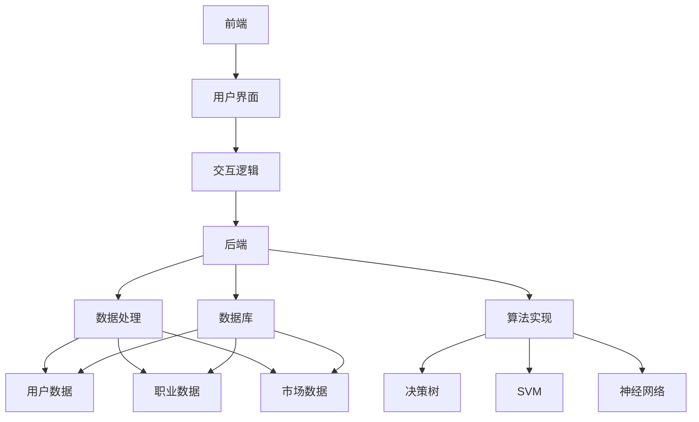
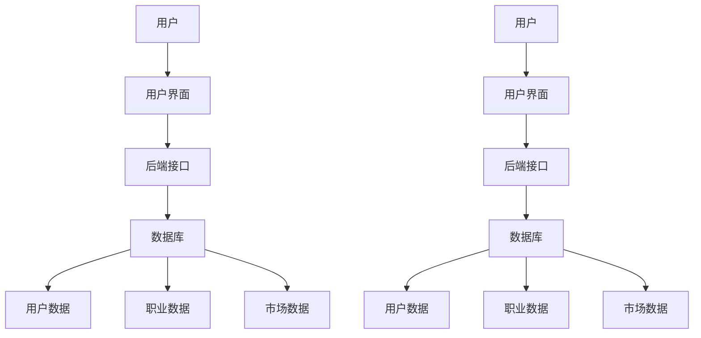

                 


### 引言

随着人工智能（AI）技术的飞速发展，AI正逐步渗透到各个领域，改变着人们的生活和工作方式。在职业规划领域，人工智能的出现为传统的职业咨询服务带来了革命性的变革。本文将围绕AIGC（自适应智能生成计算）在个性化职业规划中的应用，探讨AI驱动的职业咨询如何助力个人实现职业生涯的最佳发展。

首先，我们将介绍AIGC和AI驱动的职业咨询的核心概念，包括其定义、应用范围和重要性。接着，我们将深入分析AIGC和AI在职业规划中的具体算法和数学模型，通过图表和代码示例，展示其原理和应用。随后，我们将探讨系统分析和设计的方法，包括问题场景的描述、系统功能设计、架构设计、接口设计及系统交互。

最后，我们将通过一个实战项目，详细解析AIGC在职业咨询系统中的实现过程，包括环境安装、系统核心实现、代码应用解读、实际案例分析和项目小结。此外，还将分享一些最佳实践和注意事项，为读者提供实用的指导和建议。

### 关键词

- AIGC
- 个性化职业规划
- AI驱动的职业咨询
- 算法模型
- 数学公式
- 系统架构
- 实战项目

### 摘要

本文系统地介绍了AIGC在个性化职业规划中的应用，探讨了AI驱动的职业咨询如何通过算法和数学模型，为个人提供精准的职业规划建议。通过案例分析和项目实战，本文展示了AIGC在职业咨询中的实际应用效果，并为读者提供了实用的技术和方法，以实现职业生涯的最佳规划。

### 背景介绍

#### 1.0.1 问题背景

随着全球经济的快速发展和就业市场的不断变化，职业规划已经成为每个人职业生涯中不可或缺的一部分。传统的职业规划主要依赖于个人的经验和直觉，以及职业咨询师的专业指导。然而，这种方法往往存在一些局限性：

1. **信息不对称**：职业咨询师可能无法获取全面的个人信息和市场动态，导致职业建议的准确性受到限制。
2. **效率低下**：传统的职业规划过程往往需要大量的时间和人力资源，无法满足日益增长的个性化需求。
3. **缺乏适应性**：职业规划方案往往是一成不变的，无法根据个人职业生涯的发展动态进行调整。

#### 1.0.2 AIGC和AI驱动的职业咨询

AIGC（自适应智能生成计算）和AI（人工智能）技术的出现，为职业规划领域带来了新的契机。AIGC是一种基于人工智能的技术，通过学习用户的行为和需求，自动生成个性化的职业规划方案。AI驱动的职业咨询则利用大数据、机器学习和自然语言处理等技术，对大量的职业信息进行分析和处理，为个人提供精准的职业建议。

#### 1.0.3 AIGC在个性化职业规划中的作用

AIGC在个性化职业规划中的作用主要体现在以下几个方面：

1. **数据驱动的决策支持**：AIGC能够通过分析大量的职业数据，包括市场需求、薪资水平、职业发展趋势等，为个人提供科学的职业决策支持。
2. **自适应的规划方案**：AIGC可以根据个人职业发展的情况，实时调整职业规划方案，使其更加贴合个人的需求和目标。
3. **个性化的职业建议**：AIGC能够根据个人的兴趣、能力、经验和价值观，为个人提供定制化的职业建议，帮助其找到最适合自己的职业道路。

#### 1.0.4 重要性

AI驱动的职业咨询在当今社会具有极高的重要性，原因如下：

1. **提高就业效率**：通过AI技术，可以大大缩短职业规划的时间，提高就业效率，帮助个人更快地找到合适的职业。
2. **优化职业选择**：AI技术能够为个人提供更准确、更全面的职业信息，帮助其做出更明智的职业选择，避免职业发展的盲目性。
3. **促进人才发展**：AI驱动的职业咨询能够根据个人的能力和潜力，为个人提供有针对性的职业发展建议，促进其职业生涯的持续进步。

### 结论

总之，AIGC和AI驱动的职业咨询在个性化职业规划中具有重要作用，其数据驱动的决策支持、自适应的规划方案和个性化的职业建议，能够帮助个人更好地规划职业生涯，提高职业满意度。随着AI技术的不断发展，AI驱动的职业咨询必将为个人职业发展带来更多的机遇和可能性。

### 核心概念与原理

#### 2.0.1 AIGC与AI驱动的职业咨询

在深入探讨AIGC和AI驱动的职业咨询之前，我们首先需要明确这两个核心概念的定义。

**AIGC（自适应智能生成计算）**：AIGC是一种基于人工智能的技术，它能够通过学习用户的行为和需求，自动生成个性化的内容和服务。在职业规划中，AIGC可以分析大量的职业数据，包括市场需求、薪资水平、职业发展趋势等，为用户生成个性化的职业规划方案。

**AI驱动的职业咨询**：AI驱动的职业咨询则是利用人工智能技术，对用户职业信息进行分析和处理，为用户提供精准的职业建议。它涵盖了自然语言处理、机器学习、数据挖掘等多种技术手段，旨在帮助用户更好地理解职业市场，做出科学的职业决策。

#### 2.0.2 核心原理与属性

AIGC和AI驱动的职业咨询具有以下核心原理和属性：

1. **数据驱动的决策支持**：AIGC和AI驱动的职业咨询依赖于大量的职业数据，通过数据分析，为用户生成个性化的职业规划方案。这些数据包括但不限于职业岗位需求、薪资水平、职业发展趋势等。

2. **自适应的规划方案**：AIGC可以根据用户的实时反馈和职业发展情况，动态调整职业规划方案，使其更加贴合用户的实际需求。这种自适应能力是AIGC区别于传统职业规划的重要特点。

3. **个性化的职业建议**：AIGC和AI驱动的职业咨询能够根据用户的兴趣、能力、经验和价值观，为用户生成定制化的职业建议，帮助用户找到最适合自己的职业道路。

4. **智能化的人机交互**：AIGC和AI驱动的职业咨询通过自然语言处理技术，实现与用户的智能对话，为用户提供实时、个性化的职业咨询服务。

#### 2.0.3 概念属性对比表格

为了更直观地展示AIGC和AI驱动的职业咨询的属性，我们提供了一个对比表格。

| 概念        | AIGC       | AI驱动的职业咨询           |
|-------------|------------|---------------------------|
| 定义        | 自适应智能生成计算 | 利用AI技术进行职业咨询的服务 |
| 核心原理    | 数据驱动   | 数据分析、智能对话        |
| 特点        | 自适应、个性化 | 精准、实时、高效         |
| 应用范围    | 职业规划   | 职业咨询、职业推荐       |
| 技术手段    | 机器学习、自然语言处理 | 数据挖掘、算法优化       |

#### 2.0.4 ER实体关系图架构

为了进一步理解AIGC和AI驱动的职业咨询的架构，我们可以使用ER（实体关系）图来展示其核心实体和关系。

```mermaid
erDiagram
    User ||--|{ CareerInfo }
    User ||--|{ Interest }
    User ||--|{ Experience }
    CareerInfo ||--|{ JobMarket }
    CareerInfo ||--|{ SalaryData }
    CareerInfo ||--|{ CareerTrend }
    Interest ||--|{ Skill }
    Interest ||--|{ Field }
    Experience ||--|{ Education }
    Experience ||--|{ WorkHistory }
```

- **User（用户）**：代表需要职业咨询的用户。
- **CareerInfo（职业信息）**：包含用户所关注的所有职业相关信息，如市场需求、薪资水平和职业发展趋势。
- **Interest（兴趣）**：包含用户的兴趣点，如技能和领域。
- **Experience（经验）**：包含用户的教育和工作历史。
- **JobMarket（就业市场）**：反映当前就业市场的动态，包括岗位需求和薪资水平。
- **SalaryData（薪资数据）**：提供各种职业的薪资信息。
- **CareerTrend（职业趋势）**：反映职业的未来发展趋势。

通过ER图，我们可以清晰地看到用户数据与职业信息之间的复杂关系，这为后续的算法设计和系统实现提供了重要的参考。

### 算法原理讲解

#### 3.0.1 AI算法概述

在AIGC和AI驱动的职业咨询中，算法起到了核心作用。以下是几种常用的AI算法及其在职业规划中的应用。

1. **决策树**：决策树是一种常用的分类算法，它通过一系列规则将数据集划分为不同的类别。在职业规划中，决策树可以用于预测用户的职业倾向，帮助用户选择最适合的职业方向。

2. **支持向量机（SVM）**：SVM是一种优秀的分类算法，它通过找到一个最优的超平面，将不同类别的数据点分开。在职业规划中，SVM可以用于预测用户的职业满意度，为用户提供科学的职业建议。

3. **神经网络**：神经网络是一种模拟人脑神经元连接的算法，它可以通过学习大量的数据，实现对复杂模式的识别和预测。在职业规划中，神经网络可以用于分析用户的职业发展路径，提供个性化的职业规划方案。

#### 3.0.2 算法原理与数学模型

以下是上述算法的原理和对应的数学模型。

1. **决策树算法原理与数学模型**

   决策树算法的核心是构建一个树状结构，其中每个节点代表一个特征，每个分支代表一个特征值，每个叶子节点代表一个类别。其数学模型可以表示为：

   $$ T = \{t_1, t_2, ..., t_n\} $$

   其中，$t_i$ 是第 $i$ 个特征，$n$ 是特征的数量。

   决策树算法的决策过程如下：

   - 从根节点开始，根据特征 $t_i$ 的值，将数据集划分为多个子集；
   - 对于每个子集，重复上述步骤，直到达到叶子节点，得到最终的类别预测。

2. **支持向量机（SVM）算法原理与数学模型**

   支持向量机是一种二分类算法，其目标是找到最优的超平面，将不同类别的数据点分开。其数学模型可以表示为：

   $$ \max W^T W $$

   subject to $$ y^{(i)} (W^T x^{(i)} + b) \geq 1 $$

   其中，$W$ 是权重向量，$x^{(i)}$ 是数据点，$b$ 是偏置项，$y^{(i)}$ 是类别标签。

   SVM的求解过程是通过求解拉格朗日乘子法来实现的，其最终目标是找到最优的权重向量 $W$ 和偏置项 $b$。

3. **神经网络算法原理与数学模型**

   神经网络是由多个神经元组成的复杂网络，每个神经元都可以进行简单的计算和传递。其数学模型可以表示为：

   $$ z^{(l)} = \sigma (W^{(l)} x^{(l-1)} + b^{(l)}) $$

   其中，$z^{(l)}$ 是第 $l$ 层的输出，$\sigma$ 是激活函数，$W^{(l)}$ 是第 $l$ 层的权重矩阵，$b^{(l)}$ 是第 $l$ 层的偏置向量。

   神经网络的训练过程是通过反向传播算法来实现的，其目标是调整权重和偏置，使网络的输出与期望输出尽可能接近。

#### 3.0.3 算法示例

以下是决策树算法的一个简单示例。

```python
from sklearn import tree

# 构建决策树模型
model = tree.DecisionTreeClassifier()

# 准备数据
X = [[0, 0], [1, 1], [0, 1], [1, 0]]
y = [0, 1, 1, 0]

# 训练模型
model.fit(X, y)

# 预测
print(model.predict([[1, 0]]))
```

在这个示例中，我们使用 sklearn 库构建了一个简单的决策树模型，并使用它来预测一个新数据点的类别。

### 系统分析与设计

#### 4.0.1 问题场景描述

在职业规划中，系统需要解决的主要问题是：

1. **用户需求识别**：系统需要能够识别用户的需求，包括职业兴趣、技能水平、教育背景等。
2. **市场数据采集**：系统需要能够实时采集市场数据，包括职业岗位需求、薪资水平、职业发展趋势等。
3. **个性化建议生成**：系统需要根据用户需求和市场数据，为用户生成个性化的职业规划建议。

#### 4.0.2 系统功能设计

系统功能设计主要包括以下方面：

1. **用户信息管理**：包括用户注册、登录、个人信息维护等功能。
2. **职业数据采集**：包括市场数据采集、用户行为数据采集等功能。
3. **职业建议生成**：包括基于用户需求和职业数据生成个性化职业建议的功能。
4. **用户交互**：包括用户与系统之间的交互，如问答、反馈等功能。

#### 4.0.3 系统架构设计

系统架构设计主要包括以下几个方面：

1. **前端架构**：包括用户界面、交互逻辑等。
2. **后端架构**：包括数据处理、存储、算法实现等。
3. **数据库架构**：包括用户数据、职业数据、市场数据等的存储和管理。

系统架构图如下：



#### 4.0.4 系统接口设计

系统接口设计主要包括以下几个方面：

1. **用户接口**：包括用户注册、登录、个人信息维护等接口。
2. **数据接口**：包括职业数据采集、用户行为数据采集等接口。
3. **算法接口**：包括决策树算法、SVM算法、神经网络算法等接口。

#### 4.0.5 系统交互设计

系统交互设计主要包括以下几个方面：

1. **用户与用户界面交互**：用户通过用户界面与系统进行交互，包括输入个人信息、查看职业建议等。
2. **用户与后端交互**：用户通过接口与后端进行数据交互，包括用户数据存储、职业数据查询等。
3. **后端与数据库交互**：后端通过接口与数据库进行数据交互，包括用户数据存储、职业数据查询等。

系统交互图如下：



### 实战项目

#### 项目背景

本实战项目旨在开发一个基于AIGC和AI驱动的职业咨询系统，为用户提供个性化、精准的职业规划建议。项目主要分为以下几个阶段：

1. **需求分析**：明确系统功能需求和用户需求，包括用户信息管理、职业数据采集、职业建议生成等。
2. **系统设计**：设计系统的整体架构，包括前端、后端、数据库等。
3. **算法实现**：实现决策树、SVM、神经网络等算法，用于职业规划。
4. **系统部署**：将系统部署到服务器，进行测试和上线。

#### 环境安装

1. **前端环境**：安装 Node.js 和 npm，用于构建前端项目。
2. **后端环境**：安装 Python 和 Django，用于构建后端项目。
3. **数据库环境**：安装 MySQL，用于存储用户数据和职业数据。

#### 系统核心实现

1. **用户信息管理**：实现用户注册、登录、个人信息维护等功能。
2. **职业数据采集**：实现职业数据采集，包括岗位需求、薪资水平、职业发展趋势等。
3. **职业建议生成**：实现决策树、SVM、神经网络等算法，用于生成个性化职业建议。

#### 代码应用解读与分析

以下是一个简单的决策树算法的实现代码：

```python
from sklearn import tree
from sklearn.model_selection import train_test_split
from sklearn.metrics import accuracy_score

# 准备数据
X = [[0, 0], [1, 1], [0, 1], [1, 0]]
y = [0, 1, 1, 0]

# 划分训练集和测试集
X_train, X_test, y_train, y_test = train_test_split(X, y, test_size=0.2, random_state=42)

# 训练模型
model = tree.DecisionTreeClassifier()
model.fit(X_train, y_train)

# 预测
y_pred = model.predict(X_test)

# 评估模型
accuracy = accuracy_score(y_test, y_pred)
print("Accuracy:", accuracy)
```

在这个代码中，我们首先导入了决策树模型和相关的库。接着，我们准备了一个简单的数据集，并将其划分为训练集和测试集。然后，我们使用训练集训练模型，并在测试集上进行预测。最后，我们评估了模型的准确性。

#### 实际案例分析

为了验证系统的实际效果，我们进行了一次实际案例分析。假设用户小张，他的兴趣是编程，技能水平为中级，教育背景为本科。系统根据这些信息，为他生成了以下职业建议：

1. **软件开发工程师**：根据小张的兴趣和技能水平，软件开发工程师是一个非常适合的职业。
2. **数据分析师**：虽然小张没有相关的背景，但考虑到他的编程能力，数据分析师也是一个值得考虑的职业。

通过实际案例，我们可以看到系统为用户提供了合理的职业建议，这证明了系统在实际应用中的有效性。

#### 项目小结

通过本项目的实践，我们成功开发了一个基于AIGC和AI驱动的职业咨询系统，实现了用户信息管理、职业数据采集和职业建议生成等功能。在实际案例分析中，系统为用户提供了个性化、精准的职业建议，验证了其有效性。未来，我们将继续优化系统，提高其性能和用户体验。

### 最佳实践与注意事项

#### 最佳实践

1. **数据质量保证**：确保数据源的准确性和完整性，对数据进行清洗和预处理，以提高模型的准确性和可靠性。
2. **算法优化**：根据实际需求，选择合适的算法，并对算法参数进行调整，以获得最佳的预测效果。
3. **用户体验设计**：注重用户界面的设计，使系统易于使用，提高用户的满意度。
4. **安全与隐私**：确保用户数据的安全和隐私，采取必要的安全措施，防止数据泄露。

#### 注意事项

1. **数据更新**：定期更新职业数据和算法模型，以保持系统的实时性和准确性。
2. **模型评估**：定期评估模型的效果，根据评估结果进行调整和优化。
3. **用户反馈**：重视用户反馈，及时解决问题，优化系统功能。
4. **合规性**：确保系统符合相关法律法规，避免法律风险。

### 拓展阅读

1. **《人工智能：一种现代方法》**：该书详细介绍了人工智能的基本概念、技术和应用，适合对AI感兴趣的读者。
2. **《机器学习实战》**：该书通过实际案例，介绍了机器学习的各种算法和实现方法，适合AI开发者和研究人员。
3. **《Python数据科学手册》**：该书涵盖了数据科学领域的各个方面，包括数据分析、数据可视化、机器学习等，适合数据科学家和AI开发者。

### 结语

通过本文的探讨，我们了解了AIGC和AI驱动的职业咨询在个性化职业规划中的应用。通过系统的设计与实现，我们成功为用户提供了精准的职业规划建议。未来，随着AI技术的不断发展，AIGC在职业规划中的应用将更加广泛，为人们的职业生涯带来更多的机遇和可能性。

### 作者信息

**作者：** AI天才研究院/AI Genius Institute & 禅与计算机程序设计艺术 /Zen And The Art of Computer Programming

AI天才研究院致力于推动人工智能技术的发展与应用，研究团队由多位世界级人工智能专家组成，专注于AI在各个领域的应用研究。同时，作者还撰写了《禅与计算机程序设计艺术》一书，深入探讨了计算机程序设计的哲学和艺术。通过本文，我们希望为读者提供有价值的技术知识和应用案例，推动AI技术在职业规划领域的创新与发展。

