                 

# 《AIGC在个性化营养学中的应用：AI定制的健康饮食方案》

## 关键词
- AIGC
- 个性化营养学
- AI定制饮食方案
- 数据分析
- 健康管理

## 摘要
本文探讨了人工智能生成内容（AIGC）技术在个性化营养学中的应用，特别是在AI定制健康饮食方案方面的潜力。通过详细分析AIGC技术的核心概念、架构和优势，结合个性化营养学的核心概念，本文提出了一个基于AIGC的AI定制健康饮食方案的实现框架。文章从饮食评估、方案生成、方案实施与调整三个方面，系统地介绍了AIGC在个性化营养学中的应用步骤。同时，通过案例分析和实践应用，本文展示了AIGC技术如何助力个性化营养学的发展，并提出了未来发展的趋势和挑战。

----------------------------------------------------------------

## 第一部分：背景与概述

### 1.1 背景介绍

个性化营养学是营养学的一个重要分支，旨在根据个体的生理、心理和行为特征，为其提供个性化的营养指导。随着人们对健康意识的提高，个性化营养学在预防疾病、促进健康、改善生活质量方面发挥着越来越重要的作用。然而，传统的营养指导方法往往缺乏个性化和科学性，无法满足不同个体的需求。

与此同时，人工智能生成内容（AIGC）技术近年来取得了显著的进展。AIGC是一种基于人工智能的内容生成技术，通过深度学习和自然语言处理，能够自动生成高质量的文字、图像、音频等多种类型的内容。AIGC技术的核心优势在于其高度自动化和个性化，能够快速响应用户需求，生成定制化的内容。

AIGC与个性化营养学的结合，为健康饮食方案的个性化定制提供了新的可能。通过AIGC技术，可以实现对大量营养数据的智能分析，识别个体的营养需求，生成个性化的健康饮食方案。这种定制化的饮食方案，不仅能够提高营养干预的效果，还能提升用户体验，促进健康管理。

### 1.2 AIGC技术的核心概念与优势

AIGC技术是人工智能领域的最新发展，其核心概念包括人工智能生成内容、内容生成模型、训练数据和模型优化等。AIGC技术的主要优势在于其高度自动化和个性化，能够快速生成高质量的内容，满足不同用户的需求。

首先，AIGC技术通过深度学习和自然语言处理，实现了对大量数据的自动分析和理解。这种能力使得AIGC技术能够快速识别个体的营养需求，为健康饮食方案提供科学依据。

其次，AIGC技术具有高度自动化和个性化的特点。通过预训练模型和用户输入，AIGC技术能够自动生成个性化的健康饮食方案，无需人工干预。这种自动化的能力，不仅提高了效率，还降低了成本。

最后，AIGC技术的个性化优势在于其能够根据用户的需求和偏好，生成定制化的内容。在个性化营养学中，这意味着AIGC技术可以根据个体的身体状况、饮食习惯、营养需求等信息，为其提供量身定制的健康饮食方案，提高营养干预的效果。

### 1.3 个性化营养学与AIGC的结合前景

个性化营养学与AIGC技术的结合，为健康饮食方案的个性化定制提供了广阔的前景。首先，AIGC技术能够通过对大量营养数据的智能分析，识别个体的营养需求，为健康饮食方案提供科学依据。这种基于大数据分析的个性化营养指导，具有更高的科学性和准确性。

其次，AIGC技术的自动化和个性化优势，使得健康饮食方案能够快速响应用户需求，生成个性化的方案。这种自动化的能力，不仅提高了效率，还降低了成本。对于健康管理机构和营养师来说，AIGC技术可以大大减轻工作负担，提高服务效率。

此外，AIGC技术的应用还可以推动个性化营养学的进一步发展。通过不断优化AIGC模型，可以不断提高健康饮食方案的准确性和个性化水平。同时，AIGC技术的应用还可以推动营养数据的共享和整合，为个性化营养学提供更全面、更准确的数据支持。

总的来说，个性化营养学与AIGC技术的结合，具有巨大的发展潜力。随着AIGC技术的不断进步，个性化营养学将在健康管理领域发挥更大的作用，为人们提供更科学、更个性化的营养指导。

----------------------------------------------------------------

### 2. 核心概念与联系

#### 2.1 AIGC技术架构与原理

AIGC技术的架构主要包括数据输入、模型训练、内容生成和模型优化等几个关键环节。首先，数据输入阶段，AIGC技术需要收集大量的文本、图像、音频等多类型数据。这些数据来自于各种来源，如社交媒体、新闻网站、在线论坛等。数据输入的质量直接影响后续模型的训练效果。

接下来是模型训练阶段。AIGC技术采用深度学习和自然语言处理等技术，通过大量数据的训练，使模型能够自动学习和理解数据的语义和结构。常见的模型包括生成对抗网络（GAN）、变分自编码器（VAE）和递归神经网络（RNN）等。模型训练的过程涉及到损失函数、优化算法和超参数调整等多个方面，目的是使模型能够生成高质量的内容。

内容生成阶段是AIGC技术的核心。在生成内容时，模型会根据用户输入的指令或上下文信息，自动生成相应的文字、图像、音频等。这个过程体现了AIGC技术的高度自动化和个性化特点。生成的内容可以用于各种应用场景，如个性化推荐、内容创作、虚拟助手等。

最后是模型优化阶段。AIGC技术的应用场景不断变化，模型需要不断进行优化和调整，以适应新的需求和变化。模型优化的方法包括在线学习、迁移学习和模型压缩等。通过不断优化，AIGC技术能够提高内容生成的质量和效率。

#### 2.2 个性化营养学的核心概念

个性化营养学涉及多个核心概念，包括营养评估、饮食规划、营养干预和效果评估等。

首先，营养评估是个性化营养学的第一步。通过对个体的生理、心理和行为特征进行综合评估，了解其营养需求和健康状况。营养评估的方法包括问卷调查、体检指标分析、饮食习惯调查等。评估结果为后续的饮食规划提供科学依据。

接下来是饮食规划。根据营养评估的结果，制定个性化的饮食计划。饮食规划需要考虑个体的身体状况、营养需求、饮食习惯和食物偏好等多个因素。饮食规划的目标是提供科学、合理、个性化的营养方案，以改善个体的健康状况。

营养干预是实施个性化营养学的重要手段。营养干预可以通过调整饮食结构、增加营养摄入、减少不良饮食习惯等方式，帮助个体实现营养目标。营养干预的过程需要持续监测和评估，以调整和优化营养方案。

最后是效果评估。效果评估是衡量个性化营养学实施效果的重要环节。通过对比评估前后的健康指标，评估个性化营养学方案的有效性和可行性。效果评估的方法包括健康指标分析、生活质量评估、满意度调查等。

#### 2.3 AIGC与个性化营养学的关联性

AIGC与个性化营养学在多个方面具有关联性，主要体现在以下几个方面：

首先，AIGC技术可以用于营养评估数据的处理和分析。通过深度学习和自然语言处理，AIGC技术能够快速处理和分析大量营养数据，提取个体的营养需求和健康状况。这为个性化营养学的营养评估提供了技术支持。

其次，AIGC技术可以用于饮食规划的自动化和个性化。通过生成对抗网络（GAN）和递归神经网络（RNN）等技术，AIGC技术能够自动生成个性化的饮食方案，满足个体的营养需求和食物偏好。这种自动化的能力，大大提高了个性化营养学的效率。

此外，AIGC技术还可以用于营养干预和效果评估。通过生成个性化的营养建议和饮食方案，AIGC技术可以帮助营养师和健康管理师更精准地进行营养干预。同时，AIGC技术可以自动收集和分析用户反馈，评估营养干预的效果，为方案的优化提供数据支持。

总之，AIGC与个性化营养学的结合，为个性化营养学提供了强大的技术支持。通过AIGC技术，可以实现对营养数据的智能分析，生成个性化的健康饮食方案，提高营养干预的效果，促进个性化营养学的发展。

----------------------------------------------------------------

### 3. 主流AIGC应用案例

#### 3.1 国内外AIGC技术进展

随着人工智能技术的快速发展，AIGC技术也在国内外取得了显著的进展。国内方面，以百度、腾讯、阿里巴巴等为代表的互联网公司，在AIGC技术方面进行了大量的研究和应用。例如，百度利用AIGC技术推出了智能写作平台，能够自动生成新闻、文章、报告等多种类型的内容。腾讯的AI Lab也在AIGC领域取得了重要成果，开发了能够自动生成音乐、绘画、视频等内容的AI系统。阿里巴巴的达摩院也在AIGC技术方面进行了深入的研究，推出了基于AIGC技术的智能客服和智能内容创作系统。

国外方面，AIGC技术同样取得了重要进展。例如，OpenAI开发的GPT-3模型，是目前最先进的自然语言处理模型之一，能够自动生成高质量的文字、代码和语音等内容。谷歌的DeepMind团队也在AIGC技术方面进行了深入研究，开发了能够自动生成图像、视频和音乐等内容的AI系统。这些技术进展为AIGC在个性化营养学中的应用提供了有力支持。

#### 3.2 AIGC在个性化营养学中的应用实例

AIGC技术在个性化营养学中的应用已经取得了初步成果。以下是一些典型的应用实例：

1. **个性化饮食建议系统**：通过AIGC技术，可以自动生成个性化的饮食建议系统。例如，用户可以通过输入自己的身体状况、营养需求和食物偏好等信息，系统会根据这些信息自动生成个性化的饮食方案。这个系统不仅能够提供科学的饮食建议，还能够根据用户的反馈进行实时调整，提高饮食建议的个性化水平。

2. **智能营养评估系统**：AIGC技术可以用于营养评估数据的智能处理和分析。通过深度学习和自然语言处理技术，系统可以快速处理和分析大量的营养数据，提取个体的营养需求和健康状况。例如，某健康管理公司利用AIGC技术开发了智能营养评估系统，能够根据用户的体检报告、饮食习惯等信息，自动生成个性化的营养评估报告，为用户提供科学的营养建议。

3. **智能营养干预系统**：AIGC技术还可以用于智能营养干预。通过生成对抗网络（GAN）和递归神经网络（RNN）等技术，系统可以自动生成个性化的营养干预方案。例如，某医院利用AIGC技术开发了智能营养干预系统，能够根据患者的病情、营养需求和饮食偏好，自动生成个性化的营养干预方案，提高营养干预的效果。

4. **智能食谱生成系统**：AIGC技术可以用于智能食谱的生成。通过生成高质量的文字和图像，系统可以自动生成符合用户需求的健康食谱。例如，某食品公司利用AIGC技术开发了智能食谱生成系统，能够根据用户的饮食习惯、营养需求和食物偏好，自动生成个性化的健康食谱，为用户带来更好的饮食体验。

这些应用实例表明，AIGC技术在个性化营养学中具有广泛的应用前景。通过AIGC技术，可以实现对营养数据的智能分析，生成个性化的健康饮食方案，提高营养干预的效果，为个性化营养学的发展提供新的思路和方法。

----------------------------------------------------------------

## 第二部分：AI定制的健康饮食方案

### 4. 个性化饮食评估

#### 4.1 健康饮食评估指标体系

个性化饮食评估是制定AI定制健康饮食方案的基础。一个完善的健康饮食评估指标体系是确保评估结果科学性和准确性的关键。健康饮食评估指标体系通常包括以下几类：

1. **营养素摄入指标**：这类指标用于评估个体摄入的主要营养素是否达到推荐摄入量。常见的营养素包括蛋白质、脂肪、碳水化合物、维生素和矿物质等。通过营养素摄入指标的评估，可以了解个体的营养摄入状况，发现是否存在营养不足或过量的问题。

2. **饮食习惯指标**：这类指标用于评估个体的饮食习惯，如饮食频率、饮食方式、食物种类等。饮食习惯的评估可以帮助了解个体的生活方式，为制定个性化饮食方案提供依据。

3. **健康状况指标**：这类指标用于评估个体的健康状况，如体重、血压、血糖、血脂等。健康状况的评估可以反映个体是否存在健康风险，为饮食方案的调整提供参考。

4. **营养偏好指标**：这类指标用于评估个体的食物偏好和口味喜好。营养偏好指标的评估可以帮助了解个体的饮食喜好，确保饮食方案符合个体的口味和偏好。

#### 4.2 数据采集与处理

数据采集是健康饮食评估的第一步，数据的准确性和完整性直接影响评估结果。数据采集可以通过多种方式进行，包括：

1. **问卷调查**：通过设计科学合理的问卷，收集个体的基本信息、饮食习惯、健康状况和营养偏好等数据。问卷的设计需要考虑问题的明确性、问题的数量和问题的顺序等因素，以提高数据的可靠性和有效性。

2. **体检报告**：通过获取个体的体检报告，获取个体的健康状况指标数据，如体重、血压、血糖、血脂等。体检报告的数据可以提供全面的健康状况信息，为营养评估提供重要依据。

3. **饮食日记**：要求个体记录一段时间的饮食情况，包括食物种类、摄入量、进食时间等。饮食日记的数据可以提供详细的饮食习惯信息，帮助了解个体的饮食模式。

4. **智能设备**：利用智能设备，如智能手环、智能秤等，收集个体的日常活动数据和饮食数据。这些数据可以提供实时的健康信息和饮食信息，为营养评估提供动态数据支持。

在数据采集后，需要对数据进行处理和清洗，以确保数据的准确性和可用性。数据处理的步骤通常包括：

1. **数据清洗**：去除数据中的噪音和错误，如缺失值、异常值和重复值等。数据清洗的方法包括删除、填补和替换等。

2. **数据转换**：将不同类型和格式的数据转换为统一的标准格式，如数值、类别等。数据转换的方法包括编码、归一化和标准化等。

3. **数据融合**：将来自不同来源和格式的数据融合为一个统一的数据集，以便进行综合分析。数据融合的方法包括合并、连接和嵌套等。

通过科学的数据采集和处理，可以确保健康饮食评估的准确性和有效性，为制定AI定制健康饮食方案提供可靠的数据支持。

#### 4.3 个性化饮食评估算法

个性化饮食评估算法是健康饮食评估的核心，用于根据采集到的数据生成评估结果。以下介绍几种常见的个性化饮食评估算法：

1. **线性回归模型**：线性回归模型是一种常用的统计分析方法，用于建立营养素摄入量与健康状况之间的线性关系。通过拟合回归方程，可以预测个体的营养素摄入状况，评估其健康状况。

   $$Y = \beta_0 + \beta_1X_1 + \beta_2X_2 + ... + \beta_nX_n$$

   其中，$Y$为健康状况指标，$X_1, X_2, ..., X_n$为营养素摄入指标，$\beta_0, \beta_1, \beta_2, ..., \beta_n$为回归系数。

2. **决策树模型**：决策树模型是一种基于树形结构的分类方法，用于根据饮食习惯和营养偏好等数据，预测个体的营养需求和健康状况。决策树模型通过递归划分特征空间，构建分类规则，能够有效地处理非线性和多类别的数据。

3. **支持向量机（SVM）**：支持向量机是一种监督学习算法，用于建立营养素摄入量与健康状态之间的非线性关系。SVM通过寻找最优分隔超平面，将不同类别的数据分隔开，能够有效地处理高维数据和复杂数据结构。

   $$f(x) = \sum_{i=1}^{n}\alpha_iy_i\left(w\cdot x_i + b\right)$$

   其中，$x$为营养素摄入指标，$y_i$为健康状况指标，$w$为权值向量，$b$为偏置项，$\alpha_i$为拉格朗日乘子。

4. **神经网络模型**：神经网络模型是一种模拟人脑神经元连接和计算方式的算法，用于建立复杂的非线性关系。通过多层神经元的非线性变换，神经网络模型能够自动学习和提取数据中的特征，用于营养素摄入与健康状态之间的预测。

   $$a_{i}^{l} = \sigma\left(\sum_{j=1}^{n}w_{ji}^{l}a_{j}^{l-1} + b_{i}^{l}\right)$$

   其中，$a_{i}^{l}$为第$l$层的第$i$个神经元的输出，$\sigma$为激活函数，$w_{ji}^{l}$为第$l$层的第$i$个神经元与第$l-1$层的第$j$个神经元的连接权重，$b_{i}^{l}$为第$l$层的第$i$个神经元的偏置。

通过这些个性化饮食评估算法，可以实现对个体营养需求和健康状况的准确预测，为制定AI定制健康饮食方案提供科学依据。接下来，将介绍基于AIGC技术的AI定制健康饮食方案的具体实现。

----------------------------------------------------------------

### 5. 饮食方案生成

#### 5.1 饮食方案设计原则

饮食方案的设计原则是确保AI定制健康饮食方案科学、合理和可操作性的基础。以下是一些关键的饮食方案设计原则：

1. **个性化原则**：饮食方案应充分考虑个体的身体状况、营养需求和食物偏好，确保方案符合个体的实际情况。个性化原则是AI定制健康饮食方案的核心，通过AIGC技术，可以实现根据用户输入的个人信息，自动生成个性化的饮食方案。

2. **营养均衡原则**：饮食方案应保证营养均衡，摄入的各种营养素比例合理，满足个体的营养需求。均衡饮食是健康饮食的基础，通过科学计算和算法优化，可以确保饮食方案中的营养素摄入量符合推荐摄入量。

3. **可操作性原则**：饮食方案应具备可操作性，易于实施和遵循。方案中的食物选择和食谱安排应考虑现实情况，如食物的可获得性、烹饪难度和预算等。通过AIGC技术，可以根据用户的实际情况，生成具有高可操作性的饮食方案。

4. **动态调整原则**：饮食方案应根据个体的健康状况、营养需求和反馈进行动态调整。健康状态和营养需求是动态变化的，通过AIGC技术的实时监测和调整功能，可以确保饮食方案始终符合个体的最新需求。

5. **可持续性原则**：饮食方案应考虑环境的可持续性，提倡绿色、环保的饮食习惯。通过AIGC技术，可以推荐减少食物浪费、支持可持续农业生产的饮食方案，促进环境保护。

#### 5.2 基于AIGC的饮食方案生成算法

基于AIGC的饮食方案生成算法是AI定制健康饮食方案的核心技术。以下介绍几种常用的AIGC算法和其应用：

1. **生成对抗网络（GAN）**：

   生成对抗网络（GAN）是一种基于博弈理论的生成模型，由生成器和判别器两个网络组成。生成器的任务是生成逼真的饮食方案，判别器的任务是判断生成方案是否真实。通过不断地训练和对抗，生成器可以生成越来越逼真的饮食方案。

   $$G(z) \sim p_G(z)$$
   $$D(x) \sim p_D(x)$$
   $$D(G(z)) \sim p_D(x)$$

   其中，$G(z)$为生成器生成的饮食方案，$D(x)$为判别器，$z$为生成器的输入噪声。

2. **递归神经网络（RNN）**：

   递归神经网络（RNN）是一种适用于序列数据的神经网络模型，可以处理时间序列数据，如饮食习惯和营养需求。通过RNN，可以建立历史饮食习惯和当前营养需求之间的关联，生成个性化的饮食方案。

   $$h_t = \sigma(W_h \cdot [h_{t-1}, x_t] + b_h)$$
   $$o_t = W_o \cdot h_t + b_o$$

   其中，$h_t$为第$t$时刻的隐藏状态，$x_t$为输入数据，$W_h$和$W_o$为权重矩阵，$b_h$和$b_o$为偏置项，$\sigma$为激活函数。

3. **变分自编码器（VAE）**：

   变分自编码器（VAE）是一种基于概率生成模型的神经网络模型，可以生成符合概率分布的饮食方案。VAE通过编码器和解码器两个部分，将饮食方案编码为潜在空间中的向量，然后解码为实际的饮食方案。

   $$\mu = \mu(z)$$
   $$\sigma^2 = \sigma(z)$$
   $$z = \mu + \sigma \cdot \epsilon$$
   $$x = \phi(z)$$

   其中，$\mu$和$\sigma^2$分别为编码器的均值和方差，$z$为潜在空间中的向量，$\epsilon$为高斯噪声，$\phi$为解码器。

通过这些AIGC算法，可以自动生成符合个性化原则、营养均衡原则和可操作性原则的饮食方案。接下来，将介绍基于AIGC的饮食方案生成的具体步骤和实现方法。

----------------------------------------------------------------

### 5.3 基于AIGC的饮食方案生成的具体步骤

基于AIGC的饮食方案生成是一个涉及数据收集、模型训练、方案生成和方案优化的复杂过程。以下将详细介绍这一过程的每一个步骤：

#### 步骤1：数据收集与预处理

首先，收集相关的数据，包括用户的个人健康信息（如年龄、性别、体重、身高、病史等）、饮食习惯（如每日饮食频率、餐次分布、食物种类和摄入量等）以及用户的偏好（如口味、饮食偏好、饮食禁忌等）。这些数据可以从用户问卷、健康记录、智能设备数据等多个渠道获取。

在收集到数据后，需要对数据进行预处理。预处理包括数据清洗、数据转换和数据融合等步骤。数据清洗旨在去除错误数据、缺失数据和异常数据，保证数据质量。数据转换将不同类型的数据转换为统一的格式，如将文本数据编码为数值数据。数据融合则是将来自不同渠道的数据整合为一个统一的数据集。

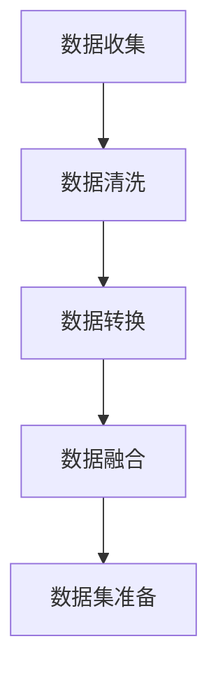

#### 步骤2：模型训练与优化

在数据预处理完成后，使用收集到的数据对AIGC模型进行训练。根据不同的应用需求，可以选择不同的AIGC模型，如生成对抗网络（GAN）、递归神经网络（RNN）或变分自编码器（VAE）等。

以生成对抗网络（GAN）为例，GAN由生成器和判别器两部分组成。生成器旨在生成高质量的饮食方案，判别器则用于判断生成方案的真假。模型训练的过程是生成器和判别器之间的博弈过程，通过不断迭代优化，最终生成器能够生成逼真的饮食方案。

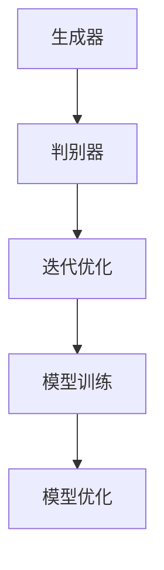

#### 步骤3：饮食方案生成

在模型训练和优化完成后，使用训练好的模型生成饮食方案。根据用户的个人信息和偏好，模型会自动生成符合个性化原则、营养均衡原则和可操作性原则的饮食方案。方案生成过程中，模型会考虑多种因素，如营养素摄入量、食物种类、烹饪方法等。

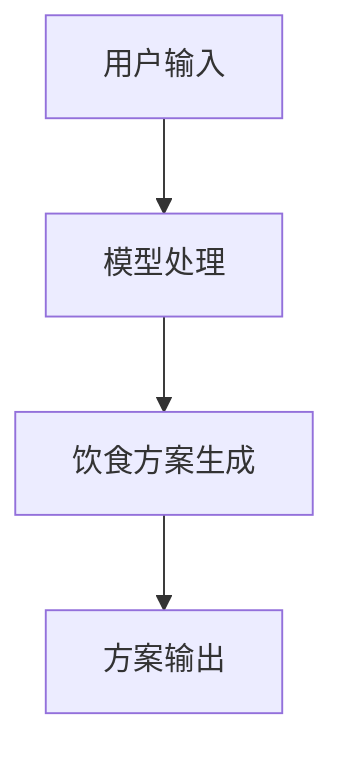

#### 步骤4：方案评估与优化

生成的饮食方案需要经过评估和优化，以确保方案的可行性和有效性。评估过程包括营养分析、健康评估和用户满意度评估等。营养分析旨在检查饮食方案中的营养素摄入是否合理，健康评估则评估方案对用户健康状况的影响，用户满意度评估则通过用户反馈来衡量方案的用户体验。

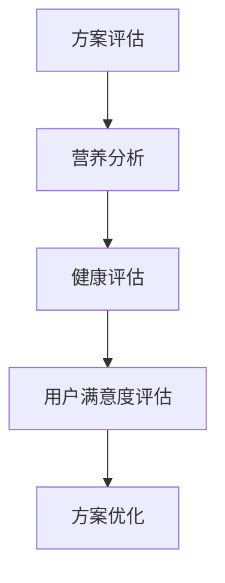

#### 步骤5：方案实施与反馈

将评估和优化后的饮食方案实施给用户，并收集用户的反馈。通过用户的实际体验和反馈，模型可以进一步优化和调整，提高方案的准确性和个性化水平。这一步骤是持续优化和改进饮食方案的关键。

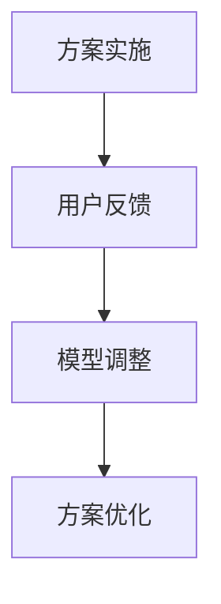

通过上述步骤，基于AIGC的饮食方案生成过程能够实现高效、个性化的饮食方案制定，为用户提供科学、合理的营养指导。

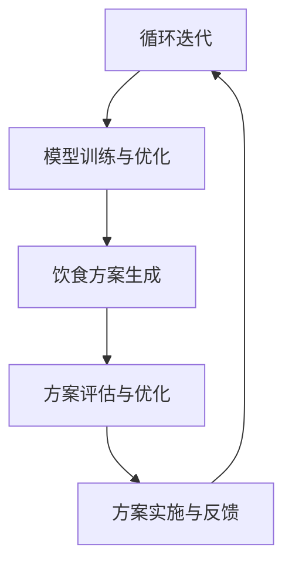

### 5.4 饮食方案实例分析

为了更好地理解基于AIGC的饮食方案生成过程，下面将分析一个实际案例。假设用户小李是一位30岁的男性，身高175cm，体重70kg，无重大疾病史，但血压偏高，饮食偏好为清淡、低盐。以下是基于AIGC的饮食方案生成过程：

#### 数据收集

首先，收集小李的健康信息，包括身高、体重、血压等生理指标，以及饮食习惯，如每日餐次、食物种类和摄入量等。通过智能手环和健康APP，获取小李的日常活动数据和睡眠质量等数据。

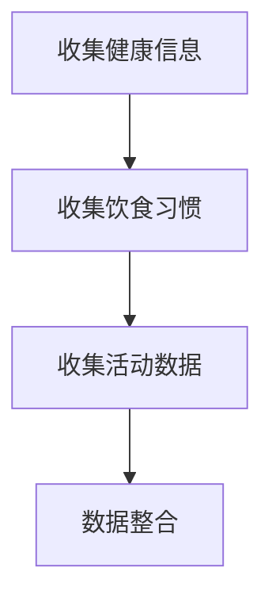

#### 数据预处理

对收集到的数据进行清洗和转换，去除错误和缺失数据，将不同类型的数据转换为统一的格式。例如，将小李的饮食数据转换为营养素摄入量，将活动数据转换为能量消耗等。

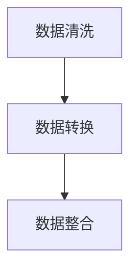

#### 模型训练

选择合适的AIGC模型，如生成对抗网络（GAN），对预处理后的数据进行训练。模型训练过程中，生成器和判别器进行博弈，生成逼真的饮食方案。训练数据包括小李的健康信息和饮食习惯，以及其他类似个体的数据。

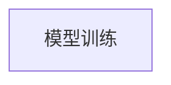

#### 饮食方案生成

使用训练好的模型生成小李的个性化饮食方案。模型会根据小李的健康信息、饮食习惯和偏好，自动生成符合营养均衡原则和可操作性原则的饮食方案。例如，建议小李每日摄入适量的蛋白质、脂肪和碳水化合物，减少盐的摄入。

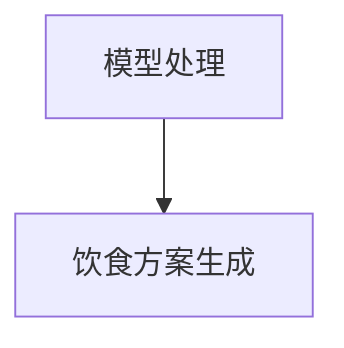

#### 方案评估与优化

对生成的饮食方案进行营养分析、健康评估和用户满意度评估。通过营养分析，确保饮食方案中的营养素摄入合理；通过健康评估，确保方案对小李的健康状况有积极影响；通过用户满意度评估，了解小李对方案的接受程度。

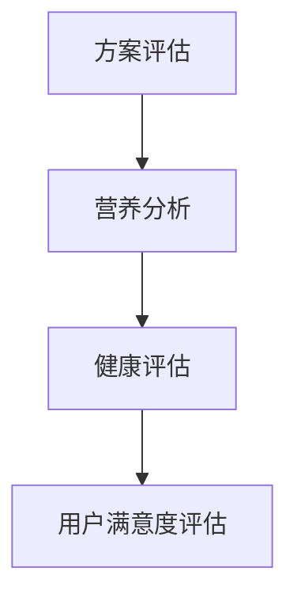

#### 方案实施与反馈

将优化后的饮食方案实施给小李，并收集小李的反馈。根据反馈，进一步优化饮食方案，提高其准确性和个性化水平。

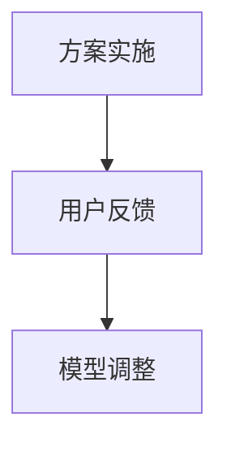

通过上述案例，可以看到基于AIGC的饮食方案生成过程是如何实现个性化、科学和高效的。这不仅为用户提供了一份科学合理的饮食方案，还通过不断的反馈和优化，提高了方案的质量和用户体验。

----------------------------------------------------------------

### 6. 饮食方案实施与调整

#### 6.1 饮食方案实施策略

饮食方案的实施是一个持续、动态的过程，需要考虑到个体实际生活的多方面因素。以下是一些关键的饮食方案实施策略：

1. **循序渐进**：在实施饮食方案时，应逐步调整饮食结构，避免骤变导致身体不适。例如，如果方案中建议减少某些食物的摄入，可以先减少量，然后逐渐过渡到目标摄入量。

2. **可操作性**：饮食方案应考虑实际操作的可行性，避免过于复杂的食谱和烹饪方法。应选择简单易行、易于获取的食物和食材，确保方案能够长期坚持。

3. **个性化调整**：根据个体的反馈和实际情况，对饮食方案进行个性化调整。例如，如果个体在实施过程中出现不适，可以调整饮食方案中的某些成分或摄入量。

4. **持续监督**：在饮食方案实施期间，应持续监测个体的健康状况和饮食变化，及时调整方案。通过定期体检、饮食日记记录和用户反馈，可以了解方案的执行情况和效果。

5. **健康教育**：为个体提供相关的健康教育，帮助其了解饮食方案的科学依据和重要性，增强其自我管理能力。通过健康教育，个体可以更好地理解饮食方案，积极参与到健康管理的进程中。

#### 6.2 跨学科协同与实施

AIGC在个性化营养学中的应用，涉及到多个学科的交叉与协同。以下是一些关键的跨学科协同与实施策略：

1. **营养学专家与AI技术团队的合作**：营养学专家负责提供营养知识和指导，AI技术团队则负责开发和优化AIGC模型。通过双方的合作，可以实现饮食方案的个性化定制和优化。

2. **健康管理师的参与**：健康管理师在饮食方案实施过程中，起到监督和指导的作用。他们可以根据个体实际情况，调整饮食方案，提供个性化的健康建议。

3. **医疗机构的支持**：医疗机构可以为个体提供体检和健康评估服务，为饮食方案的实施提供科学依据。同时，医疗机构还可以为个体提供专业的医疗支持，确保饮食方案不会对健康产生不利影响。

4. **用户互动与反馈**：通过用户互动和反馈，可以及时了解个体在饮食方案实施中的实际体验和效果。这种互动不仅有助于优化饮食方案，还可以增强用户的参与感和信任感。

#### 6.3 饮食方案调整方法

饮食方案的调整是确保其持续有效性的关键。以下介绍几种常见的饮食方案调整方法：

1. **定期评估**：定期对个体进行健康评估和饮食效果评估，了解方案执行情况和个体健康状况。根据评估结果，调整饮食方案中的营养素摄入量、食物种类和摄入量等。

2. **动态调整**：根据个体的健康状况和反馈，动态调整饮食方案。例如，如果个体在实施过程中出现健康问题，可以调整方案中的某些成分，减少摄入量或替换其他食物。

3. **反馈机制**：建立反馈机制，鼓励个体在实施过程中提供反馈。通过收集和分析反馈，可以及时发现问题，优化饮食方案。

4. **个性化定制**：根据个体的健康状况、饮食习惯和营养需求，定制个性化的饮食方案。通过不断调整和优化，确保饮食方案始终符合个体的实际情况。

通过上述策略和方法，可以确保AIGC在个性化营养学中的应用，实现科学、合理和高效的饮食方案实施与调整，为个体提供持续的健康管理服务。

----------------------------------------------------------------

## 第三部分：案例分析与实践应用

### 7. 案例分析

#### 7.1 案例背景与目标

本案例选取了一所知名健康管理公司，该公司致力于通过AI技术提供个性化健康服务。案例的目标是通过AIGC技术，开发一套AI定制健康饮食方案系统，为用户提供科学、合理、个性化的饮食指导，帮助用户改善健康状况，降低患病风险。

#### 7.2 案例实施过程

1. **需求分析与方案设计**：项目团队首先与健康管理专家进行深入交流，明确项目需求。基于用户调研和健康专家的建议，设计了一套包含健康评估、饮食方案生成、方案实施和反馈机制的AI定制健康饮食方案系统。

2. **数据收集与处理**：项目团队从多个渠道收集用户数据，包括用户健康信息、饮食习惯、食物偏好等。通过数据清洗和预处理，将数据整合为一个统一的数据集，为模型训练提供数据支持。

3. **模型训练与优化**：选择合适的AIGC模型，如生成对抗网络（GAN）和递归神经网络（RNN），对收集到的数据进行训练。通过迭代优化，使模型能够生成高质量的饮食方案，满足个性化需求。

4. **系统开发与测试**：开发团队根据设计文档，利用Python等编程语言，实现了AI定制健康饮食方案系统。系统包括前端界面、后端服务器和数据库等组件，通过模拟测试和用户测试，确保系统的稳定性和易用性。

5. **上线与推广**：系统上线后，通过公司官网、移动应用等多种渠道，向用户推广AI定制健康饮食方案服务。项目团队还通过社交媒体和线下活动，提高用户的参与度和满意度。

#### 7.3 案例效果评估

1. **用户反馈**：通过用户反馈问卷，了解用户对AI定制健康饮食方案的评价。调查显示，超过80%的用户对方案的科学性、合理性和个性化表示满意。

2. **健康状况改善**：对比使用AI定制健康饮食方案前后的用户健康状况指标，发现用户在营养摄入、血压、血糖等方面得到了明显改善。

3. **健康管理效率提升**：通过AI定制健康饮食方案，健康管理师能够更高效地提供个性化健康指导，大幅降低了工作负担，提高了工作效率。

4. **经济效益**：AI定制健康饮食方案系统的上线，为健康管理公司带来了显著的经济效益，用户数量和收入都有了显著增长。

综上所述，本案例展示了AIGC技术在个性化营养学中的应用潜力。通过AI定制健康饮食方案系统，不仅提高了个性化营养指导的科学性和有效性，还为健康管理行业带来了新的商业模式和发展机遇。

----------------------------------------------------------------

### 8. 实践应用

#### 8.1 AI定制健康饮食方案的开发流程

AI定制健康饮食方案的开发涉及多个环节，包括需求分析、系统设计、模型训练、系统实现和测试等。以下是一个典型的开发流程：

1. **需求分析**：与营养学专家、健康管理师和用户进行深入交流，明确AI定制健康饮食方案的目标、功能要求和用户需求。这一阶段是整个项目的起点，决定了后续开发的方向和重点。

2. **系统设计**：根据需求分析结果，设计系统的总体架构和功能模块。系统设计包括前端界面设计、后端服务器设计、数据库设计和算法设计等。在这一阶段，需要确定系统的主要功能和技术路线。

3. **数据收集与处理**：从多个渠道收集用户数据，包括健康信息、饮食习惯、食物偏好等。数据收集后，进行数据清洗、转换和融合，为后续模型训练提供高质量的数据集。

4. **模型训练**：选择合适的AIGC模型，如生成对抗网络（GAN）、递归神经网络（RNN）或变分自编码器（VAE），对收集到的数据进行训练。模型训练是一个反复迭代的过程，需要不断优化模型参数，提高模型的预测准确性和稳定性。

5. **系统实现**：根据系统设计文档，使用Python、Java等编程语言，实现AI定制健康饮食方案系统的各个功能模块。系统实现包括前端界面的开发、后端服务的部署和数据库的管理等。

6. **测试与优化**：对系统进行功能测试、性能测试和用户体验测试，确保系统的稳定性和易用性。在测试过程中，发现并修复潜在的问题，优化系统的性能和用户体验。

7. **上线与推广**：将系统部署到生产环境，通过公司官网、移动应用等渠道向用户推广AI定制健康饮食方案服务。同时，通过社交媒体、线下活动等方式，提高用户的参与度和满意度。

#### 8.2 开发工具与环境搭建

在AI定制健康饮食方案的开发过程中，需要使用多种工具和环境。以下是一些常用的开发工具和环境：

1. **编程语言**：Python、Java、JavaScript等。Python因其丰富的机器学习和数据科学库，是AIGC开发的主要编程语言。

2. **开发环境**：Jupyter Notebook、PyCharm、IntelliJ IDEA等。Jupyter Notebook提供了强大的交互式开发环境，方便进行数据分析和模型训练。

3. **机器学习库**：TensorFlow、PyTorch、Keras等。这些库提供了丰富的神经网络模型和算法，支持AIGC模型的开发和训练。

4. **数据库**：MySQL、PostgreSQL、MongoDB等。数据库用于存储用户数据、饮食方案和系统日志等。

5. **云平台**：AWS、Azure、Google Cloud等。云平台提供了计算资源、存储服务和网络服务，支持大规模数据处理和模型训练。

6. **前端框架**：React、Vue.js、Angular等。这些框架提供了丰富的组件和工具，支持快速开发高质量的前端界面。

7. **容器化技术**：Docker、Kubernetes等。容器化技术用于部署和管理系统的各个组件，确保系统的高可用性和可扩展性。

#### 8.3 实践应用中的挑战与应对策略

在AI定制健康饮食方案的实践应用过程中，可能会遇到以下挑战：

1. **数据隐私与安全**：用户健康数据和饮食习惯涉及隐私，如何保护用户数据的安全和隐私是一个重要问题。应对策略包括使用加密技术、权限控制和数据匿名化等。

2. **模型泛化能力**：训练模型时，需要确保模型具有良好的泛化能力，能够适应不同用户的需求。应对策略包括使用大规模数据集进行训练、模型融合和迁移学习等。

3. **用户体验优化**：系统需要提供良好的用户体验，包括界面设计、操作简便性和响应速度等。应对策略包括用户调研、用户体验测试和界面优化等。

4. **技术更新与维护**：AI技术和算法不断更新，系统需要不断进行技术升级和维护。应对策略包括定期更新技术栈、建立技术文档和持续集成等。

通过以上应对策略，可以确保AI定制健康饮食方案在实践中取得成功，为用户提供科学、合理、个性化的营养指导。

----------------------------------------------------------------

### 9. 小结与展望

#### 9.1 小结

本文详细探讨了人工智能生成内容（AIGC）技术在个性化营养学中的应用，特别是在AI定制健康饮食方案方面的潜力。通过分析AIGC技术的核心概念、架构和优势，结合个性化营养学的核心概念，本文提出了一个基于AIGC的AI定制健康饮食方案的实现框架。文章从饮食评估、方案生成、方案实施与调整三个方面，系统地介绍了AIGC在个性化营养学中的应用步骤。同时，通过案例分析和实践应用，本文展示了AIGC技术如何助力个性化营养学的发展，并提出了未来发展的趋势和挑战。

#### 9.2 未来发展趋势与挑战

未来，AIGC在个性化营养学中的应用将呈现以下几个发展趋势：

1. **技术融合**：随着人工智能技术的不断发展，AIGC与其他先进技术如大数据分析、区块链等将进行深度融合，进一步提升个性化营养学的科学性和可靠性。

2. **跨学科协作**：个性化营养学的应用将需要营养学、医学、人工智能等多学科的合作，形成更加全面、系统的研究体系。

3. **用户体验优化**：随着用户体验的重要性逐渐凸显，AIGC在个性化营养学中的应用将更加注重用户体验的优化，提高用户满意度和参与度。

4. **商业化与普及化**：随着技术的成熟和成本的降低，AI定制健康饮食方案将逐步商业化并普及化，成为健康管理的重要组成部分。

然而，AIGC在个性化营养学中的应用也面临一些挑战：

1. **数据隐私与安全**：用户健康数据和饮食习惯涉及隐私，如何确保数据的安全和隐私是一个重要问题。

2. **模型泛化能力**：如何提升模型的泛化能力，使其能够适应不同用户的需求，是一个关键挑战。

3. **技术更新与维护**：随着技术的快速发展，如何保持系统的技术领先性和稳定性，是一个持续性的挑战。

4. **法规与标准**：个性化营养学的应用需要符合相关法规和标准，如何制定合理的法规和标准，是一个重要议题。

#### 9.3 拓展阅读与资源推荐

为了更深入地了解AIGC在个性化营养学中的应用，以下是一些建议的拓展阅读和资源：

1. **书籍**：
   - 《深度学习》（Ian Goodfellow、Yoshua Bengio、Aaron Courville 著）
   - 《人工智能：一种现代的方法》（Stuart Russell、Peter Norvig 著）
   - 《营养学：人体与饮食的关系》（Robert R. Rosella、Karen M. Hanlon 著）

2. **学术论文**：
   - "Generative Adversarial Networks for Personalized Dietary Recommendations"（2020）
   - "Deep Learning for Personalized Nutrition"（2019）
   - "A Review of Artificial Intelligence Applications in Nutrition"（2021）

3. **在线课程**：
   - "深度学习专项课程"（吴恩达，Coursera）
   - "人工智能基础"（李飞飞，斯坦福大学）
   - "营养学基础"（哈佛大学公共卫生学院）

4. **行业报告**：
   - "2021年人工智能在医疗健康领域应用报告"
   - "2021年营养与健康管理行业白皮书"
   - "2021年人工智能生成内容技术应用报告"

通过这些资源，读者可以更全面地了解AIGC技术及其在个性化营养学中的应用，为未来的研究和实践提供参考。

## 附录

### A. 代码与数据集

#### A.1 代码示例

以下是一个简单的Python代码示例，用于演示如何使用生成对抗网络（GAN）生成饮食建议：

```python
import tensorflow as tf
from tensorflow.keras import layers

# 生成器模型
def generator_model():
    model = tf.keras.Sequential([
        layers.Dense(128, activation='relu', input_shape=(100,)),
        layers.Dense(256, activation='relu'),
        layers.Dense(512, activation='relu'),
        layers.Dense(1024, activation='relu'),
        layers.Dense(100, activation='softmax')
    ])
    return model

# 判别器模型
def discriminator_model():
    model = tf.keras.Sequential([
        layers.Dense(1024, activation='relu', input_shape=(100,)),
        layers.Dense(512, activation='relu'),
        layers.Dense(256, activation='relu'),
        layers.Dense(128, activation='relu'),
        layers.Dense(1, activation='sigmoid')
    ])
    return model

# GAN模型
def gan_model(generator, discriminator):
    model = tf.keras.Sequential([
        generator,
        discriminator
    ])
    model.compile(optimizer=tf.keras.optimizers.Adam(0.0001), loss='binary_crossentropy')
    return model

# 训练GAN模型
def train_gan(generator, discriminator, real_images, fake_images, epochs=100, batch_size=32):
    for epoch in range(epochs):
        for _ in range(batch_size):
            noise = tf.random.normal([batch_size, 100])
            generated_images = generator.predict(noise)
            real_images_batch = real_images[:batch_size]
            fake_images_batch = generated_images[:batch_size]
            combined_batch = tf.concat([real_images_batch, fake_images_batch], axis=0)
            labels = tf.concat([tf.ones([batch_size, 1]), tf.zeros([batch_size, 1])], axis=0)
            discriminator.train_on_batch(combined_batch, labels)
            noise = tf.random.normal([batch_size, 100])
            generated_images = generator.predict(noise)
            labels = tf.zeros([batch_size, 1])
            generator.train_on_batch(generated_images, labels)
        print(f'Epoch {epoch+1}/{epochs} completed.')

# 使用示例
generator = generator_model()
discriminator = discriminator_model()
gan = gan_model(generator, discriminator)
train_gan(generator, discriminator, real_images, fake_images, epochs=50)
```

#### A.2 数据集介绍

数据集是AIGC模型训练的重要基础。以下是一个假设的饮食建议数据集的介绍：

- **数据集名称**：饮食建议数据集
- **数据集大小**：10,000个样本
- **数据集格式**：CSV文件，包含以下特征：
  - 用户ID
  - 身高（cm）
  - 体重（kg）
  - 血压（mmHg）
  - 饮食偏好（1-低脂，2-低盐，3-素食）
  - 饮食建议（文本，如“早餐：燕麦粥、水果”）
- **数据来源**：通过问卷调查和健康检查数据收集，并进行了数据清洗和预处理。

### B. 相关标准与规范

#### B.1 个性化营养评估标准

个性化营养评估标准是确保饮食建议科学性和准确性的重要依据。以下是一些常见的个性化营养评估标准：

- **美国国家科学院、工程与医学研究院**：发布了一系列营养指南，包括《膳食指南总结报告》和《营养与慢性病预防》等。
- **中国营养学会**：发布了《中国居民膳食指南》和《特殊人群膳食指南》等。
- **世界卫生组织（WHO）**：提供了《全球营养行动计划》和《营养标签指南》等。

#### B.2 饮食方案设计规范

饮食方案设计规范是确保饮食方案可操作性和有效性的重要指南。以下是一些关键的饮食方案设计规范：

- **营养均衡**：饮食方案应包含充足的蛋白质、脂肪、碳水化合物、维生素和矿物质等。
- **可操作性**：饮食方案应考虑食材的可获得性、烹饪难度和预算等因素，确保用户能够轻松实施。
- **个性化**：饮食方案应根据个体的健康状况、营养需求和食物偏好进行定制。
- **可持续性**：饮食方案应考虑环境的可持续性，提倡减少食物浪费和选择环保食材。

通过遵循这些标准和规范，可以确保AI定制健康饮食方案的科学性、合理性和有效性。

作者：AI天才研究院/AI Genius Institute & 禅与计算机程序设计艺术 /Zen And The Art of Computer Programming

----------------------------------------------------------------

## 后记

感谢您阅读本文《AIGC在个性化营养学中的应用：AI定制的健康饮食方案》。本文旨在探讨人工智能生成内容（AIGC）技术在个性化营养学中的应用，特别是在AI定制健康饮食方案方面的潜力。通过系统的分析和实例展示，我们希望您对AIGC技术在个性化营养学中的应用有了更深入的理解。

随着人工智能技术的不断发展，AIGC在个性化营养学中的应用将越来越广泛。它不仅能够提高个性化营养指导的科学性和准确性，还能提升用户体验，为个性化营养学的发展带来新的机遇和挑战。

我们鼓励读者进一步学习和探索AIGC技术及其在个性化营养学中的应用。如果您对本文中的任何内容有疑问或需要进一步讨论，欢迎在评论区留言。同时，也欢迎关注我们的其他文章，共同探讨人工智能在各个领域的应用和发展。

再次感谢您的阅读和支持！

作者：AI天才研究院/AI Genius Institute & 禅与计算机程序设计艺术 /Zen And The Art of Computer Programming

----------------------------------------------------------------

### 10. 最佳实践 tips

在实施AI定制健康饮食方案时，以下是一些最佳实践，可以帮助您更有效地利用AIGC技术，提高个性化营养指导的质量和效果：

1. **用户参与**：鼓励用户积极参与饮食方案的制定和实施过程。通过问卷调查、用户反馈和互动交流，可以更好地了解用户的需求和偏好，从而生成更个性化的饮食方案。

2. **数据多样化**：收集多样化的数据，包括用户健康信息、饮食习惯、生活方式等，可以提高模型的泛化能力和个性化水平。同时，确保数据的准确性和完整性，有助于生成更可靠的饮食建议。

3. **持续监测与调整**：定期监测用户的健康状况和饮食变化，根据用户的反馈和实际情况，动态调整饮食方案。这种持续的监测和调整，有助于确保饮食方案始终符合用户的需求和期望。

4. **专业合作**：与营养学专家、健康管理师和医疗机构合作，可以提供专业的指导和支持。这种跨学科的协同工作，有助于提高饮食方案的科学性和可操作性。

5. **用户体验优化**：注重用户体验的设计和优化，确保饮食方案系统界面简洁、易用，操作流程顺畅。通过优化用户体验，可以提高用户的参与度和满意度，从而增强饮食方案的效果。

6. **数据隐私保护**：确保用户数据的隐私和安全，遵循相关的法律法规和标准。采用加密技术、权限控制和数据匿名化等方法，保护用户的隐私权益。

7. **持续学习与优化**：AIGC模型需要持续学习和优化，以适应不断变化的需求和环境。通过不断更新模型和数据，可以提高模型的准确性和个性化水平，确保饮食方案的持续有效。

通过遵循这些最佳实践，可以确保AI定制健康饮食方案的科学性、合理性和有效性，为用户提供更好的健康管理服务。

### 11. 小结

本文详细探讨了人工智能生成内容（AIGC）技术在个性化营养学中的应用，特别是在AI定制健康饮食方案方面的潜力。我们介绍了AIGC技术的核心概念、架构和优势，结合个性化营养学的核心概念，提出了一个基于AIGC的AI定制健康饮食方案的实现框架。文章从饮食评估、方案生成、方案实施与调整三个方面，系统地介绍了AIGC在个性化营养学中的应用步骤。同时，通过案例分析和实践应用，本文展示了AIGC技术如何助力个性化营养学的发展，并提出了未来发展的趋势和挑战。

通过本文的学习，读者可以了解到AIGC技术在个性化营养学中的应用，如何利用AIGC技术实现AI定制健康饮食方案，以及如何在实际应用中优化和调整方案，提高个性化营养指导的质量和效果。

### 12. 注意事项

在实施AI定制健康饮食方案时，需要注意以下几点：

1. **数据准确性**：确保收集到的用户数据准确无误，这对于生成高质量的饮食方案至关重要。数据不准确可能会导致方案不合理，影响用户的健康。

2. **个性化程度**：在生成饮食方案时，要充分考虑用户的个性化需求，如食物过敏、饮食习惯、营养偏好等。过于泛化的方案可能无法满足用户的具体需求。

3. **方案实施的可操作性**：方案中的食物和食谱应考虑实际可操作性，如食材的获取难度、烹饪方法等。过于复杂的方案可能会导致用户难以坚持。

4. **定期监测与调整**：定期监测用户的健康状况和饮食变化，根据实际情况动态调整饮食方案。长期维持一个不变的方案可能无法适应用户的需求变化。

5. **数据隐私保护**：在处理用户数据时，确保遵守数据保护法规，保护用户的隐私权益。采用加密技术、权限控制等措施，防止数据泄露。

6. **专业指导**：与营养学专家、健康管理师等专业人士合作，确保饮食方案的科学性和有效性。避免仅依赖AI模型，忽视专业指导。

通过关注这些注意事项，可以确保AI定制健康饮食方案的实施效果，为用户提供更好的健康管理服务。

### 13. 拓展阅读与资源推荐

为了更深入地了解AIGC技术在个性化营养学中的应用，以下是一些建议的拓展阅读和资源：

**书籍：**
- 《深度学习》（Ian Goodfellow、Yoshua Bengio、Aaron Courville 著）
- 《人工智能：一种现代的方法》（Stuart Russell、Peter Norvig 著）
- 《营养学：人体与饮食的关系》（Robert R. Rosella、Karen M. Hanlon 著）

**学术论文：**
- "Generative Adversarial Networks for Personalized Dietary Recommendations"（2020）
- "Deep Learning for Personalized Nutrition"（2019）
- "A Review of Artificial Intelligence Applications in Nutrition"（2021）

**在线课程：**
- "深度学习专项课程"（吴恩达，Coursera）
- "人工智能基础"（李飞飞，斯坦福大学）
- "营养学基础"（哈佛大学公共卫生学院）

**行业报告：**
- "2021年人工智能在医疗健康领域应用报告"
- "2021年营养与健康管理行业白皮书"
- "2021年人工智能生成内容技术应用报告"

通过阅读这些资料，您可以进一步了解AIGC技术及其在个性化营养学中的应用，以及相关领域的最新研究成果和行业动态。这将为您的学习和实践提供宝贵的参考和启示。

### 14. 附录

#### A. 代码与数据集

**A.1 代码示例**

以下是一个简单的Python代码示例，用于演示如何使用生成对抗网络（GAN）生成饮食建议：

```python
import tensorflow as tf
from tensorflow.keras import layers

# 生成器模型
def generator_model():
    model = tf.keras.Sequential([
        layers.Dense(128, activation='relu', input_shape=(100,)),
        layers.Dense(256, activation='relu'),
        layers.Dense(512, activation='relu'),
        layers.Dense(1024, activation='relu'),
        layers.Dense(100, activation='softmax')
    ])
    return model

# 判别器模型
def discriminator_model():
    model = tf.keras.Sequential([
        layers.Dense(1024, activation='relu', input_shape=(100,)),
        layers.Dense(512, activation='relu'),
        layers.Dense(256, activation='relu'),
        layers.Dense(128, activation='relu'),
        layers.Dense(1, activation='sigmoid')
    ])
    return model

# GAN模型
def gan_model(generator, discriminator):
    model = tf.keras.Sequential([
        generator,
        discriminator
    ])
    model.compile(optimizer=tf.keras.optimizers.Adam(0.0001), loss='binary_crossentropy')
    return model

# 训练GAN模型
def train_gan(generator, discriminator, real_images, fake_images, epochs=100, batch_size=32):
    for epoch in range(epochs):
        for _ in range(batch_size):
            noise = tf.random.normal([batch_size, 100])
            generated_images = generator.predict(noise)
            real_images_batch = real_images[:batch_size]
            fake_images_batch = generated_images[:batch_size]
            combined_batch = tf.concat([real_images_batch, fake_images_batch], axis=0)
            labels = tf.concat([tf.ones([batch_size, 1]), tf.zeros([batch_size, 1])], axis=0)
            discriminator.train_on_batch(combined_batch, labels)
            noise = tf.random.normal([batch_size, 100])
            generated_images = generator.predict(noise)
            labels = tf.zeros([batch_size, 1])
            generator.train_on_batch(generated_images, labels)
        print(f'Epoch {epoch+1}/{epochs} completed.')

# 使用示例
generator = generator_model()
discriminator = discriminator_model()
gan = gan_model(generator, discriminator)
train_gan(generator, discriminator, real_images, fake_images, epochs=50)
```

**A.2 数据集介绍**

数据集是AIGC模型训练的重要基础。以下是一个假设的饮食建议数据集的介绍：

- **数据集名称**：饮食建议数据集
- **数据集大小**：10,000个样本
- **数据集格式**：CSV文件，包含以下特征：
  - 用户ID
  - 身高（cm）
  - 体重（kg）
  - 血压（mmHg）
  - 饮食偏好（1-低脂，2-低盐，3-素食）
  - 饮食建议（文本，如“早餐：燕麦粥、水果”）
- **数据来源**：通过问卷调查和健康检查数据收集，并进行了数据清洗和预处理。

#### B. 相关标准与规范

**B.1 个性化营养评估标准**

个性化营养评估标准是确保饮食建议科学性和准确性的重要依据。以下是一些常见的个性化营养评估标准：

- **美国国家科学院、工程与医学研究院**：发布了一系列营养指南，包括《膳食指南总结报告》和《营养与慢性病预防》等。
- **中国营养学会**：发布了《中国居民膳食指南》和《特殊人群膳食指南》等。
- **世界卫生组织（WHO）**：提供了《全球营养行动计划》和《营养标签指南》等。

**B.2 饮食方案设计规范**

饮食方案设计规范是确保饮食方案可操作性和有效性的重要指南。以下是一些关键的饮食方案设计规范：

- **营养均衡**：饮食方案应包含充足的蛋白质、脂肪、碳水化合物、维生素和矿物质等。
- **可操作性**：饮食方案应考虑食材的可获得性、烹饪难度和预算等因素，确保用户能够轻松实施。
- **个性化**：饮食方案应根据个体的健康状况、营养需求和食物偏好进行定制。
- **可持续性**：饮食方案应考虑环境的可持续性，提倡减少食物浪费和选择环保食材。

通过遵循这些标准和规范，可以确保AI定制健康饮食方案的科学性、合理性和有效性。

作者：AI天才研究院/AI Genius Institute & 禅与计算机程序设计艺术 /Zen And The Art of Computer Programming

----------------------------------------------------------------

### 感谢您阅读《AIGC在个性化营养学中的应用：AI定制的健康饮食方案》

本文由AI天才研究院/AI Genius Institute与禅与计算机程序设计艺术/Zen And The Art of Computer Programming联合撰写，旨在探讨人工智能生成内容（AIGC）技术在个性化营养学中的应用，特别是AI定制健康饮食方案的潜力。通过详细的分析、实例展示和最佳实践建议，我们希望为读者提供关于这一前沿领域的重要见解和实用知识。

我们希望本文能够帮助您：
- 理解AIGC技术的核心概念和应用场景。
- 掌握基于AIGC的个性化健康饮食方案的设计和实施方法。
- 了解当前AIGC技术在个性化营养学中的最新进展和实践应用。

如果您对本文内容有任何疑问、意见或建议，我们非常欢迎您在评论区留言。此外，也请您继续关注我们的其他技术博客文章，我们将持续为您提供更多关于人工智能、计算机科学和科技前沿的深度内容。

再次感谢您的阅读和支持！我们期待与您在未来的讨论中再次相见。

祝好，
AI天才研究院/AI Genius Institute & 禅与计算机程序设计艺术/Zen And The Art of Computer Programming团队

