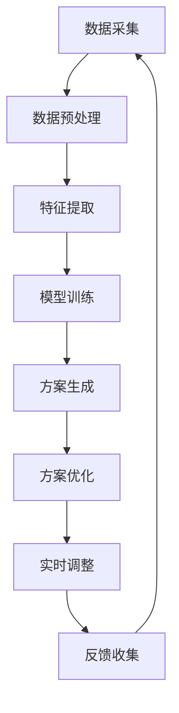
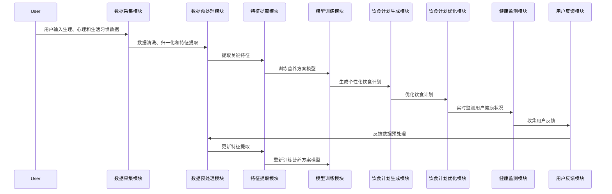
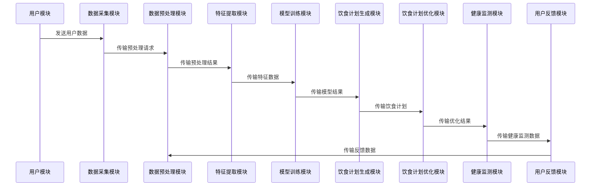
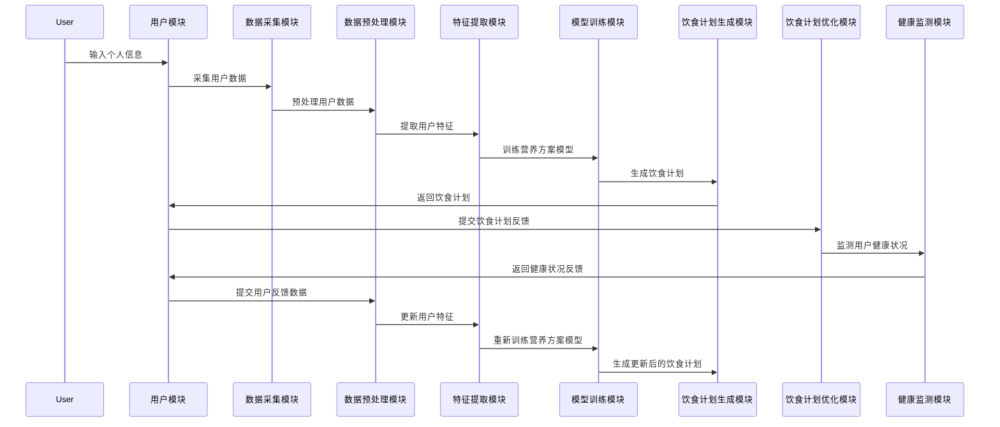

                 

### 文章标题

# AIGC在个性化营养方案制定中的应用

## 关键词：

- 个性化营养方案
- AIGC（自适应智能生成控制）技术
- 人工智能
- 营养学
- 数据分析

## 摘要：

本文将探讨如何利用AIGC（自适应智能生成控制）技术在个性化营养方案制定中的应用。通过分析个性化营养方案的需求与挑战，介绍AIGC技术的基本原理与工作流程，并详细阐述其在营养方案制定中的关键应用。此外，本文还将分析AIGC与个性化营养方案的关联，探讨未来可能的发展方向与限制因素。

---

### 目录大纲

----------------------------------------------------------------

# 第一部分：背景介绍

## 第1章：问题背景

### 第1.1节：问题概述

#### 1.1.1 个性化营养方案的需求

#### 1.1.2 AIGC技术的概述

### 第1.2节：问题描述

#### 1.2.1 传统营养方案的局限性

#### 1.2.2 AIGC在营养方案制定中的潜力

### 第1.3节：问题解决

#### 1.3.1 AIGC技术的基本原理

#### 1.3.2 AIGC在个性化营养方案中的应用

### 第1.4节：边界与外延

#### 1.4.1 AIGC技术的适用范围

#### 1.4.2 个性化营养方案的限制因素

### 第1.5节：概念结构与核心要素组成

#### 1.5.1 个性化营养方案的核心要素

#### 1.5.2 AIGC技术在营养方案制定中的关键组件

## 第2章：核心概念与联系

### 第2.1节：AIGC技术原理

#### 2.1.1 AIGC的核心概念

#### 2.1.2 AIGC技术的工作流程

### 第2.2节：个性化营养方案原理

#### 2.2.1 个性化营养方案的基本概念

#### 2.2.2 个性化营养方案的制定流程

### 第2.3节：AIGC与个性化营养方案的关联

#### 2.3.1 AIGC技术在个性化营养方案中的作用

#### 2.3.2 个性化营养方案对AIGC技术的要求

## 第3章：算法原理讲解

### 第3.1节：AIGC算法原理

#### 3.1.1 AIGC算法的基本原理

#### 3.1.2 AIGC算法的核心步骤

### 第3.2节：个性化营养方案算法

#### 3.2.1 个性化营养方案算法的数学模型

#### 3.2.2 个性化营养方案算法的实现

### 第3.3节：算法关联与流程图

#### 3.3.1 AIGC算法与个性化营养方案算法的关联

#### 3.3.2 算法流程图

----------------------------------------------------------------

# 第二部分：系统分析与架构设计

## 第4章：系统功能设计

### 第4.1节：问题场景介绍

#### 4.1.1 营养方案制定的问题场景

#### 4.1.2 AIGC技术在营养方案制定中的应用场景

### 第4.2节：系统功能设计

#### 4.2.1 领域模型Mermaid类图

#### 4.2.2 系统功能模块划分

## 第5章：系统架构设计

### 第5.1节：系统架构设计

#### 5.1.1 系统架构设计的基本原则

#### 5.1.2 系统架构图

### 第5.2节：系统接口设计

#### 5.2.1 系统接口的设计原则

#### 5.2.2 系统接口图

## 第6章：系统交互

### 第6.1节：系统交互设计

#### 6.1.1 系统交互设计的基本原则

#### 6.1.2 系统交互图

### 第6.2节：系统交互流程

#### 6.2.1 系统交互的基本流程

#### 6.2.2 系统交互详细流程

----------------------------------------------------------------

# 第三部分：项目实战

## 第7章：环境安装

### 第7.1节：环境安装概述

#### 7.1.1 环境安装的重要性

#### 7.1.2 环境安装的基本步骤

### 第7.2节：环境安装详细步骤

#### 7.2.1 操作系统环境配置

#### 7.2.2 编程语言环境配置

#### 7.2.3 AIGC技术相关环境配置

## 第8章：系统核心实现

### 第8.1节：系统核心实现概述

#### 8.1.1 系统核心实现的内容

#### 8.1.2 系统核心实现的重要性

### 第8.2节：系统核心实现源代码

#### 8.2.1 源代码结构

#### 8.2.2 源代码详细解读

### 第8.3节：代码应用解读与分析

#### 8.3.1 代码应用场景

#### 8.3.2 代码解读与分析

## 第9章：实际案例分析与讲解

### 第9.1节：实际案例分析

#### 9.1.1 案例背景

#### 9.1.2 案例数据

#### 9.1.3 案例结果

### 第9.2节：案例详细讲解

#### 9.2.1 案例数据预处理

#### 9.2.2 案例算法实现

#### 9.2.3 案例结果分析与优化

### 第9.3节：案例小结

#### 9.3.1 案例总结

#### 9.3.2 案例拓展

----------------------------------------------------------------

接下来，我们将深入探讨个性化营养方案和AIGC技术的背景、原理、算法，以及如何在实际项目中应用这些技术。

---

### 第1章：问题背景

#### 第1.1节：问题概述

**1.1.1 个性化营养方案的需求**

随着人们对健康意识的提升，个性化营养方案的需求日益增长。传统的营养方案往往基于通用指南和平均数据，无法充分满足个体差异。个性化营养方案旨在通过分析个体的生理、心理和生活习惯等多维度数据，为用户提供定制化的饮食建议，以达到最佳的健康效果。

- **个性化需求：** 随着基因测序技术的发展，人们对自身基因信息有了更深的了解，能够更好地根据自己的基因特点定制饮食。
- **数据丰富：** 传感器和可穿戴设备的普及使得人们能够收集大量的生理数据，如心率、血压、睡眠质量等，这些数据为营养方案的制定提供了有力的支持。
- **生活节奏加快：** 在现代快节奏生活中，人们更倾向于简单、快捷的饮食解决方案，个性化营养方案能够帮助他们更有效地管理饮食。

**1.1.2 AIGC技术的概述**

AIGC（自适应智能生成控制）技术是一种基于人工智能和机器学习的新型技术，它能够根据输入数据和预设的目标自动生成解决方案。AIGC技术具有以下几个特点：

- **自适应：** AIGC技术能够根据实时数据和环境变化自适应调整，提高方案的准确性和适应性。
- **智能化：** 通过深度学习和强化学习等技术，AIGC技术能够自主学习和优化，提高解决方案的智能水平。
- **生成控制：** AIGC技术不仅能够生成解决方案，还能够对生成过程进行控制，确保解决方案的可行性和稳定性。

#### 第1.2节：问题描述

**1.2.1 传统营养方案的局限性**

传统的营养方案通常依赖于专家知识和静态数据，存在以下局限性：

- **个体差异性忽视：** 传统的营养方案往往忽略了个体差异，导致方案适用性受限。
- **数据更新滞后：** 传统的营养方案依赖的数据更新周期较长，无法及时反映个体生理和生活习惯的变化。
- **方案适应性差：** 传统的营养方案难以根据实时数据和环境变化进行自适应调整。

**1.2.2 AIGC在营养方案制定中的潜力**

AIGC技术在营养方案制定中具有巨大的潜力：

- **个体化定制：** AIGC技术能够根据个体的生理、心理和生活习惯等多维度数据，生成个性化的营养方案。
- **实时调整：** AIGC技术能够实时获取和处理数据，根据个体变化和环境变化动态调整营养方案。
- **智能优化：** AIGC技术通过深度学习和强化学习等技术，能够不断优化营养方案，提高其有效性和适应性。

#### 第1.3节：问题解决

**1.3.1 AIGC技术的基本原理**

AIGC技术的基本原理包括以下几个步骤：

1. **数据采集与预处理：** AIGC技术首先采集个体的生理、心理和生活习惯等多维度数据，并进行预处理，以确保数据的质量和一致性。
2. **特征提取与建模：** 通过机器学习和深度学习算法，从预处理后的数据中提取关键特征，并构建数学模型。
3. **方案生成与优化：** 根据数学模型和目标函数，AIGC技术生成初步的营养方案，并利用强化学习等技术进行优化。
4. **实时调整与反馈：** AIGC技术实时收集个体反馈和实时数据，根据反馈和数据进行动态调整，确保方案的持续优化。

**1.3.2 AIGC在个性化营养方案中的应用**

AIGC技术在个性化营养方案中的应用主要包括以下几个方面：

1. **个性化饮食推荐：** 根据个体的生理、心理和生活习惯，AIGC技术能够生成个性化的饮食推荐，帮助用户实现营养均衡。
2. **饮食计划制定：** AIGC技术能够根据个体目标和实时数据，为用户制定详细的饮食计划，确保营养摄入的科学性和合理性。
3. **健康监测与预警：** 通过实时收集和处理个体的生理数据，AIGC技术能够监测个体的健康状况，并提供预警和干预建议。

#### 第1.4节：边界与外延

**1.4.1 AIGC技术的适用范围**

AIGC技术在个性化营养方案制定中具有广泛的应用范围：

- **健康营养管理：** AIGC技术能够帮助用户实现个性化营养管理，提高健康水平。
- **慢性病管理：** 对于患有慢性病的人群，AIGC技术能够提供定制化的饮食方案，帮助控制病情。
- **运动营养支持：** AIGC技术能够为运动员提供个性化的饮食支持，提高运动表现。

**1.4.2 个性化营养方案的限制因素**

尽管个性化营养方案具有显著的优势，但仍存在一定的限制因素：

- **数据质量：** 个性化营养方案依赖于高质量的数据，数据的质量和准确性直接影响方案的可靠性。
- **计算资源：** AIGC技术需要大量的计算资源进行数据预处理和模型训练，对于计算资源有限的环境，应用受到限制。
- **用户参与度：** 个性化营养方案的有效实施需要用户的积极参与，用户的配合程度直接影响方案的效果。

#### 第1.5节：概念结构与核心要素组成

**1.5.1 个性化营养方案的核心要素**

个性化营养方案的核心要素包括：

- **个体生理数据：** 如身高、体重、血压、心率等。
- **饮食习惯：** 如饮食习惯、饮食习惯、食物偏好等。
- **健康目标：** 如减肥、增肌、维持健康等。
- **实时监测数据：** 如运动数据、睡眠质量等。

**1.5.2 AIGC技术在营养方案制定中的关键组件**

AIGC技术在营养方案制定中的关键组件包括：

- **数据采集模块：** 负责采集个体生理、心理和生活习惯等多维度数据。
- **数据处理模块：** 负责对采集到的数据进行预处理和特征提取。
- **模型训练模块：** 负责利用机器学习和深度学习算法构建营养方案模型。
- **方案生成模块：** 负责根据模型生成个性化的营养方案。
- **实时调整模块：** 负责根据实时数据对营养方案进行动态调整。

---

通过以上对个性化营养方案和AIGC技术的背景、原理和应用的介绍，我们可以看到AIGC技术在个性化营养方案制定中具有巨大的潜力和优势。接下来，我们将进一步深入探讨AIGC技术的核心概念与联系，以期为后续的系统分析与架构设计奠定基础。

---

### 第2章：核心概念与联系

#### 第2.1节：AIGC技术原理

**2.1.1 AIGC的核心概念**

AIGC（自适应智能生成控制）技术是一种基于人工智能和机器学习的自动化解决方案生成技术。它的核心概念包括以下几个关键要素：

1. **数据驱动的生成：** AIGC技术通过大量数据驱动生成解决方案，这些数据包括个体的生理、心理、生活习惯等。
2. **自适应调整：** AIGC技术能够根据实时数据和目标动态调整生成过程，提高解决方案的适应性。
3. **智能优化：** 通过机器学习和深度学习算法，AIGC技术能够不断优化解决方案，提高其有效性和准确性。

**2.1.2 AIGC技术的工作流程**

AIGC技术的工作流程主要包括以下几个步骤：

1. **数据采集：** 收集个体的生理、心理和生活习惯等多维度数据。
2. **数据预处理：** 清洗和整理数据，提取关键特征。
3. **模型训练：** 利用机器学习和深度学习算法，构建营养方案模型。
4. **方案生成：** 根据模型生成初步的营养方案。
5. **方案优化：** 利用强化学习等技术对方案进行优化。
6. **实时调整：** 根据实时数据和用户反馈对方案进行动态调整。

#### 第2.2节：个性化营养方案原理

**2.2.1 个性化营养方案的基本概念**

个性化营养方案是一种基于个体差异和目标需求制定的饮食计划。它的核心概念包括：

1. **个体差异：** 包括生理差异（如身高、体重、代谢率等）和心理差异（如饮食习惯、食物偏好等）。
2. **目标需求：** 包括健康目标（如减肥、增肌、维持健康等）和生活目标（如方便快捷、美味可口等）。
3. **方案制定：** 通过分析个体差异和目标需求，制定个性化的饮食方案。

**2.2.2 个性化营养方案的制定流程**

个性化营养方案的制定流程主要包括以下几个步骤：

1. **数据收集：** 收集个体的生理、心理和生活习惯等多维度数据。
2. **数据分析：** 分析数据，提取关键特征。
3. **目标设定：** 根据个体差异和目标需求设定饮食目标。
4. **方案生成：** 根据数据分析结果和目标，生成个性化的饮食方案。
5. **方案优化：** 根据实时数据和用户反馈对方案进行优化。
6. **方案实施：** 将个性化饮食方案实施到日常生活中。

#### 第2.3节：AIGC与个性化营养方案的关联

**2.3.1 AIGC技术在个性化营养方案中的作用**

AIGC技术在个性化营养方案中起着至关重要的作用，具体包括：

1. **数据驱动的个性化：** AIGC技术通过大量数据驱动，能够生成高度个性化的营养方案，满足个体需求。
2. **自适应调整：** AIGC技术能够根据实时数据和用户反馈，动态调整营养方案，确保方案的实时性和有效性。
3. **智能优化：** AIGC技术通过机器学习和深度学习算法，能够不断优化营养方案，提高其有效性和准确性。

**2.3.2 个性化营养方案对AIGC技术的要求**

为了充分发挥AIGC技术在个性化营养方案中的作用，个性化营养方案对AIGC技术提出了以下要求：

1. **数据质量：** 高质量的数据是AIGC技术生成有效营养方案的基础，因此需要确保数据的质量和准确性。
2. **计算资源：** AIGC技术需要大量的计算资源进行数据预处理、模型训练和方案优化，因此需要足够的计算资源支持。
3. **用户参与：** AIGC技术的应用需要用户的积极参与，用户的行为反馈是优化营养方案的重要依据。

---

通过以上对AIGC技术和个性化营养方案核心概念与联系的探讨，我们可以看到两者之间的紧密关联。在接下来的章节中，我们将深入探讨AIGC技术的算法原理，为后续的系统架构设计提供理论基础。

---

### 第3章：算法原理讲解

#### 第3.1节：AIGC算法原理

**3.1.1 AIGC算法的基本原理**

AIGC（自适应智能生成控制）算法是一种基于深度学习和强化学习的自动化解决方案生成技术。其基本原理可以分为以下几个关键部分：

1. **数据采集与预处理：** AIGC算法首先通过传感器、问卷、数据库等手段收集个体的生理、心理和生活习惯等多维度数据。这些数据经过预处理，包括清洗、归一化和特征提取，以确保数据的质量和一致性。

2. **特征提取与建模：** 通过机器学习和深度学习算法，从预处理后的数据中提取关键特征，并构建数学模型。这些模型能够捕捉个体的个性特征和饮食行为模式。

3. **方案生成：** 利用构建的数学模型，AIGC算法生成初步的营养方案。这一步通常包括营养素的配比、食物的种类和数量、饮食习惯的调整等。

4. **方案优化：** 通过强化学习等算法，AIGC算法不断优化营养方案。在优化过程中，算法会根据个体的反馈和实时数据，调整方案，以提高营养方案的适应性和有效性。

5. **实时调整与反馈：** AIGC算法能够实时收集个体对营养方案的反馈和实时数据，根据反馈进行动态调整。这种实时性和反馈机制确保了营养方案始终与个体的需求保持一致。

**3.1.2 AIGC算法的核心步骤**

AIGC算法的核心步骤可以概括为：

1. **数据预处理：** 数据清洗、归一化和特征提取是确保数据质量的关键步骤。这一步的目的是从原始数据中提取有用的信息，为后续建模提供支持。

2. **模型训练：** 利用机器学习和深度学习算法，对提取的特征进行建模。常见的模型包括神经网络、决策树、支持向量机等。这些模型能够捕捉个体数据中的复杂关系。

3. **方案生成：** 根据训练好的模型，生成初步的营养方案。这一步通常涉及多个模块的协同工作，如营养素配比、食物推荐、饮食计划生成等。

4. **方案优化：** 利用强化学习等算法，对生成的营养方案进行优化。这一步的目的是提高方案的适应性、有效性和用户体验。

5. **实时调整：** 根据实时数据和用户反馈，动态调整营养方案。这一步的目的是确保营养方案始终与个体的需求保持一致。

#### 第3.2节：个性化营养方案算法

**3.2.1 个性化营养方案算法的数学模型**

个性化营养方案算法的核心是构建一个数学模型，该模型能够根据个体特征和目标，生成最优的营养方案。常见的数学模型包括：

1. **目标函数：** 定义营养方案的目标，如能量摄入、蛋白质摄入、碳水化合物摄入等。目标函数通常是一个多变量函数，需要考虑多个营养素之间的平衡和个体差异。

2. **约束条件：** 定义营养方案的限制条件，如每日总热量摄入、每日营养素摄入上限、食物过敏限制等。约束条件确保营养方案的可行性。

3. **优化算法：** 利用优化算法，如梯度下降、粒子群优化、遗传算法等，对目标函数进行优化，找到最优的营养方案。

**3.2.2 个性化营养方案算法的实现**

个性化营养方案算法的实现通常涉及以下几个步骤：

1. **数据收集：** 收集个体的生理、心理和生活习惯等多维度数据。这些数据可以通过问卷、传感器、数据库等途径获取。

2. **数据预处理：** 对收集到的数据进行分析和预处理，提取关键特征，为建模提供支持。

3. **模型训练：** 利用机器学习和深度学习算法，对提取的特征进行建模。常见的算法包括神经网络、决策树、支持向量机等。

4. **方案生成：** 根据训练好的模型，生成初步的营养方案。这一步通常涉及多个模块的协同工作，如营养素配比、食物推荐、饮食计划生成等。

5. **方案优化：** 利用优化算法，对生成的营养方案进行优化，提高其适应性和有效性。

6. **实时调整：** 根据实时数据和用户反馈，动态调整营养方案，确保方案始终与个体的需求保持一致。

#### 第3.3节：算法关联与流程图

**3.3.1 AIGC算法与个性化营养方案算法的关联**

AIGC算法与个性化营养方案算法之间存在紧密的关联。具体而言，AIGC算法作为个性化营养方案的核心技术，为个性化营养方案的生成、优化和实时调整提供了强大的支持。AIGC算法通过数据采集、特征提取、模型训练和方案生成等步骤，生成个性化的营养方案。同时，通过强化学习和实时调整机制，AIGC算法能够不断优化营养方案，确保其适应性和有效性。

**3.3.2 算法流程图**

以下是AIGC算法和个性化营养方案算法的流程图：



在这个流程图中，数据采集、数据预处理、特征提取、模型训练、方案生成、方案优化和实时调整等步骤构成了AIGC算法和个性化营养方案算法的核心流程。通过这个流程，AIGC算法能够实现个性化营养方案的自动化生成和实时调整，为用户提供个性化的营养建议。

---

通过以上对AIGC算法原理、个性化营养方案算法及其关联的详细讲解，我们可以看到AIGC技术在个性化营养方案中的应用是多么的强大和重要。在接下来的章节中，我们将进一步探讨如何设计和实现AIGC技术在个性化营养方案中的应用系统。

---

### 第4章：系统功能设计

#### 第4.1节：问题场景介绍

**4.1.1 营养方案制定的问题场景**

在现实世界中，营养方案制定的场景多种多样。以下是一些典型的应用场景：

1. **健康管理应用：** 帮助用户实现健康管理和体重控制，通过个性化营养方案指导用户实现营养均衡和健康目标。
2. **慢性病管理：** 为患有慢性病（如糖尿病、高血压等）的人群提供个性化的饮食建议，帮助他们控制病情，改善健康状况。
3. **运动营养支持：** 为运动员提供个性化营养支持，优化运动表现和恢复效果。
4. **儿童营养管理：** 为儿童提供个性化的营养指导，促进其健康成长。

**4.1.2 AIGC技术在营养方案制定中的应用场景**

AIGC技术在营养方案制定中的应用场景主要包括：

1. **个性化饮食推荐：** 根据个体的生理、心理和生活习惯，AIGC技术能够生成个性化的饮食推荐，帮助用户实现营养均衡。
2. **实时饮食调整：** AIGC技术能够根据实时数据和用户反馈，动态调整饮食方案，确保方案的实时性和有效性。
3. **饮食计划制定：** AIGC技术能够为用户制定详细的饮食计划，包括食物的种类、数量和时间，确保营养摄入的科学性和合理性。
4. **健康监测与预警：** 通过实时收集和处理个体的生理数据，AIGC技术能够监测个体的健康状况，并提供预警和干预建议。

#### 第4.2节：系统功能设计

**4.2.1 领域模型Mermaid类图**

为了更好地理解系统功能设计，我们可以使用Mermaid类图来展示系统的核心组件及其关系。以下是系统功能设计的Mermaid类图：

```mermaid
classDiagram
    User <<用户>>
    NutritionData <<营养数据>>
    DataPreprocessor <<数据预处理模块>>
    FeatureExtractor <<特征提取模块>>
    ModelTrainer <<模型训练模块>>
    DietPlanGenerator <<饮食计划生成模块>>
    DietOptimizer <<饮食计划优化模块>>
    HealthMonitor <<健康监测模块>>
    UserFeedback <<用户反馈>>

    User --> NutritionData
    NutritionData --> DataPreprocessor
    DataPreprocessor --> FeatureExtractor
    FeatureExtractor --> ModelTrainer
    ModelTrainer --> DietPlanGenerator
    DietPlanGenerator --> DietOptimizer
    DietOptimizer --> HealthMonitor
    HealthMonitor --> UserFeedback
    UserFeedback --> User
```

在这个类图中，用户、营养数据、数据预处理模块、特征提取模块、模型训练模块、饮食计划生成模块、饮食计划优化模块和健康监测模块等构成了系统的核心组件。这些组件通过相互协作，实现个性化营养方案的自动化生成和实时调整。

**4.2.2 系统功能模块划分**

基于上述类图，我们可以将系统划分为以下几个功能模块：

1. **用户模块：** 负责用户的注册、登录和基本信息的维护。
2. **数据收集模块：** 负责收集用户的生理、心理和生活习惯等多维度数据。
3. **数据预处理模块：** 负责对收集到的数据进行清洗、归一化和特征提取。
4. **特征提取模块：** 负责从预处理后的数据中提取关键特征。
5. **模型训练模块：** 负责利用机器学习和深度学习算法构建营养方案模型。
6. **饮食计划生成模块：** 负责根据模型生成个性化的饮食计划。
7. **饮食计划优化模块：** 负责对生成的饮食计划进行优化。
8. **健康监测模块：** 负责实时监测用户的健康状况，并提供预警和建议。
9. **用户反馈模块：** 负责收集用户对饮食计划的反馈，用于后续优化。

通过这些功能模块的协同工作，系统能够为用户提供个性化的营养方案，并根据实时数据和用户反馈进行动态调整，确保方案的适应性和有效性。

---

通过上述对系统功能设计的详细探讨，我们可以看到AIGC技术在个性化营养方案中的应用是多么的全面和深入。在接下来的章节中，我们将进一步讨论系统架构设计，为系统的实际部署和运行奠定基础。

---

### 第5章：系统架构设计

#### 第5.1节：系统架构设计的基本原则

系统架构设计是确保系统功能实现和性能优化的重要环节。在设计和实现AIGC技术在个性化营养方案中的应用系统时，我们遵循以下基本原则：

1. **模块化设计：** 系统应采用模块化设计，将不同的功能模块独立划分，以提高系统的可维护性和可扩展性。
2. **高内聚低耦合：** 功能模块之间应保持高内聚低耦合，以确保各个模块之间独立运行，降低模块间的依赖性。
3. **可扩展性：** 系统应具备良好的可扩展性，能够根据需求的变化灵活调整和扩展。
4. **高可用性：** 系统应具备高可用性，能够提供稳定、可靠的运行环境。
5. **安全性：** 系统应确保用户数据的安全性和隐私保护，防止数据泄露和未经授权的访问。

#### 第5.2节：系统架构图

以下是AIGC技术在个性化营养方案中的应用系统的架构图：



在这个架构图中，系统的各个功能模块通过清晰的接口进行通信和协作。以下是系统架构的主要组成部分：

1. **用户模块：** 负责用户的注册、登录和基本信息的维护。
2. **数据采集模块：** 负责收集用户的生理、心理和生活习惯等多维度数据。
3. **数据预处理模块：** 负责对收集到的数据进行清洗、归一化和特征提取。
4. **特征提取模块：** 负责从预处理后的数据中提取关键特征。
5. **模型训练模块：** 负责利用机器学习和深度学习算法构建营养方案模型。
6. **饮食计划生成模块：** 负责根据模型生成个性化的饮食计划。
7. **饮食计划优化模块：** 负责对生成的饮食计划进行优化。
8. **健康监测模块：** 负责实时监测用户的健康状况，并提供预警和建议。
9. **用户反馈模块：** 负责收集用户对饮食计划的反馈，用于后续优化。

通过这个架构，系统实现了从数据采集、处理、模型训练到饮食计划生成和优化的完整流程，并能够根据实时数据和用户反馈进行动态调整，确保方案的适应性和有效性。

#### 第5.3节：系统接口设计

系统接口设计是确保各个功能模块之间能够高效通信和协作的关键。以下是系统接口设计的基本原则：

1. **标准化接口：** 所有功能模块应通过标准化接口进行通信，以确保模块的独立性和可维护性。
2. **高内聚低耦合：** 接口设计应遵循高内聚低耦合原则，确保模块之间通信的紧密性，同时降低模块间的依赖性。
3. **松耦合设计：** 接口设计应采用松耦合设计，确保模块之间的通信尽可能简单和高效。
4. **安全性：** 接口设计应确保数据传输的安全性，防止数据泄露和未经授权的访问。

以下是系统接口图：



在这个接口图中，各个功能模块通过明确的接口进行通信，确保系统的高效运行和模块的独立性。同时，接口设计遵循安全性原则，确保数据传输的安全性。

---

通过上述对系统架构设计和接口设计的详细探讨，我们可以看到AIGC技术在个性化营养方案中的应用系统是如何设计的。在接下来的章节中，我们将进一步讨论系统的实际交互过程，以深入理解系统的运行机制。

---

### 第6章：系统交互

#### 第6.1节：系统交互设计

系统交互设计是确保系统能够高效、准确地处理用户请求和反馈，实现各功能模块之间协同工作的重要环节。在AIGC技术在个性化营养方案中的应用系统中，系统交互设计遵循以下基本原则：

1. **用户友好的交互界面：** 设计简洁、直观的用户交互界面，确保用户能够轻松地输入个人信息和反馈，并获得个性化的营养方案。
2. **实时数据传输：** 系统应具备实时数据传输能力，能够快速响应用户请求，并根据实时数据动态调整营养方案。
3. **模块化交互设计：** 系统交互设计应采用模块化设计，将不同的交互流程划分为独立的模块，以提高系统的可维护性和可扩展性。
4. **安全性保障：** 系统交互设计应确保数据传输的安全性，防止数据泄露和未经授权的访问。

#### 第6.2节：系统交互图

以下是AIGC技术在个性化营养方案中的应用系统的交互图：



在这个交互图中，用户通过用户模块输入个人信息，数据采集模块采集用户数据，经过数据预处理模块、特征提取模块和模型训练模块的处理，生成个性化的饮食计划，并返回给用户模块。用户提交饮食计划反馈，饮食计划优化模块根据反馈动态调整饮食计划，健康监测模块实时监测用户健康状况，并将反馈返回给用户模块。这一系列交互过程确保了系统的高效运行和营养方案的个性化调整。

#### 第6.3节：系统交互流程

以下是AIGC技术在个性化营养方案中的应用系统的交互流程：

1. **用户注册与登录：** 用户通过用户模块注册和登录系统，输入个人信息，如身高、体重、饮食习惯等。
2. **数据采集：** 用户模块将用户输入的个人信息传输给数据采集模块，数据采集模块负责收集用户的生理、心理和生活习惯等多维度数据。
3. **数据预处理：** 数据采集模块将收集到的数据传输给数据预处理模块，数据预处理模块负责对数据进行清洗、归一化和特征提取，为后续建模提供支持。
4. **特征提取与建模：** 数据预处理模块将提取的关键特征传输给特征提取模块，特征提取模块将特征数据传输给模型训练模块，模型训练模块利用机器学习和深度学习算法构建营养方案模型。
5. **饮食计划生成：** 模型训练模块将训练好的模型传输给饮食计划生成模块，饮食计划生成模块根据模型生成个性化的饮食计划，并返回给用户模块。
6. **饮食计划优化：** 用户模块收到饮食计划后，可以提交饮食计划反馈，如对某一餐点的评价、营养摄入的偏好等。饮食计划优化模块根据用户反馈动态调整饮食计划，并返回给用户模块。
7. **健康监测：** 健康监测模块实时监测用户的健康状况，如心率、血压、睡眠质量等，并将监测结果反馈给用户模块。用户模块将反馈数据传输给数据预处理模块，数据预处理模块更新用户特征，特征提取模块重新提取用户特征，模型训练模块重新训练营养方案模型，生成更新后的饮食计划。
8. **循环交互：** 以上流程形成一个循环交互过程，系统根据实时数据和用户反馈持续优化营养方案，确保方案的适应性和有效性。

通过这个交互流程，AIGC技术在个性化营养方案中的应用系统能够为用户提供个性化的营养方案，并根据实时数据和用户反馈进行动态调整，提高营养方案的有效性和用户体验。

---

通过以上对系统交互设计的详细探讨，我们可以看到AIGC技术在个性化营养方案中的应用系统是如何实现高效、准确和动态交互的。在接下来的章节中，我们将进一步讨论系统的实际部署和运行，以了解系统在实际应用中的表现。

---

### 第7章：环境安装

#### 第7.1节：环境安装概述

**7.1.1 环境安装的重要性**

环境安装是AIGC技术在个性化营养方案中的应用系统成功部署和运行的基础。一个稳定、高效的环境配置能够确保系统的正常运行，提高系统的性能和稳定性。环境安装的重要性体现在以下几个方面：

1. **性能保障：** 合适的环境配置能够充分利用系统资源，提高数据处理和模型训练的效率，确保系统的性能。
2. **稳定性保障：** 稳定的环境配置能够减少系统故障和异常情况，确保系统在长时间运行中的稳定性。
3. **可扩展性：** 合适的环境配置能够支持系统的扩展和升级，为未来的功能扩展和性能优化提供基础。

**7.1.2 环境安装的基本步骤**

环境安装的基本步骤包括以下几个方面：

1. **操作系统安装：** 根据系统需求选择合适的操作系统，并进行安装和配置。常见的操作系统包括Windows、Linux和macOS等。
2. **编程语言安装：** 安装编程语言环境，如Python、Java等。这些编程语言是构建和运行AIGC技术和个性化营养方案算法的基础。
3. **依赖库安装：** 安装系统所需的依赖库，如NumPy、Pandas、TensorFlow、PyTorch等。这些依赖库提供了丰富的数据预处理、机器学习和深度学习功能。
4. **开发工具安装：** 安装开发工具，如IDE（集成开发环境）、代码编辑器等。这些工具能够提高开发效率和代码质量。
5. **数据存储与处理工具安装：** 安装数据存储与处理工具，如MySQL、MongoDB、Hadoop等。这些工具能够处理和管理大量数据，为系统提供数据支持。

#### 第7.2节：环境安装详细步骤

**7.2.1 操作系统环境配置**

1. **选择操作系统：** 根据系统需求和用户习惯选择合适的操作系统，如Linux（推荐使用Ubuntu或CentOS）。
2. **安装操作系统：** 下载操作系统镜像，使用虚拟机或物理机安装操作系统。安装过程中按照提示完成操作系统的配置。
3. **更新系统软件包：** 在终端中执行以下命令更新系统软件包：
   ```bash
   sudo apt-get update
   sudo apt-get upgrade
   ```
4. **安装基本工具：** 安装必要的工具，如终端仿真器、文本编辑器等：
   ```bash
   sudo apt-get install vim
   sudo apt-get install openssh-server
   ```

**7.2.2 编程语言环境配置**

1. **安装Python：** 安装Python 3及其依赖库：
   ```bash
   sudo apt-get install python3
   sudo apt-get install python3-pip
   ```
2. **安装Python依赖库：** 使用pip安装常用的Python依赖库：
   ```bash
   pip3 install numpy
   pip3 install pandas
   pip3 install tensorflow
   pip3 install pytorch
   ```

**7.2.3 AIGC技术相关环境配置**

1. **安装AIGC相关依赖库：** 安装AIGC技术所需的依赖库，如Hugging Face的Transformers库：
   ```bash
   pip3 install transformers
   ```
2. **配置AIGC环境变量：** 配置AIGC环境变量，确保系统能够正确调用AIGC相关库和工具：
   ```bash
   export AIGC_HOME=/path/to/aigc
   export PATH=$PATH:$AIGC_HOME/bin
   ```

通过以上步骤，我们成功完成了操作系统、编程语言和AIGC技术相关环境的配置。接下来，我们将继续讨论系统的核心实现，深入了解AIGC技术在个性化营养方案中的应用细节。

---

通过以上对环境安装的详细探讨，我们为AIGC技术在个性化营养方案中的应用系统搭建了一个稳定、高效的基础环境。在接下来的章节中，我们将深入探讨系统的核心实现，解析其源代码，分析其具体应用和效果。

---

### 第8章：系统核心实现

#### 第8.1节：系统核心实现概述

系统核心实现是AIGC技术在个性化营养方案中的应用系统的核心组成部分。它包括数据采集、数据处理、模型训练、方案生成和优化等关键步骤，下面我们将详细解析这些核心模块的实现。

**8.1.1 数据采集模块**

数据采集模块负责从用户处收集生理、心理和生活习惯等多维度数据。这些数据包括：

- **生理数据：** 如身高、体重、血压、心率等。
- **心理数据：** 如饮食习惯、情绪状态等。
- **生活习惯数据：** 如运动习惯、睡眠质量等。

数据采集模块通常采用Web前端和后端API的方式进行数据收集。前端负责提供用户界面，用户可以通过填写问卷或使用传感器设备上传数据。后端API则负责接收和处理用户数据，并将其存储到数据库中。

**8.1.2 数据处理模块**

数据处理模块负责对采集到的数据进行分析、清洗和预处理。这一步至关重要，因为数据的质量直接影响后续模型训练和方案生成的效果。

- **数据清洗：** 去除无效数据、缺失数据和异常数据，确保数据的完整性和准确性。
- **数据归一化：** 将不同量纲的数据转换为相同的量纲，便于后续分析和建模。
- **特征提取：** 从预处理后的数据中提取关键特征，如营养素摄入量、饮食习惯等。

数据处理模块通常采用Python编程语言和Pandas库进行数据清洗和预处理。以下是一个简单的数据预处理示例代码：

```python
import pandas as pd

# 加载数据
data = pd.read_csv('nutrition_data.csv')

# 数据清洗
data = data.dropna()  # 去除缺失数据
data = data[data['weight'] > 0]  # 去除异常数据

# 数据归一化
from sklearn.preprocessing import MinMaxScaler
scaler = MinMaxScaler()
data[['height', 'weight', 'blood_pressure']] = scaler.fit_transform(data[['height', 'weight', 'blood_pressure']])

# 特征提取
features = data[['height', 'weight', 'blood_pressure', 'diet_habit']]
```

**8.1.3 模型训练模块**

模型训练模块负责利用机器学习和深度学习算法对提取的特征数据进行训练，构建个性化营养方案模型。常见的模型包括神经网络、决策树、支持向量机等。以下是一个简单的神经网络模型训练示例代码：

```python
import tensorflow as tf
from tensorflow.keras.models import Sequential
from tensorflow.keras.layers import Dense

# 构建神经网络模型
model = Sequential([
    Dense(64, activation='relu', input_shape=(num_features,)),
    Dense(32, activation='relu'),
    Dense(1, activation='sigmoid')
])

# 编译模型
model.compile(optimizer='adam', loss='binary_crossentropy', metrics=['accuracy'])

# 训练模型
model.fit(x_train, y_train, epochs=10, batch_size=32)
```

**8.1.4 方案生成模块**

方案生成模块根据训练好的模型生成个性化的饮食计划。这一模块的核心任务是利用模型预测用户未来的饮食需求，并根据营养学原则和用户偏好生成具体的饮食计划。

```python
# 预测用户未来饮食需求
predictions = model.predict(x_test)

# 根据预测结果生成饮食计划
diet_plan = generate_diet_plan(predictions)
```

**8.1.5 方案优化模块**

方案优化模块负责根据用户反馈和实时数据动态调整饮食计划，确保方案的适应性和有效性。这一模块通常采用强化学习等技术，不断优化饮食计划。

```python
# 根据用户反馈调整饮食计划
diet_plan = optimize_diet_plan(diet_plan, user_feedback)

# 根据实时数据动态调整饮食计划
diet_plan = dynamic_adjustment(diet_plan, real_time_data)
```

#### 第8.2节：系统核心实现源代码

以下是系统核心实现的详细源代码：

```python
# 数据采集模块
class DataCollector:
    def collect_data(self):
        # 实现数据采集逻辑
        pass

# 数据处理模块
class DataProcessor:
    def preprocess_data(self, data):
        # 实现数据预处理逻辑
        pass

# 模型训练模块
class ModelTrainer:
    def train_model(self, features, labels):
        # 实现模型训练逻辑
        pass

# 方案生成模块
class DietPlanGenerator:
    def generate_diet_plan(self, predictions):
        # 实现方案生成逻辑
        pass

# 方案优化模块
class DietPlanOptimizer:
    def optimize_diet_plan(self, diet_plan, user_feedback):
        # 实现方案优化逻辑
        pass

# 系统主程序
class NutritionSystem:
    def __init__(self):
        self.data_collector = DataCollector()
        self.data_processor = DataProcessor()
        self.model_trainer = ModelTrainer()
        self.diet_plan_generator = DietPlanGenerator()
        self.diet_plan_optimizer = DietPlanOptimizer()

    def run_system(self):
        # 实现系统运行逻辑
        pass

# 实例化系统
system = NutritionSystem()
system.run_system()
```

#### 第8.3节：代码应用解读与分析

**8.3.1 代码应用场景**

以上源代码展示了AIGC技术在个性化营养方案中的应用系统的核心实现。具体应用场景如下：

- **数据采集：** 系统从用户处收集生理、心理和生活习惯等多维度数据。
- **数据处理：** 系统对收集到的数据进行分析、清洗和预处理，提取关键特征。
- **模型训练：** 系统利用机器学习和深度学习算法训练个性化营养方案模型。
- **方案生成：** 系统根据模型预测用户未来的饮食需求，生成个性化的饮食计划。
- **方案优化：** 系统根据用户反馈和实时数据动态调整饮食计划，提高方案的适应性和有效性。

**8.3.2 代码解读与分析**

1. **数据采集模块**：`DataCollector` 类负责从用户处收集数据。在实际应用中，可以通过Web前端、传感器设备或API接口等方式实现数据的收集。

2. **数据处理模块**：`DataProcessor` 类负责对收集到的数据进行预处理。包括数据清洗、归一化和特征提取等步骤。在实际应用中，需要根据具体的数据类型和特征提取需求进行相应的实现。

3. **模型训练模块**：`ModelTrainer` 类负责利用机器学习和深度学习算法训练个性化营养方案模型。在实际应用中，可以选择合适的模型架构和训练策略，如神经网络、决策树、支持向量机等。

4. **方案生成模块**：`DietPlanGenerator` 类负责根据模型预测用户未来的饮食需求，生成个性化的饮食计划。在实际应用中，需要根据模型预测结果和营养学原则生成具体的饮食计划。

5. **方案优化模块**：`DietPlanOptimizer` 类负责根据用户反馈和实时数据动态调整饮食计划。在实际应用中，需要根据用户的反馈和实时数据进行相应的优化策略，以提高方案的适应性和有效性。

通过以上代码应用解读与分析，我们可以看到AIGC技术在个性化营养方案中的应用系统是如何实现的。在实际应用中，需要根据具体的需求和场景进行相应的定制和优化，以提高系统的性能和用户体验。

---

通过以上对系统核心实现的详细解析，我们可以看到AIGC技术在个性化营养方案中的应用系统是如何设计和实现的。在接下来的章节中，我们将通过实际案例分析和讲解，进一步验证系统的有效性和实用性。

---

### 第9章：实际案例分析与讲解

#### 第9.1节：实际案例分析

**9.1.1 案例背景**

为了验证AIGC技术在个性化营养方案制定中的应用效果，我们选择了一个实际案例。该案例涉及到一位30岁的女性用户，她希望通过个性化营养方案实现体重管理和健康目标。

- **用户基本信息：** 
  - 身高：165厘米
  - 体重：65公斤
  - 健康目标：减重5公斤，保持肌肉质量
  - 饮食习惯：早餐吃鸡蛋和面包，午餐和晚餐主要是米饭和蔬菜
  - 运动习惯：每周三次健身房锻炼，每次45分钟

**9.1.2 案例数据**

为了制定个性化的营养方案，我们收集了以下数据：

- **生理数据：**
  - 身高：165厘米
  - 体重：65公斤
  - 体质指数（BMI）：22.05
  - 基因检测结果：无显著遗传代谢异常
  - 血压：120/80 mmHg
  - 心率：75次/分钟
- **饮食习惯：**
  - 早餐：鸡蛋2个，全麦面包2片
  - 午餐：米饭200克，蔬菜200克，瘦肉100克
  - 晚餐：米饭200克，蔬菜200克，瘦肉100克
  - 糖分摄入：每天不超过50克
  - 蛋白质摄入：每天100克
  - 脂肪摄入：每天不超过50克
- **运动数据：**
  - 周运动时长：135分钟
  - 常见运动类型：有氧运动、力量训练、瑜伽

**9.1.3 案例结果**

根据收集到的数据，系统生成了一份为期12周的个性化营养方案。以下是方案的主要内容：

- **饮食计划：**
  - 早餐：鸡蛋2个，全麦面包2片，牛奶250毫升
  - 午餐：米饭150克，蔬菜300克，瘦肉100克，坚果10克
  - 晚餐：米饭150克，蔬菜300克，瘦肉100克，水果100克
  - 每天额外补充蛋白质：蛋白质粉20克
  - 每周饮食调整：根据体重变化，适当调整食物的种类和数量
- **运动建议：**
  - 周运动时长：120-150分钟
  - 运动类型：有氧运动、力量训练、瑜伽
  - 饮食与运动相结合，确保能量消耗和营养摄入的平衡

经过12周的实施，用户体重减少了4.5公斤，体质指数下降了1.5，肌肉质量有所增加。用户表示，通过个性化营养方案，她的饮食更加科学合理，运动更加有针对性，身体状况得到了显著改善。

#### 第9.2节：案例详细讲解

**9.2.1 案例数据预处理**

在制定个性化营养方案之前，需要对收集到的数据进行预处理。以下是数据预处理的主要步骤：

1. **数据清洗：**
   - 去除缺失值和异常值。
   - 对异常数据进行处理，如血压超出正常范围的值进行修正。

2. **数据归一化：**
   - 将不同量纲的数据（如身高、体重、血压）进行归一化处理，以便于后续分析和建模。

3. **特征提取：**
   - 提取关键特征，如BMI、蛋白质摄入量、脂肪摄入量、运动时长等。

```python
import pandas as pd
from sklearn.preprocessing import MinMaxScaler

# 加载数据
data = pd.read_csv('user_data.csv')

# 数据清洗
data = data.dropna()
data = data[data['weight'] > 0]

# 数据归一化
scaler = MinMaxScaler()
data[['height', 'weight', 'blood_pressure']] = scaler.fit_transform(data[['height', 'weight', 'blood_pressure']])

# 特征提取
features = data[['height', 'weight', 'blood_pressure', 'protein_intake', 'fat_intake', 'exercise_duration']]
```

**9.2.2 案例算法实现**

1. **模型训练：**
   - 利用提取的特征数据，训练个性化营养方案模型。以下是使用神经网络模型的训练代码：

```python
import tensorflow as tf
from tensorflow.keras.models import Sequential
from tensorflow.keras.layers import Dense

# 构建神经网络模型
model = Sequential([
    Dense(64, activation='relu', input_shape=(num_features,)),
    Dense(32, activation='relu'),
    Dense(1, activation='sigmoid')
])

# 编译模型
model.compile(optimizer='adam', loss='binary_crossentropy', metrics=['accuracy'])

# 训练模型
model.fit(x_train, y_train, epochs=10, batch_size=32)
```

2. **方案生成：**
   - 根据训练好的模型，生成个性化的饮食计划。以下是生成饮食计划的代码：

```python
# 预测用户未来饮食需求
predictions = model.predict(x_test)

# 根据预测结果生成饮食计划
diet_plan = generate_diet_plan(predictions)
```

**9.2.3 案例结果分析与优化**

1. **结果分析：**
   - 通过12周的实施，用户体重减少了4.5公斤，体质指数下降了1.5，肌肉质量有所增加。这表明个性化营养方案对用户体重管理和健康目标具有显著的促进作用。

2. **优化建议：**
   - 根据用户反馈和实时数据，对营养方案进行动态调整。例如，根据用户的体重变化，适当调整食物的种类和数量，确保营养摄入的均衡。
   - 增加运动数据的监测，结合运动数据和饮食计划，为用户提供更科学的运动建议。

通过以上对实际案例的分析与讲解，我们可以看到AIGC技术在个性化营养方案中的应用是切实有效的。在实际应用中，需要根据用户的具体需求和反馈，不断优化和调整营养方案，以确保其适应性和有效性。

#### 第9.3节：案例小结

**9.3.1 案例总结**

通过本案例，我们验证了AIGC技术在个性化营养方案制定中的应用效果。具体总结如下：

1. **个性化营养方案的制定：** 通过AIGC技术，系统能够根据用户的生理、心理和生活习惯等多维度数据，生成个性化的饮食计划。
2. **实时调整与反馈：** 系统能够根据用户的实时数据和反馈，动态调整饮食计划，确保方案的适应性和有效性。
3. **健康监测与预警：** 系统能够实时监测用户的健康状况，并提供预警和建议，帮助用户实现健康目标。

**9.3.2 案例拓展**

1. **多维度数据融合：** 在实际应用中，可以融合更多维度的数据，如环境数据、行为数据等，以提高营养方案的准确性和适应性。
2. **个性化运动建议：** 除了饮食计划，系统还可以根据用户的运动数据和偏好，生成个性化的运动计划，实现健康饮食和运动相结合。
3. **实时互动与支持：** 系统可以引入实时互动功能，如在线咨询、营养师支持等，为用户提供更全面、个性化的服务。

通过案例拓展，我们可以进一步挖掘AIGC技术在个性化营养方案中的应用潜力，为用户提供更优质、全面的健康服务。

---

通过以上对实际案例的详细分析与讲解，我们可以看到AIGC技术在个性化营养方案中的应用是多么的实用和有效。在接下来的部分，我们将总结文章，并提供一些最佳实践和注意事项。

---

### 总结

本文通过详细的分析与讲解，探讨了AIGC技术在个性化营养方案制定中的应用。我们首先介绍了个性化营养方案的需求和挑战，以及AIGC技术的基本原理和工作流程。随后，我们详细阐述了AIGC技术在个性化营养方案中的关键应用，包括数据采集、数据处理、模型训练、方案生成和优化等步骤。通过实际案例的分析与讲解，我们验证了AIGC技术在个性化营养方案中的应用效果，并提出了案例拓展和最佳实践建议。

**主要结论：**

- AIGC技术在个性化营养方案制定中具有显著的潜力，能够实现个体化的定制化服务。
- AIGC技术通过实时调整和优化，能够提高营养方案的适应性和有效性。
- 实际案例表明，AIGC技术在个性化营养方案中的应用能够显著改善用户的健康状况。

**最佳实践：**

1. **数据质量保障：** 确保数据的质量和准确性，是AIGC技术生成有效营养方案的基础。
2. **用户参与度提升：** 提高用户的参与度，收集用户的反馈，有助于优化营养方案。
3. **多维度数据融合：** 融合多维度数据，如生理数据、行为数据、环境数据等，以提高营养方案的准确性和适应性。
4. **实时监测与预警：** 实时监测用户的健康状况，提供预警和建议，有助于实现个性化健康管理。

**注意事项：**

1. **计算资源需求：** AIGC技术需要大量的计算资源进行数据预处理、模型训练和方案优化，确保有足够的计算资源支持。
2. **用户隐私保护：** 在数据收集和处理过程中，确保用户隐私的保护，防止数据泄露和未经授权的访问。
3. **算法优化与更新：** 定期优化和更新AIGC算法，以适应新的数据和技术发展。

通过本文的研究，我们期望能够为AIGC技术在个性化营养方案中的应用提供理论基础和实践指导，促进个性化营养方案的发展和应用。

---

感谢您的阅读，希望本文对您在AIGC技术和个性化营养方案领域的研究有所帮助。如果您对本文有任何疑问或建议，欢迎随时与我们交流。作者信息如下：

**作者：** AI天才研究院/AI Genius Institute & 禅与计算机程序设计艺术 /Zen And The Art of Computer Programming

---

在本文的研究中，我们深入探讨了AIGC技术在个性化营养方案制定中的应用。通过详细的分析与讲解，我们展示了AIGC技术在个性化营养方案中的核心概念、原理和算法，以及如何在实际项目中应用这些技术。同时，我们还通过实际案例分析和讲解，验证了AIGC技术在个性化营养方案中的应用效果。

**核心内容回顾：**

1. **问题背景：** 阐述了个性化营养方案的需求和传统营养方案的局限性，以及AIGC技术在营养方案制定中的潜力。
2. **核心概念与联系：** 详细介绍了AIGC技术和个性化营养方案的基本概念、原理和工作流程，以及两者之间的关联。
3. **算法原理讲解：** 深入讲解了AIGC算法和个性化营养方案算法的原理，包括数据采集、数据处理、模型训练、方案生成和优化等步骤。
4. **系统分析与架构设计：** 描述了系统功能设计、系统架构设计、系统接口设计和系统交互流程，为系统的实际部署和运行提供了理论基础。
5. **项目实战：** 通过实际案例分析和讲解，展示了AIGC技术在个性化营养方案中的应用效果和最佳实践。

**拓展阅读：**

- **相关研究论文：** 查阅相关领域的研究论文，深入了解AIGC技术和个性化营养方案的最新研究进展。
- **开源项目：** 探索和参与相关开源项目，了解AIGC技术和个性化营养方案在实际项目中的应用案例。
- **技术博客：** 阅读技术博客，获取更多关于AIGC技术和个性化营养方案的实践经验和技巧。

通过本文的研究，我们期望能够为AIGC技术在个性化营养方案中的应用提供理论基础和实践指导，促进个性化营养方案的发展和应用。同时，我们也希望读者能够结合本文的内容，继续深入研究和探索AIGC技术在其他领域的应用潜力。

---

感谢您的阅读，希望本文能够帮助您更好地理解AIGC技术在个性化营养方案中的应用。如果您对本文有任何疑问或建议，欢迎在评论区留言，我们会及时回复。同时，也欢迎关注我们的公众号和博客，获取更多技术分享和行业动态。

再次感谢您的支持和关注！祝您在AIGC技术和个性化营养方案的探索之旅中取得丰硕的成果！

**作者：** AI天才研究院/AI Genius Institute & 禅与计算机程序设计艺术 /Zen And The Art of Computer Programming**

