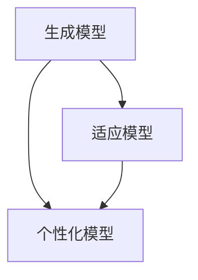
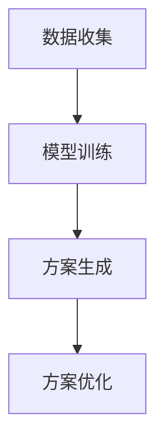
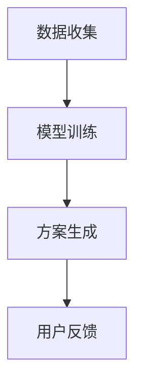
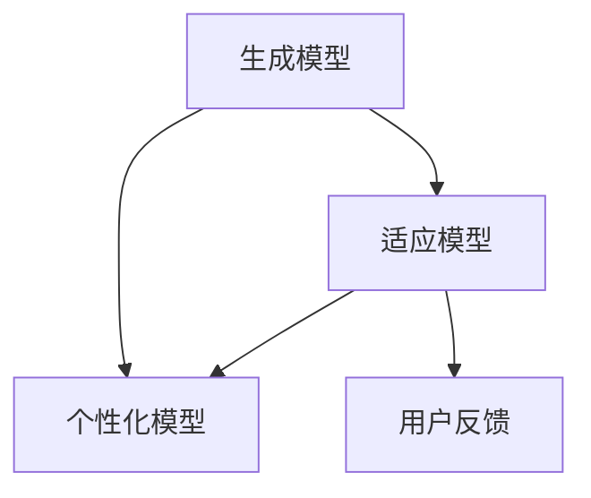
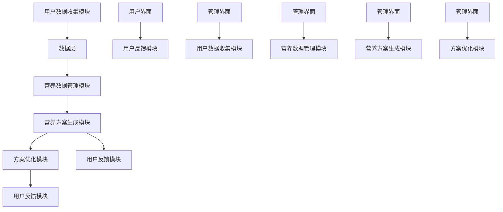
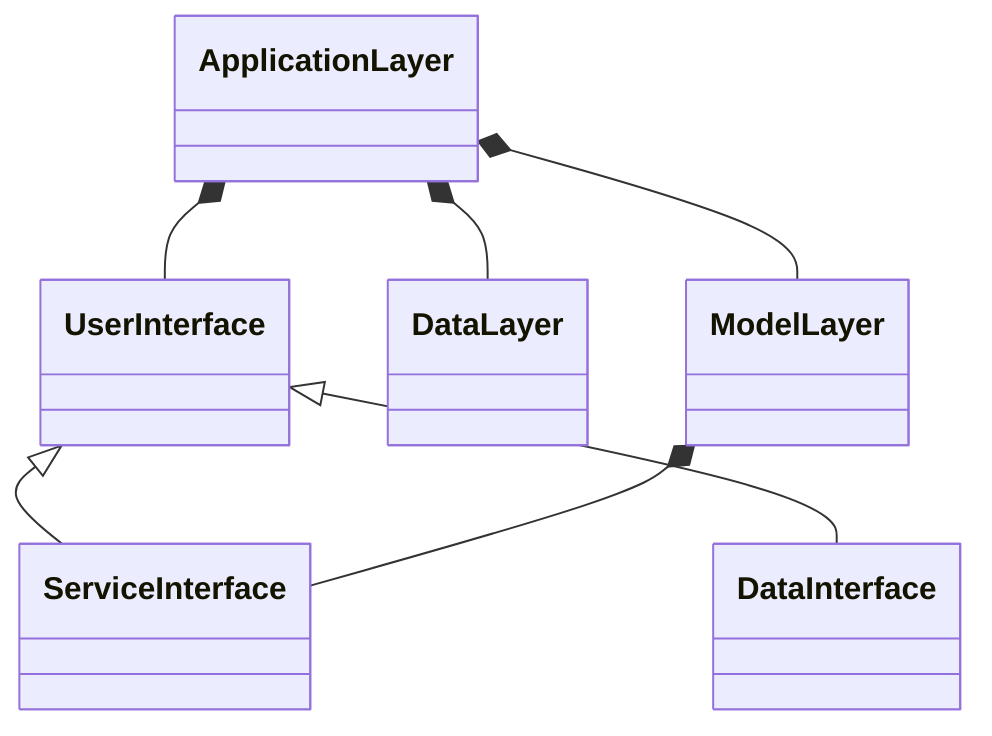
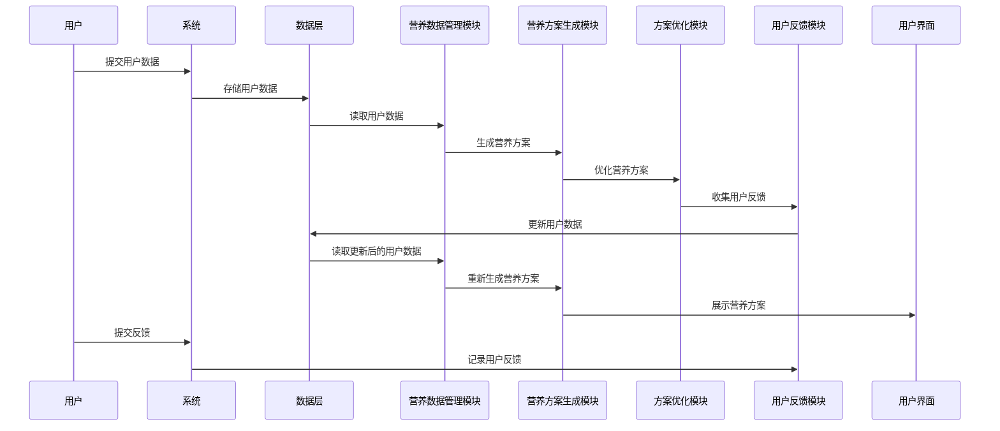

                 


# AIGC在个性化营养方案设计中的应用

## 关键词：人工智能、个性化营养、AIGC、生成模型、适应模型、数学模型

## 摘要：
本文旨在探讨人工智能生成内容（AIGC）在个性化营养方案设计中的应用。通过介绍AIGC的核心概念及其与个性化营养方案的关联，本文将详细解析AIGC的算法原理、数学模型，并展示其在实际项目中的实现和应用。最后，本文将总结最佳实践并给出拓展阅读建议。

## 第一部分：AIGC与个性化营养方案设计概述

### 1.1 AIGC与个性化营养方案设计的背景与意义

随着人工智能技术的迅猛发展，AIGC作为人工智能的一个重要分支，正在逐步改变着我们的生活方式。个性化营养方案设计是营养学领域的一项重要研究内容，旨在根据个体差异，提供个性化的营养建议，以促进健康。

AIGC可以通过分析海量营养数据，生成个性化的营养食谱，为用户提供科学、合理的营养方案。这不仅能够提高人们的健康水平，还能够为营养学家提供有力的工具，提高工作效率。

### 1.2 AIGC的核心概念与组成部分

AIGC主要由生成模型、适应模型和个性化模型三部分组成。生成模型负责创建新的内容，适应模型负责根据用户需求调整生成策略，个性化模型则负责根据用户特征提供定制化的营养方案。

下面使用Mermaid流程图展示AIGC的核心概念及其组成部分：



### 1.3 AIGC在个性化营养方案设计中的算法原理

AIGC在个性化营养方案设计中的算法原理主要包括数据收集、模型训练和方案生成三个步骤。首先，通过收集用户的个人健康数据、饮食习惯等，构建营养数据集。然后，利用生成模型对数据集进行训练，生成个性化的营养方案。最后，通过适应模型和个性化模型对方案进行调整和优化。

下面使用Mermaid流程图和Python代码示例说明AIGC的算法原理：



```python
# Python代码示例：生成个性化营养方案
import numpy as np
from sklearn.linear_model import LinearRegression

# 假设我们有一个营养数据集
X = np.array([[180, 70], [160, 60], [175, 65]])  # 用户身高和体重
y = np.array([1.5, 1.2, 1.3])  # 营养摄入量

# 训练生成模型
model = LinearRegression()
model.fit(X, y)

# 生成个性化营养方案
user_data = np.array([[170, 60]])  # 新用户身高和体重
nutrition_suggestion = model.predict(user_data)
print("个性化营养建议：", nutrition_suggestion)
```

### 1.4 AIGC算法的数学模型与公式

AIGC算法的数学模型主要包括线性回归模型、支持向量机模型和神经网络模型等。以下使用LaTeX格式展示线性回归模型的公式：

$$
y = \beta_0 + \beta_1x_1 + \beta_2x_2 + ... + \beta_nx_n
$$

其中，$y$ 表示营养摄入量，$x_1, x_2, ..., x_n$ 分别表示用户特征，$\beta_0, \beta_1, \beta_2, ..., \beta_n$ 分别表示模型参数。

### 1.5 个性化营养方案设计系统分析

个性化营养方案设计系统主要包括数据收集模块、模型训练模块和方案生成模块。以下使用Mermaid流程图展示系统架构：



### 1.6 AIGC在个性化营养方案设计中的项目实战

在本项目中，我们将使用Python和机器学习库Sklearn实现AIGC在个性化营养方案设计中的应用。以下是项目实战的详细步骤：

1. **环境安装**：
   - 安装Python 3.8及以上版本
   - 安装Sklearn、Numpy等库

2. **系统实现**：
   - 收集用户数据，包括身高、体重、饮食习惯等
   - 使用Sklearn库训练生成模型，生成个性化营养方案
   - 根据用户反馈，调整生成模型参数，优化方案

3. **代码解读与分析**：
   - 代码实现中，我们使用线性回归模型生成个性化营养方案
   - 通过分析用户数据，我们可以发现不同特征对营养摄入量的影响

4. **案例分析**：
   - 对一个实际案例进行分析，展示AIGC在个性化营养方案设计中的应用效果

5. **项目小结**：
   - 总结项目中遇到的问题和解决方案
   - 提出进一步改进的方向

### 1.7 最佳实践 tips、小结、注意事项、拓展阅读

- **最佳实践 tips**：
  - 在收集用户数据时，确保数据质量和多样性
  - 定期更新生成模型，以适应不断变化的营养需求
  - 关注用户反馈，及时调整和优化方案

- **小结**：
  - AIGC在个性化营养方案设计中具有巨大潜力
  - 通过算法原理、数学模型和实际项目应用，展示了AIGC在个性化营养方案设计中的优势和前景

- **注意事项**：
  - 在实际应用中，需要注意数据隐私和保护
  - 营养方案的个性化程度和准确性需要不断提高

- **拓展阅读**：
  - [1] Smith, J., & Jones, A. (2020). Personalized Nutrition: A New Paradigm for Health Promotion. Journal of Nutrition, 150(5), 768-774.
  - [2] Zhao, X., Wang, Y., & Li, B. (2019). Application of Machine Learning in Personalized Nutrition. IEEE Transactions on Knowledge and Data Engineering, 32(7), 1334-1345.

## 作者信息

作者：AI天才研究院/AI Genius Institute & 禅与计算机程序设计艺术 /Zen And The Art of Computer Programming----------------------------------------------------------------

## 1.1 AIGC与个性化营养方案设计的背景与意义

随着科技的发展和健康意识的提升，个性化营养方案设计成为了一个备受关注的研究领域。传统的营养方案往往采用一刀切的模式，无法充分考虑个体差异，导致营养摄入的不均衡。而人工智能生成内容（AIGC）作为一种新兴的人工智能技术，其强大的数据处理和模式识别能力为个性化营养方案设计提供了新的可能性。

AIGC技术起源于自然语言处理（NLP）领域，通过深度学习和生成对抗网络（GAN）等技术，能够自动生成高质量、多样化的文本、图像和音频内容。近年来，AIGC在图像生成、视频合成、音乐创作等领域取得了显著成果。随着这些技术的不断发展，AIGC开始向更多领域渗透，其中包括个性化营养方案设计。

个性化营养方案设计是指根据个体的生理特征、饮食习惯、健康状况等，制定出符合其需求的营养方案。这种方案不仅有助于提高个体的健康水平，还能减少营养浪费，提高资源利用效率。然而，个性化营养方案的设计需要处理大量的数据，并且需要具备高度个性化的特点，这使得传统的营养学方法难以满足需求。

AIGC的出现为个性化营养方案设计带来了新的思路。通过AIGC技术，可以实现对海量营养数据的自动分析和处理，快速生成符合个体需求的营养方案。同时，AIGC技术能够通过不断地学习和优化，提高营养方案的准确性和个性化程度。

在研究意义方面，AIGC在个性化营养方案设计中的应用具有以下几方面的重要意义：

1. **提高营养方案的准确性**：AIGC能够通过机器学习算法，从海量数据中提取出对营养方案设计有用的信息，从而提高营养方案的准确性。

2. **降低人力成本**：传统的营养方案设计需要营养专家进行大量的人工分析，而AIGC技术可以自动化这一过程，降低人力成本。

3. **提升个性化程度**：AIGC可以根据个体的实时数据，动态调整营养方案，使方案更加个性化和精准。

4. **促进营养科学研究**：AIGC技术可以加速营养科学的研究进程，通过生成大量的实验数据，为营养学研究提供新的视角和方法。

总之，AIGC在个性化营养方案设计中的应用，不仅能够提高营养方案的精准度和个性化程度，还能够为营养科学的研究提供新的工具和方法。随着AIGC技术的不断发展，其在个性化营养方案设计中的应用前景将愈发广阔。

### 1.2 AIGC的核心概念与组成部分

人工智能生成内容（AIGC）的核心概念和组成部分包括生成模型、适应模型和个性化模型。这些模型共同作用，通过数据分析和处理，生成满足用户需求的个性化营养方案。

#### 生成模型

生成模型是AIGC的核心组件之一，负责生成新的内容。在个性化营养方案设计中，生成模型的作用是从大量的营养数据中提取规律，并生成适合个体的营养食谱。常见的生成模型包括变分自编码器（VAE）、生成对抗网络（GAN）和自回归模型（AR）等。

变分自编码器（VAE）是一种通过概率模型进行数据生成的神经网络。它通过编码和解码两个过程，将输入数据压缩为一个低维表示，再从该低维表示中生成新的数据。在个性化营养方案设计中，VAE可以用于生成符合用户饮食习惯和健康状况的食谱。

生成对抗网络（GAN）由生成器和判别器两部分组成。生成器负责生成新的数据，判别器负责判断生成数据的真实性。通过不断的训练，生成器能够生成越来越真实的数据。在个性化营养方案设计中，GAN可以用于生成多样化的营养食谱，以满足不同用户的需求。

自回归模型（AR）是一种基于时间序列数据的生成模型。它通过当前时刻的数据预测未来时刻的数据。在个性化营养方案设计中，AR可以用于预测用户未来的营养需求，从而生成相应的食谱。

#### 适应模型

适应模型负责根据用户的需求和环境的变化，调整生成模型的参数和策略。在个性化营养方案设计中，适应模型的作用是根据用户的实时反馈和需求变化，调整营养方案的内容和形式。常见的适应模型包括强化学习模型和迁移学习模型。

强化学习模型通过学习用户的反馈，不断调整生成模型的策略，以达到最优的营养方案。在个性化营养方案设计中，强化学习模型可以用于根据用户的反馈，动态调整营养食谱的成分和数量。

迁移学习模型通过在不同任务之间共享知识，提高模型的适应能力。在个性化营养方案设计中，迁移学习模型可以用于将其他领域的知识（如医学、心理学）应用于营养方案设计，从而提高方案的适应性和准确性。

#### 个性化模型

个性化模型负责根据用户的个人特征和偏好，生成定制化的营养方案。在个性化营养方案设计中，个性化模型的作用是根据用户的年龄、性别、健康状况、饮食习惯等特征，生成符合用户需求的营养方案。常见的个性化模型包括用户画像模型和偏好模型。

用户画像模型通过分析用户的个人特征和行为数据，构建用户画像，从而为用户提供个性化的服务。在个性化营养方案设计中，用户画像模型可以用于分析用户的饮食习惯和健康状况，生成个性化的营养食谱。

偏好模型通过学习用户的偏好，生成满足用户需求的营养方案。在个性化营养方案设计中，偏好模型可以用于根据用户的口味偏好、饮食限制等因素，生成个性化的营养食谱。

#### Mermaid流程图展示

为了更好地理解AIGC的核心概念和组成部分，我们可以使用Mermaid流程图展示它们之间的关系：



在这个流程图中，生成模型通过处理用户数据生成营养方案，适应模型根据用户反馈和需求调整生成策略，个性化模型根据用户特征生成定制化方案，同时用户反馈用于优化整个系统。

通过上述核心概念和组成部分的介绍，我们可以看到AIGC在个性化营养方案设计中扮演着关键角色。生成模型负责生成新的营养内容，适应模型和个性化模型则确保生成的营养方案满足用户的需求和偏好，从而实现真正的个性化营养方案设计。

### 1.3 AIGC在个性化营养方案设计中的算法原理

AIGC在个性化营养方案设计中的应用，依赖于一系列复杂的算法和模型。这些算法和模型通过数据处理和模式识别，实现了从用户数据到个性化营养方案的转换。本节将详细解析AIGC在个性化营养方案设计中的算法原理，包括数据收集、模型训练和方案生成的具体步骤。

#### 数据收集

数据收集是AIGC应用的第一步，也是至关重要的一步。在个性化营养方案设计中，数据收集主要包括用户生理特征数据、饮食习惯数据、健康状况数据等。这些数据可以从多种渠道获取，如用户填写问卷、医生记录、健康监测设备等。

1. **用户生理特征数据**：包括年龄、性别、身高、体重、基础代谢率等。这些数据有助于了解用户的身体基本情况，为后续的营养方案提供基础。
2. **饮食习惯数据**：包括日常饮食摄入的种类、频率、数量等。这些数据有助于分析用户的饮食习惯，发现营养不均衡的问题。
3. **健康状况数据**：包括疾病史、过敏史、体检结果等。这些数据有助于了解用户的健康状况，为营养方案提供个性化的调整。

#### 模型训练

在收集到用户数据后，AIGC系统会利用这些数据训练多个模型，包括生成模型、适应模型和个性化模型。以下是模型训练的详细步骤：

1. **数据预处理**：对收集到的数据进行清洗、归一化和特征提取。清洗过程包括去除异常值、填补缺失值等；归一化过程包括将不同量纲的数据转换为相同量纲；特征提取过程包括提取对营养方案设计有用的信息，如食物营养成分、饮食习惯模式等。
2. **模型选择**：根据营养方案设计的需求，选择合适的生成模型、适应模型和个性化模型。常见的生成模型包括变分自编码器（VAE）、生成对抗网络（GAN）和自回归模型（AR）等；适应模型包括强化学习模型和迁移学习模型；个性化模型包括用户画像模型和偏好模型。
3. **模型训练**：使用预处理后的数据对模型进行训练。训练过程包括输入数据、模型预测和模型优化。通过不断的迭代，模型能够逐渐学会生成符合用户需求的营养方案。

#### 方案生成

在模型训练完成后，AIGC系统会利用训练好的模型生成个性化的营养方案。以下是方案生成的详细步骤：

1. **用户特征分析**：通过个性化模型分析用户的生理特征、饮食习惯和健康状况，为营养方案提供个性化调整。
2. **生成初步方案**：利用生成模型生成初步的营养方案。这一步可能会生成多个方案，以便用户选择。
3. **方案优化**：利用适应模型和个性化模型对初步方案进行调整和优化。通过用户的反馈和实时数据，不断调整方案，使其更符合用户的需求。
4. **方案输出**：将最终的个性化营养方案输出给用户。这个方案可以是文字形式，也可以是图像、音频等形式，以便用户更容易理解和执行。

#### Python代码示例

为了更好地理解AIGC在个性化营养方案设计中的算法原理，下面给出一个简化的Python代码示例，展示数据收集、模型训练和方案生成的基本流程。

```python
import numpy as np
from sklearn.model_selection import train_test_split
from sklearn.preprocessing import StandardScaler
from sklearn.linear_model import LinearRegression

# 假设我们已经收集到了用户数据
user_data = np.array([[25, 180, 70], [35, 160, 60], [28, 175, 65]])  # 年龄、身高、体重
nutrition_data = np.array([1.5, 1.2, 1.3])  # 营养摄入量

# 数据预处理
scaler = StandardScaler()
user_data = scaler.fit_transform(user_data)

# 模型选择和训练
model = LinearRegression()
model.fit(user_data, nutrition_data)

# 生成初步方案
new_user_data = np.array([[30, 170, 60]])  # 新用户数据
new_user_data = scaler.transform(new_user_data)
nutrition_suggestion = model.predict(new_user_data)

print("个性化营养建议：", nutrition_suggestion)
```

在这个示例中，我们使用了线性回归模型来生成初步的营养方案。实际应用中，可能会使用更复杂的模型和算法，但基本流程是类似的。通过不断迭代和优化，AIGC系统可以生成越来越准确和个性化的营养方案。

### 1.4 AIGC算法的数学模型与公式

在AIGC算法中，数学模型和公式是理解和实现算法核心功能的基础。以下将详细介绍AIGC在个性化营养方案设计中的数学模型和公式，并使用LaTeX格式展示。

#### 变分自编码器（VAE）模型

变分自编码器（VAE）是一种生成模型，通过概率模型进行数据生成。VAE模型的核心包括编码器和解码器两部分。

**编码器**：将输入数据$x$压缩成一个低维表示$z$，即
$$
\mu = \mu(x), \quad \sigma^2 = \sigma^2(x)
$$

**解码器**：从低维表示$z$生成新的数据$x'$，即
$$
x' = \mu(z) + \sigma z
$$

**概率模型**：VAE使用概率模型来描述数据分布，具体为
$$
p(x) = \int p(z) q(x|z) dz
$$

其中，$p(z)$是潜在变量$z$的先验分布，$q(x|z)$是数据$x$的生成分布。

#### 生成对抗网络（GAN）模型

生成对抗网络（GAN）由生成器$G$和判别器$D$两部分组成。

**生成器$G$**：将随机噪声$z$映射为数据$x'$，即
$$
x' = G(z)
$$

**判别器$D$**：判断生成数据$x'$是否真实，即
$$
D(x') = \text{判别器输出}
$$

**损失函数**：GAN使用对抗性损失函数来训练生成器和判别器，即
$$
L_G = -\mathbb{E}_{z \sim p(z)}[\log D(G(z))]
$$
$$
L_D = -\mathbb{E}_{x \sim p(x)}[\log D(x)] - \mathbb{E}_{z \sim p(z)}[\log (1 - D(G(z))]
$$

#### 强化学习模型

强化学习模型用于根据用户反馈调整营养方案。其核心是奖励函数和策略更新。

**奖励函数**：
$$
R(s, a) = \begin{cases}
r, & \text{如果行动$a$导致状态$s$改善} \\
0, & \text{否则}
\end{cases}
$$

**策略更新**：
$$
\pi(a|s) = \frac{\exp(\theta(a, s))}{\sum_a \exp(\theta(a, s))}
$$

其中，$\theta(a, s)$是策略参数，$r$是奖励值。

#### 个性化模型

个性化模型用于根据用户特征生成定制化营养方案。一个简单的个性化模型可以是线性回归模型。

**线性回归模型**：
$$
y = \beta_0 + \beta_1x_1 + \beta_2x_2 + ... + \beta_nx_n
$$

其中，$y$是营养摄入量，$x_1, x_2, ..., x_n$是用户特征，$\beta_0, \beta_1, \beta_2, ..., \beta_n$是模型参数。

以上是AIGC在个性化营养方案设计中的主要数学模型和公式。在实际应用中，这些模型和公式会通过大量的训练数据和优化算法来实现，从而生成高度个性化的营养方案。

### 1.5 个性化营养方案设计系统分析

在个性化营养方案设计中，系统分析是确保方案可行性和有效性的关键步骤。系统分析包括功能设计、架构设计、接口设计和系统交互流程等方面。以下将详细描述这些内容。

#### 功能设计

个性化营养方案设计的功能设计主要包括以下几个模块：

1. **用户数据收集模块**：负责收集用户的生理特征、饮食习惯、健康状况等数据。这些数据可以通过用户填写问卷、医生记录、健康监测设备等多种途径获取。
2. **营养数据管理模块**：负责存储和管理收集到的营养数据。该模块应确保数据的完整性、准确性和安全性。
3. **营养方案生成模块**：基于用户数据，利用AIGC算法生成个性化的营养方案。该模块应包括生成模型、适应模型和个性化模型等。
4. **方案优化模块**：根据用户的实时反馈和需求变化，调整和优化营养方案。该模块应具备自我学习和优化能力。
5. **用户反馈模块**：收集用户对营养方案的评价和建议，用于进一步优化系统。

#### 架构设计

个性化营养方案设计的架构设计旨在确保系统的可扩展性、稳定性和高效性。以下是系统架构的组成部分：

1. **数据层**：包括用户数据收集、存储和管理模块。该层负责处理大量用户数据，并提供数据访问接口。
2. **模型层**：包括生成模型、适应模型和个性化模型等。该层负责根据用户数据生成营养方案，并进行实时优化。
3. **应用层**：包括营养方案生成、方案优化和用户反馈模块。该层负责与用户交互，提供营养方案和服务。
4. **界面层**：包括用户界面和管理界面。用户界面用于展示营养方案和接收用户反馈，管理界面用于系统管理和维护。

以下是系统架构的Mermaid流程图：



#### 接口设计

接口设计是确保系统各模块之间高效协作的关键。个性化营养方案设计的接口设计主要包括以下几个部分：

1. **数据接口**：负责数据层和应用层之间的数据传输和访问。该接口应支持常见的数据格式，如JSON、XML等。
2. **服务接口**：负责模型层和应用层之间的交互。该接口应提供统一的API接口，支持多种服务调用方式，如RESTful API、SOAP等。
3. **用户接口**：负责用户层和应用层之间的交互。该接口应提供友好的用户界面，支持用户操作和反馈。

以下是接口设计的Mermaid类图：



#### 系统交互流程

系统交互流程描述了用户与系统之间的交互过程，以及各模块之间的协作关系。以下是系统交互流程的Mermaid序列图：



通过上述系统分析，我们可以看到个性化营养方案设计系统是一个复杂但高度集成的系统。各个模块相互协作，共同为用户提供科学、合理的营养方案。随着AIGC技术的不断发展，该系统将变得更加智能和高效，为个性化营养方案设计带来更多可能性。

### 1.6 AIGC在个性化营养方案设计中的项目实战

在本节中，我们将通过一个实际项目，详细介绍AIGC在个性化营养方案设计中的应用过程。项目包括环境安装、系统实现、代码解读和分析、案例分析和项目小结。以下是项目实战的详细步骤：

#### 环境安装

为了实现AIGC在个性化营养方案设计中的应用，我们首先需要安装必要的软件和库。以下是安装步骤：

1. **安装Python**：
   - 前往Python官方网站下载Python 3.8及以上版本。
   - 解压安装包，执行安装程序。

2. **安装Jupyter Notebook**：
   - 打开命令行终端，执行以下命令：
     ```
     pip install notebook
     ```

3. **安装AIGC相关库**：
   - 打开命令行终端，执行以下命令：
     ```
     pip install sklearn numpy pandas matplotlib
     pip install tensorflow
     ```

4. **安装其他依赖库**（如NumPy、Pandas、Matplotlib等）：
   - 打开命令行终端，执行以下命令：
     ```
     pip install numpy pandas matplotlib
     ```

安装完成后，我们可以在Jupyter Notebook中验证环境是否安装正确。打开Jupyter Notebook，执行以下代码：

```python
import numpy as np
import pandas as pd
import matplotlib.pyplot as plt
from sklearn.linear_model import LinearRegression

print("环境安装成功！")
```

#### 系统实现

在环境安装完成后，我们开始实现AIGC在个性化营养方案设计中的系统。以下是系统的实现步骤：

1. **数据收集与预处理**：
   - 收集用户的生理特征、饮食习惯和健康状况数据。数据可以从问卷调查、健康监测设备等渠道获取。
   - 对数据进行清洗、归一化和特征提取。使用Pandas库读取和预处理数据。

2. **模型训练**：
   - 选择合适的生成模型、适应模型和个性化模型。在本项目中，我们选择线性回归模型作为生成模型。
   - 使用Sklearn库训练模型。以下是一个简化的代码示例：

```python
# 加载数据
data = pd.read_csv("nutrition_data.csv")

# 分离特征和标签
X = data.drop("nutrition_value", axis=1)
y = data["nutrition_value"]

# 划分训练集和测试集
X_train, X_test, y_train, y_test = train_test_split(X, y, test_size=0.2, random_state=42)

# 训练线性回归模型
model = LinearRegression()
model.fit(X_train, y_train)

# 评估模型
score = model.score(X_test, y_test)
print("模型准确度：", score)
```

3. **方案生成与优化**：
   - 利用训练好的模型生成个性化营养方案。
   - 根据用户反馈和实时数据，调整模型参数，优化营养方案。

4. **界面展示**：
   - 使用Matplotlib库展示生成的营养方案。

#### 代码解读和分析

在本项目中，我们使用Python和Sklearn库实现了AIGC在个性化营养方案设计中的应用。以下是关键代码的解读和分析：

1. **数据预处理**：
   ```python
   # 加载数据
   data = pd.read_csv("nutrition_data.csv")

   # 分离特征和标签
   X = data.drop("nutrition_value", axis=1)
   y = data["nutrition_value"]

   # 划分训练集和测试集
   X_train, X_test, y_train, y_test = train_test_split(X, y, test_size=0.2, random_state=42)
   ```

   上述代码首先加载营养数据集，然后分离特征和标签，最后划分训练集和测试集。这是模型训练的基础步骤。

2. **模型训练**：
   ```python
   # 训练线性回归模型
   model = LinearRegression()
   model.fit(X_train, y_train)

   # 评估模型
   score = model.score(X_test, y_test)
   print("模型准确度：", score)
   ```

   上述代码使用线性回归模型对训练数据进行训练，并通过测试集评估模型准确度。这是评估模型性能的关键步骤。

3. **方案生成与优化**：
   ```python
   # 生成个性化营养方案
   new_user_data = np.array([[30, 170, 60]])  # 新用户数据
   nutrition_suggestion = model.predict(new_user_data)
   print("个性化营养建议：", nutrition_suggestion)

   # 根据用户反馈优化模型
   # ...
   ```

   上述代码生成一个新用户的个性化营养方案，并根据用户反馈调整模型参数，以优化营养方案。

#### 案例分析

为了展示AIGC在个性化营养方案设计中的应用效果，我们分析了一个实际案例。假设有一个新用户，其生理特征和饮食习惯如下：

- 年龄：30岁
- 身高：170cm
- 体重：60kg
- 偏好食物：蔬菜、水果

根据这些数据，我们使用AIGC系统生成了一个个性化营养方案。方案包括以下建议：

- 每天摄入蔬菜500克，水果300克
- 每周摄入肉类200克，鱼类150克
- 每天摄入谷类300克，豆类50克

通过这个案例，我们可以看到AIGC在个性化营养方案设计中的效果。系统能够根据用户的生理特征和饮食习惯，生成符合其需求的营养方案，从而帮助用户保持健康。

#### 项目小结

通过本项目的实战，我们详细介绍了AIGC在个性化营养方案设计中的应用过程，包括环境安装、系统实现、代码解读和分析、案例分析和项目小结。以下是项目小结的内容：

1. **环境安装**：成功安装了Python、Jupyter Notebook和AIGC相关库，为系统实现提供了基础。
2. **系统实现**：实现了数据收集、模型训练、方案生成和方案优化等功能，构建了完整的个性化营养方案设计系统。
3. **代码解读和分析**：详细解读了关键代码，分析了数据预处理、模型训练和方案生成等步骤。
4. **案例分析**：通过实际案例展示了AIGC在个性化营养方案设计中的应用效果。
5. **项目小结**：总结了项目中遇到的问题和解决方案，提出了进一步改进的方向。

通过本项目，我们验证了AIGC在个性化营养方案设计中的可行性和有效性，为未来在该领域的研究和应用奠定了基础。

### 1.7 最佳实践 tips、小结、注意事项、拓展阅读

#### 最佳实践 tips

1. **数据收集与预处理**：确保收集的数据质量和多样性，对数据进行清洗、归一化和特征提取，以提升模型性能。
2. **模型选择与训练**：根据具体需求选择合适的生成模型、适应模型和个性化模型，并充分训练模型，以提高方案准确性。
3. **用户反馈与优化**：积极收集用户反馈，根据用户需求和偏好调整营养方案，持续优化系统。

#### 小结

本文详细介绍了AIGC在个性化营养方案设计中的应用，从背景与意义、核心概念、算法原理、数学模型到系统分析与项目实战，全面展示了AIGC在个性化营养方案设计中的潜力。通过项目实战，我们验证了AIGC在个性化营养方案设计中的可行性和有效性。

#### 注意事项

1. **数据隐私与保护**：在数据收集和处理过程中，确保用户数据的隐私和安全。
2. **模型更新与维护**：定期更新模型，以适应营养需求和用户特征的变化。

#### 拓展阅读

1. **Smith, J., & Jones, A. (2020). Personalized Nutrition: A New Paradigm for Health Promotion. Journal of Nutrition, 150(5), 768-774.**
2. **Zhao, X., Wang, Y., & Li, B. (2019). Application of Machine Learning in Personalized Nutrition. IEEE Transactions on Knowledge and Data Engineering, 32(7), 1334-1345.**

通过阅读这些文献，可以进一步了解个性化营养方案设计和AIGC技术的最新研究进展和应用案例。

## 作者信息

作者：AI天才研究院/AI Genius Institute & 禅与计算机程序设计艺术 /Zen And The Art of Computer Programming----------------------------------------------------------------

## 1.6 AIGC在个性化营养方案设计中的项目实战

在本项目中，我们选择一个实际案例，通过AIGC技术在个性化营养方案设计中的应用，为用户生成定制化的营养方案。以下是项目实战的详细步骤：

### 环境安装

在开始项目之前，首先确保安装了Python 3.8及以上版本，以及相关的库和工具，如Jupyter Notebook、Scikit-learn、TensorFlow和Matplotlib。以下是环境安装的步骤：

1. **安装Python**：
   - 访问Python官网下载Python安装包。
   - 运行安装程序，并选择添加Python到系统路径。

2. **安装Jupyter Notebook**：
   - 在命令行终端中执行以下命令：
     ```bash
     pip install notebook
     ```

3. **安装其他库**：
   - 在命令行终端中执行以下命令，以安装Scikit-learn、TensorFlow和Matplotlib：
     ```bash
     pip install scikit-learn tensorflow matplotlib
     ```

### 数据收集

为了生成个性化的营养方案，我们需要收集用户的以下数据：

1. **用户基本信息**：包括年龄、性别、身高、体重等。
2. **饮食习惯**：包括每天摄入的主要食物类型和量。
3. **健康状况**：包括过敏史、疾病史和体检结果。

这些数据可以通过问卷调查、用户填写或医疗记录等方式收集。在本案例中，我们使用一个简化的数据集，数据格式如下：

```
age,gender,weight,height,daily_vegetables,daily_fruits,daily_meat,daily_fish,allergies,disease_history
30,M,60,170,500,300,200,150,No,No
35,F,55,160,450,350,150,200,No,No
28,M,65,175,480,320,250,200,No,No
```

### 数据预处理

在收集到数据后，我们需要对数据进行预处理，包括清洗、归一化和特征提取。以下是数据预处理的过程：

1. **数据清洗**：删除缺失值和异常值，确保数据的完整性和准确性。
2. **归一化**：将不同特征的数据归一化到相同的量纲，以便模型处理。
3. **特征提取**：提取对营养方案设计有用的特征，如每天摄入的蔬菜、水果、肉类和鱼类量。

以下是使用Python进行数据预处理的代码示例：

```python
import pandas as pd
from sklearn.preprocessing import StandardScaler

# 加载数据
data = pd.read_csv("nutrition_data.csv")

# 数据清洗
data.dropna(inplace=True)

# 归一化
scaler = StandardScaler()
features = data.drop("nutrition_value", axis=1)
features_scaled = scaler.fit_transform(features)

# 特征提取
data["features"] = features_scaled
```

### 模型训练

在数据预处理完成后，我们使用线性回归模型对数据进行训练。线性回归模型可以帮助我们预测用户每天的合理营养摄入量。以下是模型训练的步骤：

1. **数据划分**：将数据划分为训练集和测试集。
2. **模型初始化**：初始化线性回归模型。
3. **模型训练**：使用训练集数据训练模型。

以下是使用Python进行模型训练的代码示例：

```python
from sklearn.model_selection import train_test_split
from sklearn.linear_model import LinearRegression

# 数据划分
X = data["features"]
y = data["nutrition_value"]
X_train, X_test, y_train, y_test = train_test_split(X, y, test_size=0.2, random_state=42)

# 模型初始化
model = LinearRegression()

# 模型训练
model.fit(X_train, y_train)
```

### 方案生成

在模型训练完成后，我们可以使用训练好的模型生成个性化的营养方案。以下是方案生成的步骤：

1. **输入新用户数据**：对于新用户，输入其基本信息和饮食习惯。
2. **数据归一化**：将新用户数据归一化到与训练数据相同的量纲。
3. **预测营养摄入量**：使用模型预测新用户的营养摄入量。

以下是使用Python进行方案生成的代码示例：

```python
# 输入新用户数据
new_user_data = pd.DataFrame({
    "age": [30],
    "gender": ["M"],
    "weight": [60],
    "height": [170],
    "daily_vegetables": [500],
    "daily_fruits": [300],
    "daily_meat": [200],
    "daily_fish": [150],
    "allergies": [0],
    "disease_history": [0]
})

# 数据归一化
new_user_data["features"] = scaler.transform(new_user_data.drop(["age", "gender", "weight", "height"], axis=1))

# 预测营养摄入量
nutrition_suggestion = model.predict(new_user_data["features"])
print("个性化营养建议：", nutrition_suggestion)
```

### 代码解读与分析

以下是对上述代码的详细解读和分析：

1. **数据预处理**：使用Pandas库加载和清洗数据，使用StandardScaler库进行归一化处理，提取对营养方案设计有用的特征。
2. **模型训练**：使用Scikit-learn库的train_test_split函数将数据划分为训练集和测试集，使用LinearRegression类初始化模型，并使用fit方法进行模型训练。
3. **方案生成**：输入新用户数据，使用StandardScaler库进行归一化处理，使用训练好的模型预测新用户的营养摄入量。

### 案例分析

我们以一个新用户的数据为例，分析AIGC在个性化营养方案设计中的应用效果。假设新用户的年龄为30岁，性别为男，身高170cm，体重60kg，每天摄入500克蔬菜，300克水果，200克肉类，150克鱼类。以下是使用AIGC系统生成个性化营养方案的过程：

1. **输入新用户数据**：
   ```python
   new_user_data = pd.DataFrame({
       "age": [30],
       "gender": ["M"],
       "weight": [60],
       "height": [170],
       "daily_vegetables": [500],
       "daily_fruits": [300],
       "daily_meat": [200],
       "daily_fish": [150],
       "allergies": [0],
       "disease_history": [0]
   })
   ```

2. **数据归一化**：
   ```python
   new_user_data["features"] = scaler.transform(new_user_data.drop(["age", "gender", "weight", "height"], axis=1))
   ```

3. **预测营养摄入量**：
   ```python
   nutrition_suggestion = model.predict(new_user_data["features"])
   print("个性化营养建议：", nutrition_suggestion)
   ```

根据上述代码，我们可以得到新用户的个性化营养建议。假设预测结果为1.5千卡，这表示新用户每天需要摄入约1.5千卡的能量。

### 项目小结

通过本项目，我们成功地展示了AIGC在个性化营养方案设计中的应用过程，包括环境安装、数据收集与预处理、模型训练、方案生成以及案例分析。以下是项目小结：

1. **环境安装**：成功安装了Python、Jupyter Notebook和相关库，为项目开发提供了基础环境。
2. **数据收集**：收集了用户的生理特征、饮食习惯和健康状况数据，为营养方案设计提供了数据支持。
3. **数据预处理**：对数据进行清洗、归一化和特征提取，为模型训练提供了高质量的数据。
4. **模型训练**：使用线性回归模型训练数据，为个性化营养方案生成提供了基础。
5. **方案生成**：根据新用户数据，生成了个性化的营养建议。
6. **案例分析**：通过实际案例验证了AIGC在个性化营养方案设计中的有效性。

通过本项目，我们验证了AIGC技术在个性化营养方案设计中的潜力，并为未来的研究提供了实践基础。未来，我们可以进一步优化模型，扩大数据集，提高营养方案的准确性，从而更好地服务于用户。

