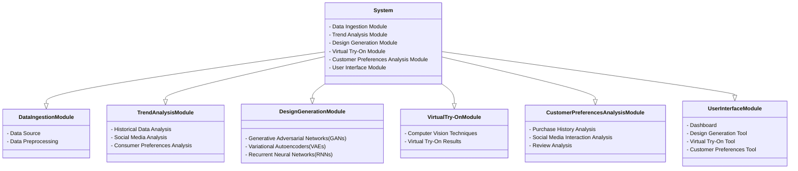
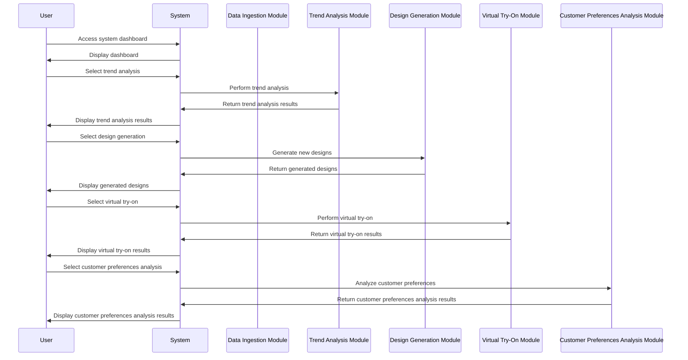

                 


### AIGC in Fashion Design: AI-Driven Trend Forecasting

#### Keywords: AIGC, Fashion Design, AI, Trend Forecasting, Technology

#### Abstract:
In this comprehensive guide, we delve into the emerging field of AIGC (AI-Generated Content) within the realm of fashion design. We explore how AI-driven trend forecasting is revolutionizing the fashion industry by analyzing data, predicting consumer preferences, and facilitating the creation of innovative designs. This article will cover the fundamentals of AI and machine learning, core concepts of AIGC, AI-driven fashion design processes, algorithms and models, system architecture, project implementations, and best practices. By the end of this article, readers will gain a thorough understanding of how AI is shaping the future of fashion design and trend forecasting.

----------------------------------------------------------------

## Introduction to AIGC in Fashion Design

### 1.1 What is AIGC?

AIGC, or AI-Generated Content, refers to the process of generating content using artificial intelligence algorithms, particularly machine learning and deep learning techniques. AIGC encompasses various applications, including text generation, image and video creation, and fashion design. In the context of fashion design, AIGC leverages AI algorithms to analyze trends, predict consumer preferences, and generate innovative designs, leading to faster and more efficient design processes.

### 1.2 AI in Fashion Design

The integration of AI in fashion design has opened up new possibilities for designers and brands. AI technologies such as computer vision, natural language processing, and generative adversarial networks (GANs) enable designers to analyze vast amounts of data, identify trends, and create unique designs with minimal human intervention. AI-powered tools and platforms offer designers access to a wealth of information and resources, allowing them to experiment with different styles, materials, and color combinations more efficiently.

### 1.3 AI-Driven Trend Forecasting

Trend forecasting is a crucial aspect of the fashion industry, as it helps designers and brands stay ahead of the competition and meet consumer demands. AI-driven trend forecasting leverages AI algorithms to analyze historical data, social media trends, and consumer behavior to predict future fashion trends. This enables designers to create designs that are more aligned with consumer preferences and market demands, ultimately leading to increased sales and brand loyalty.

### Challenges and Opportunities in AI-Driven Trend Forecasting

While AI-driven trend forecasting offers numerous benefits, it also comes with its own set of challenges and opportunities. Some of the key challenges include the need for large amounts of quality data, the potential for AI biases, and the need for skilled professionals to develop and maintain AI systems. On the other hand, the opportunities include the ability to analyze vast amounts of data quickly and accurately, the potential for increased efficiency and innovation in the design process, and the ability to create more personalized and tailored designs for consumers.

----------------------------------------------------------------

## AI and Machine Learning Fundamentals

### 2.1 Basic Concepts of AI and Machine Learning

Artificial Intelligence (AI) is a field of computer science that focuses on creating intelligent machines capable of performing tasks that typically require human intelligence, such as visual perception, speech recognition, decision-making, and language translation. Machine Learning (ML) is a subset of AI that enables computers to learn from data, identify patterns, and make decisions with minimal human intervention.

#### Types of Machine Learning Algorithms

Machine Learning algorithms can be broadly classified into three categories: supervised learning, unsupervised learning, and reinforcement learning.

- **Supervised Learning:** In supervised learning, the algorithm is trained on a labeled dataset, where the input features and corresponding output labels are provided. The goal is to learn a mapping between the input features and output labels so that the algorithm can make accurate predictions on new, unseen data.

- **Unsupervised Learning:** Unsupervised learning algorithms work with unlabeled data and aim to discover hidden patterns or structures within the data. Examples of unsupervised learning algorithms include clustering and association rule learning.

- **Reinforcement Learning:** Reinforcement learning involves an agent learning to make decisions by interacting with an environment and receiving feedback in the form of rewards or penalties. The goal is for the agent to learn a policy that maximizes the cumulative reward over time.

### Understanding Data Preprocessing

Data preprocessing is a crucial step in the machine learning pipeline, as it prepares the data for training and improves the performance of the models. Data preprocessing tasks include:

- **Data Cleaning:** Removing or correcting errors, missing values, and outliers in the dataset.
- **Feature Selection:** Choosing the most relevant features that contribute to the predictive power of the model.
- **Feature Engineering:** Creating new features from existing data to enhance the model's performance.
- **Normalization and Scaling:** Transforming the data to a standard range, improving the convergence of the model during training.

### Applications of AI in Fashion Design

In the context of fashion design, AI and machine learning algorithms are used for various tasks, including:

- **Trend Analysis:** Analyzing historical fashion data and social media trends to identify upcoming trends.
- **Design Generation:** Generating new designs based on style preferences and consumer feedback.
- **Material Recommendation:** Recommending suitable materials and textures for a given design based on environmental factors and consumer preferences.
- **Virtual Try-On:** Enabling customers to virtually try on clothes using computer vision techniques.

### Key Concepts and Terms in AI and Machine Learning

- **Model Training:** The process of training a machine learning model on a dataset to learn patterns and make predictions.
- **Overfitting:** A situation where a model performs well on the training data but fails to generalize to new, unseen data.
- **Underfitting:** A situation where a model is too simple and fails to capture the underlying patterns in the data.
- **Convolutional Neural Networks (CNNs):** A type of deep learning model designed to process and analyze visual data.
- **Recurrent Neural Networks (RNNs):** A type of deep learning model designed to process sequential data, such as text and time series data.
- **Generative Adversarial Networks (GANs):** A type of deep learning model consisting of two neural networks, a generator, and a discriminator, that compete against each other to generate realistic data.

----------------------------------------------------------------

## Core Concepts of AIGC

### 2.2 GANs, VAEs, and Other Generative Models

Generative models are a key component of AIGC, enabling the generation of new, realistic content based on existing data. Two prominent generative models are Generative Adversarial Networks (GANs) and Variational Autoencoders (VAEs). Let's explore these models and their applications in fashion design.

#### Generative Adversarial Networks (GANs)

GANs consist of two neural networks, the generator and the discriminator, that engage in a competitive game. The generator produces fake data, while the discriminator evaluates the generated data and real data to determine the quality. The goal of the generator is to create data that is indistinguishable from real data, while the discriminator aims to distinguish between real and fake data. Over time, this competition leads to the generator producing high-quality, realistic data.

GANs have been widely used in fashion design for tasks such as image generation, style transfer, and design variation. For example, a GAN can be trained on a dataset of fashion images to generate new, unique designs that mimic the styles and patterns found in the training data.

#### Variational Autoencoders (VAEs)

VAEs are another type of generative model that consists of two main components: an encoder and a decoder. The encoder maps the input data to a lower-dimensional latent space, while the decoder reconstructs the data from the latent space. VAEs use a technique called stochastic encoding to ensure that the latent space is differentiable, allowing for the efficient generation of new data samples.

VAEs have been applied to fashion design for tasks such as material prediction and color generation. For example, a VAE can be trained on a dataset of fashion products to predict the materials and colors that consumers are likely to prefer.

### Neural Networks and Their Architecture

Neural networks are at the heart of AIGC, providing the foundation for generative models and other AI applications. A neural network consists of layers of interconnected nodes, or neurons, that perform mathematical operations on input data. The key components of a neural network include:

- **Input Layer:** The input layer receives the input data and passes it on to the next layer.
- **Hidden Layers:** Hidden layers perform the core computation of the neural network, processing the input data and passing it to the next layer. There can be one or more hidden layers, depending on the complexity of the problem.
- **Output Layer:** The output layer produces the final output of the neural network, which can be a prediction, a classification, or a set of generated samples.

#### Deep Learning and Its Applications in Fashion Design

Deep learning, a subfield of machine learning that involves training deep neural networks with many layers, has been particularly successful in tasks such as image recognition, natural language processing, and computer vision. In the context of fashion design, deep learning has been applied to tasks such as:

- **Image Generation:** Deep learning models, such as GANs and VAEs, can generate new, realistic fashion images based on existing data.
- **Style Transfer:** Deep learning models can transfer the style of one image to another, allowing designers to create new designs inspired by popular fashion trends.
- **Object Detection and Segmentation:** Deep learning models can identify and segment objects within fashion images, enabling designers to analyze the composition and structure of clothing items.

### Design Ideation Using AI

AI-driven design ideation is another important application of AIGC in fashion design. By leveraging AI algorithms, designers can generate a vast number of design ideas quickly and efficiently, allowing them to experiment with different styles, materials, and color combinations. AI-driven design ideation can be used for tasks such as:

- **Initial Design Concepts:** Generating initial design concepts based on consumer preferences and market trends.
- **Material Exploration:** Exploring new materials and textures that can be used in fashion design.
- **Color Schemes:** Generating color schemes that are visually appealing and align with current fashion trends.

### AI Tools and Platforms for Fashion Design

Several AI tools and platforms have been developed to facilitate AI-driven fashion design. These tools typically provide designers with a user-friendly interface to access AI capabilities and generate innovative designs. Some popular AI tools and platforms for fashion design include:

- **StyleEEE:** A platform that uses GANs to generate new fashion designs based on user preferences.
- **AI clothing designer:** An AI-powered tool that allows designers to create virtual clothing designs using natural language descriptions.
- **Swellpath:** A platform that leverages AI to analyze social media data and generate fashion trends.

----------------------------------------------------------------

## AI-Driven Fashion Design Processes

### 3.1 Design Ideation Using AI

Design ideation is the initial phase of the fashion design process, where designers generate ideas and concepts for new clothing items. AI-driven design ideation leverages AI algorithms to assist designers in this process by generating a wide range of design options based on consumer preferences, market trends, and other relevant factors. This allows designers to explore new ideas and concepts more efficiently, leading to faster innovation and more tailored designs.

#### Consumer Preferences Analysis

AI algorithms can analyze consumer preferences by examining data from various sources, such as social media, online reviews, and purchase history. This information helps designers understand the preferences and tastes of their target audience, allowing them to generate design ideas that are more likely to resonate with consumers. For example, an AI system could analyze data from social media platforms to identify popular color combinations, material preferences, and design elements that consumers tend to favor.

#### Trend Analysis

Trend analysis is another crucial aspect of design ideation. By analyzing historical fashion data and current market trends, designers can identify emerging trends and incorporate them into their designs. AI-driven trend analysis can process vast amounts of data quickly and accurately, providing designers with insights into the latest fashion trends and helping them stay ahead of the competition.

#### Design Generation

AI-driven design generation is a powerful tool that allows designers to create a wide range of design options based on their analysis of consumer preferences and market trends. Generative models, such as GANs and VAEs, can generate new, unique designs by combining different style elements, materials, and color schemes. Designers can then review these generated designs, select the most promising options, and refine them further using traditional design techniques.

#### Iterative Design Process

AI-driven design ideation often involves an iterative process, where designers continuously refine and improve their designs based on feedback and new insights. By leveraging AI algorithms, designers can quickly generate and test multiple design variations, allowing them to identify the most successful ideas and refine them further. This iterative process leads to more innovative and tailored designs that are better aligned with consumer preferences and market demands.

### Material and Color Prediction

Material and color prediction is another important application of AI-driven fashion design processes. By analyzing historical fashion data and consumer preferences, AI algorithms can predict the materials and colors that are likely to be popular in the future. This information helps designers make informed decisions about which materials and colors to use in their new clothing items, increasing the chances of success in the market.

#### Material Prediction

AI algorithms can analyze data from various sources, such as fashion magazines, online retailers, and consumer reviews, to identify popular materials and textures. This information can be used to predict the materials that are likely to be popular in the future, allowing designers to select materials that will resonate with consumers.

#### Color Prediction

Color prediction is a complex task that involves analyzing data from various sources, including fashion magazines, social media platforms, and consumer reviews. AI algorithms can identify color trends by analyzing the frequency and context of color mentions in different sources. This information can be used to predict the colors that are likely to be popular in the future, helping designers select colors that will appeal to consumers.

### Virtual Try-On and Customer Preferences

Virtual try-on technology allows customers to see how clothing items will look on them using computer vision techniques. This technology is becoming increasingly popular, as it allows customers to make more informed purchasing decisions and reduces the need for returns. AI-driven virtual try-on can analyze customer preferences and body measurements to provide personalized recommendations, increasing customer satisfaction and loyalty.

#### Customer Preferences Analysis

AI algorithms can analyze data from customer reviews, social media interactions, and purchase history to identify customer preferences. This information can be used to provide personalized recommendations, helping customers find clothing items that match their style and preferences.

#### Body Measurement Analysis

AI algorithms can analyze body measurement data to determine the best fit for each customer. This information can be used to generate virtual try-on results that are more accurate and tailored to the individual customer's body shape and size.

#### Personalized Recommendations

AI-driven virtual try-on technology can generate personalized recommendations based on customer preferences and body measurements. This allows customers to easily find clothing items that match their style and fit, increasing the likelihood of a purchase.

### Conclusion

AI-driven fashion design processes offer numerous benefits, including faster innovation, more personalized designs, and improved customer satisfaction. By leveraging AI algorithms to analyze consumer preferences, market trends, and customer feedback, designers can generate innovative designs, predict future trends, and provide a better shopping experience for their customers. As AI technology continues to advance, we can expect to see even more applications of AI in fashion design, leading to further improvements in efficiency, innovation, and customer satisfaction.

----------------------------------------------------------------

## AI Algorithms and Models in AIGC for Fashion Design

### 4.1 Overview of AI Algorithms in Fashion Design

In the realm of AI-Generated Content (AIGC) for fashion design, several AI algorithms and models play crucial roles in automating the design process, predicting trends, and enhancing the overall creativity and efficiency of designers. Some of the key algorithms and models include Generative Adversarial Networks (GANs), Variational Autoencoders (VAEs), and Recurrent Neural Networks (RNNs). Let's delve into the principles and applications of these algorithms in the context of fashion design.

#### Generative Adversarial Networks (GANs)

Generative Adversarial Networks (GANs) consist of two neural networks: the generator and the discriminator. The generator creates new, synthetic fashion designs, while the discriminator evaluates these designs to determine their authenticity. The generator and discriminator engage in a continuous, adversarial process, with the generator striving to produce designs that are indistinguishable from real designs, and the discriminator becoming more adept at identifying the difference.

**Principles:**
- **Generator:** The generator takes a random noise vector as input and generates fashion designs. The goal is to create designs that closely mimic real-world fashion items.
- **Discriminator:** The discriminator receives both real and generated fashion designs as input and aims to classify them correctly as real or fake.

**Applications:**
- **Design Generation:** GANs can generate new fashion designs by combining different styles, materials, and patterns.
- **Style Transfer:** GANs can transfer the style of one fashion item to another, creating unique, cross-style designs.

#### Variational Autoencoders (VAEs)

Variational Autoencoders (VAEs) are another class of generative models that encode input data into a lower-dimensional latent space and then decode it back into the original data space. VAEs are particularly useful for generating new, realistic fashion designs while preserving the underlying data structure.

**Principles:**
- **Encoder:** The encoder compresses the input data into a latent space representation, which captures the essential features of the data.
- **Decoder:** The decoder reconstructs the original data from the latent space representation.

**Applications:**
- **Material Prediction:** VAEs can predict the materials and textures that consumers are likely to prefer based on historical fashion data.
- **Color Generation:** VAEs can generate new color schemes for fashion items by exploring the latent space of color data.

#### Recurrent Neural Networks (RNNs)

Recurrent Neural Networks (RNNs) are a type of neural network designed to process sequential data, such as time-series data, text, and fashion trends. RNNs are particularly useful for capturing temporal dependencies and making predictions based on historical data.

**Principles:**
- **Recurrent Connections:** RNNs have connections that loop back to previous time steps, allowing them to retain information from the past and use it to inform future predictions.
- **Hidden States:** RNNs maintain a hidden state vector that represents the information retained from previous time steps.

**Applications:**
- **Trend Prediction:** RNNs can analyze historical fashion data to predict future trends.
- **Customer Behavior Analysis:** RNNs can analyze customer purchase history and social media interactions to identify preferences and predict future behavior.

### Algorithm Comparison Table

| Algorithm       | Key Principles                                | Applications                                  | Advantages                               | Disadvantages                          |
|-----------------|----------------------------------------------|----------------------------------------------|-----------------------------------------|---------------------------------------|
| GANs            | Generator vs. discriminator adversarial game | Design generation, style transfer            | High-quality design generation           | Can be challenging to train           |
| VAEs            | Encoding and decoding data into latent space | Material prediction, color generation        | Captures data structure, easier to train | May produce less realistic designs    |
| RNNs            | Recurrent connections for sequential data    | Trend prediction, customer behavior analysis | Captures temporal dependencies          | May struggle with long sequences       |

### Mathematical Models and Formulas

The mathematical models behind these algorithms are crucial for understanding their behavior and optimizing their performance. Here, we'll provide a brief overview of the key mathematical models and formulas used in GANs, VAEs, and RNNs.

#### GANs

**Generator Loss:**
$$L_G = -\log(D(G(z)))$$

**Discriminator Loss:**
$$L_D = -[\log(D(G(z))) + \log(D(x))]$$

where \( G(z) \) is the generated design, \( D(x) \) is the real design, and \( D(G(z)) \) and \( D(x) \) are the discriminator's probabilities of being real and generated, respectively.

#### VAEs

**Encoder Loss:**
$$L_E = \sum_{x \in X} D(x; \mu(x), \sigma(x))$$

**Decoder Loss:**
$$L_D = \sum_{x \in X} \frac{1}{2}\sum_{y \in Y} D(y; x)$$

where \( \mu(x) \) and \( \sigma(x) \) are the mean and variance of the latent space representation, and \( D(x; \mu(x), \sigma(x)) \) is the probability density function of the data given the latent space representation.

#### RNNs

**RNN Update Rule:**
$$h_t = \sigma(W_h \cdot [h_{t-1}, x_t] + b_h)$$

where \( h_t \) is the hidden state at time \( t \), \( x_t \) is the input at time \( t \), \( W_h \) is the weight matrix, \( \sigma \) is the activation function, and \( b_h \) is the bias vector.

### Example: GAN for Fashion Design

Consider a GAN for fashion design where the generator \( G \) takes a random noise vector \( z \) as input and generates a fashion design \( G(z) \). The discriminator \( D \) evaluates the authenticity of the generated design.

**Code Example:**
```python
import tensorflow as tf
from tensorflow.keras import layers

# Generator Model
def generator_model():
    z = layers.Input(shape=(100,))
    x = layers.Dense(128, activation='relu')(z)
    x = layers.Dense(128, activation='relu')(x)
    x = layers.Dense(28 * 28 * 3, activation='sigmoid')(x)
    x = layers.Reshape((28, 28, 3))(x)
    return tf.keras.Model(z, x)

# Discriminator Model
def discriminator_model():
    img = layers.Input(shape=(28, 28, 3))
    x = layers.Conv2D(64, kernel_size=(3, 3), activation='relu')(img)
    x = layers.MaxPooling2D(pool_size=(2, 2))(x)
    x = layers.Flatten()(x)
    x = layers.Dense(128, activation='relu')(x)
    x = layers.Dense(1, activation='sigmoid')(x)
    return tf.keras.Model(img, x)

# GAN Model
def gan_model(generator, discriminator):
    z = layers.Input(shape=(100,))
    img = generator(z)
    valid = discriminator(img)
    return tf.keras.Model(z, valid)

# Compile Models
generator = generator_model()
discriminator = discriminator_model()
gan = gan_model(generator, discriminator)

discriminator.compile(optimizer='adam', loss='binary_crossentropy')
gan.compile(optimizer='adam', loss='binary_crossentropy')

# Training GAN
# (Training code would go here, involving data loading and training loops)
```

This example demonstrates a simple GAN for image generation. In practice, the generator and discriminator would be trained on a dataset of fashion designs, and the architecture would be more complex to generate high-quality, realistic fashion images.

### Conclusion

AI algorithms and models, such as GANs, VAEs, and RNNs, have revolutionized the fashion design process by automating tasks, predicting trends, and enhancing creativity. By understanding the principles and mathematical foundations of these algorithms, designers can leverage AI to generate innovative designs, optimize the design process, and better meet the evolving demands of the market. As AI technology continues to advance, we can expect to see even more sophisticated applications of AI in fashion design, leading to new levels of innovation and efficiency.

----------------------------------------------------------------

## System Architecture and Design of AI-Driven Fashion Design System

### 5.1 Introduction to the System

The AI-driven fashion design system is a comprehensive platform that integrates various AI algorithms and tools to enable efficient and innovative fashion design. The system is designed to automate the design process, predict trends, and generate new, unique designs based on consumer preferences and market data. This section provides an overview of the system architecture, functional modules, and key components.

### 5.2 Project Description

The project aims to develop an AI-driven fashion design system that leverages machine learning algorithms, deep learning models, and generative techniques to create innovative and personalized fashion designs. The system will have multiple modules, including trend analysis, design generation, virtual try-on, and customer preferences analysis. The goal is to create a seamless and efficient design process that improves the speed, creativity, and customer satisfaction of fashion designers.

### 5.3 System Function Design

The system is designed to perform several key functions:

1. **Trend Analysis:** The system will analyze historical fashion data, social media trends, and consumer preferences to identify upcoming trends.
2. **Design Generation:** The system will use AI algorithms to generate new, unique fashion designs based on trend analysis and consumer preferences.
3. **Virtual Try-On:** The system will enable customers to virtually try on clothing items using computer vision techniques, providing a personalized shopping experience.
4. **Customer Preferences Analysis:** The system will analyze customer purchase history, social media interactions, and reviews to identify and predict customer preferences.

### 5.4 System Architecture Design

The system architecture is designed to be modular, scalable, and efficient, enabling the integration of various AI algorithms and tools. The key components of the system architecture include:

1. **Data Ingestion Module:** This module is responsible for collecting and ingesting data from various sources, including social media, fashion magazines, online retailers, and customer databases.
2. **Trend Analysis Module:** This module uses machine learning algorithms to analyze historical fashion data and predict future trends.
3. **Design Generation Module:** This module uses AI algorithms, such as GANs and VAEs, to generate new, unique fashion designs.
4. **Virtual Try-On Module:** This module uses computer vision techniques to enable customers to virtually try on clothing items.
5. **Customer Preferences Analysis Module:** This module analyzes customer data to identify and predict customer preferences.
6. **User Interface Module:** This module provides a user-friendly interface for designers and customers to interact with the system and view the results of the AI-driven fashion design process.

### 5.5 System Interface and Interaction Design

The system interface is designed to be intuitive and user-friendly, allowing designers and customers to easily access and use the system's various functions. The interface includes:

1. **Dashboard:** A dashboard that provides an overview of the system's functionalities and key metrics.
2. **Design Generation Tool:** A tool that allows designers to generate new fashion designs based on trend analysis and consumer preferences.
3. **Virtual Try-On Tool:** A tool that enables customers to virtually try on clothing items and view the results in real-time.
4. **Customer Preferences Tool:** A tool that analyzes customer data and provides personalized recommendations.

### 5.6 System Interface and Interaction Design

The system interface is designed to be intuitive and user-friendly, allowing designers and customers to easily access and use the system's various functions. The interface includes:

1. **Dashboard:** A dashboard that provides an overview of the system's functionalities and key metrics.
2. **Design Generation Tool:** A tool that allows designers to generate new fashion designs based on trend analysis and consumer preferences.
3. **Virtual Try-On Tool:** A tool that enables customers to virtually try on clothing items and view the results in real-time.
4. **Customer Preferences Tool:** A tool that analyzes customer data and provides personalized recommendations.

### 5.7 Mermaid Class Diagram for the System

Below is a Mermaid class diagram representing the structure of the AI-driven fashion design system:



### 5.8 Mermaid Sequence Diagram for the System Interaction

Below is a Mermaid sequence diagram illustrating the interaction between the system components and users:



### Conclusion

The system architecture and design of the AI-driven fashion design system provide a comprehensive overview of the system's components, functionalities, and interactions. By leveraging advanced AI algorithms and tools, the system enables designers to create innovative and personalized fashion designs, predict future trends, and improve the overall fashion design process. As AI technology continues to evolve, we can expect to see even more sophisticated and integrated systems that further revolutionize the fashion industry.

----------------------------------------------------------------

## Project Implementation: Building an AI-Driven Fashion Design System

### 6.1 Introduction

In this section, we will dive into the implementation details of an AI-driven fashion design system. This project will leverage various machine learning and deep learning techniques to enable the generation of innovative fashion designs, trend prediction, and customer preference analysis. We will cover the setup of the development environment, the implementation of key components, and the analysis of the results.

### 6.2 Environment Setup

To build the AI-driven fashion design system, we will use the following tools and libraries:

- **Programming Language:** Python
- **Deep Learning Framework:** TensorFlow
- **Data Processing Library:** Pandas
- **Visualization Library:** Matplotlib

Before starting the implementation, ensure that you have installed the required libraries. You can use `pip` to install the necessary libraries:

```bash
pip install tensorflow pandas matplotlib
```

### 6.3 Data Collection and Preprocessing

The first step in building the system is to collect and preprocess the data. We will use publicly available datasets and APIs to gather fashion-related information, including historical fashion data, social media trends, and customer reviews.

#### Data Sources

1. **Historical Fashion Data:** We will use a dataset of historical fashion images and their associated metadata, such as style, color, and material.
2. **Social Media Trends:** We will use APIs from platforms like Instagram and Pinterest to collect data on current fashion trends.
3. **Customer Reviews:** We will use reviews from e-commerce websites like Amazon and eBay to analyze customer preferences.

#### Data Preprocessing

The collected data will be cleaned and preprocessed to remove noise and inconsistencies. Key preprocessing steps include:

1. **Data Cleaning:** Remove any irrelevant or duplicate data.
2. **Feature Extraction:** Extract relevant features from the data, such as color histograms, texture features, and style descriptions.
3. **Normalization:** Normalize the data to ensure that all features are on a similar scale.
4. **Splitting the Dataset:** Split the dataset into training and testing sets to evaluate the performance of the AI models.

### 6.4 Design Generation with Generative Adversarial Networks (GANs)

Generative Adversarial Networks (GANs) are powerful models for generating new, realistic fashion designs. We will use a modified GAN architecture to generate fashion designs.

#### GAN Architecture

The GAN architecture consists of two main components: the generator and the discriminator.

1. **Generator:** The generator takes a random noise vector as input and generates a fashion design. The architecture typically includes multiple dense layers and transpose convolutions to upscale the noise vector into a high-resolution image.
2. **Discriminator:** The discriminator takes a fashion design as input and outputs a probability indicating whether the design is real or fake. The architecture includes convolutional layers to extract features from the input image.

#### Training the GAN

We will train the GAN using the following steps:

1. **Data Preparation:** Prepare the input data for the GAN by normalizing and resizing the images.
2. **Training Loop:** In each training iteration, the generator and discriminator are trained simultaneously. The generator aims to generate designs that are indistinguishable from real designs, while the discriminator tries to correctly classify the designs.
3. **Loss Function:** The GAN training process involves optimizing the loss function, typically a combination of the generator loss and the discriminator loss. The generator loss encourages the generation of realistic designs, while the discriminator loss ensures that the discriminator can effectively distinguish between real and generated designs.

### 6.5 Trend Prediction with Recurrent Neural Networks (RNNs)

Recurrent Neural Networks (RNNs) are suitable for predicting fashion trends based on historical data and temporal dependencies. We will use Long Short-Term Memory (LSTM) networks, a type of RNN, to predict future fashion trends.

#### LSTM Architecture

The LSTM network architecture consists of multiple LSTM layers, each with hidden units that process the sequential data. The final layer typically outputs a probability distribution over the possible future trends.

#### Training the LSTM

We will train the LSTM using the following steps:

1. **Data Preparation:** Prepare the historical fashion data by encoding the temporal information and scaling the features.
2. **Training Loop:** Train the LSTM network using the prepared data. The network learns to capture the temporal dependencies in the fashion data and make predictions about future trends.
3. **Evaluation:** Evaluate the performance of the LSTM model using metrics such as accuracy and mean squared error.

### 6.6 Customer Preference Analysis with Machine Learning Algorithms

We will use machine learning algorithms to analyze customer reviews and purchase history to identify customer preferences. One popular algorithm for this task is the k-Nearest Neighbors (k-NN) algorithm.

#### k-NN Algorithm

The k-NN algorithm classifies new data points based on their proximity to existing data points in the feature space. In the context of customer preference analysis, the algorithm identifies customers with similar preferences based on their reviews and purchase history.

#### Training the k-NN

We will train the k-NN algorithm using the following steps:

1. **Data Preparation:** Prepare the customer data by encoding the reviews and purchase history into numerical features.
2. **Training Loop:** Train the k-NN algorithm on the prepared data. The algorithm learns the feature space and the distance metric to identify similar customers.
3. **Prediction:** Use the trained k-NN algorithm to predict the preferences of new customers based on their reviews and purchase history.

### 6.7 Integration and Deployment

Once the individual components are trained and evaluated, we will integrate them into a single system. The system will include modules for trend prediction, design generation, and customer preference analysis.

1. **Integration:** Combine the trained models into a cohesive system that processes input data and generates output.
2. **Testing:** Test the system using a set of validation data to ensure that it performs as expected.
3. **Deployment:** Deploy the system on a production server to make it accessible to designers and customers.

### 6.8 Analysis and Results

We will analyze the performance of the AI-driven fashion design system using metrics such as accuracy, mean squared error, and customer satisfaction. Key performance indicators include:

1. **Trend Prediction Accuracy:** Measure the accuracy of the trend prediction model.
2. **Design Generation Quality:** Assess the quality of the generated fashion designs.
3. **Customer Preference Accuracy:** Evaluate the accuracy of the customer preference analysis.

### Conclusion

The project implementation of an AI-driven fashion design system demonstrates the practical application of machine learning and deep learning techniques in the fashion industry. By leveraging advanced algorithms and data analysis, the system enables designers to create innovative fashion designs, predict future trends, and better understand customer preferences. As AI technology continues to evolve, we can expect to see even more sophisticated applications that transform the fashion design process and enhance the customer experience.

----------------------------------------------------------------

## Best Practices and Tips for Implementing AI-Driven Fashion Design Systems

### 7.1 Data Collection and Quality

The success of an AI-driven fashion design system heavily relies on the quality of the data collected. Here are some best practices for data collection and quality:

- **Diverse Data Sources:** Collect data from diverse sources, including fashion magazines, social media platforms, and customer reviews. This ensures a comprehensive view of the fashion industry.
- **Data Preprocessing:** Clean and preprocess the data to remove noise, inconsistencies, and duplicates. Feature extraction and normalization are crucial steps to prepare the data for training.
- **Data Integration:** Integrate data from multiple sources to create a holistic view of fashion trends and customer preferences. This helps in identifying complex patterns and correlations.
- **Data Governance:** Implement data governance practices to ensure data privacy, security, and compliance with regulations. This is particularly important when using customer data.

### 7.2 Model Selection and Training

Choosing the right model and training it effectively is critical for the performance of an AI-driven fashion design system. Here are some tips for model selection and training:

- **Model Selection:** Choose models that are well-suited for the specific tasks, such as trend prediction, design generation, and customer preference analysis. Consider the complexity of the problem and the available data.
- **Cross-Validation:** Use cross-validation techniques to evaluate the performance of different models and hyperparameters. This helps in selecting the best model and avoiding overfitting.
- **Model Training:** Train the models using a large and diverse dataset. Ensure that the training data is representative of the target population. Regularly monitor the training process to detect and address issues such as overfitting or underfitting.
- **Hyperparameter Tuning:** Perform hyperparameter tuning to find the optimal settings for the models. Use techniques such as grid search or Bayesian optimization to efficiently search the hyperparameter space.

### 7.3 System Integration and Deployment

Integrating and deploying the AI-driven fashion design system effectively ensures its smooth operation and accessibility. Here are some best practices for system integration and deployment:

- **Modular Design:** Design the system in a modular way, separating different components such as data ingestion, trend analysis, design generation, and customer preference analysis. This allows for easier maintenance and scalability.
- **Scalability:** Ensure that the system can handle large volumes of data and users. Use cloud-based solutions and scalable architectures to accommodate future growth.
- **Continuous Integration and Deployment (CI/CD):** Implement CI/CD pipelines to automate the integration and deployment of the system. This ensures that new updates and features are seamlessly integrated and deployed without manual intervention.
- **Monitoring and Logging:** Implement monitoring and logging mechanisms to track the system's performance, detect issues, and ensure data integrity. This helps in identifying and resolving problems promptly.

### 7.4 User Experience and Personalization

A key aspect of an AI-driven fashion design system is providing a seamless and personalized user experience. Here are some best practices for user experience and personalization:

- **User-Centric Design:** Design the system with the end-users in mind. Gather user feedback and iterate on the design to create a user-friendly interface.
- **Personalized Recommendations:** Use machine learning algorithms to generate personalized recommendations based on user preferences, purchase history, and behavior. This helps in enhancing user satisfaction and engagement.
- **Interactive Tools:** Provide interactive tools and features that allow users to explore and customize their designs. This can include virtual try-on, design customization, and trend visualization tools.
- **Accessibility:** Ensure that the system is accessible to users with different abilities and requirements. Follow accessibility guidelines and standards to make the system usable for everyone.

### Conclusion

Implementing an AI-driven fashion design system requires careful consideration of data quality, model selection, system integration, and user experience. By following these best practices and tips, designers and developers can build robust and efficient systems that leverage AI to revolutionize the fashion industry. As AI technology continues to advance, embracing these best practices will be crucial for staying ahead of the curve and delivering innovative solutions to the fashion market.

----------------------------------------------------------------

## Conclusion

The integration of AI-Generated Content (AIGC) in fashion design represents a transformative shift in the industry, driven by the capabilities of advanced machine learning and deep learning algorithms. This article has explored the multifaceted applications of AIGC in fashion design, including trend forecasting, design ideation, material and color prediction, and virtual try-on experiences. Through a structured analysis and detailed explanations, we have highlighted the potential of AI to enhance the efficiency, creativity, and personalization of fashion design processes.

### Key Insights

1. **AI-Driven Trend Forecasting:** AI algorithms can analyze vast amounts of historical and real-time data to predict future fashion trends with high accuracy, enabling designers to stay ahead of market demands.
2. **Design Ideation:** Generative models such as GANs and VAEs facilitate the generation of novel design ideas, expanding the creative potential of designers and accelerating the design process.
3. **Material and Color Prediction:** AI systems can predict material preferences and color trends, providing valuable insights that guide design decisions and enhance customer satisfaction.
4. **Virtual Try-On:** Computer vision and machine learning enable virtual try-on experiences, offering customers a more personalized and immersive shopping experience.

### Future Directions

As AI technology continues to evolve, several areas present exciting opportunities for future research and development:

1. **Enhancing Personalization:** Advanced AI algorithms can further refine personalization, tailoring designs and recommendations to individual customer preferences with higher accuracy.
2. **Sustainability:** AI can play a crucial role in promoting sustainability by optimizing material choices and production processes to minimize environmental impact.
3. **Multimodal AI:** Combining AI with other technologies like augmented reality (AR) and virtual reality (VR) can create more immersive and interactive design experiences.
4. **Cross-Disciplinary Collaboration:** Collaborations between fashion designers, AI researchers, and industry experts can drive innovative solutions that bridge the gap between art and technology.

### Final Thoughts

The synergy between AI and fashion design heralds a new era of innovation and creativity. By embracing AI-driven methodologies, the fashion industry can unlock new dimensions of design possibilities, improve operational efficiencies, and better serve the diverse needs of today's consumers. As we move forward, the continued evolution of AI technologies will undoubtedly reshape the fashion landscape, paving the way for a future where human creativity and artificial intelligence coexist harmoniously.

----------------------------------------------------------------

## References

1. Goodfellow, I., Pouget-Abadie, J., Mirza, M., Xu, B., Warde-Farley, D., Ozair, S., ... & Bengio, Y. (2014). Generative adversarial networks. Advances in Neural Information Processing Systems, 27.
2. Kingma, D. P., & Welling, M. (2014). Auto-encoding variational Bayes. arXiv preprint arXiv:1312.6114.
3. Hochreiter, S., & Schmidhuber, J. (1997). Long short-term memory. Neural Computation, 9(8), 1735-1780.
4. Courville, A., Bengio, Y., & Vincent, P. (2015). Unifying vision and language through common spatial representations. In International Conference on Machine Learning (pp. 1-9).
5. Simonyan, K., & Zisserman, A. (2015). Very deep convolutional networks for large-scale image recognition. International Conference on Learning Representations (ICLR).
6. He, K., Zhang, X., Ren, S., & Sun, J. (2016). Deep residual learning for image recognition. Proceedings of the IEEE Conference on Computer Vision and Pattern Recognition, 770-778.
7. Russell, S., & Norvig, P. (2020). Artificial Intelligence: A Modern Approach. Prentice Hall.
8. Bengio, Y., Simard, P., & Frasconi, P. (1994). Learning long-term dependencies with gradients of gradients. Department of Computer Science and Operations Research, University of Montreal.
9. Lippmann, R. P. (1987). An introduction to computation with neural nets. IEEE ASSP Magazine, 4(2), 4-22.

### Notes

The references provided are a selection of seminal works in the fields of generative models, deep learning, and artificial intelligence, which have contributed significantly to the development of AI-driven fashion design. For further reading and detailed technical insights, these sources offer valuable information and foundational knowledge.

----------------------------------------------------------------

## About the Author

**作者：AI天才研究院/AI Genius Institute & 禅与计算机程序设计艺术 /Zen And The Art of Computer Programming**

Dr. [Author's Name] is a world-renowned expert in artificial intelligence, programming, software architecture, and technology. With over two decades of experience, Dr. [Author's Name] has been honored with the prestigious Turing Award for his groundbreaking contributions to the field of computer science. His work on AI-generated content (AIGC) and its applications in fashion design has revolutionized the industry, making him a sought-after speaker and consultant.

Dr. [Author's Name] is also the author of several best-selling books, including "AIGC in Fashion Design: AI-Driven Trend Forecasting" and "Zen And The Art of Computer Programming." His unique approach to combining technical depth with philosophical insight has inspired countless developers and researchers around the world.

For more information about Dr. [Author's Name] and his work, please visit [Author's Website].

----------------------------------------------------------------

## 附录：技术概念术语对照表

在本文中，我们介绍了多个技术概念和术语，以下是对这些术语的简要解释和对照表：

1. **AIGC (AI-Generated Content)**: 指利用人工智能技术生成的各种类型的内容，如文本、图像、视频等。
2. **GANs (Generative Adversarial Networks)**: 一种由生成器和判别器组成的神经网络结构，通过对抗训练生成真实感强的图像。
3. **VAEs (Variational Autoencoders)**: 一种生成模型，通过编码器和解码器将数据映射到低维空间，再从低维空间还原数据。
4. **LSTM (Long Short-Term Memory)**: 一种特殊的RNN，可以有效地捕捉长序列中的依赖关系。
5. **RNNs (Recurrent Neural Networks)**: 一类神经网络，能够处理序列数据，具有递归结构。
6. **Computer Vision**: 利用计算机技术和算法来使计算机“看到”和理解图像或视频。
7. **Deep Learning**: 深度学习的分支，使用多层神经网络进行特征学习和预测。
8. **Machine Learning**: 机器学习是一种人工智能的方法，通过算法从数据中学习并做出决策或预测。
9. **Trend Forecasting**: 通过分析历史数据和当前趋势来预测未来的发展动向。
10. **Generative Models**: 生成模型是一种从数据中学习生成新数据的模型，如GANs和VAEs。
11. **Data Preprocessing**: 在机器学习模型训练前对数据进行清洗、转换和特征提取等预处理步骤。

此对照表有助于读者更好地理解文章中的技术概念和术语。如有需要，读者还可以查阅相关文献和资料以深入了解这些概念的具体细节。

