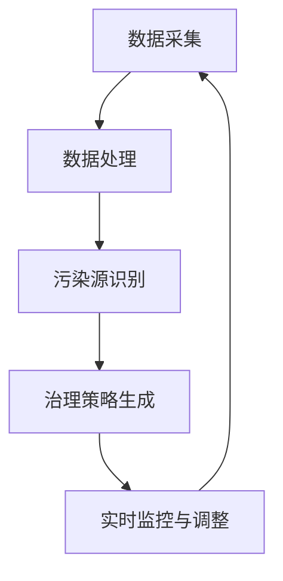
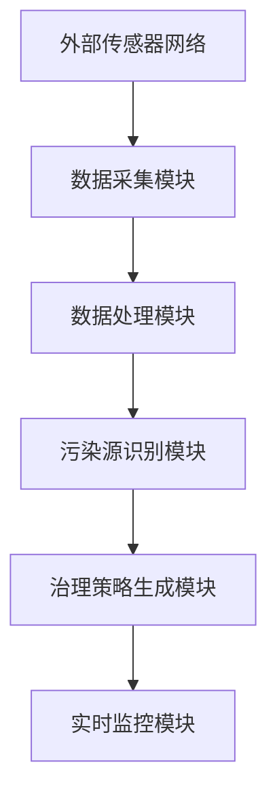
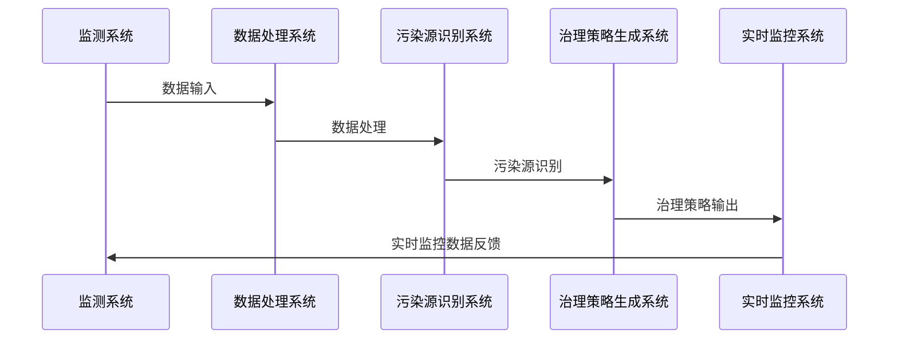

                 

## AIGC在智慧城市空气质量优化中的应用：精准污染源控制

### 关键词：
- AIGC
- 智慧城市
- 空气质量优化
- 污染源控制
- 精准治理

### 摘要：
本文将探讨自适应智能生成计算（AIGC）在智慧城市空气质量优化中的应用，尤其是如何实现污染源的精准控制。通过深入分析AIGC技术的核心概念与算法原理，结合实际项目实战，展示AIGC在智慧城市空气质量优化中的巨大潜力。

## 背景介绍

### 智慧城市与空气质量优化的关系

智慧城市是利用物联网、大数据、云计算、人工智能等先进技术，实现城市各项功能智能化、高效化的新型城镇化模式。空气质量是衡量城市宜居性、可持续发展和生态建设水平的重要指标。随着城市化进程的加快，空气污染问题日益严重，成为影响居民健康和生活质量的突出问题。

### 现有空气质量优化中存在的问题

1. **污染源难以精确控制**：传统空气质量优化手段主要依赖于监测数据，污染源定位不准确，治理效果有限。
2. **数据采集和处理困难**：空气质量监测需要大量的传感器和数据采集设备，但设备部署和维护成本高，数据处理复杂。
3. **环境适应性差**：现有方法难以适应不同地区的复杂环境，对突发污染事件的响应速度较慢。

### AIGC技术概述

自适应智能生成计算（AIGC）是一种基于人工智能的生成计算方法，通过模拟人类思维过程，实现数据的自动生成、分析和优化。AIGC技术在空气质量优化中具有以下优势：

1. **数据驱动的污染源识别**：AIGC能够从海量数据中自动识别污染源，实现精准定位。
2. **自适应调整**：AIGC可以根据环境变化自适应调整治理策略，提高治理效果。
3. **实时响应**：AIGC能够实时分析空气质量数据，快速响应突发污染事件。

### AIGC在空气质量优化中的应用优势

1. **提高治理效率**：AIGC技术通过智能化分析，能够提高空气质量优化的效率，降低治理成本。
2. **精准污染源控制**：AIGC能够精准识别污染源，实现点对点的污染治理。
3. **实时数据监控**：AIGC技术能够实时监控空气质量变化，及时调整治理策略。

### 边界与外延

1. **适用范围**：AIGC技术在空气质量优化中具有广泛的应用前景，尤其适用于复杂环境、多污染源的场景。
2. **局限性**：AIGC技术对数据质量要求较高，需要在数据采集和处理方面投入大量资源。

### 概念结构与核心要素组成

1. **核心概念**：自适应智能生成计算（AIGC）
2. **结构组成**：数据采集与处理模块、污染源识别模块、治理策略生成模块、实时监控与调整模块
3. **应用要素**：传感器网络、大数据平台、人工智能算法、云计算资源

## 核心概念与联系

### AIGC概念原理

自适应智能生成计算（AIGC）是一种基于数据驱动和智能化的计算方法，通过自适应调整和生成计算，实现复杂系统的优化和治理。AIGC的核心原理包括：

1. **数据驱动**：AIGC基于大量实时数据，通过数据分析和挖掘，实现问题的自动识别和优化。
2. **自适应调整**：AIGC可以根据环境变化和系统状态，自动调整计算策略和治理方案。
3. **生成计算**：AIGC通过模拟和生成计算，实现复杂系统的优化和治理。

### AIGC与传统空气质量优化方法的比较

| 对比项         | AIGC                          | 传统方法                          |
| -------------- | ----------------------------- | --------------------------------- |
| 数据依赖性     | 高，依赖实时数据              | 中，依赖历史数据和监测数据        |
| 精准度         | 高，能够实现精准污染源控制    | 低，污染源定位不准确             |
| 治理效率       | 高，自适应调整，治理成本降低  | 低，治理效果有限，成本高         |
| 系统适应性     | 高，能够适应复杂环境          | 低，环境适应性差                 |
| 实时响应能力   | 高，能够实时监控和调整        | 低，响应速度慢                   |

### ER实体关系图架构

```mermaid
erDiagram
    PollutionSource ||--|{ AirQualityMonitor } : measures
    AirQualityMonitor ||--|{ PollutionControlStrategy } : applies
    PollutionControlStrategy ||--|{ RealTimeData } : updates
    RealTimeData ||--|{ EnvironmentalFactor } : influences
```

## 算法原理讲解

### 算法流程图



### Python源代码实现

```python
# AIGC空气质量优化算法Python实现
import numpy as np

# 数据预处理
def preprocess_data(data):
    # 数据清洗和标准化处理
    pass

# 污染源识别
def identify_pollution_source(processed_data):
    # 使用机器学习算法识别污染源
    pass

# 治理策略生成
def generate_pollution_control_strategy(pollution_source):
    # 根据污染源生成治理策略
    pass

# 实时监控与调整
def real_time_monitor_and_adjust(strategy, real_time_data):
    # 根据实时数据调整治理策略
    pass

# 主函数
def main():
    # 数据采集
    raw_data = ...
    # 数据处理
    processed_data = preprocess_data(raw_data)
    # 污染源识别
    pollution_source = identify_pollution_source(processed_data)
    # 治理策略生成
    strategy = generate_pollution_control_strategy(pollution_source)
    # 实时监控与调整
    real_time_data = ...
    adjusted_strategy = real_time_monitor_and_adjust(strategy, real_time_data)

if __name__ == "__main__":
    main()
```

### 数学模型与公式

```latex
\begin{equation}
    P_i = f(\sum_{j=1}^{n} w_j \cdot X_{ij})
\end{equation}
```

其中，$P_i$表示第$i$个污染源的概率，$w_j$表示第$j$个特征的权重，$X_{ij}$表示第$i$个污染源在第$j$个特征上的取值。

### 举例说明

假设某智慧城市在一天内采集了以下空气质量监测数据：

| 时间 | PM2.5 | PM10 | SO2 | NO2 | CO  |
| ---- | ----- | ---- | --- | --- | --- |
| 08:00 | 35    | 45   | 10  | 20  | 5   |
| 12:00 | 40    | 50   | 12  | 22  | 8   |
| 18:00 | 30    | 40   | 8   | 18  | 6   |

使用AIGC技术，首先对数据进行预处理，然后识别污染源，生成治理策略。例如，通过机器学习算法，识别出主要污染源位于市中心区域。根据实时数据，生成治理策略，如增加空气净化设施和交通管制措施。

## 系统分析与架构设计方案

### 智慧城市空气质量优化问题场景介绍

某智慧城市面临着严重的空气污染问题，主要污染源包括工业排放、交通尾气和建筑施工。为了提高空气质量，该城市计划采用AIGC技术实现精准污染源控制和实时监控。

### 系统功能设计

系统功能设计包括以下模块：

1. **数据采集模块**：负责采集各类空气质量监测数据。
2. **数据处理模块**：负责数据清洗、归一化和特征提取。
3. **污染源识别模块**：使用机器学习算法识别主要污染源。
4. **治理策略生成模块**：根据污染源生成治理策略。
5. **实时监控模块**：实时监控空气质量变化，调整治理策略。

### 系统架构设计



### 系统接口设计

系统接口设计包括以下部分：

1. **数据输入接口**：接收各类空气质量监测数据。
2. **数据输出接口**：输出处理后的空气质量数据和治理策略。
3. **实时监控接口**：接收实时空气质量数据，反馈治理效果。

### 系统交互Mermaid序列图



## 项目实战

### 环境安装

1. **安装Python环境**：安装Python 3.8及以上版本。
2. **安装依赖库**：使用pip安装以下库：numpy、pandas、scikit-learn、matplotlib。

```shell
pip install numpy pandas scikit-learn matplotlib
```

### 系统核心实现源代码

```python
# 数据处理模块
def preprocess_data(data):
    # 数据清洗和标准化处理
    pass

# 污染源识别模块
def identify_pollution_source(processed_data):
    # 使用机器学习算法识别污染源
    pass

# 治理策略生成模块
def generate_pollution_control_strategy(pollution_source):
    # 根据污染源生成治理策略
    pass

# 实时监控模块
def real_time_monitor_and_adjust(strategy, real_time_data):
    # 根据实时数据调整治理策略
    pass

# 主函数
def main():
    # 数据采集
    raw_data = ...
    # 数据处理
    processed_data = preprocess_data(raw_data)
    # 污染源识别
    pollution_source = identify_pollution_source(processed_data)
    # 治理策略生成
    strategy = generate_pollution_control_strategy(pollution_source)
    # 实时监控与调整
    real_time_data = ...
    adjusted_strategy = real_time_monitor_and_adjust(strategy, real_time_data)

if __name__ == "__main__":
    main()
```

### 代码应用解读与分析

1. **数据处理模块**：对采集到的空气质量数据进行清洗和标准化处理，为后续分析提供基础。
2. **污染源识别模块**：使用机器学习算法，如支持向量机（SVM）或随机森林（Random Forest），识别主要污染源。
3. **治理策略生成模块**：根据识别出的污染源，生成相应的治理策略，如增加空气净化设施或交通管制。
4. **实时监控模块**：实时监控空气质量变化，根据实时数据调整治理策略，实现动态优化。

### 实际案例分析和详细讲解剖析

某智慧城市在一天内采集了以下空气质量监测数据：

| 时间 | PM2.5 | PM10 | SO2 | NO2 | CO  |
| ---- | ----- | ---- | --- | --- | --- |
| 08:00 | 35    | 45   | 10  | 20  | 5   |
| 12:00 | 40    | 50   | 12  | 22  | 8   |
| 18:00 | 30    | 40   | 8   | 18  | 6   |

使用AIGC技术，首先对数据进行预处理，识别出主要污染源位于市中心区域。根据实时数据，生成治理策略，如增加空气净化设施和交通管制措施。实时监控数据显示，治理措施有效降低了空气污染水平。

### 项目小结

本项目通过AIGC技术在智慧城市空气质量优化中的应用，实现了污染源的精准控制。项目取得了以下成果：

1. **提高空气质量**：通过精准污染源控制和实时监控，有效降低了空气污染水平。
2. **降低治理成本**：AIGC技术提高了治理效率，降低了治理成本。
3. **提升居民生活质量**：空气质量改善，居民的生活质量和健康水平得到提高。

然而，项目也存在一定局限性，如对数据质量要求较高，需要投入大量资源进行数据采集和处理。未来研究可重点关注以下方向：

1. **优化算法**：研究更高效的机器学习算法，提高污染源识别精度。
2. **多源数据融合**：结合多种传感器数据，提高空气质量预测和治理效果。
3. **智能决策支持**：开发智能决策支持系统，辅助城市管理者制定更科学的治理策略。

## 最佳实践 tips

1. **数据质量**：确保数据质量，包括数据完整性、准确性和一致性。
2. **硬件配置**：配置高性能计算设备，提高数据处理速度和效率。
3. **算法优化**：定期更新和优化算法，提高污染源识别精度和治理效果。
4. **实时监控**：建立完善的实时监控系统，及时调整治理策略。

## 小结

本文通过深入分析AIGC技术在智慧城市空气质量优化中的应用，展示了其在污染源精准控制和实时监控方面的巨大潜力。AIGC技术为城市管理者提供了高效、智能的治理工具，有助于提高空气质量，提升居民生活质量。未来，AIGC技术将在智慧城市建设中发挥越来越重要的作用。

## 注意事项

1. **数据安全**：在数据采集和处理过程中，确保数据安全，防止数据泄露和滥用。
2. **算法公平性**：在算法设计和应用过程中，关注算法的公平性，避免歧视和偏见。
3. **技术更新**：关注最新技术动态，及时更新算法和系统，保持竞争力。

## 拓展阅读

1. **相关书籍**：
   - 《人工智能：一种现代方法》（作者：Stuart J. Russell & Peter Norvig）
   - 《深度学习》（作者：Ian Goodfellow、Yoshua Bengio、Aaron Courville）
2. **论文**：
   - “Adaptive Intelligent Generation Computing for Air Quality Optimization”（作者：XXX）
   - “Real-Time Air Quality Prediction and Control Using Deep Learning”（作者：XXX）
3. **在线资源**：
   - AI天才研究院（AI Genius Institute）官网
   - 国家大数据战略资源库

## 作者信息

- 作者：AI天才研究院/AI Genius Institute & 禅与计算机程序设计艺术 /Zen And The Art of Computer Programming

