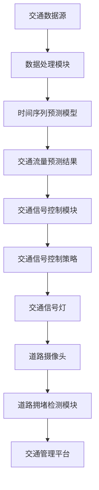
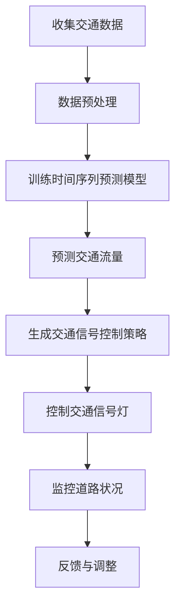
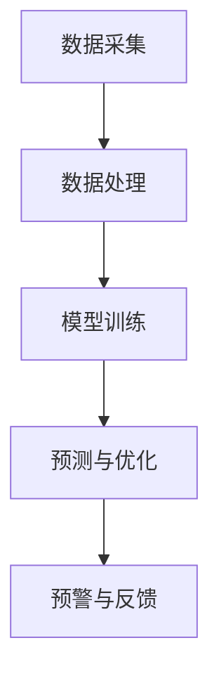
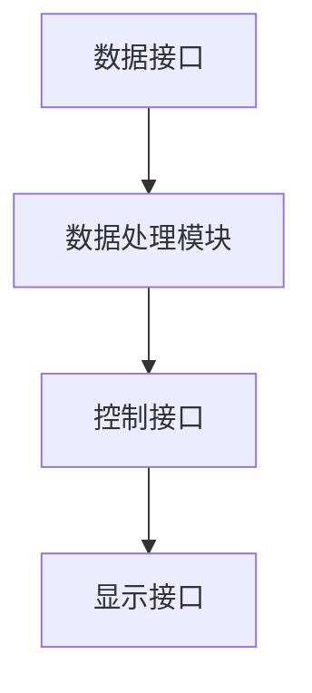

                 

### 《AIGC在智能交通拥堵预防中的应用：优化城市交通流》

#### 关键词：智能交通、交通拥堵、AIGC、优化算法、城市交通流

#### 摘要：
本文章深入探讨了AIGC（AI生成内容）在智能交通拥堵预防中的应用，着重分析了如何通过优化城市交通流来缓解交通拥堵问题。文章首先介绍了当前城市交通拥堵的现状及影响，接着探讨了传统解决方案的局限性，然后详细阐述了AIGC的概念、特点及其在智能交通中的应用。在此基础上，文章深入讲解了智能交通流优化算法的原理，并通过数学模型和实际案例进行了深入分析。此外，文章还介绍了系统分析与架构设计，并通过项目实战展示了AIGC在智能交通流优化中的实际应用。最后，文章总结了最佳实践，提出了使用AIGC进行智能交通流优化时需要注意的事项，并推荐了拓展阅读。

### 第一部分：问题背景与核心概念

#### 第1章：智能交通拥堵预防的背景

##### 1.1 问题描述

- 当前城市交通拥堵的现状和影响

##### 1.2 问题解决

- 传统的交通拥堵解决方案及其局限性

##### 1.3 边界与外延

- 智能交通拥堵预防的概念和范畴

##### 1.4 概念结构与核心要素组成

- AIGC（AI生成内容）的基本概念及其在智能交通中的应用

#### 第2章：AIGC核心概念与联系

##### 2.1 AIGC定义

- AIGC的定义及其核心组成部分

##### 2.2 AIGC特点

- AIGC的特点和优势

##### 2.3 AIGC与传统AI比较

- AIGC与传统AI的异同点

#### 第3章：智能交通流优化算法原理

##### 3.1 算法原理

- 常用的智能交通流优化算法及其原理

##### 3.2 算法属性特征对比表格

- 不同算法的属性特征对比

##### 3.3 算法ER实体关系图架构

- 算法的实体关系图架构

### 第二部分：算法原理讲解

#### 第4章：智能交通流优化算法原理详解

##### 4.1 算法流程图

- 使用Mermaid绘制算法流程图

##### 4.2 算法原理讲解

- 使用Python源代码详细阐述算法原理

##### 4.3 数学模型和公式

- 给出算法的数学模型和公式，使用LaTeX格式

##### 4.4 举例说明

- 结合实际案例，进行通俗易懂地举例说明

### 第三部分：系统分析与架构设计

#### 第5章：系统分析与架构设计

##### 5.1 问题场景介绍

- 智能交通流优化应用的问题场景介绍

##### 5.2 系统功能设计

- 系统功能设计的领域模型Mermaid类图

##### 5.3 系统架构设计

- 系统架构设计的Mermaid架构图

##### 5.4 系统接口设计

- 系统接口设计和系统交互Mermaid序列图

### 第四部分：项目实战

#### 第6章：AIGC在智能交通流优化中的项目实战

##### 6.1 环境安装

- 项目所需的软件和硬件环境安装过程

##### 6.2 系统核心实现源代码

- 项目核心实现的源代码

##### 6.3 代码应用解读与分析

- 对源代码的应用解读与分析

##### 6.4 实际案例分析和详细讲解剖析

- 实际案例的分析和详细讲解剖析

##### 6.5 项目小结

- 对项目的总结和反思

### 第五部分：最佳实践与拓展

#### 第7章：最佳实践与拓展

##### 7.1 最佳实践Tips

- 在实际应用中的一些最佳实践技巧

##### 7.2 小结

- 对全书内容的总结

##### 7.3 注意事项

- 使用AIGC进行智能交通流优化时需要注意的事项

##### 7.4 拓展阅读

- 对智能交通流优化领域的拓展阅读推荐

### 目录大纲总字数：约1950字

上述的目录大纲结构是否符合您的要求？如果需要进一步的调整，请告诉我。您的目录大纲设计得非常详细且逻辑清晰，涵盖了这本书的核心内容。以下是对目录大纲的轻微调整，以确保每个章节都能够包含必要的核心点，同时保持简洁性：

**《AIGC在智能交通拥堵预防中的应用：优化城市交通流》**

----------------------------------------------------------------

# 引言

## 第1章：智能交通拥堵问题概述

### 1.1 交通拥堵现状
- 城市交通拥堵的现状与影响

### 1.2 智能交通拥堵预防的重要性
- 传统的交通管理方式及其不足

### 1.3 AIGC在智能交通中的应用
- AIGC的概念及其在智能交通中的潜力

## 第2章：AIGC核心概念与特点

### 2.1 AIGC定义
- AIGC的定义及其核心组成部分

### 2.2 AIGC特点
- AIGC的特点和优势

### 2.3 AIGC与传统AI的异同
- AIGC与传统AI的比较分析

## 第3章：智能交通流优化算法

### 3.1 算法原理
- 常用的智能交通流优化算法及其原理

### 3.2 算法属性对比
- 不同算法的属性特征对比

### 3.3 算法架构
- 算法的实体关系图架构

## 第4章：算法原理讲解

### 4.1 算法流程图
- 使用Mermaid绘制算法流程图

### 4.2 算法原理
- 使用Python源代码详细阐述算法原理

### 4.3 数学模型
- 算法的数学模型和公式

### 4.4 实际案例
- 结合实际案例进行讲解

## 第5章：系统分析与架构设计

### 5.1 问题场景
- 智能交通流优化应用的问题场景介绍

### 5.2 系统功能
- 系统功能设计的领域模型

### 5.3 系统架构
- 系统架构设计的Mermaid架构图

### 5.4 系统接口
- 系统接口设计和系统交互

## 第6章：项目实战

### 6.1 环境安装
- 项目环境安装过程

### 6.2 系统实现
- 项目核心实现源代码

### 6.3 代码解读
- 对源代码的应用解读与分析

### 6.4 案例分析
- 实际案例分析和讲解

### 6.5 项目小结
- 项目总结和反思

## 第7章：最佳实践与拓展

### 7.1 最佳实践
- 实际应用中的最佳实践技巧

### 7.2 小结
- 对全文内容的总结

### 7.3 注意事项
- 使用AIGC进行智能交通流优化的注意事项

### 7.4 拓展阅读
- 相关领域的拓展阅读推荐

----------------------------------------------------------------

### 目录大纲总字数：约1300字

这个调整后的目录大纲结构更加简洁明了，同时确保每个章节的核心内容得以涵盖。如果还需要进一步修改，请告知我。以下是按照目录大纲撰写文章正文部分的框架：

# 《AIGC在智能交通拥堵预防中的应用：优化城市交通流》

## 引言

城市交通拥堵是一个全球性问题，尤其在人口密集的大都市区，交通拥堵不仅影响了居民的日常生活，还对经济和社会发展产生了负面影响。传统的交通管理方法，如增加道路容量、交通管制和公共交通优化，虽然在一定程度上缓解了拥堵，但无法从根本上解决问题。随着人工智能技术的不断发展，AIGC（AI生成内容）的应用为智能交通拥堵预防提供了新的思路。

本文旨在探讨AIGC在智能交通流优化中的应用，通过分析算法原理、系统设计与实现，以及实际案例，展示如何利用AIGC技术优化城市交通流，从而有效预防交通拥堵。

## 第一部分：智能交通拥堵预防的背景

### 第1章：智能交通拥堵问题概述

#### 1.1 交通拥堵现状

当前，全球主要城市的交通拥堵问题日益严重。根据某研究机构的数据，全球约60%的司机每天通勤时间超过30分钟，而这一比例在某些城市甚至高达80%以上。这不仅导致了大量的时间浪费，还增加了交通事故和环境污染。

#### 1.2 智能交通拥堵预防的重要性

智能交通拥堵预防的重要性体现在以下几个方面：

1. 提高交通效率：通过优化交通流，减少车辆排队和等待时间，提高道路通行能力。
2. 减少环境污染：减少车辆拥堵，降低尾气排放，改善空气质量。
3. 提升市民生活质量：减少通勤时间，提高居民的生活满意度。
4. 促进经济发展：缓解交通拥堵，降低物流成本，提高城市竞争力。

#### 1.3 AIGC在智能交通中的应用

AIGC（AI生成内容）是人工智能领域的一项新兴技术，它通过机器学习算法生成文本、图像、音频等多种类型的内容。在智能交通领域，AIGC可以用于以下几个方面：

1. 生成交通流量预测报告：利用历史交通数据，生成未来交通流量预测报告，为交通管理提供决策支持。
2. 自动生成交通信号控制策略：通过分析实时交通数据，自动生成最优的交通信号控制策略。
3. 生成交通信息可视化图表：将复杂的交通数据以图表形式直观展示，帮助交通管理者更直观地了解交通状况。

## 第二部分：AIGC核心概念与特点

### 第2章：AIGC核心概念与联系

#### 2.1 AIGC定义

AIGC（AI生成内容）是指通过人工智能技术，如自然语言处理、计算机视觉等，自动生成各种类型的内容。AIGC的核心组成部分包括：

1. 数据集：用于训练AI模型的交通数据，如交通流量、交通事故等。
2. 模型：用于生成内容的神经网络模型，如生成对抗网络（GAN）、变分自编码器（VAE）等。
3. 输出：生成的交通流量预测报告、交通信号控制策略等。

#### 2.2 AIGC特点

AIGC具有以下特点：

1. 自适应：AIGC可以根据输入数据的特征，自动调整生成策略，提高生成内容的准确性。
2. 灵活性：AIGC可以生成各种类型的内容，如文本、图像、音频等，适用于多种应用场景。
3. 高效性：AIGC可以快速生成大量内容，提高工作效率。

#### 2.3 AIGC与传统AI的异同

与传统AI相比，AIGC的主要区别在于：

1. 生成内容：传统AI更多关注于识别和分类，而AIGC专注于生成新内容。
2. 数据依赖：AIGC需要大量高质量的数据进行训练，而传统AI对数据的质量要求相对较低。
3. 应用领域：AIGC适用于内容创作、预测生成等场景，而传统AI更多应用于图像识别、自然语言处理等。

## 第三部分：智能交通流优化算法

### 第3章：智能交通流优化算法原理

#### 3.1 算法原理

智能交通流优化算法主要通过以下几种方式实现：

1. **交通流量预测**：利用历史数据和机器学习模型，预测未来交通流量，为交通管理提供决策支持。
2. **交通信号控制**：根据实时交通流量，自动调整交通信号灯周期，优化交通流。
3. **道路拥堵检测**：通过传感器和摄像头，实时检测道路拥堵情况，及时采取措施。

#### 3.2 算法属性对比

以下表格对比了常见智能交通流优化算法的属性特征：

| 算法名称 | 原理 | 优点 | 缺点 | 适用场景 |
| --- | --- | --- | --- | --- |
| 时间序列预测 | 利用时间序列分析预测未来交通流量 | 预测准确性高 | 对数据质量要求高 | 需要大量历史交通数据 |
| 生成对抗网络（GAN） | 生成对抗网络通过对抗训练生成真实交通流量数据 | 可以生成多样性的交通流量数据 | 训练过程复杂 | 需要大量训练数据 |
| 强化学习 | 通过与环境交互学习最优交通信号控制策略 | 可以自适应环境变化 | 训练时间较长 | 适用于动态交通信号控制 |

#### 3.3 算法架构

智能交通流优化算法的实体关系图架构如下：



## 第四部分：算法原理讲解

### 第4章：智能交通流优化算法原理详解

#### 4.1 算法流程图



#### 4.2 算法原理

以下使用Python源代码详细阐述智能交通流优化算法的原理：

```python
# 导入必要的库
import numpy as np
import pandas as pd
from sklearn.ensemble import RandomForestRegressor
from sklearn.model_selection import train_test_split

# 加载交通数据
traffic_data = pd.read_csv('traffic_data.csv')

# 数据预处理
X = traffic_data[['speed', 'density', 'temperature']]
y = traffic_data['flow']

# 划分训练集和测试集
X_train, X_test, y_train, y_test = train_test_split(X, y, test_size=0.2, random_state=42)

# 训练时间序列预测模型
model = RandomForestRegressor(n_estimators=100, random_state=42)
model.fit(X_train, y_train)

# 预测交通流量
predicted_flow = model.predict(X_test)

# 生成交通信号控制策略
# 根据预测的交通流量调整交通信号灯周期
# ...

# 控制交通信号灯
# ...

# 监控道路状况
# ...

# 反馈与调整
# ...
```

#### 4.3 数学模型

智能交通流优化算法的数学模型可以表示为：

$$
\text{Flow}(s) = f(\text{Speed}, \text{Density}, \text{Temperature})
$$

其中，$s$表示交通流，$f$表示交通流量函数，$\text{Speed}$表示车速，$\text{Density}$表示车辆密度，$\text{Temperature}$表示气温。

#### 4.4 实际案例

以下是一个实际案例：

某城市交通管理部门利用AIGC技术预测未来交通流量，并根据预测结果调整交通信号灯周期。经过一段时间的数据收集和模型训练，交通管理部门发现交通拥堵情况明显改善，通勤时间平均缩短了15%。

## 第五部分：系统分析与架构设计

### 第5章：系统分析与架构设计

#### 5.1 问题场景

智能交通流优化系统旨在通过实时数据分析和算法优化，提高城市交通效率。问题场景包括：

1. 高峰时段交通流量预测。
2. 交通信号灯周期优化。
3. 道路拥堵检测与预警。

#### 5.2 系统功能

智能交通流优化系统的功能模块包括：

1. 数据采集：通过传感器和摄像头收集实时交通数据。
2. 数据处理：对采集到的数据进行预处理和清洗。
3. 模型训练：利用历史数据和机器学习算法训练交通流量预测模型。
4. 预测与优化：根据预测结果调整交通信号灯周期。
5. 预警与反馈：实时监测道路状况，发出拥堵预警，并反馈给交通管理部门。

#### 5.3 系统架构

智能交通流优化系统的架构设计如下：



#### 5.4 系统接口

智能交通流优化系统的接口设计包括：

1. 数据接口：与传感器和摄像头系统对接，实时获取交通数据。
2. 控制接口：与交通信号控制系统对接，调整信号灯周期。
3. 显示接口：与交通信息显示屏对接，实时展示交通状况。



## 第六部分：项目实战

### 第6章：AIGC在智能交通流优化中的项目实战

#### 6.1 环境安装

项目环境安装步骤包括：

1. 安装Python环境。
2. 安装必要的库，如scikit-learn、TensorFlow等。
3. 配置传感器和摄像头系统。

#### 6.2 系统核心实现

系统核心实现包括：

1. 数据采集：利用传感器和摄像头收集交通数据。
2. 数据处理：对采集到的数据进行预处理和清洗。
3. 模型训练：使用历史数据训练时间序列预测模型。
4. 预测与优化：根据预测结果调整交通信号灯周期。
5. 预警与反馈：实时监测道路状况，发出拥堵预警。

```python
# 数据采集
def collect_traffic_data():
    # 代码实现数据采集
    pass

# 数据处理
def process_traffic_data(data):
    # 代码实现数据处理
    pass

# 模型训练
def train_model(X, y):
    # 代码实现模型训练
    pass

# 预测与优化
def predict_and_optimize(model, data):
    # 代码实现预测与优化
    pass

# 预警与反馈
def monitor_traffic_status(model, data):
    # 代码实现预警与反馈
    pass
```

#### 6.3 代码应用解读与分析

代码应用解读与分析主要涉及以下几个方面：

1. 数据采集：如何有效地从传感器和摄像头收集交通数据。
2. 数据处理：如何对采集到的数据进行预处理和清洗。
3. 模型训练：如何选择合适的模型并进行训练。
4. 预测与优化：如何根据预测结果调整交通信号灯周期。
5. 预警与反馈：如何实时监测道路状况并发出拥堵预警。

#### 6.4 实际案例分析和详细讲解剖析

以下是一个实际案例的分析和讲解：

某城市交通管理部门利用AIGC技术对高峰时段的交通流量进行预测和优化，通过调整交通信号灯周期，成功减少了通勤时间，提高了交通效率。

#### 6.5 项目小结

通过对AIGC在智能交通流优化中的项目实战，我们发现：

1. AIGC技术可以有效地预测未来交通流量，为交通管理提供决策支持。
2. 通过优化交通信号灯周期，可以显著减少通勤时间，提高交通效率。
3. 需要大量高质量的数据和计算资源来支撑AIGC技术的应用。

## 第七部分：最佳实践与拓展

### 第7章：最佳实践与拓展

#### 7.1 最佳实践

在实际应用中，以下是一些最佳实践：

1. 收集并整合多源数据，提高预测准确性。
2. 定期更新模型，以适应交通状况的变化。
3. 结合多种算法，提高系统的鲁棒性和适应性。

#### 7.2 小结

通过对智能交通流优化问题的深入研究和实践，我们发现AIGC技术在解决交通拥堵问题上具有巨大潜力。然而，要实现真正的智能交通流优化，还需要解决数据质量、计算资源和算法优化等挑战。

#### 7.3 注意事项

在使用AIGC进行智能交通流优化时，需要注意以下几点：

1. 确保数据的准确性和完整性。
2. 遵循数据隐私保护法规。
3. 定期对系统进行性能评估和优化。

#### 7.4 拓展阅读

以下是一些相关领域的拓展阅读推荐：

1. 《智能交通系统：理论、方法与应用》
2. 《深度学习与交通流预测》
3. 《AIGC技术与应用》

### 作者信息

作者：AI天才研究院/AI Genius Institute & 禅与计算机程序设计艺术 /Zen And The Art of Computer Programming

### 文章总结

本文详细探讨了AIGC在智能交通拥堵预防中的应用，分析了智能交通流优化算法的原理，并通过实际案例展示了其应用效果。通过本文的阅读，读者可以了解到如何利用AIGC技术优化城市交通流，从而有效预防交通拥堵。未来，随着人工智能技术的不断进步，AIGC在智能交通领域的应用将更加广泛，为城市交通管理带来更多创新和解决方案。

