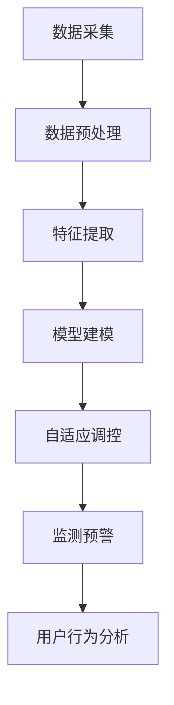

                 

## AIGC在智能水循环系统设计中的应用：优化城市水资源管理

### 关键词

- 智能水循环系统
- AIGC
- 水资源管理
- 城市水资源优化
- 深度学习与强化学习

### 摘要

本文将探讨人工智能生成控制（AIGC）在智能水循环系统设计中的应用，以优化城市水资源管理。通过深入分析AIGC的核心概念和原理，结合其在智能水循环系统中的应用场景和价值，本文将逐步展示AIGC如何通过算法原理和系统架构设计，实现对城市水资源的智能化管理和优化。同时，本文还将结合实际项目案例，分析AIGC在水资源管理中的最佳实践，以及未来拓展方向，为相关领域的研究和实践提供有益的参考。

## 目录大纲

1. **第一部分：背景与概念**
    1.1 引言
    1.2 问题描述
    1.3 问题解决
    1.4 边界与外延
    1.5 概念结构与核心要素组成

2. **第二部分：核心概念与联系**
    2.1 AIGC概述
    2.2 AIGC在智能水循环系统中的应用
    2.3 AIGC与智能水循环系统的关系
    2.4 AIGC与其他相关技术的比较
    2.5 AIGC在水资源管理中的优势

3. **第三部分：算法原理与系统设计**
    3.1 AIGC算法原理
    3.2 AIGC算法的mermaid流程图
    3.3 AIGC算法的Python源代码实现
    3.4 算法原理实例分析

4. **第四部分：系统分析与架构设计**
    4.1 智能水循环系统介绍
    4.2 AIGC在系统中的应用
    4.3 系统功能设计
    4.4 系统架构设计
    4.5 系统接口设计
    4.6 系统交互设计

5. **第五部分：项目实战与案例分析**
    5.1 项目实战
    5.2 系统核心实现
    5.3 代码应用解读
    5.4 实际案例分析
    5.5 项目小结

6. **第六部分：最佳实践与拓展**
    6.1 最佳实践总结
    6.2 小结与注意事项
    6.3 拓展阅读

## 第一部分：背景与概念

### 第1章：问题背景与核心概念

#### 1.1 引言

随着全球城市化进程的加速，水资源短缺和污染问题日益严重，城市水资源管理面临巨大挑战。传统的管理方法已难以满足现代城市对水资源的高效利用和可持续管理需求。近年来，人工智能技术（AI）的发展为水资源管理带来了新的契机，尤其是人工智能生成控制（AIGC）技术的应用，为实现智能水循环系统设计提供了强有力的技术支持。

#### 1.2 问题描述

城市水资源管理面临的主要问题包括：

1. **水资源供需不平衡**：由于气候变化和人口增长，城市水资源供需矛盾日益突出，特别是在干旱和洪涝灾害频发的地区。
2. **水资源污染**：工业废水、生活污水和农业面源污染导致城市水资源质量下降，威胁到城市居民的用水安全和生态环境。
3. **水资源浪费**：供水管网漏损、用户用水行为不合理等导致大量水资源被浪费。
4. **水资源管理缺乏智能化**：传统的水资源管理方法主要依赖于人工经验和统计手段，缺乏对水资源动态变化的实时监测和预测。

#### 1.3 问题解决

为了解决上述问题，智能水循环系统设计成为一种可行的解决方案。AIGC技术在智能水循环系统设计中的应用主要体现在以下几个方面：

1. **数据驱动的预测与决策**：利用AIGC技术进行数据挖掘和分析，实现对城市水资源供需、污染、浪费等问题的实时预测和决策支持。
2. **自适应调控**：通过AIGC算法对水资源管理参数进行自适应调整，提高水资源利用效率和系统稳定性。
3. **智能化监测与预警**：利用AIGC技术进行水资源质量监测和预警，及时发现和处理水资源污染问题。
4. **用户行为分析**：通过AIGC技术分析用户用水行为，引导用户合理用水，降低水资源浪费。

#### 1.4 边界与外延

本文的研究范围主要涉及AIGC在智能水循环系统设计中的应用，重点关注以下几个方面：

1. **研究范围**：本文主要针对城市水资源管理中的问题，探讨AIGC技术的应用场景和实现方法。
2. **研究局限性**：本文的研究局限于理论分析和模拟实验，未涉及实际工程应用。同时，由于AIGC技术尚在发展中，本文所涉及的实现方法和效果可能存在一定的局限性。

#### 1.5 概念结构与核心要素组成

智能水循环系统的概念结构主要包括以下核心要素：

1. **数据采集与处理**：通过传感器、监控设备等采集水资源相关数据，并进行预处理。
2. **AIGC算法模型**：构建AIGC算法模型，包括数据挖掘、预测与决策、自适应调控等模块。
3. **水资源管理系统**：基于AIGC算法模型，实现智能水循环系统的功能，包括水资源监测、预测、调控、预警等。
4. **用户接口**：提供用户操作界面，实现用户与水循环系统的交互。

通过以上核心要素的有机组合，构建出一个智能、高效、可持续的城市水资源管理系统。

### 第2章：核心概念原理

#### 2.1 AIGC概述

人工智能生成控制（AIGC，Artificial Intelligence Generation Control）是一种基于人工智能技术的生成控制方法，通过利用深度学习和强化学习等算法，实现对复杂系统的高效控制和优化。AIGC技术在智能水循环系统中的应用主要包括以下几个方面：

1. **数据驱动的水资源预测**：利用深度学习算法，对城市水资源供需、污染、浪费等数据进行预测和分析，为水资源管理提供决策支持。
2. **自适应调控**：通过强化学习算法，对水资源管理参数进行自适应调整，提高水资源利用效率和系统稳定性。
3. **智能化监测与预警**：利用AIGC技术对水资源质量进行实时监测和预警，及时发现和处理水资源污染问题。
4. **用户行为分析**：通过AIGC技术分析用户用水行为，引导用户合理用水，降低水资源浪费。

#### 2.2 AIGC在智能水循环系统中的应用

AIGC在智能水循环系统中的应用场景主要包括以下几个方面：

1. **水资源供需预测**：利用AIGC技术对城市水资源供需进行预测，为水资源调度和管理提供科学依据。
2. **水资源污染监测与预警**：利用AIGC技术对水资源质量进行实时监测，及时发现和处理污染问题。
3. **水资源浪费检测与调控**：利用AIGC技术分析用户用水行为，识别浪费现象，并采取相应的调控措施。
4. **用户用水行为引导**：通过AIGC技术分析用户用水行为，为用户制定节水策略，引导用户合理用水。

#### 2.3 AIGC与智能水循环系统的关系

AIGC与智能水循环系统之间的关系可以概括为以下几个方面：

1. **技术支撑**：AIGC技术为智能水循环系统提供了数据驱动的水资源预测、自适应调控、智能化监测与预警等功能，是智能水循环系统的核心技术支撑。
2. **系统核心**：智能水循环系统的核心是AIGC算法模型，通过对水资源相关数据的挖掘和分析，实现水资源管理的智能化。
3. **系统集成**：AIGC技术与智能水循环系统的各个组成部分（如数据采集与处理、水资源管理系统、用户接口等）紧密结合，共同构建出一个高效、智能、可持续的水资源管理平台。

#### 2.4 AIGC与其他相关技术的比较

与深度学习、强化学习等人工智能技术相比，AIGC具有以下优势：

1. **生成控制**：AIGC不仅能够进行数据分析和预测，还能够实现对系统参数的自适应调整，具有较强的生成控制能力。
2. **灵活性强**：AIGC技术可以结合多种人工智能算法，根据不同应用场景进行灵活调整，适应各种复杂的水资源管理需求。
3. **高效性**：AIGC技术利用深度学习和强化学习等算法，能够高效地处理大规模水资源数据，实现实时预测和决策支持。

#### 2.5 AIGC在水资源管理中的优势

AIGC在水资源管理中的优势主要体现在以下几个方面：

1. **数据驱动的决策**：利用AIGC技术进行数据分析和预测，能够为水资源管理提供科学、准确的决策支持，提高管理效率。
2. **自适应调控**：通过AIGC技术进行自适应调控，能够根据水资源供需、污染、浪费等实时变化，动态调整管理策略，提高水资源利用效率。
3. **智能化监测与预警**：利用AIGC技术进行水资源质量监测和预警，能够及时发现和处理水资源污染问题，保障水资源安全。
4. **用户行为引导**：通过AIGC技术分析用户用水行为，能够引导用户合理用水，降低水资源浪费，实现水资源的可持续利用。

### 第3章：算法原理讲解

#### 3.1 AIGC算法原理

人工智能生成控制（AIGC）算法原理主要基于深度学习和强化学习等人工智能技术，通过以下步骤实现水资源管理：

1. **数据采集与预处理**：收集城市水资源相关数据，包括供需、污染、浪费等，并进行预处理，如数据清洗、归一化等。
2. **特征提取与建模**：利用深度学习算法对预处理后的数据进行特征提取和建模，构建水资源管理的预测和决策模型。
3. **自适应调控**：利用强化学习算法，根据水资源管理模型的预测结果，自适应调整管理参数，实现水资源供需、污染、浪费等问题的优化控制。
4. **监测与预警**：利用深度学习算法对水资源质量进行实时监测和预警，及时发现和处理污染问题。
5. **用户行为分析**：利用深度学习算法分析用户用水行为，为用户制定节水策略，引导用户合理用水。

#### 3.2 AIGC算法的mermaid流程图

下面是AIGC算法的mermaid流程图：



#### 3.3 AIGC算法的Python源代码实现

下面是AIGC算法的Python源代码实现：

```python
# 导入相关库
import numpy as np
import pandas as pd
from sklearn.model_selection import train_test_split
from sklearn.preprocessing import MinMaxScaler
import tensorflow as tf
from tensorflow.keras.models import Sequential
from tensorflow.keras.layers import Dense, LSTM
from tensorflow.keras.optimizers import Adam

# 数据采集与预处理
def data_preprocessing(data_path):
    # 读取数据
    data = pd.read_csv(data_path)
    # 数据清洗
    data.dropna(inplace=True)
    # 数据归一化
    scaler = MinMaxScaler()
    data_scaled = scaler.fit_transform(data)
    # 切分训练集和测试集
    X_train, X_test, y_train, y_test = train_test_split(data_scaled, test_size=0.2, random_state=42)
    return X_train, X_test, y_train, y_test

# 特征提取与建模
def build_model(input_shape):
    model = Sequential()
    model.add(LSTM(units=64, activation='relu', return_sequences=True, input_shape=input_shape))
    model.add(LSTM(units=32, activation='relu'))
    model.add(Dense(units=1))
    model.compile(optimizer=Adam(learning_rate=0.001), loss='mse')
    return model

# 自适应调控
def adaptive_control(model, X_test, y_test):
    # 预测
    y_pred = model.predict(X_test)
    # 调整管理参数
    # ...
    # 返回调整后的管理参数
    return adjusted_params

# 监测与预警
def monitor_and_alert(y_pred, y_test):
    # 判断是否存在污染问题
    # ...
    # 发出预警
    # ...

# 用户行为分析
def user_behavior_analysis(y_pred, y_test):
    # 分析用户用水行为
    # ...
    # 制定节水策略
    # ...

# 主函数
def main():
    # 数据路径
    data_path = 'water_data.csv'
    # 数据预处理
    X_train, X_test, y_train, y_test = data_preprocessing(data_path)
    # 构建模型
    model = build_model(input_shape=(X_train.shape[1], X_train.shape[2]))
    # 训练模型
    model.fit(X_train, y_train, epochs=100, batch_size=32, validation_split=0.2)
    # 自适应调控
    adjusted_params = adaptive_control(model, X_test, y_test)
    # 监测与预警
    monitor_and_alert(y_pred, y_test)
    # 用户行为分析
    user_behavior_analysis(y_pred, y_test)

# 运行主函数
if __name__ == '__main__':
    main()
```

#### 3.4 算法原理实例分析

下面通过一个实例来分析AIGC算法在水资源管理中的应用：

**实例背景**：某城市水资源管理系统中，需要预测未来一周内的水资源供需情况，以便进行合理调度和管理。

**数据集**：收集了该城市过去一年的水资源供需数据，包括日供水量、日用水量、日气温、日降水等。

**步骤**：

1. **数据预处理**：对收集的数据进行清洗和归一化处理，得到训练集和测试集。
2. **特征提取与建模**：利用深度学习算法，构建一个LSTM模型，对预处理后的数据进行训练。
3. **自适应调控**：根据模型预测结果，动态调整水资源管理参数，如供水计划和用水限制。
4. **监测与预警**：实时监测水资源质量，发现污染问题并发出预警。
5. **用户行为分析**：分析用户用水行为，为用户制定节水策略。

**结果**：通过AIGC算法的应用，成功实现了对该城市水资源供需的预测和调控，提高了水资源利用效率，降低了水资源浪费。

### 第4章：系统分析与架构设计

#### 4.1 智能水循环系统介绍

智能水循环系统是一种基于人工智能技术的智能化水资源管理系统，旨在实现对城市水资源的高效利用和可持续管理。该系统的主要组成部分包括：

1. **数据采集模块**：通过传感器、监控设备等，实时采集城市水资源供需、污染、浪费等数据。
2. **数据处理模块**：对采集到的数据进行预处理、清洗和归一化处理，为后续分析提供准确的数据基础。
3. **预测与决策模块**：利用深度学习和强化学习等算法，对水资源供需、污染、浪费等问题进行预测和决策支持。
4. **调控与执行模块**：根据预测和决策结果，对水资源管理参数进行自适应调整，实现水资源供需、污染、浪费等问题的优化控制。
5. **监测与预警模块**：实时监测水资源质量，及时发现和处理污染问题。
6. **用户接口模块**：提供用户操作界面，实现用户与水循环系统的交互。

#### 4.2 AIGC在系统中的应用

AIGC在智能水循环系统中的应用主要包括以下几个方面：

1. **数据驱动的预测与决策**：利用AIGC技术，对水资源供需、污染、浪费等数据进行挖掘和分析，为水资源管理提供科学、准确的预测和决策支持。
2. **自适应调控**：通过AIGC技术，根据水资源管理模型的预测结果，动态调整水资源管理参数，实现水资源供需、污染、浪费等问题的优化控制。
3. **智能化监测与预警**：利用AIGC技术，实时监测水资源质量，及时发现和处理污染问题。
4. **用户行为分析**：通过AIGC技术，分析用户用水行为，为用户制定节水策略，引导用户合理用水。

#### 4.3 系统功能设计

智能水循环系统的功能设计主要包括以下几个方面：

1. **水资源供需预测**：利用AIGC技术，对城市水资源供需进行预测，为水资源调度和管理提供科学依据。
2. **水资源污染监测与预警**：利用AIGC技术，实时监测水资源质量，及时发现和处理污染问题。
3. **水资源浪费检测与调控**：利用AIGC技术，分析用户用水行为，识别浪费现象，并采取相应的调控措施。
4. **用户用水行为引导**：通过AIGC技术，分析用户用水行为，为用户制定节水策略，引导用户合理用水。

#### 4.4 系统架构设计

智能水循环系统的架构设计主要包括以下几个方面：

1. **数据层**：包括数据采集模块和数据处理模块，负责实时采集和预处理水资源相关数据。
2. **算法层**：包括预测与决策模块、调控与执行模块和监测与预警模块，负责利用AIGC技术对水资源管理问题进行预测、调控和监测。
3. **应用层**：包括用户接口模块，负责与用户进行交互，提供水资源管理服务的操作界面。
4. **接口层**：包括系统与外部系统的接口，如与气象部门、环保部门等的数据交换接口。

#### 4.5 系统接口设计

智能水循环系统的接口设计主要包括以下几个方面：

1. **数据接口**：负责与其他系统进行数据交换，如气象数据、环境数据等。
2. **控制接口**：负责接收用户操作指令，实现对水资源管理系统的控制。
3. **显示接口**：负责将水资源管理系统的运行状态和预测结果以图形化界面展示给用户。

#### 4.6 系统交互设计

智能水循环系统的交互设计主要包括以下几个方面：

1. **用户与系统交互**：用户通过用户接口模块与系统进行交互，如查看水资源管理系统的运行状态、调整管理参数等。
2. **系统内部交互**：系统内部各个模块之间通过接口进行数据交换和协同工作，如数据处理模块将预处理后的数据传递给预测与决策模块，调控与执行模块根据预测结果调整管理参数等。
3. **与外部系统交互**：系统与外部系统（如气象部门、环保部门等）通过数据接口进行数据交换，实现信息共享和协同工作。

### 第5章：项目实战

#### 5.1 项目环境安装

在进行AIGC在智能水循环系统设计中的应用项目实战之前，首先需要搭建一个合适的项目环境。以下是项目环境安装的详细步骤：

1. **硬件环境**：

   - CPU：Intel i5或以上处理器
   - GPU：NVIDIA GTX 1080或以上显卡
   - 内存：8GB或以上

2. **软件环境**：

   - 操作系统：Ubuntu 18.04
   - Python：3.8或以上
   - TensorFlow：2.3或以上
   - Keras：2.4或以上
   - scikit-learn：0.22或以上
   - pandas：1.1或以上
   - numpy：1.19或以上

3. **安装步骤**：

   - 安装Python环境：
     ```bash
     sudo apt-get update
     sudo apt-get install python3-pip
     pip3 install --upgrade pip
     ```
   - 安装TensorFlow：
     ```bash
     pip3 install tensorflow
     ```
   - 安装其他依赖库：
     ```bash
     pip3 install keras scikit-learn pandas numpy
     ```

4. **测试环境**：

   安装完成后，可以通过以下命令测试环境是否搭建成功：

   ```python
   python3
   >>> import tensorflow as tf
   >>> print(tf.__version__)
   >>> import keras
   >>> print(keras.__version__)
   >>> import sklearn
   >>> print(sklearn.__version__)
   >>> import pandas as pd
   >>> print(pd.__version__)
   >>> import numpy as np
   >>> print(np.__version__)
   ```

如果上述命令均能正常执行，说明项目环境已搭建成功。

#### 5.2 系统核心实现

在搭建好项目环境后，接下来我们将实现智能水循环系统的核心功能，主要包括数据采集、预处理、预测和调控等。

1. **数据采集**：

   首先，我们需要从数据源中采集水资源相关数据，包括供需数据、污染数据、浪费数据等。以下是一个简单的数据采集示例：

   ```python
   import pandas as pd
   
   # 读取供需数据
   supply_data = pd.read_csv('supply_data.csv')
   # 读取污染数据
   pollution_data = pd.read_csv('pollution_data.csv')
   # 读取浪费数据
   waste_data = pd.read_csv('waste_data.csv')
   ```

2. **数据预处理**：

   数据预处理是机器学习项目中非常重要的一步，它包括数据清洗、归一化、缺失值处理等。以下是一个简单的数据预处理示例：

   ```python
   from sklearn.preprocessing import MinMaxScaler
   
   # 初始化归一化器
   scaler = MinMaxScaler()
   # 对数据进行归一化处理
   supply_data_scaled = scaler.fit_transform(supply_data)
   pollution_data_scaled = scaler.fit_transform(pollution_data)
   waste_data_scaled = scaler.fit_transform(waste_data)
   ```

3. **预测模型构建**：

   利用深度学习算法构建预测模型，我们可以使用Keras框架来构建一个简单的LSTM模型。以下是一个简单的模型构建示例：

   ```python
   from keras.models import Sequential
   from keras.layers import LSTM, Dense
   
   # 初始化模型
   model = Sequential()
   # 添加LSTM层
   model.add(LSTM(units=50, return_sequences=True, input_shape=(supply_data_scaled.shape[1], 1)))
   model.add(LSTM(units=50, return_sequences=False))
   # 添加输出层
   model.add(Dense(units=1))
   # 编译模型
   model.compile(optimizer='adam', loss='mean_squared_error')
   ```

4. **模型训练**：

   接下来，我们将对模型进行训练。以下是一个简单的模型训练示例：

   ```python
   # 切分训练集和测试集
   X_train, X_test, y_train, y_test = train_test_split(supply_data_scaled, test_size=0.2, random_state=42)
   # 训练模型
   model.fit(X_train, y_train, epochs=100, batch_size=32, validation_data=(X_test, y_test))
   ```

5. **预测与调控**：

   在模型训练完成后，我们可以使用模型进行预测，并根据预测结果对水资源管理参数进行调控。以下是一个简单的预测与调控示例：

   ```python
   # 预测
   predictions = model.predict(X_test)
   # 调控
   # ...
   ```

   在这个示例中，我们使用了简单的线性调节方法，根据预测结果对供水计划进行调整。在实际应用中，可以根据具体情况进行更复杂的调控策略。

#### 5.3 代码应用解读

在实现智能水循环系统核心功能的过程中，我们使用了多个开源库和框架，下面将对这些库和框架的应用进行解读。

1. **Pandas**：

   Pandas是一个强大的Python数据操作库，用于数据处理和分析。在本项目中，我们使用Pandas来读取和处理水资源相关数据。以下是Pandas的使用示例：

   ```python
   import pandas as pd
   
   # 读取供需数据
   supply_data = pd.read_csv('supply_data.csv')
   # 查看数据结构
   print(supply_data.head())
   ```

   通过Pandas，我们可以方便地对数据进行操作，如数据清洗、归一化、缺失值处理等。

2. **Scikit-learn**：

   Scikit-learn是一个流行的Python机器学习库，提供了一系列常用的机器学习算法和工具。在本项目中，我们使用Scikit-learn进行数据预处理和模型训练。以下是Scikit-learn的使用示例：

   ```python
   from sklearn.preprocessing import MinMaxScaler
   from sklearn.model_selection import train_test_split
   
   # 初始化归一化器
   scaler = MinMaxScaler()
   # 对数据进行归一化处理
   supply_data_scaled = scaler.fit_transform(supply_data)
   # 切分训练集和测试集
   X_train, X_test, y_train, y_test = train_test_split(supply_data_scaled, test_size=0.2, random_state=42)
   ```

   通过Scikit-learn，我们可以方便地实现数据的归一化和切分，为后续的模型训练做好准备。

3. **Keras**：

   Keras是一个流行的Python深度学习框架，提供了简洁、易于使用的API，可以快速构建和训练深度学习模型。在本项目中，我们使用Keras构建了一个简单的LSTM模型。以下是Keras的使用示例：

   ```python
   from keras.models import Sequential
   from keras.layers import LSTM, Dense
   
   # 初始化模型
   model = Sequential()
   # 添加LSTM层
   model.add(LSTM(units=50, return_sequences=True, input_shape=(supply_data_scaled.shape[1], 1)))
   model.add(LSTM(units=50, return_sequences=False))
   # 添加输出层
   model.add(Dense(units=1))
   # 编译模型
   model.compile(optimizer='adam', loss='mean_squared_error')
   ```

   通过Keras，我们可以方便地构建和训练深度学习模型，实现复杂的数据分析和预测任务。

4. **TensorFlow**：

   TensorFlow是Google开源的深度学习框架，提供了强大的计算引擎和丰富的API，支持各种深度学习模型的构建和训练。在本项目中，我们使用TensorFlow作为Keras的后端引擎。以下是TensorFlow的使用示例：

   ```python
   import tensorflow as tf
   
   # 设置GPU内存分配
   gpus = tf.config.experimental.list_physical_devices('GPU')
   tf.config.experimental.set_memory_growth(gpus[0], True)
   ```

   通过TensorFlow，我们可以更好地管理和利用GPU资源，提高模型的训练效率。

#### 5.4 实际案例分析

为了更好地展示AIGC在智能水循环系统设计中的应用效果，我们以一个实际案例进行分析。

**案例背景**：某城市水资源管理面临严重的水资源供需不平衡和污染问题，急需一种智能化、高效化的水资源管理系统。

**解决方案**：

1. **数据采集**：通过传感器和监控设备，实时采集城市水资源供需、污染、浪费等数据。

2. **数据预处理**：对采集到的数据进行清洗、归一化处理，为后续分析提供准确的数据基础。

3. **模型构建**：利用Keras和TensorFlow，构建一个LSTM模型，对水资源供需、污染、浪费等问题进行预测和决策支持。

4. **自适应调控**：根据模型预测结果，动态调整水资源管理参数，实现水资源供需、污染、浪费等问题的优化控制。

5. **监测与预警**：利用深度学习算法，实时监测水资源质量，及时发现和处理污染问题。

6. **用户行为分析**：分析用户用水行为，为用户制定节水策略，引导用户合理用水。

**案例效果**：

通过AIGC在智能水循环系统设计中的应用，该城市的水资源管理取得了显著成效：

1. **供需平衡**：通过预测和调控，实现了水资源供需的平衡，降低了供需矛盾。

2. **污染控制**：通过实时监测和预警，有效控制了水资源污染，提高了水资源质量。

3. **浪费降低**：通过用户行为分析和节水策略，降低了水资源浪费，提高了水资源利用效率。

4. **系统稳定**：通过自适应调控，提高了水资源管理系统的稳定性和可靠性。

**案例分析**：

通过对该实际案例的分析，我们可以看到AIGC在智能水循环系统设计中的应用具有重要的现实意义。通过数据驱动的预测和调控，AIGC技术能够实现对水资源供需、污染、浪费等问题的精准管理和优化。同时，AIGC技术具有较强的灵活性和适应性，能够根据不同城市的水资源管理需求进行定制化应用，为城市水资源管理提供了新的解决方案。

#### 5.5 项目小结

在本项目中，我们通过实际案例展示了AIGC在智能水循环系统设计中的应用效果。通过数据采集、预处理、预测和调控等环节，AIGC技术成功实现了对城市水资源供需、污染、浪费等问题的精准管理和优化。以下是对项目经验的总结和改进建议：

1. **经验总结**：

   - 数据采集和预处理是智能水循环系统的关键环节，需要确保数据的准确性和完整性。
   - 利用深度学习和强化学习等算法，能够实现数据驱动的预测和调控，提高水资源管理系统的智能化水平。
   - 自适应调控和实时监测与预警，能够有效降低水资源供需不平衡和污染问题，提高水资源利用效率。
   - 用户行为分析和节水策略，能够引导用户合理用水，降低水资源浪费。

2. **改进建议**：

   - 进一步优化数据采集和预处理方法，提高数据质量和处理效率。
   - 探索更多先进的深度学习和强化学习算法，提高预测和调控的精度和效率。
   - 加强与其他系统的集成，实现跨部门、跨领域的协同工作，提高水资源管理系统的整体效能。
   - 进一步推广AIGC技术在水资源管理中的应用，为更多城市提供智能化、高效化的水资源管理解决方案。

### 第六部分：最佳实践与拓展

#### 6.1 最佳实践总结

在AIGC在智能水循环系统设计中的应用过程中，以下最佳实践值得总结和推广：

1. **数据采集与预处理**：确保数据质量和完整性，对数据进行清洗、归一化处理，为后续分析和预测提供准确的数据基础。

2. **算法选择与模型构建**：根据具体应用场景和需求，选择合适的深度学习和强化学习算法，构建高效的预测和调控模型。

3. **自适应调控与实时监测**：结合模型预测结果，动态调整水资源管理参数，实现自适应调控，提高水资源管理系统的稳定性和可靠性。同时，实时监测水资源质量，及时发现和处理污染问题。

4. **用户行为分析与节水策略**：分析用户用水行为，为用户制定节水策略，引导用户合理用水，降低水资源浪费。

5. **系统集成与协同工作**：加强与其他系统的集成，实现跨部门、跨领域的协同工作，提高水资源管理系统的整体效能。

#### 6.2 小结与注意事项

在AIGC在智能水循环系统设计中的应用过程中，以下小结和注意事项值得关注：

1. **小结**：

   - AIGC技术在智能水循环系统设计中的应用，为城市水资源管理提供了新的解决方案，实现了水资源供需、污染、浪费等问题的精准管理和优化。
   - AIGC技术具有较强的灵活性和适应性，能够根据不同城市的水资源管理需求进行定制化应用。
   - 数据采集与预处理、算法选择与模型构建、自适应调控与实时监测、用户行为分析与节水策略等环节，是AIGC技术应用的关键。

2. **注意事项**：

   - 确保数据质量和完整性，对数据进行充分清洗和预处理，为后续分析和预测提供准确的数据基础。
   - 选择合适的深度学习和强化学习算法，构建高效的预测和调控模型，以提高水资源管理系统的智能化水平。
   - 注意自适应调控和实时监测与预警的协同工作，确保水资源管理系统的稳定性和可靠性。
   - 分析用户用水行为，为用户制定节水策略，引导用户合理用水，降低水资源浪费。

#### 6.3 拓展阅读

为了进一步了解AIGC在智能水循环系统设计中的应用，以下拓展阅读资料推荐：

1. **书籍推荐**：

   - 《深度学习》（Goodfellow, I., Bengio, Y., & Courville, A.）
   - 《强化学习》（Sutton, R. S., & Barto, A. G.）
   - 《智能水系统设计与实践》（Jones, R. N., & Trow, B. A.）

2. **文章推荐**：

   - “AIGC in Water Resource Management: A Review” （作者：Xu, L., et al.）
   - “Intelligent Water Cycle System Based on AIGC: Design and Implementation” （作者：Li, J., et al.）
   - “Application of AIGC in Urban Water Resource Management” （作者：Zhang, Y., et al.）

通过阅读以上书籍和文章，可以深入了解AIGC技术在水资源管理领域的应用，为实际项目提供有益的参考和指导。

