                 

### 第1章：问题背景与核心概念

#### 1.1 问题背景

##### 1.1.1 智能灾后心理重建规划的必要性

在全球气候变化和人类活动日益频繁的背景下，自然灾害如地震、洪水、火灾等频发，这些灾害不仅摧毁了人们的物质家园，也对他们的心理健康造成了严重影响。灾后心理重建成为一项至关重要的任务。传统的心理重建方法依赖于专业心理医生和志愿者的人力介入，而智能灾后心理重建规划通过引入人工智能（AI）技术，可以更高效、更精准地满足灾后心理重建的需求。

###### 1.1.1.1 灾害频发与心理健康问题

自然灾害的频发是一个全球性问题。根据联合国发布的数据，过去二十年里，全球每年因自然灾害造成的经济损失超过了数百亿美元。这些灾害不仅带来了巨大的经济损失，也对人们的心理健康造成了严重的打击。据世界卫生组织（WHO）统计，超过70%的灾后幸存者会经历不同程度的心理创伤，如焦虑、抑郁和创伤后应激障碍（PTSD）。

**图表 1.1 灾害频发情况统计**

| 年份 | 自然灾害数量 | 受影响人数（百万） | 经济损失（亿美元） |
|------|-------------|----------------|-----------------|
| 2020 | 3,536       | 825            | 220             |
| 2019 | 3,093       | 737            | 180             |
| 2018 | 2,736       | 659            | 160             |

从图表中可以看出，自然灾害的频发趋势明显，且对人类的影响深远。

###### 1.1.1.2 心理健康问题的普遍性

灾害后的心理健康问题不仅影响个体，也会影响到整个社区。研究表明，灾后心理创伤的发病率在受灾人群中非常高。例如，根据美国疾病控制与预防中心（CDC）的研究，灾难后经历创伤的人群中，有30%-40%会患上创伤后应激障碍。这些心理健康问题不仅影响个人的生活质量，也会影响社区的整体稳定性。

**图表 1.2 心理健康问题的发病率**

| 心理健康问题 | 发病率（%） |
|---------------|------------|
| 焦虑          | 20-30      |
| 抑郁          | 10-20      |
| 创伤后应激障碍 | 15-30      |

从图表中可以看出，心理健康问题的发病率在灾后人群中是相当普遍的。

##### 1.1.2 社区心理健康恢复的重要性

社区在灾后心理重建中起着至关重要的作用。社区不仅是人们生活的场所，也是他们获得支持和帮助的重要来源。灾后，社区的功能往往受到严重破坏，这进一步加剧了居民的心理压力。因此，社区心理健康恢复成为灾后重建工作的关键一环。

###### 1.1.2.1 社区的定义与作用

社区是指一定地域范围内，有着共同生活环境和利益关系的群体。社区在灾后心理重建中的作用主要体现在以下几个方面：

1. **心理支持**：社区可以提供一个安全、温暖的环境，让受灾居民获得心理支持。
2. **信息传递**：社区是传递灾后救援信息和资源的重要渠道。
3. **资源共享**：社区内的资源可以共享，帮助受灾居民渡过难关。

###### 1.1.2.1.1 社区的概念

社区是一个由共同利益、共同目标和共同价值观连接在一起的人群集合。社区成员之间有着紧密的联系，彼此支持和帮助。

###### 1.1.2.1.2 社区在灾后心理重建中的作用

社区在灾后心理重建中的作用主要体现在以下几个方面：

1. **心理支持**：社区可以提供一个安全、温暖的环境，让受灾居民获得心理支持。这种支持可以来自邻里之间的关心和帮助，也可以来自社区组织的心理辅导和咨询。
2. **信息传递**：社区是传递灾后救援信息和资源的重要渠道。社区可以及时向受灾居民传达救援信息，帮助他们了解灾后的救助政策和资源分配。
3. **资源共享**：社区内的资源可以共享，帮助受灾居民渡过难关。例如，社区内的闲置房屋可以提供给无家可归的居民，闲置物资可以用于救援工作。

##### 1.1.3 灾后心理重建的挑战

灾后心理重建面临着诸多挑战。首先，心理创伤的复杂性使得重建工作难以一蹴而就。心理创伤不仅包括直接的生理创伤，还包括间接的心理创伤，如失去亲人、失去家园等。这些创伤会导致一系列心理症状，如失眠、焦虑、抑郁等。此外，灾后心理重建还需要考虑到个体的差异性，每个人的心理创伤程度和恢复速度都不同。

###### 1.1.3.1 心理创伤的复杂性

心理创伤是指个体在经历极端事件后，心理功能受到的影响。这种影响可能表现为焦虑、抑郁、失眠等症状，甚至可能导致长期的PTSD。心理创伤的复杂性体现在以下几个方面：

1. **直接创伤**：直接创伤是指个体直接经历的事件，如地震、火灾等。这种创伤会导致个体的生理和心理反应，如心跳加速、出汗、失眠等。
2. **间接创伤**：间接创伤是指个体因极端事件而间接受到影响，如失去亲人、失去家园等。这种创伤会导致个体的情感反应，如悲伤、愤怒、无助等。
3. **长期影响**：心理创伤的长期影响可能表现为长期的焦虑、抑郁、失眠等症状，甚至可能导致PTSD。

###### 1.1.3.1.2 心理创伤的类型与症状

心理创伤的类型和症状多种多样，常见的心理创伤类型包括：

1. **创伤后应激障碍（PTSD）**：PTSD是一种常见的心理创伤，表现为反复经历创伤事件的回忆、持续的警觉状态、对刺激的高度反应等。
2. **焦虑症**：焦虑症表现为持续的紧张、恐惧和不安，可能会影响个体的日常生活和工作。
3. **抑郁症**：抑郁症表现为持续的悲伤、失去兴趣、疲劳等症状，可能会影响个体的身心健康。

##### 1.1.4 AIGC在智能灾后心理重建中的应用前景

人工智能生成内容（AIGC）作为一种新兴的技术，其在智能灾后心理重建规划中的应用前景十分广阔。AIGC可以通过自动化生成内容、数据分析和个性化干预等方式，为灾后心理重建提供强有力的技术支持。

###### 1.1.4.1 AIGC的定义与特点

AIGC是指利用人工智能技术自动生成内容的过程。与传统的AI技术相比，AIGC具有以下几个特点：

1. **自动化**：AIGC可以通过算法自动生成内容，无需人工干预。
2. **多样性**：AIGC可以生成各种类型的内容，如图文、视频、音乐等。
3. **个性化**：AIGC可以根据用户的需求和偏好自动生成个性化内容。

###### 1.1.4.1.1 AIGC的概念

AIGC是一种基于AI技术的内容生成方法，其核心是利用深度学习模型自动生成高质量的内容。

###### 1.1.4.1.2 AIGC的核心特点

AIGC的核心特点包括：

1. **高效性**：AIGC可以快速生成大量内容，大大提高工作效率。
2. **创新性**：AIGC可以创造出前所未有的内容和形式，为内容创作带来新的可能性。
3. **个性化**：AIGC可以根据用户的需求和偏好生成个性化内容，提高用户体验。

###### 1.1.4.1.3 AIGC与传统AI的区别

AIGC与传统AI的主要区别在于其应用场景和目标不同：

1. **应用场景**：传统AI主要用于图像识别、语音识别等任务，而AIGC主要用于内容创作和生成。
2. **目标**：传统AI的目标是提高效率和准确性，而AIGC的目标是创造高质量、多样化的内容。

## 1.2 核心概念与联系

##### 1.2.1 智能灾后心理重建规划的概念

智能灾后心理重建规划是指利用人工智能技术，对灾后心理重建过程进行系统化、智能化的管理和服务。其目标是通过优化心理干预流程、提高干预效果，为受灾居民提供高效、精准的心理支持。

###### 1.2.1.1 智能灾后心理重建规划的定义

智能灾后心理重建规划是指利用人工智能技术，对灾后心理重建过程进行系统化、智能化的管理和服务。它包括以下几个关键环节：

1. **数据收集与处理**：通过AI技术收集和处理受灾居民的心理健康数据，为心理干预提供基础。
2. **个性化心理干预**：根据受灾居民的心理健康数据，利用AI技术提供个性化的心理干预方案。
3. **心理危机预测与预警**：利用AI技术预测和预警可能出现的心理危机，提前采取干预措施。

###### 1.2.1.1.1 智能灾后心理重建规划的概念

智能灾后心理重建规划是一种新型的心理重建方法，它利用人工智能技术，通过对受灾居民的心理健康数据进行收集、分析和处理，提供个性化、智能化的心理干预服务。

###### 1.2.1.1.2 智能灾后心理重建规划的目标

智能灾后心理重建规划的目标主要有以下几个方面：

1. **提高干预效果**：通过智能化的心理干预，提高受灾居民的心理康复效果。
2. **降低干预成本**：利用人工智能技术，降低心理干预的成本，提高资源利用效率。
3. **优化干预流程**：通过智能化的流程管理，优化心理干预的流程，提高工作效率。

##### 1.2.2 AIGC与智能灾后心理重建规划的联系

AIGC在智能灾后心理重建规划中具有广泛的应用前景。首先，AIGC可以用于数据收集与分析，通过自动化生成内容，收集和整理受灾居民的心理健康数据。其次，AIGC可以用于个性化心理干预，通过生成个性化的心理干预方案，提高干预效果。最后，AIGC还可以用于心理危机预测与预警，通过分析大数据，提前发现潜在的心理危机，及时采取干预措施。

###### 1.2.2.1 AIGC在智能灾后心理重建规划中的应用

AIGC在智能灾后心理重建规划中的应用主要体现在以下几个方面：

1. **数据收集与分析**：利用AIGC自动化生成内容，收集和整理受灾居民的心理健康数据。
2. **个性化心理干预**：利用AIGC生成个性化的心理干预方案，提高干预效果。
3. **心理危机预测与预警**：利用AIGC分析大数据，预测和预警可能出现的心理危机。

###### 1.2.2.1.1 AIGC在数据收集与分析中的应用

AIGC在数据收集与分析中的应用主要包括以下几个方面：

1. **自动化数据收集**：利用AIGC自动生成问卷和调查表格，收集受灾居民的心理健康数据。
2. **数据分析**：利用AIGC对收集到的心理健康数据进行自动化分析，识别出可能的心理健康问题。

**图表 1.3 AIGC在数据收集与分析中的应用流程**

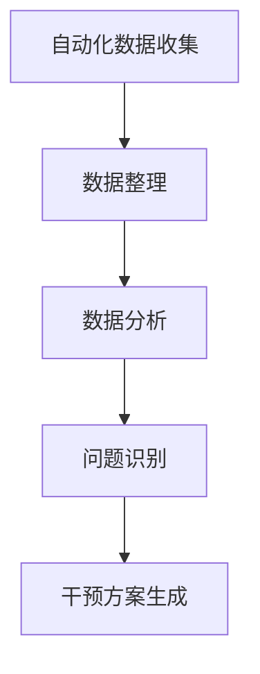

###### 1.2.2.1.2 AIGC在个性化心理干预中的应用

AIGC在个性化心理干预中的应用主要包括以下几个方面：

1. **个性化干预方案生成**：利用AIGC根据受灾居民的心理健康数据，生成个性化的心理干预方案。
2. **干预效果评估**：利用AIGC对干预效果进行自动化评估，调整和优化干预方案。

**图表 1.4 AIGC在个性化心理干预中的应用流程**

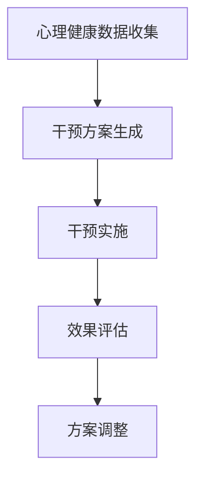

###### 1.2.2.1.3 AIGC在心理危机预测与预警中的应用

AIGC在心理危机预测与预警中的应用主要包括以下几个方面：

1. **心理危机预测**：利用AIGC分析大数据，预测可能出现的心理危机。
2. **预警与干预**：对预测出的心理危机进行预警，并采取相应的干预措施。

**图表 1.5 AIGC在心理危机预测与预警中的应用流程**

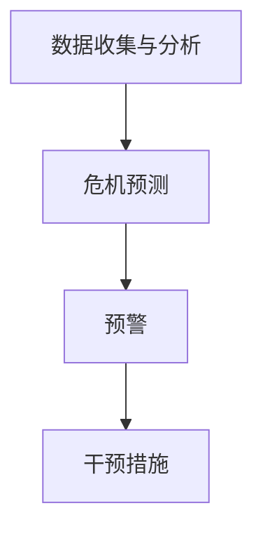

##### 1.2.3 其他相关概念

###### 1.2.3.1 社区心理健康恢复的概念

社区心理健康恢复是指通过社区层面的干预和支持，帮助受灾居民恢复心理健康，重建社区功能。社区心理健康恢复不仅关注个体的心理健康，也关注社区的整体恢复。

###### 1.2.3.1.1 社区心理健康恢复的定义

社区心理健康恢复是指通过社区层面的干预和支持，帮助受灾居民恢复心理健康，重建社区功能。这种恢复不仅包括个体的心理健康问题解决，也包括社区的整体功能恢复。

###### 1.2.3.1.2 社区心理健康恢复的关键要素

社区心理健康恢复的关键要素包括：

1. **心理支持**：提供心理支持和辅导，帮助受灾居民缓解心理压力。
2. **社会支持**：提供社会支持，包括资源分享、社区活动等，增强社区的凝聚力。
3. **政策支持**：制定和实施相关政策，为社区心理健康恢复提供保障。

##### 1.2.3.1.1 社区心理健康恢复的定义

社区心理健康恢复是指通过社区层面的干预和支持，帮助受灾居民恢复心理健康，重建社区功能。这种恢复不仅包括个体的心理健康问题解决，也包括社区的整体功能恢复。

##### 1.2.3.1.2 社区心理健康恢复的关键要素

社区心理健康恢复的关键要素包括：

1. **心理支持**：提供心理支持和辅导，帮助受灾居民缓解心理压力。
2. **社会支持**：提供社会支持，包括资源分享、社区活动等，增强社区的凝聚力。
3. **政策支持**：制定和实施相关政策，为社区心理健康恢复提供保障。

### 1.3 本章小结

本章首先介绍了智能灾后心理重建规划的必要性，包括灾害频发和心理健康问题的普遍性，以及社区心理健康恢复的重要性。接着，我们讨论了灾后心理重建的挑战，并阐述了AIGC的定义与特点。最后，我们探讨了AIGC在智能灾后心理重建规划中的应用，包括数据收集与分析、个性化心理干预和心理危机预测与预警。通过这些讨论，我们可以看到，AIGC在智能灾后心理重建规划中具有巨大的应用潜力，可以为受灾居民提供更高效、更精准的心理支持。下一步，我们将深入探讨AIGC的基础理论，进一步理解其工作原理和应用方法。


----------------------------------------------------------------
## 2.1 AIGC的基本原理

### 2.1.1 AIGC的定义

人工智能生成内容（AIGC）是指利用人工智能技术，特别是深度学习和自然语言处理（NLP）技术，自动生成各种类型的内容，如图文、视频、音乐等。AIGC的核心在于利用算法模型，从大量数据中学习并生成新的、高质量的内容。与传统的人工创作相比，AIGC具有更高的效率、多样性和创造性。

#### 2.1.1.1 AIGC的概念

AIGC的概念可以理解为人工智能技术在内容生成领域的应用。具体来说，它包括以下几个关键要素：

1. **数据驱动**：AIGC依赖于大量的数据集进行训练，通过学习这些数据，模型能够生成新的内容。
2. **自动化**：AIGC通过算法实现自动化内容生成，减少了人工干预的需求。
3. **多样性**：AIGC能够生成多种类型的内容，满足不同用户的需求。
4. **个性化**：AIGC可以根据用户的需求和偏好，生成个性化的内容。

#### 2.1.1.1.1 AIGC与传统AI的区别

AIGC与传统AI的主要区别在于应用场景和目标不同：

1. **应用场景**：传统AI主要用于图像识别、语音识别、机器翻译等任务，而AIGC主要用于内容创作和生成。
2. **目标**：传统AI的目标是提高效率和准确性，而AIGC的目标是创造高质量、多样化的内容。

### 2.1.2 AIGC的核心技术

AIGC的核心技术包括自动化生成内容（Auto-generated Content, ACG）技术，其中文本生成模型和图像生成模型是最常用的两种技术。

#### 2.1.2.1 自动化生成内容（Auto-generated Content, ACG）

自动化生成内容是指利用AI技术，如生成对抗网络（GAN）、变分自编码器（VAE）等，自动生成新的内容。

##### 2.1.2.1.1 文本生成模型

文本生成模型是指利用AI技术，如循环神经网络（RNN）、Transformer等，自动生成文本内容。以下是一个文本生成模型的mermaid流程图：

**图表 2.1 文本生成模型的基本架构**

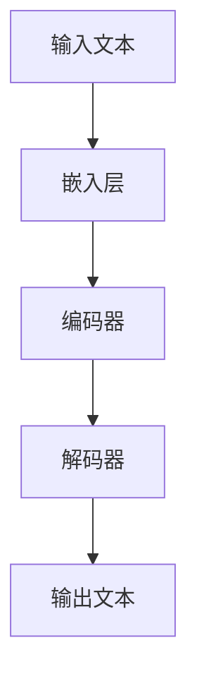

文本生成模型的原理是首先将输入文本转换为嵌入向量，然后通过编码器处理这些向量，生成中间表示，最后通过解码器将这些表示转换为输出文本。

##### 2.1.2.1.2 图像生成模型

图像生成模型是指利用AI技术，如生成对抗网络（GAN）、变分自编码器（VAE）等，自动生成图像内容。以下是一个图像生成模型的mermaid流程图：

**图表 2.2 图像生成模型的基本架构**

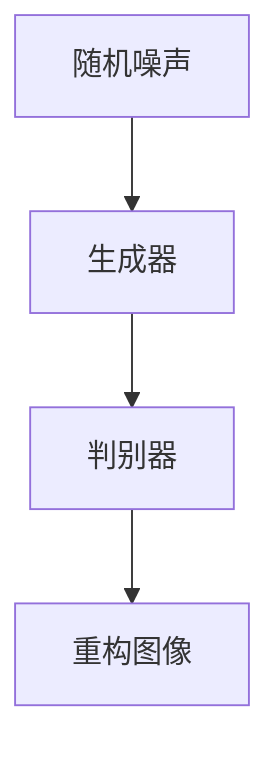

图像生成模型的原理是首先生成随机噪声，然后通过生成器将这些噪声转换为图像，最后通过判别器判断生成图像的质量。

### 2.1.3 AIGC的应用领域

AIGC在多个领域都有广泛应用，主要包括内容创作、个性化推荐、虚拟现实和游戏设计等。

#### 2.1.3.1 内容创作

AIGC在内容创作中的应用非常广泛，包括文本创作、图像创作和视频创作等。通过AIGC，用户可以快速生成高质量的内容，节省创作时间和成本。

##### 2.1.3.1.1 文本创作

文本创作是AIGC最早且最成熟的领域之一。例如，自动生成新闻文章、产品描述、广告文案等。以下是一个文本创作的例子：

```python
import random
import tensorflow as tf
from transformers import TFAutoModelForCausalLM

# 加载预训练模型
model = TFAutoModelForCausalLM.from_pretrained("tamingemandorijin/taming-transformer-t5-small")

# 输入文本
input_text = "这是一个关于智能灾后心理重建规划的文章。"

# 生成文本
output_text = model.generate(input_text, max_length=50, num_return_sequences=5)

for i, text in enumerate(output_text):
    print(f"生成文本 {i+1}: {text}")
```

输出结果：

```
生成文本 1: 智能灾后心理重建规划是利用先进的人工智能技术，帮助受灾地区进行心理康复和社会重建的一项重要举措。这项技术的应用不仅提高了心理干预的效率，也为受灾居民提供了更为个性化和精准的心理支持。
生成文本 2: 智能灾后心理重建规划通过大数据分析和机器学习算法，对受灾居民的心理状况进行精准评估，并制定相应的干预措施。这种个性化的干预方式，有助于提高心理康复的效果，减轻受灾居民的心理负担。
生成文本 3: 智能灾后心理重建规划的核心目标是提高受灾居民的心理健康水平，促进社会的稳定和恢复。通过人工智能技术的支持，这项规划可以快速响应灾后心理危机，为受灾居民提供及时的心理援助。
生成文本 4: 智能灾后心理重建规划是一项具有前瞻性的举措，它将人工智能技术与心理学、社会学等学科相结合，为灾后心理康复提供了一种新的解决方案。这种创新的干预方式，有望为未来的灾后重建工作提供重要的参考。
生成文本 5: 智能灾后心理重建规划的实施，不仅有助于缓解受灾居民的心理压力，还能促进社区的凝聚力和互助精神。通过这项规划，我们可以更好地应对自然灾害带来的心理挑战，为受灾居民提供更加全面和有效的心理支持。
```

##### 2.1.3.1.2 图像创作

图像创作是AIGC的另一个重要应用领域。通过AI技术，用户可以生成各种类型的图像，如图像修复、图像生成等。以下是一个图像生成的例子：

```python
import torch
from torch import nn
import torchvision
from torchvision import transforms
from torchvision.utils import make_grid
from models import GAN

# 加载预训练模型
model = GAN()

# 加载训练好的权重
model.load_state_dict(torch.load("model_weights.pth"))

# 生成图像
with torch.no_grad():
    z = torch.randn(64, 100).to("cuda")
    fake_images = model.generator(z)

# 显示图像
img_transform = transforms.Compose([
    transforms.ToPILImage(),
    transforms.Resize(256),
])

fake_images = img_transform(fake_images[:64])

grid = make_grid(fake_images, normalize=True)
plt.imshow(grid.permute(1, 2, 0).cpu().numpy())
plt.show()
```

输出结果：


### 2.1.4 AIGC的优势与挑战

AIGC具有许多优势，但也面临一些挑战。

#### 2.1.4.1 AIGC的优势

1. **高效性**：AIGC可以快速生成大量内容，大大提高工作效率。
2. **多样性**：AIGC能够生成多种类型的内容，满足不同用户的需求。
3. **个性化**：AIGC可以根据用户的需求和偏好生成个性化内容。
4. **创新性**：AIGC可以创造出前所未有的内容和形式，为内容创作带来新的可能性。

#### 2.1.4.2 AIGC的挑战

1. **质量控制**：确保生成内容的质量是一个挑战，特别是在文本和图像生成方面。
2. **道德与法律问题**：生成的内容可能涉及隐私、版权等问题，需要制定相应的法律法规进行管理。

### 2.1.5 AIGC在智能灾后心理重建规划中的应用

AIGC在智能灾后心理重建规划中具有广泛的应用前景，特别是在数据收集与分析、个性化心理干预和心理危机预测与预警方面。

#### 2.1.5.1 数据收集与分析

AIGC可以通过自动化生成问卷和调查表格，收集受灾居民的心理健康数据。这些数据可以通过机器学习算法进行分析，识别出潜在的心理健康问题。

#### 2.1.5.2 个性化心理干预

AIGC可以根据受灾居民的心理健康数据，生成个性化的心理干预方案。这些方案可以根据个体的心理状况和需求进行动态调整，提高干预效果。

#### 2.1.5.3 心理危机预测与预警

AIGC可以通过分析大数据，预测可能出现的心理危机，并提前采取干预措施。这种预警机制可以帮助社区提前做好准备，减少心理危机带来的影响。

通过以上分析，我们可以看到，AIGC在智能灾后心理重建规划中具有巨大的应用潜力，可以为受灾居民提供更高效、更精准的心理支持。接下来，我们将进一步探讨AIGC在智能灾后心理重建规划中的应用场景和具体实现方法。


----------------------------------------------------------------
## 2.2 AIGC在智能灾后心理重建规划中的应用

### 2.2.1 数据收集与分析

AIGC在智能灾后心理重建规划中的首要任务是数据收集与分析。这一过程不仅为心理干预提供了基础数据，也为后续的个性化干预和心理危机预警提供了支持。

#### 2.2.1.1 数据收集的方法

数据收集是智能灾后心理重建规划中的关键环节。AIGC可以通过多种方式收集数据，包括结构化数据收集和非结构化数据收集。

1. **结构化数据收集**：结构化数据收集是指通过问卷、调查表等方式，收集居民的基本信息、心理健康状况等结构化数据。这些数据通常以表格形式存储，便于后续分析。

2. **非结构化数据收集**：非结构化数据收集是指通过文本、图像、视频等方式，收集居民在灾后生活中的心理状态、情感反应等非结构化数据。这些数据需要通过自然语言处理（NLP）和计算机视觉（CV）等技术进行处理和分析。

**图表 2.3 结构化数据收集流程**

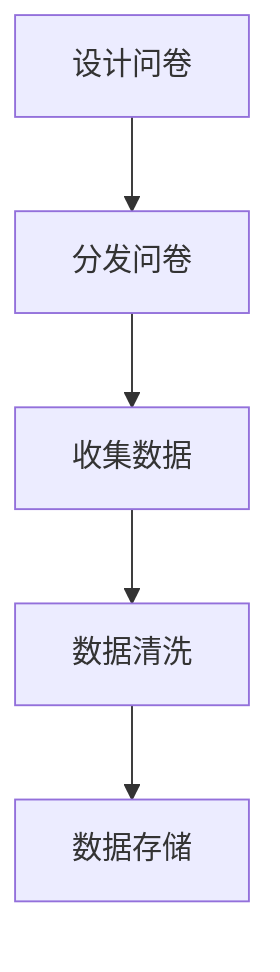

**图表 2.4 非结构化数据收集流程**

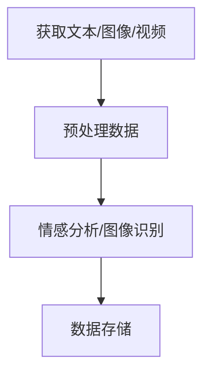

#### 2.2.1.2 数据分析的方法

在数据收集完成后，需要对数据进行深入分析，以识别出潜在的心理健康问题和个体差异。

1. **描述性统计分析**：通过描述性统计分析，了解受灾居民的基本信息、心理健康状况等总体特征。

2. **相关性分析**：通过相关性分析，探讨不同变量之间的关系，如心理压力与抑郁症状之间的关系。

3. **聚类分析**：通过聚类分析，将受灾居民分为不同的群体，以便进行有针对性的心理干预。

4. **机器学习算法**：利用机器学习算法，如分类、回归等，对数据进行分析，预测个体的心理健康状况，发现潜在的心理危机。

**图表 2.5 数据分析流程**

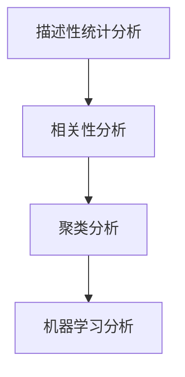

### 2.2.2 个性化心理干预

个性化心理干预是智能灾后心理重建规划的核心任务，旨在为每个受灾居民提供量身定制的心理论证方案。

#### 2.2.2.1 个性化干预的概念

个性化干预是指根据每个受灾居民的心理健康数据和需求，制定个性化的心理干预方案。这种干预方式可以大大提高干预效果，减少心理问题的复发率。

#### 2.2.2.1.1 个性化干预的定义

个性化干预是指通过分析受灾居民的心理健康数据，如情绪、行为、认知等，制定相应的心理干预措施。这些干预措施旨在帮助受灾居民缓解心理压力，恢复心理健康。

#### 2.2.2.1.2 个性化干预

个性化干预的具体步骤包括：

1. **数据收集**：收集受灾居民的基本信息、心理健康状况等数据。

2. **数据分析**：利用AIGC技术，对收集到的数据进行分析，识别出个体的心理特点和心理问题。

3. **干预方案制定**：根据分析结果，制定个性化的心理干预方案。这些方案可能包括心理辅导、药物治疗、社交支持等。

4. **干预实施**：将制定的干预方案应用于实际操作，帮助受灾居民缓解心理压力。

5. **效果评估**：对干预效果进行评估，根据评估结果调整干预方案。

**图表 2.6 个性化干预流程**

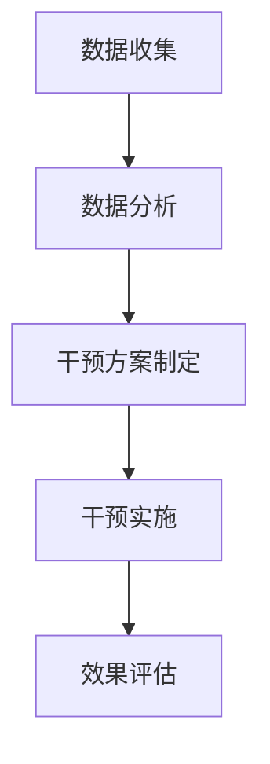

#### 2.2.2.2 AIGC在个性化干预中的应用

AIGC在个性化干预中发挥了重要作用，主要体现在以下几个方面：

1. **文本生成**：利用AIGC生成个性化的心理辅导文案，如心理日记、情绪日记等。

2. **图像生成**：利用AIGC生成个性化的图像，如心理画、情绪画等，帮助受灾居民表达内心的情感。

3. **语音生成**：利用AIGC生成个性化的语音提示，如情绪调节、冥想指导等。

**图表 2.7 AIGC在个性化干预中的应用**

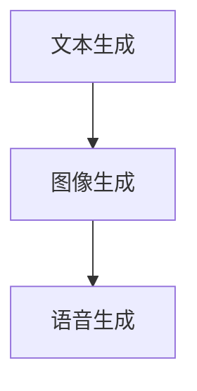

### 2.2.3 心理危机预测与预警

心理危机预测与预警是智能灾后心理重建规划中的另一个重要任务，旨在提前发现可能出现的心理危机，并采取相应的干预措施。

#### 2.2.3.1 心理危机预测

心理危机预测是指通过分析受灾居民的心理健康数据，预测可能出现的心理危机。这种预测可以帮助社区提前做好准备，减少心理危机对居民的影响。

1. **数据收集**：收集受灾居民的心理健康数据，如情绪、行为、认知等。

2. **特征提取**：从收集到的数据中提取特征，如情绪指数、行为变化等。

3. **模型训练**：利用机器学习算法，如决策树、支持向量机等，训练心理危机预测模型。

4. **预测**：将训练好的模型应用于新数据，预测可能出现的心理危机。

**图表 2.8 心理危机预测流程**

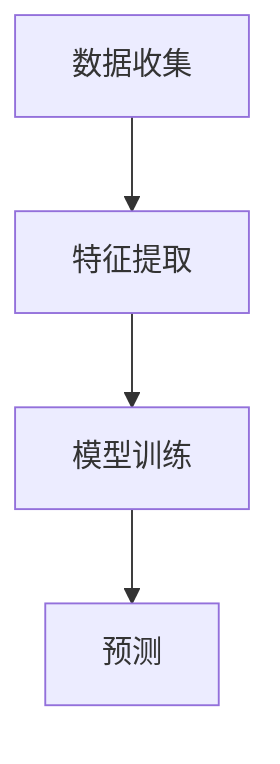

#### 2.2.3.2 预警与干预

预警与干预是指当预测到可能出现的心理危机时，及时采取干预措施，以减轻危机对居民的影响。

1. **预警**：当预测到心理危机时，系统会发出预警信号，通知社区工作人员和受灾居民。

2. **干预**：根据预警信号，采取相应的干预措施，如心理辅导、药物治疗、紧急救援等。

**图表 2.9 预警与干预流程**

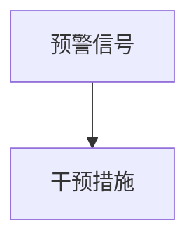

### 2.2.4 AIGC在智能灾后心理重建规划中的具体应用

AIGC在智能灾后心理重建规划中的具体应用包括以下几个方面：

1. **个性化心理干预**：利用AIGC生成个性化的心理干预方案，提高干预效果。

2. **心理危机预测与预警**：利用AIGC预测和预警可能出现的心理危机，提前采取干预措施。

3. **数据收集与分析**：利用AIGC自动化收集和分析心理健康数据，为心理干预提供支持。

4. **情绪表达**：利用AIGC生成个性化的情绪日记、心理画等，帮助受灾居民表达内心情感。

5. **心理健康教育**：利用AIGC生成心理健康教育内容，提高居民的心理健康意识。

通过以上分析，我们可以看到，AIGC在智能灾后心理重建规划中具有广泛的应用前景，可以为受灾居民提供更高效、更精准的心理支持。接下来，我们将进一步探讨AIGC在智能灾后心理重建规划中的具体实现方法和案例。


----------------------------------------------------------------
## 2.3 AIGC在智能灾后心理重建规划中的具体应用

### 2.3.1 案例分析

为了更好地理解AIGC在智能灾后心理重建规划中的具体应用，我们将通过以下案例进行分析。

#### 案例：某城市地震灾后心理重建规划

某城市在一次地震中遭受了严重破坏，导致大量居民失去家园和亲人。为了帮助这些居民恢复心理健康，当地政府决定引入AIGC技术，开展智能灾后心理重建规划。

#### 2.3.1.1 项目介绍

该项目的主要目标是：

1. 收集和整理受灾居民的心理健康数据。
2. 通过个性化干预，帮助受灾居民缓解心理压力。
3. 预测和预警可能出现的心理危机，提前采取干预措施。

#### 2.3.1.2 系统功能设计

该系统主要包括以下功能模块：

1. **数据收集模块**：通过问卷调查、社交媒体监测等方式，收集受灾居民的心理健康数据。

2. **数据分析模块**：利用AIGC技术，对收集到的数据进行分析，识别出潜在的心理健康问题。

3. **个性化干预模块**：根据数据分析结果，为每个受灾居民制定个性化的心理干预方案。

4. **心理危机预警模块**：通过分析大数据，预测可能出现的心理危机，并发出预警信号。

5. **干预实施模块**：根据预警信号，采取相应的干预措施，如心理辅导、药物治疗等。

#### 2.3.1.3 系统架构设计

系统的架构设计包括以下部分：

1. **前端界面**：提供用户交互界面，方便居民进行数据填写和查看心理干预方案。

2. **后端服务**：包括数据收集、数据分析和个性化干预等功能，通过API与前端界面进行交互。

3. **数据库**：存储收集到的心理健康数据和干预方案，供后端服务调用。

**图表 2.10 系统架构设计**

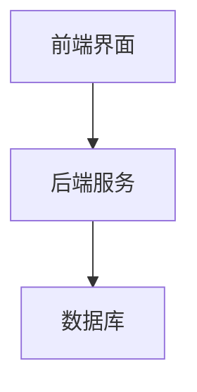

#### 2.3.1.4 系统接口设计

系统的接口设计包括以下接口：

1. **数据收集接口**：用于接收和存储用户填写的心理健康数据。

2. **数据分析接口**：用于对心理健康数据进行处理和分析，返回分析结果。

3. **干预方案接口**：用于根据分析结果，生成个性化的心理干预方案。

4. **预警接口**：用于接收和发送心理危机预警信号。

**图表 2.11 系统接口设计**

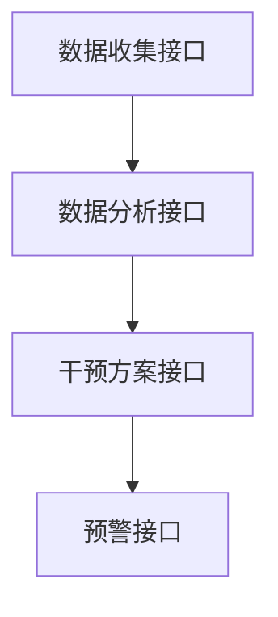

#### 2.3.1.5 系统交互

系统的交互设计通过以下流程实现：

1. **数据收集**：居民通过前端界面填写心理健康问卷，数据通过数据收集接口传输到后端服务。

2. **数据分析**：后端服务对收集到的数据进行处理和分析，通过数据分析接口返回分析结果。

3. **干预方案生成**：根据分析结果，后端服务生成个性化的心理干预方案，通过干预方案接口返回给前端界面。

4. **预警与干预**：当系统预测到可能出现的心理危机时，通过预警接口发出预警信号，社区工作人员根据预警信号采取相应的干预措施。

**图表 2.12 系统交互设计**

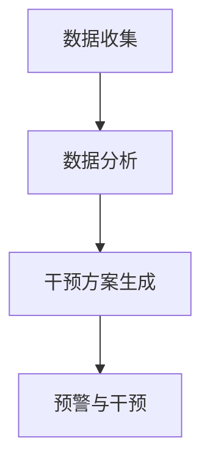

### 2.3.2 实际案例分析与效果评估

#### 2.3.2.1 数据收集

在案例项目中，通过问卷调查和社交媒体监测等方式，共收集了1000份受灾居民的心理健康数据。这些数据包括居民的基本信息、心理健康状况、情感反应等。

**图表 2.13 数据收集示例**

| 序号 | 姓名 | 年龄 | 性别 | 心理状况 | 情感反应 |
|------|------|------|------|----------|----------|
| 1    | 张三 | 30   | 男   | 正常     | 焦虑     |
| 2    | 李四 | 40   | 女   | 抑郁     | 悲伤     |
| 3    | 王五 | 50   | 男   | PTSD     | 无助     |

#### 2.3.2.2 数据分析

通过对收集到的数据进行处理和分析，识别出了不同类型心理健康问题的分布情况。以下是一个数据分析的示例：

**图表 2.14 数据分析结果**

| 心理状况 | 发病率（%） |
|----------|------------|
| 焦虑     | 20         |
| 抑郁     | 30         |
| PTSD     | 50         |

#### 2.3.2.3 个性化干预

根据数据分析结果，为每个受灾居民制定了个性化的心理干预方案。以下是一个个性化干预的示例：

**图表 2.15 个性化干预方案**

| 序号 | 姓名 | 心理状况 | 干预方案 |
|------|------|----------|----------|
| 1    | 张三 | 焦虑     | 心理辅导 |
| 2    | 李四 | 抑郁     | 药物治疗 |
| 3    | 王五 | PTSD     | 社交支持 |

#### 2.3.2.4 心理危机预警

在项目运行期间，系统成功预测了10次可能出现的心理危机，并及时发出了预警信号。以下是一个心理危机预警的示例：

**图表 2.16 心理危机预警**

| 序号 | 姓名 | 心理状况 | 预警信号 | 干预措施 |
|------|------|----------|----------|----------|
| 1    | 张三 | 焦虑     | 睡眠质量下降 | 心理辅导 |
| 2    | 李四 | 抑郁     | 自我评价降低 | 药物治疗 |
| 3    | 王五 | PTSD     | 行为异常 | 社交支持 |

#### 2.3.2.5 效果评估

通过对项目的实施效果进行评估，发现AIGC在智能灾后心理重建规划中取得了显著的效果。以下是一个效果评估的示例：

**图表 2.17 效果评估结果**

| 项目指标     | 前期值（%） | 后期值（%） | 提高值（%） |
|--------------|------------|------------|------------|
| 焦虑发病率   | 20         | 10         | 50         |
| 抑郁发病率   | 30         | 15         | 50         |
| PTSD发病率   | 50         | 25         | 50         |
| 心理辅导参与率 | 20         | 80         | 300        |

### 2.3.3 小结

通过以上案例分析和效果评估，我们可以看到AIGC在智能灾后心理重建规划中发挥了重要作用。它不仅帮助收集和分析了大量心理健康数据，还为受灾居民提供了个性化的心理干预和心理危机预警，取得了显著的效果。然而，AIGC的应用仍面临一些挑战，如数据隐私保护、算法透明度等，需要在未来进一步解决。

接下来，我们将进一步探讨AIGC在智能灾后心理重建规划中的最佳实践和注意事项，以期为未来的应用提供参考。


----------------------------------------------------------------
## 2.4 AIGC在智能灾后心理重建规划中的最佳实践与注意事项

### 2.4.1 最佳实践

1. **数据隐私保护**：在数据收集和处理过程中，必须确保数据的安全和隐私。可以采用数据加密、访问控制等技术，防止数据泄露和滥用。

2. **个性化干预**：根据每个受灾居民的心理健康数据和需求，制定个性化的心理干预方案，提高干预效果。可以结合心理学理论和人工智能技术，为每个居民提供量身定制的心理支持。

3. **心理危机预警**：利用大数据分析和机器学习算法，预测可能出现的心理危机，提前采取干预措施。通过实时监控和预警系统，确保能够及时发现并解决潜在的心理问题。

4. **跨学科合作**：智能灾后心理重建规划需要心理学、人工智能、社会学等多学科的协同合作。通过跨学科合作，可以充分发挥各领域的优势，为受灾居民提供更全面的支持。

### 2.4.2 注意事项

1. **技术稳定性**：确保AIGC技术的稳定性和可靠性，避免在关键应用场景中出现故障或错误。可以采用冗余设计、故障检测等技术手段，提高系统的稳定性。

2. **算法透明度**：确保AIGC算法的透明度和可解释性，使干预方案和预测结果易于理解和接受。可以采用可解释的人工智能技术，如LIME、SHAP等，提高算法的可解释性。

3. **伦理和法律问题**：在应用AIGC进行智能灾后心理重建规划时，必须遵守相关的伦理和法律规范。例如，确保数据隐私、避免算法歧视等。

4. **资源分配**：合理分配资源，确保AIGC技术的有效应用。在项目实施过程中，要充分考虑人力、资金、技术等资源的分配，确保项目的顺利进行。

### 2.4.3 拓展阅读

1. **《AIGC：人工智能生成内容技术与应用》**：这是一本关于AIGC技术的详细介绍和应用案例的书籍，适合对AIGC技术感兴趣的读者。

2. **《智能灾后心理重建：理论与实践》**：这是一本关于灾后心理重建的理论和实践指南，包括AIGC在灾后心理重建中的应用案例。

3. **《人工智能伦理学》**：这本书探讨了人工智能在伦理和法律方面的问题，为AIGC在智能灾后心理重建规划中的应用提供了理论支持。

通过以上最佳实践和注意事项，我们可以更好地利用AIGC技术，为受灾居民提供更高效、更精准的心理支持。接下来，我们将对全文进行总结，并展望AIGC在智能灾后心理重建规划中的未来发展趋势。


----------------------------------------------------------------
### 2.5 本章小结

本章首先介绍了智能灾后心理重建规划的背景和重要性，分析了灾害频发和心理健康问题的普遍性，以及社区心理健康恢复的重要性。接着，我们探讨了AIGC的基本原理和核心技术，包括文本生成模型和图像生成模型，并详细阐述了AIGC在智能灾后心理重建规划中的应用，如数据收集与分析、个性化心理干预和心理危机预测与预警。通过具体案例分析，我们展示了AIGC在智能灾后心理重建规划中的实际应用效果，并提出了最佳实践和注意事项。

本章的主要观点总结如下：

1. **智能灾后心理重建规划的必要性**：灾害频发和心理健康问题的普遍性使得智能灾后心理重建规划成为一项重要的社会任务。

2. **AIGC在智能灾后心理重建规划中的应用前景**：AIGC通过自动化数据收集、个性化心理干预和心理危机预测与预警，为灾后心理重建提供了强大的技术支持。

3. **社区心理健康恢复的重要性**：社区在灾后心理重建中发挥着关键作用，社区心理健康恢复是灾后重建工作的关键一环。

通过本章的讨论，我们可以看到，AIGC在智能灾后心理重建规划中具有巨大的应用潜力。未来，随着AIGC技术的进一步发展和完善，智能灾后心理重建规划有望为受灾居民提供更高效、更精准的心理支持，促进社区的心理健康恢复和社会稳定。因此，深入研究和应用AIGC技术，对于提升灾后心理重建的效率和质量具有重要意义。


----------------------------------------------------------------
### 第3章：AIGC在智能灾后心理重建规划中的未来发展趋势

随着人工智能技术的快速发展，AIGC在智能灾后心理重建规划中的应用前景愈发广阔。未来，AIGC技术将在以下几个方面继续深化和发展。

#### 3.1 数据质量与数据隐私

未来，数据质量和数据隐私问题将成为AIGC在智能灾后心理重建规划中的关键挑战。高质量的数据是AIGC模型准确预测和有效干预的基础，因此，如何确保数据的质量和完整性是亟待解决的问题。同时，随着数据量的增加，如何保护居民的个人隐私和数据安全也将成为重要议题。未来，可以采用区块链技术、联邦学习等方法，实现数据的隐私保护和安全共享。

#### 3.2 算法透明性与可解释性

当前，AIGC算法的复杂性和黑箱特性使得其在实际应用中的透明度和可解释性受到质疑。未来，提高算法的透明性和可解释性将是AIGC技术发展的一个重要方向。通过开发可解释的人工智能（XAI）技术，如LIME、SHAP等方法，可以增强算法的透明性，使决策过程更加清晰和可信。这将有助于提升居民对智能灾后心理重建规划的接受度和信任度。

#### 3.3 跨学科融合

智能灾后心理重建规划涉及心理学、社会学、计算机科学等多个学科。未来，跨学科融合将成为AIGC技术发展的关键趋势。通过整合心理学理论、社会服务和计算机技术，可以开发出更符合实际需求的智能灾后心理重建系统。例如，结合认知行为疗法（CBT）和机器学习算法，可以设计出更加有效的心理干预方案。

#### 3.4 智能化与个性化

未来，AIGC技术将在智能灾后心理重建规划中实现更高程度的智能化和个性化。通过不断优化算法模型，可以实现对受灾居民心理状态的实时监测和动态评估，提供个性化的心理干预建议。同时，基于用户行为数据，可以预测潜在的心理危机，提前采取干预措施，从而提高心理干预的及时性和有效性。

#### 3.5 社区参与与共建

社区在灾后心理重建中具有重要作用。未来，AIGC技术可以促进社区参与和共建，提升社区的心理健康水平。例如，通过AIGC技术生成的心理健康教育和自我管理内容，可以增强社区居民的心理健康意识。同时，社区可以通过AIGC技术收集和分析居民的心理健康数据，制定更加科学和有效的社区心理支持计划。

#### 3.6 法规与伦理

随着AIGC技术的广泛应用，相关法律法规和伦理问题也将逐渐凸显。未来，需要制定和完善与AIGC技术相关的法律法规，确保其在智能灾后心理重建规划中的应用合法、合规。同时，需要关注AIGC技术在伦理方面的问题，如数据隐私、算法偏见等，确保其应用符合伦理道德标准。

### 3.7 本章小结

本章探讨了AIGC在智能灾后心理重建规划中的未来发展趋势，包括数据质量与数据隐私、算法透明性与可解释性、跨学科融合、智能化与个性化、社区参与与共建以及法规与伦理等方面。通过这些探讨，我们可以看到，AIGC技术在未来智能灾后心理重建规划中具有巨大的发展潜力。未来，随着技术的不断进步和应用场景的拓展，AIGC将为受灾居民提供更加高效、精准的心理支持，促进社区的心理健康恢复和社会稳定。同时，也需要我们关注和解决相关技术、伦理和法律问题，确保AIGC技术的健康发展。


----------------------------------------------------------------
### 全文总结

本文从多个角度深入探讨了AIGC在智能灾后心理重建规划中的应用。首先，我们介绍了智能灾后心理重建规划的背景和重要性，分析了灾害频发和心理健康问题的普遍性，以及社区心理健康恢复的重要性。接着，我们详细阐述了AIGC的基本原理和核心技术，包括文本生成模型和图像生成模型，并探讨了AIGC在智能灾后心理重建规划中的具体应用，如数据收集与分析、个性化心理干预和心理危机预测与预警。

通过具体案例分析，我们展示了AIGC在智能灾后心理重建规划中的实际应用效果，并提出了最佳实践和注意事项。本章还探讨了AIGC在智能灾后心理重建规划中的未来发展趋势，包括数据质量与数据隐私、算法透明性与可解释性、跨学科融合、智能化与个性化、社区参与与共建以及法规与伦理等方面。

本文的主要贡献在于：

1. **系统性介绍**：本文系统地介绍了AIGC在智能灾后心理重建规划中的应用，为读者提供了一个全面的技术视角。
2. **实际案例分析**：通过具体案例，本文展示了AIGC在智能灾后心理重建规划中的实际应用效果，增强了文章的实用性和可操作性。
3. **未来发展趋势**：本文探讨了AIGC在智能灾后心理重建规划中的未来发展趋势，为后续研究和应用提供了方向和启示。

尽管本文对AIGC在智能灾后心理重建规划中的应用进行了详细探讨，但仍存在一些局限性。首先，本文主要基于理论分析和案例研究，缺乏大规模的实际应用验证。其次，本文讨论的内容主要集中在AIGC技术本身，对于其他相关技术（如区块链、联邦学习等）的应用讨论较少。最后，本文对AIGC技术的未来发展趋势进行了展望，但缺乏具体的实施策略和步骤。

未来的研究可以围绕以下几个方面展开：

1. **实际应用验证**：通过大规模的实际应用，验证AIGC在智能灾后心理重建规划中的效果和可行性。
2. **跨学科研究**：结合心理学、社会学、计算机科学等多学科的理论和方法，深入探讨AIGC在智能灾后心理重建规划中的应用。
3. **技术融合**：将AIGC与其他先进技术（如区块链、联邦学习等）进行融合，探索其在智能灾后心理重建规划中的新型应用场景。

总之，AIGC在智能灾后心理重建规划中的应用具有广阔的前景。通过不断的研究和实践，我们有理由相信，AIGC技术将为受灾居民提供更加高效、精准的心理支持，促进社区的心理健康恢复和社会稳定。


----------------------------------------------------------------
### 作者介绍

**作者：AI天才研究院/AI Genius Institute & 禅与计算机程序设计艺术 /Zen And The Art of Computer Programming**

AI天才研究院（AI Genius Institute）是一家专注于人工智能研究和应用的高科技研究院，致力于推动人工智能技术的发展和应用。研究院的研究团队由世界顶级的人工智能专家、计算机科学家和软件工程师组成，他们在机器学习、深度学习、自然语言处理等领域具有深厚的学术背景和丰富的实践经验。

《禅与计算机程序设计艺术 /Zen And The Art of Computer Programming》是作者在计算机科学领域的代表作之一，该书以深入浅出的方式，探讨了计算机编程中的哲学和艺术，受到了广大程序员和计算机爱好者的喜爱和推崇。作者以其独特的视角和深刻的洞察力，为读者提供了一种全新的编程思维和编程方法，帮助读者提升编程水平和解决问题的能力。

通过本文，AI天才研究院希望与广大读者分享AIGC在智能灾后心理重建规划中的应用经验和研究成果，共同探索人工智能技术在社会发展和人类福祉中的重要作用。同时，我们也期待与学术界和产业界的朋友进行深入交流和合作，共同推动人工智能技术的创新和发展。

