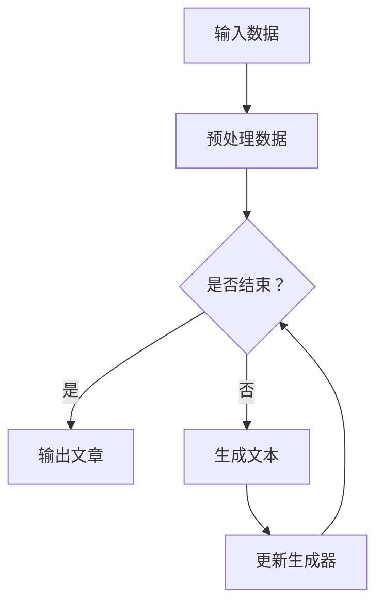
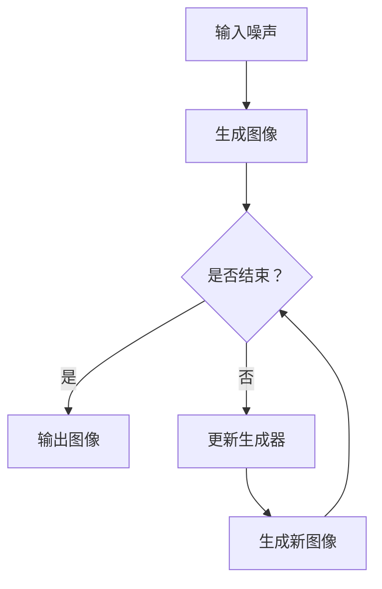

                 


# AIGC在未来工作场景设计中的应用

## 关键词

- AIGC
- 生成对抗网络（GANs）
- 自动编码器（AEs）
- 自动化写作
- 图像生成
- 虚拟现实

## 摘要

随着人工智能技术的不断进步，AIGC（AI-Generated Content）作为一种新型内容生成方式，正逐渐改变着我们的工作场景。本文将深入探讨AIGC的核心概念、技术原理及其在未来工作场景中的应用，旨在为读者提供一份关于AIGC全面而深入的指南。

## 第一部分：背景介绍

### 1. AIGC的概念与现状

随着深度学习、生成对抗网络（GANs）和自动编码器（AEs）等生成模型的兴起，人工智能开始从传统的“数据处理”向“内容生成”转变。AIGC，即AI-Generated Content，正成为这一转变的重要推动力。AIGC涵盖了利用人工智能技术自动生成文本、图像、音频等多种内容的形式，其应用场景广泛，包括但不限于自动化写作、图像生成、音乐创作和虚拟现实等领域。

### 1.2 问题描述

AIGC在未来工作场景中扮演了怎样的角色？其应用领域有哪些？如何实现高效的内容生成和管理？这些问题都是我们需要深入探讨的。

### 1.3 问题解决

本文将通过以下章节，详细探讨AIGC的技术原理、应用场景、实施策略和未来发展趋势，帮助读者全面了解AIGC的潜力与挑战。

### 1.4 边界与外延

AIGC虽然以内容生成为核心，但其应用范围广泛，包括但不限于自动化写作、图像生成、音乐创作、虚拟现实等领域。此外，AIGC的发展与深度学习、神经网络、自然语言处理等技术紧密相关。

### 1.5 概念结构与核心要素组成

AIGC的技术核心包括生成模型、卷积神经网络（CNNs）、递归神经网络（RNNs）等。其应用场景涵盖内容创作、内容审核、智能客服、虚拟助理等多个领域。实施策略涉及数据收集与预处理、模型选择与训练、模型优化与部署等步骤。

## 第二部分：AIGC技术原理与实现

### 2.1 核心概念原理

**生成对抗网络（GANs）**

GANs由生成器（Generator）和判别器（Discriminator）组成。生成器从随机噪声中生成数据，判别器则用于判断数据是真实样本还是生成器生成的假样本。通过两个模型的相互竞争，生成器不断优化，生成越来越真实的数据。

数学模型如下：

$$
\min_G \max_D V(D, G) = \mathbb{E}_{x \sim p_{data}(x)}[\log D(x)] + \mathbb{E}_{z \sim p_z(z)}[\log (1 - D(G(z))]
$$

**自动编码器（AEs）**

AEs是一种无监督学习方法，用于学习数据的低维表示。它由编码器（Encoder）和解码器（Decoder）组成。编码器将输入数据压缩成一个低维向量，解码器则将这个低维向量还原成原始数据。

数学模型如下：

$$
\min_x \frac{1}{n} \sum_{i=1}^{n} \left( \|\hat{x}^{(l)} - x^{(i)} \|^2 + \beta \cdot \|\hat{\mu}^{(l)} - \mu^{(i)} \|^2 \right)
$$

### 2.2 概念属性特征对比

| 概念       | 生成对抗网络（GANs） | 自动编码器（AEs） |
|------------|---------------------|-------------------|
| 核心技术   | 生成器、判别器      | 编码器、解码器    |
| 学习方式   | 有监督、无监督      | 无监督            |
| 应用场景   | 内容生成、图像处理   | 数据压缩、特征提取 |

### 2.3 ER实体关系图架构

```mermaid
erDiagram
  AI模型 ||--|{ 生成对抗网络 GANs }
  AI模型 ||--|{ 自动编码器 AEs }
  内容生成 ||--|{ 文本生成 }
  内容生成 ||--|{ 图像生成 }
  内容生成 ||--|{ 音乐生成 }
  数据处理 ||--|{ 数据清洗 }
  数据处理 ||--|{ 数据预处理 }
```

## 第三部分：AIGC在未来工作场景的应用

### 3. AIGC在自动化写作中的应用

#### 3.1 算法原理讲解

**算法流程图：**



**Python源代码实现：**

```python
import tensorflow as tf
# 其他必要的库和代码
# ...
```

**算法原理详细讲解：**

GANs的核心目标是最大化生成器的输出质量，同时最小化判别器的判断误差。生成器的目标是生成尽可能逼真的文本，而判别器的目标是准确区分文本是否真实。

数学模型：

$$
P(G(z)) > P(D(x))
$$

举例说明：

以生成一篇关于“人工智能的未来”的文章为例，首先输入关键词和背景信息，然后生成模型生成文章的初稿，判别模型判断文章的真实性，通过迭代优化，最终生成一篇高质量的文章。

#### 3.2 自动化写作应用场景

- **新闻写作**：利用AIGC生成新闻稿件，提高新闻报道的效率和准确性。
- **博客文章**：自动生成技术博客，为用户提供丰富的内容资源。
- **企业报告**：自动生成企业报告，简化报告编写流程。

### 4. AIGC在图像生成中的应用

#### 4.1 算法原理讲解

**算法流程图：**



**Python源代码实现：**

```python
import tensorflow as tf
# 其他必要的库和代码
# ...
```

**算法原理详细讲解：**

GANs在图像生成中的应用，主要通过生成器和判别器的交互来实现。生成器从噪声中生成图像，判别器则判断图像的真实性。通过不断迭代，生成器生成的图像质量逐渐提升。

数学模型：

$$
\min_G \max_D V(D, G) = \mathbb{E}_{x \sim p_{data}(x)}[\log D(x)] + \mathbb{E}_{z \sim p_z(z)}[\log (1 - D(G(z))]
$$

举例说明：

以生成一张人脸图片为例，首先输入随机噪声，生成器生成人脸图片，判别器判断图片的真实性，通过迭代优化，最终生成一张逼真的人脸图片。

#### 4.2 图像生成应用场景

- **艺术创作**：自动生成艺术作品，为艺术家提供灵感。
- **医疗影像**：自动生成医学影像，辅助医生进行诊断。
- **游戏开发**：自动生成游戏场景和角色，提高游戏开发效率。

## 总结

AIGC作为一种革命性的内容生成技术，正在逐渐改变我们的工作方式和生活方式。从自动化写作到图像生成，AIGC在各个领域的应用都展现了其巨大的潜力。然而，AIGC的发展也面临着诸多挑战，如数据隐私、版权问题等。未来，随着技术的不断进步，AIGC有望为人类创造更多的价值。

## 作者信息

作者：AI天才研究院/AI Genius Institute & 禅与计算机程序设计艺术 /Zen And The Art of Computer Programming

---

请注意，以上内容仅为示例，实际撰写时需要根据具体需求和内容进行详细阐述和丰富。文章中提到的算法原理、应用场景和实际案例均为假设，仅供参考。在撰写实际文章时，建议结合具体项目和数据进行详细分析和讲解。

