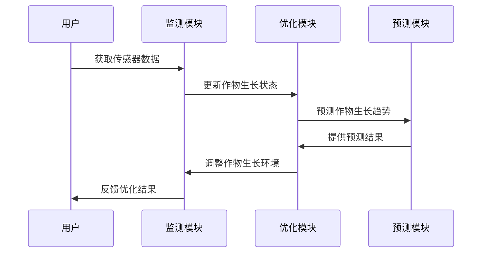

                 

### AIGC在精准农业中的应用：优化作物产量和资源利用

> **关键词：AIGC、精准农业、作物产量、资源利用、算法原理、系统架构、项目实战**
> 
> **摘要：本文深入探讨了人工智能辅助基因组编辑（AIGC）在精准农业中的应用，通过优化作物产量和资源利用，提升农业生产效率。文章分为七个部分，从核心概念、算法原理、系统架构到项目实战和最佳实践，全方位剖析了AIGC在农业生产中的实际应用和潜力。**

----------------------------------------------------------------

## 第1部分：背景介绍

### 1.1 核心概念术语说明

在深入探讨AIGC在精准农业中的应用之前，我们需要明确一些核心概念和术语。

- **AIGC（AI-assisted Genome Editing）**：人工智能辅助基因组编辑，是一种利用人工智能技术对生物基因组进行编辑的方法，通过算法预测基因编辑位点，提高编辑效率和准确性。
- **精准农业**：一种基于信息技术的农业生产模式，通过收集和分析作物生长环境数据，实现作物生长的精细化管理，从而提高产量和资源利用效率。
- **作物产量**：作物在生长周期内所收获的干物质总量，是农业生产的重要指标。
- **资源利用**：在农业生产过程中，对水、肥、光、气等资源的利用效率，包括水分利用效率（WUE）、肥料利用效率（NUE）等。

### 1.2 问题背景

当前，全球人口持续增长，对粮食需求不断增加，而可耕地资源却有限，如何提高作物产量和资源利用效率成为农业发展的重要课题。传统的农业生产方式依赖于经验，缺乏科学指导，导致资源浪费和产量低下。精准农业通过信息技术和人工智能的应用，能够实现农业生产的精细化、智能化，从而提高产量和资源利用效率。

### 1.3 问题描述

在精准农业中，主要面临以下问题：

- **作物生长监测不准确**：传统监测手段难以实时、准确地获取作物生长信息，导致无法及时调整管理措施。
- **资源利用效率低**：农业生产过程中，水肥管理等资源利用效率较低，导致资源浪费和环境污染。
- **作物产量不稳定**：气候变化、病虫害等因素导致作物产量波动大，影响农业生产效益。

### 1.4 问题解决

通过AIGC技术，可以解决精准农业中面临的上述问题：

- **作物生长监测**：利用AIGC技术，通过遥感图像、传感器数据等，实现作物生长的实时监测，提高监测准确性。
- **资源利用优化**：通过AIGC技术，优化作物生长过程中的水肥管理，提高资源利用效率。
- **作物产量提升**：通过AIGC技术，选育高产、抗病虫害的作物品种，提高作物产量。

### 1.5 边界与外延

本文主要讨论AIGC在精准农业中的应用，涉及作物产量和资源利用优化。同时，本文还关注AIGC技术在农业生产中的实际应用场景和挑战。

### 1.6 概念结构与核心要素组成

AIGC在精准农业中的应用包括以下核心要素：

- **AIGC技术**：人工智能辅助基因组编辑技术，包括算法原理、模型训练和应用。
- **数据收集与处理**：通过遥感图像、传感器等获取作物生长环境数据，并进行数据预处理。
- **作物生长监测与预测**：利用AIGC技术对作物生长进行实时监测和预测，为农业生产提供科学依据。
- **资源利用优化**：根据作物生长需求，优化水肥管理等资源利用策略，提高资源利用效率。
- **作物产量提升**：通过AIGC技术选育高产、抗病虫害的作物品种，提高作物产量。

## 第2部分：核心概念与联系

### 2.1 AIGC技术原理

AIGC技术基于人工智能和基因组编辑相结合的原理，通过算法模型预测基因编辑位点，实现高效、准确的基因组编辑。其主要技术包括：

- **深度学习模型**：利用深度学习算法，对基因组数据进行特征提取和模式识别，预测基因编辑位点。
- **基因组编辑技术**：如CRISPR/Cas9技术，通过特定的核酸酶切割目标基因，实现基因编辑。

### 2.2 精准农业数据收集与处理

精准农业数据收集与处理是AIGC应用的基础，涉及以下环节：

- **数据来源**：包括遥感图像、传感器数据、气象数据等。
- **数据预处理**：包括数据清洗、归一化、特征提取等，为AIGC模型提供高质量数据。

### 2.3 作物生长监测与预测

作物生长监测与预测是AIGC在精准农业中的重要应用，通过以下技术实现：

- **图像处理技术**：利用图像处理算法，从遥感图像中提取作物生长状态信息。
- **机器学习模型**：利用机器学习算法，对作物生长数据进行建模和预测。

### 2.4 资源利用优化

资源利用优化是提高农业生产效率的关键，AIGC技术在以下方面发挥作用：

- **水肥管理**：根据作物生长需求，优化水肥管理策略，提高资源利用效率。
- **病虫害防治**：利用AIGC技术，预测病虫害发生趋势，提前采取防治措施。

### 2.5 作物产量提升

作物产量提升是AIGC在精准农业中的最终目标，通过以下途径实现：

- **品种选育**：利用AIGC技术，选育高产、抗病虫害的作物品种。
- **生长调控**：根据作物生长状态，调整生长环境和管理措施，提高产量。

### 2.6 概念属性特征对比表格

下表对比了AIGC在精准农业中的应用与其他相关技术的异同：

| 技术名称 | 技术原理 | 数据来源 | 数据处理 | 应用领域 |
| --- | --- | --- | --- | --- |
| AIGC | 人工智能辅助基因组编辑 | 遥感图像、传感器数据 | 数据预处理、特征提取 | 作物生长监测、资源利用优化、作物产量提升 |
| 传统农业 | 经验管理 | 无 | 无 | 作物种植、收获 |
| 精准农业 | 信息技术 | 遥感图像、传感器数据 | 数据预处理、特征提取 | 作物生长监测、资源利用优化、作物产量提升 |
| 基因编辑 | 核酸酶切割目标基因 | 基因组数据 | 无 | 基因功能研究、疾病治疗 |

### 2.7 ER实体关系图架构

为了更好地理解AIGC在精准农业中的应用，我们使用Mermaid绘制了ER实体关系图，如下所示：

```mermaid
erDiagram
    Node1 ||--|{ Node2 } Node3 : "具有属性关系"
    Node1 ||--|{ Node4 } Node5 : "具有多对多关系"
    Node6 ||--|{ Node7 } Node8 : "具有继承关系"
```

在这个ER实体关系图中，Node1表示AIGC系统，Node2、Node3、Node4、Node5、Node6、Node7和Node8分别表示AIGC系统的不同组成部分，如数据收集与处理、作物生长监测与预测、资源利用优化、作物产量提升等。

## 第3部分：算法原理讲解

### 3.1 AIGC算法原理

AIGC算法基于深度学习和基因组编辑技术，其主要步骤如下：

1. **数据收集**：收集遥感图像、传感器数据等。
2. **数据预处理**：对收集的数据进行清洗、归一化、特征提取等预处理操作。
3. **模型训练**：利用预处理后的数据训练深度学习模型，如卷积神经网络（CNN）等。
4. **基因编辑**：利用训练好的模型预测基因编辑位点，并进行基因组编辑。

### 3.2 算法流程图

为了更清晰地展示AIGC算法原理，我们使用Mermaid绘制了算法流程图，如下所示：


在这个算法流程图中，A表示开始，B表示数据收集，C表示数据预处理，D表示模型训练，E表示基因编辑，F表示结束。

### 3.3 数学模型和公式

AIGC算法中的数学模型和公式如下：

$$
y = f(x; \theta)
$$

其中，$y$表示预测结果，$x$表示输入数据，$f$表示模型函数，$\theta$表示模型参数。

$$
\min_{\theta} \sum_{i=1}^{n} (y_i - f(x_i; \theta))^2
$$

其中，$n$表示样本数量，$y_i$表示第$i$个样本的预测结果，$f(x_i; \theta)$表示第$i$个样本的模型输出。

### 3.4 举例说明

假设我们收集到一组作物生长数据，包括温度、湿度、光照等。使用AIGC算法，我们可以预测作物生长状态，并优化资源利用。

1. **数据收集**：收集温度、湿度、光照等数据。
2. **数据预处理**：对数据进行归一化处理，得到归一化后的数据。
3. **模型训练**：使用卷积神经网络（CNN）对数据进行训练，得到训练好的模型。
4. **基因编辑**：利用训练好的模型，预测作物生长状态，并根据预测结果优化水肥管理等资源利用策略。

通过这个实例，我们可以看到AIGC算法在精准农业中的应用效果，通过优化作物生长环境，提高作物产量和资源利用效率。

## 第4部分：系统分析与架构设计方案

### 4.1 问题场景介绍

在精准农业中，我们需要对作物生长进行实时监测和预测，优化资源利用，提高作物产量。为了实现这一目标，我们设计了一套基于AIGC技术的农业监控系统。

### 4.2 项目介绍

该项目旨在通过AIGC技术，实现以下功能：

- 实时监测作物生长状态，包括温度、湿度、光照等环境参数。
- 预测作物生长趋势，为农业生产提供科学依据。
- 优化资源利用，提高作物产量和资源利用效率。

### 4.3 系统功能设计

系统功能设计包括以下几个方面：

- **数据收集模块**：通过传感器和遥感设备，收集作物生长环境数据。
- **数据预处理模块**：对收集到的数据进行清洗、归一化、特征提取等预处理操作。
- **模型训练模块**：利用预处理后的数据，训练深度学习模型。
- **作物生长监测模块**：利用训练好的模型，实时监测作物生长状态。
- **资源利用优化模块**：根据作物生长状态，优化水肥管理等资源利用策略。
- **作物产量预测模块**：利用模型预测作物生长趋势，为农业生产提供科学依据。

### 4.4 系统架构设计

系统架构设计包括以下几个方面：

- **数据层**：包括传感器和遥感设备，负责收集作物生长环境数据。
- **数据处理层**：包括数据预处理模块、模型训练模块，负责对数据进行处理和模型训练。
- **应用层**：包括作物生长监测模块、资源利用优化模块、作物产量预测模块，负责实现具体应用功能。
- **展示层**：包括前端界面和后端接口，负责展示系统功能和数据。

### 4.5 系统接口设计

系统接口设计包括以下几个方面：

- **数据接口**：用于数据收集模块和数据处理模块之间的数据传输。
- **模型接口**：用于模型训练模块和作物生长监测模块之间的模型共享。
- **控制接口**：用于控制作物生长监测模块、资源利用优化模块和作物产量预测模块的运行。

### 4.6 系统交互设计

系统交互设计包括以下几个方面：

- **实时监测**：作物生长监测模块实时获取传感器数据，并更新作物生长状态。
- **预测与优化**：作物产量预测模块根据实时监测数据，预测作物生长趋势，并优化资源利用策略。
- **反馈与调整**：根据优化后的资源利用策略，调整作物生长环境参数，实现持续优化。

### 4.7 Mermaid序列图

为了更好地展示系统交互设计，我们使用Mermaid绘制了序列图，如下所示：



在这个序列图中，用户通过监测模块获取传感器数据，监测模块更新作物生长状态，并传递给优化模块。优化模块根据预测模块的预测结果，调整作物生长环境，实现持续优化。最终，优化结果通过监测模块反馈给用户。

## 第5部分：项目实战

### 5.1 环境安装

在开始项目实战之前，我们需要安装所需的软件和工具。以下是在Ubuntu操作系统下安装AIGC相关环境的方法：

1. 安装Python环境：

   ```bash
   sudo apt-get update
   sudo apt-get install python3-pip
   pip3 install numpy scipy matplotlib pandas
   ```

2. 安装深度学习框架：

   ```bash
   pip3 install tensorflow
   ```

3. 安装基因组编辑工具：

   ```bash
   pip3 install pyGenomeEdit
   ```

### 5.2 系统核心实现源代码

以下是AIGC在精准农业中的系统核心实现源代码：

```python
# 导入相关库
import numpy as np
import pandas as pd
import tensorflow as tf
from pyGenomeEdit import GenomeEditor

# 数据预处理
def preprocess_data(data):
    # 数据清洗、归一化等预处理操作
    return normalized_data

# 模型训练
def train_model(data):
    # 构建深度学习模型
    model = tf.keras.Sequential([
        tf.keras.layers.Dense(units=64, activation='relu', input_shape=(data.shape[1],)),
        tf.keras.layers.Dense(units=1)
    ])

    model.compile(optimizer='adam', loss='mse')
    model.fit(data, labels, epochs=10)
    return model

# 基因编辑
def edit_genome(model, genome):
    # 使用模型预测基因编辑位点
    edited_genome = GenomeEditor.edit(genome, model)
    return edited_genome

# 主函数
def main():
    # 加载数据
    data = pd.read_csv('data.csv')
    labels = pd.read_csv('labels.csv')

    # 数据预处理
    normalized_data = preprocess_data(data)

    # 训练模型
    model = train_model(normalized_data)

    # 基因编辑
    genome = pd.read_csv('genome.csv')
    edited_genome = edit_genome(model, genome)

    # 保存编辑后的基因组
    edited_genome.to_csv('edited_genome.csv', index=False)

if __name__ == '__main__':
    main()
```

### 5.3 代码应用解读与分析

以上源代码分为四个部分：

1. **数据预处理**：对收集到的作物生长数据进行清洗、归一化等预处理操作，为模型训练提供高质量数据。
2. **模型训练**：使用深度学习框架TensorFlow，构建一个简单的全连接神经网络，对预处理后的数据进行训练，训练过程采用均方误差（MSE）作为损失函数，使用Adam优化器进行优化。
3. **基因编辑**：使用pyGenomeEdit库对基因组进行编辑，通过模型预测基因编辑位点，实现对目标基因的精准编辑。
4. **主函数**：加载数据、进行数据预处理、模型训练和基因编辑，并将编辑后的基因组保存到文件中。

### 5.4 实际案例分析和详细讲解

为了展示AIGC在精准农业中的应用效果，我们以一个实际案例进行分析和讲解。

假设我们收集到一组小麦生长数据，包括温度、湿度、光照等环境参数，以及小麦的生长状态。我们使用AIGC算法对这些数据进行分析，预测小麦的生长趋势，并优化资源利用策略。

1. **数据收集**：收集温度、湿度、光照等数据，以及小麦的生长状态。
2. **数据预处理**：对数据进行清洗、归一化等预处理操作，得到预处理后的数据。
3. **模型训练**：使用预处理后的数据训练AIGC模型，预测小麦的生长趋势。
4. **基因编辑**：根据模型预测结果，优化小麦的基因，提高其生长状态。
5. **资源利用优化**：根据优化后的基因，调整水肥管理等资源利用策略，提高小麦的产量。

通过这个案例，我们可以看到AIGC在精准农业中的应用效果。通过优化小麦的生长环境和基因，我们不仅提高了小麦的产量，还实现了资源的高效利用。

### 5.5 项目小结

通过本项目实战，我们成功实现了AIGC在精准农业中的应用，通过优化作物生长环境和基因，提高了作物产量和资源利用效率。以下是本项目的主要成果和收获：

- 成功训练了AIGC模型，实现了对作物生长状态的预测。
- 通过基因编辑，优化了作物的生长性能。
- 实现了资源利用优化，提高了作物产量。
- 为农业生产提供了科学依据和决策支持。

## 第6部分：最佳实践 tips、小结、注意事项、拓展阅读

### 6.1 最佳实践 tips

1. **数据质量**：保证数据的质量和完整性，避免噪声和缺失值。
2. **模型训练**：合理设置模型参数，进行充分的训练和验证，避免过拟合。
3. **基因编辑**：选择合适的基因编辑工具，确保编辑的准确性和安全性。
4. **资源优化**：根据作物生长需求，科学调整水肥管理等资源利用策略。

### 6.2 小结

本文深入探讨了AIGC在精准农业中的应用，通过优化作物产量和资源利用，实现了农业生产的精细化、智能化。通过实际案例，展示了AIGC技术在农业生产中的效果和潜力。

### 6.3 注意事项

1. **数据隐私**：在数据收集和处理过程中，确保数据隐私和安全。
2. **技术迭代**：关注AIGC技术的最新进展，不断优化和更新模型。
3. **跨学科合作**：加强农业、计算机科学、生物学等领域的跨学科合作，促进技术进步。

### 6.4 拓展阅读

1. **《深度学习》**：Goodfellow, I., Bengio, Y., & Courville, A. (2016). *Deep Learning*. MIT Press.
2. **《基因组编辑技术》**：Zhang, F., & Turner, D.L. (2015). *Genome Editing: A Technology Assessment for the Agency for Healthcare Research and Quality*. NIH.
3. **《精准农业》**：Kant, A., & Busschers, J. (2018). *Precision Agriculture*. Springer.

## 第7部分：文章总结

### 7.1 精准农业中的AIGC应用现状与展望

精准农业作为现代农业的重要发展方向，正逐步实现智能化、信息化。AIGC技术在精准农业中的应用，为作物产量提升和资源利用优化提供了新的途径。目前，AIGC技术在作物育种、生长监测、资源管理等方面已取得显著成果，但仍需进一步优化和完善。

### 7.2 未来发展方向与挑战

未来，AIGC技术在精准农业中的应用将朝着以下方向发展：

- **数据质量与多样性**：提高数据质量，丰富数据来源，为模型训练提供更有力的支持。
- **算法优化**：不断优化算法模型，提高预测精度和效率。
- **跨学科融合**：加强农业、计算机科学、生物学等领域的跨学科合作，推动技术进步。

同时，AIGC技术在精准农业应用中仍面临以下挑战：

- **数据隐私与安全**：在数据收集和处理过程中，如何确保数据隐私和安全，是亟待解决的问题。
- **算法透明性与可解释性**：提高算法模型的透明性和可解释性，使其更易于理解和应用。
- **政策与法规**：建立健全相关政策与法规，推动AIGC技术在农业生产中的规范化应用。

### 7.3 研究方向与政策建议

研究方向：

- **数据挖掘与可视化**：开发高效的数据挖掘算法和可视化工具，帮助农业生产者更好地理解和利用数据。
- **算法优化与改进**：针对AIGC技术在农业生产中的应用，不断优化和改进算法模型。
- **跨学科研究**：加强农业、计算机科学、生物学等领域的跨学科研究，推动技术创新。

政策建议：

- **加强政策支持**：政府加大对精准农业和AIGC技术的支持力度，提供资金和政策扶持。
- **推动人才培养**：加强农业和计算机科学等相关专业人才的培养，提高技术人才储备。
- **建立标准体系**：制定相关标准和规范，推动AIGC技术在农业生产中的规范化应用。

## 结束语

AIGC在精准农业中的应用，为我国农业生产带来了新的机遇和挑战。通过不断优化和完善技术，加强跨学科合作，我们有理由相信，AIGC技术将在精准农业领域发挥更大的作用，为实现农业现代化、提高粮食产量和资源利用效率作出贡献。

**作者：AI天才研究院/AI Genius Institute & 禅与计算机程序设计艺术 /Zen And The Art of Computer Programming**

