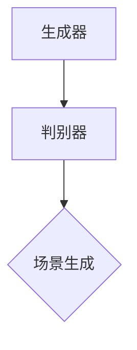
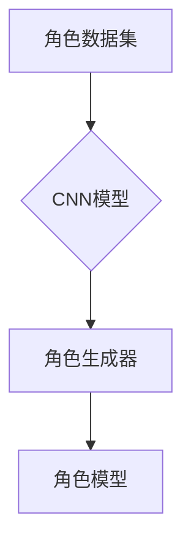
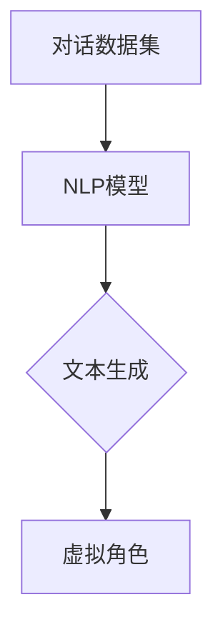
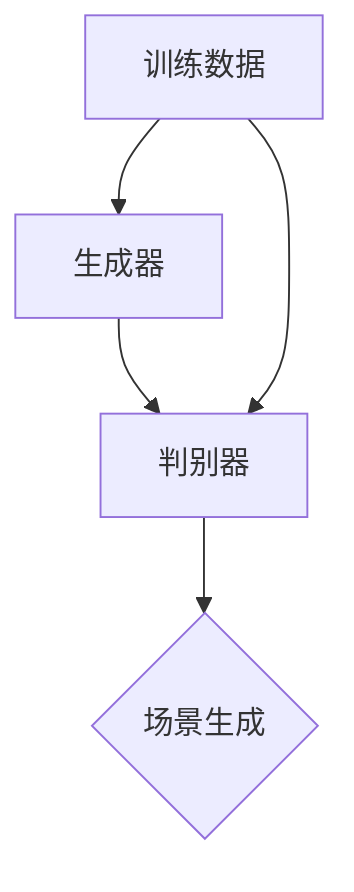

                 

## AIGC在虚拟世界构建中的革命性应用

### 关键词
- AIGC
- 虚拟世界
- 场景生成
- 角色建模
- 交互设计
- 自然语言处理

### 摘要
本文深入探讨了人工智能生成内容（AIGC）在虚拟世界构建中的革命性应用。通过分析AIGC的基本概念、技术原理以及其在场景生成、角色建模和交互设计等领域的具体应用，本文展示了AIGC如何改变虚拟世界的创建和体验方式。文章还讨论了AIGC技术面临的挑战及可能的解决方案，为未来AIGC在虚拟世界构建中的应用提供了有价值的思考。

---

### 背景介绍

#### 核心概念

##### AIGC（AI-Generated Content）

AIGC，即人工智能生成内容，是指利用人工智能算法生成文本、图像、音频、视频等多种类型内容的技术。AIGC技术通过机器学习和深度学习算法，模拟人类创造力的过程，自动生成丰富多样、高质量的数字内容。

##### 虚拟世界构建

虚拟世界构建是指利用计算机技术，如虚拟现实（VR）、增强现实（AR）等，创建三维空间中的虚拟环境。虚拟世界能够提供沉浸式体验，让用户在虚拟空间中与虚拟对象进行交互。

#### 问题背景

随着互联网和数字技术的快速发展，虚拟世界的应用越来越广泛。然而，传统的方法在虚拟世界的构建中存在诸多局限，如场景设计复杂、角色建模耗时等。AIGC技术的出现，为虚拟世界的构建提供了新的思路和可能性。

##### 问题描述

如何在虚拟世界构建中高效利用AIGC技术，实现内容生成、场景构建、角色建模和交互设计的自动化和智能化，成为当前研究的热点问题。

##### 问题解决

本文通过系统介绍AIGC的基本概念、技术原理和应用场景，探讨了AIGC在虚拟世界构建中的革命性应用，为解决上述问题提供了理论基础和实际案例。

#### 边界与外延

##### 边界

本文主要关注AIGC在虚拟世界构建中的应用，不包括其他领域的应用，如文本生成、图像生成等。

##### 外延

本文涉及虚拟世界构建的多个方面，如VR、AR、游戏开发等，旨在全面探讨AIGC在虚拟世界中的潜力。

#### 概念结构与核心要素组成

##### 概念结构

1. **AIGC基础知识**：包括AIGC的定义、分类、应用场景等。
2. **虚拟世界构建技术**：介绍虚拟世界构建的基本技术，如VR、AR等。
3. **AIGC在虚拟世界构建中的应用**：探讨AIGC在场景生成、角色建模和交互设计等方面的应用。

##### 核心要素组成

1. **生成对抗网络（GAN）**：用于场景生成，实现逼真虚拟环境的自动构建。
2. **深度学习算法**：用于角色建模，生成具有个性特点的虚拟角色。
3. **自然语言处理（NLP）**：用于交互设计，实现虚拟角色与用户的自然对话。

### 核心概念与联系

#### 核心概念

- **AIGC（AI-Generated Content）：** 由人工智能算法生成的内容。
- **虚拟世界构建：** 利用计算机技术创建三维空间中的虚拟环境。

#### 概念属性特征对比表格

| 概念             | 属性特征                      |
| ---------------- | --------------------------- |
| AIGC             | 内容生成、智能化、多样性     |
| 虚拟世界构建     | 三维空间、沉浸感、交互性     |

#### ER实体关系图架构

```mermaid
erDiagram
  AIGC ||--|{ 虚拟世界构建 }|
  虚拟世界构建 ||--|{ 场景生成 }|
  虚拟世界构建 ||--|{ 角色建模 }|
  虚拟世界构建 ||--|{ 交互设计 }|
```

---

### AIGC在虚拟世界构建中的应用

#### AIGC在场景生成中的应用

##### 技术原理

AIGC在场景生成中主要利用生成对抗网络（GAN）等人工智能技术。GAN由生成器和判别器两部分组成，生成器负责生成虚拟场景，判别器负责判断生成场景的真实性。通过不断地训练和优化，生成器能够生成越来越逼真的虚拟场景。



##### 应用案例

- **游戏开发**：利用AIGC技术，游戏开发者可以自动生成各种类型的游戏场景，节省大量设计和开发时间。
- **虚拟旅游**：AIGC技术可以帮助快速创建虚拟旅游场景，提供更加丰富的旅游体验。

#### AIGC在角色建模中的应用

##### 技术原理

AIGC在角色建模中主要利用深度学习算法，如卷积神经网络（CNN）和生成对抗网络（GAN）。通过学习大量的角色图像数据，模型可以自动生成具有个性特点的虚拟角色。



##### 应用案例

- **虚拟现实（VR）应用**：利用AIGC技术，VR应用可以生成丰富多样的虚拟角色，提供更加逼真的沉浸式体验。
- **角色扮演游戏**：AIGC技术可以帮助游戏开发者快速创建具有独特个性的角色，提升游戏的可玩性和趣味性。

#### AIGC在交互设计中的应用

##### 技术原理

AIGC在交互设计中的主要技术是自然语言处理（NLP）。通过训练大量的对话数据，NLP模型可以理解和生成自然语言文本，实现虚拟角色与用户的自然交互。



##### 应用案例

- **虚拟客服**：AIGC技术可以帮助虚拟客服实现自然语言对话，提高客户服务质量。
- **虚拟导游**：利用AIGC技术，虚拟导游可以与游客进行自然对话，提供个性化的旅游服务。

### 小结

本章介绍了AIGC在虚拟世界构建中的应用，包括场景生成、角色建模和交互设计等方面。AIGC技术通过生成对抗网络、深度学习和自然语言处理等算法，实现了虚拟世界构建的自动化和智能化。AIGC在虚拟世界构建中具有广泛的应用前景，有望推动虚拟世界的发展。

---

### AIGC在虚拟世界构建中的应用

#### AIGC在场景生成中的应用

**技术原理**

AIGC在场景生成中的应用主要基于生成对抗网络（GAN）这一前沿技术。GAN由生成器和判别器两部分组成，生成器的任务是生成虚拟场景，判别器的任务是判断生成场景的真实性。通过不断的迭代训练，生成器能够生成越来越逼真的虚拟场景。



**应用案例**

- **游戏开发**：AIGC技术可以帮助游戏开发者快速生成各种类型的游戏场景，大大缩短游戏开发周期。
- **虚拟旅游**：通过AIGC技术，虚拟旅游平台可以自动生成丰富多样的虚拟旅游场景，提供更加真实的旅游体验。

#### AIGC在角色建模中的应用

**技术原理**

AIGC在角色建模中的应用主要利用深度学习算法，如卷积神经网络（CNN）和生成对抗网络（GAN）。这些算法可以通过学习大量的角色图像数据，生成具有个性特点的虚拟角色。具体而言，CNN可以提取图像特征，GAN则负责生成逼真的角色形象。


**应用案例**

- **虚拟现实（VR）应用**：AIGC技术可以帮助VR应用生成丰富多样的虚拟角色，提升用户体验。
- **角色扮演游戏**：游戏开发者可以利用AIGC技术快速生成具有独特个性的角色，提高游戏的趣味性和可玩性。

#### AIGC在交互设计中的应用

**技术原理**

AIGC在交互设计中的应用主要依赖于自然语言处理（NLP）技术。通过训练大量的对话数据，NLP模型可以理解和生成自然语言文本，实现虚拟角色与用户的自然交互。具体而言，NLP模型可以通过解析用户输入，生成合适的回复，从而实现人机对话。


**应用案例**

- **虚拟客服**：AIGC技术可以帮助虚拟客服实现与用户的自然对话，提高客户服务质量。
- **虚拟导游**：通过AIGC技术，虚拟导游可以与游客进行自然对话，提供个性化的旅游服务。

### 小结

本章深入探讨了AIGC在虚拟世界构建中的多种应用，包括场景生成、角色建模和交互设计。通过生成对抗网络、深度学习和自然语言处理等技术的应用，AIGC技术为虚拟世界的构建提供了强大的支持。这些应用不仅提高了虚拟世界的构建效率，还提升了用户体验，为虚拟世界的发展带来了新的可能性。

---

### AIGC在虚拟世界构建中的应用案例分析

为了更好地理解AIGC在虚拟世界构建中的应用，我们来看几个实际案例，这些案例展示了AIGC技术的实际效果和面临的挑战。

#### 案例一：游戏《堡垒之夜》

《堡垒之夜》是一款流行的多人在线游戏，它利用AIGC技术生成各种游戏场景，为玩家提供了丰富的游戏体验。AIGC技术在这里的应用主要体现在场景生成和角色建模方面。

- **场景生成**：《堡垒之夜》中的游戏场景，包括城市、森林、沙漠等，都是通过AIGC技术自动生成的。这些场景不仅逼真，而且每次游戏时都会有所不同，增加了游戏的新鲜感和挑战性。
- **角色建模**：游戏中的角色也利用AIGC技术进行建模，每个角色都有独特的个性和外观。玩家可以选择自己喜欢的角色进行游戏，这大大提升了游戏的趣味性和个性化。

**挑战**：

1. **计算资源**：生成逼真的游戏场景需要大量的计算资源，特别是在多人在线游戏中，对服务器端的计算能力提出了较高要求。
2. **数据安全**：游戏中涉及大量的用户数据，如何确保这些数据的安全，防止数据泄露，是一个重要的挑战。

#### 案例二：虚拟现实旅游平台

虚拟现实旅游平台利用AIGC技术，为用户提供虚拟旅游体验。用户可以戴上VR头显，进入虚拟的旅游场景，感受到与真实旅游相似的沉浸体验。

- **场景生成**：虚拟现实旅游平台通过AIGC技术，自动生成各种旅游场景，从风景名胜到城市建筑，都可以在虚拟世界中重现。
- **交互设计**：用户可以在虚拟旅游场景中与虚拟导游进行交互，获取旅游信息，这增强了用户的参与感和体验感。

**挑战**：

1. **场景真实性**：虽然AIGC技术可以生成逼真的场景，但如何确保这些场景在视觉和交互上都能达到真实旅游的标准，仍然是一个挑战。
2. **用户体验**：用户对虚拟旅游的接受程度取决于体验的真实感和互动性，如何提升用户体验是一个关键问题。

#### 案例三：虚拟客服系统

虚拟客服系统利用AIGC技术，为用户提供自动化的客服服务。通过自然语言处理技术，虚拟客服可以理解和回答用户的问题，提供即时的帮助。

- **交互设计**：虚拟客服系统能够根据用户的提问，生成合适的回复，实现自然的人机对话。
- **角色建模**：虚拟客服系统的虚拟角色外观和性格可以通过AIGC技术进行定制，以更好地与用户互动。

**挑战**：

1. **语言理解**：虽然自然语言处理技术取得了很大进展，但如何确保系统能够准确理解用户的提问，仍然是一个挑战。
2. **个性化服务**：如何根据不同用户的需求，提供个性化的服务，提高客服质量，是一个重要的课题。

### 案例小结

通过以上案例，我们可以看到AIGC技术在虚拟世界构建中的应用已经取得了显著的成果。然而，在实际应用中，AIGC技术也面临一些挑战，如计算资源、数据安全和用户体验等。解决这些挑战，将有助于进一步推动AIGC技术在虚拟世界构建中的应用和发展。

---

### 结论与未来展望

本文详细探讨了人工智能生成内容（AIGC）在虚拟世界构建中的革命性应用。通过分析AIGC的基本概念、技术原理以及其在场景生成、角色建模和交互设计等领域的具体应用，本文展示了AIGC如何改变虚拟世界的创建和体验方式。以下是对本文内容的总结和未来展望：

#### 总结

- **AIGC技术原理**：AIGC利用生成对抗网络（GAN）、深度学习算法和自然语言处理（NLP）等技术，实现内容的自动化生成和个性化定制。
- **应用场景**：AIGC在虚拟世界构建中的应用场景包括游戏开发、虚拟旅游、虚拟现实（VR）应用、角色扮演游戏和虚拟客服等。
- **案例分析**：本文通过《堡垒之夜》、虚拟现实旅游平台和虚拟客服系统的案例，展示了AIGC技术的实际效果和挑战。

#### 未来展望

- **技术发展**：随着人工智能技术的不断进步，AIGC将在虚拟世界构建中发挥更大的作用。未来的AIGC技术可能更加智能化、自适应和个性化。
- **应用拓展**：AIGC技术在教育、医疗、城市规划等领域的应用潜力巨大。通过虚拟现实和增强现实技术，这些领域可以提供更加沉浸式和互动性的体验。
- **挑战与解决方案**：尽管AIGC技术在虚拟世界构建中面临计算资源、数据安全和用户体验等挑战，但通过技术创新和跨学科合作，有望找到有效的解决方案。

总之，AIGC在虚拟世界构建中的革命性应用为数字内容生成和用户体验带来了巨大变革。未来，随着技术的进一步发展和应用的拓展，AIGC有望在更多领域实现突破，推动虚拟世界的发展进入一个新的阶段。

### 作者信息

- 作者：AI天才研究院/AI Genius Institute & 禅与计算机程序设计艺术 /Zen And The Art of Computer Programming

---

通过本文的深入探讨，我们不仅了解了AIGC在虚拟世界构建中的应用，还对其技术原理和未来发展有了更深刻的认识。希望本文能为读者在相关领域的探索和研究提供有益的参考和启示。再次感谢您的阅读，期待与您在未来的技术交流中相遇。

