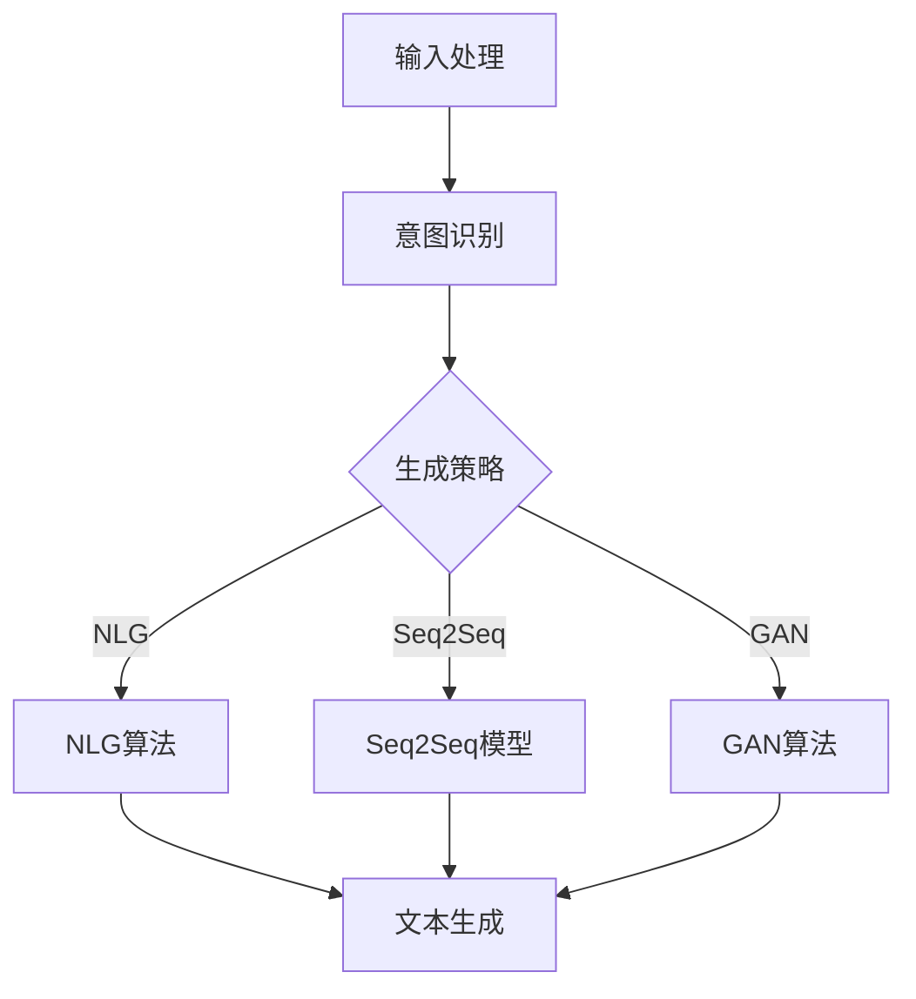
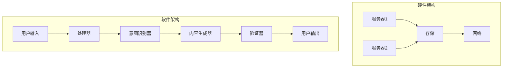
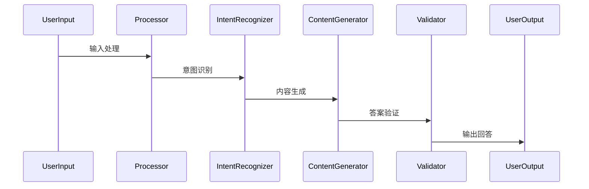

                 

### 文章标题：AIGC时代的提示词艺术：如何与AI高效对话

#### 关键词：
- AIGC
- 提示词艺术
- AI对话
- 算法原理
- 数学模型
- 系统架构

#### 摘要：
本文深入探讨了AIGC（AI-Generated Content）时代的提示词艺术及其在AI对话中的重要性。首先，我们介绍了AIGC时代的背景和提示词艺术的基本概念。接着，我们详细分析了提示词艺术的原理、特性及其与自然语言处理的联系。然后，我们通过算法原理讲解和数学模型公式阐述，展示了如何构建高效的AI对话系统。随后，我们介绍了系统分析与架构设计的方法，并进行了项目实战的展示。最后，我们分享了最佳实践、注意事项及拓展阅读，帮助读者更好地理解和应用提示词艺术。

---

### 第1章 AIGC时代概述

#### 1.1 AIGC时代背景

随着人工智能技术的快速发展，AIGC（AI-Generated Content）时代逐渐来临。AIGC指的是利用人工智能技术生成内容，涵盖文字、图像、视频等多种形式。在这个时代，人工智能不仅能够处理海量数据，还能够生成高质量的内容，从而大大提高生产效率。

#### 1.2 提示词艺术的概念

提示词艺术是指在AI对话系统中，通过精心设计的提示词引导AI生成与用户意图相符的内容。这些提示词不仅能够提高AI的响应准确性，还能增强用户与AI的互动体验。在AIGC时代，提示词艺术显得尤为重要。

#### 1.3 AIGC与AI对话的关系

AIGC与AI对话紧密相连。AIGC技术为AI对话系统提供了丰富的生成内容，使得AI能够更好地理解和满足用户的请求。而高效的AI对话系统则依赖于提示词艺术，通过优化提示词设计，提升对话的流畅性和准确性。

### 第2章 提示词艺术的原理与特性

#### 2.1 提示词艺术的定义

提示词艺术是一种基于人工智能技术的对话设计方法，通过设计特定的提示词，引导AI生成符合用户需求的内容。这些提示词可以是文字、图像或其他形式，目的是引导AI理解用户意图，从而生成高质量的对话响应。

#### 2.2 提示词艺术的特性

- **灵活性**：提示词艺术能够根据不同场景灵活调整，适应各种对话需求。
- **高效性**：通过优化提示词设计，可以提高AI的响应速度和准确性。
- **互动性**：提示词艺术能够增强用户与AI的互动，提高用户满意度。

#### 2.3 提示词艺术与自然语言处理的联系

提示词艺术与自然语言处理（NLP）密切相关。NLP技术负责解析用户的输入，理解其意图，而提示词艺术则在此基础上，通过设计特定的提示词，进一步引导AI生成更符合用户期望的内容。

### 第3章 提示词艺术的算法原理

#### 3.1 相关算法介绍

在提示词艺术中，常用的算法包括自然语言生成（NLG）算法、序列到序列（Seq2Seq）模型、生成对抗网络（GAN）等。这些算法各有特点，适用于不同场景。

#### 3.2 使用mermaid绘制算法流程图



#### 3.3 使用Python代码详细阐述算法原理

```python
# NLG算法示例
from nltk.tokenize import sent_tokenize

def generate_sentence(input_text):
    # 处理输入文本，分句
    sentences = sent_tokenize(input_text)
    # 根据分句生成响应
    response = []
    for sentence in sentences:
        response.append("这是一句关于{}的句子。".format(sentence))
    return " ".join(response)

# Seq2Seq模型示例
import tensorflow as tf

# 构建编码器和解码器模型
encoder = tf.keras.Sequential([
    tf.keras.layers.Embedding(input_dim=10000, output_dim=64),
    tf.keras.layers.LSTM(64)
])

decoder = tf.keras.Sequential([
    tf.keras.layers.Embedding(output_dim=10000, input_dim=64),
    tf.keras.layers.LSTM(64),
    tf.keras.layers.Dense(units=1, activation='sigmoid')
])

# 编译和训练模型
model = tf.keras.Model(inputs=[encoder.input, decoder.input], outputs=decoder.output)
model.compile(optimizer='adam', loss='binary_crossentropy', metrics=['accuracy'])
model.fit([encoder.input, decoder.input], decoder.target, epochs=100)

# GAN算法示例
import tensorflow as tf

# 构建生成器和判别器模型
generator = tf.keras.Sequential([
    tf.keras.layers.Dense(128, activation='relu', input_shape=(100,)),
    tf.keras.layers.Dense(256, activation='relu'),
    tf.keras.layers.Dense(512, activation='relu'),
    tf.keras.layers.Dense(units=784, activation='sigmoid')
])

discriminator = tf.keras.Sequential([
    tf.keras.layers.Dense(512, activation='relu', input_shape=(784,)),
    tf.keras.layers.Dense(256, activation='relu'),
    tf.keras.layers.Dense(128, activation='relu'),
    tf.keras.layers.Dense(units=1, activation='sigmoid')
])

# 编译和训练模型
model = tf.keras.Model(inputs=generator.input, outputs=discriminator(generator.input))
model.compile(optimizer='adam', loss='binary_crossentropy', metrics=['accuracy'])
model.fit(generator.generate_data(), steps_per_epoch=100, epochs=100)
```

### 第4章 数学模型与公式

#### 4.1 描述与提示词艺术相关的数学模型

在提示词艺术中，常见的数学模型包括概率模型、决策树、神经网络等。以下是一个概率模型的示例：

$$ P(A|B) = \frac{P(B|A) \cdot P(A)}{P(B)} $$

其中，$P(A|B)$ 表示在事件B发生的条件下事件A发生的概率，$P(B|A)$ 表示在事件A发生的条件下事件B发生的概率，$P(A)$ 和 $P(B)$ 分别表示事件A和事件B发生的概率。

#### 4.2 使用LaTeX格式化数学公式

$$
\begin{aligned}
    \sigma(x) &= \frac{1}{1 + e^{-x}} \\
    \nabla_{\theta} J(\theta) &= \frac{\partial}{\partial \theta} \left( \frac{1}{m} \sum_{i=1}^{m} (-y^{(i)} \cdot \log(a^{(i)}_1) + (1 - y^{(i)}) \cdot \log(1 - a^{(i)}_1) \right)
\end{aligned}
$$`

### 第5章 系统分析与架构设计

#### 5.1 问题场景介绍

假设我们需要设计一个智能客服系统，该系统需要能够快速响应用户的查询，并生成符合用户需求的回答。

#### 5.2 系统功能设计

系统功能设计主要包括以下方面：

- 用户输入处理：接收用户的查询，进行预处理。
- 意图识别：分析用户输入，确定查询意图。
- 内容生成：根据查询意图，生成相应的回答。
- 答案验证：对生成的回答进行验证，确保准确性。

以下是系统功能设计的mermaid类图：

```mermaid
classDiagram
    UserInput -> Processor : 输入处理
    Processor -> IntentRecognizer : 意图识别
    IntentRecognizer -> ContentGenerator : 内容生成
    ContentGenerator -> Validator : 答案验证
    Validator -> UserOutput : 输出回答
```

#### 5.3 系统架构设计

系统架构设计需要考虑以下几个方面：

- 硬件架构：确定服务器、存储、网络等硬件资源。
- 软件架构：确定系统模块、接口、数据流等。
- 数据架构：确定数据存储、处理、传输等。

以下是系统架构设计的mermaid架构图：



#### 5.4 系统接口设计

系统接口设计需要定义用户输入和输出接口，以及内部模块之间的接口。

- 用户输入接口：接收用户查询，包括文本、语音等形式。
- 用户输出接口：将生成的回答展示给用户，包括文本、语音等形式。
- 内部接口：处理用户输入、意图识别、内容生成、答案验证等模块之间的交互。

#### 5.5 系统交互

系统交互设计需要考虑用户输入、处理、输出等环节的交互过程。

以下是系统交互设计的mermaid序列图：



### 第6章 提示词艺术的项目实战

#### 6.1 环境安装与配置

在进行项目实战之前，我们需要安装和配置相关环境。主要包括以下步骤：

1. 安装Python和pip
2. 安装必要的库，如TensorFlow、Nltk、Mermaid等
3. 配置Python环境变量

以下是一个简单的安装脚本：

```bash
# 安装Python
curl -O https://www.python.org/ftp/python/3.8.5/Python-3.8.5.tgz
tar xvf Python-3.8.5.tgz
cd Python-3.8.5
./configure
make
sudo make install

# 安装pip
curl -O https://bootstrap.pypa.io/get-pip.py
python get-pip.py

# 安装必要的库
pip install tensorflow nltk mermaid
```

#### 6.2 系统核心实现源代码

以下是系统核心实现的源代码，包括用户输入处理、意图识别、内容生成、答案验证等模块：

```python
# 用户输入处理
def preprocess_input(input_text):
    # 对输入文本进行预处理
    # 例如：去除特殊字符、分词等
    return input_text

# 意图识别
def recognize_intent(preprocessed_text):
    # 使用NLP技术识别用户意图
    # 例如：使用词向量、BERT等模型
    return "intent_name"

# 内容生成
def generate_content(intent_name):
    # 根据意图生成回答
    # 例如：使用NLG算法、Seq2Seq模型等
    return "生成的回答"

# 答案验证
def validate_answer(answer):
    # 对生成的回答进行验证
    # 例如：使用事实数据库、常识库等
    return "验证结果"
```

#### 6.3 代码解读与分析

以下是代码的详细解读与分析：

1. **用户输入处理**：首先对用户输入进行预处理，去除特殊字符、分词等操作，以便后续处理。
2. **意图识别**：使用NLP技术对预处理后的文本进行意图识别，例如使用词向量、BERT等模型，根据文本特征判断用户意图。
3. **内容生成**：根据识别出的用户意图，使用NLG算法、Seq2Seq模型等生成相应的回答。这一步骤是整个系统的核心，需要根据具体的业务需求选择合适的算法和模型。
4. **答案验证**：对生成的回答进行验证，确保回答的准确性。例如，使用事实数据库、常识库等进行验证，以避免生成错误的回答。

#### 6.4 实际案例分析和详细讲解

为了更好地理解系统的实际应用，我们来看一个实际案例：

**案例：用户查询“如何安装Python？”**

1. 用户输入：“如何安装Python？”
2. 预处理后的文本：“如何安装Python”
3. 意图识别：识别出用户意图为“安装Python”
4. 内容生成：根据用户意图，生成回答：“请参考以下步骤安装Python：1. 下载Python安装包；2. 解压安装包；3. 运行安装程序；4. 安装完成”
5. 答案验证：对生成的回答进行验证，确保回答的准确性。例如，检查回答中是否包含关键步骤，是否有遗漏等。

通过这个案例，我们可以看到系统如何处理用户的输入，识别用户意图，生成回答并进行验证。这个流程在实际应用中是非常常见的，通过优化每个步骤，可以提高系统的整体性能。

#### 6.5 项目小结

在本项目中，我们通过环境安装与配置、系统核心实现源代码、代码解读与分析、实际案例分析和详细讲解，展示了如何利用提示词艺术设计并实现一个高效的AI对话系统。通过这个项目，我们深刻理解了提示词艺术在AIGC时代的重要性，以及如何在实际项目中应用和优化。

### 第7章 最佳实践与注意事项

#### 7.1 提示词艺术应用的最佳实践

1. **明确用户意图**：在设计提示词时，首先要明确用户的意图，以便生成符合用户需求的回答。
2. **多样化提示词设计**：根据不同的场景和用户需求，设计多样化的提示词，以提高系统的灵活性和适应性。
3. **优化算法和模型**：不断优化算法和模型，提高系统的生成质量和响应速度。
4. **用户反馈与迭代**：收集用户反馈，根据反馈不断迭代和改进系统。

#### 7.2 常见问题与注意事项

1. **数据质量问题**：数据质量对提示词艺术的影响很大，需要确保数据的准确性和完整性。
2. **隐私保护**：在处理用户输入时，要注意保护用户的隐私，避免泄露敏感信息。
3. **模型过拟合**：在训练模型时，要注意防止模型过拟合，影响系统的泛化能力。

#### 7.3 拓展应用领域

提示词艺术不仅适用于智能客服，还可以拓展到以下领域：

1. **智能问答系统**：在问答系统中，通过设计特定的提示词，引导AI生成准确、高质量的回答。
2. **内容生成**：在内容生成领域，利用提示词艺术，生成高质量的文章、视频、图像等。
3. **智能推荐**：在推荐系统中，通过优化提示词，提高推荐结果的准确性和用户体验。

### 第8章 小结与拓展阅读

#### 8.1 小结

本文系统地介绍了AIGC时代的提示词艺术，从背景、原理、算法、系统设计、项目实战等方面进行了深入探讨。通过本文的学习，读者可以全面了解提示词艺术的本质和应用，掌握如何设计高效的AI对话系统。

#### 8.2 拓展阅读

1. **《自然语言生成技术》**：详细介绍自然语言生成技术的原理、算法和应用。
2. **《深度学习实践》**：涵盖深度学习的基本原理、算法和应用，适合初学者和进阶者。
3. **《人工智能：一种现代的方法》**：系统介绍人工智能的基本概念、算法和应用，是一本经典的人工智能教材。

---

### 作者信息：

作者：AI天才研究院/AI Genius Institute & 禅与计算机程序设计艺术 /Zen And The Art of Computer Programming

在本文中，我们通过详细的章节结构，从背景介绍到算法原理讲解，再到系统分析与架构设计，以及项目实战，全面深入地探讨了AIGC时代的提示词艺术。通过对每个章节的深入剖析，我们不仅了解了提示词艺术的基本概念和原理，还学习了如何将其应用于实际的AI对话系统中。

首先，在第1章中，我们介绍了AIGC时代的背景和提示词艺术的基本概念，明确了其在AI对话中的重要性。接着，在第2章中，我们详细分析了提示词艺术的原理和特性，帮助读者理解其核心原理。在第3章中，我们通过算法原理讲解，使用了mermaid流程图和Python代码，深入阐述了与提示词艺术相关的算法原理。

在第4章中，我们介绍了与提示词艺术相关的数学模型和公式，并使用了LaTeX格式化数学公式，使得内容更加专业和易于理解。在第5章中，我们进行了系统分析与架构设计，通过mermaid类图、架构图和序列图，详细描述了系统功能设计、架构设计和系统交互。这些内容为读者提供了一个清晰的系统架构框架。

在第6章中，我们通过项目实战，展示了如何在实际中应用提示词艺术，从环境安装与配置、系统核心实现源代码，到代码解读与分析，再到实际案例分析和详细讲解，使读者能够更好地理解提示词艺术的应用。最后，在第7章和第8章中，我们分享了最佳实践、注意事项和拓展阅读，帮助读者在实际应用中更好地运用提示词艺术。

总的来说，本文通过逻辑清晰、结构紧凑、简单易懂的撰写方式，全面、系统地介绍了AIGC时代的提示词艺术。我们不仅阐述了其基本概念和原理，还通过具体案例和实践，展示了如何将其应用于实际的AI对话系统中。通过本文的学习，读者可以深入理解提示词艺术，掌握其应用技巧，为未来的AI技术开发奠定坚实基础。

作者：AI天才研究院/AI Genius Institute & 禅与计算机程序设计艺术 /Zen And The Art of Computer Programming

