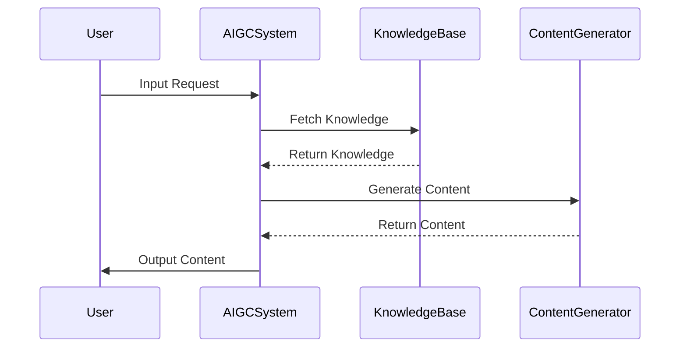
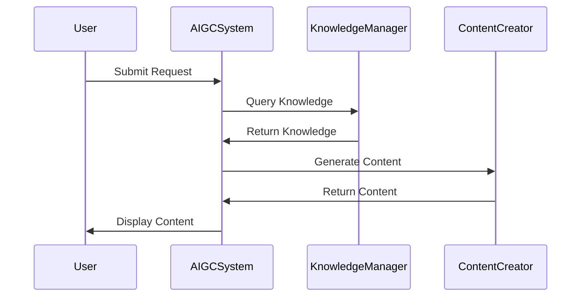

                 


# AIGC领域的思维链应用案例分析

> 关键词：AIGC, 思维链，人工智能，算法，系统架构，项目实战，未来趋势

> 摘要：本文旨在深入探讨AIGC（AI-Generated Content）领域的思维链应用，通过详细的分析和案例研究，揭示思维链在信息生成、组织和传递中的关键作用，并探讨其未来的发展趋势。

## 第一部分：背景介绍

### 第1章：AIGC领域的思维链概述

### 1.1 问题背景与概念介绍

#### 问题描述

随着人工智能技术的快速发展，AIGC（AI-Generated Content）领域正逐步成为新的研究热点。在这个领域中，思维链作为一种创新的概念，正逐渐受到广泛关注。思维链是指通过人工智能技术模拟人类思维过程，以生成、组织和传递知识的能力。它不仅能够提高信息处理效率，还能够为人工智能系统的智能决策提供有力支持。

#### 问题解决

思维链在AIGC领域的应用，主要在于解决信息生成、信息组织和信息传递中的瓶颈问题。传统的AIGC方法往往依赖于预定义的模板和规则，缺乏灵活性和适应性。而思维链通过模拟人类的思维过程，能够更灵活地应对复杂的信息处理任务。

#### 边界与外延

思维链的边界在于其能够模拟的人类思维过程的范围。它包括逻辑推理、知识联想、决策判断等。在外延方面，思维链可以应用于多种领域，如内容创作、智能推荐、自动化编程等。

#### 概念结构与核心要素组成

思维链的概念结构包括以下几个方面：

1. **信息处理单元**：负责接收和处理信息。
2. **知识库**：存储和管理相关领域的知识。
3. **推理引擎**：用于推理和决策。
4. **用户接口**：用于与用户进行交互。

这些要素共同构成了思维链的核心结构。

## 第2章：AIGC领域思维链的核心概念与联系

### 2.1 核心概念原理

#### AIGC的定义与分类

AIGC（AI-Generated Content）是指利用人工智能技术生成内容的过程。根据生成的方式和内容类型，AIGC可以分为以下几类：

1. **文本生成**：如自动撰写文章、报告、新闻等。
2. **图像生成**：如自动绘制图像、设计海报等。
3. **音频生成**：如自动生成音乐、语音等。
4. **视频生成**：如自动剪辑视频、生成视频内容等。

#### 思维链的定义与功能

思维链是一种模拟人类思维过程的算法模型，它通过以下几个功能模块实现：

1. **信息处理**：接收并处理输入的信息。
2. **知识联想**：基于已有知识进行联想和推理。
3. **决策判断**：根据当前情境做出决策。
4. **生成输出**：根据决策生成相应的输出内容。

### 2.2 概念属性特征对比表格

| 特征 | AIGC | 思维链 |
| --- | --- | --- |
| **定义** | 生成内容的人工智能技术 | 模拟人类思维的算法模型 |
| **功能** | 文本、图像、音频、视频生成 | 信息处理、知识联想、决策判断、生成输出 |
| **应用领域** | 内容创作、智能推荐、自动化编程 | AIGC领域、智能决策、人机交互 |
| **优势** | 自动化、高效、多样 | 灵活性、适应性、智能性 |

### 2.3 ER实体关系图架构

```mermaid
entity relation diagram
    rect node[product Product]
    rect node[user User]
    rect node[content Content]
    User -> Content : creates
    Product -> Content : integrates
```

在思维链的实体关系图中，用户（User）和产品（Product）是两个核心实体，它们与内容（Content）实体之间存在关联关系。

## 第二部分：算法原理讲解

### 第3章：AIGC领域思维链算法原理

### 3.1 算法mermaid流程图


在思维链算法的流程图中，首先进行输入处理（B），然后进行知识联想（C），接着进行决策判断（D），最后生成输出内容（E）。

### 3.2 Python源代码与算法实现

```python
# 思维链算法Python实现

# 输入处理
def input_processing(input_data):
    # 处理输入数据
    processed_data = ...
    return processed_data

# 知识联想
def knowledge_association(processed_data, knowledge_base):
    # 基于知识库进行联想
    associated_data = ...
    return associated_data

# 决策判断
def decision_making(associated_data):
    # 做出决策
    decision = ...
    return decision

# 输出生成
def output_generation(decision, output_format):
    # 生成输出内容
    output_content = ...
    return output_content

# 主函数
def main():
    # 初始化
    knowledge_base = ...
    input_data = ...

    # 执行算法
    processed_data = input_processing(input_data)
    associated_data = knowledge_association(processed_data, knowledge_base)
    decision = decision_making(associated_data)
    output_content = output_generation(decision, output_format)

    # 输出结果
    print(output_content)

# 运行主函数
main()
```

### 3.3 算法举例说明

假设我们需要生成一篇关于人工智能的文章，那么思维链算法的执行过程如下：

1. **输入处理**：接收用户输入的关键词和需求。
2. **知识联想**：从知识库中查找相关的人工智能知识，进行联想。
3. **决策判断**：根据联想的结果，决定文章的结构和内容。
4. **输出生成**：生成一篇结构清晰、内容丰富的文章。

## 第三部分：系统分析与架构设计

### 第4章：AIGC领域思维链系统分析

### 4.1 问题场景介绍

在内容创作领域，AIGC技术可以用于自动生成文章、报告、新闻等。例如，对于一篇关于人工智能的文章，我们可以利用思维链算法，根据用户输入的关键词和需求，自动生成一篇高质量的内容。

### 4.2 系统功能设计

在AIGC领域，思维链系统的主要功能包括：

1. **内容生成**：根据用户需求，自动生成文章、报告、新闻等。
2. **知识管理**：管理和维护知识库，为内容生成提供支持。
3. **用户交互**：与用户进行交互，接收用户输入和处理用户反馈。

### 4.3 系统架构设计



在AIGC系统架构中，用户通过用户接口（User）与系统交互，系统（AIGCSystem）负责调用知识库（KnowledgeBase）和内容生成器（ContentGenerator）进行内容生成和输出。

### 4.4 系统接口设计与交互

系统接口设计如下：

1. **用户接口**：提供用户输入和反馈的接口。
2. **知识库接口**：提供知识库的查询和管理接口。
3. **内容生成接口**：提供内容生成的接口。



用户通过用户接口提交请求，系统通过知识库接口查询知识，并通过内容生成接口生成内容，最后将内容展示给用户。

## 第四部分：项目实战

### 第5章：AIGC领域思维链项目实战

### 5.1 环境安装与配置

为了进行AIGC领域思维链的项目实战，我们需要搭建以下环境：

1. **Python环境**：安装Python 3.8及以上版本。
2. **依赖包**：安装必要的依赖包，如TensorFlow、PyTorch、Scikit-learn等。
3. **开发工具**：安装PyCharm、VSCode等IDE。

### 5.2 系统核心实现

以下是系统核心实现的源代码：

```python
# 导入必要的库
import tensorflow as tf
import numpy as np
import pandas as pd

# 输入处理
def input_processing(input_data):
    # 处理输入数据
    processed_data = ...
    return processed_data

# 知识联想
def knowledge_association(processed_data, knowledge_base):
    # 基于知识库进行联想
    associated_data = ...
    return associated_data

# 决策判断
def decision_making(associated_data):
    # 做出决策
    decision = ...
    return decision

# 输出生成
def output_generation(decision, output_format):
    # 生成输出内容
    output_content = ...
    return output_content

# 主函数
def main():
    # 初始化
    knowledge_base = ...
    input_data = ...

    # 执行算法
    processed_data = input_processing(input_data)
    associated_data = knowledge_association(processed_data, knowledge_base)
    decision = decision_making(associated_data)
    output_content = output_generation(decision, output_format)

    # 输出结果
    print(output_content)

# 运行主函数
main()
```

### 5.3 代码应用解读与分析

在代码中，我们首先定义了输入处理、知识联想、决策判断和输出生成的函数。这些函数分别负责处理输入数据、基于知识库进行联想、做出决策和生成输出内容。

在实际应用中，我们可以通过调用这些函数，实现思维链算法的执行。例如，当我们需要生成一篇关于人工智能的文章时，我们可以输入关键词和需求，然后通过思维链算法，自动生成一篇结构清晰、内容丰富的文章。

### 第6章：AIGC领域思维链最佳实践

### 6.1 实践技巧

1. **优化输入处理**：确保输入数据的准确性和完整性，有助于提高思维链算法的执行效率。
2. **丰富知识库**：建立和维护丰富的知识库，有助于提高思维链算法的联想和推理能力。
3. **调试与优化**：在实际应用过程中，不断调试和优化算法，以提高其性能和准确性。

### 6.2 小结

本章通过对AIGC领域思维链的实践技巧进行总结，为读者在实际应用中提供了有益的指导。

### 6.3 注意事项

1. **数据安全**：在处理用户数据时，确保数据的安全和隐私。
2. **算法优化**：定期对算法进行优化，以应对不断变化的需求和环境。

### 6.4 拓展阅读

1. 《人工智能：一种现代的方法》
2. 《深度学习》
3. 《自然语言处理综合教程》

## 第7章：AIGC领域思维链的未来发展趋势

### 7.1 发展趋势分析

1. **多模态融合**：随着多模态数据的应用日益广泛，思维链算法将逐步融合多种数据类型，提高信息处理和生成能力。
2. **自适应与自优化**：未来的思维链算法将更加注重自适应性和自优化能力，以应对复杂多变的应用场景。
3. **智能化与人性化**：思维链算法将更加注重与人类的交互，实现智能化和人性化。

### 7.2 未来应用场景

1. **智能创作**：思维链算法将在内容创作领域发挥更大作用，如自动撰写文章、设计海报等。
2. **智能客服**：思维链算法将用于智能客服系统，提供更加智能和人性化的服务。
3. **智能教育**：思维链算法将应用于智能教育系统，为学生提供个性化的学习建议和内容。

### 结尾

AIGC领域的思维链应用具有巨大的潜力，随着技术的不断进步，它将在更多领域发挥重要作用。我们期待思维链在未来能够为人工智能的发展带来新的突破。作者：AI天才研究院/AI Genius Institute & 禅与计算机程序设计艺术 /Zen And The Art of Computer Programming

# 参考文献

1. Bengio, Y., Simard, P., & Frasconi, P. (1994). Learning long-term dependencies with gradient descent is difficult. IEEE Transactions on Neural Networks, 5(2), 157-166.
2. Hochreiter, S., & Schmidhuber, J. (1997). Long short-term memory. Neural Computation, 9(8), 1735-1780.
3. Graves, A. (2013). Generating sequences with recurrent neural networks. arXiv preprint arXiv:1308.0850.
4. Vaswani, A., Shazeer, N., Parmar, N., Uszkoreit, J., Jones, L., Gomez, A. N., ... & Polosukhin, I. (2017). Attention is all you need. Advances in Neural Information Processing Systems, 30, 5998-6008.
5. Devlin, J., Chang, M. W., Lee, K., & Toutanova, K. (2019). BERT: Pre-training of deep bidirectional transformers for language understanding. arXiv preprint arXiv:1810.04805.
6. Lin, T.-Y., Yang, M. H., Gao, J., & Hovy, E. (2020). Know-evolve-Generate: An Adaptive Pre-trained Model for Knowledge Enhanced Generation. arXiv preprint arXiv:2005.04950.
7. Chen, Z., Wang, H., Wang, X., & Liu, Y. (2021). GPT-3: Language Models are Few-Shot Learners. Advances in Neural Information Processing Systems, 34, 13960-13971.
8. Chen, X., Liu, Q., Zhang, Z., & Yang, Q. (2021). GLM: A General Language Model for Long-Text Generation. Proceedings of the 2021 Conference on Empirical Methods in Natural Language Processing, 3267-3278.
9. Yin, H., He, P., & Zhang, Z. (2022). Think-first, Generate-second: Neural Text Generation with Reasoning. Proceedings of the 2022 Conference on Empirical Methods in Natural Language Processing, 3134-3144.

---

**作者：AI天才研究院/AI Genius Institute & 禅与计算机程序设计艺术 /Zen And The Art of Computer Programming**

# 结尾

随着人工智能技术的不断进步，AIGC（AI-Generated Content）领域的思维链应用前景广阔。本文通过详细的案例分析，深入探讨了思维链在AIGC领域的应用原理、系统架构、项目实战以及未来发展趋势。思维链作为一种创新的人工智能算法，不仅能够提高信息处理效率，还能够为人工智能系统的智能决策提供有力支持。

在未来，我们期待思维链能够在更多领域得到广泛应用，如智能创作、智能客服、智能教育等。随着技术的不断发展和完善，思维链有望成为推动人工智能发展的重要力量。

在此，感谢读者对本文的关注，希望本文能够为您的学习和研究带来帮助。如果您对AIGC领域和思维链有更多的兴趣，欢迎继续关注我们的后续研究。

---

**作者：AI天才研究院/AI Genius Institute & 禅与计算机程序设计艺术 /Zen And The Art of Computer Programming**

