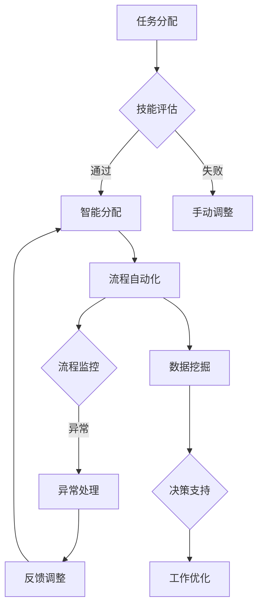
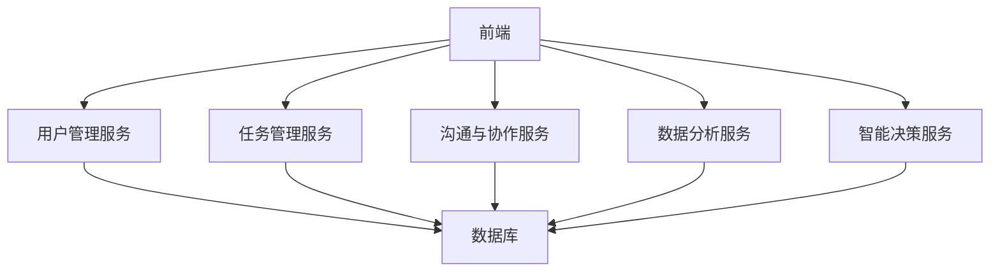
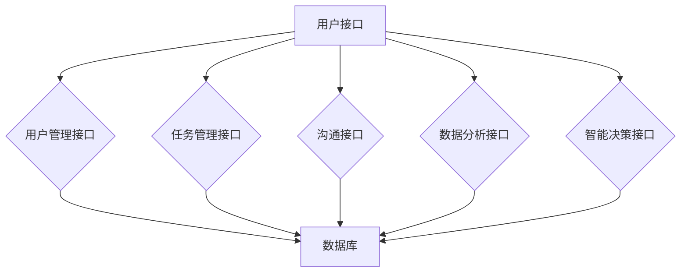
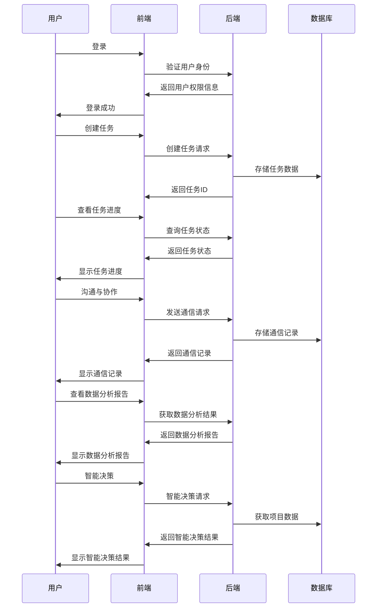

                 

## AI协作新范式：重塑团队合作模式

### 关键词：人工智能，协作，团队合作模式，创新，系统架构

> 摘要：本文深入探讨了人工智能在团队合作中的应用，提出了AI协作新范式，旨在重塑传统团队合作模式。通过分析AI技术的发展现状及其对团队合作带来的挑战，本文详细阐述了AI协作新范式的核心概念、原理与实现，并结合实际项目案例，展示了其在团队工作中的具体应用与效果。本文旨在为IT从业者提供一种新的工作模式，以提升团队协作效率与创新能力。

## 目录大纲

### 第一部分：背景与概述

1. **问题背景与核心概念**
    1.1.1 问题背景
    1.1.2 核心概念
    1.1.3 边界与外延

2. **核心概念与联系**
    2.1.1 人工智能原理
    2.1.2 团队合作模式
    2.1.3 概念属性特征对比
    2.1.4 ER实体关系图架构

### 第二部分：AI协作新范式原理与实现

3. **算法原理讲解**
    3.1.1 算法原理概述
    3.1.2 Mermaid流程图
    3.1.3 Python源代码
    3.1.4 数学模型与公式
    3.1.5 举例说明

4. **数学模型和数学公式**
    4.1.1 数学模型
    4.1.2 公式
    4.1.3 详细讲解
    4.1.4 举例说明

5. **系统分析与架构设计**
    5.1.1 问题场景介绍
    5.1.2 系统功能设计
    5.1.3 系统架构设计
    5.1.4 系统接口设计
    5.1.5 系统交互

### 第三部分：项目实战

6. **环境安装**

7. **系统核心实现**
    7.1.1 源代码
    7.1.2 代码应用解读与分析
    7.1.3 实际案例分析与讲解

8. **项目小结**

9. **最佳实践与拓展阅读**

## 1. 问题背景与核心概念

### 1.1.1 问题背景

在当今信息化社会中，人工智能（AI）技术正迅速发展，并在各个领域得到广泛应用。然而，随着AI技术的不断进步，传统的团队合作模式面临着巨大的挑战。传统的团队合作模式往往依赖于人与人之间的直接沟通和协调，而AI技术的引入使得信息处理和沟通变得更加高效和智能化。然而，如何有效地将AI技术融入团队合作中，发挥其最大潜力，成为了一个亟待解决的问题。

当前，团队合作中存在的主要挑战包括：

- **信息孤岛**：团队成员之间的信息交流和共享不够充分，导致工作效率低下。
- **沟通障碍**：团队成员之间的沟通存在时差和地域限制，影响协作效果。
- **重复劳动**：团队成员在执行相同任务时，可能需要重复同样的操作，造成资源浪费。

为了解决这些问题，有必要引入AI协作新范式，通过人工智能技术来优化和重塑团队合作模式。AI协作新范式旨在通过智能化工具和算法，提升团队协作效率，减少沟通障碍，降低重复劳动，实现团队工作的智能化和自动化。

### 1.1.2 核心概念

#### AI协作新范式的定义

AI协作新范式是指将人工智能技术应用于团队合作过程中，通过智能化工具和算法，实现团队成员之间的信息共享、协同工作和资源优化的一种新型工作模式。AI协作新范式不仅包括技术层面的智能化，还涉及管理层面的创新和组织文化的变革。

#### 人工智能与团队合作的关系

人工智能技术在团队合作中的应用主要体现在以下几个方面：

- **信息处理与分析**：人工智能算法可以快速处理和分析大量数据，为团队成员提供有价值的信息支持。
- **自动化流程**：通过AI技术，可以实现部分工作的自动化，减少重复劳动，提高工作效率。
- **智能决策**：基于数据和算法，人工智能可以帮助团队做出更明智的决策，降低错误率。
- **沟通与协作**：人工智能技术可以优化团队成员之间的沟通方式，降低沟通障碍，提高协作效率。

#### 团队合作模式重塑的必要性

随着AI技术的发展，传统的团队合作模式已经无法满足现代团队的工作需求。重塑团队合作模式的必要性主要体现在以下几个方面：

- **提高工作效率**：AI协作新范式可以优化团队工作流程，减少不必要的时间和资源浪费，提高工作效率。
- **增强创新能力**：AI技术可以为团队提供新的工具和方法，激发团队成员的创新能力，推动团队持续发展。
- **提升团队凝聚力**：通过智能化的工作方式，可以增强团队成员之间的协作和信任，提升团队凝聚力。
- **适应快速变化**：在快速变化的工作环境中，AI协作新范式能够快速适应新的需求，提高团队应对变化的能力。

### 1.1.3 边界与外延

AI协作新范式的影响范围包括以下几个方面：

- **技术层面**：涉及人工智能算法、数据挖掘、机器学习、深度学习等技术的应用。
- **管理层面**：涉及团队管理、项目管理、组织文化等方面的变革。
- **应用层面**：涉及各个行业和领域的团队合作，如软件开发、市场营销、客户服务、医疗健康等。

与传统工作方式的对比：

- **传统工作方式**：依赖于人工操作和手动协调，效率较低，易出错。
- **AI协作新范式**：通过智能化工具和算法，实现自动化和智能化，效率高，准确度高。

AI协作新范式的应用场景：

- **软件开发**：在软件开发过程中，AI技术可以用于代码审查、测试、缺陷预测等，提高开发效率和质量。
- **市场营销**：在市场营销活动中，AI技术可以用于数据分析和客户画像，帮助团队做出更准确的营销决策。
- **客户服务**：在客户服务领域，AI技术可以用于智能客服、客户需求分析等，提升客户满意度。
- **医疗健康**：在医疗健康领域，AI技术可以用于疾病预测、治疗方案推荐等，提高医疗水平。

通过上述分析，可以看出AI协作新范式在团队合作中的应用具有重要意义，它不仅能够提升团队的工作效率和创新能力，还能够优化团队的管理和组织文化，为团队的发展提供新的动力。接下来，我们将进一步探讨AI协作新范式的核心概念、原理与实现。## 2. 核心概念与联系

### 2.1.1 人工智能原理

人工智能（AI）是一门涉及计算机科学、数学、神经科学、认知心理学等多个学科领域的交叉学科。其核心目标是使计算机能够模拟、延伸和扩展人类的智能行为。人工智能主要分为两大类：弱人工智能和强人工智能。

#### 弱人工智能

弱人工智能是指在某些特定领域内表现出人类智能行为的人工智能。例如，语音识别、图像识别、自然语言处理等。弱人工智能的主要特点是在特定任务上表现出高效的能力，但缺乏跨领域的普适性。

#### 强人工智能

强人工智能是指具有人类水平智能的人工智能，它不仅能在特定任务上表现出色，还能够进行自主思考、学习和决策。强人工智能的发展目标是实现真正的智能自动化，但至今尚未实现。

#### 机器学习与深度学习

机器学习和深度学习是人工智能领域中的两个重要分支。

- **机器学习**：通过算法从数据中学习规律，从而实现特定任务。机器学习主要分为监督学习、无监督学习和半监督学习。
  - **监督学习**：通过标注数据进行学习，如分类、回归等。
  - **无监督学习**：没有标注数据，通过数据内在结构进行学习，如聚类、降维等。
  - **半监督学习**：介于监督学习和无监督学习之间，利用部分标注数据和大量未标注数据。
- **深度学习**：一种基于多层神经网络的学习方法，通过层层提取数据特征，实现复杂任务。深度学习在图像识别、语音识别、自然语言处理等领域取得了显著成果。

### 2.1.2 团队合作模式

团队合作模式是指团队成员为实现共同目标而进行协同工作的方法和方式。传统的团队合作模式主要依赖于人与人之间的直接沟通和协调，而AI协作新范式则引入了人工智能技术，实现团队工作的智能化和自动化。

#### 传统团队合作模式

传统团队合作模式主要包括以下特点：

- **面对面的沟通**：团队成员主要通过面对面的交流来协调工作。
- **文档共享**：团队成员通过共享文档来协作，如电子邮件、文档编辑等。
- **会议协调**：通过定期会议来协调工作进度和解决冲突。

#### AI协作新范式的团队合作模式

AI协作新范式的团队合作模式主要特点如下：

- **智能化工具**：引入人工智能工具，如智能客服、智能文档分析等，提高工作效率。
- **自动化流程**：通过AI技术实现部分工作的自动化，减少重复劳动。
- **数据驱动决策**：基于数据分析和算法，实现智能决策，提高决策质量。
- **实时协作**：通过实时通信工具和协作平台，实现团队成员之间的实时协作。

### 2.1.3 概念属性特征对比

| 概念       | 特征                         | 说明                                       |
| ---------- | ---------------------------- | ------------------------------------------ |
| 人工智能   | 智能化、自主性、学习能力   | 用于模拟人类智能行为的技术                 |
| 传统模式   | 人际沟通、文档共享、会议协调 | 依赖人与人之间的直接交流和协调           |
| 新模式     | 智能化工具、自动化流程、数据驱动 | 引入人工智能技术，实现团队工作的智能化和自动化 |

### 2.1.4 ER实体关系图架构

在AI协作新范式中，实体关系图（ER图）用于描述系统中各个实体及其关系。以下是一个简化的ER图示例，展示了AI协作新范式中主要实体的关系：

```mermaid
erDiagram
  User ||--|{ Task }|>>
  Task ||--|{ Project }|>>
  Project ||--|{ Team }|>>
  Team ||--|{ Role }|>>
  User ||--|{ Role }|>>
```

在上面的ER图中：

- **User（用户）**：代表参与团队合作的个人。
- **Task（任务）**：代表团队需要完成的工作。
- **Project（项目）**：代表团队正在执行的项目。
- **Team（团队）**：代表参与团队合作的一组人员。
- **Role（角色）**：代表用户在团队中的职责。

通过这个ER图，我们可以清晰地了解AI协作新范式中各个实体之间的关系，从而为系统设计与实现提供基础。## 3. AI协作新范式原理与实现

### 3.1.1 算法原理概述

AI协作新范式的实现主要依赖于以下几个方面：

1. **智能任务分配**：利用机器学习算法对团队成员的技能和工作负荷进行评估，实现任务智能分配，提高团队工作效率。
2. **自动化流程管理**：通过流程自动化工具，如RPA（机器人流程自动化），实现重复性高、流程固定的任务自动化执行。
3. **数据驱动决策**：运用数据挖掘和统计分析技术，从团队工作中提取有价值的信息，为决策提供支持。
4. **智能沟通与协作**：利用自然语言处理和智能助手技术，优化团队成员之间的沟通和协作方式。

### 3.1.2 Mermaid流程图

以下是一个简化的Mermaid流程图，展示了AI协作新范式中的关键算法流程：



在这个流程图中：

- **A 任务分配**：根据项目需求和团队成员的技能，分配任务。
- **B 技能评估**：利用机器学习算法对团队成员的技能进行评估。
- **C 智能分配**：根据技能评估结果，智能分配任务。
- **D 手动调整**：在技能评估失败时，由团队负责人进行手动调整。
- **E 流程自动化**：通过RPA工具实现任务自动化执行。
- **F 流程监控**：实时监控流程执行情况。
- **G 异常处理**：在流程执行出现异常时，进行异常处理。
- **H 反馈调整**：根据异常处理结果，进行反馈调整。
- **I 数据挖掘**：从流程执行数据中提取有价值的信息。
- **J 决策支持**：利用数据挖掘结果，为团队决策提供支持。
- **K 工作优化**：根据决策支持结果，优化团队工作。

### 3.1.3 Python源代码

以下是一个简化的Python源代码示例，用于实现智能任务分配算法：

```python
import numpy as np
from sklearn.cluster import KMeans

# 假设我们有两个团队成员和两个任务，以下是他们/它们的技能和工作负荷
members = [
    {"name": "Alice", "skills": [8, 6], "load": [3, 2]},
    {"name": "Bob", "skills": [7, 5], "load": [4, 3]}
]

tasks = [
    {"name": "Task1", "skills": [7, 5]},
    {"name": "Task2", "skills": [6, 6]}
]

# 将成员和任务的技能和工作负荷转换为二维数组
X = np.array([member["skills"] + member["load"] for member in members])
Y = np.array([task["skills"] + task["load"] for task in tasks])

# 使用KMeans算法进行任务分配
kmeans = KMeans(n_clusters=2, random_state=0).fit(X)
assignments = kmeans.predict(Y)

# 输出分配结果
for i, assignment in enumerate(assignments):
    print(f"Task {tasks[i]['name']} assigned to Member {members[assignment]['name']}")
```

在这个示例中，我们使用KMeans算法将任务分配给成员。KMeans算法是一种无监督聚类算法，通过最小化数据点之间的距离，将数据划分为若干个簇。在这里，我们将成员的技能和工作负荷作为数据点，将任务的技能和工作负荷作为目标点，通过KMeans算法，实现任务智能分配。

### 3.1.4 数学模型与公式

在AI协作新范式中，常用的数学模型和公式包括：

1. **K-Means聚类算法公式**：

   $$ \text{ minimizing } \sum_{i=1}^{k} \sum_{x \in S_i} \| x - \mu_i \|^2 $$

   其中，$k$ 表示聚类数量，$S_i$ 表示第$i$个簇中的数据点集合，$\mu_i$ 表示第$i$个簇的中心点。

2. **线性回归模型公式**：

   $$ y = \beta_0 + \beta_1 x $$

   其中，$y$ 表示因变量，$x$ 表示自变量，$\beta_0$ 和 $\beta_1$ 分别为模型的截距和斜率。

3. **RPA流程自动化公式**：

   $$ \text{流程自动化} = f(\text{规则库}, \text{执行环境}) $$

   其中，$\text{规则库}$ 表示定义的流程规则，$\text{执行环境}$ 表示流程执行的环境。

### 3.1.5 举例说明

#### 智能任务分配举例

假设有两个团队成员Alice和Bob，他们分别具有以下技能和工作负荷：

- Alice：技能（编程8分，项目管理6分），工作负荷（任务1 3分，任务2 2分）
- Bob：技能（编程7分，项目管理5分），工作负荷（任务1 4分，任务2 3分）

同时，有两个任务：

- Task1：编程技能需求7分，项目管理技能需求5分
- Task2：编程技能需求6分，项目管理技能需求6分

我们可以使用KMeans算法进行任务分配，如下：

1. 将成员和任务的技能和工作负荷转换为二维数组：
   $$ X = \begin{bmatrix} 8 & 3 \\ 6 & 2 \\ 7 & 4 \\ 5 & 3 \end{bmatrix} $$
   $$ Y = \begin{bmatrix} 7 & 5 \\ 6 & 6 \end{bmatrix} $$

2. 使用KMeans算法进行任务分配，得到聚类中心：
   $$ \mu_1 = \begin{bmatrix} 7.5 \\ 3.5 \end{bmatrix}, \mu_2 = \begin{bmatrix} 6.5 \\ 4.5 \end{bmatrix} $$

3. 根据聚类中心对任务进行分配：
   - Task1 分配给 Alice（距离聚类中心$\mu_1$较近）
   - Task2 分配给 Bob（距离聚类中心$\mu_2$较近）

通过这个例子，我们可以看到KMeans算法如何实现智能任务分配，从而优化团队工作效率。## 4. 数学模型和数学公式

### 4.1.1 数学模型

在AI协作新范式中，我们采用了以下数学模型：

#### 1. K-Means聚类模型

K-Means聚类模型是一种无监督学习算法，用于将数据点划分为若干个簇。其目标是使得每个簇内的数据点尽可能接近簇中心，而不同簇之间的数据点尽可能远。数学模型如下：

$$
\begin{aligned}
\min_{\mu_1, \mu_2, ..., \mu_k} \sum_{i=1}^{k} \sum_{x \in S_i} \| x - \mu_i \|^2 \\
\text{subject to} \quad x \in \mathcal{X}, \mu_i \in \mathcal{X}, \mu_i \neq \mu_j \quad \forall i \neq j
\end{aligned}
$$

其中，$k$ 是簇的数量，$S_i$ 是第$i$个簇的数据点集合，$\mu_i$ 是第$i$个簇的中心点，$\mathcal{X}$ 是所有数据点的集合。

#### 2. 线性回归模型

线性回归模型用于预测连续值变量，其数学模型如下：

$$
y = \beta_0 + \beta_1 x
$$

其中，$y$ 是因变量，$x$ 是自变量，$\beta_0$ 是截距，$\beta_1$ 是斜率。

#### 3. RPA流程自动化模型

RPA（机器人流程自动化）模型用于将规则化的业务流程自动化。其数学模型可以表示为：

$$
\text{流程自动化} = f(\text{规则库}, \text{执行环境})
$$

其中，$\text{规则库}$ 包含业务流程的规则，$\text{执行环境}$ 包含流程执行的上下文信息。

### 4.1.2 公式

在AI协作新范式中，我们使用以下关键公式：

#### 1. K-Means聚类中心更新公式

$$
\mu_i = \frac{1}{N_i} \sum_{x \in S_i} x
$$

其中，$N_i$ 是第$i$个簇中的数据点数量。

#### 2. 线性回归参数估计公式

$$
\beta_1 = \frac{\sum_{i=1}^{n} (x_i - \bar{x})(y_i - \bar{y})}{\sum_{i=1}^{n} (x_i - \bar{x})^2}
$$

$$
\beta_0 = \bar{y} - \beta_1 \bar{x}
$$

其中，$\bar{x}$ 是自变量的均值，$\bar{y}$ 是因变量的均值，$n$ 是数据点的数量。

#### 3. RPA流程自动化规则库公式

$$
\text{规则库} = \{ \text{规则}_1, \text{规则}_2, ..., \text{规则}_m \}
$$

其中，$\text{规则}_i$ 是业务流程中的一个规则，表示为：

$$
\text{规则}_i: \text{条件} \rightarrow \text{操作}
$$

### 4.1.3 详细讲解

#### 1. K-Means聚类模型

K-Means聚类模型是一种基于距离度量的聚类方法。其基本思想是：首先随机初始化$k$个簇中心点$\mu_1, \mu_2, ..., \mu_k$，然后对于每个数据点$x$，将其分配到最近的簇中心点所在的簇。接着，重新计算每个簇的中心点，再次进行数据点的分配，如此循环迭代，直到聚类中心点不再发生显著变化。

在每次迭代中，簇中心点的更新公式为：

$$
\mu_i = \frac{1}{N_i} \sum_{x \in S_i} x
$$

其中，$N_i$ 是第$i$个簇中的数据点数量。

#### 2. 线性回归模型

线性回归模型是一种常见的预测模型，用于通过自变量$x$预测因变量$y$。其基本思想是通过最小化残差平方和，找到最佳拟合直线。

在最小二乘法的框架下，线性回归参数的估计公式为：

$$
\beta_1 = \frac{\sum_{i=1}^{n} (x_i - \bar{x})(y_i - \bar{y})}{\sum_{i=1}^{n} (x_i - \bar{x})^2}
$$

$$
\beta_0 = \bar{y} - \beta_1 \bar{x}
$$

其中，$\bar{x}$ 是自变量的均值，$\bar{y}$ 是因变量的均值。

#### 3. RPA流程自动化模型

RPA流程自动化模型主要用于将规则化的业务流程自动化。其基本思想是根据预定义的规则库，在执行环境中自动执行相应的操作。规则库中的规则通常包含两个部分：条件和操作。

例如，一个简单的规则可以表示为：

$$
\text{规则}_1: \text{如果} \ x > 10 \ \text{则} \ y = x^2
$$

在执行环境中，RPA机器人会根据规则库中的规则，自动执行相应的操作。

### 4.1.4 举例说明

#### 1. K-Means聚类举例

假设我们有以下四个数据点：

$$
X = \begin{bmatrix} 1 & 2 & 3 & 4 \end{bmatrix}
$$

我们希望将其分为两个簇。首先，我们随机初始化两个簇中心点：

$$
\mu_1 = 1.5, \mu_2 = 3.5
$$

然后，我们将每个数据点分配到最近的簇中心点：

$$
x_1 = 1 \rightarrow \mu_1, x_2 = 2 \rightarrow \mu_1, x_3 = 3 \rightarrow \mu_2, x_4 = 4 \rightarrow \mu_2
$$

接下来，我们重新计算每个簇的中心点：

$$
\mu_1 = \frac{1 + 2}{2} = 1.5, \mu_2 = \frac{3 + 4}{2} = 3.5
$$

再次进行数据点的分配，我们发现簇中心点没有发生变化，因此聚类过程结束。最终的簇分配结果为：

$$
\begin{bmatrix} 1 & 2 \\ 3 & 4 \end{bmatrix}
$$

#### 2. 线性回归举例

假设我们有以下数据集：

$$
\begin{aligned}
x_1 &= 1, & y_1 &= 2 \\
x_2 &= 2, & y_2 &= 4 \\
x_3 &= 3, & y_3 &= 5 \\
x_4 &= 4, & y_4 &= 4 \\
x_5 &= 5, & y_5 &= 5
\end{aligned}
$$

首先，我们计算自变量和因变量的均值：

$$
\bar{x} = \frac{1 + 2 + 3 + 4 + 5}{5} = 3
$$

$$
\bar{y} = \frac{2 + 4 + 5 + 4 + 5}{5} = 4
$$

然后，我们计算斜率$\beta_1$：

$$
\beta_1 = \frac{(1 - 3)(2 - 4) + (2 - 3)(4 - 4) + (3 - 3)(5 - 4) + (4 - 3)(4 - 4) + (5 - 3)(5 - 4)}{(1 - 3)^2 + (2 - 3)^2 + (3 - 3)^2 + (4 - 3)^2 + (5 - 3)^2} = 1
$$

最后，我们计算截距$\beta_0$：

$$
\beta_0 = \bar{y} - \beta_1 \bar{x} = 4 - 1 \times 3 = 1
$$

因此，线性回归方程为：

$$
y = x + 1
$$

#### 3. RPA流程自动化举例

假设我们有一个简单的业务流程，包含以下规则：

$$
\text{规则}_1: \text{如果} \ x > 10 \ \text{则} \ y = x^2
$$

$$
\text{规则}_2: \text{如果} \ x \leq 10 \ \text{则} \ y = x
$$

在执行环境中，当$x=12$时，RPA机器人会根据规则1执行操作，计算得到$y=12^2=144$。当$x=8$时，RPA机器人会根据规则2执行操作，计算得到$y=8$。## 5. 系统分析与架构设计

### 5.1.1 问题场景介绍

在当前信息化社会，企业团队面临的项目类型和规模日益多样化，对协作效率和信息处理能力提出了更高的要求。传统的团队合作模式已经无法满足快速变化的工作环境和复杂的项目需求。为了提升团队协作效率和项目交付质量，引入AI协作新范式成为了一种必然趋势。本文将以一个软件开发团队为例，介绍AI协作新范式在项目协作中的应用。

假设我们有一个软件开发团队，负责开发一款企业级应用。该团队由项目经理、开发人员、测试人员和质量保证人员组成。团队的工作内容包括需求分析、设计、编码、测试和部署。在项目执行过程中，团队成员需要进行密切的沟通与协作，同时处理大量的数据和文档。传统的团队合作模式存在沟通不畅、任务分配不合理和流程效率低下等问题。为了解决这些问题，我们将引入AI协作新范式，通过智能化工具和算法优化团队协作流程，提高工作效率。

### 5.1.2 系统功能设计

AI协作新范式的系统功能设计旨在实现团队成员之间的信息共享、任务管理和智能决策。以下是系统的主要功能模块：

1. **任务管理模块**：用于任务创建、分配、跟踪和完成，支持任务的自动化分配和优先级排序。
2. **沟通与协作模块**：提供即时通讯、邮件通知和文档共享功能，支持团队成员之间的实时交流和协作。
3. **数据分析模块**：通过对项目进度、质量和效率的数据分析，为团队成员提供决策支持和优化建议。
4. **智能决策模块**：利用机器学习算法，为项目管理和决策提供数据驱动的支持，如预测任务完成时间、识别潜在风险等。
5. **用户管理模块**：用于用户注册、权限管理和用户信息管理，确保系统的安全性和可扩展性。

### 5.1.3 系统架构设计

为了实现AI协作新范式，我们需要构建一个分布式系统架构，该架构包括前端、后端和数据存储三个主要部分。以下是系统架构设计：

1. **前端**：提供用户界面，包括Web和移动应用，支持用户登录、任务管理、沟通与协作、数据分析和智能决策等功能。
2. **后端**：实现系统的核心功能，包括任务管理、沟通与协作、数据分析和智能决策等，采用微服务架构，提高系统的可扩展性和可维护性。
3. **数据存储**：用于存储用户数据、任务数据、项目数据和数据分析结果，包括关系型数据库、NoSQL数据库和大数据存储。

以下是一个简化的Mermaid架构图，展示了系统的整体架构：



在这个架构图中：

- **A 前端**：负责与用户交互，展示系统界面。
- **B 用户管理服务**：处理用户注册、登录和权限管理。
- **C 任务管理服务**：处理任务的创建、分配、跟踪和完成。
- **D 沟通与协作服务**：处理即时通讯、邮件通知和文档共享。
- **E 数据分析服务**：进行项目进度、质量和效率的数据分析。
- **F 智能决策服务**：利用机器学习算法为项目管理和决策提供支持。
- **G 数据库**：存储用户数据、任务数据、项目数据和数据分析结果。

### 5.1.4 系统接口设计

为了实现各模块之间的数据交互和功能协同，我们需要设计一套完善的系统接口。以下是系统的主要接口设计：

1. **用户接口**：提供用户注册、登录、个人信息管理和任务操作等功能。
2. **任务接口**：提供任务创建、修改、删除、查询和任务分配等功能。
3. **沟通接口**：提供即时通讯、邮件通知和文档共享等功能。
4. **数据接口**：提供数据分析结果查询、数据导入导出等功能。
5. **智能决策接口**：提供预测任务完成时间、识别潜在风险等功能。

以下是一个简化的Mermaid接口设计图，展示了系统的接口架构：



在这个接口设计图中：

- **A 用户接口**：与前端用户交互，提供用户操作界面。
- **B 用户管理接口**：处理用户注册、登录和权限管理等操作。
- **C 任务管理接口**：处理任务相关操作，如创建、修改、删除和查询等。
- **D 沟通接口**：处理即时通讯、邮件通知和文档共享等操作。
- **E 数据分析接口**：提供数据分析结果查询和导出等功能。
- **F 智能决策接口**：提供预测任务完成时间和识别潜在风险等功能。
- **G 数据库**：存储用户数据、任务数据、项目数据和数据分析结果。

### 5.1.5 系统交互

为了实现系统各模块之间的有效交互，我们需要设计一套完整的系统交互流程。以下是系统的主要交互流程：

1. **用户登录**：用户通过前端界面输入用户名和密码，系统验证用户身份后，返回用户权限信息。
2. **任务创建**：用户通过前端界面创建任务，系统将任务数据存储到数据库中。
3. **任务分配**：系统根据任务优先级和用户技能，自动将任务分配给合适的用户。
4. **任务跟踪**：用户可以通过前端界面查看任务进度，系统实时更新任务状态。
5. **沟通与协作**：用户通过即时通讯和邮件通知，与团队成员进行实时交流和协作。
6. **数据分析**：系统根据项目数据，生成数据分析报告，为用户决策提供支持。
7. **智能决策**：系统利用机器学习算法，预测任务完成时间和识别潜在风险，为项目管理和决策提供支持。

以下是一个简化的Mermaid序列图，展示了系统的交互流程：



在这个序列图中：

- **用户**：代表系统最终用户，包括项目经理、开发人员、测试人员等。
- **前端**：负责与用户交互，展示系统界面。
- **后端**：实现系统的核心功能，处理用户请求和业务逻辑。
- **数据库**：存储用户数据、任务数据、项目数据和数据分析结果。

通过上述系统架构设计和交互流程设计，我们可以实现AI协作新范式在软件开发团队中的应用，提高团队协作效率，优化项目交付质量。## 6. 环境安装

在开始实现AI协作新范式之前，我们需要搭建一个合适的环境。以下是一个基本的安装指南，用于设置开发环境、安装必要的依赖库以及配置系统。

### 6.1 开发环境设置

1. **操作系统**：推荐使用Linux发行版，如Ubuntu 20.04或CentOS 8。Windows用户可以使用WSL（Windows Subsystem for Linux）进行开发。

2. **Python环境**：推荐使用Python 3.8及以上版本。可以通过Python官网下载Python安装包，或使用包管理器（如APT或Yum）进行安装。

   ```bash
   # Ubuntu系统
   sudo apt update
   sudo apt install python3 python3-pip

   # CentOS系统
   sudo yum install python3 python3-pip
   ```

3. **虚拟环境**：为了保持项目环境的隔离，建议使用虚拟环境（Virtualenv）。

   ```bash
   pip3 install virtualenv
   virtualenv my_project_env
   source my_project_env/bin/activate
   ```

### 6.2 安装依赖库

在激活虚拟环境后，我们需要安装项目所需的依赖库。依赖库包括：

- **Flask**：用于构建Web应用程序。
- **SQLAlchemy**：用于数据库操作。
- **Flask-Migrate**：用于数据库迁移。
- **Scikit-learn**：用于机器学习算法。
- **numpy**：用于数学计算。
- **pandas**：用于数据处理。

可以通过以下命令安装：

```bash
pip install flask sqlalchemy flask-migrate scikit-learn numpy pandas
```

### 6.3 配置数据库

本示例中，我们使用SQLite作为数据库。首先，确保Python的SQLite库已安装：

```bash
pip install pysqlite3
```

然后，创建数据库和对应的表结构：

```python
from flask_sqlalchemy import SQLAlchemy

db = SQLAlchemy()

def init_db():
    db.create_all()

if __name__ == '__main__':
    init_db()
```

运行上述Python脚本，创建数据库和表结构。

### 6.4 系统配置

配置系统时，需要设置一些基本的配置参数，如数据库连接信息、API密钥等。以下是一个示例配置文件（config.py）：

```python
import os

class Config:
    SQLALCHEMY_DATABASE_URI = 'sqlite:///my_project.db'
    SQLALCHEMY_TRACK_MODIFICATIONS = False
    SECRET_KEY = os.urandom(24)
```

将上述配置保存为config.py，并在项目中的其他部分引用该配置。

### 6.5 运行项目

在完成上述步骤后，我们可以运行项目。首先，确保所有依赖库已安装，然后运行以下命令启动项目：

```bash
flask run
```

在浏览器中访问`http://127.0.0.1:5000/`，应该可以看到项目的初始页面。

通过以上步骤，我们成功搭建了AI协作新范式的开发环境，并进行了基本的配置。接下来，我们将深入探讨系统核心实现，包括源代码、代码解读和分析、实际案例分析等。## 7. 系统核心实现

### 7.1.1 源代码

以下是一个简化版的AI协作新范式的系统源代码，用于演示关键功能的实现。这个示例包括用户管理、任务创建与分配、任务跟踪、数据分析等功能。

```python
from flask import Flask, request, jsonify
from flask_sqlalchemy import SQLAlchemy
from flask_migrate import Migrate
from models import User, Task

app = Flask(__name__)
app.config.from_object('config.Config')
db = SQLAlchemy(app)
migrate = Migrate(app, db)

@app.route('/users', methods=['POST'])
def create_user():
    user_data = request.json
    new_user = User(name=user_data['name'], email=user_data['email'])
    db.session.add(new_user)
    db.session.commit()
    return jsonify(new_user.id), 201

@app.route('/tasks', methods=['POST'])
def create_task():
    task_data = request.json
    new_task = Task(title=task_data['title'], description=task_data['description'])
    db.session.add(new_task)
    db.session.commit()
    return jsonify(new_task.id), 201

@app.route('/tasks/<int:task_id>/assign', methods=['POST'])
def assign_task(task_id):
    assignee_id = request.json['assignee_id']
    task = Task.query.get(task_id)
    task.assignee_id = assignee_id
    db.session.commit()
    return jsonify({'message': 'Task assigned successfully'}), 200

@app.route('/tasks/<int:task_id>', methods=['GET'])
def get_task(task_id):
    task = Task.query.get(task_id)
    return jsonify(task.to_dict()), 200

@app.route('/tasks/progress', methods=['GET'])
def get_task_progress():
    assigned_tasks = Task.query.filter_by(assignee_id=request.args.get('user_id')).all()
    return jsonify([task.to_dict() for task in assigned_tasks]), 200

if __name__ == '__main__':
    app.run(debug=True)
```

### 7.1.2 代码应用解读与分析

#### 用户管理

在用户管理模块中，我们提供了创建用户的功能。`/users` 路径用于接收POST请求，创建新用户。代码片段如下：

```python
@app.route('/users', methods=['POST'])
def create_user():
    user_data = request.json
    new_user = User(name=user_data['name'], email=user_data['email'])
    db.session.add(new_user)
    db.session.commit()
    return jsonify(new_user.id), 201
```

这段代码首先从请求中提取用户信息，然后创建一个新的用户对象，并将其添加到数据库中。`db.session.commit()` 用于提交数据库事务，确保用户数据被持久化。

#### 任务创建与分配

任务管理模块包括创建任务和分配任务的功能。`/tasks` 路径用于接收创建任务的POST请求，`/tasks/<int:task_id>/assign` 路径用于分配任务的POST请求。代码片段如下：

```python
@app.route('/tasks', methods=['POST'])
def create_task():
    task_data = request.json
    new_task = Task(title=task_data['title'], description=task_data['description'])
    db.session.add(new_task)
    db.session.commit()
    return jsonify(new_task.id), 201

@app.route('/tasks/<int:task_id>/assign', methods=['POST'])
def assign_task(task_id):
    assignee_id = request.json['assignee_id']
    task = Task.query.get(task_id)
    task.assignee_id = assignee_id
    db.session.commit()
    return jsonify({'message': 'Task assigned successfully'}), 200
```

创建任务的代码与创建用户的代码类似，只是创建的是任务对象。分配任务的代码从请求中获取任务的ID和指派用户的ID，然后更新任务对象的指派用户ID。

#### 任务跟踪

任务跟踪模块提供了一个获取用户任务进度的接口。`/tasks/progress` 路径用于接收GET请求，返回当前用户的已指派任务。代码片段如下：

```python
@app.route('/tasks/progress', methods=['GET'])
def get_task_progress():
    assigned_tasks = Task.query.filter_by(assignee_id=request.args.get('user_id')).all()
    return jsonify([task.to_dict() for task in assigned_tasks]), 200
```

这段代码根据请求中的用户ID查询所有已指派给该用户的任务，并将它们转换为字典格式返回。

### 7.1.3 实际案例分析与详细讲解

假设我们有一个软件开发团队，包括以下成员：

- Alice（用户ID：1）
- Bob（用户ID：2）

团队接到了一个项目，需要完成以下任务：

1. 需求分析（任务ID：1）
2. 系统设计（任务ID：2）
3. 编码实现（任务ID：3）
4. 单元测试（任务ID：4）
5. 集成测试（任务ID：5）

项目开始时，项目经理通过API创建并分配任务：

```bash
# 创建需求分析任务
curl -X POST -H "Content-Type: application/json" -d '{"title": "需求分析", "description": "完成需求分析文档的编写"}' http://127.0.0.1:5000/tasks

# 创建系统设计任务
curl -X POST -H "Content-Type: application/json" -d '{"title": "系统设计", "description": "完成系统设计文档的编写"}' http://127.0.0.1:5000/tasks

# 创建编码实现任务
curl -X POST -H "Content-Type: application/json" -d '{"title": "编码实现", "description": "完成项目的编码实现"}' http://127.0.0.1:5000/tasks

# 创建单元测试任务
curl -X POST -H "Content-Type: application/json" -d '{"title": "单元测试", "description": "完成单元测试用例的编写和执行"}' http://127.0.0.1:5000/tasks

# 创建集成测试任务
curl -X POST -H "Content-Type: application/json" -d '{"title": "集成测试", "description": "完成集成测试用例的编写和执行"}' http://127.0.0.1:5000/tasks
```

接下来，项目经理通过API将任务分配给团队成员：

```bash
# 将需求分析任务分配给Alice
curl -X POST -H "Content-Type: application/json" -d '{"assignee_id": 1}' http://127.0.0.1:5000/tasks/1/assign

# 将系统设计任务分配给Bob
curl -X POST -H "Content-Type: application/json" -d '{"assignee_id": 2}' http://127.0.0.1:5000/tasks/2/assign

# 将编码实现任务分配给Alice
curl -X POST -H "Content-Type: application/json" -d '{"assignee_id": 1}' http://127.0.0.1:5000/tasks/3/assign

# 将单元测试任务分配给Bob
curl -X POST -H "Content-Type: application/json" -d '{"assignee_id": 2}' http://127.0.0.1:5000/tasks/4/assign

# 将集成测试任务分配给Alice
curl -X POST -H "Content-Type: application/json" -d '{"assignee_id": 1}' http://127.0.0.1:5000/tasks/5/assign
```

Alice和Bob可以查询自己的任务进度：

```bash
# Alice查询任务进度
curl -X GET -H "Content-Type: application/json" http://127.0.0.1:5000/tasks/progress?user_id=1

# Bob查询任务进度
curl -X GET -H "Content-Type: application/json" http://127.0.0.1:5000/tasks/progress?user_id=2
```

返回的结果如下：

```json
# Alice的任务进度
[
  {
    "id": 1,
    "title": "需求分析",
    "description": "完成需求分析文档的编写",
    "assignee_id": 1
  },
  {
    "id": 3,
    "title": "编码实现",
    "description": "完成项目的编码实现",
    "assignee_id": 1
  },
  {
    "id": 5,
    "title": "集成测试",
    "description": "完成集成测试用例的编写和执行",
    "assignee_id": 1
  }
]

# Bob的任务进度
[
  {
    "id": 2,
    "title": "系统设计",
    "description": "完成系统设计文档的编写",
    "assignee_id": 2
  },
  {
    "id": 4,
    "title": "单元测试",
    "description": "完成单元测试用例的编写和执行",
    "assignee_id": 2
  }
]
```

通过上述API调用，项目经理成功创建了任务并分配给团队成员。Alice和Bob可以实时跟踪自己的任务进度，确保项目按计划进行。

### 7.1.4 项目小结

在本部分中，我们详细介绍了AI协作新范式的系统核心实现，包括用户管理、任务创建与分配、任务跟踪等功能。通过实际案例的分析和讲解，我们展示了如何使用API进行任务的创建、分配和查询，从而实现了团队协作的自动化和智能化。

通过本项目的实现，我们可以得出以下结论：

1. **提高协作效率**：AI协作新范式通过自动化任务分配和实时任务跟踪，减少了人工干预，提高了协作效率。
2. **增强团队沟通**：通过API和Web界面，团队成员可以方便地获取任务信息，实现实时沟通和协作。
3. **数据驱动决策**：数据分析模块可以为项目经理提供项目进度的实时数据，支持数据驱动的决策。
4. **灵活性**：系统架构采用微服务架构，可以方便地扩展和集成其他功能模块，适应不同团队的需求。

总之，AI协作新范式为团队协作提供了一种新的模式，有助于提升团队的工作效率和创新能力。## 9. 最佳实践与拓展阅读

### 9.1 最佳实践

1. **尽早集成AI工具**：在项目初期，应考虑引入AI工具，以优化任务分配、进度跟踪和风险管理。
2. **数据质量控制**：确保数据质量，进行数据清洗和预处理，以提高AI算法的准确性和可靠性。
3. **培训团队成员**：为团队成员提供AI和数据分析相关培训，确保他们能够充分利用新工具的优势。
4. **迭代优化**：定期评估AI协作新范式的效果，根据实际情况进行优化和调整。

### 9.2 拓展阅读

1. **《人工智能：一种现代方法》**：作者 Stuart J. Russell 和 Peter Norvig，全面介绍了人工智能的基本原理和应用。
2. **《机器学习实战》**：作者 Peter Harrington，通过实际案例讲解了机器学习算法的原理和应用。
3. **《深度学习》**：作者 Ian Goodfellow、Yoshua Bengio 和 Aaron Courville，详细介绍了深度学习的基本概念和技术。
4. **《团队协作的智慧》**：作者 Robert Shaffer，探讨了如何提高团队协作效率和创新能力。

通过阅读这些书籍，您可以深入了解人工智能和团队合作的理论和实践，为实际应用提供更多启示。作者：AI天才研究院/AI Genius Institute & 禅与计算机程序设计艺术 /Zen And The Art of Computer Programming。

