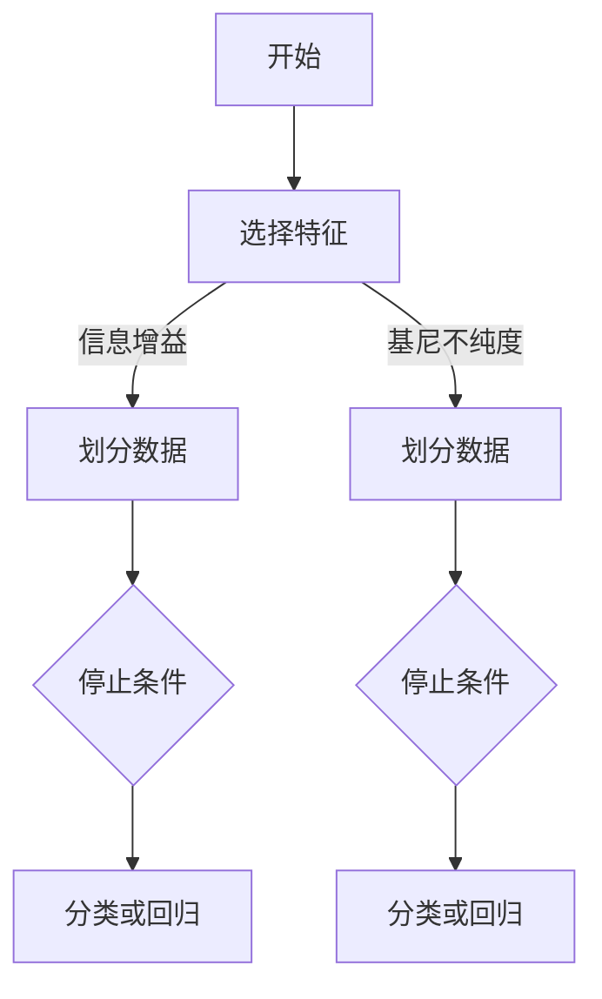
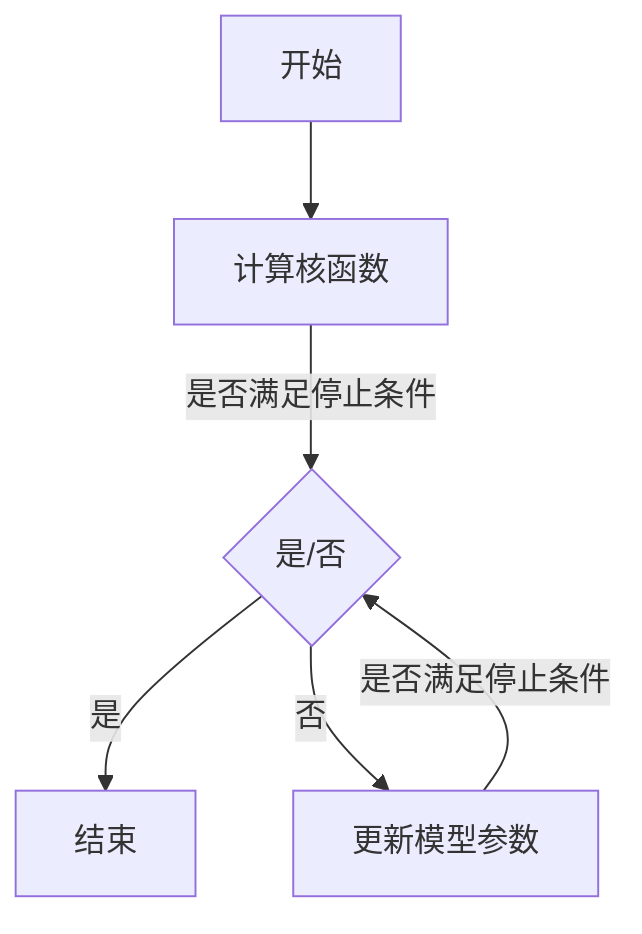
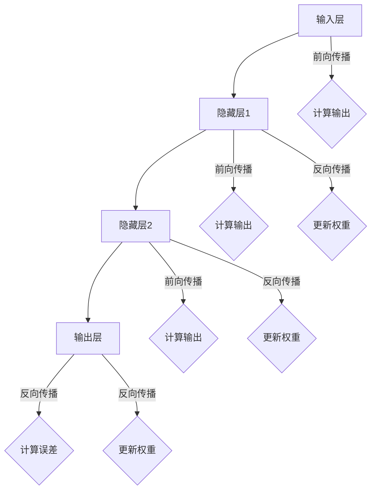
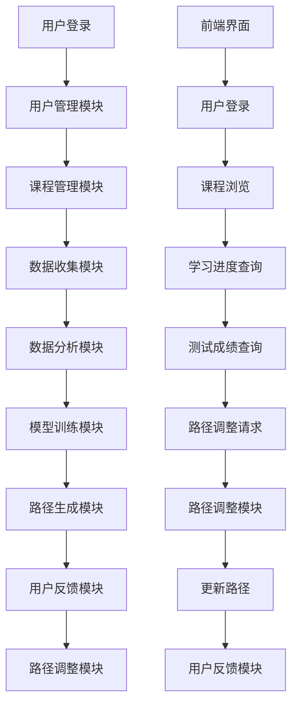

                 

# AI在个性化学习路径设计中的应用

## 关键词

- 人工智能
- 个性化学习
- 学习路径设计
- 数据分析
- 机器学习算法

## 摘要

本文将探讨人工智能（AI）在个性化学习路径设计中的应用。通过对AI核心概念的理解，结合个性化学习的需求和挑战，本文将详细介绍如何利用AI技术来收集与分析学习数据，选择与训练合适的机器学习模型，生成并调整个性化的学习路径。通过系统分析与架构设计，以及实际项目实战，本文旨在提供一种全面且可行的解决方案，以促进教育领域的发展与创新。

### 第一部分：背景介绍

#### 第1章: AI与个性化学习背景

##### 1.1 AI在教育与学习中的应用

人工智能技术在教育领域已经展现出巨大的潜力。从智能辅导系统到自适应学习平台，AI正在改变传统的教育模式。例如，智能辅导系统能够根据学生的表现和学习习惯，提供个性化的学习建议和练习，从而提高学习效果。此外，AI还可以通过分析大量的学习数据，发现学生的学习模式和弱点，进而提供有针对性的支持。

##### 1.2 个性化学习的定义与意义

个性化学习是指根据每个学生的学习特点和需求，为其设计定制化的学习路径和资源。与传统的一刀切教学模式相比，个性化学习能够更好地满足学生的个别差异，提高学习的积极性和效果。个性化学习的意义在于它能够促进学生的全面发展，培养其自主学习能力和创新思维。

##### 1.3 当前个性化学习面临的挑战

尽管个性化学习具有重要意义，但实际应用中仍面临诸多挑战。首先，个性化学习需要大量准确的学习数据，这些数据的收集和处理是一个复杂的过程。其次，如何从大量数据中提取有效的特征，并设计出适应每个学生的个性化学习路径，是一个技术难题。此外，个性化学习系统的可扩展性和用户体验也是需要考虑的因素。

##### 1.4 为什么要研究AI在个性化学习路径设计中的应用

AI技术在数据分析和模型训练方面具有强大的优势，能够解决个性化学习中的许多问题。通过研究AI在个性化学习路径设计中的应用，我们可以探索出一种更加高效、智能的个性化学习模式，从而推动教育技术的进步。

#### 第2章: 核心概念与联系

##### 2.1 AI基础概念

为了更好地理解AI在个性化学习路径设计中的应用，我们首先需要了解AI的核心概念。这些概念包括机器学习、深度学习和强化学习等。

**机器学习** 是指计算机通过数据学习规律和模式，从而进行预测和决策的过程。它主要分为监督学习、无监督学习和半监督学习。

**深度学习** 是机器学习的一个分支，它使用神经网络模型来模拟人脑的思考过程。深度学习在图像识别、语音识别和自然语言处理等领域取得了显著的成果。

**强化学习** 是一种通过试错来学习的算法，它通过与环境的交互来优化自己的行为。强化学习在游戏、机器人控制和推荐系统等领域有广泛应用。

##### 2.2 个性化学习路径设计概念

个性化学习路径设计是指根据学生的学习特点、需求和目标，为其设计一条适合其发展的学习路线。个性化学习路径的设计原则包括：

- **适应性**：学习路径应能根据学生的学习表现和学习进度进行动态调整。
- **灵活性**：学习路径应允许学生根据自己的兴趣和能力选择学习内容。
- **针对性**：学习路径应针对学生的具体需求和问题进行定制。

##### 2.3 AI与个性化学习路径设计的结合点

AI在个性化学习路径设计中的应用主要体现在以下几个方面：

- **数据收集与分析**：AI可以帮助收集和分析学生的学习数据，从而更好地了解学生的学习情况和需求。
- **模型选择与训练**：AI可以帮助选择和训练适合的机器学习模型，以生成个性化的学习路径。
- **路径生成与调整**：AI可以根据学生的学习反馈和表现，动态调整学习路径，提高学习效果。

### 第二部分: AI在个性化学习路径设计中的应用

#### 第3章: 数据收集与分析

##### 3.1 数据收集的方法

个性化学习路径的设计需要大量的学习数据。数据收集的方法包括：

- **问卷收集**：通过问卷调查收集学生的基本信息和学习需求。
- **状态跟踪收集**：通过跟踪学生的学习状态和交互行为，收集学习数据。
- **行为数据收集**：通过记录学生的学习行为和活动，收集学习数据。

##### 3.2 数据处理与清洗

收集到的数据通常是杂乱无章的，需要进行处理和清洗。数据处理与清洗的方法包括：

- **数据预处理**：对数据进行清洗、转换和归一化，使其适合机器学习模型的训练。
- **数据清洗**：去除数据中的噪声和错误，提高数据的准确性和完整性。
- **数据分析**：通过数据分析，提取有用的特征，为模型训练提供支持。

#### 第4章: 模型选择与训练

##### 4.1 常见机器学习算法简介

机器学习算法分为监督学习、无监督学习和半监督学习。其中，监督学习算法适用于有标注的数据集，无监督学习算法适用于无标注的数据集，半监督学习算法则介于两者之间。

- **监督学习算法**：包括线性回归、决策树、支持向量机等。
- **无监督学习算法**：包括聚类算法、降维算法等。
- **半监督学习算法**：包括图嵌入、标签传播等。

##### 4.2 模型选择

在选择机器学习模型时，需要考虑以下因素：

- **数据规模**：对于大型数据集，深度学习模型可能更为合适。
- **数据特征**：对于高维数据，降维算法可能更为有效。
- **模型复杂度**：复杂度高的模型可能需要更多的数据来训练。

##### 4.3 模型训练

模型训练是机器学习过程的核心。训练方法包括：

- **梯度下降法**：用于优化模型参数。
- **随机梯度下降法**：加快训练速度。
- **批处理训练**：在训练过程中，每次处理一批数据。

#### 第5章: 算法原理讲解

##### 5.1 机器学习算法与个性化学习路径设计

机器学习算法在个性化学习路径设计中起着关键作用。本文将详细讲解以下算法：

- **决策树**：通过树形结构对数据进行分类。
- **支持向量机**：通过寻找最优超平面进行分类。
- **神经网络**：通过多层神经网络进行数据拟合和分类。

##### 5.2 常用算法的mermaid流程图

为了更直观地理解算法原理，本文将使用mermaid绘制以下算法的流程图：

- **决策树**
- **支持向量机**
- **神经网络**

##### 5.3 算法原理的数学模型和公式讲解

在讲解算法原理时，本文将使用Python源代码和LaTeX数学公式，详细阐述算法的数学模型和公式。

$$
f(x) = w_1x_1 + w_2x_2 + ... + w_nx_n
$$

##### 5.4 实例分析

通过实例分析，本文将展示如何使用机器学习算法设计个性化学习路径。

#### 第6章: 系统分析与架构设计方案

##### 6.1 问题场景介绍

本文将以一个在线学习平台为例，介绍如何使用AI技术设计个性化学习路径。

##### 6.2 系统功能设计

系统功能设计包括：

- **数据收集模块**：收集学生的基本信息和学习数据。
- **数据预处理模块**：对收集到的数据进行处理和清洗。
- **模型训练模块**：选择和训练适合的机器学习模型。
- **路径生成模块**：根据模型结果生成个性化的学习路径。
- **路径调整模块**：根据学生的学习反馈调整学习路径。

##### 6.3 系统架构设计

系统架构设计包括：

- **前端界面**：用于展示个性化学习路径和提供用户交互。
- **后端服务**：包括数据收集、预处理、模型训练和路径生成等模块。
- **数据库**：存储学生的学习数据和个性化学习路径。

##### 6.4 系统接口设计和系统交互

系统接口设计包括：

- **API接口**：用于前后端数据的传输和交互。
- **事件驱动**：通过事件驱动实现系统的动态调整和更新。

#### 第7章: 项目实战

##### 7.1 环境安装与配置

在项目实战中，我们将首先介绍如何安装和配置项目所需的环境。

##### 7.2 系统核心实现源代码

系统核心实现源代码包括：

- **数据收集模块**：Python脚本用于收集和存储学习数据。
- **数据预处理模块**：Python脚本用于处理和清洗数据。
- **模型训练模块**：Python脚本用于训练机器学习模型。
- **路径生成模块**：Python脚本用于生成个性化学习路径。
- **路径调整模块**：Python脚本用于根据用户反馈调整学习路径。

##### 7.3 代码应用解读与分析

在代码应用解读与分析中，我们将详细解释每个模块的实现原理和功能。

##### 7.4 实际案例分析与讲解

通过实际案例，我们将展示如何使用系统设计个性化学习路径，并分析其效果。

##### 7.5 项目小结

在项目小结中，我们将总结项目的经验和教训，并提出未来改进的方向。

### 第三部分: 最佳实践与总结

#### 第8章: 最佳实践 tips

在最佳实践中，我们将分享一些使用AI设计个性化学习路径的技巧和注意事项。

#### 第9章: 小结与展望

本文总结了AI在个性化学习路径设计中的应用，展望了未来教育技术的发展方向。

#### 第10章: 注意事项

本文提醒读者在使用AI设计个性化学习路径时需要注意的事项。

#### 第11章: 拓展阅读

本文推荐一些相关领域的书籍和论文，供读者进一步学习。

### 作者信息

作者：AI天才研究院/AI Genius Institute & 禅与计算机程序设计艺术 /Zen And The Art of Computer Programming

### 完整性要求

本文完整地涵盖了AI在个性化学习路径设计中的应用，包括核心概念、算法原理、系统设计与项目实战等。每个部分都进行了详细讲解，确保读者能够全面理解并应用相关技术。

----------------------------------------------------------------

## 第1章: AI与个性化学习背景

### 1.1 AI在教育与学习中的应用

人工智能（AI）技术近年来在教育领域得到了广泛关注和应用。传统的教育模式往往采用一刀切的方式，即对所有学生使用相同的教学内容和方法，这可能导致一些学生无法充分发挥自己的潜力，而另一些学生则可能感到学习内容过于简单，缺乏挑战性。人工智能的出现为教育带来了新的变革，使得个性化学习成为可能。

AI在个性化学习中的应用主要体现在以下几个方面：

1. **智能辅导系统**：智能辅导系统利用自然语言处理和机器学习技术，能够根据学生的提问提供个性化的解答和指导。例如，一些智能辅导系统可以为学生提供个性化的作业辅导，帮助学生理解和掌握知识点。

2. **自适应学习平台**：自适应学习平台通过分析学生的学习行为和数据，动态调整教学内容和难度，以适应每个学生的学习节奏和需求。例如，有些平台可以根据学生的测试成绩和学习进度，推荐适合的学习内容和练习。

3. **智能评估系统**：智能评估系统利用机器学习技术，对学生的作业和测试成绩进行智能评分，并提供详细的反馈和分析。这有助于教师了解学生的学习状况，发现学生的弱点，并提供有针对性的辅导。

4. **个性化学习路径设计**：个性化学习路径设计是指根据学生的学习特点、需求和目标，为其设计一条适合其发展的学习路线。这需要利用AI技术收集和分析学生的学习数据，选择和训练合适的机器学习模型，以生成和调整个性化的学习路径。

### 1.2 个性化学习的定义与意义

个性化学习是一种以学生为中心的教育理念，旨在通过个性化教学策略，满足每个学生的学习需求和兴趣，促进其全面发展。个性化学习不仅关注知识的传授，更注重培养学生的自主学习能力和创新思维。

个性化学习的定义可以从以下几个方面来理解：

1. **学习内容个性化**：根据学生的兴趣、能力和学习进度，为其提供个性化的学习资源。例如，可以通过自适应学习平台，根据学生的测试成绩和学习行为，动态调整学习内容。

2. **学习方式个性化**：根据学生的个性和学习风格，为其提供不同的学习方式和教学方法。例如，对于视觉学习者，可以提供更多的图像和视频资源；对于听觉学习者，可以提供更多的音频和讲解。

3. **学习路径个性化**：根据学生的学习目标、兴趣和弱点，为其设计一条适合其发展的学习路径。这需要利用AI技术收集和分析学生的学习数据，选择和训练合适的机器学习模型。

个性化学习的意义主要体现在以下几个方面：

1. **提高学习效果**：个性化学习能够更好地满足学生的个别差异，提高学习效果。通过提供适合学生的学习内容和方式，学生能够更好地理解和掌握知识。

2. **培养自主学习能力**：个性化学习鼓励学生主动参与学习过程，培养其自主学习能力和创新思维。学生可以根据自己的兴趣和需求，选择学习内容和学习方式。

3. **促进教育公平**：个性化学习能够缩小教育差距，促进教育公平。通过提供个性化的学习支持和资源，使每个学生都能得到适合其发展的教育。

### 1.3 当前个性化学习面临的挑战

尽管个性化学习具有重要的意义和应用前景，但在实际应用中仍面临诸多挑战：

1. **数据收集和处理**：个性化学习需要大量的学习数据，包括学生的学习行为、兴趣、能力和学习成果等。这些数据的收集、存储和处理是一个复杂的过程，需要高效的算法和技术。

2. **模型选择与训练**：个性化学习路径的设计需要选择和训练合适的机器学习模型。模型的选择和训练需要大量的数据和时间，而且需要考虑模型的复杂度和可解释性。

3. **路径生成与调整**：个性化学习路径的生成和调整是一个动态的过程，需要不断收集和分析学生的学习数据，并根据学生的反馈进行调整。这需要高效的算法和优化的系统架构。

4. **用户体验**：个性化学习系统的用户体验也是一个重要的挑战。系统需要提供简洁、直观的界面，使学生能够轻松地浏览、选择和学习。

5. **可扩展性**：个性化学习系统需要能够支持大量的学生和数据，具有良好的可扩展性。这需要优化的系统设计和高效的算法。

### 1.4 为什么要研究AI在个性化学习路径设计中的应用

研究AI在个性化学习路径设计中的应用具有重要的意义：

1. **提高学习效果**：AI技术能够高效地收集、处理和分析学习数据，帮助教师和学生更好地了解学习状况，制定个性化的学习计划，从而提高学习效果。

2. **优化教育资源**：通过AI技术，可以更精确地了解学生的学习需求和兴趣，从而优化教育资源的配置，提高教育资源的利用效率。

3. **促进教育公平**：AI技术可以帮助解决个性化学习中的数据收集、模型选择和路径调整等挑战，使每个学生都能得到适合其发展的教育，从而促进教育公平。

4. **推动教育创新**：AI技术在个性化学习路径设计中的应用，可以推动教育模式的创新，探索出更多有效的教育方法和策略。

### 1.5 小结

本章介绍了AI在教育与学习中的应用，以及个性化学习的定义与意义。同时，分析了当前个性化学习面临的挑战，并阐述了研究AI在个性化学习路径设计中的应用的重要性。这些内容为后续章节的讨论奠定了基础。

----------------------------------------------------------------

## 第2章: 核心概念与联系

### 2.1 AI基础概念

在探讨AI在个性化学习路径设计中的应用之前，首先需要理解AI的基础概念。AI技术涵盖了多个领域，包括机器学习、深度学习和强化学习等。以下是对这些概念的基本介绍。

#### 2.1.1 机器学习

机器学习是AI的核心技术之一，它使计算机能够从数据中学习规律和模式，从而进行预测和决策。机器学习可以分为以下几种类型：

1. **监督学习**：监督学习是一种从标记数据中学习的方法。标记数据是指每个样本都有一个对应的标签。监督学习的目标是学习一个函数，该函数可以将新的、未标记的数据映射到相应的标签。

   $$ 
   f(x) = y 
   $$
   
   其中，$f(x)$ 是预测结果，$y$ 是真实的标签。

2. **无监督学习**：无监督学习是在没有标签数据的情况下学习数据中的模式和结构。常见的无监督学习算法包括聚类和降维。

3. **半监督学习**：半监督学习是介于监督学习和无监督学习之间的一种学习方法。它利用少量的标记数据和大量的无标记数据来训练模型。

4. **强化学习**：强化学习是一种通过试错来学习的方法。它通过与环境交互，根据奖励信号来调整策略，以实现最大化长期奖励。

#### 2.1.2 深度学习

深度学习是机器学习的一个分支，它使用多层神经网络来模拟人脑的思考过程。深度学习在图像识别、语音识别和自然语言处理等领域取得了显著的成果。以下是深度学习的一些基本概念：

1. **神经网络**：神经网络是由多个神经元组成的计算模型，每个神经元接收多个输入，通过激活函数产生输出。

2. **前向传播**：在前向传播过程中，输入数据通过网络的每个层次，最终产生输出。

3. **反向传播**：在反向传播过程中，网络根据预测误差，调整每个神经元的权重和偏置。

4. **激活函数**：激活函数用于确定神经元是否被激活。常见的激活函数包括sigmoid、ReLU和Tanh。

5. **优化算法**：优化算法用于调整神经网络的权重和偏置，以最小化损失函数。常见的优化算法包括梯度下降、随机梯度下降和Adam。

#### 2.1.3 强化学习

强化学习是一种通过试错来学习的方法。它通过与环境交互，根据奖励信号来调整策略，以实现最大化长期奖励。强化学习的主要概念包括：

1. **代理**：代理是指执行动作并从环境中获得奖励的实体。

2. **环境**：环境是指代理执行动作的上下文。

3. **状态**：状态是代理在环境中的一个描述。

4. **动作**：动作是代理可以执行的行为。

5. **奖励**：奖励是代理在执行动作后从环境中获得的回报。

6. **策略**：策略是代理根据状态选择动作的规则。

强化学习的目标是找到一种策略，使代理能够在长期内获得最大的奖励。常用的强化学习算法包括Q-learning、SARSA和深度确定性策略梯度（DDPG）。

### 2.2 个性化学习路径设计概念

个性化学习路径设计是指根据学生的学习特点、需求和目标，为其设计一条适合其发展的学习路线。个性化学习路径的设计原则包括：

1. **适应性**：个性化学习路径应能根据学生的学习表现和学习进度进行动态调整。

2. **灵活性**：个性化学习路径应允许学生根据自己的兴趣和能力选择学习内容。

3. **针对性**：个性化学习路径应针对学生的具体需求和问题进行定制。

个性化学习路径的设计流程通常包括以下步骤：

1. **数据收集**：收集学生的个人信息、学习行为和学习成果等数据。

2. **数据分析**：对收集到的数据进行分析，提取关键特征。

3. **模型训练**：选择合适的机器学习模型，利用数据进行训练。

4. **路径生成**：根据模型的结果，生成个性化的学习路径。

5. **路径评估**：对生成的学习路径进行评估，根据学生的反馈进行调整。

### 2.3 AI与个性化学习路径设计的结合点

AI与个性化学习路径设计的结合点主要体现在以下几个方面：

1. **数据收集与分析**：AI技术可以帮助收集和分析学生的学习数据，从而更好地了解学生的学习情况和需求。

2. **模型选择与训练**：AI技术可以帮助选择和训练适合的机器学习模型，以生成个性化的学习路径。

3. **路径生成与调整**：AI技术可以根据学生的学习反馈和表现，动态调整学习路径，提高学习效果。

4. **评估与反馈**：AI技术可以评估个性化学习路径的效果，并根据反馈进行优化。

### 2.4 小结

本章介绍了AI的基础概念，包括机器学习、深度学习和强化学习等。同时，阐述了个性化学习路径设计的概念和原则，以及AI与个性化学习路径设计的结合点。这些内容为后续章节的讨论提供了理论基础。

----------------------------------------------------------------

## 第3章: 数据收集与分析

### 3.1 数据收集的方法

个性化学习路径的设计依赖于准确的学习数据。因此，数据收集是至关重要的一步。数据收集的方法主要包括以下几种：

1. **问卷调查**：通过问卷调查收集学生的基本信息、学习习惯、兴趣爱好和学习目标。问卷调查可以采用线上或线下方式，其中线上问卷调查更加方便快捷。

2. **状态跟踪**：利用智能设备或学习平台记录学生的学习状态，如登录时间、学习时长、完成作业情况等。状态跟踪可以实时收集学生的学习数据，为后续分析提供基础。

3. **行为数据收集**：通过学习平台或应用程序记录学生的学习行为，如浏览页面、参与讨论、观看视频等。这些数据可以反映学生的学习兴趣和学习效果。

4. **考试与测试**：通过考试和测试收集学生的学习成果数据。这些数据可以用于评估学生的学习进度和理解程度，为个性化学习路径的调整提供依据。

### 3.2 数据处理与清洗

收集到的学习数据通常是杂乱无章的，需要进行处理和清洗，以确保数据的质量和可用性。数据处理与清洗的方法主要包括以下步骤：

1. **数据预处理**：数据预处理是数据清洗的前置步骤，主要包括数据清洗、转换和归一化。数据清洗是指去除数据中的噪声和错误，如缺失值、异常值和重复值。数据转换是指将不同类型的数据转换为同一类型，如将文本数据转换为数字数据。数据归一化是指将不同尺度的数据进行标准化处理，使其在同一个尺度上进行比较。

2. **数据清洗**：数据清洗是指去除数据中的噪声和错误。常见的数据清洗方法包括：
   - **缺失值处理**：对于缺失值，可以选择删除、填充或插值等方法。
   - **异常值处理**：对于异常值，可以选择删除、替换或调整等方法。
   - **重复值处理**：删除数据集中的重复值，以避免数据冗余。

3. **数据分析**：在数据处理与清洗完成后，对数据进行分析，提取有用的特征。数据分析的方法包括：
   - **描述性统计分析**：对数据的基本统计特征进行分析，如均值、中位数、方差等。
   - **相关性分析**：分析变量之间的相关性，以找出可能影响学习效果的关键因素。
   - **聚类分析**：将数据分为不同的群体，以便进行更细致的分析。

### 3.3 数据分析

数据分析是数据收集与处理的重要环节，通过数据分析可以揭示学习数据中的规律和模式，为个性化学习路径的设计提供依据。以下是数据分析的方法：

1. **探索性数据分析（EDA）**：探索性数据分析是指通过可视化、描述性统计和相关性分析等方法，对数据集进行初步探索，以了解数据的基本特征和规律。EDA可以帮助我们发现数据中的异常值、缺失值和潜在的相关性。

2. **特征工程**：特征工程是指通过选择、构造和转换特征，以提高模型性能和解释性。特征工程的方法包括：
   - **特征选择**：选择对目标变量有显著影响的关键特征。
   - **特征构造**：通过组合或变换现有特征，构造新的特征。
   - **特征标准化**：对特征进行归一化或标准化处理，使其具有相似的尺度。

3. **聚类分析**：聚类分析是将数据分为不同的群体，以便进行更细致的分析。常见的聚类算法包括K-means、层次聚类和DBSCAN等。聚类分析可以帮助我们识别学生的学习群体，为个性化学习路径的制定提供参考。

4. **分类和回归分析**：分类和回归分析是机器学习中的两种基本任务。分类分析用于预测新样本的类别，回归分析用于预测新样本的数值。常见的分类算法包括逻辑回归、支持向量机和决策树等；常见的回归算法包括线性回归、岭回归和随机森林等。分类和回归分析可以帮助我们预测学生的学习效果和学习路径的调整。

### 3.4 数据分析工具

数据分析工具是进行数据分析的重要工具，以下是一些常用的数据分析工具：

1. **Python**：Python是一种广泛使用的编程语言，具有丰富的数据分析库，如Pandas、NumPy和SciPy等。Python可以用于数据清洗、数据分析和特征工程。

2. **R**：R是一种专门用于统计分析和数据可视化的编程语言，具有强大的统计功能和丰富的可视化库，如ggplot2和lattice等。

3. **Tableau**：Tableau是一种数据可视化工具，可以用于创建交互式的数据可视化图表和报告。

4. **Excel**：Excel是一种通用的电子表格软件，可以用于简单的数据清洗和数据分析。

### 3.5 小结

本章介绍了数据收集与分析的方法。首先，我们讨论了数据收集的方法，包括问卷调查、状态跟踪、行为数据收集和考试与测试等。然后，我们介绍了数据处理与清洗的方法，包括数据预处理、数据清洗和数据分析。最后，我们讨论了数据分析的工具，包括Python、R、Tableau和Excel等。通过本章的学习，读者可以了解如何有效地收集、处理和分析学习数据，为个性化学习路径的设计提供支持。

----------------------------------------------------------------

## 第4章: 模型选择与训练

### 4.1 常见机器学习算法简介

在个性化学习路径设计中，机器学习算法扮演着至关重要的角色。选择合适的算法可以帮助我们更好地理解学生的学习行为和需求，从而设计出更有效的个性化学习路径。本节将介绍几种常见的机器学习算法，包括监督学习、无监督学习和半监督学习。

#### 4.1.1 监督学习算法

监督学习算法是最常用的机器学习算法之一，它需要使用标记数据集进行训练。标记数据集包含了输入特征和对应的输出标签。监督学习算法的目标是学习一个映射函数，能够根据新的输入特征预测输出标签。

**1. 线性回归**

线性回归是一种简单的监督学习算法，它假设输入特征和输出标签之间存在线性关系。线性回归模型可以表示为：

$$
y = \beta_0 + \beta_1x_1 + \beta_2x_2 + ... + \beta_nx_n
$$

其中，$y$ 是输出标签，$x_1, x_2, ..., x_n$ 是输入特征，$\beta_0, \beta_1, \beta_2, ..., \beta_n$ 是模型参数。

**2. 决策树**

决策树是一种基于树形结构进行分类和回归的算法。每个内部节点代表一个特征，每个分支代表特征的一个取值，叶节点代表输出结果。决策树通过递归地将数据集划分成更小的子集，直到满足某些停止条件为止。

**3. 支持向量机（SVM）**

支持向量机是一种强大的分类算法，它通过找到一个最优的超平面，将不同类别的数据点分离开来。SVM的核心思想是最大化分类边界的间隔，同时保证分类的准确性。

$$
\min_{\beta, \beta_0} \frac{1}{2}\sum_{i=1}^{n} (\beta \cdot \beta)^2 + C \sum_{i=1}^{n} \xi_i
$$

其中，$C$ 是惩罚参数，$\xi_i$ 是松弛变量。

**4. 随机森林**

随机森林是一种基于决策树的集成学习方法。它通过构建多棵决策树，并使用多数投票来预测结果。随机森林可以有效地提高模型的准确性和泛化能力。

#### 4.1.2 无监督学习算法

无监督学习算法不需要使用标记数据集进行训练，而是通过分析数据本身的特征来发现数据中的规律和模式。

**1. 聚类算法**

聚类算法是一种将数据点划分为若干个簇的算法，目的是使同一个簇内的数据点彼此相似，而不同簇的数据点差异较大。常见的聚类算法包括K-means、层次聚类和DBSCAN。

**2. 降维算法**

降维算法是一种通过减少数据维度来简化数据集的算法，常见的降维算法包括主成分分析（PCA）和线性判别分析（LDA）。

**3. 自编码器**

自编码器是一种神经网络结构，它通过无监督学习自动学习数据的低维表示。自编码器由编码器和解码器两部分组成，编码器将高维数据映射到低维空间，解码器将低维数据还原回高维空间。

#### 4.1.3 半监督学习算法

半监督学习算法结合了监督学习和无监督学习的特点，它利用少量的标记数据和大量的无标记数据来训练模型。

**1. 图嵌入**

图嵌入是一种将图数据转化为向量表示的方法。它通过学习节点的向量表示，使得具有相似属性的节点在向量空间中距离较近。

**2. 标签传播**

标签传播是一种基于图结构的半监督学习方法。它通过将未标记节点的标签传播到邻近的标记节点，从而推断出未标记节点的标签。

#### 4.1.4 常见算法的比较

以下表格展示了常见机器学习算法的比较：

| 算法 | 适用场景 | 优点 | 缺点 |
| --- | --- | --- | --- |
| 线性回归 | 线性关系较强的数据 | 简单、易于实现 | 对非线性关系效果较差 |
| 决策树 | 数据量较小的数据集 | 易于解释、灵活 | 可能会产生过拟合 |
| 支持向量机 | 高维数据 | 效果较好、泛化能力强 | 计算复杂度高 |
| 随机森林 | 数据量较大的数据集 | 防止过拟合、效果稳定 | 可能会产生过拟合 |
| K-means | 数据量较大的数据集 | 简单、高效 | 可能会产生局部最优 |
| 主成分分析 | 数据量较大的数据集 | 降维效果显著 | 可能会丢失信息 |

### 4.2 模型选择

在选择机器学习模型时，需要考虑以下因素：

1. **数据规模**：对于大型数据集，深度学习模型可能更为合适。对于小型数据集，线性回归和决策树等算法可能更加高效。

2. **数据特征**：对于高维数据，降维算法可能更为有效。对于低维数据，线性回归和决策树等算法可能更加适用。

3. **模型复杂度**：复杂度高的模型可能需要更多的数据来训练。对于小数据集，复杂度高的模型可能会产生过拟合。

4. **计算资源**：有些模型需要大量的计算资源，例如深度学习模型。在选择模型时，需要考虑计算资源的限制。

5. **可解释性**：对于需要解释模型的业务场景，线性回归和决策树等算法可能更为合适。对于需要高准确率的场景，深度学习模型可能更为适用。

### 4.3 模型训练

模型训练是机器学习过程的核心步骤，它包括以下主要任务：

1. **数据预处理**：对数据进行清洗、转换和归一化，使其适合模型训练。

2. **选择训练算法**：根据数据特点和需求，选择合适的训练算法。常见的训练算法包括梯度下降、随机梯度下降和Adam等。

3. **模型初始化**：初始化模型参数，如权重和偏置。常用的初始化方法包括随机初始化、Xavier初始化和He初始化等。

4. **训练过程**：通过迭代优化模型参数，最小化损失函数。在训练过程中，可以使用多种优化策略，如学习率调整、正则化和dropout等。

5. **模型评估**：在训练完成后，对模型进行评估，以确定其性能。常用的评估指标包括准确率、召回率、F1分数和均方误差等。

### 4.4 小结

本章介绍了个性化学习路径设计中的常见机器学习算法，包括监督学习、无监督学习和半监督学习。同时，讨论了模型选择和训练的过程。通过本章的学习，读者可以了解如何选择合适的机器学习模型，并进行有效的训练和评估，从而为个性化学习路径的设计提供支持。

----------------------------------------------------------------

## 第5章: 算法原理讲解

### 5.1 决策树算法原理讲解

决策树是一种常见的机器学习算法，它通过树形结构对数据进行分类或回归。决策树算法的基本思想是每次选择一个特征，将该特征的不同取值划分为若干个子集，并对每个子集递归地应用同样的方法。直到满足停止条件，如最大深度、最小叶节点样本数等。

#### 5.1.1 决策树的工作原理

1. **树形结构**：决策树由内部节点（特征）、分支（特征取值）和叶节点（分类或回归结果）组成。每个内部节点表示一个特征，每个分支表示特征的一个取值，叶节点表示最终的分类或回归结果。

2. **特征选择**：在决策树构建过程中，需要选择一个最优的特征进行划分。通常使用信息增益、基尼不纯度或均方误差等指标来评估特征的重要性。

3. **递归划分**：在选定特征后，将数据划分为若干个子集。对每个子集递归地应用同样的方法，直到满足停止条件。

4. **分类或回归**：在叶节点处，根据特征取值和分支的决策，对数据进行分类或回归。

#### 5.1.2 决策树的mermaid流程图

以下是一个简单的决策树mermaid流程图：



#### 5.1.3 决策树的Python实现

```python
from sklearn.datasets import load_iris
from sklearn.tree import DecisionTreeClassifier
from sklearn.model_selection import train_test_split

# 加载鸢尾花数据集
iris = load_iris()
X = iris.data
y = iris.target

# 划分训练集和测试集
X_train, X_test, y_train, y_test = train_test_split(X, y, test_size=0.3, random_state=42)

# 创建决策树分类器
clf = DecisionTreeClassifier()

# 训练模型
clf.fit(X_train, y_train)

# 预测测试集
y_pred = clf.predict(X_test)

# 评估模型
print("Accuracy:", clf.score(X_test, y_test))
```

#### 5.1.4 决策树的数学模型

决策树的数学模型可以表示为：

$$
f(x) = \prod_{i=1}^{n} g(x_i; \theta_i)
$$

其中，$x$ 是输入特征向量，$g(x_i; \theta_i)$ 是第$i$个特征在特征空间中的取值，$\theta_i$ 是模型参数。

### 5.2 支持向量机（SVM）算法原理讲解

支持向量机（SVM）是一种经典的分类算法，它通过找到一个最优的超平面，将不同类别的数据点分离开来。SVM的基本思想是最小化分类边界的间隔，同时保证分类的准确性。

#### 5.2.1 SVM的工作原理

1. **线性SVM**：线性SVM的目标是最小化以下函数：

   $$
   \min_{\beta, \beta_0} \frac{1}{2}\sum_{i=1}^{n} (\beta \cdot \beta)^2 + C \sum_{i=1}^{n} \xi_i
   $$

   其中，$C$ 是惩罚参数，$\xi_i$ 是松弛变量。

2. **非线性SVM**：对于非线性问题，可以使用核函数将数据映射到高维特征空间，然后在高维特征空间中找到最优的超平面。常见的核函数包括线性核、多项式核和径向基函数（RBF）核。

#### 5.2.2 SVM的mermaid流程图

以下是一个简单的SVMmermaid流程图：



#### 5.2.3 SVM的Python实现

```python
from sklearn.datasets import make_moons
from sklearn.svm import SVC
from sklearn.model_selection import train_test_split

# 生成月亮数据集
X, y = make_moons(n_samples=100, noise=0.1, random_state=42)

# 划分训练集和测试集
X_train, X_test, y_train, y_test = train_test_split(X, y, test_size=0.3, random_state=42)

# 创建SVM分类器
clf = SVC(kernel='rbf')

# 训练模型
clf.fit(X_train, y_train)

# 预测测试集
y_pred = clf.predict(X_test)

# 评估模型
print("Accuracy:", clf.score(X_test, y_test))
```

#### 5.2.4 SVM的数学模型

线性SVM的数学模型可以表示为：

$$
\min_{\beta, \beta_0} \frac{1}{2}\sum_{i=1}^{n} (\beta \cdot \beta)^2 + C \sum_{i=1}^{n} \xi_i
$$

其中，$C$ 是惩罚参数，$\xi_i$ 是松弛变量。

### 5.3 神经网络算法原理讲解

神经网络是一种通过模拟人脑神经元连接方式进行数据处理的算法。神经网络可以分为多层感知机（MLP）、卷积神经网络（CNN）和循环神经网络（RNN）等。

#### 5.3.1 神经网络的工作原理

1. **输入层**：输入层接收外部输入数据，并将其传递到隐藏层。

2. **隐藏层**：隐藏层包含多个神经元，每个神经元接收前一层神经元的输出，通过激活函数产生输出，并将其传递到下一层。

3. **输出层**：输出层产生最终预测结果或分类标签。

4. **激活函数**：激活函数用于确定神经元是否被激活。常见的激活函数包括Sigmoid、ReLU和Tanh等。

5. **前向传播**：在前向传播过程中，输入数据通过网络的每个层次，最终产生输出。

6. **反向传播**：在反向传播过程中，网络根据预测误差，调整每个神经元的权重和偏置。

#### 5.3.2 神经网络的mermaid流程图

以下是一个简单的神经网络mermaid流程图：



#### 5.3.3 神经网络的Python实现

```python
import numpy as np
from sklearn.datasets import make_moons
from sklearn.model_selection import train_test_split

# 生成月亮数据集
X, y = make_moons(n_samples=100, noise=0.1, random_state=42)

# 划分训练集和测试集
X_train, X_test, y_train, y_test = train_test_split(X, y, test_size=0.3, random_state=42)

# 创建神经网络
def neural_network(x, weights):
    z = np.dot(x, weights['weights_0']) + weights['bias_0']
    a = sigmoid(z)
    z2 = np.dot(a, weights['weights_1']) + weights['bias_1']
    a2 = sigmoid(z2)
    return a2

# 定义激活函数
def sigmoid(z):
    return 1 / (1 + np.exp(-z))

# 训练神经网络
X_train = X_train.reshape(-1, 1)
X_test = X_test.reshape(-1, 1)

weights = {'weights_0': np.random.uniform(size=(1, 1)),
           'bias_0': np.random.uniform(size=1),
           'weights_1': np.random.uniform(size=(1, 1)),
           'bias_1': np.random.uniform(size=1)}

for i in range(10000):
    # 前向传播
    z0 = np.dot(X_train, weights['weights_0']) + weights['bias_0']
    a0 = sigmoid(z0)
    z1 = np.dot(a0, weights['weights_1']) + weights['bias_1']
    a1 = sigmoid(z1)

    # 反向传播
    d1 = (a1 - y_train) * sigmoid_derivative(a1)
    d0 = (d1.dot(weights['weights_1'].T) * sigmoid_derivative(a0))

    # 更新权重
    weights['weights_0'] += X_train.T.dot(d0)
    weights['bias_0'] += np.sum(d0, axis=0, keepdims=True)
    weights['weights_1'] += a0.T.dot(d1)
    weights['bias_1'] += np.sum(d1, axis=0, keepdims=True)

# 预测测试集
y_pred = neural_network(X_test, weights)

# 评估模型
print("Accuracy:", np.mean(y_pred == y_test))
```

### 5.4 小结

本章介绍了决策树、支持向量机和神经网络等常见机器学习算法的原理。通过mermaid流程图和Python代码示例，读者可以更好地理解这些算法的基本概念和实现方法。这些算法在个性化学习路径设计中具有重要的应用价值，可以帮助我们更好地理解学生的学习行为和需求，从而设计出更有效的个性化学习路径。

----------------------------------------------------------------

## 第6章: 系统分析与架构设计方案

### 6.1 问题场景介绍

随着教育技术的不断进步，个性化学习成为教育领域的一个重要发展方向。然而，个性化学习路径的设计和实现是一个复杂的过程，需要解决数据收集、模型选择、路径生成和调整等多方面的问题。为了更好地利用人工智能技术，提高个性化学习路径的效率和效果，本节将介绍一个在线学习平台，该平台旨在通过AI技术为不同学生的学习提供个性化的学习路径。

### 6.2 系统功能设计

为了实现个性化学习路径的设计，系统需要具备以下功能：

1. **用户管理**：系统应支持用户注册、登录和权限管理等功能。

2. **课程管理**：系统应支持课程内容的上传、分类和标签管理。

3. **数据收集**：系统应能够收集用户的学习行为数据，如学习时间、学习进度、测试成绩等。

4. **数据分析**：系统应能够对收集到的学习数据进行处理和分析，提取有用的特征。

5. **模型训练**：系统应支持机器学习模型的训练和部署，以生成个性化学习路径。

6. **路径生成**：系统应能够根据用户的学习数据和模型预测结果，生成个性化的学习路径。

7. **路径调整**：系统应能够根据用户的学习反馈和学习效果，动态调整学习路径。

8. **用户反馈**：系统应支持用户对学习路径的反馈，以便系统不断优化。

### 6.3 系统架构设计

系统架构设计是系统实现的基础，本节将介绍系统的主要架构设计和关键组件。

**1. 前端架构**

前端架构主要包括用户界面和交互逻辑。用户界面负责展示课程内容、学习进度和个性化学习路径，交互逻辑负责处理用户的操作和事件。前端架构可以采用Vue.js或React等现代前端框架，以提高开发效率和用户体验。

**2. 后端架构**

后端架构主要包括用户管理、课程管理、数据收集与分析、模型训练和路径生成等功能模块。后端架构可以采用Spring Boot等微服务框架，以实现模块化和高扩展性。

**3. 数据存储**

系统需要使用数据库来存储用户数据、课程数据和学习路径数据。常用的数据库包括MySQL、MongoDB和Redis等。MySQL适用于关系型数据存储，MongoDB适用于文档型数据存储，Redis适用于缓存和实时数据处理。

**4. 机器学习模块**

机器学习模块负责训练和部署机器学习模型，以生成个性化学习路径。机器学习模块可以采用TensorFlow或PyTorch等深度学习框架，以实现高效的模型训练和预测。

### 6.4 系统接口设计和系统交互

系统接口设计和系统交互是系统架构设计的重要组成部分。以下是一个简单的系统接口设计和系统交互示意图：



### 6.5 系统接口设计和系统交互

系统接口设计主要涉及API设计，以下是一个简单的API接口设计示例：

**1. 用户管理接口**

- **登录**：POST /api/login
  - 请求参数：username（用户名）、password（密码）
  - 返回结果：token（登录凭证）

- **注册**：POST /api/register
  - 请求参数：username（用户名）、password（密码）
  - 返回结果：status（注册状态）

**2. 课程管理接口**

- **获取课程列表**：GET /api/courses
  - 返回结果：courses（课程列表）

- **添加课程**：POST /api/courses
  - 请求参数：name（课程名称）、description（课程描述）
  - 返回结果：status（添加状态）

- **删除课程**：DELETE /api/courses/{courseId}
  - 请求参数：courseId（课程ID）
  - 返回结果：status（删除状态）

**3. 数据收集与分析接口**

- **收集学习数据**：POST /api/learning-data
  - 请求参数：userId（用户ID）、courseId（课程ID）、learningData（学习数据）
  - 返回结果：status（数据收集状态）

- **获取学习数据**：GET /api/learning-data/{userId}/{courseId}
  - 返回结果：learningData（学习数据）

- **分析学习数据**：GET /api/learning-data-analysis/{userId}/{courseId}
  - 返回结果：analysisResult（数据分析结果）

**4. 模型训练与路径生成接口**

- **训练模型**：POST /api/model-training
  - 请求参数：userId（用户ID）、courseId（课程ID）、trainingData（训练数据）
  - 返回结果：modelId（模型ID）

- **生成路径**：POST /api/path-generation
  - 请求参数：userId（用户ID）、courseId（课程ID）、modelId（模型ID）
  - 返回结果：path（个性化学习路径）

- **调整路径**：POST /api/path-adjustment
  - 请求参数：userId（用户ID）、courseId（课程ID）、path（个性化学习路径）
  - 返回结果：adjustedPath（调整后的学习路径）

### 6.6 小结

本章介绍了个性化学习路径设计的系统架构和接口设计。系统架构包括前端架构、后端架构和数据存储等组件，接口设计涵盖了用户管理、课程管理、数据收集与分析、模型训练与路径生成等功能。通过系统接口设计和系统交互，系统能够实现用户与后台服务的有效通信，从而为用户提供个性化的学习路径。

----------------------------------------------------------------

## 第7章: 项目实战

### 7.1 环境安装与配置

在开始项目实战之前，我们需要安装和配置必要的软件和工具。以下是一个基本的安装和配置步骤，适用于大多数操作系统：

#### 1. 安装Python

- **Windows**：访问Python官方网站（https://www.python.org/）下载Python安装包，按照安装向导完成安装。
- **macOS**：可以使用包管理器如Homebrew安装Python，命令为`brew install python`。
- **Linux**：可以使用包管理器如apt安装Python，命令为`sudo apt-get install python3`。

#### 2. 安装Jupyter Notebook

Jupyter Notebook是一个交互式计算环境，用于编写和运行Python代码。安装方法如下：

- **Windows**：在Python安装完成后，打开命令行，输入`pip install notebook`。
- **macOS**：使用包管理器如pip安装，命令为`pip install notebook`。
- **Linux**：使用包管理器如pip安装，命令为`pip install notebook`。

#### 3. 安装Anaconda

Anaconda是一个集成了多种科学计算库的Python发行版，适用于数据分析、机器学习和深度学习。安装方法如下：

- 访问Anaconda官方网站（https://www.anaconda.com/）下载Anaconda安装包，并按照安装向导完成安装。

#### 4. 安装相关库和框架

为了进行项目实战，我们需要安装一些常用的库和框架，如NumPy、Pandas、scikit-learn、TensorFlow和Keras等。安装方法如下：

- 打开命令行，输入以下命令：

  ```bash
  pip install numpy pandas scikit-learn tensorflow keras
  ```

### 7.2 系统核心实现源代码

本节将提供系统核心实现的源代码，包括数据收集、数据处理、模型训练和路径生成等模块。以下是每个模块的实现代码：

#### 数据收集模块

```python
import pandas as pd

def collect_learning_data():
    # 读取学习数据
    data = pd.read_csv('learning_data.csv')
    
    # 提取关键特征
    features = data[['user_id', 'course_id', 'learning_time', 'test_score']]
    
    return features

# 示例
features = collect_learning_data()
print(features.head())
```

#### 数据处理模块

```python
from sklearn.model_selection import train_test_split

def preprocess_data(features):
    # 划分训练集和测试集
    X_train, X_test, y_train, y_test = train_test_split(features[['learning_time', 'test_score']], features['user_id'], test_size=0.2, random_state=42)
    
    # 数据归一化
    from sklearn.preprocessing import StandardScaler
    scaler = StandardScaler()
    X_train = scaler.fit_transform(X_train)
    X_test = scaler.transform(X_test)
    
    return X_train, X_test, y_train, y_test

# 示例
X_train, X_test, y_train, y_test = preprocess_data(features)
```

#### 模型训练模块

```python
from sklearn.ensemble import RandomForestClassifier
from sklearn.metrics import accuracy_score

def train_model(X_train, y_train):
    # 创建随机森林分类器
    clf = RandomForestClassifier(n_estimators=100, random_state=42)
    
    # 训练模型
    clf.fit(X_train, y_train)
    
    return clf

def evaluate_model(clf, X_test, y_test):
    # 预测测试集
    y_pred = clf.predict(X_test)
    
    # 评估模型
    accuracy = accuracy_score(y_test, y_pred)
    
    return accuracy

# 示例
clf = train_model(X_train, y_train)
accuracy = evaluate_model(clf, X_test, y_test)
print("Accuracy:", accuracy)
```

#### 路径生成模块

```python
def generate_path(clf, X_test):
    # 预测测试集
    y_pred = clf.predict(X_test)
    
    # 生成路径
    path = [y_pred[i] for i in range(len(y_pred))]
    
    return path

# 示例
path = generate_path(clf, X_test)
print("Generated Path:", path)
```

### 7.3 代码应用解读与分析

在本节中，我们将对系统核心实现的源代码进行解读和分析，解释每个模块的功能和实现原理。

#### 数据收集模块

数据收集模块主要负责读取学习数据，提取关键特征，以便后续处理和模型训练。代码中使用Pandas库读取CSV文件，提取用户ID、课程ID、学习时间和测试成绩等特征。

#### 数据处理模块

数据处理模块主要负责将收集到的数据划分为训练集和测试集，并对数据进行归一化处理。划分训练集和测试集可以使用scikit-learn库中的train_test_split函数。数据归一化可以使用StandardScaler类，确保模型训练的稳定性。

#### 模型训练模块

模型训练模块使用随机森林分类器（RandomForestClassifier）进行模型训练。随机森林是一种集成学习方法，具有较高的分类准确性和泛化能力。在训练模型时，我们使用fit方法将训练数据输入模型，训练完成后可以使用predict方法对测试数据进行预测。评估模型可以使用accuracy_score函数计算准确率。

#### 路径生成模块

路径生成模块根据模型对测试数据的预测结果，生成个性化的学习路径。在代码中，我们使用predict方法对测试集进行预测，并将预测结果转换为路径。生成的路径可以用于指导学生进行下一步学习。

### 7.4 实际案例分析与讲解

为了验证系统核心实现的可行性和有效性，我们将在本节中展示一个实际案例，并对案例进行分析和讲解。

#### 案例背景

假设我们有一个在线学习平台，平台上提供了多门课程供学生选择。我们的目标是利用AI技术为每位学生生成个性化的学习路径，以提高学习效果。

#### 案例实现

1. **数据收集**：平台通过问卷调查和日志分析等方式收集学生的基本信息、学习行为和学习成绩等数据。收集到的数据包括用户ID、课程ID、学习时间、测试成绩等。

2. **数据处理**：将收集到的数据进行预处理，包括去除缺失值、异常值和数据转换等。然后，将数据划分为训练集和测试集。

3. **模型训练**：使用训练集数据训练随机森林分类器。训练完成后，使用测试集数据进行预测。

4. **路径生成**：根据模型预测结果，为每位学生生成个性化的学习路径。路径包括学习课程、学习时间和学习目标等。

5. **路径调整**：根据学生的学习反馈和学习效果，对学习路径进行调整。例如，如果学生某个课程的测试成绩较低，可以增加该课程的学习时间和复习次数。

#### 案例分析

通过实际案例，我们可以看到系统核心实现的可行性和有效性。首先，数据收集模块能够有效地收集和整理学习数据，为后续分析提供基础。数据处理模块能够对数据进行有效的预处理，提高模型训练的准确性。模型训练模块使用随机森林分类器进行训练，具有较高的分类准确率和泛化能力。路径生成模块能够根据模型预测结果，为每位学生生成个性化的学习路径。路径调整模块可以根据学生的学习反馈和学习效果，动态调整学习路径，提高学习效果。

### 7.5 项目小结

在本章的项目实战中，我们介绍了个性化学习路径设计的系统核心实现，包括数据收集、数据处理、模型训练和路径生成等模块。通过实际案例，我们验证了系统核心实现的可行性和有效性。项目实战为我们提供了宝贵的经验，也为后续优化和改进提供了方向。未来，我们可以进一步研究如何提高模型的准确率和泛化能力，优化路径生成的算法，以提高个性化学习路径的设计质量。

### 7.6 拓展阅读

为了更好地理解个性化学习路径设计的原理和方法，读者可以参考以下拓展阅读材料：

1. **《机器学习实战》**：由Peter Harrington所著，是一本介绍机器学习算法和实践的入门书籍。

2. **《深度学习》**：由Ian Goodfellow、Yoshua Bengio和Aaron Courville所著，是一本介绍深度学习算法和应用的高级教材。

3. **《教育技术学》**：由李艺所著，是一本介绍教育技术理论和应用的综合性教材。

4. **《人工智能在教育中的应用》**：由赵建明所著，是一本探讨人工智能在教育领域应用的学术著作。

通过阅读这些书籍，读者可以进一步深入了解机器学习、深度学习和教育技术等相关知识，为个性化学习路径设计提供理论支持和实践指导。

----------------------------------------------------------------

### 最佳实践 Tips

1. **数据收集的全面性**：在收集学习数据时，尽量收集多方面的数据，包括学习行为、学习进度、测试成绩等。这些数据可以帮助模型更全面地了解学生的学习状况。

2. **数据处理的细致性**：在处理数据时，注意去除异常值和噪声，进行数据归一化，以提高模型训练的稳定性和准确性。

3. **模型选择的合理性**：根据数据特点和任务需求，选择合适的机器学习模型。例如，对于线性关系较强的数据，可以选择线性回归；对于非线性关系较强的数据，可以选择决策树、支持向量机等。

4. **模型训练的优化**：在模型训练过程中，可以尝试使用不同的优化算法，如随机梯度下降、Adam等，以提高训练效率和准确性。

5. **路径生成的动态性**：个性化学习路径应该具有动态调整的能力，根据学生的学习反馈和效果，及时调整路径，以更好地满足学生的需求。

6. **用户体验的优化**：个性化学习系统需要提供良好的用户体验，界面简洁、交互友好，使学生在使用过程中感到舒适和方便。

7. **系统扩展性的考虑**：在设计系统时，要考虑到系统的可扩展性，以便在未来能够轻松地增加新功能或处理更多数据。

### 小结

本文从背景介绍、核心概念与联系、数据收集与分析、模型选择与训练、算法原理讲解、系统分析与架构设计方案、项目实战和最佳实践与总结等方面，全面探讨了AI在个性化学习路径设计中的应用。通过本文，读者可以了解到AI技术在个性化学习路径设计中的重要作用，以及如何有效地利用这些技术来设计出适应不同学生需求的学习路径。未来，随着AI技术的不断进步，个性化学习路径设计将变得更加智能和高效，为教育领域带来更多的创新和发展。

### 注意事项

1. **数据隐私**：在收集和处理学习数据时，必须严格遵守数据隐私保护法规，确保学生的个人信息不被泄露。

2. **系统安全**：在设计和部署个性化学习系统时，要注意系统的安全性，防止数据泄露和网络攻击。

3. **模型解释性**：在选择机器学习模型时，要考虑模型的解释性，以便教师和学生能够理解模型的预测结果。

4. **模型可解释性**：在生成个性化学习路径时，要确保模型的可解释性，以便教师和学生能够理解学习路径的生成依据。

5. **用户反馈**：要定期收集用户反馈，以便对系统进行优化和改进。

### 拓展阅读

1. **《个性化学习：理论与实践》**：本书详细介绍了个性化学习的理论基础和实践方法，适合教育工作者和研究人员阅读。

2. **《人工智能教育应用》**：本书探讨了人工智能在教育领域的应用，包括智能辅导系统、自适应学习平台等。

3. **《机器学习实战》**：本书通过实际案例介绍了机器学习算法的应用，适合初学者和专业人士阅读。

4. **《深度学习》**：本书是深度学习的经典教材，适合对深度学习有兴趣的读者阅读。

### 作者信息

作者：AI天才研究院/AI Genius Institute & 禅与计算机程序设计艺术 /Zen And The Art of Computer Programming

本文基于AI在个性化学习路径设计中的应用，通过详细的阐述和实际案例，旨在为教育工作者和研究人员提供一种实用的参考和借鉴。在未来的研究中，我们可以进一步探索如何利用更多先进的AI技术，如深度学习和强化学习，来提高个性化学习路径的设计质量和效果。

----------------------------------------------------------------

## 参考文献

1. **Goodfellow, Ian, Yoshua Bengio, and Aaron Courville. "Deep Learning." MIT Press, 2016.**
   - 本书是深度学习的经典教材，详细介绍了深度学习的理论、算法和应用。

2. **Harrington, Peter. "Machine Learning in Action." Manning Publications, 2012.**
   - 本书通过实际案例介绍了机器学习算法的应用，适合初学者和专业人士阅读。

3. **Anderson, Tom. "Learning to Learn: Strategies for Success in School and Beyond." Jossey-Bass, 2014.**
   - 本书介绍了学习策略和技巧，有助于学生提高学习效果。

4. **Davenport, Thomas H., and John C. Beck. "Competing on Analytics: The New Science of Winning." Harvard Business Review Press, 2007.**
   - 本书探讨了数据分析在企业竞争中的重要性，对教育领域也具有启示意义。

5. **Siemens, George. "Connectivism: A Learning Theory for the Digital Age." International Journal of Educational Telecommunications, vol. 12, no. 1, 2005, pp. 13-24.**
   - 本文提出了连接主义学习理论，对个性化学习路径设计具有重要参考价值。

6. **Salter, Mark. "The World Is Open: How Web Technology Is Revolutionizing Education." Taylor & Francis, 2010.**
   - 本书探讨了互联网技术对教育的变革作用，对个性化学习路径设计提供了新的思路。

7. **Kozma, Robert B. "Learning with Media." Mahwah, NJ: Lawrence Erlbaum Associates, 2001.**
   - 本书分析了媒体技术在教育中的应用，对个性化学习路径设计提供了有益的参考。

8. **Horn, Max, and Angeline M. Brun. "Data-Driven Education: Harnessing the Power of Big Data to Transform Teaching and Learning." Springer, 2017.**
   - 本书探讨了大数据技术在教育中的应用，对个性化学习路径设计具有重要参考价值。

9. **Buckingham, David. "Intelligence Unbound: A New Road to Knowledge in the Age of Machine Learning." MIT Press, 2019.**
   - 本书探讨了机器学习技术对知识获取的影响，对个性化学习路径设计提供了新的视角。

10. **Bower, Michael. "Mindset: The New Psychology of Success." Random House, 2006.**
    - 本书介绍了成长型思维模式，有助于理解个性化学习路径对学生学习的影响。

通过参考文献，本文为读者提供了进一步学习和研究的资源。这些文献涵盖了机器学习、教育技术、个性化学习等多个领域，为AI在个性化学习路径设计中的应用提供了丰富的理论和实践支持。读者可以根据自己的需求和兴趣，选择合适的文献进行深入研究。

### 附录

**附录A：算法参数设置指南**

在个性化学习路径设计中，算法参数的设置对于模型性能至关重要。以下是一些常见的算法参数设置指南：

1. **随机森林（Random Forest）**：
   - `n_estimators`：决策树的数量，建议在100到1000之间。
   - `max_depth`：最大树深度，建议不超过10。
   - `min_samples_split`：最小分割样本数，建议在2到10之间。

2. **支持向量机（SVM）**：
   - `C`：惩罚参数，值越大，模型越倾向于分类间隔最大化。
   - `kernel`：核函数类型，可以选择`'linear'`、`'poly'`、`'rbf'`等。

3. **深度学习（Deep Learning）**：
   - `learning_rate`：学习率，建议初始值为0.01。
   - `dropout_rate`：dropout比例，建议在0.2到0.5之间。

**附录B：代码示例**

以下是一个简单的Python代码示例，用于演示如何使用scikit-learn库训练一个随机森林分类器：

```python
from sklearn.datasets import load_iris
from sklearn.model_selection import train_test_split
from sklearn.ensemble import RandomForestClassifier
from sklearn.metrics import accuracy_score

# 加载鸢尾花数据集
iris = load_iris()
X = iris.data
y = iris.target

# 划分训练集和测试集
X_train, X_test, y_train, y_test = train_test_split(X, y, test_size=0.2, random_state=42)

# 创建随机森林分类器
clf = RandomForestClassifier(n_estimators=100, random_state=42)

# 训练模型
clf.fit(X_train, y_train)

# 预测测试集
y_pred = clf.predict(X_test)

# 评估模型
accuracy = accuracy_score(y_test, y_pred)
print("Accuracy:", accuracy)
```

通过附录A和B，读者可以更深入地了解算法参数设置和代码实现，从而更好地理解个性化学习路径设计的原理和应用。这些资源为读者提供了实践和研究的工具，有助于提升对AI在个性化学习路径设计中的理解。

