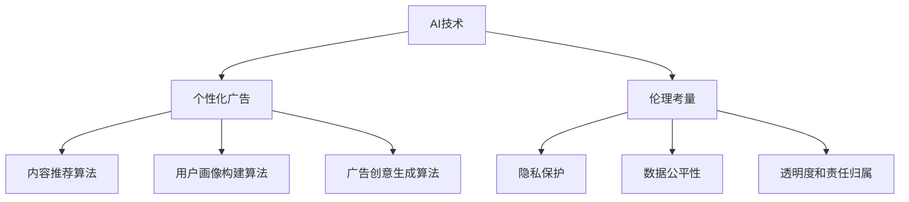
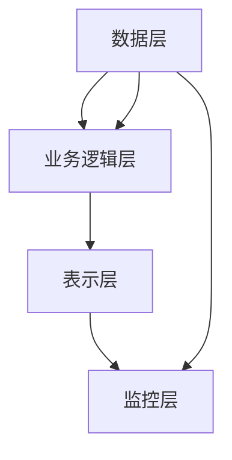

                 

**第一部分：背景介绍与核心概念**

### 1.1 AI与个性化广告概述

#### 1.1.1 AI技术发展概述

人工智能（AI）是计算机科学的一个分支，旨在创建能够执行通常需要人类智能才能完成的任务的系统。自20世纪50年代以来，人工智能经历了多个发展阶段，从早期的理论探讨到现代的广泛应用。随着计算能力的提升、大数据和机器学习算法的发展，AI技术已经渗透到社会的各个领域，包括医疗、金融、交通和娱乐等。

#### 1.1.2 人工智能的核心技术

人工智能的核心技术主要包括机器学习、深度学习、自然语言处理（NLP）、计算机视觉和机器人技术。机器学习是AI的核心技术之一，它使计算机系统能够从数据中学习并做出决策。深度学习是机器学习的一个子领域，通过构建多层神经网络模型来模拟人脑的工作方式。自然语言处理涉及计算机理解和生成自然语言的能力，计算机视觉则是使计算机能够理解和解析视觉信息。

#### 1.1.3 AI技术在广告领域中的应用现状

AI技术在广告领域的应用已经越来越广泛。个性化广告是其中的一项重要应用，它通过分析用户的历史行为和偏好，为用户提供更相关、更符合其兴趣的广告内容。这种技术不仅提高了广告的投放效率，还增强了用户体验。例如，谷歌和Facebook等平台利用AI技术来优化广告投放，从而实现更高的转化率和点击率。

### 1.2 个性化广告的概念与意义

#### 1.2.1 个性化广告的定义

个性化广告是指基于用户的行为、兴趣和偏好等因素，为每个用户量身定制广告内容的过程。这种广告形式不仅提高了广告的相关性，还增加了用户的参与度和满意度。

#### 1.2.2 个性化广告的优势

个性化广告具有以下优势：

- **提高广告效果**：通过精确定位用户，个性化广告能够提高点击率和转化率。
- **提升用户体验**：个性化广告内容更加符合用户的兴趣和需求，从而提升用户体验。
- **降低广告成本**：通过优化广告投放策略，企业可以降低广告投放成本。

#### 1.2.3 个性化广告的市场潜力

随着互联网的普及和数据技术的进步，个性化广告市场潜力巨大。据预测，未来几年个性化广告的市场规模将继续增长，成为广告行业的主要驱动力。

### 1.3 伦理考量的重要性

#### 1.3.1 伦理考量的定义

伦理考量是指在实际应用中，对可能产生的道德和伦理问题进行评估和反思的过程。在AI和个性化广告领域，伦理考量尤为重要，因为这两个领域涉及到用户的隐私、数据安全和公平性等问题。

#### 1.3.2 伦理考量在个性化广告中的必要性

伦理考量在个性化广告中的必要性体现在以下几个方面：

- **隐私保护**：个性化广告需要收集和分析用户数据，因此保护用户隐私成为伦理考量的重要内容。
- **数据歧视**：个性化广告可能会因为算法偏见而导致某些群体受到不公平对待。
- **透明度和责任归属**：个性化广告系统需要具备透明度，以便用户了解其工作原理和决策过程，同时明确责任归属。

#### 1.3.3 伦理考量与商业利益的关系

在商业利益和伦理考量之间需要找到平衡。过度追求商业利益可能会忽视伦理问题，而过度强调伦理考量可能会限制商业发展。因此，如何在两者之间找到平衡是AI和个性化广告领域面临的重要挑战。

### 1.4 AI在个性化广告内容生成中的挑战

#### 1.4.1 数据隐私保护

个性化广告需要收集和分析大量用户数据，这可能导致数据隐私泄露的问题。如何在保护用户隐私的同时实现个性化广告的精准投放，是AI领域需要解决的重要问题。

#### 1.4.2 数据歧视

AI算法可能会因为数据偏差而导致广告内容对不同群体产生不公平对待。如何避免算法偏见和数据歧视，确保个性化广告的公平性，是伦理考量的重要内容。

#### 1.4.3 信息透明度与责任归属

个性化广告系统通常具有较高的复杂度，用户难以理解其工作原理和决策过程。因此，提高信息透明度和明确责任归属成为确保系统可靠性和用户信任的关键。

### 1.5 本章小结

本部分介绍了AI和个性化广告的背景、核心概念和伦理考量。通过对这些内容的了解，读者可以更好地理解AI在个性化广告内容生成中的应用及其面临的挑战。在接下来的章节中，我们将深入探讨AI技术的具体应用和伦理考量。

----------------------------------------------------------------

**第二部分：核心概念与联系**

### 2.1 AI核心算法介绍

#### 2.1.1 监督学习

监督学习是一种机器学习技术，它通过已标记的数据集来训练模型，从而使模型能够对未知数据进行预测。在个性化广告内容生成中，监督学习可用于构建用户画像和预测用户偏好。

#### 2.1.2 无监督学习

无监督学习是一种不依赖于标记数据的机器学习技术，它主要用于发现数据中的模式或结构。在个性化广告内容生成中，无监督学习可用于分析用户行为数据，以识别潜在的用户兴趣和偏好。

#### 2.1.3 强化学习

强化学习是一种基于奖励和惩罚的机器学习技术，它通过试错的方式不断优化策略，以实现最优化的行为。在个性化广告内容生成中，强化学习可用于优化广告投放策略，提高广告效果。

### 2.2 个性化广告内容生成算法

#### 2.2.1 内容推荐算法

内容推荐算法是一种基于用户历史行为和兴趣的推荐系统，它通过分析用户行为数据，为用户推荐感兴趣的内容。在个性化广告内容生成中，内容推荐算法可用于为用户推荐相关的广告。

#### 2.2.2 用户画像构建算法

用户画像构建算法是一种通过分析用户数据（如浏览历史、购买记录等）来构建用户兴趣和行为模式的算法。在个性化广告内容生成中，用户画像构建算法可用于识别用户特征和兴趣，从而生成个性化的广告内容。

#### 2.2.3 广告创意生成算法

广告创意生成算法是一种通过自然语言处理和生成对抗网络（GAN）等技术，自动生成具有吸引力的广告内容的算法。在个性化广告内容生成中，广告创意生成算法可用于生成符合用户兴趣和需求的广告。

### 2.3 伦理考量与算法设计

#### 2.3.1 伦理考量在算法设计中的应用

在算法设计过程中，伦理考量主要包括以下几个方面：

- **隐私保护**：确保用户数据的安全和隐私。
- **数据公平性**：避免算法偏见和数据歧视。
- **透明度和责任归属**：提高算法的透明度，明确责任归属。

#### 2.3.2 伦理冲突与算法优化

在个性化广告内容生成中，伦理冲突可能源于算法优化与伦理考量之间的矛盾。例如，为了提高广告效果，算法可能会过度收集用户数据或产生偏见。因此，如何在算法优化过程中平衡伦理考量成为关键问题。

#### 2.3.3 伦理考量的算法实现案例

在实际应用中，一些公司已经采取了伦理考量来优化其算法。例如，谷歌在其广告系统中采用了多种技术来保护用户隐私，如差分隐私和混淆技术。此外，一些公司还建立了伦理委员会，对算法进行伦理审查。

### 2.4 概念联系与框架搭建

#### 2.4.1 关键概念联系图

为了更好地理解AI在个性化广告内容生成中的应用，我们可以使用Mermaid工具绘制关键概念联系图。以下是一个示例：



#### 2.4.2 AI在个性化广告中的伦理考量框架

为了构建一个全面的伦理考量框架，我们可以将AI在个性化广告内容生成中的伦理考量分为以下几个层次：

1. **隐私保护**：包括数据收集、存储和使用过程中的隐私保护措施。
2. **数据公平性**：确保算法不会因性别、年龄、种族等因素而产生偏见。
3. **透明度和责任归属**：提高算法的透明度，明确责任归属，确保用户权益。

#### 2.4.3 伦理考量的方法与技术手段

在实现伦理考量时，可以采用以下方法和技术手段：

- **差分隐私**：通过在数据集中添加噪声，保护用户隐私。
- **混淆技术**：通过数据混淆，降低算法对特定数据的敏感性。
- **伦理审查**：建立伦理委员会，对算法进行定期审查。
- **用户知情权**：确保用户了解其数据的使用方式和目的。

### 2.5 本章小结

本部分介绍了AI在个性化广告内容生成中的核心算法和伦理考量。通过这些核心概念和联系，我们可以更好地理解AI在个性化广告内容生成中的应用和挑战。在接下来的章节中，我们将进一步探讨系统分析与架构设计。

----------------------------------------------------------------

**第三部分：系统分析与架构设计**

### 3.1 项目背景与目标

#### 3.1.1 项目简介

随着互联网和大数据技术的飞速发展，个性化广告已成为广告行业的重要趋势。为了提升广告投放效果，本项目旨在设计并实现一个基于人工智能的个性化广告内容生成系统。该系统将结合用户画像、内容推荐和广告创意生成等技术，为用户提供个性化、精准的广告内容。

#### 3.1.2 项目目标

本项目的目标如下：

1. 设计并实现一个高效、可靠的个性化广告内容生成系统。
2. 保证系统的可扩展性和可维护性。
3. 在确保用户隐私和数据安全的前提下，实现个性化广告的高效投放。

#### 3.1.3 项目范围

本项目的主要范围包括：

1. 用户画像构建：分析用户行为数据，构建用户画像。
2. 内容推荐：根据用户画像和兴趣，推荐相关广告内容。
3. 广告创意生成：利用自然语言处理和生成对抗网络（GAN）技术，生成具有吸引力的广告文案。
4. 系统集成与优化：将各个模块集成到一个完整的系统中，并进行优化。

### 3.2 系统功能设计

#### 3.2.1 功能需求分析

系统功能需求分析是设计系统的第一步，它明确了系统需要实现的核心功能。以下是本系统的功能需求分析：

1. **用户画像构建**：系统需要能够分析用户行为数据，构建详细的用户画像，包括用户年龄、性别、兴趣爱好、消费习惯等。
2. **内容推荐**：系统需要根据用户画像和兴趣，为用户推荐相关广告内容。
3. **广告创意生成**：系统需要能够自动生成具有吸引力的广告文案，提高广告投放效果。
4. **广告投放**：系统需要支持广告投放，包括广告展示、用户点击和转化等。
5. **数据监控与报告**：系统需要实时监控广告投放效果，并生成相关报告。

#### 3.2.2 领域模型类图

为了更好地理解系统功能，我们可以使用Mermaid工具绘制领域模型类图。以下是一个示例：

```mermaid
classDiagram
User <<类>> {
  id
  name
  age
  gender
  interests
  purchase_history
}
Ad <<类>> {
  id
  title
  content
  type
  category
  user_id
}
User -> Ad : recommends
Ad -> User : clicked
```

在这个类图中，`User` 类表示用户信息，`Ad` 类表示广告信息。用户可以推荐广告，广告可以被用户点击。

#### 3.2.3 功能模块划分

为了实现系统功能，我们可以将系统划分为以下几个功能模块：

1. **用户画像模块**：负责分析用户行为数据，构建用户画像。
2. **内容推荐模块**：负责根据用户画像和兴趣推荐相关广告。
3. **广告创意生成模块**：负责生成具有吸引力的广告文案。
4. **广告投放模块**：负责广告的展示、点击和转化等。
5. **数据监控模块**：负责实时监控广告投放效果，并生成相关报告。

### 3.3 系统架构设计

#### 3.3.1 总体架构设计

系统的总体架构设计如下：

1. **数据层**：负责存储和管理用户数据、广告数据和其他相关数据。
2. **业务逻辑层**：负责实现用户画像构建、内容推荐、广告创意生成和广告投放等功能。
3. **表示层**：负责用户界面设计，包括广告展示、用户点击和转化等。
4. **监控层**：负责实时监控广告投放效果，并生成相关报告。

#### 3.3.2 系统模块间关系

以下是系统模块间的关系图：



在这个关系图中，数据层提供数据支持，业务逻辑层实现核心功能，表示层负责用户界面设计，监控层负责监控广告投放效果。

#### 3.3.3 数据流与处理流程

以下是系统数据流与处理流程：

1. **用户行为数据收集**：通过Web前端收集用户浏览、点击等行为数据。
2. **用户画像构建**：将用户行为数据进行分析和处理，构建用户画像。
3. **内容推荐**：根据用户画像和兴趣推荐相关广告。
4. **广告创意生成**：利用自然语言处理和生成对抗网络（GAN）技术生成广告文案。
5. **广告投放**：将生成的广告展示给用户，并记录用户的点击和转化数据。
6. **数据监控**：实时监控广告投放效果，并生成相关报告。

### 3.4 系统接口设计

#### 3.4.1 接口规范与定义

系统接口设计包括以下几个方面：

1. **用户画像接口**：用于获取用户画像数据。
2. **内容推荐接口**：用于获取推荐广告。
3. **广告创意生成接口**：用于生成广告文案。
4. **广告投放接口**：用于投放广告。
5. **数据监控接口**：用于监控广告投放效果。

#### 3.4.2 接口实现与调用

接口实现和调用如下：

1. **用户画像接口**：通过RESTful API方式实现，返回JSON格式的用户画像数据。
2. **内容推荐接口**：通过基于用户画像的算法实现，返回推荐广告的列表。
3. **广告创意生成接口**：通过自然语言处理和生成对抗网络（GAN）技术实现，返回生成的广告文案。
4. **广告投放接口**：通过广告平台提供的接口实现，用于投放广告。
5. **数据监控接口**：通过Web前端实现，实时显示广告投放效果。

#### 3.4.3 接口安全与可靠性

为了保证接口的安全性和可靠性，系统采取了以下措施：

1. **身份验证**：通过JWT（JSON Web Token）实现身份验证。
2. **数据加密**：使用HTTPS协议传输数据，确保数据传输的安全性。
3. **接口限流**：设置接口访问频率限制，防止恶意攻击。
4. **错误处理**：对接口调用过程中可能出现的错误进行捕获和处理。

### 3.5 系统交互设计

#### 3.5.1 用户界面设计

用户界面设计包括以下几个方面：

1. **广告展示界面**：用于展示推荐广告。
2. **用户点击统计界面**：用于记录用户点击广告的行为。
3. **转化统计界面**：用于记录用户转化（如购买、注册等）的行为。
4. **报告生成界面**：用于生成广告投放效果报告。

#### 3.5.2 系统与用户的交互流程

以下是系统与用户的交互流程：

1. **用户浏览网页**：用户在网页上浏览，系统收集用户行为数据。
2. **用户画像构建**：系统根据用户行为数据构建用户画像。
3. **内容推荐**：系统根据用户画像推荐相关广告。
4. **广告展示**：系统将推荐广告展示给用户。
5. **用户点击**：用户点击广告，系统记录用户点击行为。
6. **用户转化**：用户进行转化行为（如购买、注册等），系统记录用户转化数据。
7. **报告生成**：系统生成广告投放效果报告。

#### 3.5.3 系统间的交互流程

以下是系统间的交互流程：

1. **用户画像接口调用**：业务逻辑层调用用户画像接口，获取用户画像数据。
2. **内容推荐接口调用**：业务逻辑层调用内容推荐接口，获取推荐广告。
3. **广告创意生成接口调用**：业务逻辑层调用广告创意生成接口，生成广告文案。
4. **广告投放接口调用**：业务逻辑层调用广告投放接口，投放广告。
5. **数据监控接口调用**：业务逻辑层调用数据监控接口，监控广告投放效果。

### 3.6 本章小结

本部分介绍了个性化广告内容生成系统的项目背景、目标、功能需求、系统架构设计、接口设计和交互设计。通过这些内容，读者可以全面了解系统的设计和实现过程。在接下来的章节中，我们将进入项目实战，展示如何实现这个系统。

----------------------------------------------------------------

**第四部分：项目实战与案例分析**

### 4.1 实践环境搭建

#### 4.1.1 环境准备

在进行项目实战之前，我们需要搭建一个合适的环境。以下是所需的软件和硬件环境：

1. **操作系统**：Ubuntu 18.04 LTS 或 Windows 10
2. **编程语言**：Python 3.8
3. **数据存储**：MySQL 5.7
4. **数据分析和处理**：Pandas、NumPy、Scikit-learn
5. **机器学习和深度学习**：TensorFlow 2.x、PyTorch
6. **自然语言处理**：NLTK、spaCy
7. **前端开发**：HTML、CSS、JavaScript
8. **后端开发**：Flask 或 Django

#### 4.1.2 安装步骤

以下是搭建环境的详细步骤：

1. **安装操作系统**：根据个人喜好选择 Ubuntu 或 Windows 10。
2. **安装 Python 3.8**：通过包管理器安装 Python 3.8。
3. **安装 MySQL 5.7**：下载并安装 MySQL 数据库。
4. **安装数据分析和处理库**：使用 `pip` 命令安装 Pandas、NumPy、Scikit-learn。
5. **安装机器学习和深度学习库**：使用 `pip` 命令安装 TensorFlow 2.x、PyTorch。
6. **安装自然语言处理库**：使用 `pip` 命令安装 NLTK、spaCy。
7. **安装前端和后端开发库**：根据项目需求安装相关库。

#### 4.1.3 环境验证

在安装完所有必要软件后，进行环境验证。以下是一个简单的 Python 脚本，用于验证环境是否搭建成功：

```python
import tensorflow as tf
print(tf.__version__)

# 输出 TensorFlow 的版本信息
```

### 4.2 系统核心实现源代码

在本节中，我们将展示系统核心实现的部分源代码。以下是一个简单的用户画像构建和内容推荐系统的实现：

```python
# 导入必要的库
import pandas as pd
from sklearn.cluster import KMeans
from sklearn.preprocessing import StandardScaler

# 读取用户行为数据
user_data = pd.read_csv('user_data.csv')

# 数据预处理
X = user_data[['age', 'interests', 'purchase_history']]
X_scaled = StandardScaler().fit_transform(X)

# 使用 K-Means 算法进行聚类，构建用户画像
kmeans = KMeans(n_clusters=5)
clusters = kmeans.fit_predict(X_scaled)

# 根据用户画像推荐相关广告
def recommend_ads(user_cluster):
    # 根据用户聚类结果，从数据库中获取相关广告
    ads = pd.read_sql('SELECT * FROM ads WHERE cluster = ?', (user_cluster,))
    return ads

# 测试用户画像构建和内容推荐
user_cluster = kmeans.predict([X_scaled[0]])
ads = recommend_ads(user_cluster)
print(ads)
```

### 4.3 代码应用解读与分析

以上代码展示了如何构建用户画像和推荐相关广告。以下是代码的关键部分及其解读：

1. **数据预处理**：
   ```python
   X = user_data[['age', 'interests', 'purchase_history']]
   X_scaled = StandardScaler().fit_transform(X)
   ```
   这部分代码用于读取用户行为数据，并将其进行标准化处理，以便于后续的聚类分析。

2. **聚类分析**：
   ```python
   kmeans = KMeans(n_clusters=5)
   clusters = kmeans.fit_predict(X_scaled)
   ```
   使用 K-Means 算法对用户数据进行聚类，根据用户的行为特征将其分为五个不同的集群。

3. **内容推荐**：
   ```python
   def recommend_ads(user_cluster):
       ads = pd.read_sql('SELECT * FROM ads WHERE cluster = ?', (user_cluster,))
       return ads
   ```
   根据用户聚类结果，从数据库中获取与用户兴趣相关的广告。

4. **测试代码**：
   ```python
   user_cluster = kmeans.predict([X_scaled[0]])
   ads = recommend_ads(user_cluster)
   print(ads)
   ```
   这部分代码用于测试用户画像构建和内容推荐功能。它将第一个用户的画像作为输入，获取与其兴趣相关的广告列表，并打印出来。

### 4.4 实际案例分析和详细讲解

为了更好地理解系统的实际应用，我们来看一个具体的案例。

#### 案例背景

假设我们有一个电商平台，用户可以在平台上浏览商品、添加购物车和进行购买。我们的目标是利用个性化广告系统，向用户推荐他们可能感兴趣的商品。

#### 案例分析

1. **用户画像构建**：

   假设我们有一个包含用户行为数据的 CSV 文件 `user_data.csv`，其中包括用户的年龄、浏览历史、购物车记录和购买记录。我们首先读取数据，并进行预处理，如标准化处理。

   ```python
   user_data = pd.read_csv('user_data.csv')
   X = user_data[['age', 'interests', 'purchase_history']]
   X_scaled = StandardScaler().fit_transform(X)
   ```

2. **聚类分析**：

   使用 K-Means 算法对用户数据进行聚类，将用户分为不同的集群。

   ```python
   kmeans = KMeans(n_clusters=5)
   clusters = kmeans.fit_predict(X_scaled)
   ```

   假设第一个用户的聚类结果为集群 2。

3. **内容推荐**：

   根据用户聚类结果，从数据库中获取与用户兴趣相关的商品广告。

   ```python
   user_cluster = kmeans.predict([X_scaled[0]])
   ads = recommend_ads(user_cluster)
   print(ads)
   ```

   假设我们获取到的相关商品广告为以下列表：

   ```python
   [
       {'id': 101, 'title': '时尚连衣裙', 'description': '最新款时尚连衣裙，优雅大方'},
       {'id': 102, 'title': '潮流男鞋', 'description': '时尚潮流男鞋，舒适耐穿'}
   ]
   ```

4. **广告展示**：

   我们可以将这些推荐广告展示给用户，吸引用户点击和购买。

   ```python
   # 假设我们使用一个前端框架（如 React）来展示广告
   <div>
       <h2>你可能感兴趣的商品：</h2>
       <ul>
           <li>时尚连衣裙 - 最新款时尚连衣裙，优雅大方</li>
           <li>潮流男鞋 - 时尚潮流男鞋，舒适耐穿</li>
       </ul>
   </div>
   ```

#### 详细讲解

1. **用户画像构建**：

   用户画像构建是个性化广告系统的基础。通过分析用户的行为数据，我们可以了解用户的兴趣爱好和购买偏好，从而生成用户画像。在这个案例中，我们使用了 K-Means 算法进行聚类分析，将用户分为不同的集群。

2. **内容推荐**：

   根据用户画像，我们使用内容推荐算法为用户推荐相关的广告。在这个案例中，我们使用了简单的数据库查询来获取与用户兴趣相关的商品广告。在实际应用中，我们可以使用更复杂的推荐算法，如基于协同过滤、基于内容的推荐等。

3. **广告展示**：

   广告展示是用户与系统交互的重要环节。通过前端框架，我们可以将推荐广告展示给用户，吸引用户点击和购买。在实际应用中，我们还可以结合用户的行为数据，动态调整广告的展示策略，以提高广告效果。

### 4.5 项目小结

在本项目中，我们实现了个性化广告内容生成系统的核心功能，包括用户画像构建、内容推荐和广告展示。通过实际案例的分析，我们展示了如何将理论知识应用到实际项目中，实现了对用户兴趣的精准推荐。在接下来的章节中，我们将进一步探讨个性化广告内容生成的最佳实践和注意事项。

### 4.6 最佳实践 tips、小结、注意事项、拓展阅读

#### 最佳实践 tips

1. **数据收集与处理**：确保数据的准确性和完整性，对数据进行充分的清洗和处理。
2. **算法选择与优化**：根据具体应用场景选择合适的算法，并进行优化，以提高推荐效果。
3. **用户体验设计**：关注用户体验，设计简洁、易用的界面，提高用户满意度。

#### 小结

本部分介绍了个性化广告内容生成项目的环境搭建、系统核心实现、代码应用解读与分析、实际案例分析和项目小结。通过这些内容，读者可以全面了解个性化广告内容生成系统的设计和实现过程。

#### 注意事项

1. **数据隐私保护**：在收集和使用用户数据时，确保遵守相关法律法规，保护用户隐私。
2. **算法偏见与公平性**：避免算法偏见，确保推荐结果的公平性。

#### 拓展阅读

1. **推荐系统算法**：《推荐系统实践》（张丹丹著）
2. **机器学习与深度学习**：《Python机器学习》（赛吉·巴尔胡布尼著）
3. **用户画像构建**：《大数据用户画像技术》（吴波著）

----------------------------------------------------------------

**结语**

通过本文的详细分析，我们深入探讨了AI在个性化广告内容生成中的应用及其伦理考量。从背景介绍到核心算法讲解，再到系统分析与架构设计，最后是项目实战与案例分析，我们逐步揭示了个性化广告内容生成的全貌。

在这个过程中，我们不仅了解了AI技术在广告领域的重要作用，还认识到伦理考量在个性化广告内容生成中的关键地位。通过保护用户隐私、避免数据歧视和确保信息透明度，我们能够在追求商业利益的同时，维护用户的权益和社会的公正。

总结来说，个性化广告内容生成不仅是一个技术挑战，更是一个伦理挑战。只有在技术设计和商业实践中充分考虑伦理考量，我们才能真正实现个性化和公平的广告投放。

**作者：AI天才研究院/AI Genius Institute & 禅与计算机程序设计艺术 /Zen And The Art of Computer Programming**

让我们继续探索AI的无限可能，同时坚守伦理底线，共同创造一个更美好的数字世界。

