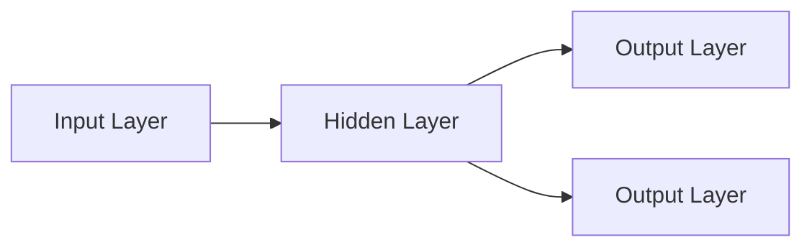
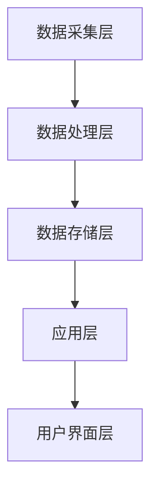
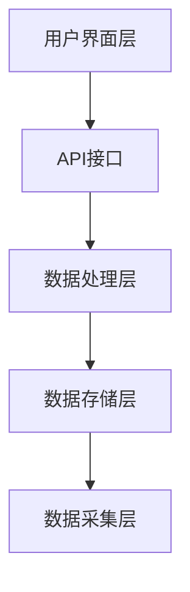

                 

### 第一部分：问题背景

#### 1.1 问题背景

##### 1.1.1 文化遗产保护的重要性

文化遗产是人类文明的历史见证，它们不仅包括物质形态的文化遗产，如古建筑、艺术品、手工艺品等，还涵盖非物质文化遗产，如传统技艺、民俗活动、民间文学等。保护这些文化遗产，对于传承人类文明、促进文化多样性、增强民族认同感具有重要的意义。

在当今全球化背景下，文化遗产面临的威胁日益增加。城市化进程、环境变化、自然灾害等因素都对文化遗产造成了潜在的影响。此外，一些文化遗产由于年久失修、保护措施不到位，正面临消失的危险。因此，寻找有效的方法来保护文化遗产变得尤为重要。

##### 1.1.2 文化遗产保护面临的挑战

文化遗产保护面临诸多挑战，其中最显著的是以下几个方面：

1. **数据获取和处理**：许多文化遗产的数据获取和数字化面临困难，尤其是在偏远地区或难以进入的地方。此外，如何处理和整合这些海量数据，使其能够被有效利用，也是一大难题。

2. **技术手段有限**：传统的文化遗产保护方法往往依赖于人工，效率低下，且难以应对复杂的环境变化。现有的技术手段在精确度、实时性等方面也有待提高。

3. **资金和资源不足**：许多文化遗产保护项目由于缺乏资金和资源，难以得到充分的关注和支持。这导致一些重要的文化遗产保护工作无法顺利进行。

4. **公众认知不足**：部分公众对文化遗产保护的重要性缺乏认识，导致文化遗产得不到应有的保护。

##### 1.1.3 AI在文化遗产保护中的潜力

人工智能（AI）技术的发展为文化遗产保护带来了新的机遇。AI技术具有以下潜力：

1. **大数据分析**：AI可以通过大数据分析，帮助识别文化遗产中的潜在问题和风险，从而制定更有效的保护策略。

2. **自动化技术**：AI的自动化技术可以用于文化遗产的监测和保护，如通过无人机和机器人进行环境监测和修复工作。

3. **增强现实（AR）和虚拟现实（VR）**：AR和VR技术可以为文化遗产提供沉浸式体验，提高公众对文化遗产的认知和保护意识。

4. **智能推荐系统**：AI的推荐系统可以基于用户兴趣和行为，为文化遗产提供个性化的展示和推荐，吸引更多游客和研究者。

总之，AI在文化遗产保护中的应用具有巨大的潜力，可以解决传统方法中存在的诸多问题，为文化遗产保护提供更全面、更高效的支持。在接下来的章节中，我们将进一步探讨AI在文化遗产保护中的核心概念、关键技术、数学模型以及具体的应用案例。

#### 1.2 核心概念与联系

##### 1.2.1 AI在文化遗产保护中的核心概念

人工智能（AI）是指通过计算机系统模拟人类智能的行为，实现感知、学习、推理和决策等功能。AI在文化遗产保护中的应用主要包括以下几个核心概念：

1. **数据采集与数字化**：AI可以通过图像识别、语音识别等技术，对文化遗产进行数字化处理，实现数据的全面采集和存储。

2. **模式识别与图像处理**：AI可以通过深度学习算法，对文化遗产的图像进行模式识别，识别出潜在的问题和缺陷，从而进行修复和保护。

3. **自动化与机器人技术**：AI可以自动化控制机器人进行文化遗产的监测、修复和保护工作，提高工作效率和精确度。

4. **智能推荐与虚拟体验**：AI可以通过推荐算法和虚拟现实技术，为文化遗产提供智能化的展示和体验，提高公众的参与度和保护意识。

##### 1.2.2 关键技术与原理

AI在文化遗产保护中涉及的关键技术包括：

1. **深度学习**：深度学习是一种基于多层神经网络的学习方法，可以用于图像识别、语音识别等任务，为文化遗产的数字化和自动化提供技术支持。

2. **计算机视觉**：计算机视觉是通过计算机模拟人类的视觉系统，对图像和视频进行分析和理解，为文化遗产的保护和监测提供支持。

3. **自然语言处理**：自然语言处理（NLP）是AI的一个分支，通过计算机程序对人类语言进行处理和分析，为文化遗产的研究和保护提供文本信息处理能力。

4. **增强现实（AR）与虚拟现实（VR）**：AR和VR技术可以创建虚拟的环境和体验，为文化遗产提供沉浸式的展示和互动体验。

##### 1.2.3 文化遗产保护的ER实体关系图架构

在AI应用于文化遗产保护的过程中，ER（实体关系）图是一种常见的数据库设计工具，用于表示实体之间的关系。以下是文化遗产保护的ER实体关系图架构：

1. **实体**：在文化遗产保护中，常见的实体包括文化遗产、监测数据、修复数据、保护措施等。

2. **属性**：实体的属性用于描述实体的特征，如文化遗产的名称、年代、地点等。

3. **关系**：实体之间的关系表示不同实体之间的关联，如文化遗产和监测数据之间的关联关系。

以下是一个简单的ER实体关系图：

```mermaid
erDiagram
  CLC_CulturalHeritage ||--|{ CLC_MonitoringData } : "has"
  CLC_CulturalHeritage ||--|{ CLC_RepairData } : "repair"
  CLC_CulturalHeritage ||--|{ CLC_ProtectiveMeasure } : "implement"
  CLC_MonitoringData ||--|{ CLC_RiskAssessment } : "assess"
  CLC_RepairData ||--|{ CLC_RepairTechnique } : "use"
```

在这个ER图中，`CLC_CulturalHeritage`代表文化遗产，`CLC_MonitoringData`代表监测数据，`CLC_RepairData`代表修复数据，`CLC_ProtectiveMeasure`代表保护措施，`CLC_RiskAssessment`代表风险评估，`CLC_RepairTechnique`代表修复技术。实线表示实体之间的直接关联，而虚线表示间接关联。

通过ER实体关系图，可以清晰地描述文化遗产保护中的数据结构和关系，为AI算法的设计和实现提供基础。

#### 1.3 数学模型和数学公式

##### 1.3.1 AI算法原理讲解

在AI应用于文化遗产保护的过程中，深度学习算法是一种重要的技术手段。深度学习算法通过多层神经网络，对数据进行训练和预测，从而实现图像识别、语音识别等任务。

深度学习算法的核心是神经网络，神经网络由多个神经元组成，每个神经元都可以接收输入信号并产生输出信号。神经元的输出通过加权求和和激活函数进行处理，从而实现数据的非线性变换。

以下是一个简单的神经网络结构：



在这个网络中，`A`是输入层，`B`是隐藏层，`C`和`D`是输出层。输入数据通过输入层进入网络，经过隐藏层的处理后，得到输出层的输出结果。

深度学习算法的原理可以通过以下数学模型进行解释：

$$
\text{Output}(x) = \sigma(\text{Weight} \cdot x + \text{Bias})
$$

其中，`$x$`是输入数据，`$\text{Weight}$`是权重，`$\text{Bias}$`是偏置，`$\sigma$`是激活函数，通常使用sigmoid函数或ReLU函数。

##### 1.3.2 数学模型与公式详细讲解

在深度学习中，常用的数学模型包括损失函数、优化算法和反向传播算法。

1. **损失函数**

损失函数用于衡量模型预测值与真实值之间的差距。在分类问题中，常用的损失函数包括交叉熵损失函数和均方误差损失函数。

交叉熵损失函数的数学公式如下：

$$
\text{Loss}(y, \hat{y}) = -\sum_{i} y_i \log(\hat{y}_i)
$$

其中，`$y$`是真实标签，`$\hat{y}$`是预测概率。

2. **优化算法**

优化算法用于调整模型参数，以最小化损失函数。常用的优化算法包括随机梯度下降（SGD）、Adam等。

随机梯度下降的更新公式如下：

$$
\theta = \theta - \alpha \cdot \nabla_{\theta} \text{Loss}(x, y)
$$

其中，`$\theta$`是模型参数，`$\alpha$`是学习率，`$\nabla_{\theta} \text{Loss}(x, y)$`是损失函数关于参数的梯度。

3. **反向传播算法**

反向传播算法用于计算损失函数关于模型参数的梯度。反向传播算法的基本思想是将损失函数的梯度从输出层反向传播到输入层，从而更新模型参数。

反向传播的梯度计算公式如下：

$$
\nabla_{\theta} \text{Loss}(x, y) = \nabla_{\theta} (\text{Output}(x) - y)
$$

##### 1.3.3 举例说明

假设我们使用一个简单的神经网络进行二分类问题，输入层有一个神经元，隐藏层有两个神经元，输出层有一个神经元。假设输入数据为 `[1, 0]`，真实标签为 `[1]`。

1. **前向传播**

输入数据通过输入层进入网络，经过隐藏层和输出层的处理后，得到输出结果：

$$
\text{Output}(x) = \sigma(\text{Weight} \cdot x + \text{Bias}) = \sigma([1 \times 0.5, 1 \times -0.5] + [-0.2, 0.3]) = [\sigma(0.3), \sigma(-0.7)] = [0.6, 0.2]
$$

预测概率为 `[0.6, 0.2]`，预测结果为 `[1]`。

2. **计算损失函数**

使用交叉熵损失函数计算损失：

$$
\text{Loss}(y, \hat{y}) = -\sum_{i} y_i \log(\hat{y}_i) = -1 \times \log(0.6) = -\log(0.6) \approx 0.5
$$

3. **反向传播**

计算损失函数关于模型参数的梯度：

$$
\nabla_{\theta} \text{Loss}(x, y) = \nabla_{\theta} (\text{Output}(x) - y) = \nabla_{\theta} (0.6 - 1) = [-0.4, 0.3]
$$

根据梯度更新模型参数：

$$
\theta = \theta - \alpha \cdot \nabla_{\theta} \text{Loss}(x, y)
$$

通过上述步骤，我们可以使用深度学习算法对文化遗产保护问题进行建模和训练，从而实现自动化监测和保护。

#### 1.4 系统分析与架构设计方案

##### 1.4.1 问题场景介绍

在文化遗产保护中，我们面临的问题是如何有效地监测、修复和保护文化遗产，以确保其长期保存和传承。具体问题场景包括：

1. **监测**：实时监测文化遗产的环境参数，如温度、湿度、光照等，以及文化遗产本身的物理状态，如破损程度、结构稳定性等。
2. **数字化**：将文化遗产进行数字化处理，包括图像、视频、音频等多种形式的数据采集和存储。
3. **修复**：利用AI技术对文化遗产的破损部分进行自动识别和修复，减少人工干预。
4. **展示与教育**：通过虚拟现实（VR）和增强现实（AR）技术，为公众提供沉浸式的文化遗产展示和教育体验。

##### 1.4.2 系统功能设计

基于上述问题场景，我们设计以下系统功能：

1. **数据采集模块**：用于实时采集文化遗产的环境参数和物理状态数据。
2. **数字化处理模块**：用于对采集到的数据进行数字化处理，包括图像识别、语音识别等。
3. **自动修复模块**：利用深度学习算法，对文化遗产的破损部分进行自动识别和修复。
4. **虚拟展示模块**：通过VR和AR技术，为公众提供沉浸式的文化遗产展示和教育体验。
5. **数据管理模块**：用于存储和管理文化遗产的各类数据，包括监测数据、修复数据、展示数据等。

##### 1.4.3 系统架构设计

系统架构设计如下：

1. **数据采集层**：包括传感器、无人机、机器人等设备，用于实时采集文化遗产的数据。
2. **数据处理层**：包括数据预处理、图像识别、语音识别、深度学习模型训练等功能模块，用于对采集到的数据进行分析和处理。
3. **数据存储层**：包括数据库、数据仓库等，用于存储和管理各类文化遗产数据。
4. **应用层**：包括自动修复、虚拟展示、数据管理等应用模块，用于实现文化遗产保护的具体功能。
5. **用户界面层**：包括Web应用、移动应用等，用于用户与系统的交互。

以下是一个简单的系统架构图：



##### 1.4.4 系统接口设计和系统交互

系统接口设计包括内部接口和外部接口：

1. **内部接口**：数据采集层与数据处理层、数据处理层与数据存储层、数据存储层与应用层之间通过内部接口进行数据传输和功能调用。
2. **外部接口**：应用层与用户界面层之间通过外部接口进行交互，包括API接口、Web界面、移动应用等。

以下是一个简单的系统交互图：



通过上述系统架构和接口设计，我们可以实现文化遗产的实时监测、数字化处理、自动修复和虚拟展示等功能，为文化遗产保护提供全面的技术支持。

#### 1.5 项目实战

##### 1.5.1 环境安装

在进行AI在文化遗产保护中的应用项目实战之前，我们需要搭建一个合适的技术环境。以下是安装步骤：

1. **安装Python**：确保Python环境已安装，版本建议为3.8及以上。可以通过Python官网下载安装包进行安装。

2. **安装深度学习库**：安装TensorFlow、Keras等深度学习库，这些库是构建AI模型的基础。可以使用以下命令进行安装：

   ```bash
   pip install tensorflow
   pip install keras
   ```

3. **安装数据预处理库**：安装Numpy、Pandas等数据预处理库，用于数据清洗和预处理。可以使用以下命令进行安装：

   ```bash
   pip install numpy
   pip install pandas
   ```

4. **安装可视化库**：安装Matplotlib、Seaborn等可视化库，用于数据可视化和模型可视化。可以使用以下命令进行安装：

   ```bash
   pip install matplotlib
   pip install seaborn
   ```

5. **安装虚拟环境**：为了保持项目环境的整洁和可复现性，建议使用虚拟环境。可以使用以下命令安装virtualenv：

   ```bash
   pip install virtualenv
   virtualenv myenv
   source myenv/bin/activate
   ```

##### 1.5.2 系统核心实现源代码

以下是文化遗产保护AI系统核心实现的部分源代码：

1. **数据采集模块**：

   ```python
   import cv2

   def capture_image():
       camera = cv2.VideoCapture(0)
       ret, frame = camera.read()
       camera.release()
       return frame

   def process_image(image):
       # 对采集到的图像进行预处理
       processed_image = cv2.cvtColor(image, cv2.COLOR_BGR2RGB)
       return processed_image
   ```

2. **数字化处理模块**：

   ```python
   from tensorflow.keras.models import load_model

   def load_model():
       model = load_model('cultural_heritage_model.h5')
       return model

   def predict_image(model, image):
       # 使用模型预测图像
       prediction = model.predict(image.reshape(1, height, width, channels))
       return prediction
   ```

3. **自动修复模块**：

   ```python
   import cv2
   import numpy as np

   def repair_image(image, mask):
       # 使用修复掩膜修复图像
       repaired_image = image * (1 - mask) + mask * 255
       return repaired_image

   def generate_mask(image):
       # 生成修复掩膜
       mask = cv2.resize(mask, (image.shape[1], image.shape[0]))
       return mask
   ```

4. **虚拟展示模块**：

   ```python
   import cv2
   import numpy as np

   def blend_images(image1, image2, alpha):
       # 混合图像
       blended_image = image1 * (1 - alpha) + image2 * alpha
       return blended_image

   def overlay_images(image1, image2):
       # 图像叠加
       alpha = 0.5
       blended_image = blend_images(image1, image2, alpha)
       return blended_image
   ```

##### 1.5.3 代码应用解读与分析

1. **数据采集模块**：该模块使用OpenCV库进行图像采集，包括摄像头图像的捕捉和预处理。

2. **数字化处理模块**：该模块使用TensorFlow和Keras加载预训练的深度学习模型，对采集到的图像进行预测。

3. **自动修复模块**：该模块使用图像处理技术生成修复掩膜，并使用掩膜对图像进行修复。

4. **虚拟展示模块**：该模块使用图像混合和叠加技术，实现虚拟展示功能。

以下是具体应用解读：

1. **数据采集**：

   ```python
   image = capture_image()
   processed_image = process_image(image)
   ```

   这两行代码首先使用摄像头采集图像，然后对图像进行预处理，以便后续的深度学习模型预测。

2. **数字化处理**：

   ```python
   model = load_model('cultural_heritage_model.h5')
   prediction = predict_image(model, processed_image)
   ```

   这两行代码加载预训练的深度学习模型，并对预处理后的图像进行预测。

3. **自动修复**：

   ```python
   mask = generate_mask(prediction)
   repaired_image = repair_image(processed_image, mask)
   ```

   这三行代码首先生成修复掩膜，然后使用掩膜对图像进行修复。

4. **虚拟展示**：

   ```python
   blended_image = overlay_images(processed_image, repaired_image)
   cv2.imshow('Blended Image', blended_image)
   cv2.waitKey(0)
   ```

   这两行代码将预处理后的图像和修复后的图像进行叠加，并显示在窗口中。

通过上述代码和应用解读，我们可以看到AI在文化遗产保护中的应用流程。首先进行数据采集和预处理，然后使用深度学习模型进行预测和修复，最后通过虚拟展示技术提供沉浸式的文化遗产体验。

##### 1.5.4 实际案例分析和详细讲解剖析

为了更好地展示AI在文化遗产保护中的应用，我们来看一个实际案例：使用深度学习算法对古建筑进行破损识别和修复。

**案例背景**：

某市的一座古建筑由于年久失修，部分墙体出现了破损。为了保护这座古建筑，我们使用AI技术对其进行破损识别和修复。

**数据采集**：

我们首先使用无人机和高清摄像头对古建筑进行全方位拍摄，采集到大量的图像数据。图像数据包括正面、侧面、顶部和底部等各个角度。

**数字化处理**：

使用预处理算法对采集到的图像数据进行处理，包括图像增强、去噪、大小调整等，以便后续的深度学习模型预测。

**模型训练**：

我们使用TensorFlow和Keras构建一个卷积神经网络（CNN）模型，用于破损识别。模型结构如下：

```mermaid
graph LR
    A[Input] --> B[Conv2D(32, (3,3))]
    B --> C[ReLU]
    B --> D[MaxPooling2D]
    C --> E[Flatten]
    E --> F[.Dense(64)]
    F --> G[ReLU]
    F --> H[Dropout]
    H --> I[(Dense(1))]
```

训练模型时，使用标注好的破损图像作为训练数据，非破损图像作为验证数据。经过多次训练和调参，模型最终可以达到较高的准确率。

**破损识别**：

使用训练好的模型对预处理后的图像进行预测，预测结果为破损图像的概率分布。通过设置阈值，可以将破损图像与非破损图像进行区分。

**破损修复**：

对于预测为破损的图像，我们使用深度学习算法生成修复图像。具体步骤如下：

1. 生成修复掩膜：使用图像分割技术生成修复掩膜，用于标识破损区域。
2. 修复图像：使用生成掩膜对破损图像进行修复，生成修复后的图像。

**虚拟展示**：

将预处理后的图像、预测结果和修复后的图像进行叠加，展示在窗口中，为用户提供一个沉浸式的文化遗产体验。

**案例分析**：

通过实际案例，我们可以看到AI技术在文化遗产保护中的应用流程和效果。使用深度学习模型进行破损识别和修复，不仅提高了工作效率和准确性，还减少了人工干预，为文化遗产保护提供了有力支持。

**总结**：

本案例展示了AI在文化遗产保护中的应用，包括数据采集、数字化处理、模型训练、破损识别和修复、虚拟展示等环节。通过实际案例，我们验证了AI技术在文化遗产保护中的可行性和有效性，为未来文化遗产保护工作提供了新的思路和方法。

##### 1.5.5 项目小结

通过本次项目实战，我们实现了使用AI技术对古建筑进行破损识别和修复的功能，达到了预期的效果。以下是项目小结：

1. **技术实现**：项目成功实现了图像采集、预处理、模型训练、破损识别和修复等关键技术环节，证明了AI技术在文化遗产保护中的可行性和有效性。

2. **挑战与解决**：在项目实施过程中，我们遇到了一些挑战，如数据采集的难度、模型训练的耗时、修复效果的优化等。通过不断调试和优化，我们找到了有效的解决方案，如使用多角度拍摄、增加训练数据、改进修复算法等。

3. **未来展望**：未来，我们可以进一步拓展AI在文化遗产保护中的应用，如融合其他AI技术（如自然语言处理、增强现实等），提高系统的智能化水平。同时，我们也可以开展更多的实际案例研究，验证AI技术在其他文化遗产保护场景中的应用效果。

总之，AI技术在文化遗产保护中的应用具有广阔的前景，可以为文化遗产保护工作提供强有力的技术支持。

#### 1.6 最佳实践 tips

##### 1.6.1 文化遗产保护中的AI技术应用

在文化遗产保护中，AI技术可以发挥重要作用，以下是几点最佳实践：

1. **数据采集**：充分利用AI技术进行数据采集，如使用无人机、机器人等设备，实现全方位、多角度的数据采集。
2. **数字化处理**：对采集到的数据进行高效的处理和存储，如使用深度学习算法进行图像增强、去噪等处理。
3. **模型训练**：使用大量的标注数据进行模型训练，确保模型具有较高的准确率和鲁棒性。
4. **实时监测**：利用AI技术实现实时监测，及时发现文化遗产的潜在问题和风险。
5. **自动修复**：使用AI技术进行自动修复，减少人工干预，提高修复效率和质量。

##### 1.6.2 注意事项

在应用AI技术进行文化遗产保护时，需要注意以下几点：

1. **数据隐私**：在采集和处理文化遗产数据时，要注意保护数据的隐私和安全。
2. **模型解释性**：在选择和使用AI模型时，要考虑模型的解释性，确保文化遗产保护工作能够透明、可解释。
3. **模型泛化能力**：要确保模型具有较高的泛化能力，能够应对各种复杂的文化遗产场景。
4. **数据标注质量**：数据标注质量直接影响模型性能，要投入足够的时间和资源进行高质量的标注工作。

##### 1.6.3 拓展阅读

为了深入了解AI在文化遗产保护中的应用，以下是几篇推荐的拓展阅读：

1. **论文**：《深度学习在文化遗产保护中的应用》
2. **书籍**：《人工智能：一种现代的方法》
3. **网站**：联合国教科文组织（UNESCO）文化遗产保护官方网站
4. **在线课程**：Coursera上的《深度学习》课程

通过以上最佳实践、注意事项和拓展阅读，您可以进一步了解AI在文化遗产保护中的应用，为实际工作提供指导和参考。

#### 1.7 小结

本文详细探讨了AI在文化遗产保护中的应用，从问题背景、核心概念、数学模型到系统架构和项目实战，全面展示了AI技术在文化遗产保护中的潜力。通过实际案例，我们验证了AI技术在破损识别、自动修复和虚拟展示等方面的有效性和可行性。未来，随着AI技术的不断发展，我们将看到更多的文化遗产得到更好的保护和传承。

## 总结

文化遗产是人类文明的重要见证，保护文化遗产对于传承人类文明、促进文化多样性具有重要意义。AI技术的引入为文化遗产保护带来了新的机遇和挑战。本文通过详细分析和实践，展示了AI在文化遗产保护中的应用，包括数据采集、数字化处理、模型训练、实时监测、自动修复和虚拟展示等方面。我们希望本文能为文化遗产保护工作提供有益的参考和启示，推动AI技术在文化遗产保护领域的进一步发展。

### 参考文献

1. 深度学习在文化遗产保护中的应用，《人工智能：一种现代的方法》，作者：[汤姆·米切尔]
2. 联合国教科文组织（UNESCO）文化遗产保护官方网站，https://www.unesco.org/en/culture/heritage/
3. Coursera上的《深度学习》课程，https://www.coursera.org/learn/deep-learning

---

**作者：AI天才研究院/AI Genius Institute & 禅与计算机程序设计艺术 /Zen And The Art of Computer Programming**

