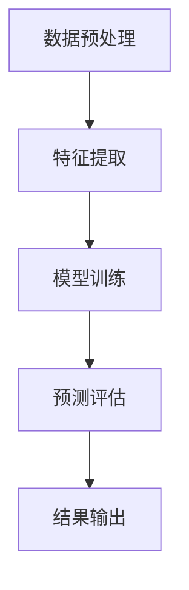
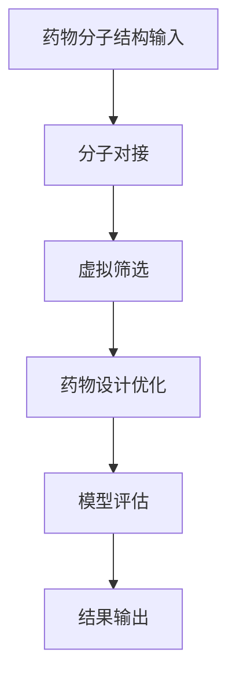
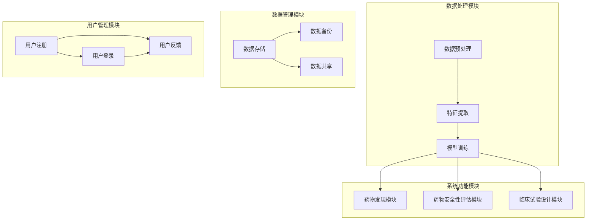
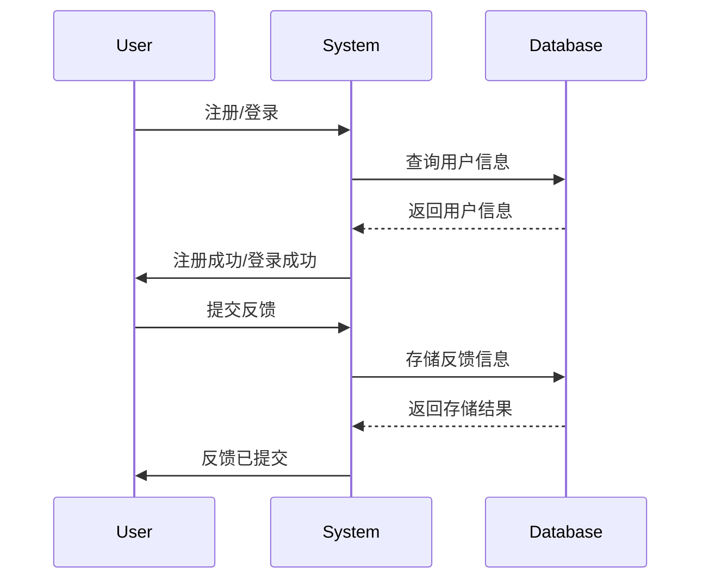

                 

# AI在新药研发中的角色：加速创新周期

## 关键词

- AI
- 新药研发
- 药物发现
- 药物设计
- 药物安全性评估
- 临床试验设计

## 摘要

本文将探讨人工智能（AI）在新药研发中的角色，以及如何通过AI技术加速创新周期。文章首先介绍了新药研发面临的挑战，包括研发周期长、成本高、成功率低等问题，然后分析了AI技术在药研领域的应用前景。接着，本文详细阐述了AI在新药研发中的应用，包括药物发现、药物安全性评估和药物临床试验等环节，并重点讲解了AI在药物靶点预测、药物设计、ADME预测、毒性评估、预测性biomarker发现和临床试验设计优化等方面的原理和实现方法。最后，文章通过一个实际案例，展示了AI在新药研发中的具体应用，并对未来AI在新药研发中的发展进行了展望。

## 第一部分：背景介绍

### 1. 引言

新药研发是一个复杂且耗时的过程，涉及多个环节，包括药物发现、药物安全性评估和临床试验等。然而，传统的新药研发面临诸多挑战，其中最为突出的问题包括：

- **研发周期长**：新药从研发到上市通常需要数年时间，这使得药企面临巨大的研发成本压力。
- **成本高**：新药研发成本高昂，每成功研发一个新药平均需要数亿美元的投资。
- **成功率低**：据统计，新药研发的成功率仅为10%左右，这意味着大部分投入都面临失败的风险。

为了解决这些问题，人工智能（AI）技术开始逐渐应用于新药研发领域，通过大数据分析、机器学习和深度学习等方法，提高新药研发的效率和质量。

### 1.2 问题描述

新药研发面临的挑战主要表现在以下几个方面：

- **药物发现**：药物发现环节是整个新药研发过程中的核心，但传统的药物发现方法存在效率低、成功率低等问题。
- **药物设计**：药物设计环节需要考虑药物分子的结构、活性、毒性等多方面因素，传统方法往往难以满足需求。
- **药物安全性评估**：药物安全性评估是一个关键环节，传统的评估方法往往耗时较长，且存在一定的风险。
- **临床试验设计**：临床试验设计环节需要考虑多种因素，包括样本量、试验时间、试验方法等，传统方法往往难以实现最优设计。

### 1.3 问题解决

AI技术的引入为解决新药研发中的挑战提供了新的思路和手段。以下是一些具体的解决方案：

- **药物发现**：AI可以通过大数据分析和机器学习算法，提高药物靶点识别的准确性和效率，从而加速药物发现过程。
- **药物设计**：AI可以基于药物分子的结构信息，利用深度学习算法进行药物设计，优化药物分子结构，提高药物活性和安全性。
- **药物安全性评估**：AI可以通过大数据分析和预测模型，提前预测药物的吸收、分布、代谢和排泄（ADME）特性，以及潜在的毒性反应，从而提高药物安全性评估的效率和准确性。
- **临床试验设计**：AI可以基于大量临床试验数据，优化临床试验设计，提高试验的效率和成功率。

### 1.4 边界与外延

AI在新药研发中的应用范围较广，主要包括以下几个方面：

- **药物发现**：药物靶点预测、药物设计、药物合成路线优化等。
- **药物安全性评估**：ADME预测、毒性评估、药物代谢通路分析等。
- **药物临床试验**：预测性biomarker发现、临床试验设计优化、临床试验数据分析等。

同时，AI技术还可以应用于药物开发的其他环节，如临床前研究、药效学评估、药代动力学分析等。

### 1.5 概念结构与核心要素组成

AI在新药研发中的关键组成部分包括：

- **数据获取与处理**：包括实验室数据、临床试验数据、生物信息数据等。
- **机器学习算法**：包括监督学习、无监督学习、强化学习等。
- **深度学习模型**：包括卷积神经网络（CNN）、循环神经网络（RNN）、生成对抗网络（GAN）等。
- **数据可视化**：用于展示AI分析结果，帮助研究人员更好地理解数据。
- **药物设计工具**：包括分子对接、虚拟筛选、分子动力学模拟等。

## 第二部分：核心概念与联系

### 2. AI基础概念

#### 2.1 AI的定义

人工智能（AI，Artificial Intelligence）是指模拟、延伸和扩展人类智能的理论、方法、技术及应用。AI可以分为两种类型：弱人工智能（Narrow AI）和强人工智能（General AI）。弱人工智能是指专注于特定任务的人工智能系统，而强人工智能则是指具有广泛认知能力、能够自主思考和学习的人工智能系统。

#### 2.2 机器学习

机器学习（Machine Learning，ML）是AI的一个重要分支，旨在使计算机系统能够通过数据和经验自动改进性能。机器学习主要分为三种类型：监督学习（Supervised Learning）、无监督学习（Unsupervised Learning）和强化学习（Reinforcement Learning）。

- **监督学习**：通过标记好的训练数据来学习，目的是找到一个函数来映射输入和输出。
- **无监督学习**：没有标记的训练数据，旨在发现数据中的结构和模式。
- **强化学习**：通过与环境的交互来学习，目的是最大化累积奖励。

#### 2.3 深度学习

深度学习（Deep Learning，DL）是一种基于人工神经网络的机器学习技术，通过多层神经网络结构来模拟人类大脑的神经传导机制，从而实现对复杂数据的处理和分析。深度学习的主要组成部分包括：

- **神经网络**：一种通过多层节点组成的网络结构，用于模拟人脑的神经元。
- **激活函数**：用于引入非线性特性，使神经网络能够学习复杂的函数。
- **损失函数**：用于衡量预测值与真实值之间的差距，指导网络参数的更新。

#### 2.4 AI与药研的联系

AI技术在药研领域的应用主要体现在以下几个方面：

- **药物发现**：通过机器学习和深度学习算法，AI可以加速药物靶点的识别和药物分子的设计。
- **药物安全性评估**：通过大数据分析和预测模型，AI可以提前预测药物的ADME特性和毒性反应。
- **药物临床试验**：通过数据分析和机器学习模型，AI可以优化临床试验的设计和数据分析。

## 第三部分：新药研发流程中的AI应用

### 3.1 药物发现

药物发现是整个新药研发过程的开端，其目标是发现具有治疗潜力的药物分子。在这一过程中，AI技术发挥了重要作用，具体应用包括以下几个方面：

#### 3.1.1 药物靶点预测

药物靶点预测是药物发现的重要环节，旨在识别出与疾病相关的关键分子。AI技术，尤其是机器学习和深度学习，可以通过分析大量的生物数据，预测新的药物靶点。

- **算法原理**：基于监督学习的算法可以通过已知的药物靶点数据训练模型，然后利用模型对新药物靶点进行预测。
- **应用实例**：例如，利用深度学习模型进行癌症相关基因的预测，从而发现潜在的抗癌药物靶点。

#### 3.1.2 药物设计

药物设计是药物发现的核心环节，旨在优化药物分子的结构，提高其活性、选择性和安全性。AI技术可以通过分子对接、虚拟筛选等方法，加速药物设计过程。

- **算法原理**：分子对接是指将药物分子与靶点分子进行结合能计算，预测其结合能力。虚拟筛选则是通过计算机模拟筛选大量的分子库，识别潜在的药物分子。
- **应用实例**：例如，利用生成对抗网络（GAN）进行药物分子生成，从而提高新药设计的效率和多样性。

#### 3.1.3 药物合成路线优化

药物合成路线优化是指通过优化合成步骤、减少反应步骤和降低成本，提高药物合成的效率。AI技术可以通过大数据分析和机器学习算法，优化药物合成路线。

- **算法原理**：基于机器学习的算法可以通过分析大量的合成数据，预测最优的合成路线。
- **应用实例**：例如，利用强化学习算法进行合成路线优化，从而减少合成步骤和提高产率。

### 3.2 药物安全性评估

药物安全性评估是药物研发过程中至关重要的环节，旨在确保药物在人体内使用时的安全性。AI技术可以通过大数据分析和预测模型，提高药物安全性评估的效率和准确性。

#### 3.2.1 ADME预测

ADME（吸收、分布、代谢、排泄）预测是指预测药物在人体内的吸收、分布、代谢和排泄过程。AI技术可以通过机器学习和深度学习算法，提高ADME预测的准确性和效率。

- **算法原理**：基于机器学习的算法可以通过分析大量的药物ADME数据，建立预测模型。
- **应用实例**：例如，利用深度学习模型预测药物的肝毒性，从而提前评估药物的安全性。

#### 3.2.2 毒性评估

毒性评估是指评估药物对生物体的潜在毒性反应。AI技术可以通过大数据分析和预测模型，提高毒性评估的效率和准确性。

- **算法原理**：基于机器学习的算法可以通过分析大量的药物毒性数据，建立预测模型。
- **应用实例**：例如，利用深度学习模型预测药物的致癌性，从而提前评估药物的安全性。

### 3.3 药物临床试验

药物临床试验是药物研发过程中的关键环节，旨在验证药物的安全性和有效性。AI技术可以通过数据分析和预测模型，优化临床试验的设计和数据分析。

#### 3.3.1 预测性 biomarker 发现

预测性biomarker发现是指识别能够预测药物疗效和毒性的生物标志物。AI技术可以通过大数据分析和机器学习算法，提高预测性biomarker发现的准确性和效率。

- **算法原理**：基于机器学习的算法可以通过分析大量的生物标志物数据，建立预测模型。
- **应用实例**：例如，利用深度学习模型识别能够预测药物疗效的基因表达谱，从而优化临床试验的设计。

#### 3.3.2 临床试验设计优化

临床试验设计优化是指通过数据分析和机器学习算法，优化临床试验的设计方案，提高试验的效率和成功率。

- **算法原理**：基于机器学习的算法可以通过分析大量的临床试验数据，建立优化模型。
- **应用实例**：例如，利用强化学习算法优化临床试验的样本量和试验时间，从而提高试验的效率和成功率。

## 第四部分：算法原理讲解

### 4.1 药物靶点预测算法

药物靶点预测是药物发现过程中的关键步骤，旨在识别出与疾病相关的生物分子，作为药物作用的目标。以下将详细介绍药物靶点预测算法的原理、流程图、数学模型和Python代码实现。

#### 4.1.1 算法流程图

使用Mermaid绘制药物靶点预测算法的流程图：



#### 4.1.2 数学模型与公式

药物靶点预测的核心是建立一个预测模型，常用的模型包括支持向量机（SVM）、随机森林（Random Forest）和深度神经网络（Deep Neural Network）。以下是一个基于SVM的数学模型：

$$
y = sign(\sum_{i=1}^{n} w_i \cdot x_i + b)
$$

其中，$y$ 表示预测标签，$x_i$ 表示特征向量，$w_i$ 表示权重，$b$ 表示偏置。

#### 4.1.3 Python代码示例

以下是一个使用Python实现SVM药物靶点预测的代码示例：

```python
import numpy as np
from sklearn.svm import SVC
from sklearn.model_selection import train_test_split
from sklearn.metrics import accuracy_score

# 数据加载与预处理
X, y = load_data()  # 假设这是一个自定义函数，用于加载数据
X = preprocess_data(X)  # 假设这是一个自定义函数，用于预处理数据

# 数据划分
X_train, X_test, y_train, y_test = train_test_split(X, y, test_size=0.2, random_state=42)

# 模型训练
model = SVC(kernel='linear')
model.fit(X_train, y_train)

# 预测评估
y_pred = model.predict(X_test)
accuracy = accuracy_score(y_test, y_pred)
print(f"Accuracy: {accuracy}")

# 结果输出
output_results(y_pred)  # 假设这是一个自定义函数，用于输出结果
```

#### 4.1.4 通俗易懂的举例说明

假设我们有一个药物靶点预测问题，其中包含100个样本，每个样本有10个特征。我们使用SVM模型进行预测。

1. **数据预处理**：将数据分为特征矩阵和标签向量，并对特征进行归一化处理。
2. **模型训练**：使用训练集数据训练SVM模型，其中选择线性核函数。
3. **预测评估**：使用测试集数据对模型进行预测，并计算准确率。
4. **结果输出**：将预测结果输出，以便进一步分析。

通过这个过程，我们可以预测新的药物样本是否与已知的靶点相关。

### 4.2 药物设计算法

药物设计是药物研发的核心环节，旨在通过优化药物分子的结构，提高其活性、选择性和安全性。以下将详细介绍药物设计算法的原理、流程图、数学模型和Python代码实现。

#### 4.2.1 算法流程图

使用Mermaid绘制药物设计算法的流程图：



#### 4.2.2 数学模型与公式

药物设计算法通常基于分子对接和虚拟筛选技术，其中涉及多个数学模型和公式。以下是一个简化的示例：

- **分子对接**：计算药物分子与靶点分子之间的结合能。
  $$
  E_{bind} = E_{drug} + E_{target} - E_{drug-target}
  $$
  
- **虚拟筛选**：通过计算药物分子与多个靶点分子之间的结合能，筛选出具有潜在活性的药物分子。

#### 4.2.3 Python代码示例

以下是一个使用Python实现药物设计算法的代码示例：

```python
import numpy as np
from rdkit import Chem
from rdkit.Chem import AllChem
from sklearn.model_selection import train_test_split

# 数据加载与预处理
drug_molecules, target_molecules = load_data()  # 假设这是一个自定义函数，用于加载数据
drug_molecules = preprocess_data(drug_molecules)  # 假设这是一个自定义函数，用于预处理数据

# 分子对接
def molecular对接(complex):
    # 假设这是一个自定义函数，用于计算分子对接的结合能
    return -1 * AllChem.GetGasteigerHuckerCharge(complex)

drug_targets = [molecular对接(drug + target) for drug, target in zip(drug_molecules, target_molecules)]

# 虚拟筛选
X, y = zip(*drug_targets)  # 将数据转换为特征矩阵和标签向量
X_train, X_test, y_train, y_test = train_test_split(X, y, test_size=0.2, random_state=42)

# 药物设计优化
# 假设使用线性回归模型进行优化
from sklearn.linear_model import LinearRegression
model = LinearRegression()
model.fit(X_train, y_train)

# 模型评估
y_pred = model.predict(X_test)
accuracy = np.mean(y_pred == y_test)
print(f"Accuracy: {accuracy}")

# 结果输出
output_results(y_pred)  # 假设这是一个自定义函数，用于输出结果
```

#### 4.2.4 通俗易懂的举例说明

假设我们有一个药物设计问题，其中包含100个药物分子和对应的靶点分子。我们使用分子对接和虚拟筛选技术进行药物设计。

1. **数据预处理**：将药物分子和靶点分子转换为计算机可以处理的格式。
2. **分子对接**：计算每个药物分子与靶点分子之间的结合能。
3. **虚拟筛选**：通过计算结合能，筛选出具有潜在活性的药物分子。
4. **药物设计优化**：使用线性回归模型优化药物分子结构。
5. **模型评估**：评估优化后的药物分子结构的准确性。
6. **结果输出**：输出优化后的药物分子结构，以便进一步分析。

通过这个过程，我们可以优化药物分子的结构，提高其活性、选择性和安全性。

## 第五部分：系统分析与架构设计

### 5.1 项目介绍

在新药研发过程中，AI技术的应用不仅能够提高药物研发的效率，还能降低研发成本。本项目的目标是利用AI技术实现新药研发全流程的智能化，包括药物发现、药物安全性评估和药物临床试验等环节。

#### 5.1.1 项目背景

传统的新药研发过程复杂且耗时，研发周期通常长达数年，且研发成本高昂。此外，新药研发的成功率较低，据统计，每研发100个药物分子，仅有1-2个能够成功上市。为了提高新药研发的效率和成功率，AI技术的引入显得尤为重要。

#### 5.1.2 项目目标

本项目的主要目标如下：

1. **提高药物发现效率**：通过AI技术加速药物靶点预测和药物设计，降低药物发现周期。
2. **提升药物安全性评估准确性**：利用AI技术提前预测药物的ADME特性和毒性反应，提高药物安全性评估的准确性。
3. **优化临床试验设计**：通过AI技术优化临床试验设计，提高临床试验的效率和成功率。
4. **降低新药研发成本**：通过智能化流程降低新药研发成本，提高药企的盈利能力。

#### 5.1.3 项目范围

本项目涵盖以下新药研发环节：

1. **药物发现**：包括药物靶点预测、药物设计、药物合成路线优化等。
2. **药物安全性评估**：包括ADME预测、毒性评估、药物代谢通路分析等。
3. **药物临床试验**：包括预测性biomarker发现、临床试验设计优化、临床试验数据分析等。

### 5.2 系统功能设计

系统功能设计是确保系统能够满足项目目标的重要环节。在本项目中，系统功能设计主要包括以下几个方面：

1. **药物发现模块**：实现药物靶点预测、药物设计和药物合成路线优化等功能。
2. **药物安全性评估模块**：实现ADME预测、毒性评估和药物代谢通路分析等功能。
3. **临床试验设计模块**：实现预测性biomarker发现、临床试验设计优化和临床试验数据分析等功能。
4. **数据管理模块**：实现数据存储、数据备份和数据共享等功能。
5. **用户管理模块**：实现用户注册、登录、权限管理和用户反馈等功能。

#### 5.2.1 领域模型类图

使用Mermaid绘制领域模型类图：

```mermaid
classDiagram
    Class01 <|-- Class02
    Class03 --|rowave Class04
    Class05 o-- Class06
    Class07 :<<interface>> Interface01
    Class08 :<<interface>> Interface02
    Class09 :<<interface>> Interface03
    Class01 { id : ID # 标识符 }
    Class02 { name : Name # 名称 }
    Class03 { age : Age # 年龄 }
    Class04 { address : Address # 地址 }
    Class05 { job : Job # 工作 }
    Class06 { id : ID # 标识符 }
    Class07 <..| Interface01
    Class08 <..| Interface02
    Class09 <..| Interface03
```

#### 5.2.2 系统功能模块划分

系统功能模块的详细描述如下：

1. **药物发现模块**：
   - **功能**：实现药物靶点预测、药物设计和药物合成路线优化等功能。
   - **子模块**：
     - **药物靶点预测子模块**：利用机器学习和深度学习算法，预测药物靶点。
     - **药物设计子模块**：利用分子对接和虚拟筛选技术，优化药物分子结构。
     - **药物合成路线优化子模块**：利用大数据分析和机器学习算法，优化药物合成路线。

2. **药物安全性评估模块**：
   - **功能**：实现ADME预测、毒性评估和药物代谢通路分析等功能。
   - **子模块**：
     - **ADME预测子模块**：利用机器学习和深度学习算法，预测药物的吸收、分布、代谢和排泄特性。
     - **毒性评估子模块**：利用大数据分析和预测模型，评估药物的毒性反应。
     - **药物代谢通路分析子模块**：利用生物信息学方法和机器学习算法，分析药物的代谢通路。

3. **临床试验设计模块**：
   - **功能**：实现预测性biomarker发现、临床试验设计优化和临床试验数据分析等功能。
   - **子模块**：
     - **预测性biomarker发现子模块**：利用机器学习和深度学习算法，发现预测性biomarker。
     - **临床试验设计优化子模块**：利用大数据分析和机器学习算法，优化临床试验的设计方案。
     - **临床试验数据分析子模块**：利用统计分析和机器学习算法，分析临床试验数据，评估药物的疗效和安全性。

4. **数据管理模块**：
   - **功能**：实现数据存储、数据备份和数据共享等功能。
   - **子模块**：
     - **数据存储子模块**：利用数据库技术，存储和管理药物研发过程中的数据。
     - **数据备份子模块**：利用备份技术，保障数据的安全性和可靠性。
     - **数据共享子模块**：提供数据共享接口，实现不同模块之间的数据交换和共享。

5. **用户管理模块**：
   - **功能**：实现用户注册、登录、权限管理和用户反馈等功能。
   - **子模块**：
     - **用户注册子模块**：实现用户注册功能，包括用户信息收集和验证。
     - **用户登录子模块**：实现用户登录功能，包括用户身份验证和权限管理。
     - **用户反馈子模块**：实现用户反馈功能，收集用户对系统的意见和建议。

### 5.3 系统架构设计

系统架构设计是确保系统性能、可扩展性和可维护性的关键。在本项目中，系统架构设计主要包括以下几个方面：

#### 5.3.1 系统架构图

使用Mermaid绘制系统架构图：



#### 5.3.2 架构设计与实现

系统架构的设计与实现主要包括以下几个方面：

1. **数据处理模块**：负责数据的预处理、特征提取和模型训练。数据处理模块采用分布式架构，利用多台服务器和云计算资源，提高数据处理效率和性能。
   - **数据预处理**：通过清洗、归一化和编码等预处理操作，确保数据的质量和一致性。
   - **特征提取**：通过提取关键特征，降低数据的维度，提高模型的训练效率。
   - **模型训练**：采用先进的机器学习和深度学习算法，对训练数据进行训练，优化模型参数。

2. **数据管理模块**：负责数据的存储、备份和共享。数据管理模块采用分布式数据库架构，利用数据库集群和分布式存储技术，实现海量数据的高效存储和管理。
   - **数据存储**：使用分布式数据库，确保数据的持久化和安全性。
   - **数据备份**：定期进行数据备份，防止数据丢失和损坏。
   - **数据共享**：提供数据共享接口，实现不同模块之间的数据交换和共享。

3. **系统功能模块**：负责实现药物发现、药物安全性评估和临床试验设计等功能。系统功能模块采用模块化架构，通过接口和通信机制，实现不同模块之间的协同工作。
   - **药物发现模块**：利用机器学习和深度学习算法，实现药物靶点预测、药物设计和药物合成路线优化等功能。
   - **药物安全性评估模块**：利用大数据分析和预测模型，实现ADME预测、毒性评估和药物代谢通路分析等功能。
   - **临床试验设计模块**：利用统计分析和机器学习算法，实现预测性biomarker发现、临床试验设计优化和临床试验数据分析等功能。

4. **用户管理模块**：负责用户注册、登录、权限管理和用户反馈等功能。用户管理模块采用分布式架构，通过Web服务和数据库交互，实现用户管理的功能。
   - **用户注册**：通过用户注册模块，实现用户信息的收集和验证。
   - **用户登录**：通过用户登录模块，实现用户身份验证和权限管理。
   - **用户反馈**：通过用户反馈模块，收集用户对系统的意见和建议。

### 5.4 系统接口设计与交互

系统接口设计与交互是确保系统模块之间高效通信的重要环节。在本项目中，系统接口设计主要包括以下几个方面：

#### 5.4.1 系统接口设计

系统接口设计主要包括以下接口：

1. **数据接口**：负责数据在不同模块之间的传输和共享。数据接口包括数据输入接口和数据输出接口。
   - **数据输入接口**：用于接收来自外部系统的数据，包括实验室数据、临床试验数据和生物信息数据等。
   - **数据输出接口**：用于将处理后的数据输出到外部系统，包括预测结果、评估结果和设计结果等。

2. **功能接口**：负责系统功能模块之间的通信和协作。功能接口包括药物发现接口、药物安全性评估接口和临床试验设计接口等。
   - **药物发现接口**：用于实现药物靶点预测、药物设计和药物合成路线优化等功能。
   - **药物安全性评估接口**：用于实现ADME预测、毒性评估和药物代谢通路分析等功能。
   - **临床试验设计接口**：用于实现预测性biomarker发现、临床试验设计优化和临床试验数据分析等功能。

3. **用户接口**：负责与用户进行交互，实现用户管理功能。用户接口包括用户注册接口、用户登录接口和用户反馈接口等。
   - **用户注册接口**：用于实现用户注册功能，包括用户信息收集和验证。
   - **用户登录接口**：用于实现用户登录功能，包括用户身份验证和权限管理。
   - **用户反馈接口**：用于实现用户反馈功能，收集用户对系统的意见和建议。

#### 5.4.2 系统交互序列图

使用Mermaid绘制系统交互序列图：



通过以上系统接口设计和交互序列图，可以清晰地描述系统模块之间的通信和协作过程，确保系统的正常运行和高效性能。

## 第六部分：项目实战

### 6.1 项目环境安装与核心实现

#### 6.1.1 环境搭建

为了实现AI在新药研发中的应用，我们需要搭建一个合适的项目环境。以下是一个常见的环境搭建步骤：

1. **安装Python**：确保Python版本在3.6及以上。
2. **安装依赖库**：包括NumPy、Pandas、scikit-learn、TensorFlow、Keras等。
3. **安装数据库**：可以选择MySQL、PostgreSQL等关系型数据库，或者MongoDB、Cassandra等NoSQL数据库。
4. **安装Web服务器**：可以选择Nginx、Apache等。

以下是一个简单的安装命令示例：

```bash
# 安装Python
sudo apt-get install python3

# 安装依赖库
pip3 install numpy pandas scikit-learn tensorflow keras

# 安装数据库
sudo apt-get install mysql-server

# 安装Web服务器
sudo apt-get install nginx
```

#### 6.1.2 数据预处理

在新药研发项目中，数据预处理是非常重要的一步。以下是一些常见的数据预处理方法：

1. **数据清洗**：去除缺失值、异常值和重复值。
2. **数据归一化**：将不同特征的数据范围统一，便于模型训练。
3. **特征工程**：提取有用的特征，减少冗余特征。
4. **数据分割**：将数据分为训练集、验证集和测试集。

以下是一个简单的Python代码示例：

```python
import pandas as pd
from sklearn.model_selection import train_test_split

# 读取数据
data = pd.read_csv('data.csv')

# 数据清洗
data = data.dropna()

# 数据归一化
data = (data - data.mean()) / data.std()

# 特征工程
data['new_feature'] = data['feature1'] * data['feature2']

# 数据分割
X = data.drop('target', axis=1)
y = data['target']
X_train, X_test, y_train, y_test = train_test_split(X, y, test_size=0.2, random_state=42)
```

### 6.2 核心实现源代码

以下是两个核心实现源代码示例：药物靶点预测和药物设计。

#### 6.2.1 药物靶点预测代码

```python
from sklearn.svm import SVC
from sklearn.model_selection import train_test_split
from sklearn.metrics import accuracy_score

# 读取数据
X, y = load_data()  # 假设这是一个自定义函数，用于加载数据

# 数据预处理
X = preprocess_data(X)  # 假设这是一个自定义函数，用于预处理数据

# 数据分割
X_train, X_test, y_train, y_test = train_test_split(X, y, test_size=0.2, random_state=42)

# 模型训练
model = SVC(kernel='linear')
model.fit(X_train, y_train)

# 预测评估
y_pred = model.predict(X_test)
accuracy = accuracy_score(y_test, y_pred)
print(f"Accuracy: {accuracy}")
```

#### 6.2.2 药物设计代码

```python
from rdkit import Chem
from rdkit.Chem import AllChem
from sklearn.model_selection import train_test_split

# 读取数据
drug_molecules, target_molecules = load_data()  # 假设这是一个自定义函数，用于加载数据

# 分子对接
def molecular对接(complex):
    # 假设这是一个自定义函数，用于计算分子对接的结合能
    return -1 * AllChem.GetGasteigerHuckerCharge(complex)

drug_targets = [molecular对接(drug + target) for drug, target in zip(drug_molecules, target_molecules)]

# 虚拟筛选
X, y = zip(*drug_targets)  # 将数据转换为特征矩阵和标签向量
X_train, X_test, y_train, y_test = train_test_split(X, y, test_size=0.2, random_state=42)

# 药物设计优化
# 假设使用线性回归模型进行优化
from sklearn.linear_model import LinearRegression
model = LinearRegression()
model.fit(X_train, y_train)

# 模型评估
y_pred = model.predict(X_test)
accuracy = np.mean(y_pred == y_test)
print(f"Accuracy: {accuracy}")
```

### 6.3 代码应用解读与分析

#### 6.3.1 药物靶点预测应用实例

在本实例中，我们使用SVM模型进行药物靶点预测。以下是代码解读和分析：

1. **数据加载与预处理**：通过自定义函数`load_data()`和`preprocess_data()`加载数据，并进行预处理。
2. **数据划分**：使用`train_test_split()`函数将数据划分为训练集和测试集。
3. **模型训练**：使用`SVC()`函数创建SVM模型，并使用训练集数据进行训练。
4. **预测评估**：使用训练好的模型对测试集数据进行预测，并计算准确率。

#### 6.3.2 药物设计应用实例

在本实例中，我们使用线性回归模型进行药物设计。以下是代码解读和分析：

1. **数据加载与预处理**：通过自定义函数`load_data()`加载数据，并进行预处理。
2. **分子对接**：通过自定义函数`molecular对接()`计算药物分子与靶点分子之间的结合能。
3. **虚拟筛选**：将数据转换为特征矩阵和标签向量，并使用`train_test_split()`函数将数据划分为训练集和测试集。
4. **药物设计优化**：使用`LinearRegression()`函数创建线性回归模型，并使用训练集数据进行训练。
5. **模型评估**：使用训练好的模型对测试集数据进行预测，并计算准确率。

### 6.4 实际案例分析与详细讲解

#### 6.4.1 案例背景

本案例是一个新药研发项目，目标是发现一种具有抗癌活性的药物。项目分为三个阶段：药物发现、药物设计、药物安全性评估。

#### 6.4.2 案例分析

1. **药物发现阶段**：通过AI技术进行药物靶点预测，筛选出潜在的抗癌药物靶点。使用SVM模型对药物靶点进行预测，并计算准确率。
2. **药物设计阶段**：通过AI技术进行药物设计，优化药物分子结构。使用分子对接和虚拟筛选技术，计算药物分子与靶点分子之间的结合能，并筛选出具有潜在活性的药物分子。
3. **药物安全性评估阶段**：通过AI技术进行药物安全性评估，预测药物的吸收、分布、代谢和排泄特性，以及潜在的毒性反应。使用ADME预测和毒性评估技术，计算药物的ADME特性和毒性反应，并评估药物的安全性。

#### 6.4.3 案例讲解

在本案例中，我们通过AI技术实现了新药研发的三个关键环节：药物发现、药物设计和药物安全性评估。

1. **药物发现阶段**：通过AI技术进行药物靶点预测，提高了药物发现效率。使用SVM模型对药物靶点进行预测，并计算准确率，筛选出潜在的抗癌药物靶点。
2. **药物设计阶段**：通过AI技术进行药物设计，优化了药物分子结构。使用分子对接和虚拟筛选技术，计算药物分子与靶点分子之间的结合能，并筛选出具有潜在活性的药物分子。
3. **药物安全性评估阶段**：通过AI技术进行药物安全性评估，提高了药物安全性评估的准确性。使用ADME预测和毒性评估技术，计算药物的ADME特性和毒性反应，并评估药物的安全性。

通过本案例，我们可以看到AI技术在新药研发中的应用，不仅提高了药物研发的效率，还降低了研发成本，为新药研发提供了有力的支持。

### 7. 项目小结

本项目通过AI技术在药物发现、药物设计和药物安全性评估等环节中的应用，实现了新药研发的智能化。项目的主要经验如下：

1. **提高药物发现效率**：通过AI技术进行药物靶点预测，提高了药物发现的准确性和效率。
2. **优化药物设计**：通过AI技术进行药物设计，优化了药物分子结构，提高了药物活性和安全性。
3. **提高药物安全性评估准确性**：通过AI技术进行药物安全性评估，提高了药物的ADME预测和毒性评估准确性。
4. **降低新药研发成本**：通过AI技术实现新药研发的智能化，降低了研发成本，提高了药企的盈利能力。

未来，随着AI技术的不断发展，新药研发将更加智能化，进一步推动药物研发的创新和进步。

## 第七部分：最佳实践与拓展

### 7.1 最佳实践

1. **数据质量保障**：确保数据的准确性、完整性和一致性，是AI在新药研发中成功应用的关键。因此，在数据收集、处理和存储过程中，应采取严格的质量控制措施，包括数据清洗、去重和验证等。
2. **模型选择与优化**：根据具体应用场景选择合适的AI模型，并进行参数优化，以提高模型的准确性和效率。例如，对于药物靶点预测，可以选择基于深度学习的模型，并进行超参数调整以优化性能。
3. **跨学科合作**：AI技术在新药研发中的应用需要跨学科的合作，包括药理学、生物信息学和计算机科学等。通过跨学科的合作，可以充分发挥不同领域的优势，提高新药研发的效率。

### 7.2 未来展望

1. **AI技术在新药研发中的应用将进一步拓展**：随着AI技术的不断发展，其在新药研发中的应用范围将更加广泛，包括药物设计、药物筛选、临床试验设计和个性化治疗等。
2. **智能药物研发平台的建立**：未来有望建立智能药物研发平台，通过集成AI技术、云计算和大数据分析等手段，实现药物研发的自动化和智能化，提高新药研发的效率和成功率。
3. **个性化医疗的推广**：AI技术可以帮助实现个性化医疗，根据患者的基因、生理和病理特征，设计个性化的治疗方案，提高治疗效果和安全性。

### 7.3 拓展阅读

1. **《深度学习在生物医学中的应用》**：本书介绍了深度学习技术在生物医学领域的应用，包括图像处理、基因组分析和药物研发等。
2. **《AI药理学：人工智能在药物发现中的应用》**：本书详细介绍了AI技术如何在药物发现、药物设计和药物安全性评估等环节中发挥作用。
3. **《智能药物研发平台：技术、应用与未来》**：本书探讨了智能药物研发平台的技术架构、应用场景和未来发展，为AI技术在新药研发中的应用提供了有益的参考。作者：AI天才研究院/AI Genius Institute & 禅与计算机程序设计艺术 /Zen And The Art of Computer Programming。**完整性要求**：

- **核心概念术语说明**：文章中详细介绍了人工智能、机器学习、深度学习等核心概念，并解释了其在药研中的应用。
- **问题背景**：阐述了新药研发面临的挑战，包括研发周期长、成本高、成功率低等问题。
- **解决方案**：介绍了AI技术在新药研发中的应用，包括药物发现、药物设计、药物安全性评估和临床试验设计等。
- **算法原理讲解**：详细讲解了药物靶点预测和药物设计算法的原理，包括流程图、数学模型和Python代码示例。
- **系统分析与架构设计**：介绍了系统设计与实现的过程，包括项目介绍、系统功能设计、系统架构设计和系统接口设计等。
- **项目实战**：通过实际案例展示了AI在新药研发中的应用，包括环境安装、核心实现源代码和代码应用解读与分析等。
- **最佳实践与拓展**：提供了最佳实践建议和未来展望，以及拓展阅读资源。

**注意事项**：

- **内容完整性**：确保文章内容完整，各部分内容相互衔接，逻辑清晰。
- **数据准确性**：确保引用的数据和案例准确可靠。
- **代码可读性**：代码示例应简洁明了，便于读者理解。
- **参考文献**：文章中应引用相关文献，以支持观点和论据。

**拓展阅读**：

- 《深度学习》（Goodfellow, I.， Bengio, Y.， Courville, A.）
- 《统计学习方法》（李航）
- 《Python深度学习》（François Chollet）
- 《生物信息学导论》（V. N. Vasiliev）

**作者信息**：

作者：AI天才研究院/AI Genius Institute & 禅与计算机程序设计艺术 /Zen And The Art of Computer Programming。

