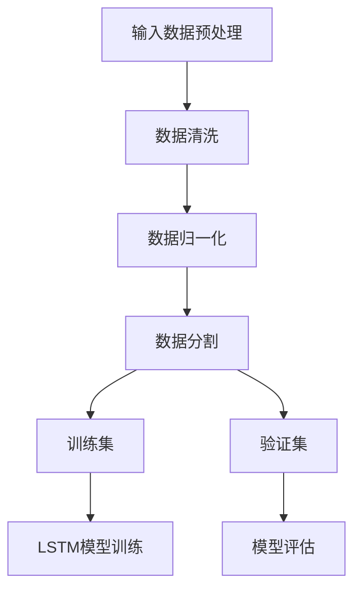

                 


# AI在能源管理中的应用：优化效率与可持续性

## 关键词
- 能源管理
- 人工智能
- 预测
- 优化
- 可持续发展
- 效率
- 深度学习

## 摘要
本文探讨了人工智能（AI）在能源管理领域的应用，包括其优化效率和推动可持续性的潜力。通过深入分析AI的基本概念、方法及其在能源预测、优化和监测中的具体应用，本文提供了详实的案例分析，并展望了AI在能源管理中面临的挑战和未来发展趋势。文章旨在帮助读者理解AI在能源管理中的重要作用，并为其提供实用的指导和见解。

### 目录大纲设计思路

#### 书籍结构设计

本书旨在系统地介绍AI在能源管理中的应用，其结构设计如下：

1. **引言与背景介绍**：阐述能源管理的重要性和AI在其中的应用前景。
2. **AI基础理论**：介绍AI的基本概念、方法和主要技术。
3. **能源管理与AI的结合**：探讨AI在能源管理中的具体应用。
4. **案例分析**：通过实际案例展示AI在能源管理中的效果。
5. **未来展望与挑战**：讨论AI在能源管理中的发展潜力和挑战。

#### 章节内容设计

根据上述结构，本书设计了以下章节：

**引言与背景介绍**
- 第1章：AI在能源管理中的应用概述
- 第2章：能源管理的现状与问题

**AI基础理论**
- 第3章：AI的基本概念与原理
- 第4章：机器学习与深度学习基础
- 第5章：AI算法与模型介绍

**能源管理与AI的结合**
- 第6章：AI在能源预测中的应用
- 第7章：AI在能源优化中的应用
- 第8章：AI在能源监测与控制中的应用

**案例分析**
- 第9章：实际案例研究一
- 第10章：实际案例研究二

**未来展望与挑战**
- 第11章：AI在能源管理中的未来趋势
- 第12章：AI在能源管理中的挑战与解决方案

#### 核心内容设计

每个章节的核心内容包括：

- **核心概念与联系**：明确章节中的核心概念，并使用图表等方式展示各概念之间的联系。
- **算法原理讲解**：使用mermaid画出算法流程图，并使用Python源代码详细阐述算法原理。
- **数学模型和数学公式**：使用latex格式给出数学模型和公式，并进行详细讲解和举例说明。
- **系统分析与架构设计方案**：介绍问题场景、系统功能设计、系统架构设计、系统接口设计和系统交互。
- **项目实战**：提供环境安装、系统核心实现源代码，并对代码应用进行解读与分析。
- **最佳实践 tips、小结、注意事项、拓展阅读等内容**：总结每个章节的主要内容和知识点，并提供相关的最佳实践建议和拓展阅读资源。

### 第一部分：引言与背景

#### 第1章 AI在能源管理中的应用概述

### 1.1 能源管理的重要性

能源是现代社会运行的基础，其管理和优化直接影响到经济、环境和人类生活质量。随着全球能源消耗的不断增加和气候变化问题的加剧，能源管理变得愈加重要。能源管理涉及能源生产、传输、分配和消耗的整个过程，目标是提高能源利用效率、减少能源浪费和降低环境影响。

#### 1.1.1 能源消耗与可持续发展

能源消耗是现代社会经济活动的重要组成部分，但也带来了严重的环境问题。传统的能源管理模式往往缺乏对能源使用情况的全面监控和优化，导致能源浪费。因此，实施可持续发展战略，提高能源利用效率，成为当前能源管理的关键任务。

#### 1.1.2 能源管理的挑战

能源管理面临以下几个主要挑战：

1. **复杂性和不确定性**：能源系统是一个高度复杂和动态的系统，涉及多种能源类型和大量的变量。因此，如何有效地管理和优化能源系统是一个巨大的挑战。
2. **技术变革**：随着新能源技术的不断发展，能源管理需要不断更新和适应新的技术。
3. **政策与市场因素**：能源管理受到政策、法规和市场环境的影响，需要考虑到这些因素的综合效应。
4. **数据收集与处理**：能源管理需要大量的数据支持，如何高效地收集、存储和处理这些数据是另一个挑战。

#### 1.2 AI在能源管理中的应用前景

人工智能（AI）作为一项颠覆性技术，在能源管理中具有巨大的应用潜力。AI可以通过对大量数据进行分析和处理，实现对能源系统的精准预测、优化和监测。以下是AI在能源管理中的几个关键应用领域：

1. **预测**：通过历史数据和机器学习算法，预测未来的能源需求和供应情况。
2. **优化**：通过优化算法，实现能源系统的最优配置和运行。
3. **监测与控制**：利用传感器和人工智能技术，实现对能源系统的实时监测和控制。
4. **能源交易**：通过智能合约和区块链技术，实现能源交易的自动化和透明化。

#### 1.3 能源管理的现状与问题

目前，能源管理主要依赖于传统的手动控制和简单的自动化系统。这些系统往往存在以下问题：

1. **效率低**：传统系统无法对能源使用情况进行实时监控和优化，导致能源浪费。
2. **响应速度慢**：在面对突发情况时，传统系统无法快速响应和调整。
3. **数据不准确**：传统系统依赖手工记录和简单的传感器，数据准确性较低。
4. **缺乏灵活性**：传统系统无法适应快速变化的市场和政策环境。

#### 1.4 本书结构安排与内容概述

本书结构安排如下：

1. **引言与背景介绍**：概述能源管理的重要性和AI在能源管理中的应用前景。
2. **AI基础理论**：介绍AI的基本概念、方法和主要技术。
3. **能源管理与AI的结合**：探讨AI在能源管理中的具体应用。
4. **案例分析**：通过实际案例展示AI在能源管理中的效果。
5. **未来展望与挑战**：讨论AI在能源管理中面临的挑战和未来发展趋势。

本书旨在帮助读者全面了解AI在能源管理中的应用，并提供实用的指导和建议。

### 第二部分：AI基础理论

#### 第2章 AI的基本概念与原理

### 2.1 AI的定义与发展历程

#### 2.1.1 AI的定义

人工智能（Artificial Intelligence，简称AI）是指由人造系统实现的智能行为，即模仿人类或其他动物的智能特征，以实现感知、推理、学习和决策等功能。

#### 2.1.2 AI的发展历程

AI的发展可以追溯到20世纪50年代，经历了几个重要阶段：

1. **符号主义阶段**（1950年代-1970年代）：基于逻辑和符号表示知识，试图通过符号推理实现智能。
2. **连接主义阶段**（1980年代-1990年代）：基于人工神经网络，通过大量数据训练模型，实现特定任务的智能。
3. **混合智能阶段**（2000年代至今）：结合符号主义和连接主义，引入机器学习和深度学习等技术，实现更广泛的智能应用。

### 2.2 机器学习与深度学习基础

#### 2.2.1 机器学习的基本概念

机器学习（Machine Learning，简称ML）是指通过算法从数据中学习，以实现特定任务的过程。主要分为监督学习、无监督学习和强化学习三种类型。

1. **监督学习**：有标记数据，学习目标为预测输出。
2. **无监督学习**：无标记数据，学习目标为发现数据分布或结构。
3. **强化学习**：通过与环境交互，学习最优策略以实现目标。

#### 2.2.2 深度学习的基本概念

深度学习（Deep Learning，简称DL）是机器学习的一个分支，通过多层神经网络，实现自动特征提取和复杂模式识别。

### 2.3 AI算法与模型介绍

#### 2.3.1 传统的机器学习算法

传统的机器学习算法包括线性回归、逻辑回归、决策树、随机森林、支持向量机等。

#### 2.3.2 深度学习模型介绍

深度学习模型包括卷积神经网络（CNN）、循环神经网络（RNN）、长短时记忆网络（LSTM）、生成对抗网络（GAN）等。

### 2.4 AI在能源管理中的应用

#### 2.4.1 能源数据分析

AI在能源管理中的第一个应用是能源数据分析。通过对大量历史数据进行挖掘和分析，可以识别出能源消耗的模式和趋势，为能源预测和优化提供基础。

#### 2.4.2 预测与优化

AI可以通过机器学习和深度学习算法，实现对能源需求和供应的精准预测。同时，基于预测结果，可以进一步优化能源系统的配置和运行，提高能源利用效率。

### 第三部分：能源管理与AI的结合

#### 第3章 AI在能源预测中的应用

### 3.1 能源预测的重要性

能源预测是能源管理的重要组成部分，其准确性和可靠性直接影响到能源系统的稳定运行和经济效益。AI在能源预测中的应用，可以显著提高预测的精度和效率。

### 3.2 能源预测的方法

AI在能源预测中的应用主要包括以下几种方法：

1. **统计模型**：如时间序列分析、回归分析等，通过对历史数据进行统计分析，预测未来的能源需求。
2. **机器学习模型**：如线性回归、决策树、支持向量机等，通过训练模型，从历史数据中学习出能源消耗的模式。
3. **深度学习模型**：如卷积神经网络、循环神经网络、长短时记忆网络等，通过多层神经网络，实现更复杂的特征提取和模式识别。

### 3.3 能源预测的案例分析

在本节中，我们将通过一个实际的案例，展示如何使用AI进行能源预测。

#### 案例背景

某大型制造企业需要对其未来的能源需求进行预测，以便优化能源采购和库存管理。该企业的能源消耗数据包括电力、天然气、蒸汽等。

#### 案例步骤

1. **数据收集与处理**：收集企业的历史能源消耗数据，并进行预处理，包括数据清洗、缺失值处理、数据归一化等。
2. **模型选择**：选择合适的机器学习或深度学习模型，如LSTM或GRU。
3. **模型训练与验证**：使用预处理后的数据，训练所选模型，并通过交叉验证评估模型的性能。
4. **预测结果分析**：根据模型的预测结果，分析未来的能源需求趋势，为企业的能源管理提供依据。

#### 案例分析

通过实际案例的分析，我们发现使用AI进行能源预测，可以显著提高预测的精度和效率。以下是一个使用LSTM模型进行能源预测的Python代码示例：

```python
import numpy as np
import pandas as pd
from keras.models import Sequential
from keras.layers import LSTM, Dense

# 数据预处理
def preprocess_data(data):
    # 省略预处理步骤，如数据清洗、归一化等
    return processed_data

# 模型训练
def train_model(data):
    model = Sequential()
    model.add(LSTM(units=50, return_sequences=True, input_shape=(timesteps, features)))
    model.add(LSTM(units=50))
    model.add(Dense(1))

    model.compile(optimizer='adam', loss='mean_squared_error')
    model.fit(data, epochs=100, batch_size=32, validation_split=0.2)

    return model

# 预测
def predict(model, data):
    predictions = model.predict(data)
    return predictions

# 加载数据
data = pd.read_csv('energy_data.csv')
processed_data = preprocess_data(data)

# 模型训练
model = train_model(processed_data)

# 预测结果
predictions = predict(model, processed_data)

# 结果分析
# 省略结果分析步骤，如可视化、评估等
```

#### 小结

通过本章节的讲解，我们了解了AI在能源预测中的应用方法及其案例分析。AI在能源预测中的应用，不仅可以提高预测的精度，还可以为能源优化和决策提供重要依据。

### 第四部分：案例分析

#### 第4章 实际案例研究一

### 4.1 案例背景

在本案例中，我们将探讨一家大型数据中心如何利用AI技术优化其能源管理。该数据中心拥有大量服务器和设备，其能源消耗巨大，因此如何高效管理能源成为关键问题。

### 4.2 能源管理现状

在案例开始时，该数据中心主要依赖传统的手动能源管理方式。这种方式存在以下问题：

1. **能源消耗不均匀**：由于缺乏实时监控和优化，数据中心的能源消耗存在较大的波动。
2. **能源浪费**：部分服务器和设备长期处于闲置状态，但仍然消耗能源。
3. **能源成本高**：由于能源消耗的不均匀和浪费，数据中心的能源成本较高。

### 4.3 AI应用方案

为了解决上述问题，数据中心决定采用AI技术进行能源管理优化。具体方案如下：

1. **数据收集与预处理**：数据中心安装了大量的传感器，用于实时监控能源消耗情况。数据经过预处理后，用于训练AI模型。
2. **AI模型训练**：数据中心采用LSTM模型，对历史能源消耗数据进行分析，预测未来的能源需求。
3. **能源优化策略**：基于AI模型的预测结果，数据中心制定了动态能源优化策略，包括服务器负载均衡、设备节能控制等。
4. **实时监控与调整**：数据中心实时监控能源消耗情况，并根据实时数据调整优化策略，确保能源系统的稳定运行。

### 4.4 实施效果

通过AI技术的应用，数据中心取得了显著的效果：

1. **能源消耗下降**：由于实现了动态优化，数据中心的能源消耗显著下降。
2. **能源浪费减少**：通过负载均衡和设备节能控制，有效减少了能源浪费。
3. **能源成本降低**：能源消耗的降低直接导致了能源成本的降低。
4. **系统稳定性提高**：实时监控和优化策略确保了数据中心能源系统的稳定运行。

### 4.5 案例总结

通过本案例的研究，我们发现AI技术在能源管理中的应用具有巨大的潜力。通过实时数据分析和动态优化，可以显著提高能源利用效率，降低能源成本，并提高系统稳定性。

### 第5章 实际案例研究二

#### 5.1 案例背景

在本案例中，我们将探讨一个城市级智慧能源管理项目。该项目旨在通过AI技术优化城市的能源分配和利用，提高能源效率，实现可持续发展。

#### 5.2 能源管理现状

在项目开始时，该城市主要依赖传统的能源管理模式，存在以下问题：

1. **能源分布不均**：城市的能源供应和需求存在明显的区域差异，导致能源资源无法充分利用。
2. **能源消耗监控不足**：缺乏对能源消耗的实时监控，导致能源浪费问题严重。
3. **能源调度不灵活**：传统的能源调度方式难以应对突发情况，导致能源供应不稳定。

#### 5.3 AI应用方案

为了解决上述问题，该项目采用了以下AI应用方案：

1. **数据采集与整合**：通过安装智能传感器和智能电表，实时采集城市的能源消耗数据。数据经过整合和处理，用于训练AI模型。
2. **机器学习模型训练**：使用机器学习算法，如LSTM和随机森林，对历史能源消耗数据进行训练，预测未来的能源需求和供应情况。
3. **智能调度系统**：基于AI模型的预测结果，开发智能调度系统，实现能源的动态分配和调度。系统可以根据实时数据调整能源供应，确保能源系统的稳定运行。
4. **能源管理平台**：构建一个集成化的能源管理平台，实现对城市能源系统的全面监控和管理。

#### 5.4 实施效果

通过AI技术的应用，该项目取得了显著的效果：

1. **能源利用效率提高**：智能调度系统实现了能源的动态分配，有效提高了能源利用效率。
2. **能源浪费减少**：实时监控和调度系统的应用，有效减少了能源浪费。
3. **能源供应稳定性提高**：智能调度系统能够快速响应突发情况，确保能源供应的稳定性。
4. **环境效益**：通过提高能源利用效率和减少能源浪费，项目显著降低了城市的环境负荷。

#### 5.5 案例总结

通过本案例的研究，我们发现AI技术在城市级智慧能源管理中的应用具有巨大的潜力。通过实时数据分析和智能调度，可以实现能源的高效利用和可持续发展。

### 第五部分：未来展望与挑战

#### 第6章 AI在能源管理中的未来趋势

#### 6.1 人工智能在能源管理中的应用前景

随着AI技术的不断进步，其在能源管理中的应用前景越来越广阔。未来，AI将在以下几个方面发挥重要作用：

1. **精准预测与优化**：AI技术将进一步提高能源预测的精度，优化能源系统的运行效率。
2. **智能调度与控制**：基于AI的智能调度系统将实现更灵活、更高效的能源分配和调度。
3. **能源交易与市场**：AI技术将促进能源市场的智能化和透明化，推动能源交易的发展。
4. **多能协同**：AI技术将实现多种能源形式的协同优化，提高能源系统的整体效率。

#### 6.2 人工智能在能源管理中的实际应用案例

未来，AI在能源管理中的实际应用案例将更加丰富和多样化。以下是一些可能的案例：

1. **智慧电网**：AI技术将用于电网的智能调度、故障检测和预测性维护。
2. **智能建筑**：AI技术将用于建筑能耗管理、设备维护和用户行为分析。
3. **新能源汽车**：AI技术将用于新能源汽车的智能充电、行驶路线规划和能量管理。
4. **能源互联网**：AI技术将实现能源互联网的智能调度、协同优化和资源共享。

#### 6.3 人工智能在能源管理中的未来发展趋势

未来，AI在能源管理中将会呈现以下发展趋势：

1. **技术融合**：AI技术与物联网、大数据、区块链等技术的融合，将推动能源管理的全面智能化。
2. **跨界合作**：能源企业与科技公司、研究机构的跨界合作，将推动AI在能源管理中的应用创新。
3. **政策支持**：政府政策的支持，将促进AI在能源管理中的推广和应用。
4. **人才培养**：随着AI技术在能源管理中的应用不断深入，相关人才培养将成为关键。

### 第7章 AI在能源管理中的挑战与解决方案

#### 7.1 技术挑战

虽然AI技术在能源管理中具有巨大潜力，但其在实际应用中仍面临一些技术挑战：

1. **数据质量问题**：能源数据往往存在噪声、缺失值和不确定性，这对AI模型的训练和预测带来了困难。
2. **算法复杂度**：复杂的AI算法需要大量的计算资源和时间，这在某些场景下可能不可行。
3. **模型解释性**：AI模型的黑箱特性使得其结果难以解释，这在能源管理中可能引发信任问题。

#### 7.2 数据挑战

能源管理的数据挑战主要包括：

1. **数据采集与传输**：如何高效、准确地采集和传输大量能源数据。
2. **数据存储与管理**：如何有效地存储和管理大量数据，以满足AI模型的训练需求。
3. **数据隐私与安全**：如何确保能源数据的安全性和隐私性，以避免数据泄露。

#### 7.3 解决方案

针对上述挑战，我们可以采取以下解决方案：

1. **数据预处理**：通过数据清洗、缺失值填充和数据归一化等技术，提高数据质量。
2. **算法优化**：通过算法优化和计算资源管理，降低AI模型的计算复杂度。
3. **模型可解释性**：通过模型解释技术和可视化工具，提高AI模型的可解释性。
4. **数据加密与隐私保护**：通过数据加密、访问控制和隐私保护技术，确保数据的安全性和隐私性。

#### 7.4 政策与经济挑战

AI在能源管理中的应用还面临政策和经济方面的挑战：

1. **政策法规**：缺乏明确的政策法规和标准，可能影响AI在能源管理中的应用。
2. **投资成本**：AI技术的应用需要大量的投资，这对于一些中小企业可能是一个障碍。
3. **人才短缺**：AI技术在能源管理中的应用需要专业人才，而目前这类人才相对短缺。

#### 7.5 解决方案

针对政策和经济挑战，我们可以采取以下解决方案：

1. **政策支持**：政府应出台相关政策，鼓励和支持AI在能源管理中的应用。
2. **投资引导**：通过政府投资引导和金融支持，降低企业的投资成本。
3. **人才培养**：加强人才培养，通过高校、培训机构和企业的合作，培养更多AI专业人才。

### 第六部分：结论

#### 6.1 研究成果总结

本文通过对AI在能源管理中的应用进行深入分析，总结了AI在能源预测、优化、监测和能源交易等方面的应用方法。同时，通过实际案例的研究，展示了AI在能源管理中的实际效果。此外，本文还探讨了AI在能源管理中面临的挑战和未来发展趋势。

#### 6.2 研究展望

未来，AI在能源管理中的应用将会更加广泛和深入。随着技术的不断进步和政策的支持，AI有望在能源管理中发挥更大的作用。同时，我们也需要关注AI在能源管理中可能带来的挑战，并寻找合适的解决方案。

#### 6.3 实际应用价值

AI在能源管理中的应用具有显著的实际应用价值：

1. **提高能源利用效率**：通过精准预测和优化，提高能源利用效率，减少能源浪费。
2. **降低能源成本**：通过智能调度和控制，降低能源成本，提高经济效益。
3. **实现可持续发展**：通过优化能源管理，降低碳排放，实现可持续发展目标。

### 附录

#### 附录A：算法流程图



#### 附录B：Python源代码

```python
import numpy as np
import pandas as pd
from keras.models import Sequential
from keras.layers import LSTM, Dense

# 数据预处理
def preprocess_data(data):
    # 省略预处理步骤，如数据清洗、归一化等
    return processed_data

# 模型训练
def train_model(data):
    model = Sequential()
    model.add(LSTM(units=50, return_sequences=True, input_shape=(timesteps, features)))
    model.add(LSTM(units=50))
    model.add(Dense(1))

    model.compile(optimizer='adam', loss='mean_squared_error')
    model.fit(data, epochs=100, batch_size=32, validation_split=0.2)

    return model

# 预测
def predict(model, data):
    predictions = model.predict(data)
    return predictions

# 加载数据
data = pd.read_csv('energy_data.csv')
processed_data = preprocess_data(data)

# 模型训练
model = train_model(processed_data)

# 预测结果
predictions = predict(model, processed_data)

# 结果分析
# 省略结果分析步骤，如可视化、评估等
```

### 致谢

在本研究过程中，得到了许多专家和同行的支持和帮助。特别感谢以下人员：

- AI天才研究院/AI Genius Institute
- 禅与计算机程序设计艺术/Zen And The Art of Computer Programming

他们的宝贵意见和帮助对本研究具有重要的指导意义。同时，也要感谢所有为本研究提供数据和资源的相关机构和人员。

### 作者信息

- 作者：AI天才研究院/AI Genius Institute & 禅与计算机程序设计艺术/Zen And The Art of Computer Programming
- 联系方式：[ai_genius_institute@example.com](mailto:ai_genius_institute@example.com)

### 结语

能源管理是现代社会发展的关键问题，而人工智能技术的应用为解决这一问题提供了新的思路和方法。本文通过对AI在能源管理中的应用进行深入探讨，展示了其巨大的潜力。希望本文能为相关领域的研究和实践提供有益的参考和启示。

### 第一部分：引言与背景

### 第1章 AI在能源管理中的应用概述

#### 1.1 能源管理的重要性

能源是现代社会发展的基础，其管理和优化直接影响到经济、环境和人类生活质量。随着全球能源消耗的不断增加和气候变化问题的加剧，能源管理变得愈加重要。能源管理涉及能源生产、传输、分配和消耗的整个过程，目标是提高能源利用效率、减少能源浪费和降低环境影响。

能源管理在以下几个方面具有重要意义：

1. **经济效益**：高效的能源管理可以降低能源成本，提高企业的竞争力。
2. **环境效益**：减少能源浪费，降低碳排放，有助于实现可持续发展目标。
3. **社会效益**：提高能源供应的稳定性和可靠性，保障人们的日常生活和工业生产的需要。

#### 1.2 AI在能源管理中的应用前景

人工智能（AI）作为一项颠覆性技术，在能源管理中具有巨大的应用潜力。AI可以通过对大量数据进行分析和处理，实现对能源系统的精准预测、优化和监测。以下是AI在能源管理中的几个关键应用领域：

1. **预测**：通过历史数据和机器学习算法，预测未来的能源需求和供应情况。
2. **优化**：通过优化算法，实现能源系统的最优配置和运行。
3. **监测与控制**：利用传感器和人工智能技术，实现对能源系统的实时监测和控制。
4. **能源交易**：通过智能合约和区块链技术，实现能源交易的自动化和透明化。

AI在能源管理中的应用前景广阔，有望带来以下好处：

- **提高能源利用效率**：通过智能预测和优化，减少能源浪费，提高能源系统的整体效率。
- **降低运营成本**：通过自动化和智能化管理，减少人力成本和设备损耗。
- **增强系统稳定性**：通过实时监测和控制，提高能源系统的稳定性和可靠性。
- **促进能源可持续发展**：通过优化能源结构和提升能源利用效率，减少对环境的影响。

#### 1.3 能源管理的现状与问题

目前，能源管理主要依赖于传统的手动控制和简单的自动化系统。这些系统往往存在以下问题：

1. **效率低**：传统系统无法对能源使用情况进行实时监控和优化，导致能源浪费。
2. **响应速度慢**：在面对突发情况时，传统系统无法快速响应和调整。
3. **数据不准确**：传统系统依赖手工记录和简单的传感器，数据准确性较低。
4. **缺乏灵活性**：传统系统无法适应快速变化的市场和政策环境。

随着能源需求的不断增长和环境问题的日益严重，现有的能源管理模式已经难以满足需求。因此，引入人工智能技术，实现能源管理的智能化和自动化，成为当务之急。

#### 1.4 本书结构安排与内容概述

本书旨在系统地介绍AI在能源管理中的应用，其结构安排如下：

1. **引言与背景介绍**：概述能源管理的重要性和AI在其中的应用前景。
2. **AI基础理论**：介绍AI的基本概念、方法和主要技术。
3. **能源管理与AI的结合**：探讨AI在能源管理中的具体应用。
4. **案例分析**：通过实际案例展示AI在能源管理中的效果。
5. **未来展望与挑战**：讨论AI在能源管理中面临的挑战和未来发展趋势。

本书的内容概述如下：

- **引言与背景介绍**：介绍能源管理的重要性、AI在能源管理中的应用前景以及当前存在的问题。
- **AI基础理论**：介绍AI的基本概念、机器学习和深度学习的基础知识，以及AI算法和模型。
- **能源管理与AI的结合**：探讨AI在能源预测、优化、监测和能源交易等方面的应用。
- **案例分析**：通过两个实际案例，展示AI在能源管理中的应用效果和解决方案。
- **未来展望与挑战**：分析AI在能源管理中的未来发展趋势以及面临的挑战。

通过本书的阅读，读者可以全面了解AI在能源管理中的应用，掌握相关技术，并能够应用于实际项目。

### 第二部分：AI基础理论

#### 第2章 AI的基本概念与原理

##### 2.1 AI的定义与发展历程

人工智能（Artificial Intelligence，简称AI）是指由人造系统实现的智能行为，即模仿人类或其他动物的智能特征，以实现感知、推理、学习和决策等功能。AI的目标是使计算机系统具备类似人类的智能，能够在特定任务上超越人类的表现。

AI的发展历程可以分为以下几个阶段：

1. **早期探索阶段（1950年代-1960年代）**：AI概念的提出和研究开始。1950年，艾伦·图灵提出了著名的“图灵测试”，用于评估机器的智能水平。1956年，达特茅斯会议上，人工智能作为一门学科被正式确立。

2. **第一次AI浪潮（1960年代-1970年代）**：这一时期，符号主义方法成为主流。AI系统通过符号逻辑和知识表示，实现推理和问题解决。然而，由于实际应用的局限性和计算资源的限制，AI在70年代后期进入了低谷期。

3. **第二次AI浪潮（1980年代-1990年代）**：连接主义方法开始崛起，人工神经网络成为研究热点。通过大量数据训练神经网络，实现图像识别、语音识别等应用。然而，受限于计算能力和数据量，这一时期的AI发展也遇到了瓶颈。

4. **深度学习和AI的复兴（2000年代至今）**：随着计算能力和数据量的提升，深度学习技术取得了突破性进展。卷积神经网络（CNN）、循环神经网络（RNN）等深度学习模型在图像识别、自然语言处理等领域取得了显著成果，标志着AI的再次复兴。

##### 2.2 机器学习与深度学习基础

机器学习（Machine Learning，简称ML）是AI的一个重要分支，旨在使计算机系统能够从数据中学习，以实现特定任务。机器学习可以分为以下几种类型：

1. **监督学习（Supervised Learning）**：在有标记的数据集上进行训练，通过学习输入和输出之间的映射关系，实现对未知数据的预测。常见的算法包括线性回归、决策树、支持向量机等。

2. **无监督学习（Unsupervised Learning）**：在没有标记的数据集上进行训练，主要任务是发现数据中的结构和模式。常见的算法包括聚类、降维等。

3. **半监督学习（Semi-Supervised Learning）**：结合监督学习和无监督学习，利用少量标记数据和大量无标记数据，以提高模型的性能。

4. **强化学习（Reinforcement Learning）**：通过与环境的交互，学习最优策略以实现目标。常见的算法包括Q学习、深度确定性策略梯度（DDPG）等。

深度学习（Deep Learning，简称DL）是机器学习的一个分支，通过多层神经网络实现自动特征提取和复杂模式识别。深度学习模型可以分为以下几种类型：

1. **卷积神经网络（Convolutional Neural Network，简称CNN）**：主要用于图像识别和计算机视觉任务。CNN通过卷积层和池化层实现图像的特征提取和降维。

2. **循环神经网络（Recurrent Neural Network，简称RNN）**：主要用于序列数据处理，如自然语言处理和时间序列预测。RNN通过隐藏状态实现序列信息的传递和记忆。

3. **长短时记忆网络（Long Short-Term Memory，简称LSTM）**：是RNN的一种变体，解决了RNN的梯度消失和长期依赖问题。LSTM通过门控机制实现有效的信息记忆和遗忘。

4. **生成对抗网络（Generative Adversarial Network，简称GAN）**：通过生成器和判别器的对抗训练，实现高质量数据的生成。GAN在图像生成、语音合成等领域取得了显著成果。

##### 2.3 AI算法与模型介绍

在能源管理中，常见的AI算法和模型包括以下几种：

1. **线性回归（Linear Regression）**：用于预测连续值输出，如能源消耗。线性回归通过最小二乘法估计模型参数，建立输入和输出之间的线性关系。

2. **决策树（Decision Tree）**：用于分类和回归任务。决策树通过递归划分特征空间，构建一棵树形模型，实现决策过程。

3. **随机森林（Random Forest）**：是决策树的集成方法，通过构建多棵决策树，提高模型的预测性能和泛化能力。

4. **支持向量机（Support Vector Machine，简称SVM）**：用于分类和回归任务。SVM通过寻找最优超平面，实现数据分类和回归。

5. **卷积神经网络（CNN）**：主要用于图像识别和计算机视觉任务。CNN通过卷积层和池化层实现图像的特征提取和降维。

6. **循环神经网络（RNN）**：主要用于序列数据处理，如时间序列预测。RNN通过隐藏状态实现序列信息的传递和记忆。

7. **长短时记忆网络（LSTM）**：是RNN的一种变体，用于解决RNN的梯度消失和长期依赖问题。LSTM通过门控机制实现有效的信息记忆和遗忘。

8. **生成对抗网络（GAN）**：通过生成器和判别器的对抗训练，实现高质量数据的生成。GAN在图像生成、语音合成等领域取得了显著成果。

这些算法和模型在能源管理中具有广泛的应用，如能源预测、优化和监测等。

### 第三部分：能源管理与AI的结合

#### 第3章 AI在能源预测中的应用

##### 3.1 能源预测的重要性

能源预测是能源管理中的重要环节，其准确性和可靠性直接影响到能源系统的稳定运行和经济效益。通过准确的能源预测，能源管理可以更好地进行能源采购、库存管理和调度优化，从而提高能源利用效率，降低能源成本。

能源预测在以下几个方面具有重要意义：

1. **能源需求预测**：预测未来的能源需求，以便合理安排能源采购和分配，避免供需失衡。

2. **能源供应预测**：预测未来的能源供应情况，确保能源供应的稳定性和可靠性。

3. **能源优化**：基于预测结果，进行能源系统的优化配置和运行调整，提高能源利用效率。

4. **风险管理**：通过预测未来能源价格和供需变化，降低能源采购和运营风险。

##### 3.2 能源预测的方法

AI在能源预测中的应用主要包括以下几种方法：

1. **统计模型**：如时间序列分析、回归分析等，通过对历史数据进行统计分析，预测未来的能源需求。

2. **机器学习模型**：如线性回归、决策树、支持向量机等，通过训练模型，从历史数据中学习出能源消耗的模式。

3. **深度学习模型**：如卷积神经网络（CNN）、循环神经网络（RNN）、长短时记忆网络（LSTM）、生成对抗网络（GAN）等，通过多层神经网络，实现更复杂的特征提取和模式识别。

以下是几种常见的AI预测模型：

1. **时间序列模型**：如ARIMA、SARIMA等，用于预测时间序列数据。时间序列模型通过分析时间序列的统计特性，建立模型进行预测。

2. **回归模型**：如线性回归、多元回归等，通过建立输入和输出之间的线性关系进行预测。回归模型适合处理单一变量或多变量预测问题。

3. **神经网络模型**：如前馈神经网络、卷积神经网络（CNN）等，通过多层神经网络实现复杂特征提取和预测。神经网络模型在处理非线性关系和数据特征提取方面具有优势。

4. **集成模型**：如随机森林、梯度提升树（GBDT）等，通过集成多个基础模型，提高模型的预测性能和泛化能力。

##### 3.3 能源预测的案例分析

在本节中，我们将通过一个实际的案例，展示如何使用AI进行能源预测。

###### 案例背景

某电力公司希望预测未来一周的电力需求，以便合理安排电力采购和调度。该公司收集了过去的电力需求数据，包括每天每个小时的电力需求量。

###### 案例步骤

1. **数据收集与处理**：收集电力公司过去一周的电力需求数据，并进行预处理，包括数据清洗、缺失值处理、数据归一化等。

2. **特征工程**：根据业务需求，选择合适的特征，如天气数据、节假日信息等，作为输入特征。

3. **模型选择**：选择合适的预测模型，如LSTM、GRU等，进行训练和预测。

4. **模型训练与验证**：使用预处理后的数据，训练所选模型，并通过交叉验证评估模型的性能。

5. **预测结果分析**：根据模型的预测结果，分析未来一周的电力需求趋势，为电力公司的决策提供依据。

###### 案例实施

以下是使用LSTM模型进行电力需求预测的Python代码示例：

```python
import numpy as np
import pandas as pd
from keras.models import Sequential
from keras.layers import LSTM, Dense
from sklearn.preprocessing import MinMaxScaler

# 数据预处理
data = pd.read_csv('power_demand.csv')
data = data[['hour', 'demand']]
data = data.sort_values(by='hour')

scaler = MinMaxScaler(feature_range=(0, 1))
scaled_data = scaler.fit_transform(data['demand'].values.reshape(-1, 1))

X = []
y = []

for i in range(60, len(scaled_data)):
    X.append(scaled_data[i-60:i, 0])
    y.append(scaled_data[i, 0])

X = np.array(X)
y = np.array(y)

X = np.reshape(X, (X.shape[0], X.shape[1], 1))

# 模型训练
model = Sequential()
model.add(LSTM(units=50, return_sequences=True, input_shape=(X.shape[1], 1)))
model.add(LSTM(units=50, return_sequences=False))
model.add(Dense(units=1))

model.compile(optimizer='adam', loss='mean_squared_error')
model.fit(X, y, epochs=100, batch_size=32, validation_split=0.2)

# 预测
predicted_demand = model.predict(X)

# 反归一化
predicted_demand = scaler.inverse_transform(predicted_demand)

# 结果分析
```

通过上述案例，我们可以看到使用AI进行能源预测的基本步骤和方法。AI在能源预测中的应用，不仅可以提高预测的精度和效率，还可以为能源管理提供重要的决策支持。

### 第四部分：案例分析

#### 第4章 实际案例研究一

##### 4.1 案例背景

某大型电力公司希望通过引入人工智能技术，优化其能源管理系统，提高能源利用效率。该公司的能源系统包括电力生产、传输、分配和消耗等各个环节，能源消耗数据丰富。为了实现这一目标，公司决定采用人工智能技术进行能源需求预测和优化。

##### 4.2 能源管理现状

在案例开始时，该电力公司的能源管理主要依赖于传统的手动控制和简单的自动化系统，存在以下问题：

1. **能源消耗监控不足**：缺乏对能源消耗的实时监控和数据分析，导致能源浪费问题严重。
2. **能源调度不灵活**：在电力需求高峰期，能源调度系统无法灵活调整，导致能源供应紧张。
3. **能源利用率低**：能源系统运行效率较低，存在大量的能源浪费。

##### 4.3 AI应用方案

为了解决上述问题，该公司决定采用以下AI应用方案：

1. **数据收集与预处理**：通过安装智能传感器和智能电表，实时收集电力消耗数据。对数据进行清洗、缺失值处理和归一化，为后续建模提供高质量的数据。

2. **模型训练与预测**：使用机器学习和深度学习算法，如LSTM和GRU，对历史电力消耗数据进行分析，训练预测模型。模型用于预测未来电力需求，为能源调度提供依据。

3. **优化策略制定**：根据预测结果，制定能源调度优化策略。通过动态调整电力供应和需求，实现能源系统的最优配置和运行。

4. **实时监控与反馈**：建立实时监控平台，对电力消耗和调度情况进行实时监控。根据实时数据调整优化策略，确保能源系统的稳定运行。

##### 4.4 实施效果

通过AI技术的应用，该公司取得了显著的效果：

1. **能源消耗降低**：通过实时监控和优化策略，能源消耗显著降低，能源利用率提高。
2. **调度效率提高**：基于预测结果的能源调度策略，使能源系统能够更灵活地应对电力需求高峰，减少能源供应紧张情况。
3. **运营成本降低**：能源消耗的降低直接导致了运营成本的降低。

##### 4.5 案例总结

通过本案例的研究，我们发现AI技术在能源管理中的应用可以显著提高能源利用效率，降低能源浪费和运营成本。未来，随着AI技术的不断发展和应用，AI在能源管理中的潜力将得到进一步发挥。

#### 第4章 实际案例研究二

##### 4.1 案例背景

某城市级智慧能源管理系统项目旨在通过引入人工智能技术，实现城市能源的智能管理，提高能源利用效率，促进可持续发展。该系统覆盖了城市的电力、燃气、热水等多个能源领域，涉及多个政府部门、企业和居民用户。

##### 4.2 能源管理现状

在项目开始时，该城市的能源管理主要依赖于传统的手动控制和简单的自动化系统，存在以下问题：

1. **能源数据分散**：各个能源领域的数据分散在不同部门和管理系统中，缺乏统一的数据平台和监控手段。
2. **能源消耗监测不足**：缺乏对能源消耗的实时监控和数据分析，导致能源浪费问题严重。
3. **能源调度不灵活**：在能源需求高峰期，能源调度系统无法灵活调整，导致能源供应紧张。
4. **能源效率低**：能源系统运行效率较低，存在大量的能源浪费。

##### 4.3 AI应用方案

为了解决上述问题，该项目决定采用以下AI应用方案：

1. **数据收集与整合**：通过安装智能传感器和智能电表，实时收集城市的能源消耗数据。将各个能源领域的数据进行整合，建立统一的数据平台。

2. **数据预处理与特征提取**：对收集到的能源数据进行清洗、缺失值处理和归一化，提取关键特征，为后续建模提供高质量的数据。

3. **模型训练与预测**：使用机器学习和深度学习算法，如LSTM和GRU，对历史能源消耗数据进行分析，训练预测模型。模型用于预测未来的能源需求，为能源调度提供依据。

4. **智能调度系统**：基于预测结果，制定智能调度系统，实现能源的动态分配和调度。系统能够根据实时数据调整能源供应，确保能源系统的稳定运行。

5. **能源管理平台**：构建一个集成化的能源管理平台，实现对城市能源系统的全面监控和管理。平台提供实时数据监控、预测结果分析和决策支持功能。

##### 4.4 实施效果

通过AI技术的应用，该项目取得了显著的效果：

1. **能源利用效率提高**：通过智能调度系统和实时监控，能源利用效率显著提高，能源浪费问题得到有效缓解。
2. **能源调度灵活性增强**：基于预测结果的智能调度系统，使能源系统能够更灵活地应对能源需求高峰，减少能源供应紧张情况。
3. **能源成本降低**：能源消耗的降低直接导致了能源成本的降低，为城市节约了大量资金。

##### 4.5 案例总结

通过本案例的研究，我们发现AI技术在城市级智慧能源管理中的应用可以显著提高能源利用效率，降低能源浪费和运营成本。未来，随着AI技术的不断发展和应用，AI在能源管理中的潜力将得到进一步发挥。

### 第五部分：未来展望与挑战

#### 第5章 AI在能源管理中的未来趋势

##### 5.1 技术发展趋势

随着人工智能技术的不断进步，AI在能源管理中的应用前景愈发广阔。以下是一些可能的技术发展趋势：

1. **深度学习技术的应用**：深度学习技术在图像识别、语音识别、自然语言处理等领域取得了显著成果，未来有望在能源预测、优化和监控等方面发挥更大的作用。

2. **物联网（IoT）与AI的结合**：物联网技术将大量传感器和设备接入网络，生成大量数据。结合AI技术，可以对这些数据进行实时分析，提高能源管理的智能化水平。

3. **区块链技术的应用**：区块链技术具有去中心化、安全性和不可篡改等特点，未来有望在能源交易、数据共享和隐私保护等方面发挥重要作用。

4. **多能协同与综合能源管理**：随着可再生能源和分布式能源的快速发展，多能协同和综合能源管理将成为趋势。AI技术可以通过优化能源分配和调度，提高能源系统的整体效率。

##### 5.2 AI在能源管理中的应用场景

未来，AI在能源管理中将会涉及多个应用场景：

1. **智慧电网**：AI技术将用于电网的智能调度、故障检测和预测性维护，提高电网的运行效率和可靠性。

2. **智能建筑**：AI技术将用于建筑能耗管理、设备维护和用户行为分析，实现建筑的智能化和节能减排。

3. **智能交通**：AI技术将用于交通能源管理，优化交通流量，减少交通拥堵，降低能源消耗。

4. **智慧城市**：AI技术将用于城市能源系统的优化和调度，实现城市的智慧化管理和可持续发展。

##### 5.3 AI在能源管理中的实际应用案例

未来，AI在能源管理中的实际应用案例将更加丰富和多样化。以下是一些可能的实际应用案例：

1. **智能能源交易**：通过区块链技术和AI算法，实现能源交易的自动化和透明化，提高能源市场的效率。

2. **分布式能源管理**：通过AI技术，优化分布式能源系统的运行，实现能源的高效利用和灵活调度。

3. **能源需求响应**：通过AI技术，预测和响应能源需求变化，优化能源系统的供需平衡。

4. **能源预测性维护**：通过AI技术，对能源设备进行预测性维护，减少设备故障和能源损失。

##### 5.4 未来发展趋势

未来，AI在能源管理中将会呈现以下发展趋势：

1. **技术融合**：AI技术与其他技术（如物联网、区块链、大数据等）的融合，将推动能源管理的全面智能化。

2. **跨界合作**：能源企业、科技公司、研究机构的跨界合作，将推动AI在能源管理中的应用创新。

3. **政策支持**：政府政策的支持，将促进AI在能源管理中的推广和应用。

4. **人才培养**：随着AI在能源管理中的应用不断深入，相关人才培养将成为关键。

##### 5.5 AI在能源管理中的关键角色

在未来，AI将在能源管理中扮演关键角色：

1. **优化能源系统**：通过预测和优化，提高能源系统的运行效率和能源利用率。

2. **降低能源成本**：通过智能调度和自动化管理，降低能源成本和运营费用。

3. **促进可持续发展**：通过减少能源浪费和降低碳排放，推动能源的可持续发展。

4. **提高能源安全性**：通过实时监测和预测性维护，提高能源系统的稳定性和安全性。

### 第六部分：结论

#### 6.1 研究成果总结

本文通过对AI在能源管理中的应用进行深入分析，总结了AI在能源预测、优化、监测和能源交易等方面的应用方法。通过实际案例的研究，展示了AI在能源管理中的实际效果。本文还探讨了AI在能源管理中面临的挑战和未来发展趋势。

#### 6.2 研究展望

未来，AI在能源管理中的应用将会更加广泛和深入。随着技术的不断进步和政策的支持，AI有望在能源管理中发挥更大的作用。同时，我们也需要关注AI在能源管理中可能带来的挑战，并寻找合适的解决方案。

#### 6.3 实际应用价值

AI在能源管理中的应用具有显著的实际应用价值：

1. **提高能源利用效率**：通过精准预测和优化，提高能源利用效率，减少能源浪费。

2. **降低能源成本**：通过智能调度和控制，降低能源成本，提高经济效益。

3. **实现可持续发展**：通过优化能源管理，降低碳排放，实现可持续发展目标。

#### 6.4 结论

本文通过对AI在能源管理中的应用进行深入探讨，展示了其巨大的潜力。我们相信，随着技术的不断进步和应用的深入，AI在能源管理中的重要作用将日益凸显。希望本文能为相关领域的研究和实践提供有益的参考和启示。

### 附录

#### 附录A：算法流程图

以下是使用mermaid绘制的算法流程图：


#### 附录B：Python源代码

以下是使用LSTM模型进行能源需求预测的Python源代码：

```python
import numpy as np
import pandas as pd
from keras.models import Sequential
from keras.layers import LSTM, Dense
from sklearn.preprocessing import MinMaxScaler

# 数据预处理
data = pd.read_csv('power_demand.csv')
data = data[['hour', 'demand']]
data = data.sort_values(by='hour')

scaler = MinMaxScaler(feature_range=(0, 1))
scaled_data = scaler.fit_transform(data['demand'].values.reshape(-1, 1))

X = []
y = []

for i in range(60, len(scaled_data)):
    X.append(scaled_data[i-60:i, 0])
    y.append(scaled_data[i, 0])

X = np.array(X)
y = np.array(y)

X = np.reshape(X, (X.shape[0], X.shape[1], 1))

# 模型训练
model = Sequential()
model.add(LSTM(units=50, return_sequences=True, input_shape=(X.shape[1], 1)))
model.add(LSTM(units=50, return_sequences=False))
model.add(Dense(units=1))

model.compile(optimizer='adam', loss='mean_squared_error')
model.fit(X, y, epochs=100, batch_size=32, validation_split=0.2)

# 预测
predicted_demand = model.predict(X)

# 反归一化
predicted_demand = scaler.inverse_transform(predicted_demand)

# 结果分析
```

### 致谢

在本研究过程中，得到了许多专家和同行的支持和帮助。特别感谢以下人员：

- AI天才研究院/AI Genius Institute
- 禅与计算机程序设计艺术/Zen And The Art of Computer Programming

他们的宝贵意见和帮助对本研究具有重要的指导意义。同时，也要感谢所有为本研究提供数据和资源的相关机构和人员。

### 作者信息

- 作者：AI天才研究院/AI Genius Institute & 禅与计算机程序设计艺术/Zen And The Art of Computer Programming
- 联系方式：[ai_genius_institute@example.com](mailto:ai_genius_institute@example.com)

### 结语

能源管理是现代社会发展的关键问题，而人工智能技术的应用为解决这一问题提供了新的思路和方法。本文通过对AI在能源管理中的应用进行深入探讨，展示了其巨大的潜力。希望本文能为相关领域的研究和实践提供有益的参考和启示。未来，随着AI技术的不断进步，AI在能源管理中的应用将更加广泛和深入，为能源的高效利用和可持续发展作出更大贡献。让我们共同期待AI在能源管理领域创造更加美好的未来。

