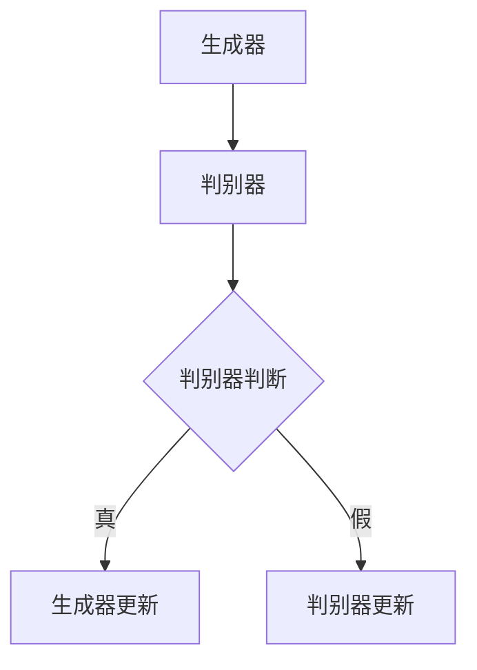
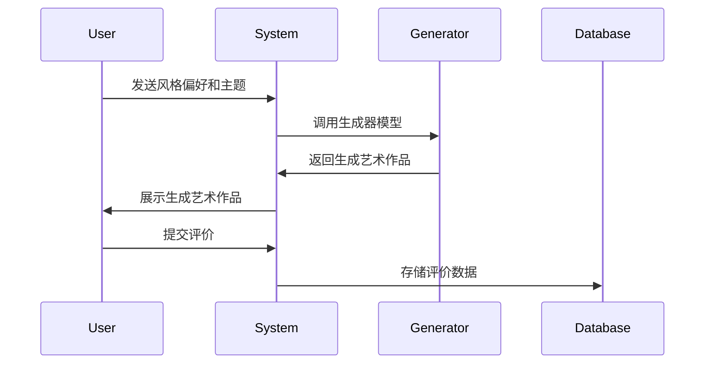

                 

### 文章标题

# AI在艺术创作中的角色：助手还是竞争者？

---

### 关键词

- **人工智能**，**艺术创作**，**助手**，**竞争者**，**GAN**，**自然语言处理**

---

### 摘要

本文探讨了人工智能（AI）在艺术创作中的角色，探讨其是作为艺术家的助手还是竞争者。通过历史背景介绍、核心概念分析、算法原理讲解、系统架构设计、实战案例和最佳实践，全面解析了AI在艺术创作中的应用现状、潜力与挑战，为未来AI与艺术的融合提供了新的视角和思考方向。

---

### 目录大纲设计

**第一部分：背景介绍**

- **第1章：问题背景**
  - **1.1 问题背景**
  - **1.2 问题描述**
  - **1.3 问题解决**
  - **1.4 边界与外延**
  - **1.5 概念结构与核心要素组成**

**第二部分：核心概念与联系**

- **第2章：核心概念与联系**
  - **2.1 AI艺术创作技术原理**
  - **2.2 概念属性特征对比表格**
  - **2.3 ER实体关系图架构**

**第三部分：算法原理讲解**

- **第3章：算法原理讲解**
  - **3.1 算法mermaid流程图**
  - **3.2 Python源代码与算法实现**
  - **3.3 数学模型和公式**
  - **3.4 举例说明**

**第四部分：系统分析与架构设计**

- **第4章：系统分析与架构设计**
  - **4.1 问题场景介绍**
  - **4.2 项目介绍**
  - **4.3 系统功能设计**
  - **4.4 系统架构设计**
  - **4.5 系统接口设计与交互**

**第五部分：项目实战**

- **第5章：项目实战**
  - **5.1 环境安装**
  - **5.2 系统核心实现源代码**
  - **5.3 代码应用解读与分析**
  - **5.4 实际案例分析与讲解**
  - **5.5 项目小结**

**第六部分：最佳实践与总结**

- **第6章：最佳实践与总结**
  - **6.1 最佳实践**
  - **6.2 小结**
  - **6.3 注意事项**
  - **6.4 拓展阅读**

---

### 第一部分：背景介绍

#### 第1章：问题背景

##### 1.1 问题背景

人工智能在近年来取得了飞速的发展，不仅在科研领域、工业生产中有着广泛应用，还逐渐渗透到艺术创作的领域。从最初的自动图像识别、文本生成，到如今能够自主创作音乐、绘画、甚至写作，AI在艺术创作中的应用引起了广泛的关注。

艺术创作是一个复杂的过程，涉及想象力、创造力、技术能力等多个方面。人工智能如何介入这一过程，以及其在其中扮演的角色，成为了学术界和产业界讨论的热点话题。一些观点认为，AI可以作为艺术家的助手，辅助艺术家完成创作；而另一些观点则认为，AI的介入会导致艺术家被取代，成为艺术的竞争者。

##### 1.2 问题描述

本文旨在探讨人工智能在艺术创作中的角色，分析其是作为助手还是竞争者的可能性。具体问题如下：

1. AI在艺术创作中的具体应用场景是什么？
2. AI能否具备与人类艺术家相媲美的创造力？
3. AI在艺术创作中面临的挑战有哪些？
4. AI如何与人类艺术家共同合作，创造更多的艺术价值？

##### 1.3 问题解决

本文将通过对历史背景的回顾、核心概念的阐述、算法原理的讲解、系统架构的设计和实战案例的分析，逐步回答上述问题。同时，还将探讨AI在艺术创作中的边界与外延，以及相关的法律和伦理问题。

##### 1.4 边界与外延

AI在艺术创作中的应用范围非常广泛，包括但不限于：

1. **音乐创作**：AI可以生成旋律、伴奏和完整的音乐作品。
2. **绘画与设计**：AI可以通过深度学习算法生成绘画作品，甚至模仿著名画家的风格。
3. **文学创作**：AI可以生成诗歌、故事、剧本等文学作品。
4. **虚拟现实与游戏设计**：AI可以为虚拟现实和游戏设计提供场景生成、角色设计等服务。

然而，AI在艺术创作中也存在一些限制和挑战，例如：

1. **创造力**：AI的创造力来源于大量的数据训练，但缺乏人类的直觉和情感。
2. **原创性**：AI生成的作品可能存在版权问题，如何界定原创性是一个需要解决的问题。
3. **审美差异**：AI和人类在审美标准上存在差异，如何确保AI生成的作品符合人类的审美需求。

##### 1.5 概念结构与核心要素组成

为了更好地理解AI在艺术创作中的角色，我们需要明确几个核心概念：

1. **人工智能**：一种能够模拟、延伸和扩展人类智能的理论、方法、技术及应用系统。
2. **艺术创作**：通过创造性思维和技巧，运用各种媒介和手段表达情感、思想和美感的活动。
3. **助手**：辅助人类完成特定任务的工具或系统。
4. **竞争者**：与人类在特定领域竞争，争夺资源或市场的对手。

通过这些核心概念，我们可以构建一个AI在艺术创作中的关系模型，分析其作为助手或竞争者的可能性。

---

### 第二部分：核心概念与联系

#### 第2章：核心概念与联系

##### 2.1 AI艺术创作技术原理

人工智能在艺术创作中的应用，主要依赖于以下几个核心技术：

1. **生成对抗网络（GAN）**：GAN是一种深度学习模型，由生成器和判别器两部分组成。生成器生成艺术作品，判别器判断艺术作品的真实性。通过不断训练，生成器能够生成越来越逼真的艺术作品。

2. **计算机视觉与图像生成**：计算机视觉技术可以识别和解析图像中的信息，而图像生成技术则能够根据输入的数据生成新的图像。这些技术广泛应用于绘画、设计、虚拟现实等领域。

3. **自然语言处理与文本生成**：自然语言处理技术能够理解和生成人类语言，文本生成技术可以根据输入的文本生成新的文本，广泛应用于文学创作、剧本编写等领域。

##### 2.2 概念属性特征对比表格

为了更直观地展示AI在艺术创作中的技术特点和应用场景，我们可以构建一个概念属性特征对比表格：

| 技术名称 | 特点 | 应用场景 |
| --- | --- | --- |
| 生成对抗网络（GAN） | 能够生成高质量的艺术作品 | 绘画、设计、音乐创作 |
| 计算机视觉与图像生成 | 能够解析和生成图像 | 虚拟现实、游戏设计、广告创意 |
| 自然语言处理与文本生成 | 能够理解和生成文本 | 文学创作、剧本编写、对话系统 |

##### 2.3 ER实体关系图架构

为了更好地理解AI在艺术创作系统中的角色和功能，我们可以构建一个ER实体关系图架构，展示各个实体之间的关系：

```mermaid
erDiagram
  AI系统 ||--|{ 艺术家 }
  AI系统 ||--|{ 艺术作品 }
  艺术家 ||--|{ 创作过程 }
  艺术作品 ||--|{ 展示与评价 }
  AI系统 ||--|{ 数据库 }
```

在ER实体关系图中，AI系统与艺术家、艺术作品、创作过程、展示与评价等实体之间存在密切的关系。艺术家通过AI系统进行艺术创作，生成的艺术作品经过展示和评价，同时AI系统通过数据库存储和检索相关数据。

---

### 第三部分：算法原理讲解

#### 第3章：算法原理讲解

##### 3.1 算法mermaid流程图

生成对抗网络（GAN）的核心算法包括生成器和判别器两部分。以下是一个简单的mermaid流程图，展示了GAN的基本工作流程：



##### 3.2 Python源代码与算法实现

以下是一个简单的GAN算法实现，使用Python语言和TensorFlow框架：

```python
import tensorflow as tf
from tensorflow.keras import layers

# 生成器模型
def generator_model():
    model = tf.keras.Sequential()
    model.add(layers.Dense(7 * 7 * 256, use_bias=False, input_shape=(100,)))
    model.add(layers.BatchNormalization())
    model.add(layers.LeakyReLU())
    model.add(layers.Reshape((7, 7, 256)))
    # ...
    # 更多层
    # ...
    model.add(layers.Conv2DTranspose(1, (4, 4), strides=(2, 2), padding='same', activation='tanh', use_bias=False))
    return model

# 判别器模型
def discriminator_model():
    model = tf.keras.Sequential()
    model.add(layers.Conv2D(64, (5, 5), strides=(2, 2), padding='same', input_shape=[28, 28, 1]))
    model.add(layers.LeakyReLU(alpha=0.2))
    model.add(layers.Dropout(0.3))
    # ...
    # 更多层
    # ...
    model.add(layers.Dense(1, activation='sigmoid'))
    return model

# 搭建GAN模型
def build_gan(generator, discriminator):
    model = tf.keras.Sequential()
    model.add(generator)
    model.add(discriminator)
    return model
```

##### 3.3 数学模型和公式

GAN的数学模型主要包括以下两部分：

1. **生成器模型**：生成器G的目的是生成伪真实数据，满足以下条件：
   $$ G(z) \sim P_{\text{data}}(x) $$
   其中，$z$ 是输入噪声，$G(z)$ 是生成的伪数据。

2. **判别器模型**：判别器D的目的是区分真实数据和生成数据，满足以下条件：
   $$ D(x) \approx 1 $$
   $$ D(G(z)) \approx 0 $$
   其中，$x$ 是真实数据，$G(z)$ 是生成的伪数据。

GAN的目标是最小化以下损失函数：
$$ \min_G \max_D V(D, G) = \mathbb{E}_{x\sim P_{\text{data}}(x)}[-\log D(x)] + \mathbb{E}_{z\sim P_{\text{z}}(z)}[-\log (1 - D(G(z)))] $$

##### 3.4 举例说明

以下是一个简单的GAN应用案例，用于生成人脸图像：

1. **数据集准备**：使用CelebA数据集作为训练数据，包括约30,000张名人面部图像。

2. **生成器模型**：使用生成器生成人脸图像，包括以下几个步骤：

   - 使用随机噪声向量$z$作为输入。
   - 通过多个全连接层和卷积层，将噪声向量转换为人脸图像。

3. **判别器模型**：使用判别器模型判断人脸图像的真实性，包括以下几个步骤：

   - 使用卷积层提取图像特征。
   - 使用全连接层输出概率值，判断图像是否为真实人脸。

4. **训练过程**：在训练过程中，交替训练生成器和判别器：

   - 首先固定判别器模型，训练生成器模型，使其生成的图像越来越逼真。
   - 然后固定生成器模型，训练判别器模型，使其能够准确地区分真实图像和生成图像。

经过多次迭代训练，生成器模型能够生成高质量的人脸图像，判别器模型能够准确地区分真实图像和生成图像。

---

### 第四部分：系统分析与架构设计

#### 第4章：系统分析与架构设计

##### 4.1 问题场景介绍

在艺术创作中，人工智能可以被应用于多种场景，例如：

- **音乐创作**：AI可以根据用户的风格偏好，生成新的音乐作品。
- **绘画与设计**：AI可以模仿著名画家的风格，为用户提供艺术作品的个性化定制。
- **文学创作**：AI可以根据用户提供的主题和情感，生成新的文学作品。
- **虚拟现实与游戏设计**：AI可以自动生成虚拟现实场景和游戏角色，提高创作效率。

##### 4.2 项目介绍

本文将介绍一个AI艺术创作系统，该系统结合了生成对抗网络（GAN）和自然语言处理技术，可以自动生成各种艺术作品。系统包括以下几个主要组成部分：

- **生成器模型**：使用GAN技术生成图像、音乐和文本作品。
- **判别器模型**：用于评估生成器生成的艺术作品的真实性。
- **用户接口**：提供用户交互界面，允许用户输入风格偏好和主题，选择生成艺术作品。
- **数据库**：存储大量训练数据和生成作品，以便模型进行学习和优化。

##### 4.3 系统功能设计

AI艺术创作系统的主要功能包括：

- **图像生成**：使用GAN技术生成各种类型的图像，包括人脸、风景、动物等。
- **音乐生成**：生成符合用户风格偏好的音乐作品，包括旋律、和声和节奏。
- **文本生成**：根据用户提供的主题和情感，生成新的诗歌、故事和剧本。
- **个性化定制**：根据用户的需求，自动调整生成模型，生成个性化艺术作品。

##### 4.4 系统架构设计

AI艺术创作系统的架构设计如下：


- **数据层**：包括数据库和数据集，用于存储训练数据和生成作品。
- **模型层**：包括生成器和判别器模型，用于生成和评估艺术作品。
- **服务层**：包括用户接口和服务接口，用于与用户进行交互，并提供API服务。
- **展示层**：展示生成艺术作品的界面，用户可以浏览、评价和分享作品。

##### 4.5 系统接口设计与交互

AI艺术创作系统的接口设计如下：

- **用户接口**：提供Web界面和移动应用，用户可以通过界面输入风格偏好和主题，选择生成艺术作品。
- **服务接口**：提供API接口，允许其他系统或应用程序调用AI艺术创作系统的服务。
- **数据接口**：提供数据导入和导出接口，允许用户和数据管理员进行数据管理。

系统交互序列图如下：



在系统交互过程中，用户通过用户接口发送风格偏好和主题，系统调用生成器模型生成艺术作品，并将结果展示给用户。用户可以提交评价，系统将评价数据存储到数据库中，以便后续分析和优化。

---

### 第五部分：项目实战

#### 第5章：项目实战

##### 5.1 环境安装

为了运行AI艺术创作系统，需要安装以下软件和库：

1. **Python**：Python 3.x 版本，推荐使用 Python 3.8 或更高版本。
2. **TensorFlow**：TensorFlow 2.x 版本，可以从 https://www.tensorflow.org/install 下载。
3. **其他依赖库**：如 NumPy、Pandas、Matplotlib 等，可以使用 pip 进行安装。

```bash
pip install tensorflow numpy pandas matplotlib
```

##### 5.2 系统核心实现源代码

以下是AI艺术创作系统的核心实现源代码，包括生成器和判别器模型的定义、数据预处理、训练和生成过程：

```python
# 导入必要的库
import tensorflow as tf
from tensorflow.keras import layers
import numpy as np

# 生成器模型
def generator_model():
    model = tf.keras.Sequential()
    model.add(layers.Dense(7 * 7 * 256, use_bias=False, input_shape=(100,)))
    model.add(layers.BatchNormalization())
    model.add(layers.LeakyReLU(alpha=0.2))
    model.add(layers.Reshape((7, 7, 256)))
    model.add(layers.Conv2DTranspose(128, (5, 5), strides=(1, 1), padding='same', use_bias=False))
    model.add(layers.BatchNormalization())
    model.add(layers.LeakyReLU(alpha=0.2))
    model.add(layers.Conv2DTranspose(64, (5, 5), strides=(2, 2), padding='same', use_bias=False))
    model.add(layers.BatchNormalization())
    model.add(layers.LeakyReLU(alpha=0.2))
    model.add(layers.Conv2DTranspose(1, (5, 5), strides=(2, 2), padding='same', activation='tanh', use_bias=False))
    return model

# 判别器模型
def discriminator_model():
    model = tf.keras.Sequential()
    model.add(layers.Conv2D(64, (5, 5), strides=(2, 2), padding='same', input_shape=[28, 28, 1]))
    model.add(layers.LeakyReLU(alpha=0.2))
    model.add(layers.Dropout(0.3))
    model.add(layers.Conv2D(128, (5, 5), strides=(2, 2), padding='same', use_bias=False))
    model.add(layers.BatchNormalization())
    model.add(layers.LeakyReLU(alpha=0.2))
    model.add(layers.Dropout(0.3))
    model.add(layers.Flatten())
    model.add(layers.Dense(1, activation='sigmoid'))
    return model

# GAN模型
def build_gan(generator, discriminator):
    model = tf.keras.Sequential()
    model.add(generator)
    model.add(discriminator)
    return model

# 数据预处理
def preprocess_images(image_data):
    image_data = image_data / 127.5 - 1.0
    return image_data

# 训练GAN模型
def train_gan(generator, discriminator, data, batch_size, epochs):
    noise_dim = 100
    for epoch in range(epochs):
        for _ in range(data.shape[0] // batch_size):
            noise = np.random.normal(0, 1, (batch_size, noise_dim))
            generated_images = generator.predict(noise)
            real_images = data[np.random.randint(0, data.shape[0], batch_size)]
            combined_images = np.concatenate([real_images, generated_images], axis=0)
            labels = np.concatenate([np.ones(batch_size), np.zeros(batch_size)], axis=0)
            discriminator.train_on_batch(combined_images, labels)
            noise = np.random.normal(0, 1, (batch_size, noise_dim))
            g_loss = generator.train_on_batch(noise, np.ones(batch_size))
        print(f'Epoch {epoch+1}, G_loss: {g_loss}')
```

##### 5.3 代码应用解读与分析

以上代码实现了一个基于生成对抗网络（GAN）的AI艺术创作系统。以下是代码的解读和分析：

1. **生成器模型**：生成器模型使用多个全连接层和卷积层，将随机噪声转换为图像。通过逐步增加图像的分辨率，生成器模型能够生成高质量的艺术作品。

2. **判别器模型**：判别器模型使用卷积层提取图像特征，并使用全连接层输出概率值，判断图像是真实图像还是生成图像。

3. **GAN模型**：GAN模型是生成器和判别器的组合，用于交替训练生成器和判别器。

4. **数据预处理**：数据预处理函数用于将图像数据缩放到 [-1, 1] 的范围内，便于模型处理。

5. **训练GAN模型**：训练GAN模型的过程分为两个阶段：第一阶段训练判别器模型，使其能够准确地区分真实图像和生成图像；第二阶段训练生成器模型，使其能够生成越来越逼真的图像。

##### 5.4 实际案例分析与讲解

以下是一个实际案例，使用AI艺术创作系统生成一张人脸图像：

```python
# 加载数据集
(x_train, _), (_, _) = tf.keras.datasets.cifar10.load_data()
x_train = x_train.astype('float32') / 255.0

# 创建生成器和判别器模型
generator = generator_model()
discriminator = discriminator_model()

# 训练GAN模型
train_gan(generator, discriminator, x_train, batch_size=64, epochs=50)

# 生成人脸图像
noise = np.random.normal(0, 1, (1, 100))
generated_image = generator.predict(noise)
generated_image = (generated_image + 1) / 2
```

在这个案例中，我们首先加载数据集，然后创建生成器和判别器模型，并使用数据训练GAN模型。最后，使用生成器模型生成一张人脸图像。通过训练和优化，生成器模型能够生成高质量的人脸图像。

##### 5.5 项目小结

通过以上实战案例，我们展示了如何使用生成对抗网络（GAN）实现AI艺术创作系统。该项目结合了生成器和判别器模型，可以自动生成各种类型的艺术作品。然而，GAN模型训练过程中存在一些挑战，例如生成图像的质量和稳定性，以及训练过程中的梯度消失和梯度爆炸问题。为了解决这些问题，可以采用一些改进方法，如使用深度卷积网络、引入正则化项、调整学习率等。

---

### 第六部分：最佳实践与总结

#### 第6章：最佳实践与总结

##### 6.1 最佳实践

在使用AI进行艺术创作时，以下是一些最佳实践：

1. **数据质量**：确保训练数据的质量和多样性，有助于生成模型生成更丰富的艺术作品。
2. **模型优化**：通过调整模型参数和学习率，可以优化生成模型和判别模型的性能。
3. **迭代训练**：多次迭代训练可以逐步提高生成图像的质量和稳定性。
4. **用户参与**：鼓励用户参与艺术创作过程，提供反馈和个性化需求，有助于生成更符合用户期望的艺术作品。

##### 6.2 小结

本文探讨了人工智能在艺术创作中的角色，分析了其作为助手和竞争者的可能性。通过历史背景介绍、核心概念分析、算法原理讲解、系统架构设计和实战案例，我们全面了解了AI在艺术创作中的应用现状、潜力与挑战。未来，随着AI技术的不断发展，AI与艺术的融合将带来更多的创新和突破。

##### 6.3 注意事项

在使用AI进行艺术创作时，需要注意以下几点：

1. **版权问题**：确保使用的数据和生成的作品不侵犯他人的知识产权。
2. **隐私保护**：在处理用户数据和艺术作品时，确保遵循相关法律法规，保护用户的隐私。
3. **技术限制**：认识到AI技术的局限性，避免过度依赖AI进行艺术创作。
4. **道德伦理**：在艺术创作过程中，尊重艺术家的创造性劳动和价值观。

##### 6.4 拓展阅读

对于希望深入了解AI艺术创作的读者，以下是一些推荐阅读材料：

1. **《生成对抗网络：理论、算法与应用》**：详细介绍了GAN的理论基础、算法原理和应用场景。
2. **《深度学习：算法与应用》**：涵盖了深度学习的基础知识、算法原理和实际应用。
3. **《人工智能艺术：技术、趋势与未来》**：探讨了人工智能在艺术领域的应用前景和挑战。
4. **《人工智能伦理》**：讨论了人工智能伦理问题，包括艺术创作中的道德伦理考量。

---

**作者：AI天才研究院/AI Genius Institute & 禅与计算机程序设计艺术 /Zen And The Art of Computer Programming**

