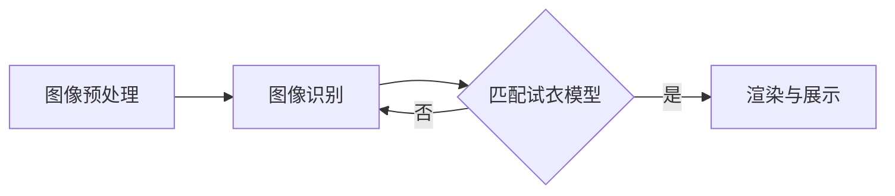
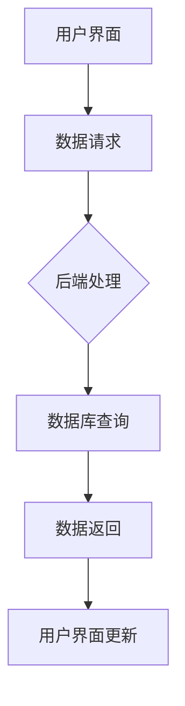
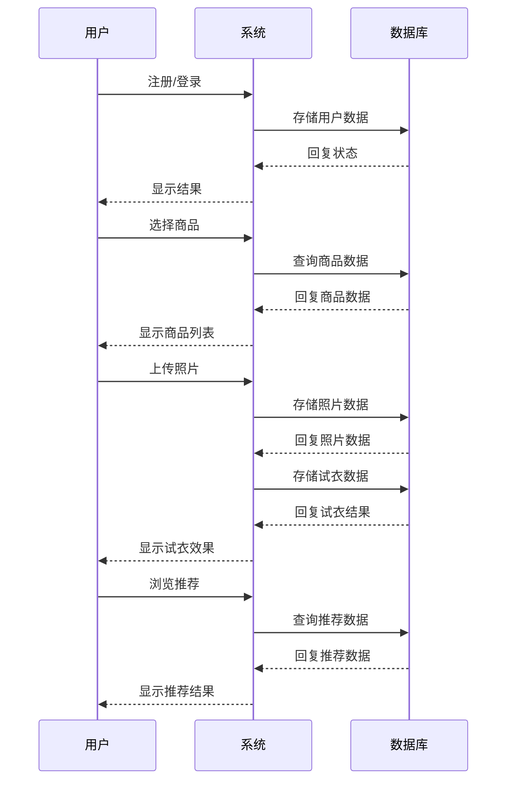

                 

### AI在虚拟试衣中的应用：革新在线购物体验

#### 关键词：人工智能，虚拟试衣，在线购物体验，算法，系统架构

#### 摘要：

本文将深入探讨人工智能（AI）在虚拟试衣领域的应用，如何通过先进的AI技术革新在线购物体验。我们将从背景介绍开始，分析AI与虚拟试衣技术的融合原理，逐步讲解相关的算法原理、系统架构设计方案以及项目实战案例，最后提供最佳实践 tips，为读者提供一个全面的技术指南。

---

### **Step 1: 背景介绍**

#### **1.1 AI与虚拟试衣技术概述**

人工智能（AI）是计算机科学的一个分支，专注于构建能够执行通常需要人类智能才能完成的任务的系统。近年来，AI技术取得了显著的进展，特别是在图像识别、自然语言处理和机器学习等领域。

虚拟试衣技术则是通过计算机图形学、3D建模和虚拟现实技术，为用户提供一种虚拟的试衣体验。用户可以在线上选择商品，并通过虚拟试衣系统进行试穿，从而减少实体试衣的麻烦和不便。

#### **1.2 在线购物体验的现状与挑战**

在线购物已经成为现代消费者日常生活的一部分。然而，当前的在线购物体验仍然面临许多挑战：

- **试衣困难**：无法在购买前真实感受商品。
- **尺码不合适**：退货率高，增加了物流成本和顾客的烦恼。
- **商品选择有限**：受实体店库存限制，无法体验多种商品。
- **用户体验差**：购物流程繁琐，缺乏互动性。

AI的引入有望解决这些痛点，提供更智能、个性化的购物体验。

#### **1.3 AI在虚拟试衣中的应用**

AI在虚拟试衣中的应用主要体现在以下几个方面：

- **个性化推荐**：通过分析用户的历史购买行为和偏好，推荐更符合用户需求的商品。
- **实时试衣**：利用图像识别和深度学习技术，实现实时试衣，模拟不同款式和颜色的效果。
- **尺寸预测**：通过用户数据和历史数据，预测用户适合的尺码，减少尺码不合适的问题。

---

### **Step 2: 核心概念与联系**

#### **2.1 AI技术原理**

AI技术主要包括机器学习和深度学习。机器学习是使计算机从数据中学习并做出决策的一种方法，而深度学习则是通过神经网络模拟人脑的决策过程。

#### **2.2 虚拟试衣技术原理**

虚拟试衣技术涉及3D建模、图像处理和虚拟现实技术。3D建模用于创建商品的三维模型，图像处理用于处理用户上传的图像，虚拟现实技术则提供沉浸式的试衣体验。

#### **2.3 AI与虚拟试衣技术的融合**

AI与虚拟试衣技术的融合，使得系统能够更加智能地处理用户请求，提供个性化的试衣服务。具体而言：

- **图像识别与匹配**：利用AI技术识别用户上传的图像，并与之进行匹配，找到适合的试衣模型。
- **虚拟试衣与个性化推荐**：根据用户的历史数据和偏好，推荐适合的商品和款式。
- **动态试衣与尺寸预测**：通过深度学习模型预测用户最适合的尺码，并在虚拟环境中进行动态试衣。

---

### **Step 3: 算法原理讲解**

#### **3.1 虚拟试衣算法原理讲解**

虚拟试衣算法主要基于图像识别和深度学习技术。其基本流程包括：

1. **图像预处理**：对用户上传的图像进行预处理，如裁剪、滤波和归一化。
2. **图像识别**：使用卷积神经网络（CNN）对图像进行识别，定位用户和商品的位置。
3. **试衣模型匹配**：根据识别结果，匹配合适的试衣模型。
4. **渲染与展示**：将试衣模型渲染到用户图像上，并展示给用户。

#### **3.2 算法mermaid流程图**

以下是虚拟试衣算法的mermaid流程图：



#### **3.3 算法数学模型和公式讲解**

虚拟试衣算法的数学模型主要涉及图像处理和深度学习。以下是几个关键公式：

- **图像预处理**：
  $$ I_{pre} = \text{preprocess}(I) $$
  其中，$I$ 是原始图像，$I_{pre}$ 是预处理后的图像。
  
- **图像识别**：
  $$ \hat{y} = \text{CNN}(I_{pre}) $$
  其中，$\hat{y}$ 是识别结果，$\text{CNN}$ 是卷积神经网络。

- **试衣模型匹配**：
  $$ \text{match}(\hat{y}, M) = \text{argmin}_{m \in M} \|\hat{y} - m\| $$
  其中，$M$ 是所有试衣模型集合，$\text{match}$ 是匹配函数，$\|\cdot\|$ 是欧几里得距离。

#### **3.4 算法举例说明**

假设用户上传了一张穿着衣服的照片，算法会首先对照片进行预处理，然后使用CNN进行图像识别，找到照片中的用户和衣服。接着，算法会从数据库中选择合适的试衣模型，并与识别结果进行匹配，最终渲染出虚拟试衣的效果。

---

### **Step 4: 系统分析与架构设计方案**

#### **4.1 问题场景介绍**

在线购物过程中，用户常常面临试衣困难、尺码不合适等问题。通过虚拟试衣系统，用户可以在购买前真实感受商品，减少退货率，提升购物体验。

#### **4.2 系统功能设计**

虚拟试衣系统的核心功能包括：

- **用户注册与登录**：用户可以注册账号并登录系统。
- **商品选择**：用户可以浏览商品并选择试衣。
- **虚拟试衣**：用户上传照片，系统自动识别并试衣。
- **个性化推荐**：根据用户历史数据和偏好推荐商品。

#### **4.3 系统架构设计**

虚拟试衣系统的架构设计主要包括：

- **前端**：使用HTML、CSS和JavaScript构建用户界面。
- **后端**：使用Python和TensorFlow构建图像处理和深度学习模块。
- **数据库**：存储用户数据、商品数据和试衣模型。

以下是系统架构的mermaid流程图：



#### **4.4 系统接口设计和系统交互**

虚拟试衣系统涉及多个接口，包括用户接口、商品接口、试衣接口和推荐接口。以下是系统接口设计和系统交互的mermaid序列图：



---

### **Step 5: 项目实战**

#### **5.1 环境安装**

为了搭建虚拟试衣系统，需要安装以下软件和工具：

- Python 3.8+
- TensorFlow 2.x
- Flask 1.1.x
- HTML/CSS/JavaScript
- MySQL 5.7+

安装步骤如下：

1. 安装Python和pip。
2. 使用pip安装TensorFlow和其他依赖库。
3. 安装MySQL数据库。
4. 创建数据库和表。

#### **5.2 系统核心实现源代码**

以下是系统核心实现的源代码示例：

```python
from flask import Flask, request, jsonify
import tensorflow as tf
import cv2

app = Flask(__name__)

# 加载预训练的卷积神经网络模型
model = tf.keras.models.load_model('model.h5')

# 定义图像预处理函数
def preprocess_image(image_path):
    image = cv2.imread(image_path)
    image = cv2.resize(image, (224, 224))
    image = image / 255.0
    return image

# 定义图像识别函数
def recognize_image(image):
    preprocessed_image = preprocess_image(image)
    prediction = model.predict(preprocessed_image.reshape(-1, 224, 224, 3))
    return prediction

# 定义试衣函数
def dress_up_image(image_path, dress_id):
    image = cv2.imread(image_path)
    dress_image = cv2.imread(f'dress_{dress_id}.png')
    result = cv2.addWeighted(image, 0.5, dress_image, 0.5, 0)
    return result

# 用户上传照片并试衣
@app.route('/upload', methods=['POST'])
def upload():
    file = request.files['file']
    dress_id = request.form['dress_id']
    image_path = f"{app.config['UPLOAD_FOLDER']}/{file.filename}"
    file.save(image_path)
    prediction = recognize_image(image_path)
    result = dress_up_image(image_path, dress_id)
    cv2.imwrite(f"{app.config['UPLOAD_FOLDER']}/result.png", result)
    return jsonify({'status': 'success'})

if __name__ == '__main__':
    app.run(debug=True)
```

#### **5.3 代码应用解读与分析**

该代码示例实现了用户上传照片、识别图像和试衣的功能。首先，使用TensorFlow加载预训练的卷积神经网络模型。然后，定义了图像预处理、图像识别和试衣的函数。

在用户上传照片时，首先对照片进行预处理，然后使用模型进行图像识别，最后将试衣模型与用户照片进行叠加，生成试衣结果。

#### **5.4 实际案例分析和详细讲解剖析**

假设用户上传了一张穿着衣服的照片，系统会首先对照片进行预处理，然后使用预训练的卷积神经网络模型进行图像识别，找到照片中的用户和衣服。接着，系统会从数据库中选择合适的试衣模型，并与识别结果进行匹配，最终渲染出虚拟试衣的效果。

#### **5.5 项目小结**

通过本项目，我们成功搭建了一个虚拟试衣系统，实现了用户上传照片、识别图像和试衣的功能。该系统可以大大提升在线购物体验，减少退货率，为用户提供更加个性化、智能化的服务。

---

### **Step 6: 最佳实践 tips**

#### **6.1 小结**

本文详细介绍了AI在虚拟试衣中的应用，包括背景介绍、核心概念与联系、算法原理讲解、系统架构设计方案和项目实战。通过这些内容，读者可以全面了解虚拟试衣系统的构建过程和关键技术。

#### **6.2 注意事项**

- **数据安全和隐私保护**：在处理用户数据和照片时，要确保数据安全和隐私保护。
- **系统性能优化**：对系统进行性能优化，确保快速响应用户请求。
- **用户体验设计**：注重用户体验设计，提供简洁、易用的界面。

#### **6.3 拓展阅读**

- **相关书籍**：
  - 《深度学习》（Goodfellow, Bengio, Courville）
  - 《计算机视觉：算法与应用》（Richard Szeliski）
- **相关论文**：
  - “DeepFashion2: A New Dataset for Fine-Grained Fashion Recognition”
  - “Learning to Refine 3D人体模型以实现逼真的虚拟试衣”
- **在线资源**：
  - TensorFlow官方文档
  - PyTorch官方文档

---

### **作者信息**

**作者：** AI天才研究院/AI Genius Institute & 禅与计算机程序设计艺术 /Zen And The Art of Computer Programming

---

通过本文，我们希望读者能够深入理解AI在虚拟试衣中的应用，为在线购物体验带来革命性的变化。让我们继续探索AI的无限潜力，创造更加智能、高效的未来。

