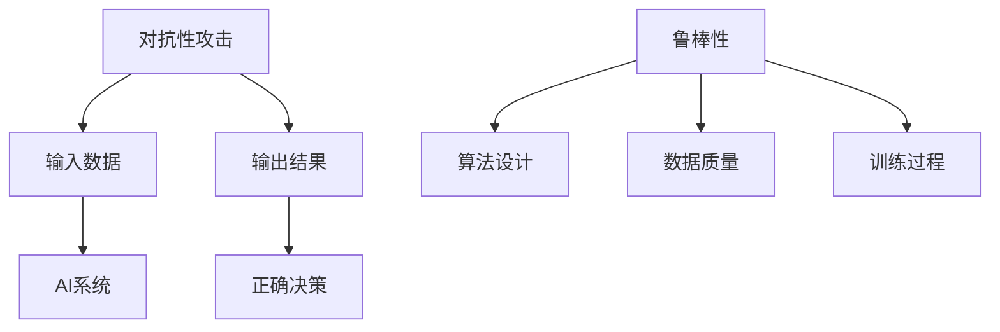

                 

# AI安全性测试：防范对抗性攻击的必要措施

## 关键词
- AI安全性测试
- 对抗性攻击
- 安全防护措施
- 安全测试工具
- 机器学习框架

## 摘要
本文旨在探讨人工智能（AI）系统面临的安全挑战，特别是对抗性攻击的问题。我们将详细分析AI安全性测试的重要性，介绍核心概念和测试方法，探讨现有的工具和技术，通过案例分析提供实践经验，并总结最佳实践和未来方向。文章将帮助读者理解AI安全性测试的必要性，并掌握防范对抗性攻击的基本策略。

## 引言

### AI安全性的重要性

随着人工智能技术的飞速发展，AI系统在各个领域的应用越来越广泛。然而，这一技术的普及也带来了新的安全挑战。AI系统在处理大量数据时，可能会因为恶意输入或不可预测的环境变化而表现出不稳定性，从而成为网络攻击的目标。特别是对抗性攻击（Adversarial Attack），它通过构造特定的输入数据来欺骗AI系统，使其输出错误的结果，成为了AI安全领域的一个重要课题。

### 对抗性攻击的定义与影响

对抗性攻击是指攻击者利用AI系统的漏洞，通过精心设计的输入来误导系统的决策过程。这些输入看似正常，但经过了细微的篡改，足以导致AI系统产生错误的输出。对抗性攻击的影响范围广泛，从自动驾驶汽车的路径规划到医疗诊断系统的判断，都可能因为攻击而导致严重的后果。

### AI安全性测试的必要性

为了防范对抗性攻击，对AI系统进行安全性测试成为了必不可少的一环。通过安全性测试，可以识别AI系统的潜在漏洞，评估其对抗性攻击的抵抗力，从而采取相应的防护措施。本文将详细探讨AI安全性测试的方法、工具和技术，帮助读者更好地理解和实施这一重要环节。

## 核心概念

### 定义

对抗性攻击（Adversarial Attack）
- 指攻击者通过构造特定的输入数据，欺骗AI系统，使其输出错误结果的行为。

鲁棒性（Robustness）
- 指AI系统在面临恶意输入时，仍能保持正确决策的能力。

漏洞（Vulnerability）
- 指AI系统在设计和实现过程中存在的可以被攻击者利用的弱点。

### 问题背景

随着AI系统在现实世界的应用越来越广泛，对抗性攻击的威胁也日益显著。攻击者可以利用AI系统的这一弱点，实施各种恶意行为，如网络钓鱼、操纵金融市场、篡改医疗诊断结果等。因此，确保AI系统的安全性已经成为一个亟待解决的问题。

### 问题描述

对抗性攻击通常通过以下几种方式实施：
1. **扰动攻击**：对输入数据进行微小的扰动，使其难以被检测到，但足以误导AI系统。
2. **渐变攻击**：通过改变输入数据的某些特征，逐渐引导AI系统的输出偏离正确结果。
3. **生成对抗网络（GAN）攻击**：利用生成对抗网络生成对抗性样本，欺骗AI系统。

### 问题解决

为了应对对抗性攻击，需要采取以下措施：
1. **增强鲁棒性**：通过改进AI算法，提高其对恶意输入的抵抗力。
2. **安全测试**：对AI系统进行全面的测试，识别和修复潜在漏洞。
3. **防御机制**：在AI系统中集成防御机制，如检测和过滤对抗性样本。

### 边界与外延

对抗性攻击不仅限于AI系统，还可能影响深度学习模型、神经网络和其他机器学习算法。此外，对抗性攻击的防范不仅仅依赖于技术手段，还需要在数据采集、模型设计和部署等环节进行全面考虑。

### 概念结构与核心要素组成

- **对抗性攻击**：输入数据、恶意样本、输出结果、欺骗行为。
- **鲁棒性**：算法设计、数据质量、训练过程。
- **漏洞**：系统架构、数据输入、算法实现。

## 核心概念与联系

### 核心概念原理

对抗性攻击和鲁棒性是AI安全性测试中的两个核心概念。对抗性攻击指的是攻击者利用AI系统的漏洞，通过构造特定的输入数据来欺骗AI系统，使其输出错误的结果。而鲁棒性则是指AI系统在面临恶意输入时，仍能保持正确决策的能力。

### 概念属性特征对比表格

| 特征       | 对抗性攻击           | 鲽性               |
| ---------- | ------------------- | ---------------- |
| 目的       | 欺骗AI系统输出错误结果 | 保证AI系统正确决策 |
| 攻击方式   | 输入数据扰动         | 算法改进、数据增强 |
| 重要性     | 防范恶意攻击         | 提高系统可靠性     |

### ER实体关系图架构

## AI安全性测试的方法

### 基本概念

AI安全性测试是指通过一系列方法对AI系统进行评估，以识别其潜在的安全漏洞和弱点。这些测试方法主要包括静态测试和动态测试。

### 静态测试

静态测试是指在AI系统运行之前，对代码、配置文件和设计文档等进行检查，以识别潜在的安全漏洞。静态测试的优点是不需要运行系统，可以快速发现一些明显的错误。常见的静态测试方法包括：

1. **代码审查**：由专家对代码进行审查，识别潜在的安全漏洞。
2. **静态代码分析**：使用工具对代码进行分析，识别可能的错误和漏洞。
3. **配置检查**：检查系统的配置文件，确保没有设置错误或安全隐患。

### 动态测试

动态测试是指在AI系统运行时，通过输入不同的数据，观察系统的行为，以识别潜在的安全漏洞。动态测试的优点是可以在实际运行环境中测试系统的表现。常见的动态测试方法包括：

1. **模糊测试**：通过输入大量随机数据，测试系统的稳定性和鲁棒性。
2. **黑盒测试**：仅测试系统的输入输出，不关心系统内部实现细节。
3. **白盒测试**：了解系统内部实现细节，通过代码路径分析来测试系统的稳定性。

### 综合测试方法

在实际的AI安全性测试中，通常需要结合静态测试和动态测试，以全面评估AI系统的安全性。以下是一个典型的AI安全性测试流程：

1. **需求分析**：明确测试目标，确定需要测试的功能和安全要求。
2. **测试计划**：制定详细的测试计划，包括测试方法、测试用例和测试时间表。
3. **静态测试**：对代码和配置文件进行检查，识别潜在的安全漏洞。
4. **动态测试**：通过输入不同的数据，观察系统的行为，测试其鲁棒性和稳定性。
5. **漏洞修复**：根据测试结果，修复系统中的漏洞。
6. **复测**：对修复后的系统进行复测，确保漏洞已被有效修复。
7. **报告**：撰写测试报告，总结测试结果和发现的问题。

### 小结

AI安全性测试是确保AI系统安全的重要环节。通过静态测试和动态测试，可以全面评估AI系统的安全性，识别和修复潜在的安全漏洞。在实际测试过程中，需要根据具体情况选择合适的测试方法，并确保测试结果的准确性和可靠性。

## 工具和技术

### 安全测试工具

在AI安全性测试中，使用合适的工具可以大大提高测试效率和准确性。以下是一些常用的AI安全性测试工具：

1. **PyTorch Adversarial Examples**：这是一个基于PyTorch的框架，用于生成对抗性样本。
2. ** Foolbox**：这是一个开源工具，用于评估深度学习模型的鲁棒性。
3. ** CleverHans**：这是一个用于攻击和防御深度学习模型的框架。
4. **AdvExample**：这是一个Python库，用于生成和评估对抗性样本。

### 机器学习框架

机器学习框架在AI安全性测试中起着重要作用，因为它们不仅用于训练模型，还可以用于生成和评估对抗性样本。以下是一些流行的机器学习框架：

1. **TensorFlow**：这是一个广泛使用的开源机器学习框架，支持多种深度学习模型。
2. **PyTorch**：这是一个动态计算图框架，以其灵活性和高效性而闻名。
3. **Scikit-learn**：这是一个基于Python的开源机器学习库，提供了多种算法和工具。
4. **Keras**：这是一个高层次的神经网络API，可以与TensorFlow和Theano等后端一起使用。

### 小结

使用合适的工具和技术是进行高效AI安全性测试的关键。通过使用专门的安全测试工具和流行的机器学习框架，可以更准确地识别和评估AI系统的安全性，从而采取相应的防护措施。

## 案例研究

### 案例一：自动驾驶汽车的安全测试

自动驾驶汽车是AI技术应用的一个典型例子。然而，由于AI系统在面对复杂环境时可能存在不确定性，自动驾驶汽车的安全问题备受关注。为了确保自动驾驶汽车的安全性，研究人员进行了一系列的安全测试。

#### 测试过程

1. **静态测试**：对自动驾驶汽车的代码和配置文件进行检查，识别潜在的安全漏洞。
2. **动态测试**：通过模拟不同的交通场景，测试自动驾驶汽车的决策能力和鲁棒性。
3. **对抗性攻击测试**：通过生成对抗性样本，如故意制造交通障碍物，测试自动驾驶汽车在面对恶意输入时的表现。

#### 测试结果

测试结果表明，自动驾驶汽车在大部分情况下能够正确处理复杂的交通场景，但在面对特定的对抗性样本时，存在一定的决策错误。例如，在测试中，当道路上有恶意放置的障碍物时，自动驾驶汽车有时会误判其行驶路径，导致行驶轨迹异常。

#### 评估与改进

根据测试结果，研究人员对自动驾驶汽车的算法进行了改进，增强了其对抗性攻击的抵抗力。具体措施包括：

1. **数据增强**：通过增加更多的对抗性样本进行训练，提高模型对恶意输入的识别能力。
2. **算法改进**：调整模型参数，优化决策过程，提高模型的鲁棒性。

#### 结论

自动驾驶汽车的安全测试案例表明，通过全面的安全测试和持续改进，可以提高AI系统的安全性。特别是在面对对抗性攻击时，需要采取有效的防护措施，以保障系统的稳定性和可靠性。

### 案例二：医疗诊断系统的安全性测试

医疗诊断系统在临床应用中具有重要意义，但其安全性直接关系到患者的健康。为了确保医疗诊断系统的安全性，研究人员对该系统进行了详细的安全测试。

#### 测试过程

1. **静态测试**：对医疗诊断系统的代码和配置文件进行检查，识别潜在的安全漏洞。
2. **动态测试**：通过输入不同类型的数据，测试系统的诊断准确性和鲁棒性。
3. **对抗性攻击测试**：生成对抗性样本，如故意篡改患者的诊断数据，测试系统在面对恶意输入时的表现。

#### 测试结果

测试结果显示，医疗诊断系统在面对正常数据时表现良好，但在面对特定的对抗性样本时，存在一定的误诊率。例如，在测试中，当患者的诊断数据被恶意篡改时，系统有时会给出错误的诊断结果。

#### 评估与改进

针对测试中发现的问题，研究人员对医疗诊断系统进行了改进：

1. **数据清洗**：对输入数据进行严格的清洗和验证，确保数据的真实性。
2. **算法优化**：通过优化模型参数和训练过程，提高系统的鲁棒性。
3. **安全防护**：在系统中集成安全防护机制，如身份验证和访问控制，防止恶意篡改数据。

#### 结论

医疗诊断系统的安全性测试案例表明，通过有效的安全测试和持续的改进，可以提高系统的安全性和可靠性。特别是在面对对抗性攻击时，需要采取综合性的防护措施，确保系统的稳定运行。

### 案例三：金融交易系统的安全性测试

金融交易系统在数据处理和决策过程中依赖于AI技术，但其安全性对金融市场的稳定至关重要。为了确保金融交易系统的安全性，研究人员对其进行了详细的安全测试。

#### 测试过程

1. **静态测试**：对金融交易系统的代码和配置文件进行检查，识别潜在的安全漏洞。
2. **动态测试**：通过模拟不同的市场行情，测试系统的交易决策能力和鲁棒性。
3. **对抗性攻击测试**：生成对抗性样本，如故意修改交易数据，测试系统在面对恶意输入时的表现。

#### 测试结果

测试结果显示，金融交易系统在大部分市场行情下能够做出正确的交易决策，但在面对特定的对抗性样本时，存在一定的错误决策。例如，当交易数据被恶意篡改时，系统有时会做出错误的买卖决策，导致金融损失。

#### 评估与改进

针对测试中发现的问题，研究人员对金融交易系统进行了改进：

1. **数据验证**：对输入数据进行严格的验证，确保数据的真实性和一致性。
2. **算法优化**：通过优化模型参数和交易策略，提高系统的鲁棒性。
3. **安全监控**：在系统中集成实时监控机制，及时发现和处理异常交易。

#### 结论

金融交易系统的安全性测试案例表明，通过全面的安全测试和持续的改进，可以提高系统的安全性和可靠性。特别是在面对对抗性攻击时，需要采取有效的防护措施，确保金融交易系统的稳定运行。

## 方法论与最佳实践

### 方法论

AI安全性测试的方法论包括以下几个关键步骤：

1. **需求分析**：明确测试目标，确定需要测试的功能和安全要求。
2. **测试计划**：制定详细的测试计划，包括测试方法、测试用例和测试时间表。
3. **静态测试**：对代码和配置文件进行检查，识别潜在的安全漏洞。
4. **动态测试**：通过输入不同的数据，观察系统的行为，测试其鲁棒性和稳定性。
5. **漏洞修复**：根据测试结果，修复系统中的漏洞。
6. **复测**：对修复后的系统进行复测，确保漏洞已被有效修复。
7. **报告**：撰写测试报告，总结测试结果和发现的问题。

### 最佳实践

为了确保AI安全性测试的有效性，以下是一些最佳实践：

1. **多层次的测试**：结合静态测试和动态测试，从多个角度评估系统的安全性。
2. **持续测试**：在AI系统的整个生命周期中，定期进行安全性测试，以识别和修复新出现的漏洞。
3. **数据增强**：在测试中引入更多的对抗性样本，以提高模型对恶意输入的识别能力。
4. **安全培训**：对开发人员和测试人员进行安全培训，提高他们对AI安全性的认识和应对能力。
5. **自动化测试**：使用自动化工具进行安全性测试，提高测试效率和准确性。

### 小结

AI安全性测试是确保AI系统安全性的关键环节。通过遵循方法论和最佳实践，可以全面评估AI系统的安全性，识别和修复潜在的安全漏洞，从而保障系统的稳定性和可靠性。

## 防御对抗性攻击的对策

### 对抗性攻击的防御措施

对抗性攻击的防御措施主要包括以下几个方面：

1. **输入验证**：在AI系统接收输入数据时，进行严格的验证和清洗，确保数据的真实性和一致性。
2. **对抗性样本训练**：在训练AI模型时，加入大量的对抗性样本，以提高模型对恶意输入的识别能力。
3. **动态防御**：在AI系统运行时，实时检测和过滤对抗性样本，防止其影响系统的决策过程。
4. **安全集成**：在AI系统中集成安全防护机制，如身份验证、访问控制和加密等，以防止数据篡改和未授权访问。

### 对抗性攻击的防御技术

1. **强化学习**：通过强化学习算法，使AI系统在面对对抗性攻击时能够自我学习和适应，提高其对抗性攻击的抵抗力。
2. **对抗性训练**：利用对抗性训练技术，在训练过程中引入对抗性样本，使模型对恶意输入具有更强的抵抗力。
3. **对抗性样本生成**：使用生成对抗网络（GAN）等技术，生成对抗性样本，用于训练和评估AI模型的鲁棒性。
4. **安全增强**：通过优化算法、改进模型设计和调整参数等手段，提高AI系统的鲁棒性和安全性。

### 小结

防御对抗性攻击是确保AI系统安全性的重要环节。通过采取一系列防御措施和技术，可以有效地提高AI系统对恶意输入的抵抗力，保障系统的稳定性和可靠性。

## 未来方向和挑战

### 未来发展趋势

随着AI技术的不断发展，AI安全性测试也在不断进步。未来，以下几个趋势值得关注：

1. **自动化测试**：自动化工具将更广泛地应用于AI安全性测试，提高测试效率和准确性。
2. **多模态测试**：除了传统的图像和文本数据，还将涉及音频、视频等多模态数据的测试。
3. **安全联盟**：AI系统开发者和安全专家将建立更紧密的合作关系，共同推动AI安全性测试技术的发展。

### 面临的挑战

尽管AI安全性测试在不断发展，但仍面临一些挑战：

1. **复杂性和多样性**：AI系统的复杂性和多样性使得安全性测试变得更加困难。
2. **数据隐私**：在测试过程中，如何保护用户数据隐私是一个亟待解决的问题。
3. **实时检测**：在实时环境中，如何快速检测和响应对抗性攻击是一个技术难题。

### 小结

未来，AI安全性测试将在自动化、多模态和实时检测等方面取得重大突破，但同时也需要应对复杂性和数据隐私等挑战。通过不断的技术创新和协作，有望实现更高效、更全面的AI安全性测试。

## 结论

AI安全性测试是确保AI系统安全性的关键环节。通过全面的安全测试和有效的防护措施，可以识别和修复潜在的安全漏洞，提高AI系统的鲁棒性和稳定性。本文详细介绍了AI安全性测试的核心概念、方法、工具和技术，并通过案例分析总结了实践经验。面对未来的挑战，我们需要不断探索和创新，以保障AI系统的安全性和可靠性。

## 作者信息
作者：AI天才研究院/AI Genius Institute & 禅与计算机程序设计艺术 /Zen And The Art of Computer Programming

## 拓展阅读

- **《人工智能安全：对抗性攻击与防御》**：本书详细介绍了对抗性攻击的原理和防御策略。
- **《机器学习安全》**：探讨了机器学习系统在安全性方面面临的挑战和解决方案。
- **《深度学习：保护你的系统》**：提供了针对深度学习系统的安全测试和防御方法。

通过阅读这些书籍，您可以深入了解AI安全性测试的各个方面，为自己的研究和实践提供更多参考。

