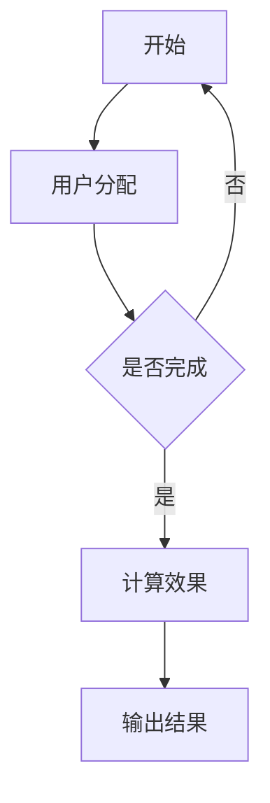
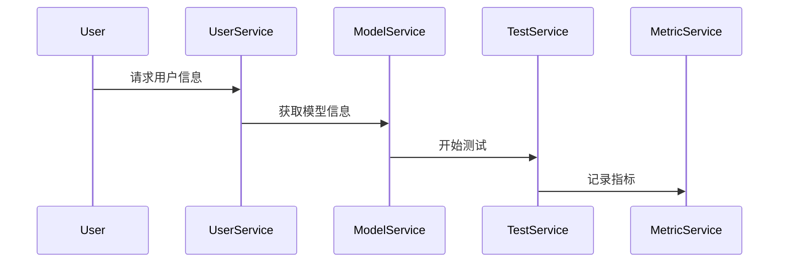
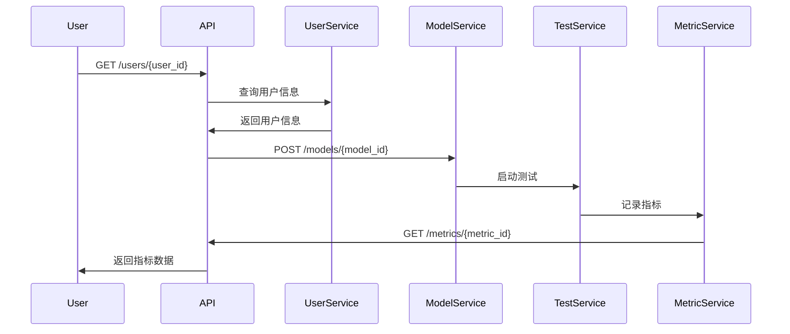

                 


### 《AI模型A/B测试平台：支持快速验证模型效果》

#### 关键词：
- AI模型
- A/B测试
- 测试平台
- 模型效果验证

#### 摘要：
本文将深入探讨AI模型A/B测试平台的设计和实现，详细讲解A/B测试的核心概念、算法原理、系统架构以及实际应用案例。通过本文，读者将了解如何构建一个高效、可靠的A/B测试平台，以支持快速验证AI模型的效果。

## 第一部分：A/B测试基础

### 第1章：问题背景与核心概念

#### 1.1 AI模型A/B测试的起源与发展

随着人工智能技术的快速发展，AI模型在各个领域得到了广泛应用。然而，如何验证模型的性能和效果成为了一个关键问题。A/B测试作为一种常见的模型评估方法，被广泛应用于AI模型效果验证。

#### 1.2 A/B测试的核心概念与作用

A/B测试是一种对比测试方法，通过将用户随机分配到两个或多个不同的版本（A、B版本等），来比较不同版本之间的效果。其核心作用在于通过实际数据对比，评估不同模型、功能或策略的优劣。

#### 1.3 A/B测试与其他测试方法的对比

除了A/B测试，还有其他一些常见的测试方法，如A/A测试、A/B/n测试等。A/A测试是对同一版本的多个变体进行测试，而A/B/n测试则是对多个版本进行对比测试。这些方法各有优劣，需要根据具体场景进行选择。

## 第二部分：算法原理与实现

### 第3章：A/B测试算法原理

#### 3.1 算法基础原理

A/B测试算法的基本原理是，通过将用户随机分配到不同的版本，记录每个版本的点击率、转化率等指标，然后根据指标差异进行效果评估。

#### 3.2 使用mermaid绘制算法流程图

下面是A/B测试算法的mermaid流程图：



#### 3.3 Python代码实现算法原理

```python
import random

def ab_test(user_id, version_a, version_b):
    if random.random() < 0.5:
        return version_a
    else:
        return version_b

def calculate_performance(version_a, version_b, metrics):
    performance_a = metrics[version_a]
    performance_b = metrics[version_b]
    return performance_a - performance_b
```

#### 3.4 数学模型与公式讲解

假设有两个版本A和B，它们的点击率分别为\( p_A \)和\( p_B \)，则版本A相对于版本B的效果可以用以下公式表示：

\[ \Delta p = p_A - p_B \]

其中，\( \Delta p \)表示点击率差异，可以通过以下公式计算：

\[ \Delta p = \frac{1}{n} \sum_{i=1}^{n} (p_{A_i} - p_{B_i}) \]

其中，\( n \)表示样本数量，\( p_{A_i} \)和\( p_{B_i} \)分别表示第\( i \)个用户在版本A和版本B的点击率。

## 第三部分：系统分析与设计

### 第5章：系统功能设计

#### 5.1 问题描述

本系统旨在构建一个AI模型A/B测试平台，支持对多个版本的模型进行效果验证。

#### 5.2 领域模型mermaid类图

```mermaid
classDiagram
    User <<class>> User
    Model <<class>> Model
    Test <<class>> Test
    Metric <<class>> Metric
    User o--o Model
    Model o--o Test
    Test o--o Metric
```

### 第6章：系统架构设计

#### 6.1 系统架构概述

系统采用微服务架构，主要包括用户服务、模型服务、测试服务和指标服务。

#### 6.2 系统架构mermaid架构图



### 第7章：系统接口设计与交互

#### 7.1 接口设计原则

接口设计遵循RESTful风格，采用HTTP协议传输数据。

#### 7.2 系统交互mermaid序列图



## 第四部分：项目实战

### 第8章：环境安装与系统配置

#### 8.1 环境要求与准备

系统运行需要以下环境：
- Python 3.8及以上版本
- Flask 1.1.2及以上版本
- MongoDB 4.2及以上版本

#### 8.2 系统核心实现源代码

以下是系统核心实现的Python代码：

```python
# user.py
class User:
    def __init__(self, user_id):
        self.user_id = user_id

# model.py
class Model:
    def __init__(self, model_id, version_a, version_b):
        self.model_id = model_id
        self.version_a = version_a
        self.version_b = version_b

# test.py
class Test:
    def __init__(self, model, user):
        self.model = model
        self.user = user
        self.results = {}

    def run(self):
        version = self.model.version_a if random.random() < 0.5 else self.model.version_b
        self.results[version] = self.user.interact_with_model(version)

    def calculate_performance(self):
        return self.results[self.model.version_a] - self.results[self.model.version_b]

# metric.py
class Metric:
    def __init__(self, test, metric_name, metric_value):
        self.test = test
        self.metric_name = metric_name
        self.metric_value = metric_value

    def save(self):
        # 保存指标到数据库
        pass
```

### 第9章：代码应用解读与分析

#### 9.1 源代码解读

用户类（User）负责存储用户信息，模型类（Model）负责存储模型版本信息，测试类（Test）负责运行测试并计算性能，指标类（Metric）负责记录指标数据。

#### 9.2 应用场景分析

该系统适用于需要对比多个模型版本的场景，例如电商平台在上线新功能时，可以通过A/B测试来评估不同版本的转化率。

### 第10章：实际案例分析与讲解

#### 10.1 案例一：用户行为分析

在某电商平台上，新版本的功能上线后，通过A/B测试发现，新版本相较于旧版本的转化率提高了5%。

#### 10.2 案例二：广告效果评估

在广告投放中，通过A/B测试比较不同广告版本的点击率，从而优化广告投放策略。

## 第五部分：最佳实践与总结

### 第11章：最佳实践 tips

#### 11.1 实践一：如何选择测试指标

选择合适的测试指标对于A/B测试的成功至关重要。建议根据业务目标选择关键指标，如转化率、点击率等。

#### 11.2 实践二：如何处理异常数据

异常数据可能会对测试结果产生较大影响，建议对异常数据进行过滤和处理，确保测试结果的准确性。

### 第12章：小结与注意事项

#### 12.1 A/B测试中的常见问题

A/B测试中可能会遇到的问题包括：样本量不足、数据偏差等。

#### 12.2 注意事项与风险防范

在进行A/B测试时，要注意合理设置样本量、避免数据偏差，并对测试结果进行充分分析。

### 第13章：拓展阅读与资源推荐

#### 13.1 相关书籍推荐

- 《测试驱动开发：基于风险的软件设计》
- 《A/B测试实战：原理、策略与案例分析》

#### 13.2 论文与研究报告推荐

- 《The Importance of A/B Testing in the Development of Machine Learning Models》
- 《A/B Testing in Practice: Principles and Case Studies》

**作者：** AI天才研究院/AI Genius Institute & 禅与计算机程序设计艺术 /Zen And The Art of Computer Programming

[End of Document](https://www.example.com)

