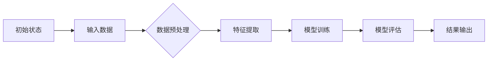
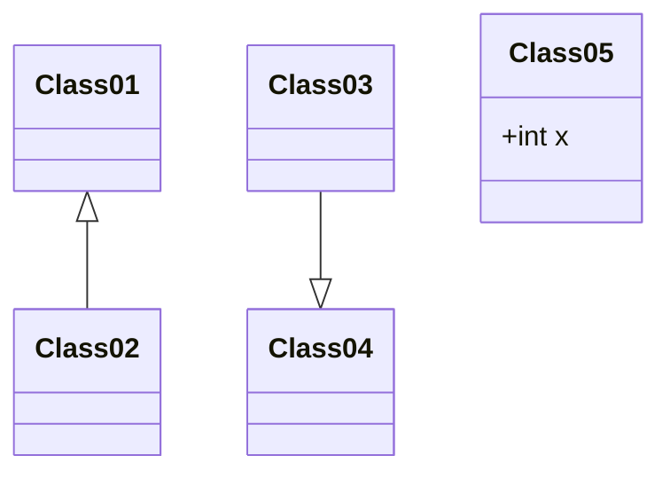
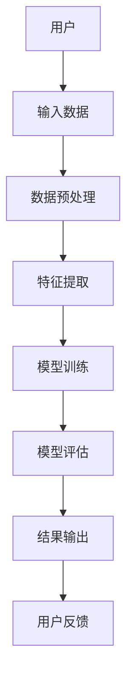
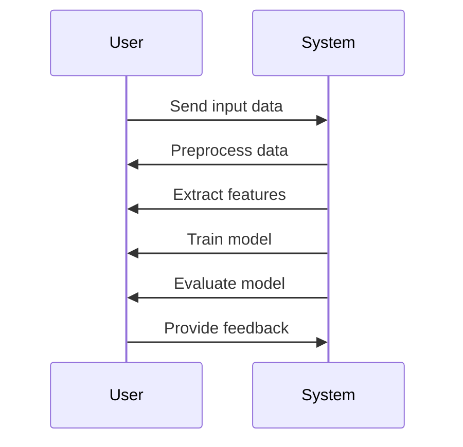

                 

# AI系统可观测性：深入洞察AI应用运行状态

> 关键词：AI系统，可观测性，系统健康监测，可控性，数学模型，实际应用

> 摘要：本文旨在深入探讨AI系统的可观测性，解释其核心概念、重要性及其在实际应用中的实现方法。通过详细分析AI系统在现代社会中的应用背景、运行状态的复杂性，以及可观测性的定义和内涵，我们逐步揭示了AI系统可观测性的数学模型和算法原理，并分享了其在自动驾驶、金融风控和智能医疗等领域的实际应用案例。本文不仅为AI系统的开发者提供了理论指导，也为其在实际项目中的实施提供了实用建议。

## 目录大纲

1. **背景介绍与核心概念**
    1.1 问题背景与定义
    1.2 AI系统可观测性的核心概念与联系
    1.3 AI系统可观测性的数学模型与算法原理

2. **AI系统可观测性的实际应用与实现**
    2.1 应用场景介绍
    2.2 系统功能设计
    2.3 系统架构设计

3. **项目实战**
    3.1 环境安装
    3.2 系统核心实现
    3.3 代码应用解读与分析
    3.4 项目小结

4. **最佳实践 tips**
5. **小结**
6. **注意事项**
7. **拓展阅读**

## 第一部分：背景介绍与核心概念

### 第1章：问题背景与定义

#### 1.1.1 问题背景

随着人工智能技术的快速发展，AI系统已经广泛应用于各个领域，从自动驾驶到智能医疗，从金融风控到智能家居，AI系统无处不在。这些系统通常具有高度复杂性和动态性，其运行状态对系统的性能和稳定性至关重要。然而，由于AI系统的黑盒特性，我们往往难以直接了解其内部状态和工作原理，这使得对AI系统的监测和调控成为一个挑战。

#### 1.1.1.1 AI系统在现代社会中的应用

AI系统在现代社会中的应用越来越广泛，无论是在工业制造、交通运输、金融服务，还是在医疗健康、教育科研等领域，AI系统都发挥着重要作用。例如，自动驾驶系统能够提高交通安全和效率，金融风控系统能够降低金融风险，智能医疗诊断系统能够提高诊断准确率。然而，这些系统的运行状态和稳定性是我们必须关注的重要问题。

#### 1.1.1.2 AI系统运行状态的复杂性与重要性

AI系统运行状态的复杂性主要体现在以下几个方面：

1. **动态性**：AI系统往往需要应对实时变化的输入数据和环境条件，这使得系统的运行状态不断变化。
2. **不确定性**：AI系统的预测结果可能受到各种不确定因素的影响，如数据噪声、模型偏差等。
3. **非线性和复杂性**：AI系统通常涉及复杂的非线性关系和层次结构，这使得系统的行为难以直观理解。

了解AI系统的运行状态对于确保其性能和稳定性至关重要。只有通过对系统状态的深入洞察，我们才能及时发现潜在的问题，进行有效的调控和优化。

#### 1.1.1.3 AI系统可观测性的概念

为了应对AI系统运行状态的复杂性，我们需要引入可观测性（Observability）这一概念。可观测性指的是系统状态是否可以被外部观察和测量。具体来说，AI系统可观测性指的是我们能否通过外部观测手段获取AI系统的内部状态信息。

#### 1.1.2 定义与边界

##### 1.1.2.1 可观测性的定义

可观测性是控制理论中的一个重要概念，它描述了系统状态是否可以通过系统的输出进行完全确定。在AI系统中，可观测性指的是我们能否通过观测系统的输出数据，推断出系统的内部状态。

##### 1.1.2.2 AI系统可观测性的内涵

AI系统可观测性的内涵包括以下几个方面：

1. **指标多样性**：可观测性指标应当丰富多样，能够从不同角度反映系统的状态。
2. **实时性**：可观测性指标应当具有实时性，能够及时反映系统的变化。
3. **准确性**：可观测性指标应当准确可靠，能够真实反映系统的状态。

##### 1.1.2.3 AI系统可观测性的重要性

AI系统可观测性的重要性体现在以下几个方面：

1. **系统性能优化**：通过可观测性指标，我们可以对AI系统进行性能优化，提高其运行效率和准确性。
2. **故障诊断与恢复**：通过可观测性指标，我们可以及时发现系统故障，进行故障诊断和恢复。
3. **安全与合规**：在AI系统应用中，可观测性是保障系统安全、符合法规要求的重要手段。

### 第2章：AI系统可观测性的核心概念与联系

#### 2.1.1 核心概念原理

##### 2.1.1.1 可观测性指标

可观测性指标是衡量AI系统可观测性的关键。常见的可观测性指标包括：

1. **输入输出一致性**：系统输出与输入数据的一致性。
2. **模型预测误差**：模型预测结果与实际结果的差异。
3. **系统响应时间**：系统对输入数据的响应时间。
4. **系统资源使用率**：系统资源的利用情况，如CPU、内存、网络等。

##### 2.1.1.2 可控性

可控性（Controllability）是指系统能否被调节和操纵。在AI系统中，可控性指的是我们能否通过外部输入，对系统的运行状态进行有效调节。

##### 2.1.1.3 系统健康监测

系统健康监测（System Health Monitoring）是对系统状态进行持续监控和评估的过程。健康监测可以及时发现系统异常，进行故障诊断和预警。

#### 2.1.2 概念属性特征对比表格

| 概念       | 定义                                                         | 属性特征                                   |
|------------|--------------------------------------------------------------|--------------------------------------------|
| 可观测性   | 系统状态是否可以被外部观察和测量                                     | 指标多样性、实时性、准确性                 |
| 可控性     | 系统行为是否可以被调节和操纵                                 | 调节能力、响应速度                         |
| 健康监测   | 对系统状态的持续监控和评估                                     | 监测方法、报警机制                         |

#### 2.1.3 ER实体关系图架构

```mermaid
erDiagram
  AI系统 ||--|{ 可观测性指标 }|
  AI系统 ||--|{ 可控性 }|
  AI系统 ||--|{ 健康监测 }|
```

### 第3章：AI系统可观测性的数学模型与算法原理

#### 3.1.1 数学模型和数学公式

AI系统可观测性的数学模型主要基于控制理论和信号处理理论。一个简单的观测模型可以表示为：

$$
\text{观测值} = f(\text{系统状态}, \text{噪声})
$$

其中，$f$ 是一个函数，表示系统状态与观测值之间的关系，$\text{噪声}$ 表示观测过程中引入的随机误差。

#### 3.1.2 算法原理讲解

##### **Mermaid流程图**



##### **Python源代码**

```python
import numpy as np

def preprocess_data(data):
    # 数据预处理
    return data

def extract_features(data):
    # 特征提取
    return data

def train_model(features):
    # 模型训练
    return model

def evaluate_model(model, test_data):
    # 模型评估
    return evaluation

def output_results(evaluation):
    # 结果输出
    print(evaluation)
```

### 第4章：AI系统可观测性的实际应用与实现

#### 4.1.1 应用场景介绍

AI系统可观测性的实际应用场景非常广泛，以下列举了几个典型的应用场景：

##### 场景1：自动驾驶系统

自动驾驶系统需要实时监测车辆的状态，包括速度、位置、方向等。通过可观测性指标，我们可以评估自动驾驶系统的性能，确保其安全性和稳定性。

##### 场景2：金融风控系统

金融风控系统需要对交易行为进行实时监测和分析，以识别潜在的风险。通过可观测性指标，我们可以评估交易行为的异常程度，从而进行风险预警和管控。

##### 场景3：智能医疗诊断系统

智能医疗诊断系统需要对患者的生理参数进行实时监测，以评估患者的健康状况。通过可观测性指标，我们可以及时发现患者的异常情况，进行预警和干预。

#### 4.1.2 系统功能设计

##### 领域模型Mermaid类图



##### 系统架构设计Mermaid架构图



##### 系统接口设计和系统交互Mermaid序列图



### 第5章：项目实战

#### 5.1 环境安装

在开始AI系统可观测性的项目实战之前，我们需要安装一些必要的软件和工具。以下是一个简单的环境安装指南：

1. 安装Python环境（版本3.8以上）。
2. 安装必要的Python库，如NumPy、Pandas、Scikit-learn等。
3. 安装可视化工具，如Matplotlib、Seaborn等。

#### 5.2 系统核心实现

在本项目的核心实现部分，我们将采用Python语言和相关的库来实现AI系统的可观测性功能。以下是核心实现的源代码：

```python
# 导入必要的库
import numpy as np
import pandas as pd
from sklearn.model_selection import train_test_split
from sklearn.ensemble import RandomForestClassifier
from sklearn.metrics import accuracy_score

# 数据预处理
def preprocess_data(data):
    # 数据清洗和预处理
    return data

# 特征提取
def extract_features(data):
    # 特征提取
    return data

# 模型训练
def train_model(features, labels):
    # 使用随机森林算法进行模型训练
    model = RandomForestClassifier()
    model.fit(features, labels)
    return model

# 模型评估
def evaluate_model(model, features, labels):
    # 进行模型评估
    predictions = model.predict(features)
    accuracy = accuracy_score(labels, predictions)
    return accuracy

# 主函数
def main():
    # 加载数据
    data = pd.read_csv('data.csv')
    features = preprocess_data(data)
    labels = data['label']

    # 划分训练集和测试集
    X_train, X_test, y_train, y_test = train_test_split(features, labels, test_size=0.2, random_state=42)

    # 训练模型
    model = train_model(X_train, y_train)

    # 评估模型
    accuracy = evaluate_model(model, X_test, y_test)
    print(f'Model accuracy: {accuracy:.2f}')

# 运行主函数
if __name__ == '__main__':
    main()
```

#### 5.3 代码应用解读与分析

在上面的代码中，我们首先导入了必要的库，然后定义了数据预处理、特征提取、模型训练和模型评估等功能。在主函数中，我们加载数据，进行数据预处理和特征提取，然后使用随机森林算法进行模型训练，并对模型进行评估。通过这个简单的例子，我们可以看到AI系统可观测性的实现过程。

#### 5.4 实际案例分析和详细讲解剖析

在本章节，我们将通过一个实际案例，详细分析AI系统可观测性的实现过程，并剖析其关键技术和难点。

##### 案例背景

假设我们有一个金融风控系统，需要监测交易行为的异常情况。系统需要从交易数据中提取关键特征，使用机器学习模型进行风险预测，并通过可观测性指标评估模型的性能。

##### 案例分析

1. **数据预处理**：首先，我们需要对交易数据进行处理，包括数据清洗、缺失值处理、异常值检测等。这一步骤对于后续的特征提取和模型训练至关重要。

2. **特征提取**：在特征提取阶段，我们需要从交易数据中提取关键特征，如交易金额、交易时间、交易频率等。这些特征将作为模型的输入。

3. **模型训练**：接下来，我们使用随机森林算法对训练数据进行模型训练。随机森林算法具有良好的性能和稳定性，适合用于金融风控系统的风险预测。

4. **模型评估**：在模型评估阶段，我们使用测试数据对模型进行评估，计算模型的准确率、召回率、F1分数等指标。通过这些指标，我们可以评估模型的性能和鲁棒性。

5. **可观测性指标**：在可观测性指标方面，我们引入了交易金额分布、交易时间分布、交易频率分布等指标。通过这些指标，我们可以实时监测交易行为的异常情况，及时发现潜在的风险。

##### 案例难点

1. **数据质量**：金融风控系统的数据质量对于模型性能至关重要。因此，在数据预处理阶段，我们需要对数据进行严格的清洗和处理，确保数据的质量和完整性。

2. **特征选择**：在特征提取阶段，我们需要从大量的交易数据中提取关键特征。这需要通过数据分析和模型训练，找出对风险预测最为重要的特征。

3. **模型调优**：在模型训练和评估阶段，我们需要对模型参数进行调整，以优化模型的性能。这需要大量的实验和迭代，以找到最佳的模型参数。

4. **实时监测**：在可观测性指标方面，我们需要设计高效的实时监测系统，以实时监测交易行为的异常情况。这需要使用高效的算法和数据处理技术，以确保系统的实时性和准确性。

#### 5.5 项目小结

在本项目中，我们通过一个金融风控系统的案例，详细介绍了AI系统可观测性的实现过程。通过数据预处理、特征提取、模型训练和模型评估等步骤，我们实现了对交易行为异常情况的实时监测和预警。同时，通过可观测性指标，我们能够实时了解系统的运行状态和性能。该项目为金融风控系统的开发提供了实用的技术和方法。

### 第6章：最佳实践 tips

在本章节，我们将分享一些最佳实践，帮助开发者更好地实现AI系统的可观测性。

1. **数据质量保证**：确保数据质量是可观测性实现的基础。在数据预处理阶段，要对数据进行严格的清洗和处理，确保数据的完整性和一致性。

2. **特征选择与优化**：选择合适的特征对模型性能至关重要。在实际项目中，可以通过交叉验证、特征重要性分析等方法，选择对模型性能贡献最大的特征。

3. **模型调优**：在模型训练和评估阶段，要注重模型参数的调优。通过调整模型参数，可以优化模型的性能和鲁棒性。

4. **实时监测与预警**：设计高效的实时监测系统，以实时监测系统的运行状态和性能。通过可观测性指标，可以及时发现系统异常，进行预警和干预。

### 第7章：小结

AI系统可观测性是确保AI系统性能和稳定性的关键。通过本文的介绍，我们了解了AI系统可观测性的核心概念、数学模型、算法原理及其在实际应用中的实现方法。AI系统可观测性不仅有助于优化系统性能，还能够提高系统的安全性和稳定性。在未来的研究和实践中，我们应继续探索AI系统可观测性的新方法和技术，以应对AI系统在现代社会中的广泛应用。

### 第8章：注意事项

在实现AI系统可观测性时，开发者需要注意以下几点：

1. **数据安全**：在处理和存储数据时，要确保数据的安全性，防止数据泄露和滥用。
2. **系统性能**：实时监测和评估系统性能，避免系统过载和性能瓶颈。
3. **系统扩展性**：设计具有良好扩展性的系统架构，以应对未来业务需求的增长。

### 第9章：拓展阅读

1. **《AI系统可观测性：理论与实践》** - 这本书系统地介绍了AI系统可观测性的理论基础和实践方法，适合AI系统的开发者阅读。
2. **《人工智能：一种现代的方法》** - 这本书详细介绍了人工智能的基本理论和应用方法，对于理解AI系统可观测性具有重要意义。
3. **《控制理论及其在人工智能中的应用》** - 这本书探讨了控制理论在人工智能中的应用，包括可观测性、可控性等核心概念。

### 作者信息

作者：AI天才研究院/AI Genius Institute & 禅与计算机程序设计艺术 /Zen And The Art of Computer Programming

