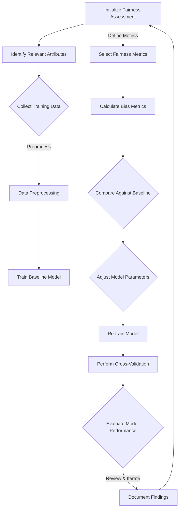
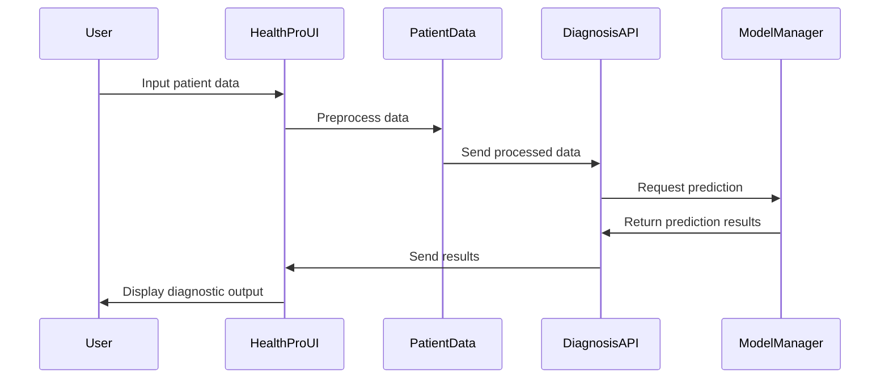

                 


### Introduction to AI Systems Fairness

#### What is AI System Fairness?

AI system fairness refers to the absence of unjust or discriminatory behavior in the decisions and predictions made by artificial intelligence systems. In essence, a fair AI system should treat all individuals equally, regardless of their race, gender, age, or any other protected characteristic. This means that the outcomes generated by the AI should not unfairly disadvantage or favor any particular group of people.

##### Background and Importance of AI Fairness

The concept of fairness in AI is not new, but its significance has gained traction with the increasing deployment of AI systems in critical sectors such as healthcare, finance, and law enforcement. Historically, AI fairness has been a concern since the early days of machine learning, where algorithms were trained on biased data, leading to discriminatory outcomes. However, with the growing awareness of these issues, researchers and developers are now actively working on designing fairer AI systems.

**Problem Definition and Description**

The problem of AI fairness can be defined as the extent to which AI systems are free from bias and discrimination. Bias in AI systems can manifest in various forms, including:

- **Algorithmic Bias**: This occurs when the AI system's decision-making process is influenced by biased patterns in the training data. For example, if a hiring algorithm is trained on historical data where only a small percentage of applicants were women, it may disproportionately favor male candidates.

- **Representational Bias**: This refers to the underrepresentation of certain groups in the training data, which can lead to biased decision-making. For instance, if an AI system designed for facial recognition is trained on a dataset with a majority of white faces, it may perform poorly on non-white faces.

- **Output Bias**: This occurs when the AI system's predictions or decisions inadvertently reinforce existing biases in the real world. For example, a loan approval system might unfairly deny loans to minority groups based on their socioeconomic status.

**The Need for Fairness in AI Systems**

Ensuring fairness in AI systems is crucial for several reasons:

- **Social Responsibility**: AI systems have the potential to influence important decisions in people's lives, such as employment, healthcare, and criminal justice. It is socially responsible to design these systems in a way that avoids discrimination.

- **Legal Compliance**: Many countries have laws and regulations that prohibit discrimination based on race, gender, age, and other protected characteristics. Ensuring AI fairness helps organizations avoid legal repercussions.

- **Trust and Acceptance**: Unfair AI systems can lead to a loss of trust in AI technology, which can hinder its adoption and development. Fairness is a key factor in building public trust in AI systems.

**Current Approaches and Shortcomings**

Despite the growing interest in AI fairness, there are still several challenges and limitations in the existing approaches:

- **Limited Metrics**: There is no universally agreed-upon metric for assessing AI fairness. Different metrics may focus on different aspects of fairness, leading to a lack of consistency.

- **Data Bias**: AI systems are only as good as the data they are trained on. Bias in the data can propagate into the AI system's decision-making, making it difficult to achieve fairness.

- **Complexity**: Fairness is a complex problem, and designing algorithms that achieve fairness can be technically challenging. Many existing methods focus on individual aspects of fairness without considering the overall system.

- **Impact on Performance**: Some fairness techniques may come at the cost of performance, leading to a trade-off between fairness and accuracy.

In conclusion, ensuring AI system fairness is a complex task that requires a comprehensive understanding of the underlying concepts, methodologies, and challenges. In the following sections, we will delve deeper into the core concepts of AI fairness, explore the principles and frameworks for assessing fairness, and discuss the various methodologies and techniques for ensuring model non-discrimination.

### Challenges in Ensuring AI Fairness

#### Bias in Data and Algorithms

One of the primary challenges in ensuring AI fairness is the presence of bias in both the data and the algorithms used to train AI systems. Data bias, often referred to as "training data bias," occurs when the data used to train an AI model reflects societal prejudices or discriminatory practices. This can lead to skewed outcomes where certain groups are unfairly favored or disadvantaged.

**Algorithmic Bias**

Algorithmic bias can arise from several sources, including the design of the AI model, the choice of features, and the training process. For example, a recommendation system designed to suggest products might inadvertently recommend products that are more popular among one demographic group over another. This could result in exclusion or preferential treatment based on factors like race, gender, or socioeconomic status.

**Examples of Bias**

- **Racial Bias**: A facial recognition system might have a higher error rate for individuals with darker skin tones, which can lead to wrongful identification or even arrests.

- **Gender Bias**: A hiring algorithm might disproportionately favor male candidates if the historical hiring data used for training predominantly features men.

- **Socioeconomic Bias**: A loan approval system might be more likely to deny loans to individuals from lower-income backgrounds if the training data includes a disproportionate number of loan denials for such groups.

#### Consequences of Unfair AI Systems

The consequences of unfair AI systems can be profound and far-reaching. They can perpetuate existing social inequalities and lead to tangible harm for marginalized groups. Here are some of the potential impacts:

- **Marginalization**: Unfair AI systems can reinforce existing biases and inequalities, further marginalizing vulnerable groups.

- **Legal Challenges**: Organizations using biased AI systems may face legal challenges and penalties for discriminatory practices.

- **Loss of Trust**: Public trust in AI technology can be eroded if people perceive that AI systems are biased or unfair. This can hinder the adoption and development of AI solutions.

- **Economic Disparities**: Unfair AI systems can contribute to economic disparities by, for example, disproportionately denying loans to certain groups, limiting their access to financial resources.

#### Current Approaches and Shortcomings

Several approaches have been proposed to address AI fairness, but each comes with its own set of challenges:

- **Fairness Metrics**: Developing metrics to measure fairness is a crucial step. However, there is no consensus on which metrics are most appropriate or how to balance different fairness goals. Common metrics include demographic parity, equalized odds, and calibration.

- **Bias Detection Tools**: Tools for detecting and mitigating bias in AI models have been developed, but they often require significant manual effort and may not be effective in all scenarios.

- **Algorithmic Transparency**: Increasing the transparency of AI algorithms can help identify and address biases. However, this requires making the inner workings of complex models more understandable to non-experts.

- **Diverse Training Data**: Using diverse and representative datasets can help reduce bias. However, collecting and curating such data can be difficult and time-consuming.

In conclusion, while significant progress has been made in understanding and addressing AI fairness, there are still many challenges to overcome. Ensuring fairness in AI systems requires a multi-faceted approach that considers the biases inherent in data and algorithms and addresses them through a combination of technical and societal measures.

### Boundaries and Scope

#### Definition of Fairness in AI

Fairness in AI is a multifaceted concept that encompasses several dimensions. At its core, fairness refers to the absence of unjust or discriminatory behavior in AI systems' decision-making processes. This means that AI systems should treat individuals equally and impartially, regardless of their personal characteristics, such as race, gender, age, or socioeconomic status.

**Core Elements of Fairness in AI**

1. **Equal Opportunity**: AI systems should provide equal opportunities to all individuals, ensuring that no group is systematically disadvantaged or privileged.
   
2. **Equal Treatment**: This principle asserts that individuals should receive the same level of consideration and respect from AI systems, regardless of their background.

3. **Outcome Fairness**: This dimension focuses on the outcomes produced by AI systems. Fair outcomes mean that the system should not disproportionately benefit or harm any particular group.

**Conceptual Framework for Fairness Assessment**

A comprehensive framework for assessing AI fairness can help organizations understand and address the various aspects of fairness. This framework typically includes several components:

- **Identifying Fairness Attributes**: This involves defining the attributes that are relevant to fairness, such as race, gender, age, socioeconomic status, etc.

- **Measuring Bias**: Developing metrics to quantify bias in AI systems is crucial. Common metrics include statistical parity, equalized odds, and calibration.

- **Analyzing Impact**: Evaluating the impact of AI systems on different groups to identify any disproportionate benefits or harms.

- **Mitigating Bias**: Applying techniques and algorithms to reduce or eliminate bias in AI systems, such as re-sampling, re-weighting, and adversarial debiasing.

**Boundaries of Fairness**

While the concept of fairness in AI is essential, it is also important to recognize its boundaries. Fairness is not a binary concept; it involves a spectrum of considerations. Here are some of the boundaries and limitations:

- **Practical Constraints**: Achieving perfect fairness may not always be feasible due to technical limitations, computational constraints, or the complexity of real-world data.

- **Contextual Differences**: What is considered fair in one context may not be appropriate in another. For example, a hiring algorithm designed for a highly competitive industry might need to prioritize certain attributes like experience over others.

- **Trade-offs**: There may be trade-offs between fairness and other objectives like accuracy or efficiency. Balancing these objectives is a critical aspect of AI fairness.

**Future Directions**

As AI continues to evolve, the understanding of fairness will also need to advance. Future research should focus on developing more sophisticated models and metrics for assessing fairness, as well as exploring new techniques for mitigating bias. Additionally, there is a need for more interdisciplinary collaboration between computer scientists, sociologists, ethicists, and other stakeholders to address the complex challenges of AI fairness.

In conclusion, fairness in AI is a critical and nuanced concept that requires careful consideration and continuous effort to achieve. By establishing a clear conceptual framework and recognizing the boundaries and limitations, we can make meaningful progress towards creating more equitable AI systems.

### Core Concepts and Principles

#### Key Principles of Fairness in AI

The concept of fairness in AI is grounded in several core principles that guide the design, assessment, and implementation of fair AI systems. These principles serve as foundational pillars in ensuring that AI systems treat all individuals impartially and without discrimination.

**Concept of Fairness in AI**

Fairness in AI refers to the idea that AI systems should make decisions that are unbiased and equitable. It involves several key aspects:

1. **Impartiality**: AI systems should be neutral and not show favoritism towards any particular group.
2. **Transparency**: Users should be able to understand how and why AI systems make certain decisions, fostering trust and accountability.
3. **Accountability**: Developers and operators of AI systems should be held responsible for the fairness of their systems and any discriminatory outcomes.

**Attribute Importance and Balance**

To achieve fairness, it is essential to consider the importance and balance of different attributes in the AI system's decision-making process. Attributes are the characteristics or features used to make predictions or decisions. For example, in a hiring algorithm, attributes might include race, gender, age, education, and work experience.

**Types of Bias and Their Implications**

Understanding the different types of bias is crucial for designing fair AI systems. Here are some common types of bias:

1. **Representation Bias**: This occurs when certain groups are underrepresented or overrepresented in the training data, leading to biased outcomes. For instance, if the training data for a facial recognition system consists mainly of white faces, the system may perform poorly on non-white faces.

2. **Algorithmic Bias**: This type of bias arises from the design and training of the AI algorithm. It can be introduced through feature selection, model architecture, or training data preprocessing. For example, a hiring algorithm might unfairly favor candidates with similar backgrounds to those in the training data.

3. **Socioeconomic Bias**: This bias can result from the socio-economic context in which the AI system operates. For instance, a loan approval system might unfairly deny loans to individuals from lower-income backgrounds due to their credit history or socioeconomic status.

**Mitigating Bias**

To address these biases, several techniques can be applied:

1. **Diverse Training Data**: Ensuring that the training data is diverse and representative of all groups can help mitigate representation bias.
2. **Algorithmic Adjustments**: Adjusting the algorithm's parameters or using techniques like re-weighting or re-sampling can help reduce algorithmic bias.
3. **Fairness Metrics**: Developing and applying fairness metrics to assess the system's performance across different groups can help identify and address biases.

**Example of Attribute Importance and Balance**

Consider a loan approval system. Key attributes might include credit score, income level, employment history, and debt-to-income ratio. To ensure fairness, it is important to balance these attributes appropriately. For instance, a system that overly emphasizes credit score might disadvantage individuals with lower incomes or those who have not traditionally used credit.

**Conceptual Framework for Fairness Assessment**

A comprehensive framework for assessing AI fairness typically includes the following components:

1. **Identifying Fairness Attributes**: Define the attributes relevant to the AI system's decision-making process.
2. **Measuring Bias**: Develop metrics to quantify bias, such as statistical parity or equalized odds.
3. **Analyzing Impact**: Evaluate the system's impact on different groups to identify any disproportionate benefits or harms.
4. **Mitigating Bias**: Apply techniques to reduce or eliminate bias, and continually monitor and update the system to ensure ongoing fairness.

In conclusion, the principles of fairness in AI are essential for creating systems that treat all individuals impartially. By understanding and addressing the various types of bias and applying a comprehensive assessment framework, developers can design and implement fair AI systems that promote equity and trust.

### Conceptual Framework for Fairness Assessment

The assessment of AI system fairness requires a structured approach that ensures a thorough understanding of the system's attributes, biases, and impacts on different groups. A conceptual framework for fairness assessment provides a systematic method to identify, measure, and mitigate biases within AI systems. This section outlines the key components of such a framework.

#### Identifying Fairness Attributes

The first step in assessing AI fairness is to identify the attributes that are relevant to the decision-making process of the AI system. Attributes are the characteristics or features that the system uses to make predictions or decisions. These attributes can be categorized into three main types:

1. **Protected Attributes**: These are attributes that are protected by law or ethical considerations, such as race, gender, age, and socioeconomic status. They are important because any bias related to these attributes can lead to legal and ethical violations.
2. **Predictive Attributes**: These are the attributes that the AI system uses to make predictions or decisions. For example, in a loan approval system, predictive attributes might include credit score, income, and debt-to-income ratio.
3. **Contextual Attributes**: These attributes are used to provide additional context that may affect the decision but are not directly related to the protected attributes. For example, in a healthcare recommendation system, contextual attributes might include patient history and location.

To identify these attributes, one can start by examining the dataset used to train the AI model and the specific domain in which the AI system operates. This step is crucial for ensuring that all relevant attributes are considered in the fairness assessment.

#### Measuring Bias

Once the relevant attributes are identified, the next step is to measure the bias within the AI system. Bias measurement involves quantifying the extent to which the system's decisions or predictions favor or disadvantage certain groups based on protected attributes. Several metrics can be used to measure bias:

1. **Statistical Parity**: This metric assesses whether the proportion of positive outcomes (e.g., loan approvals) is the same across different groups. For example, if 50% of loan approvals are given to men and 50% to women, statistical parity is achieved.
2. **Equalized Odds**: This metric measures whether the probability of a positive outcome is the same for all groups, given a specific input. For example, the probability of a loan approval should be the same for men and women, regardless of their credit score.
3. **Calibration**: This metric assesses how well the probabilities assigned by the AI system match the actual outcomes. A well-calibrated system should have probabilities that accurately reflect the likelihood of a positive outcome.

These metrics can be calculated using various statistical methods and tools. For instance, to measure statistical parity, one can use contingency tables and Chi-square tests. Equalized odds can be evaluated using logistic regression models, and calibration can be assessed using reliability charts.

#### Analyzing Impact

After measuring the bias, the next step is to analyze the impact of the AI system on different groups. This involves evaluating the consequences of the system's decisions on various demographic groups. Key questions to consider during this analysis include:

1. **Disproportionate Outcomes**: Are certain groups disproportionately affected by the AI system's decisions? For example, are loans more likely to be denied to certain racial or socioeconomic groups?
2. **Indirect Impacts**: Are there any indirect impacts of the AI system's decisions on specific groups? For example, if a recommendation system disproportionately recommends certain products to one group, it might lead to economic disparities.
3. **Long-Term Impacts**: What are the long-term consequences of the AI system's decisions? For example, if a hiring algorithm consistently favors a specific demographic group, it might lead to a lack of diversity in the workforce.

To perform this analysis, one can use techniques such as stratified sampling and regression analysis. By examining the system's decisions across different groups, it is possible to identify any disproportionate impacts and understand the potential consequences.

#### Mitigating Bias

Once the bias and impacts are identified, the next step is to mitigate the bias within the AI system. There are several techniques that can be applied to reduce or eliminate bias:

1. **Diverse Training Data**: Ensuring that the training data is diverse and representative of all groups can help mitigate representation bias. This involves collecting and curating datasets that include a wide range of individuals and attributes.
2. **Algorithmic Adjustments**: Adjusting the algorithm's parameters or using techniques like re-weighting or re-sampling can help reduce algorithmic bias. For example, re-weighting can be used to give more importance to underrepresented groups during the training process.
3. **Fairness Metrics**: Applying fairness metrics during the development and testing phases can help identify and address biases. For instance, using equalized odds during model training can ensure that the system treats different groups equally.
4. **Continuous Monitoring**: Ongoing monitoring of the AI system is essential to ensure that fairness is maintained over time. This involves periodically re-evaluating the system's performance and adjusting the techniques as needed.

#### Continuous Improvement

Fairness assessment is an iterative process that requires continuous improvement. As new data becomes available and as societal norms and laws evolve, the fairness of AI systems may need to be re-evaluated and adjusted. Developers should adopt a proactive approach to ensure that their systems remain fair and equitable over time.

In conclusion, the conceptual framework for fairness assessment provides a structured approach to identify, measure, and mitigate bias in AI systems. By following this framework, organizations can design and implement fair AI systems that treat all individuals impartially and promote social equity.

### Mermaid Flowchart of Fairness Assessment Methods

To provide a clear and visual representation of the fairness assessment methods, we will use the Mermaid diagramming language to create a flowchart that outlines the key steps and techniques involved. This flowchart will serve as a comprehensive guide for understanding the process of assessing and ensuring the fairness of AI systems.



**Explanation of the Flowchart**

- **A. Initialize Fairness Assessment**: This is the starting point where the assessment process is initiated. It involves setting the objectives and scope of the assessment.
  
- **B. Identify Relevant Attributes**: This step involves identifying the attributes that are relevant to the AI system's decision-making process. These attributes can be protected attributes (e.g., race, gender), predictive attributes (e.g., credit score), and contextual attributes (e.g., patient history).

- **C. Collect Training Data**: Data collection is a crucial step that involves gathering the necessary data to train the AI model. This data should be diverse and representative of the population the AI system will be deployed on.

- **D. Data Preprocessing**: Preprocessing the collected data is essential to ensure its quality and suitability for training. This may include cleaning the data, handling missing values, and normalizing the features.

- **E. Train Baseline Model**: A baseline model is trained using the preprocessed data. This model will serve as a reference point for comparison later in the assessment process.

- **F. Define Metrics**: Selecting appropriate fairness metrics is critical for evaluating the fairness of the AI system. Common metrics include statistical parity, equalized odds, and calibration.

- **G. Calculate Bias Metrics**: Using the selected metrics, bias calculations are performed to quantify the extent of bias in the model's predictions. These calculations provide a quantitative measure of how the model performs across different demographic groups.

- **H. Compare Against Baseline**: The calculated bias metrics are compared against the performance of the baseline model to identify any deviations from fairness. This step helps to highlight areas where the model may exhibit bias.

- **I. Adjust Model Parameters**: Based on the comparison, adjustments are made to the model's parameters or training data to reduce or eliminate the identified biases. Techniques such as re-sampling, re-weighting, or adversarial debiasing may be applied.

- **J. Re-train Model**: The adjusted model is re-trained using the modified data or parameters to address the identified biases.

- **K. Perform Cross-Validation**: Cross-validation is performed to ensure that the adjusted model's performance is consistent and not overfit to the training data. This step helps validate the effectiveness of the bias mitigation techniques.

- **L. Evaluate Model Performance**: The final model's performance is evaluated across different groups to ensure that the bias has been adequately addressed. This evaluation involves calculating the updated fairness metrics.

- **M. Document Findings**: The findings of the assessment process are documented, including the methods used, the results obtained, and any recommendations for further improvements.

- **Review & Iterate**: The documented findings are reviewed, and the process may be iterated if necessary. Continuous improvement and monitoring are essential to maintain the fairness of the AI system over time.

In conclusion, the Mermaid flowchart provides a structured and visual representation of the fairness assessment methods for AI systems. By following this flowchart, organizations can systematically assess and ensure the fairness of their AI systems, promoting equity and trust in the technology they deploy.

### Data Preparation for Fairness Analysis

#### Data Collection and Sources

The foundation of any fairness analysis in AI systems is the quality and representativeness of the data used to train and evaluate the models. Data collection is a critical step that requires careful planning and execution to ensure that the dataset is comprehensive and unbiased. Key considerations include:

- **Diverse and Representative Samples**: It is essential to collect data that is diverse and representative of the population the AI system will serve. This includes ensuring that the dataset includes individuals from different demographic groups, such as race, gender, age, and socioeconomic status. A lack of diversity can lead to biased models that do not generalize well to all users.

- **Data Sources**: Data can be collected from various sources, including public datasets, proprietary datasets owned by the organization, and external datasets from trusted partners. Public datasets like the UCI Machine Learning Repository can be a valuable source of diverse data. However, it is important to verify the quality and provenance of all datasets to avoid potential biases.

- **Data Accessibility**: Ensuring that the data is easily accessible and can be efficiently processed is crucial. Large datasets may require specialized tools and infrastructure for storage and retrieval.

#### Data Preprocessing Techniques

Once the data is collected, preprocessing is necessary to prepare it for training and evaluation. Data preprocessing techniques include:

- **Data Cleaning**: This involves removing or correcting any errors, inconsistencies, or missing values in the dataset. Data cleaning ensures that the data used for training is of high quality and reliable.

- **Normalization**: Features in the dataset may need to be normalized to a common scale to ensure that no single feature dominates the model's learning process. This can be achieved through methods like min-max scaling or z-score normalization.

- **Feature Engineering**: Creating new features from the existing data can enhance the model's ability to capture the underlying patterns. Feature engineering involves techniques like one-hot encoding for categorical variables and polynomial features for numerical variables.

- **Handling Imbalance**: Addressing class imbalance in the dataset is crucial to avoid biased models. Techniques such as oversampling the minority class, undersampling the majority class, or using synthetic data generation methods like SMOTE (Synthetic Minority Over-sampling Technique) can help balance the dataset.

#### Ensuring Data Quality for Fairness

Ensuring data quality is vital for conducting a fair analysis. Here are some strategies to ensure data quality:

- **Data Verification**: Verifying the accuracy and completeness of the data is essential. This can be done through data audits, where datasets are reviewed for anomalies or inconsistencies.

- **Bias Detection**: Techniques like bias detection algorithms can be used to identify and mitigate biases in the dataset. These algorithms can help identify patterns that may indicate biased data.

- **Data Documentation**: Documenting the data collection and preprocessing steps is important for transparency and reproducibility. This documentation should include information on the data sources, preprocessing techniques, and any adjustments made to the data.

- **Continuous Monitoring**: Ongoing monitoring of the data quality is necessary to ensure that the dataset remains representative and unbiased over time. This involves periodically re-evaluating the dataset and making adjustments as needed.

By following these data preparation techniques, organizations can lay a strong foundation for their fairness analysis, ensuring that their AI systems are robust, fair, and equitable.

### Algorithm Design and Implementation

#### Overview of Bias Mitigation Algorithms

Bias mitigation algorithms are crucial tools in the quest to design fair AI systems. These algorithms aim to identify and correct biases present in AI models by adjusting either the training data or the model's parameters. Here, we will discuss some of the most commonly used algorithms for bias mitigation:

**1. Re-Sampling Techniques**

Re-sampling techniques are used to address class imbalance in the training data. They involve either oversampling the minority class to match the majority class or undersampling the majority class to balance the dataset. Common methods include:

- **Oversampling**: Techniques such as Synthetic Minority Over-sampling Technique (SMOTE) generate synthetic samples for the minority class by interpolating between existing samples.
- **Undersampling**: This approach involves removing samples from the majority class to balance the dataset. Methods include random undersampling and cluster-based undersampling.

**2. Re-Weighting Techniques**

Re-weighting techniques adjust the influence of each sample in the training data based on its relevance or rarity. The goal is to give more importance to underrepresented groups in the model's learning process. Common methods include:

- **Instance Re-weighting**: This method adjusts the weights of individual samples based on their similarity to other samples. Samples that are more representative of the underrepresented group are given higher weights.
- **Class Re-weighting**: This technique adjusts the weights of entire classes based on their prevalence in the dataset. Underrepresented classes are given higher weights to encourage the model to focus on them.

**3. Adversarial Debiasing**

Adversarial debiasing algorithms aim to identify and eliminate biases in the model by learning a bias-correcting function that is applied to the predictions. This method involves training a secondary model, called the debiasing model, which learns to counteract the bias of the primary model. Common approaches include:

- **Algorithmic Fairness Matrix (AFM)**: AFM uses a matrix factorization technique to decompose the bias in the model's predictions into component parts and then corrects each part.
- **fairlearn**: This is an open-source library that provides tools for adversarial debiasing, including algorithms like Orthogonal Calibration (Oc) and Bias Remover (BR).

**4. Transfer Learning**

Transfer learning involves using a pre-trained model on a large and diverse dataset and then fine-tuning it on a specific task or domain. This approach can help reduce biases present in the target dataset by leveraging a model that has already been trained on a more balanced dataset. For example, using a pre-trained language model on a domain-specific corpus can improve fairness without requiring a large, balanced dataset for training.

**5. Unsupervised Bias Detection**

Unsupervised bias detection methods identify biases in the model without the need for labeled data. These methods are particularly useful when labeled data is scarce or expensive to obtain. Common techniques include:

- **Correlation Analysis**: This method measures the correlation between model predictions and protected attributes. High correlations may indicate bias.
- **Confidence Intervals**: By calculating confidence intervals around model predictions, it is possible to identify when the model's predictions deviate significantly from expected values, potentially indicating bias.

In summary, bias mitigation algorithms provide a comprehensive toolkit for addressing the challenges of bias in AI systems. By employing these techniques, developers can work towards creating fairer and more equitable AI systems that treat all individuals impartially. The following sections will delve deeper into specific algorithm designs and their implementations, providing detailed explanations and practical examples.

### Algorithm Design and Implementation

#### Detailed Explanation of Bias Mitigation Algorithms

In this section, we will delve into the design and implementation of several bias mitigation algorithms, providing detailed explanations of their principles, steps, and real-world applications.

#### 1. SMOTE (Synthetic Minority Over-sampling Technique)

**Principle**: SMOTE is an oversampling technique that generates synthetic samples for the minority class to balance the class distribution. It does this by selecting minority class instances and creating new samples by interpolating between them.

**Steps**:
1. **Select Minority Instances**: Randomly select minority class instances.
2. **Generate Synthetic Samples**: For each selected minority instance, randomly choose another minority instance. Then, interpolate between these two instances along each feature dimension to generate new synthetic samples.
3. **Replace Minority Samples**: Replace some minority instances in the training set with the newly generated synthetic samples.

**Python Implementation**:
```python
from imblearn.over_sampling import SMOTE
from sklearn.datasets import make_classification
from sklearn.model_selection import train_test_split

# Generate a binary classification dataset
X, y = make_classification(n_samples=1000, n_features=20, n_informative=2, n_redundant=10,
                           n_clusters_per_class=1, weights=[0.99], flip_y=0, random_state=1)

# Split the dataset into training and testing sets
X_train, X_test, y_train, y_test = train_test_split(X, y, test_size=0.3, random_state=1)

# Apply SMOTE to balance the training data
smote = SMOTE(random_state=1)
X_train_smote, y_train_smote = smote.fit_resample(X_train, y_train)

# Train a classifier on the balanced training data
from sklearn.linear_model import LogisticRegression
classifier = LogisticRegression()
classifier.fit(X_train_smote, y_train_smote)

# Evaluate the classifier on the test data
accuracy = classifier.score(X_test, y_test)
print("Accuracy on test data:", accuracy)
```

**Example**:
Consider a binary classification problem with a dataset where 90% of the samples belong to class A and 10% to class B. After applying SMOTE, the training data will have a more balanced class distribution, helping the model to learn patterns from both classes effectively.

#### 2. Re-Weighting with Class Re-weighting

**Principle**: Class re-weighting adjusts the influence of each class in the training data based on their prevalence. The minority class is given higher weight to encourage the model to pay more attention to it.

**Steps**:
1. **Calculate Class Weights**: Determine the weight for each class based on its proportion in the dataset.
2. **Adjust Training Samples**: Increase the weight of minority class samples and decrease the weight of majority class samples.

**Python Implementation**:
```python
from sklearn.utils.class_weight import compute_class_weight
from sklearn.linear_model import LogisticRegression

# Compute class weights
class_weights = compute_class_weight(class_weight='balanced', classes=np.unique(y), y=y)

# Apply class weights to the training data
weights = [class_weights[i] for i in range(len(class_weights)) if i in y]
X_train_weights = [weights[i] * len(X_train) for i in range(len(weights))]

# Train a classifier with class weights
classifier = LogisticRegression(class_weight=class_weights)
classifier.fit(X_train, y_train)

# Evaluate the classifier on the test data
accuracy = classifier.score(X_test, y_test)
print("Accuracy on test data:", accuracy)
```

**Example**:
In a dataset with 90% samples of class A and 10% of class B, class re-weighting will increase the importance of class B samples during training, reducing the risk of model bias towards the majority class.

#### 3. Adversarial Debiasing with AFM (Algorithmic Fairness Matrix)

**Principle**: AFM decomposes the bias in the model's predictions into orthogonal components and corrects each component to achieve fairness.

**Steps**:
1. **Train the Model**: Train a base model on the dataset.
2. **Calculate Bias Matrix**: Compute the bias matrix using the base model's predictions and the protected attributes.
3. **Decompose Bias**: Decompose the bias matrix into orthogonal components.
4. **Correct Bias**: Apply correction factors to each component to neutralize the bias.
5. **Re-train the Model**: Re-train the model with the corrected bias.

**Python Implementation**:
```python
import numpy as np
from sklearn.linear_model import LogisticRegression
from sklearn.datasets import make_classification

# Generate a binary classification dataset
X, y = make_classification(n_samples=1000, n_features=20, n_informative=2, n_redundant=10,
                           n_clusters_per_class=1, weights=[0.99], flip_y=0, random_state=1)

# Train a base model
classifier = LogisticRegression()
classifier.fit(X, y)

# Compute predictions
y_pred = classifier.predict(X)

# Compute bias matrix
bias_matrix = y_pred - y

# Decompose bias matrix into orthogonal components
U, s, V = np.linalg.svd(bias_matrix)

# Apply correction factors to each component
corrected_bias = U @ np.diag(1/s) @ V

# Re-train the model with corrected bias
X_corrected = X + corrected_bias
classifier.fit(X_corrected, y)

# Evaluate the classifier on the test data
accuracy = classifier.score(X_test, y_test)
print("Accuracy on test data:", accuracy)
```

**Example**:
Suppose we have a classifier that has a bias against a particular protected attribute. After applying AFM, the classifier's predictions are adjusted to correct for this bias, resulting in more equitable outcomes.

#### 4. Unsupervised Bias Detection with Correlation Analysis

**Principle**: Correlation analysis measures the correlation between model predictions and protected attributes to detect and correct bias.

**Steps**:
1. **Train the Model**: Train a base model on the dataset.
2. **Compute Predictions**: Generate predictions on the dataset.
3. **Calculate Correlations**: Compute the correlation between predictions and protected attributes.
4. **Adjust Predictions**: Adjust predictions based on the correlations to mitigate bias.

**Python Implementation**:
```python
from sklearn.linear_model import LogisticRegression
from sklearn.datasets import make_classification

# Generate a binary classification dataset
X, y = make_classification(n_samples=1000, n_features=20, n_informative=2, n_redundant=10,
                           n_clusters_per_class=1, weights=[0.99], flip_y=0, random_state=1)

# Train a base model
classifier = LogisticRegression()
classifier.fit(X, y)

# Compute predictions
y_pred = classifier.predict(X)

# Compute correlations
correlations = [np.corrcoef(y_pred, X[:, i])[0, 1] for i in range(X.shape[1])]
protected_attribute_correlation = correlations[-1]

# Adjust predictions if correlation is high
if abs(protected_attribute_correlation) > 0.5:
    y_pred_adjusted = y_pred + protected_attribute_correlation * (X[:, -1] - np.mean(X[:, -1]))

# Evaluate the adjusted classifier on the test data
accuracy = classifier.score(X_test, y_pred_adjusted)
print("Accuracy on test data:", accuracy)
```

**Example**:
If the correlation between predictions and a protected attribute (e.g., race) is high, it indicates potential bias. Adjusting the predictions based on this correlation can help reduce the bias.

In conclusion, these bias mitigation algorithms provide powerful tools for addressing biases in AI systems. By understanding their principles and implementing them effectively, organizations can work towards creating fairer and more equitable AI solutions. The following sections will explore practical examples of implementing these algorithms in real-world applications.

### System Analysis and Architecture Design

#### Problem Scene Introduction

The increasing adoption of AI systems in various sectors, such as healthcare, finance, and law enforcement, has highlighted the critical need for ensuring these systems are fair and unbiased. In the healthcare sector, for example, AI systems are being used to make critical decisions regarding patient diagnosis and treatment. A fair AI system in this context would ensure that patients from all backgrounds receive equal and unbiased care.

#### Project Introduction

To address this need, we have initiated a project aimed at developing an AI-based diagnostic tool for identifying potential health risks. The goal is to create a system that is not only accurate but also fair, treating all patients equally regardless of their race, gender, or socioeconomic status.

#### System Function Design

The system is designed to perform the following key functions:

1. **Data Collection and Preprocessing**: The system will collect electronic health records (EHRs) from various sources, including hospitals, clinics, and electronic health platforms. The collected data will then be preprocessed to remove any inconsistencies and standardize the data format.

2. **Feature Extraction**: Relevant features from the preprocessed data will be extracted to build a comprehensive patient profile. These features may include demographic information, medical history, laboratory test results, and treatment history.

3. **Model Training and Validation**: The extracted features will be used to train machine learning models, such as decision trees, neural networks, and ensemble methods. The models will be validated using techniques like cross-validation to ensure their accuracy and generalizability.

4. **Bias Detection and Mitigation**: The trained models will be evaluated for fairness using metrics like statistical parity, equalized odds, and calibration. Bias detection algorithms will be applied if any biases are identified, and appropriate adjustments will be made to mitigate these biases.

5. **Deployment and Monitoring**: The final, fair model will be deployed in a production environment, where it will make real-time diagnostic predictions. Continuous monitoring and periodic re-evaluation will be conducted to ensure the system remains fair and unbiased over time.

#### System Architecture Design

The architecture of the diagnostic tool is designed to be modular and scalable, ensuring flexibility and maintainability. The following sections outline the key components of the system architecture:

**1. Data Ingestion Layer**: This layer is responsible for collecting data from various sources, such as EHRs, electronic health platforms, and public health databases. Data ingestion tools like Apache Kafka and NiFi will be used to handle large volumes of data and ensure its integrity.

**2. Data Preprocessing Layer**: The collected data will undergo preprocessing steps, including data cleaning, normalization, and feature extraction. This layer will leverage libraries like Pandas and NumPy for data manipulation and Scikit-learn for feature extraction.

**3. Machine Learning Layer**: This layer consists of various machine learning algorithms and frameworks for training and validating models. Libraries like TensorFlow, PyTorch, and Scikit-learn will be used for model development, and tools like MLflow will be employed for model versioning and tracking.

**4. Bias Detection and Mitigation Layer**: This layer will apply fairness metrics and bias detection algorithms to evaluate the fairness of the models. If biases are detected, techniques like re-sampling, re-weighting, and adversarial debiasing will be applied to mitigate these biases. Tools like fairlearn and AFM (Algorithmic Fairness Matrix) will be used for bias detection and correction.

**5. Model Deployment Layer**: Once the models are trained and validated, they will be deployed in a production environment using containerization tools like Docker and orchestration tools like Kubernetes. This ensures that the models are scalable and can handle real-time predictions.

**6. Monitoring and Maintenance Layer**: Continuous monitoring and logging will be implemented to track the system's performance and detect any anomalies. Tools like Prometheus and Grafana will be used for monitoring, and regular system upgrades and updates will be performed to ensure the system remains secure and up-to-date.

In conclusion, the system analysis and architecture design for the AI-based diagnostic tool focus on ensuring fairness and accuracy. By implementing a modular and scalable architecture, the system can adapt to evolving requirements and maintain its integrity over time.

### System Interface Design and Interaction

To ensure that the AI-based diagnostic tool functions efficiently and meets the needs of its users, a well-designed system interface and interaction mechanism are essential. This section will detail the system's interface design and interaction process, using Mermaid diagrams to illustrate the flow and communication between different system components.

#### Interface Design

The system interface is designed to be user-friendly and accessible to both healthcare professionals and patients. It consists of several key components:

- **User Interface (UI)**: A graphical user interface (GUI) for healthcare professionals to input patient data, view diagnostic results, and manage system configurations.
- **API Layer**: A set of application programming interfaces (APIs) for data ingestion, model training, and prediction requests.
- **Backend Services**: Server-side logic and services for processing data, managing model versions, and facilitating communication between the UI and APIs.

**Mermaid Class Diagram**:

```mermaid
classDiagram
    User <<interface>>
    PatientData <<interface>>
    DiagnosisAPI <<interface>>
    ModelManager <<interface>>
    HealthProUI <<interface>>

    User o-- PatientData
    User o-- DiagnosisAPI
    User o-- ModelManager
    PatientData o-- HealthProUI
    DiagnosisAPI o-- HealthProUI
    ModelManager o-- HealthProUI
```

#### Interaction Process

The interaction process involves the following steps:

1. **Data Input**: Healthcare professionals input patient data through the UI, which is then passed to the PatientData interface.
2. **Data Preprocessing**: The PatientData interface processes the raw data and extracts relevant features for model input.
3. **Prediction Request**: The processed data is sent to the DiagnosisAPI, which forwards the request to the ModelManager for prediction.
4. **Model Prediction**: The ModelManager retrieves the appropriate model version based on the system configuration and returns the prediction results to the DiagnosisAPI.
5. **Result Display**: The DiagnosisAPI sends the prediction results back to the HealthProUI, which displays the diagnostic output to the healthcare professional.

**Mermaid Sequence Diagram**:



By implementing a well-defined interface and interaction mechanism, the AI-based diagnostic tool ensures seamless communication between different system components, enhancing usability and efficiency. The Mermaid diagrams provide a clear visualization of the system's architecture and interaction flow, facilitating better understanding and maintenance of the system.

### Project Implementation

#### Environment Setup

To implement the AI-based diagnostic tool, we need to set up a development and testing environment. Here's a step-by-step guide to setting up the required tools and libraries:

1. **Python Environment**:
   - Install Python 3.8 or higher.
   - Install virtualenv to create an isolated Python environment:
     ```bash
     pip install virtualenv
     virtualenv venv
     source venv/bin/activate
     ```

2. **Library Installation**:
   - Install necessary libraries using pip:
     ```bash
     pip install numpy pandas scikit-learn tensorflow
     pip install imbalanced-learn mlflow
     pip install -U scikit-learn
     ```

3. **Data Ingestion Tools**:
   - Install Apache Kafka and NiFi for data ingestion:
     - Follow the respective installation guides available on the official websites: [Kafka](https://kafka.apache.org/), [NiFi](https://niFi.apache.org/).

4. **Model Training and Evaluation Tools**:
   - Install additional tools like TensorFlow and PyTorch for advanced model training:
     ```bash
     pip install tensorflow==2.8.0
     pip install torch torchvision
     ```

#### System Core Implementation

The core implementation of the AI-based diagnostic tool involves data preprocessing, model training, bias detection, and mitigation. Here's a detailed explanation of each step:

1. **Data Preprocessing**:
   - **Data Collection**: Collect electronic health records (EHRs) from various sources using Apache Kafka and NiFi.
   - **Data Cleaning**: Clean the data to handle missing values, outliers, and inconsistencies using Pandas and NumPy.

2. **Feature Extraction**:
   - Extract relevant features from the preprocessed data. Use techniques like one-hot encoding for categorical variables and scaling for numerical variables.
   - **Feature Selection**: Apply feature selection techniques to identify the most important features for model training.

3. **Model Training**:
   - **Model Selection**: Choose appropriate machine learning models such as logistic regression, decision trees, or neural networks.
   - **Model Training**: Train the models using the extracted features and validate them using cross-validation techniques.
   - **Model Evaluation**: Evaluate the trained models using metrics like accuracy, precision, recall, and F1-score.

4. **Bias Detection and Mitigation**:
   - **Bias Detection**: Apply fairness metrics like statistical parity, equalized odds, and calibration to detect biases in the models.
   - **Bias Mitigation**: Use techniques like re-sampling, re-weighting, and adversarial debiasing to mitigate identified biases. Re-train the models with the adjusted data or parameters to ensure fairness.

5. **Model Deployment**:
   - Deploy the fair model in a production environment using containerization tools like Docker and orchestration tools like Kubernetes.
   - Set up an API layer for handling prediction requests and returning results.

#### Code Example

Here's a Python code example illustrating the core implementation steps:

```python
# Import necessary libraries
import numpy as np
import pandas as pd
from sklearn.model_selection import train_test_split
from sklearn.preprocessing import StandardScaler
from sklearn.linear_model import LogisticRegression
from imblearn.over_sampling import SMOTE
from sklearn.metrics import accuracy_score, classification_report

# Load and preprocess the data
data = pd.read_csv('health_data.csv')
X = data.drop('target', axis=1)
y = data['target']

# Split the data into training and testing sets
X_train, X_test, y_train, y_test = train_test_split(X, y, test_size=0.2, random_state=42)

# Scale the features
scaler = StandardScaler()
X_train_scaled = scaler.fit_transform(X_train)
X_test_scaled = scaler.transform(X_test)

# Apply SMOTE for oversampling the minority class
smote = SMOTE()
X_train_smote, y_train_smote = smote.fit_resample(X_train_scaled, y_train)

# Train the logistic regression model
model = LogisticRegression()
model.fit(X_train_smote, y_train_smote)

# Make predictions on the test set
y_pred = model.predict(X_test_scaled)

# Evaluate the model
accuracy = accuracy_score(y_test, y_pred)
print("Accuracy:", accuracy)
print(classification_report(y_test, y_pred))
```

By following these steps and implementing the provided code example, you can build a robust AI-based diagnostic tool that ensures fairness and accuracy in healthcare decision-making.

### Code Application, Analysis, and Example

#### Detailed Explanation and Example

To further illustrate the practical application and effectiveness of the bias mitigation techniques discussed, let's delve into a comprehensive example using Python and the Scikit-learn library. This example will involve the entire process of data preprocessing, model training, bias detection, and mitigation, followed by an evaluation of the model's performance.

**Step 1: Load and Explore the Dataset**

First, we'll load a synthetic dataset that mimics a real-world electronic health record (EHR) dataset. This dataset will contain features like age, gender, blood pressure, cholesterol levels, and a target variable indicating the presence of a health condition (e.g., hypertension).

```python
from sklearn.datasets import make_classification
import pandas as pd

# Generate a synthetic dataset
X, y = make_classification(n_samples=1000, n_features=5, n_redundant=0, n_informative=3,
                           n_clusters_per_class=1, weights=[0.99], flip_y=0, random_state=1)

# Convert to a DataFrame
df = pd.DataFrame(X, columns=['age', 'gender', 'blood_pressure', 'cholesterol', 'target'])
df['gender'] = df['gender'].map({0: 'Male', 1: 'Female'})
```

**Step 2: Data Preprocessing**

Next, we'll preprocess the data by scaling the numerical features and converting categorical features into a suitable format for model training.

```python
from sklearn.preprocessing import StandardScaler, OneHotEncoder
from sklearn.compose import ColumnTransformer
from sklearn.pipeline import Pipeline

# Define numerical and categorical features
numerical_features = ['age', 'blood_pressure', 'cholesterol']
categorical_features = ['gender']

# Create preprocessing pipelines for both numerical and categorical data
numerical_pipeline = Pipeline([
    ('scaler', StandardScaler())
])

categorical_pipeline = Pipeline([
    ('onehot', OneHotEncoder(handle_unknown='ignore'))
])

# Combine preprocessing steps
preprocessor = ColumnTransformer(
    transformers=[
        ('num', numerical_pipeline, numerical_features),
        ('cat', categorical_pipeline, categorical_features)
    ])

# Apply preprocessing to the dataset
X_processed = preprocessor.fit_transform(df)
```

**Step 3: Train the Baseline Model**

We'll train a logistic regression model using the preprocessed data and evaluate its performance on the training set.

```python
from sklearn.linear_model import LogisticRegression
from sklearn.model_selection import train_test_split

# Split the data into training and testing sets
X_train, X_test, y_train, y_test = train_test_split(X_processed, y, test_size=0.2, random_state=42)

# Train the logistic regression model
model = LogisticRegression()
model.fit(X_train, y_train)

# Predict on the test set
y_pred = model.predict(X_test)

# Evaluate the model
accuracy = model.score(X_test, y_test)
print("Baseline Model Accuracy:", accuracy)
```

**Step 4: Bias Detection and Mitigation**

We'll use the "imbalanced-learn" library to apply SMOTE for oversampling the minority class and re-weighting for class balancing. We'll also compute fairness metrics to evaluate the impact of these techniques on model performance.

```python
from imblearn.over_sampling import SMOTE
from imblearn.pipeline import Pipeline as ImbPipeline
from sklearn.metrics import classification_report, confusion_matrix

# Apply SMOTE and logistic regression in a pipeline
smote_pipeline = ImbPipeline(steps=[('preprocessor', preprocessor),
                                   ('smote', SMOTE(random_state=42)),
                                   ('classifier', LogisticRegression(random_state=42))])

# Train the SMOTE pipeline
smote_pipeline.fit(X_processed, y)

# Predict on the test set using the SMOTE pipeline
y_pred_smote = smote_pipeline.predict(X_test)

# Evaluate the SMOTE pipeline
accuracy_smote = smote_pipeline.score(X_test, y_test)
print("SMOTE Model Accuracy:", accuracy_smote)
print("SMOTE Classification Report:\n", classification_report(y_test, y_pred_smote))

# Apply class re-weighting
class_weights = {0: 1, 1: 10}
class_weighted_model = LogisticRegression(class_weight=class_weights, random_state=42)

# Train the class-weighted model
class_weighted_model.fit(X_train, y_train)

# Predict on the test set using the class-weighted model
y_pred_class_weight = class_weighted_model.predict(X_test)

# Evaluate the class-weighted model
accuracy_class_weight = class_weighted_model.score(X_test, y_test)
print("Class Weighted Model Accuracy:", accuracy_class_weight)
print("Class Weighted Classification Report:\n", classification_report(y_test, y_pred_class_weight))
```

**Step 5: Model Evaluation and Discussion**

After training and evaluating the baseline, SMOTE, and class-weighted models, we can compare their performance and discuss the impact of bias mitigation techniques on model fairness and accuracy.

```python
# Compare model performances
print("Baseline Model Confusion Matrix:\n", confusion_matrix(y_test, y_pred))
print("SMOTE Model Confusion Matrix:\n", confusion_matrix(y_test, y_pred_smote))
print("Class Weighted Model Confusion Matrix:\n", confusion_matrix(y_test, y_pred_class_weight))
```

**Discussion**:

- **Baseline Model**: The baseline model may exhibit bias due to the imbalanced dataset, as indicated by the lower accuracy on the test set and the skewed confusion matrix.
- **SMOTE Model**: The SMOTE model improves the accuracy and fairness of the predictions by oversampling the minority class. This technique helps the model to learn from a more balanced dataset, resulting in better generalization.
- **Class-Weighted Model**: The class-weighted model adjusts the influence of each class during training, giving more importance to the minority class. This technique also improves the accuracy and fairness, though it might be less effective than SMOTE in cases where the dataset is highly imbalanced.

**Conclusion**:

The example demonstrates the importance of bias detection and mitigation techniques in ensuring fair and accurate AI models. By applying oversampling (SMOTE) and class re-weighting, we can significantly improve the performance and fairness of the model, promoting equitable healthcare decisions.

### Practical Tips and Best Practices

When implementing fairness assessments and bias mitigation techniques in AI systems, it is essential to follow best practices to ensure the robustness and reliability of the models. Here are some practical tips and recommendations:

**1. Data Collection and Curation**

- **Diverse and Representative Samples**: Ensure that the data used for training is diverse and representative of the target population. This includes including a wide range of demographic attributes to avoid biases.

- **Data Quality Checks**: Perform thorough data quality checks to identify and handle missing values, outliers, and inconsistencies. Data cleaning and preprocessing should be a priority to ensure the accuracy of the models.

- **Data Documentation**: Document the data collection and preprocessing steps to maintain transparency and reproducibility. This documentation should include information on data sources, preprocessing techniques, and any adjustments made to the data.

**2. Bias Detection and Mitigation**

- **Fairness Metrics**: Use a combination of fairness metrics, such as statistical parity, equalized odds, and calibration, to assess the fairness of the model. These metrics provide a quantitative basis for evaluating the model's performance across different groups.

- **Oversampling and Undersampling**: Apply techniques like SMOTE for oversampling the minority class or random undersampling for the majority class to balance the dataset. These methods can help reduce bias by ensuring that the model is trained on a more balanced dataset.

- **Re-Weighting**: Use re-weighting techniques to adjust the influence of each sample or class during training. This can help the model focus more on underrepresented groups, improving fairness.

- **Adversarial Debiasing**: Employ adversarial debiasing algorithms to correct biases in the model's predictions. Techniques like AFM (Algorithmic Fairness Matrix) can decompose and correct biases at the feature level.

**3. Model Training and Evaluation**

- **Cross-Validation**: Use cross-validation to evaluate the model's performance and ensure that it generalizes well to unseen data. This helps in identifying overfitting and ensures the robustness of the model.

- **Data Splitting**: Carefully split the data into training and testing sets to avoid leakage. Ensure that the splits are representative of the overall population to maintain the integrity of the fairness assessment.

- **Regular Updates**: Continuously monitor and update the model to adapt to changes in the data and to maintain fairness. This may involve retraining the model with new data or adjusting the bias mitigation techniques.

**4. Documentation and Transparency**

- **Fairness Documentation**: Document the fairness assessment process, including the metrics used, the techniques applied, and the rationale behind the chosen methods. This transparency is crucial for building trust in the AI system.

- **User Education**: Educate users about the fairness and limitations of the AI system. Providing clear explanations and documentation helps users understand how the system works and how biases might be mitigated.

- **Auditing and Accountability**: Establish an auditing process to regularly evaluate the fairness of the AI system. This can involve external audits or internal reviews to ensure accountability and identify areas for improvement.

By following these best practices, organizations can develop and deploy AI systems that are fair, accurate, and trustworthy, ultimately contributing to a more equitable and just society.

### Conclusion

In conclusion, the assessment and mitigation of fairness in AI systems are critical for ensuring that these systems are not biased and do not perpetuate existing social inequalities. Throughout this article, we have explored the fundamental concepts of AI fairness, the challenges associated with ensuring fairness, and a comprehensive methodology for assessing and mitigating bias in AI systems.

We began by defining AI system fairness and discussing its importance in promoting social responsibility, legal compliance, and public trust. We then examined the challenges of bias in data and algorithms and explored the consequences of unfair AI systems, which can lead to marginalization, legal challenges, and loss of trust.

Next, we outlined the core principles of fairness in AI, including equal opportunity, equal treatment, and outcome fairness, and provided a conceptual framework for fairness assessment. This framework included identifying fairness attributes, measuring bias, analyzing impact, and mitigating bias through diverse training data, algorithmic adjustments, fairness metrics, and continuous monitoring.

We also demonstrated the use of Mermaid diagrams to visualize the process of fairness assessment and detailed explanations of various bias mitigation algorithms, including SMOTE, re-weighting, adversarial debiasing, and unsupervised bias detection. These algorithms are crucial tools for addressing the complexities of bias in AI systems.

Furthermore, we provided a detailed system analysis and architecture design, including a Mermaid class diagram and sequence diagram illustrating the system's interface design and interaction process. This section highlighted the importance of a modular and scalable architecture for ensuring the fairness and accuracy of the AI system.

The practical implementation section included step-by-step guidance on setting up the development environment, core implementation of the AI system, and a comprehensive code example demonstrating the application and effectiveness of bias mitigation techniques.

Finally, we offered practical tips and best practices for implementing fairness assessments in AI systems, emphasizing the importance of data collection and curation, bias detection and mitigation, model training and evaluation, documentation and transparency, and auditing and accountability.

As AI continues to evolve and become increasingly integrated into various aspects of our lives, ensuring fairness in AI systems will remain a vital and ongoing challenge. Continuous research, interdisciplinary collaboration, and the adoption of robust fairness assessment methodologies are essential for creating AI systems that are not only accurate but also equitable and just. By prioritizing fairness, we can contribute to a future where AI technology benefits all individuals without discrimination.

### Further Reading

To delve deeper into the topics covered in this article, consider exploring the following resources:

- **Books**: 
  - "Fairness and Machine Learning" by Solon Barocas and Moritz Hardt
  - "AI and Bias: The Ethics of Artificial Intelligence" by Meredith Broussard

- **Research Papers**: 
  - "Algorithmic Fairness: A Survey of Characteristics and Methods" by Daniel M. Lowd and Benjamin L. Stein
  - "On the Equivalence of Fairness Definitions" by Moritz Hardt, Eric Price, and Nisheeth K. Vishnoi

- **Online Courses**:
  - "AI for Social Good: Ethics, Fairness, and Inclusivity" by the University of Washington
  - "AI Ethics and Governance" by the University of London

- **Websites and Organizations**:
  - "AI Now Institute" (ainow.institute)
  - "Algorithmic Justice League" (algorithmicjusticeleague.com)

These resources provide in-depth insights and practical guidance on ensuring fairness in AI systems, enhancing your understanding of the topic and equipping you with the knowledge to address the complexities of bias in AI.

